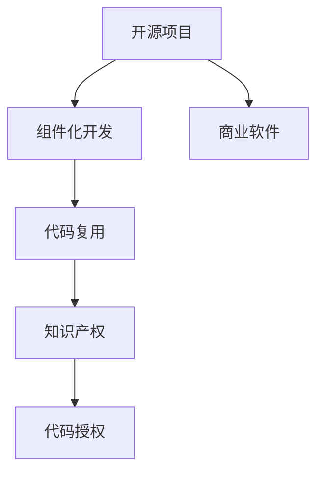

                 

# 软件2.0时代的代码复用与知识产权

## 1. 背景介绍

随着软件工程技术的不断演进，软件产业已经从传统的1.0时代迈入了2.0时代。在软件1.0时代，软件开发主要依赖于手写的代码，开发效率低、可维护性差。然而，随着计算机硬件的快速发展，开发工具的进步和开源运动的兴起，软件开发逐渐向组件化、模块化、平台化方向演进，形成了更加丰富和强大的开发环境。

### 1.1 软件2.0时代的特征

软件2.0时代的主要特征包括：
1. **组件化开发**：软件组件可以独立开发、测试和部署，便于复用和扩展。
2. **开源与协作**：开源项目和开源社区的崛起，促进了代码共享与协作。
3. **容器化与自动化**：Docker、Kubernetes等容器技术使软件部署更加灵活和可移植。
4. **DevOps文化**：强调开发与运维的紧密结合，提升软件交付速度和质量。

### 1.2 代码复用的重要性

代码复用是软件2.0时代的核心优势之一。通过复用已有的代码，开发者可以大大减少重复劳动，提高开发效率，同时降低开发成本和风险。例如，常见的Web框架、ORM框架、数据库连接池等组件，都是通过复用来提升应用开发速度和稳定性的。

然而，代码复用带来的另一个重要问题是知识产权问题。在开源和商业软件中，如何平衡代码复用和知识产权保护之间的关系，成为一个亟需解决的问题。

## 2. 核心概念与联系

### 2.1 核心概念概述

为了深入探讨软件2.0时代的代码复用与知识产权问题，我们先回顾一些核心概念：

- **软件组件(Software Component)**：可独立开发、测试和部署的软件模块或功能单元，通常以API或接口形式提供。
- **开源项目(Open Source Project)**：通过开源许可证发布，任何人都可以自由获取、使用和修改的软件项目。
- **商业软件(Commercial Software)**：以商业许可证发布，只能在特定的商业环境下使用和修改的软件产品。
- **代码复用(Code Reuse)**：将已有代码应用于新项目中，提升开发效率和代码质量。
- **知识产权(IP Rights)**：法律保护创作者对其创作作品的专有权利，包括版权、专利、商标等。

### 2.2 概念间的关系

这些核心概念之间存在紧密的联系，可以通过以下Mermaid流程图来展示：



这个流程图展示了代码复用与开源、商业软件以及知识产权之间的逻辑关系：

1. 开源项目和商业软件都是代码复用的重要来源。
2. 组件化开发通过代码复用提高开发效率。
3. 代码复用涉及对知识产权的授权使用。

接下来，我们将具体探讨代码复用和知识产权的相互作用，以及如何合理处理这些关系。

## 3. 核心算法原理 & 具体操作步骤

### 3.1 算法原理概述

软件2.0时代的代码复用与知识产权问题，本质上是一个法律和技术交织的问题。其核心在于如何在复用代码时，平衡知识产权保护和代码共享之间的关系。

以开源许可证为例，常见的开源许可证包括MIT、Apache、GPL等。这些许可证规定了用户可以如何使用、修改和分发开源代码。开发者在使用开源代码时，需要遵守许可证的要求，同时保留代码的知识产权。

### 3.2 算法步骤详解

以下是代码复用和知识产权处理的一般步骤：

1. **选择开源或商业组件**：根据项目需求选择合适的开源组件或商业组件。
2. **理解组件许可证**：详细阅读组件的许可证，理解其中的条款和条件。
3. **代码复用与授权**：在遵守许可证的前提下，将组件应用于新项目中，并保留对组件的知识产权。
4. **编写和使用代码**：按照组件API或接口进行代码编写和集成。
5. **遵守版权和专利要求**：在复用代码时，需要注意尊重原始作者的版权和专利权。

### 3.3 算法优缺点

代码复用的主要优点包括：
1. **提高开发效率**：复用已有的代码可以节省大量时间，提升开发速度。
2. **降低开发成本**：复用代码可以避免重复开发，降低人力和资源投入。
3. **提升代码质量**：复用的代码通常经过充分测试和优化，可靠性更高。

然而，代码复用也存在一些缺点：
1. **授权复杂性**：不同的开源组件可能使用不同的许可证，授权处理较为复杂。
2. **代码冲突**：不同组件之间的代码可能存在冲突，需要仔细处理。
3. **法律风险**：在使用商业组件时，需要注意商业许可证的限制。

### 3.4 算法应用领域

代码复用和知识产权问题在多个软件应用领域中都有涉及，包括：

- **Web开发**：常见的Web框架如Spring、Django、React等都是通过复用已有的组件来提升开发效率。
- **移动应用**：Android和iOS平台的开发，大量依赖开源库和组件。
- **企业应用**：大型企业应用通常使用多个开源组件和商业软件，需要进行复杂的代码复用和授权管理。

## 4. 数学模型和公式 & 详细讲解

### 4.1 数学模型构建

在软件2.0时代，代码复用与知识产权问题的数学模型可以构建为：

设 $C$ 为复用代码集合，$L$ 为许可证集合，$P$ 为项目需求集合，$U$ 为知识产权保护集合。

定义 $R$ 为代码复用关系，即 $R \subseteq C \times C$。

定义 $L_i$ 为组件 $c_i$ 的许可证，$i \in C$。

定义 $P_j$ 为项目 $p_j$ 的需求，$j \in P$。

定义 $U_k$ 为知识产权保护措施，$k \in U$。

### 4.2 公式推导过程

在代码复用过程中，需要满足以下条件：
1. 每个项目需求 $p_j$ 都可以通过复用代码 $c_i$ 和 $c_k$ 满足，即 $c_i, c_k \in C$。
2. 每个复用关系 $(c_i, c_k) \in R$ 都必须遵守 $c_i$ 的许可证 $L_i$ 和 $c_k$ 的许可证 $L_k$。
3. 复用代码 $c_i$ 和 $c_k$ 必须遵守项目 $p_j$ 的知识产权保护 $U_k$。

通过约束方程表示为：

$$
\begin{align*}
R &\subseteq C \times C \\
L_i &\text{ 满足 } R \\
L_k &\text{ 满足 } R \\
U_k &\text{ 满足 } R
\end{align*}
$$

### 4.3 案例分析与讲解

以下以Apache许可证为例，详细讲解代码复用和知识产权的案例分析。

假设我们需要在项目中复用Apache许可证下的组件 $c_i$。根据Apache许可证，我们可以：
1. 自由使用、修改、分发 $c_i$。
2. 保留对 $c_i$ 的版权声明。

但在复用 $c_i$ 时，需要遵守以下条件：
1. 对于任何使用或修改 $c_i$ 的代码，需要保留Apache许可证的声明。
2. 如果修改后的代码被分发或发布，必须保留Apache许可证的声明。

### 5. 项目实践：代码实例和详细解释说明

#### 5.1 开发环境搭建

假设我们使用Apache许可证下的开源组件 $c_i$，并希望复用到项目 $p_j$ 中。首先需要安装Apache许可证：

```bash
sudo apt-get install apache2
```

然后在项目中引入 $c_i$：

```python
from c_i import MyComponent
```

#### 5.2 源代码详细实现

接下来，我们需要编写代码来使用 $c_i$ 的API：

```python
my_component = MyComponent()
result = my_component.process_data(data)
```

#### 5.3 代码解读与分析

在代码复用时，需要注意以下几点：
1. 遵守Apache许可证的条件，保留许可证声明。
2. 合理处理修改后的代码，确保新的代码也遵守许可证要求。
3. 对于商业项目，需要特别关注商业许可证的限制。

#### 5.4 运行结果展示

假设我们使用 $c_i$ 的API进行数据处理，得到了正确的结果。此时，我们需要确认代码符合Apache许可证的要求，并在项目中保留许可证声明。

```python
from c_i import MyComponent

# 保留Apache许可证声明
import apache_license

def main():
    my_component = MyComponent()
    result = my_component.process_data(data)
    print(result)

if __name__ == '__main__':
    main()
```

## 6. 实际应用场景

### 6.1 开源社区的代码复用

开源社区为代码复用提供了丰富的资源。开发者可以在GitHub等平台上搜索和使用开源组件，通过拉取代码进行复用。例如，React组件库通过代码复用，大大提升了Web应用的开发效率。

### 6.2 商业软件的代码复用

商业软件通常提供了丰富的API和组件，开发者可以通过调用这些API和组件来加速开发。例如，AWS提供的AWS SDK可以方便地进行云计算服务调用。

### 6.3 企业内部的代码复用

在企业内部，开发者可以复用已有组件或系统架构，提升开发效率。例如，谷歌的Open Source组织鼓励员工分享和复用开源代码，提升整体开发效率。

### 6.4 未来应用展望

未来，代码复用和知识产权问题将更加复杂。随着人工智能、区块链、大数据等新技术的兴起，代码复用的法律和道德问题也将成为重要的研究方向。

## 7. 工具和资源推荐

### 7.1 学习资源推荐

- **《软件工程实践》**：详细介绍了软件开发的各个环节，包括代码复用和知识产权问题的处理方法。
- **《开源软件管理与许可证》**：介绍了开源许可证和开源软件的最佳实践。
- **《商业软件许可证与授权管理》**：介绍了商业软件的授权和管理方法。

### 7.2 开发工具推荐

- **GitHub**：提供代码托管和开源项目管理的平台。
- **Jenkins**：持续集成和持续部署工具，帮助自动化测试和部署。
- **Docker**：容器化技术，帮助管理软件环境。
- **Kubernetes**：容器编排工具，帮助自动化部署和管理。

### 7.3 相关论文推荐

- **《软件复用与知识产权》**：研究了软件复用与知识产权保护的法律问题。
- **《开源软件与组件化开发》**：研究了开源软件的组件化开发和复用方法。
- **《商业软件的代码复用与授权管理》**：研究了商业软件的代码复用和授权管理方法。

## 8. 总结：未来发展趋势与挑战

### 8.1 总结

软件2.0时代的代码复用与知识产权问题，是一个涉及法律、技术、社会等多个方面的复杂问题。代码复用为软件开发带来了巨大的效率提升，但也引发了知识产权保护的挑战。本文通过系统阐述代码复用和知识产权的关系，为开发者提供了参考。

### 8.2 未来发展趋势

未来，代码复用与知识产权问题将呈现以下趋势：
1. **代码复用更加广泛**：随着开源运动的兴起，代码复用将在更多场景中得到应用。
2. **授权管理更加自动化**：使用自动化工具处理授权问题，提升效率和准确性。
3. **跨领域代码复用**：跨领域的代码复用将促进不同学科的融合和创新。
4. **开源和商业协同**：开源和商业软件的协同发展，将带来更丰富的代码资源。

### 8.3 面临的挑战

尽管代码复用带来了诸多好处，但也需要关注以下挑战：
1. **授权复杂性**：不同的开源组件和商业许可证需要仔细处理。
2. **代码冲突**：不同组件之间的代码冲突需要仔细处理。
3. **法律风险**：商业软件的授权使用需要遵守相关法律法规。

### 8.4 研究展望

未来，代码复用与知识产权问题的研究可以从以下几个方向继续深入：
1. **自动化授权管理**：开发更加智能化的授权管理工具。
2. **跨领域代码复用**：研究跨领域的代码复用方法，促进不同学科的融合。
3. **隐私保护**：在使用开源代码时，如何保护代码中的隐私信息。
4. **商业软件开放性**：如何在商业软件中实现合理的开放性和闭源性。

总之，软件2.0时代的代码复用与知识产权问题是一个复杂而重要的研究课题。通过不断探索和实践，我们将在软件开发中更好地平衡代码复用和知识产权保护之间的关系，推动软件产业的健康发展。

## 9. 附录：常见问题与解答

**Q1: 什么是代码复用与知识产权问题？**

A: 代码复用是指将已有的代码应用于新项目中，提升开发效率和代码质量。知识产权问题是指在代码复用时，如何平衡代码共享和保护原始代码作者权益之间的关系。

**Q2: 如何使用Apache许可证的代码？**

A: 使用Apache许可证的代码，需要遵守许可证的条款和条件。具体步骤如下：
1. 保留Apache许可证的声明。
2. 遵守许可证中对代码使用和修改的限制。
3. 在修改后的代码中保留许可证声明。

**Q3: 如何处理代码冲突？**

A: 代码冲突通常是由于不同组件之间的API或接口定义不一致导致的。解决代码冲突的方法包括：
1. 使用兼容库或适配器，使不同组件能够协同工作。
2. 修改代码以适应不同的组件接口。
3. 使用依赖管理工具，如Maven或Pip，自动处理依赖冲突。

**Q4: 如何平衡商业软件和开源软件的授权问题？**

A: 商业软件和开源软件在授权方面有明显区别，处理授权问题需要特别注意以下几点：
1. 明确商业软件和开源软件的授权范围。
2. 遵守商业软件和开源软件的许可证条件。
3. 对于商业软件的开源版本，需要明确授权和兼容性要求。

**Q5: 代码复用对软件开发有哪些好处？**

A: 代码复用对软件开发有以下好处：
1. 提高开发效率：复用已有的代码可以节省大量时间，提升开发速度。
2. 降低开发成本：复用代码可以避免重复开发，降低人力和资源投入。
3. 提升代码质量：复用的代码通常经过充分测试和优化，可靠性更高。

---

作者：禅与计算机程序设计艺术 / Zen and the Art of Computer Programming

