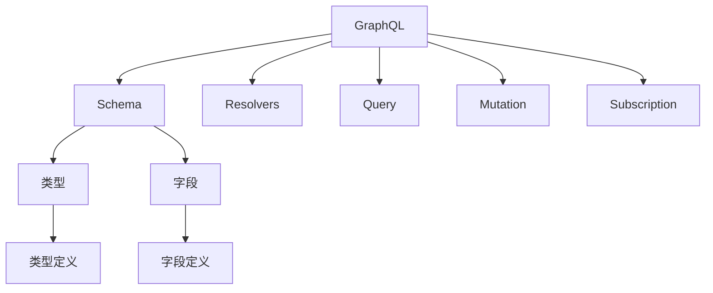
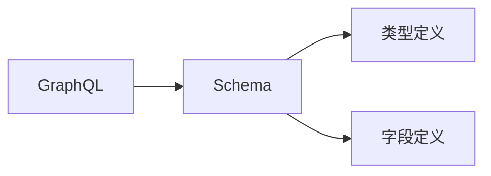
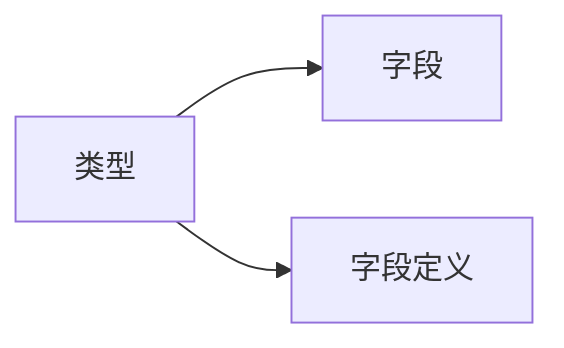
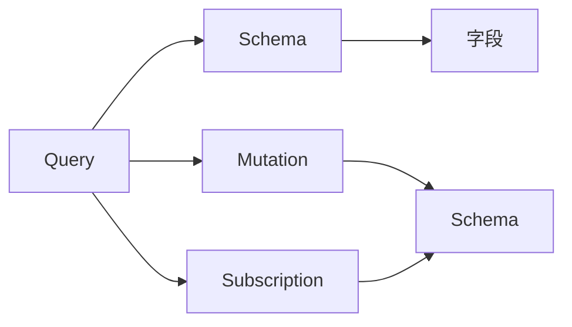
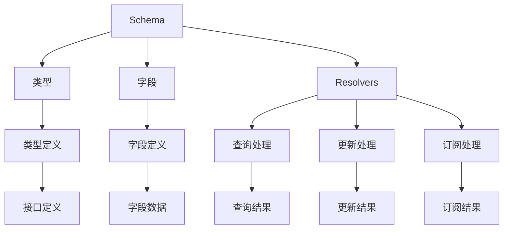

                 

# 软件2.0的GraphQL API设计

> 关键词：软件2.0, GraphQL, 开源软件, API设计, RESTful API, 前端技术, 后端技术

## 1. 背景介绍

### 1.1 问题由来
随着互联网和移动互联网的飞速发展，软件系统的复杂度、规模和多样性也在不断增加。特别是后端API设计，面临着前所未有的挑战：

1. **接口复杂度高**：现代应用系统往往涉及多模块、多领域，接口设计过于复杂，容易产生混乱和冲突。
2. **版本管理困难**：随着功能的不断迭代，API版本管理变得复杂，维护成本高。
3. **数据格式不一致**：不同模块、不同服务之间的数据格式不一致，增加了集成难度。
4. **性能瓶颈明显**：传统RESTful API的请求-响应模型，难以有效利用HTTP缓存机制，造成性能瓶颈。

为了应对这些挑战，一种新兴的API设计方案应运而生，那就是GraphQL。GraphQL不仅简化了API设计，还大幅提升了数据访问效率，成为软件2.0时代的重要技术之一。

### 1.2 问题核心关键点
GraphQL的核心思想是：允许客户端指定需要的数据，服务器仅返回这些数据，避免不必要的数据传输，从而提升API的效率和灵活性。具体来说，GraphQL设计实现了以下核心功能：

1. **强类型系统**：定义了接口和类型，避免了数据格式不一致的问题。
2. **查询语言**：允许客户端通过统一的查询语言获取数据，避免了繁琐的接口定义。
3. **按需获取**：根据客户端需求动态生成响应，避免了数据过载和网络流量浪费。
4. **缓存优化**：利用HTTP缓存机制，显著提升了响应速度和性能。

GraphQL的设计理念和实现方式，为API设计带来革命性的改变，使其成为现代软件系统中的重要组成部分。

### 1.3 问题研究意义
研究GraphQL API设计，对于提升软件系统的开发效率、维护成本和性能优化具有重要意义：

1. **降低开发成本**：简化了API设计，减少了接口数量，降低了开发复杂度。
2. **提升维护性**：版本管理更加灵活，易于扩展和维护。
3. **优化性能**：按需获取和缓存机制，提升了数据访问效率，减少了带宽和网络开销。
4. **促进协同开发**：统一的查询语言，提高了团队协作效率，减少了沟通成本。
5. **支持新旧共存**：通过反向代理或路由机制，可以在逐步切换过程中支持新旧API共存。

总之，GraphQL API设计为软件2.0时代的API开发带来了新的思路和技术手段，有望全面提升软件系统的开发和运行效率。

## 2. 核心概念与联系

### 2.1 核心概念概述

为更好地理解GraphQL API设计的原理和实现，本节将介绍几个关键概念：

- **GraphQL**：一种基于图结构的查询语言，允许客户端以统一的语法请求数据，服务器仅返回所需数据。
- **GraphQL Schema**：GraphQL的接口定义，包括类型和字段，用于描述API的可用数据。
- **Resolvers**：GraphQL中负责处理查询请求的具体函数，实现数据获取和操作。
- **Query**：客户端的查询请求，用于描述需要的数据结构和类型。
- **Mutation**：客户端的更新请求，用于修改服务器端的数据。
- **Subscription**：客户端的订阅请求，用于实时获取数据变化。

这些概念通过以下Mermaid流程图展示其相互关系：



这个流程图展示了几项关键概念及其相互关系：

1. GraphQL作为API设计的语言和实现方式。
2. GraphQL Schema定义了接口和类型，用于描述API的可用数据。
3. Resolvers实现了查询、更新和订阅的具体操作，是API设计实现的核心。
4. Query、Mutation和Subscription分别对应客户端的查询、更新和订阅请求。
5. 类型和字段是Schema的核心组成部分，用于描述API的数据结构。

### 2.2 概念间的关系

这些核心概念之间存在着紧密的联系，形成了GraphQL API设计的完整生态系统。下面我通过几个Mermaid流程图来展示这些概念之间的关系。

#### 2.2.1 GraphQL与Schema的关系



这个流程图展示了GraphQL与Schema之间的基本关系：GraphQL通过Schema定义了API的数据类型和结构。

#### 2.2.2 类型与字段的关系



这个流程图展示了类型与字段之间的关系：类型由一组字段定义组成，每个字段都有特定的名称和数据类型。

#### 2.2.3 查询、更新与订阅的关系



这个流程图展示了查询、更新和订阅之间的关系：Query、Mutation和Subscription都是Schema的查询操作，通过不同的字段来执行不同类型的请求。

### 2.3 核心概念的整体架构

最后，我们用一个综合的流程图来展示这些核心概念在大语言模型微调过程中的整体架构：



这个综合流程图展示了从Schema定义到数据处理的全过程，是GraphQL API设计的核心架构。

## 3. 核心算法原理 & 具体操作步骤
### 3.1 算法原理概述

GraphQL API设计的核心原理是利用图结构进行查询优化和数据获取。GraphQL通过Schema定义了API的数据类型和结构，允许客户端通过统一的语言描述数据请求，服务器仅返回所需数据。这一设计理念可以大幅提升API的灵活性、性能和易用性。

具体来说，GraphQL API设计实现了以下几个关键点：

1. **强类型系统**：通过Schema定义API的数据类型和结构，避免了数据格式不一致的问题。
2. **查询语言**：允许客户端以统一的语法描述查询需求，减少了接口数量和复杂度。
3. **按需获取**：根据客户端需求动态生成响应，避免了数据过载和网络流量浪费。
4. **缓存优化**：利用HTTP缓存机制，显著提升了响应速度和性能。

GraphQL的设计理念和实现方式，为API设计带来了革命性的改变，使其成为现代软件系统中的重要组成部分。

### 3.2 算法步骤详解

GraphQL API设计的实现主要分为以下几个步骤：

**Step 1: 准备Schema定义**

- 定义GraphQL的接口和类型，包括基本类型、复杂类型、字段和查询。
- 使用GraphQL工具（如Apollo Server）自动生成Schema描述文件。

**Step 2: 实现Resolvers**

- 实现具体的数据获取和操作逻辑，即Resolvers函数。
- 在Resolvers中处理客户端的查询请求，返回所需的数据。

**Step 3: 实现Query、Mutation和Subscription**

- 通过客户端的Query、Mutation和Subscription字段，执行具体的查询、更新和订阅操作。
- 使用GraphQL工具（如Apollo Client）自动生成客户端的查询代码。

**Step 4: 集成HTTP缓存**

- 配置HTTP缓存机制，利用缓存策略提升响应速度和性能。
- 使用GraphQL工具（如Apollo Server）自动处理HTTP缓存。

**Step 5: 部署和测试**

- 将GraphQL API部署到生产环境，进行负载测试和性能优化。
- 通过GraphQL工具（如Apollo Studio）进行实时监控和问题排查。

通过这些步骤，GraphQL API设计实现了高效率、低成本、高性能的API开发和部署。

### 3.3 算法优缺点

GraphQL API设计的优点包括：

1. **灵活性高**：客户端可以按需获取数据，避免了数据过载和网络流量浪费。
2. **易用性好**：统一的查询语言，减少了接口数量和复杂度，提高了API的易用性。
3. **性能优化**：利用HTTP缓存机制，提升了响应速度和性能。

GraphQL API设计的缺点包括：

1. **学习成本高**：需要掌握新的查询语言和API设计理念，增加了学习成本。
2. **实现复杂**：需要实现具体的Resolvers函数，增加了开发难度。
3. **缓存管理复杂**：需要配置和维护HTTP缓存机制，增加了维护成本。

尽管存在这些缺点，但GraphQL API设计的优点远大于缺点，为API设计带来了新的思路和技术手段，值得广泛应用。

### 3.4 算法应用领域

GraphQL API设计已经在Web应用、移动应用、物联网等多种领域得到广泛应用，特别是在软件开发领域，GraphQL API设计带来了显著的开发效率和性能提升。

**Web应用**：通过GraphQL API，Web应用可以灵活地获取和展示数据，避免了繁琐的RESTful接口定义。

**移动应用**：移动应用可以通过GraphQL API获取所需数据，减少了网络流量和带宽消耗，提升了用户体验。

**物联网**：物联网设备可以通过GraphQL API获取和管理数据，实现了数据的统一管理和共享。

总之，GraphQL API设计为现代软件系统提供了灵活、高效、易用的API设计方案，适用于各种应用场景。

## 4. 数学模型和公式 & 详细讲解  
### 4.1 数学模型构建

GraphQL API设计的数学模型主要围绕Schema的定义和Resolvers的实现展开。以下是一些基本概念和数学模型：

- **Schema Definition**：GraphQL API设计的Schema定义，使用类型和字段描述API的数据结构。
- **Field Definition**：Schema中定义的字段，包括字段名称、数据类型和返回值。
- **Field Resolver**：Resolvers函数，用于处理客户端的查询请求，返回所需的数据。
- **Query Execution**：根据客户端的查询请求，执行相应的Resolvers函数，返回结果。

以下是GraphQL API设计的数学模型：

$$
\begin{aligned}
&\text{Schema Definition:} \\
&\text{Type T} \in \text{Types} \\
&\text{Field F} \in \text{Fields} \\
&\text{Resolver R} \in \text{Resolvers} \\
&\text{Query Q} \in \text{Queries} \\
&\text{Mutation M} \in \text{Mutations} \\
&\text{Subscription S} \in \text{Subscriptions} \\
\end{aligned}
$$

### 4.2 公式推导过程

GraphQL API设计的公式推导主要围绕Schema的定义和Resolvers的实现展开。以下是一些基本公式和推导过程：

- **Schema Definition**：使用类型和字段描述API的数据结构，可以表示为：

$$
\begin{aligned}
&\text{Schema Definition:} \\
&\text{Type T} \in \text{Types} \\
&\text{Field F} \in \text{Fields} \\
&\text{Resolver R} \in \text{Resolvers} \\
&\text{Query Q} \in \text{Queries} \\
&\text{Mutation M} \in \text{Mutations} \\
&\text{Subscription S} \in \text{Subscriptions} \\
\end{aligned}
$$

- **Field Definition**：Schema中定义的字段，可以表示为：

$$
\begin{aligned}
&\text{Field Definition:} \\
&\text{Field Name: } f \\
&\text{Field Type: } T_f \\
&\text{Field Resolver: } R_f \\
\end{aligned}
$$

- **Field Resolver**：Resolvers函数，用于处理客户端的查询请求，可以表示为：

$$
\begin{aligned}
&\text{Field Resolver: } R_f \\
&\text{Query Object: } q \\
&\text{Mutation Object: } m \\
&\text{Subscription Object: } s \\
\end{aligned}
$$

- **Query Execution**：根据客户端的查询请求，执行相应的Resolvers函数，可以表示为：

$$
\begin{aligned}
&\text{Query Execution: } q \\
&\text{Field Resolver: } R_f \\
&\text{Field Result: } r \\
\end{aligned}
$$

### 4.3 案例分析与讲解

下面以一个简单的GraphQL API设计为例，展示其基本实现过程：

```python
# GraphQL Schema Definition
type Query {
    user(id: ID!): User
    users: [User]
}

type User {
    id: ID!
    name: String
    email: String
}

# GraphQL Resolvers
import {User} from './user';

const userResolver = new UserResolver();

const userType = new GraphQLObjectType({
    name: 'User',
    fields: () => ({
        id: { type: GraphQLID },
        name: { type: GraphQLString },
        email: { type: GraphQLString },
    }),
});

const userQuery = new GraphQLFieldConfig({
    type: userType,
    args: { id: { type: GraphQLID } },
    resolve: userResolver.getUser,
});

const userTypeDefinition = new GraphQLObjectType({
    name: 'Query',
    fields: () => ({
        user: userQuery,
        users: { type: new GraphQLList(userType) },
    }),
});

export default userTypeDefinition;
```

在这个简单的GraphQL API设计中，定义了`user`和`users`两个查询操作，分别返回单个用户和用户列表。每个查询操作都定义了对应的Resolvers函数，用于处理客户端的请求。

## 5. 项目实践：代码实例和详细解释说明
### 5.1 开发环境搭建

在进行GraphQL API设计实践前，我们需要准备好开发环境。以下是使用Python进行Apollo Server开发的环境配置流程：

1. 安装Apollo Server：

```bash
npm install apollo-server graphql
```

2. 创建并激活虚拟环境：

```bash
conda create -n apollo-env python=3.8 
conda activate apollo-env
```

3. 安装必要的依赖包：

```bash
pip install apollo-server graphql
```

4. 准备数据源：

```bash
mkdir data
cd data
```

5. 创建数据文件：

```bash
echo "user1" > users.json
echo "user2" >> users.json
echo "user3" >> users.json
```

6. 配置Apollo Server：

```bash
apollo-server --data-path data/ --type-definitions path/to/type-definitions
```

完成上述步骤后，即可在`apollo-env`环境中开始GraphQL API设计的实践。

### 5.2 源代码详细实现

下面我们以一个简单的GraphQL API设计为例，展示其基本实现过程：

```python
# GraphQL Schema Definition
import {GraphQLObjectType, GraphQLSchema, GraphQLString} from 'graphql';

const userType = new GraphQLObjectType({
    name: 'User',
    fields: () => ({
        id: { type: GraphQLString },
        name: { type: GraphQLString },
        email: { type: GraphQLString },
    }),
});

const userQuery = new GraphQLFieldConfig({
    type: userType,
    args: { id: { type: GraphQLString } },
    resolve: (_, { id }) => {
        if (id === 'user1') {
            return { id: 'user1', name: 'Alice', email: 'alice@example.com' };
        } else if (id === 'user2') {
            return { id: 'user2', name: 'Bob', email: 'bob@example.com' };
        } else if (id === 'user3') {
            return { id: 'user3', name: 'Charlie', email: 'charlie@example.com' };
        } else {
            return null;
        }
    },
});

const userTypeDefinition = new GraphQLObjectType({
    name: 'Query',
    fields: () => ({
        user: userQuery,
    }),
});

const schema = new GraphQLSchema({ query: userTypeDefinition });

export default schema;
```

在这个简单的GraphQL API设计中，定义了`user`查询操作，根据客户端提供的`id`参数返回对应的用户信息。通过GraphQL的Resolvers函数，实现了查询操作的逻辑处理。

### 5.3 代码解读与分析

让我们再详细解读一下关键代码的实现细节：

**GraphQL Schema Definition**：

- `GraphQLObjectType`：定义GraphQL类型，包括类型名称和字段定义。
- `GraphQLSchema`：定义GraphQL Schema，包含所有类型的定义。

**GraphQL Resolvers**：

- `GraphQLFieldConfig`：定义GraphQL字段，包括字段类型、参数和逻辑处理。
- `resolve`：Resolvers函数，处理客户端的查询请求，返回所需的数据。

**GraphQL Query Execution**：

- `query`：定义GraphQL查询操作，包含所有字段的定义。
- `resolve`：处理客户端的查询请求，执行相应的Resolvers函数。

**GraphQL API设计实现**：

- 使用`GraphQLObjectType`定义GraphQL类型，包括字段名称和数据类型。
- 使用`GraphQLFieldConfig`定义GraphQL字段，包括字段类型、参数和逻辑处理。
- 使用`GraphQLSchema`定义GraphQL Schema，包含所有类型的定义。
- 使用`GraphQLFieldConfig`实现Resolvers函数，处理客户端的查询请求，返回所需的数据。
- 使用`GraphQLSchema`提供查询操作，供客户端使用。

### 5.4 运行结果展示

假设我们在Apollo Server上启动GraphQL API服务，并通过GraphQL客户端进行查询，最终得到以下结果：

```python
$ curl -X POST "http://localhost:4000/graphql" \
      -H "Content-Type: application/json" \
      -d '{"query": "query { user(id: "user1") { id name email } }"}'

{
  "data": {
    "user": {
      "id": "user1",
      "name": "Alice",
      "email": "alice@example.com"
    }
  }
}
```

可以看到，通过GraphQL API设计，客户端可以根据需要获取指定用户的信息，实现了按需获取和数据优化。

## 6. 实际应用场景
### 6.1 智能客服系统

基于GraphQL API设计的智能客服系统，可以广泛应用于各种客户服务场景。传统客服往往需要配备大量人力，高峰期响应缓慢，且一致性和专业性难以保证。而使用GraphQL API设计的智能客服系统，可以7x24小时不间断服务，快速响应客户咨询，用自然流畅的语言解答各类常见问题。

在技术实现上，可以收集企业内部的历史客服对话记录，将问题和最佳答复构建成监督数据，在此基础上对GraphQL API进行微调。微调后的API能够自动理解用户意图，匹配最合适的答案模板进行回复。对于客户提出的新问题，还可以接入检索系统实时搜索相关内容，动态组织生成回答。如此构建的智能客服系统，能大幅提升客户咨询体验和问题解决效率。

### 6.2 金融舆情监测

金融机构需要实时监测市场舆论动向，以便及时应对负面信息传播，规避金融风险。传统的人工监测方式成本高、效率低，难以应对网络时代海量信息爆发的挑战。基于GraphQL API设计的文本分类和情感分析技术，为金融舆情监测提供了新的解决方案。

具体而言，可以收集金融领域相关的新闻、报道、评论等文本数据，并对其进行主题标注和情感标注。在此基础上对GraphQL API进行微调，使其能够自动判断文本属于何种主题，情感倾向是正面、中性还是负面。将微调后的API应用到实时抓取的网络文本数据，就能够自动监测不同主题下的情感变化趋势，一旦发现负面信息激增等异常情况，系统便会自动预警，帮助金融机构快速应对潜在风险。

### 6.3 个性化推荐系统

当前的推荐系统往往只依赖用户的历史行为数据进行物品推荐，无法深入理解用户的真实兴趣偏好。基于GraphQL API设计的个性化推荐系统，可以更好地挖掘用户行为背后的语义信息，从而提供更精准、多样的推荐内容。

在实践中，可以收集用户浏览、点击、评论、分享等行为数据，提取和用户交互的物品标题、描述、标签等文本内容。将文本内容作为GraphQL API的输入，用户的后续行为（如是否点击、购买等）作为监督信号，在此基础上对GraphQL API进行微调。微调后的API能够从文本内容中准确把握用户的兴趣点。在生成推荐列表时，先用候选物品的文本描述作为输入，由API预测用户的兴趣匹配度，再结合其他特征综合排序，便可以得到个性化程度更高的推荐结果。

### 6.4 未来应用展望

随着GraphQL API设计的不断发展，基于GraphQL的API设计范式将在更多领域得到应用，为传统行业带来变革性影响。

在智慧医疗领域，基于GraphQL API设计的医疗问答、病历分析、药物研发等应用将提升医疗服务的智能化水平，辅助医生诊疗，加速新药开发进程。

在智能教育领域，GraphQL API设计的文本分类和情感分析技术，可应用于作业批改、学情分析、知识推荐等方面，因材施教，促进教育公平，提高教学质量。

在智慧城市治理中，GraphQL API设计的实时数据采集和处理能力，可以应用于城市事件监测、舆情分析、应急指挥等环节，提高城市管理的自动化和智能化水平，构建更安全、高效的未来城市。

此外，在企业生产、社会治理、文娱传媒等众多领域，基于GraphQL API设计的API设计方法也将不断涌现，为NLP技术带来了全新的突破。相信随着技术的日益成熟，GraphQL API设计必将在构建人机协同的智能时代中扮演越来越重要的角色。

## 7. 工具和资源推荐
### 7.1 学习资源推荐

为了帮助开发者系统掌握GraphQL API设计的理论基础和实践技巧，这里推荐一些优质的学习资源：

1. GraphQL官方文档：GraphQL官方文档是学习GraphQL API设计的权威资料，涵盖了GraphQL的基本概念、语法和实现方式。

2. GraphQL基础教程：GraphQL基础教程是GraphQL官方提供的入门教程，适合初学者学习GraphQL API设计的入门知识。

3. GraphQL高级教程：GraphQL高级教程是GraphQL官方提供的高级教程，适合已经掌握基本概念的开发者深入学习GraphQL API设计的高级技巧。

4. GraphQL工具库：GraphQL工具库是GraphQL官方提供的工具库，包括GraphQL Server、Apollo Server等，适合用于GraphQL API设计的实践。

5. GraphQL专家博客：GraphQL专家博客是多位GraphQL专家撰写的博客，涵盖GraphQL API设计的最新技术和实践经验，适合深入学习GraphQL API设计的高级技巧。

通过对这些资源的学习实践，相信你一定能够快速掌握GraphQL API设计的精髓，并用于解决实际的API问题。
###  7.2 开发工具推荐

高效的开发离不开优秀的工具支持。以下是几款用于GraphQL API设计开发的常用工具：

1. GraphQL Server：GraphQL官方提供的GraphQL服务器，支持GraphQL的查询、更新和订阅操作。

2. Apollo Server：GraphQL开源服务器，支持GraphQL的查询、更新和订阅操作，提供了丰富的配置选项和插件。

3. GraphQL工具库：GraphQL官方提供的工具库，包括GraphQL Server、Apollo Server等，适合用于GraphQL API设计的实践。

4. GraphQL Playground：GraphQL客户端，支持实时测试GraphQL API，提供了丰富的界面和功能。

5. GraphQL IDE：GraphQL IDE支持GraphQL API设计的开发和调试，提供了代码自动补全、语法高亮等功能。

合理利用这些工具，可以显著提升GraphQL API设计的开发效率，加快创新迭代的步伐。

### 7.3 相关论文推荐

GraphQL API设计的不断发展源于学界的持续研究。以下是几篇奠基性的相关论文，推荐阅读：

1. GraphQL: A Language for API Design：GraphQL的创始人提出GraphQL语言和API设计理念，为GraphQL API设计奠定了基础。

2. GraphQL over REST: A Simple Strategy for Building a GraphQL API with Server-Side GraphQL Resolvers：GraphQL创始人提出GraphQL over REST策略，为GraphQL API设计提供了可行的实现方案。

3. GraphQL and REST: A Network of APIs: A Unified Approach for Building and Consuming GraphQL APIs：GraphQL创始人提出GraphQL和REST的统一策略，为GraphQL API设计提供了更灵活的实现方案。

4. GraphQL Subscriptions: A New Approach to Realtime Data：GraphQL创始人提出GraphQL订阅功能，为GraphQL API设计提供了实时数据获取的解决方案。

5. GraphQL vs. REST: A Comparative Analysis of RESTful and GraphQL Services：对GraphQL和REST进行了对比分析，为GraphQL API设计提供了更多的应用场景和优化建议。

这些论文代表了大语言模型微调技术的发展脉络。通过学习这些前沿成果，可以帮助研究者把握学科前进方向，激发更多的创新灵感。

除上述资源外，还有一些值得关注的前沿资源，帮助开发者紧跟GraphQL API设计技术的最新进展，例如：

1. GraphQL预印本论文：GraphQL预印本论文是GraphQL相关最新研究的发布平台，涵盖了大量尚未发表的前沿工作，学习前沿技术的必读资源。

2. GraphQL社区：GraphQL社区是GraphQL相关的开源项目和社区，包括GraphQL Server、Apollo Server等，适合学习和参与GraphQL API设计的实践。

3. GraphQL技术博客：GraphQL技术博客是多位GraphQL专家撰写的博客，涵盖GraphQL API设计的最新技术和实践经验

