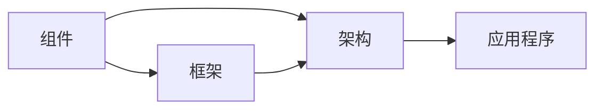
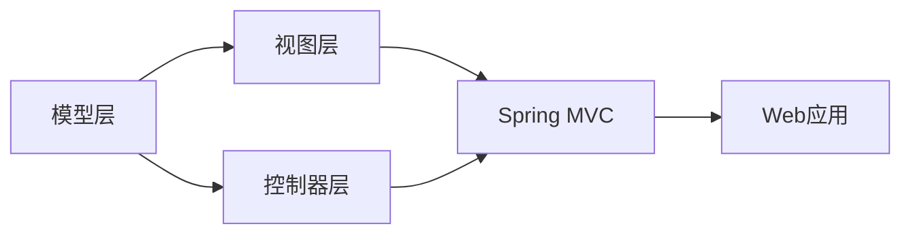

                 

# 软件2.0的优势：为何要将复杂程序移植其中

## 1. 背景介绍

随着技术的发展，软件开发的方式发生了翻天覆地的变化。从最初的机器语言编程，到后来的高级语言，再到框架化编程，以及近期的软件2.0运动，软件开发的演进体现出了从低级到高级，从重复性劳动到创造性劳动的转变。软件2.0，或者说基于框架和组件的编程范式，已经在业界得到了广泛的应用和认可。本文旨在探讨软件2.0的优势，并阐述为何复杂程序应考虑将其移植到软件2.0中。

## 2. 核心概念与联系

### 2.1 核心概念概述

为了更深入地理解软件2.0的优势，我们需要首先了解一些关键概念：

- **软件2.0（Software 2.0）**：一种基于组件和框架的编程范式，通过将程序拆分成独立可复用的组件，并通过框架来管理这些组件之间的交互，从而简化编程过程，提高代码的可维护性和可扩展性。
- **组件（Component）**：软件系统中可独立部署和复用的模块，通常包含定义清晰的接口和内部实现。
- **框架（Framework）**：一种预定义的程序结构，提供了一组规则和接口，供组件在其中实现其特定功能。框架通常包含抽象层和工具，用于简化组件之间的交互。
- **架构（Architecture）**：软件系统的整体结构设计，定义了系统组件之间的相互关系和数据流动路径。

### 2.2 核心概念原理和架构的 Mermaid 流程图



这个流程图展示了组件、框架和架构之间的关系。组件是软件系统的基本单元，框架为组件之间的交互提供了规则和接口，架构则定义了组件和框架的组织结构。在软件2.0范式中，这些组件和框架相互协作，形成了一个灵活、可扩展的软件系统。

## 3. 核心算法原理 & 具体操作步骤

### 3.1 算法原理概述

软件2.0的优势在于其组件化、模块化和框架化的设计思路。通过将复杂程序拆分为独立的组件，并使用框架来管理这些组件之间的交互，可以显著降低开发成本，提高代码的可维护性和可扩展性。以下是软件2.0的算法原理概述：

1. **组件化**：将程序拆分为独立的、功能单一的组件，每个组件专注于特定的功能，并通过清晰、简单的接口与其他组件交互。
2. **框架化**：使用框架来管理组件之间的交互，提供了一组规则和接口，简化组件之间的通信。
3. **架构设计**：设计灵活的架构，支持组件和框架的自由组合和扩展，以适应不同的应用场景。

### 3.2 算法步骤详解

软件2.0的实现过程主要包括以下几个关键步骤：

**Step 1: 组件设计**

- 确定系统需求，将程序拆分为若干独立的组件，每个组件负责特定的功能。
- 设计组件接口，定义组件之间的通信规则和数据格式。
- 确定组件的内部实现，确保组件的功能实现符合接口要求。

**Step 2: 框架选择**

- 选择合适的框架，根据系统的需求和架构设计，选择适合的框架。
- 根据框架文档，配置框架的环境和依赖。
- 在框架中定义组件的注册、装配和启动流程。

**Step 3: 组件装配**

- 将设计好的组件按照架构设计进行装配，形成完整的系统结构。
- 配置组件之间的依赖关系，确保组件能够正确地相互通信。
- 启动组件，进行系统测试和调试。

**Step 4: 持续集成和交付**

- 使用持续集成工具，自动化构建和测试过程。
- 自动化部署组件到目标环境，确保系统的高可用性和可靠性。
- 通过版本控制和配置管理工具，确保系统的持续更新和维护。

### 3.3 算法优缺点

软件2.0的优点主要体现在以下几个方面：

- **可维护性高**：组件化、模块化的设计思路，使得代码更易于理解和维护，减少了代码冗余和错误。
- **可扩展性好**：灵活的架构设计，支持组件和框架的自由组合和扩展，可以快速适应新的需求和变化。
- **开发效率高**：使用框架简化组件之间的通信，减少了开发时间和复杂度。
- **代码复用率高**：组件可以独立部署和复用，减少了重复的代码编写。

然而，软件2.0也存在一些缺点：

- **学习曲线陡峭**：使用框架和组件需要一定的学习成本，需要开发者具备一定的编程和架构设计能力。
- **性能开销**：框架和组件之间的通信和调用可能会引入一定的性能开销，需要优化以避免性能瓶颈。
- **依赖管理复杂**：组件和框架的依赖关系管理复杂，需要仔细配置以避免版本冲突和兼容性问题。

### 3.4 算法应用领域

软件2.0的适用范围非常广泛，几乎涵盖了所有类型的软件开发项目。以下是一些典型的应用领域：

- **Web应用开发**：使用MVC框架（如Spring、Django等），将Web应用拆分为模型、视图和控制器，提高开发效率和可维护性。
- **移动应用开发**：使用React Native、Flutter等跨平台框架，将应用组件化，跨平台开发和部署。
- **游戏开发**：使用Unity、Unreal Engine等游戏引擎，将游戏逻辑和渲染引擎组件化，提高开发效率和性能。
- **企业级应用**：使用JavaEE、.NET等企业级框架，将应用拆分为微服务，支持高可用性和可扩展性。
- **数据科学**：使用TensorFlow、PyTorch等框架，将模型组件化，支持复杂数据分析和机器学习应用。

## 4. 数学模型和公式 & 详细讲解 & 举例说明

### 4.1 数学模型构建

软件2.0的数学模型可以抽象为一个图结构，其中节点代表组件，边代表组件之间的通信和依赖关系。设系统中有 $N$ 个组件，则数学模型可以表示为：

$$
G=(V,E)
$$

其中 $V$ 为组件集合，$E$ 为组件之间的通信边集合。组件之间的通信可以通过消息传递、事件触发等方式实现，通信边上的权重表示通信成本或复杂度。

### 4.2 公式推导过程

设组件 $i$ 和 $j$ 之间的通信代价为 $C_{ij}$，则组件之间的总通信代价为：

$$
\sum_{(i,j) \in E} C_{ij}
$$

使用软件2.0框架后，组件之间的通信代价会得到一定的优化，假设优化系数为 $\lambda$，则总通信代价为：

$$
\lambda \sum_{(i,j) \in E} C_{ij}
$$

当 $\lambda$ 趋近于1时，通信代价最小化，系统性能最优。因此，框架设计时需要选择合适的优化策略，平衡组件之间的通信和性能。

### 4.3 案例分析与讲解

以一个简单的Web应用为例，使用MVC框架进行开发。将Web应用拆分为模型层（Model）、视图层（View）和控制器层（Controller）三个组件，模型层负责数据访问，视图层负责界面渲染，控制器层负责业务逻辑和视图层的交互。使用Spring框架进行组件的装配和启动，并使用Spring MVC进行组件之间的通信。系统架构如下图所示：



在这个架构中，Spring MVC框架简化了很多组件之间的通信，例如控制器和视图之间的数据传递。组件之间的通信代价可通过Spring MVC提供的接口和注解进行优化，从而提高系统的性能和可维护性。

## 5. 项目实践：代码实例和详细解释说明

### 5.1 开发环境搭建

在软件2.0的项目实践中，开发环境的选择非常重要。以下是一个典型的开发环境配置流程：

1. **安装操作系统和开发工具**：选择合适的操作系统和开发工具，如Ubuntu、Windows、Xcode、Eclipse等。
2. **安装开发环境**：安装Java、Python、Node.js等开发环境，以及相应的框架和库。
3. **版本控制**：使用Git等版本控制工具，进行代码管理和版本控制。
4. **持续集成**：使用Jenkins、Travis CI等持续集成工具，自动化构建和测试过程。
5. **容器化部署**：使用Docker等容器化工具，实现组件的快速部署和迁移。

### 5.2 源代码详细实现

以一个简单的Web应用为例，使用Spring MVC框架进行组件化开发。

**组件设计**

- 模型层（Model）：定义数据模型和数据访问接口，例如用户、商品等模型类。
- 视图层（View）：定义HTML页面和JSP模板，使用Spring MVC提供的视图注解（如 @Controller、@RequestMapping等）进行配置。
- 控制器层（Controller）：定义控制器类，处理业务逻辑和视图层交互，例如用户注册、商品列表展示等业务逻辑。

**框架选择**

- 选择Spring框架进行组件装配和启动。
- 配置Spring MVC框架，定义组件之间的通信和依赖关系。
- 使用Spring Boot进行组件的快速部署和启动。

**组件装配**

- 将模型、视图和控制器进行装配，形成完整的系统结构。
- 配置组件之间的依赖关系，例如控制器依赖模型、视图依赖控制器等。
- 启动组件，进行系统测试和调试。

**持续集成和交付**

- 使用Jenkins自动化构建和测试过程，进行代码的持续集成和版本管理。
- 使用Docker容器化组件，进行快速部署和迁移。
- 使用JIRA等项目管理工具，进行任务分配和进度跟踪。

### 5.3 代码解读与分析

在Spring MVC框架中，控制器类（Controller）是处理业务逻辑和视图层交互的核心组件。以下是一个简单的控制器类示例：

```java
@Controller
public class UserController {
    @Autowired
    private UserService userService;
    
    @GetMapping("/users")
    public ModelAndView listUsers(ModelAndView modelAndView) {
        List<User> users = userService.list();
        modelAndView.addObject("users", users);
        modelAndView.setViewName("users/list");
        return modelAndView;
    }
    
    @GetMapping("/user/{id}")
    public ModelAndView getUserById(@PathVariable("id") Long id, ModelAndView modelAndView) {
        User user = userService.getById(id);
        modelAndView.addObject("user", user);
        modelAndView.setViewName("users/detail");
        return modelAndView;
    }
}
```

在这个控制器类中，使用@Autowired注解注入UserService服务，处理用户列表展示和用户详情展示等业务逻辑。使用@Controller和@RequestMapping注解定义控制器类的路由规则，简化组件之间的通信。通过Spring MVC提供的视图注解，实现视图渲染。

### 5.4 运行结果展示

假设在项目中使用了Spring Boot进行组件的快速部署和启动。启动应用程序后，访问控制器路由地址，例如http://localhost:8080/users，即可展示用户列表。

## 6. 实际应用场景

软件2.0已经在诸多行业和应用场景中得到了广泛的应用，以下是一些典型的应用场景：

### 6.1 Web应用开发

- **电商网站**：使用Spring Boot和Spring MVC框架，将电商应用拆分为用户管理、商品管理、订单管理等组件，通过RESTful API进行组件之间的通信。
- **金融网站**：使用Spring Boot和Spring MVC框架，将金融应用拆分为交易管理、风险控制、客户服务等功能组件，通过Spring Boot提供的API Gateway进行组件的统一管理和调度。

### 6.2 移动应用开发

- **跨平台移动应用**：使用React Native、Flutter等框架，将移动应用拆分为UI组件、业务逻辑组件和数据访问组件，通过框架提供的组件库和API进行组件的快速开发和部署。
- **原生移动应用**：使用Xcode、Android Studio等工具，将原生移动应用拆分为界面组件、业务逻辑组件和数据访问组件，通过MVC或MVVM模式进行组件的装配和通信。

### 6.3 企业级应用

- **企业级CRM系统**：使用JavaEE、.NET等框架，将企业级CRM系统拆分为客户管理、销售管理、服务管理等功能组件，通过RESTful API进行组件之间的通信。
- **企业级ERP系统**：使用Spring Boot和Spring MVC框架，将企业级ERP系统拆分为供应链管理、财务会计、人力资源管理等功能组件，通过Spring Boot提供的API Gateway进行组件的统一管理和调度。

### 6.4 游戏开发

- **3D游戏**：使用Unity、Unreal Engine等游戏引擎，将游戏逻辑和渲染引擎组件化，通过组件库和API进行组件的快速开发和部署。
- **Web游戏**：使用Phaser、Three.js等Web游戏框架，将游戏逻辑和渲染引擎组件化，通过框架提供的组件库和API进行组件的快速开发和部署。

## 7. 工具和资源推荐

### 7.1 学习资源推荐

为了帮助开发者系统掌握软件2.0的理论基础和实践技巧，这里推荐一些优质的学习资源：

1. **《深入理解JavaEE》系列书籍**：深入介绍JavaEE框架的架构设计和应用实践，是Java开发者必备的学习资料。
2. **《Spring Boot实战》系列书籍**：全面介绍Spring Boot框架的使用方法和最佳实践，适合Spring Boot开发者。
3. **《Django实战》系列书籍**：深入介绍Django框架的使用方法和最佳实践，适合Django开发者。
4. **《React Native实战》系列书籍**：全面介绍React Native框架的使用方法和最佳实践，适合移动应用开发者。
5. **《Unity游戏编程》系列书籍**：深入介绍Unity游戏引擎的使用方法和最佳实践，适合游戏开发者。

通过对这些资源的学习实践，相信你一定能够快速掌握软件2.0的精髓，并用于解决实际的开发问题。

### 7.2 开发工具推荐

高效的开发离不开优秀的工具支持。以下是几款用于软件2.0开发的工具：

1. **IntelliJ IDEA**：一个强大的Java开发工具，支持Maven、Gradle等构建工具，提供代码提示、重构、调试等功能。
2. **Visual Studio Code**：一个功能丰富的代码编辑器，支持JavaScript、TypeScript等语言，提供丰富的扩展和插件。
3. **Eclipse**：一个开放源代码的IDE，支持Java、C++等语言，提供代码提示、重构、调试等功能。
4. **Jenkins**：一个开源的持续集成工具，支持多种构建和测试方式，提供丰富的插件和扩展。
5. **Docker**：一个开源的容器化工具，支持容器镜像的快速部署和迁移。
6. **JIRA**：一个开源的项目管理工具，提供任务分配、进度跟踪等功能。

合理利用这些工具，可以显著提升软件2.0项目的开发效率，加快创新迭代的步伐。

### 7.3 相关论文推荐

软件2.0的研究涉及多个领域，以下是一些经典的研究论文，推荐阅读：

1. **《软件2.0: 基于组件的编程范式》**：介绍了软件2.0的架构设计和应用实践，是软件开发者必读的研究文献。
2. **《基于Spring的Web应用开发》**：详细介绍Spring MVC框架的使用方法和最佳实践，适合Spring MVC开发者。
3. **《React Native开发实战》**：全面介绍React Native框架的使用方法和最佳实践，适合React Native开发者。
4. **《Unity游戏编程实战》**：深入介绍Unity游戏引擎的使用方法和最佳实践，适合Unity开发者。
5. **《软件2.0的持续集成和交付》**：详细介绍软件2.0项目的持续集成和交付工具，适合软件开发者。

## 8. 总结：未来发展趋势与挑战

### 8.1 研究成果总结

软件2.0的演进标志着软件开发范式的重大转变，其组件化、模块化和框架化的设计思路，极大提高了软件的开发效率和可维护性。通过拆分复杂程序为独立的组件，并通过框架进行管理，可以实现组件的快速开发和部署，提高系统的可扩展性和可维护性。

### 8.2 未来发展趋势

展望未来，软件2.0将继续在软件开发领域发挥重要作用，以下是一些未来的发展趋势：

1. **微服务架构**：微服务架构将成为软件2.0的主要架构设计方式，通过将应用拆分为多个小型服务，支持高可用性和可扩展性。
2. **容器化部署**：容器化技术将成为软件2.0的主要部署方式，通过Docker等工具，实现组件的快速部署和迁移。
3. **DevOps文化**：DevOps文化将成为软件2.0的主要开发模式，通过持续集成和持续交付，实现快速迭代和快速反馈。
4. **人工智能技术**：人工智能技术将成为软件2.0的重要支撑，通过机器学习和大数据技术，优化软件系统的性能和用户体验。
5. **跨平台开发**：跨平台开发将成为软件2.0的主要开发方式，通过React Native、Flutter等框架，实现多平台应用开发。

### 8.3 面临的挑战

尽管软件2.0已经取得了瞩目成就，但在迈向更加智能化、普适化应用的过程中，它仍面临着诸多挑战：

1. **学习曲线陡峭**：软件2.0的设计理念和开发模式需要一定的学习成本，需要开发者具备一定的编程和架构设计能力。
2. **性能开销**：框架和组件之间的通信和调用可能会引入一定的性能开销，需要优化以避免性能瓶颈。
3. **依赖管理复杂**：组件和框架的依赖关系管理复杂，需要仔细配置以避免版本冲突和兼容性问题。
4. **组件复用性差**：组件的复用性差，需要开发者进行大量的重复性工作，增加了开发成本。
5. **跨平台兼容性**：跨平台开发需要处理大量的兼容性问题，增加了开发和维护的难度。

### 8.4 研究展望

面对软件2.0所面临的挑战，未来的研究需要在以下几个方面寻求新的突破：

1. **设计更加灵活的架构**：通过微服务架构、容器化部署等方式，设计更加灵活的软件架构，支持高可用性和可扩展性。
2. **优化组件之间的通信**：通过使用高性能的通信协议和优化组件之间的通信，减少通信开销，提高系统性能。
3. **改进依赖管理工具**：开发更加智能的依赖管理工具，支持动态依赖分析和管理，减少依赖冲突和兼容性问题。
4. **提高组件的复用性**：开发更加通用的组件库和框架，提高组件的复用性，减少重复性工作。
5. **支持跨平台开发**：开发更加兼容性的跨平台开发框架，支持多平台应用开发。

这些研究方向的探索，必将引领软件2.0技术迈向更高的台阶，为软件开发带来新的突破。只有不断创新、不断优化，才能使软件2.0技术在未来的软件开发中发挥更大的作用。

## 9. 附录：常见问题与解答

**Q1：软件2.0与传统软件开发的区别是什么？**

A: 软件2.0通过组件化、模块化和框架化的设计思路，将复杂程序拆分为独立的组件，并通过框架进行管理，简化了开发过程，提高了代码的可维护性和可扩展性。而传统软件开发则是从零开始进行编码，依赖性强，维护成本高。

**Q2：如何将复杂程序移植到软件2.0中？**

A: 将复杂程序拆分为独立的组件，并使用框架进行管理。组件之间通过接口进行通信，框架提供了一组规则和接口，简化组件之间的通信。设计灵活的架构，支持组件和框架的自由组合和扩展。

**Q3：软件2.0的学习曲线陡峭吗？**

A: 软件2.0的设计理念和开发模式需要一定的学习成本，需要开发者具备一定的编程和架构设计能力。但通过系统学习和实践，可以逐步掌握软件2.0的核心思想和开发技巧。

**Q4：软件2.0是否支持跨平台开发？**

A: 是的，软件2.0支持跨平台开发。使用React Native、Flutter等框架，可以将应用组件化，跨平台开发和部署。同时，使用Spring Boot和Spring MVC框架，可以支持多平台应用开发。

**Q5：软件2.0的性能开销大吗？**

A: 软件2.0的性能开销取决于框架和组件之间的通信和调用。通过优化组件之间的通信，选择合适的框架和依赖管理工具，可以最大限度地减少性能开销。同时，通过微服务架构和容器化部署，提高系统的可扩展性和可维护性。

---

作者：禅与计算机程序设计艺术 / Zen and the Art of Computer Programming

