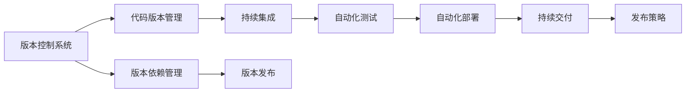

                 

# 软件2.0的版本管理与发布策略

## 1. 背景介绍

在软件开发的演进过程中，版本管理和发布策略一直是项目成功与否的关键因素。随着软件开发模式的迭代，从传统的软件1.0时代，到如今的软件2.0时代，软件交付的理念、工具和策略都在经历变革。

### 1.1 软件1.0时代的版本管理与发布

在软件1.0时代，软件开发遵循线性、瀑布式的开发流程，主要依赖于版本控制系统（如SVN、Git）进行代码版本管理。版本管理的核心目标是通过对代码的精确控制，确保不同开发者之间的协作顺利进行。版本发布通常是计划内的，按照预定的时间表进行。

软件1.0时代的版本管理以静态部署为主，软件的功能和性能是固定的，开发者通过手动升级或发布新版本来实现功能的迭代和改进。这种模式虽然能够确保软件质量的可控性，但由于版本发布周期长、部署复杂，导致软件交付速度慢，适应市场变化的能力不足。

### 1.2 软件2.0时代的到来

随着云计算、容器化技术、持续集成（CI）和持续交付（CD）等新技术的兴起，软件2.0时代应运而生。软件2.0强调敏捷开发、快速迭代、持续交付和实时反馈，强调软件功能、性能和用户体验的持续提升。

软件2.0时代的版本管理不再局限于代码版本控制，更注重版本之间的依赖关系管理、功能变更影响评估、自动化测试和快速部署。版本发布策略也变得更加灵活，能够支持增量发布、功能发布、滚动发布等多种发布模式，同时提供自动化部署、回滚机制和安全性保障。

## 2. 核心概念与联系

### 2.1 核心概念概述

要深入理解软件2.0时代的版本管理与发布策略，首先需要了解以下几个核心概念：

- **版本控制系统（Version Control System, VCS）**：用于管理代码变更的历史和状态的工具。常见的VCS包括Git、SVN、Mercurial等。
- **容器化（Containerization）**：通过容器技术（如Docker）将软件及其依赖打包成独立的运行单元，方便部署和管理。
- **持续集成（Continuous Integration, CI）**：在软件开发的整个生命周期内，通过自动化构建和测试，确保软件质量的持续改进。
- **持续交付（Continuous Delivery, CD）**：将软件自动构建、测试并通过管道交付到生产环境，实现快速、可靠的软件发布。
- **版本依赖管理（Version Dependency Management）**：在软件的不同版本之间，管理各个组件之间的依赖关系，确保版本兼容性和稳定性。
- **自动化部署（Automated Deployment）**：通过自动化工具（如Jenkins、Kubernetes）实现软件的快速部署，减少人为错误和提高效率。

### 2.2 核心概念之间的关系

这些核心概念之间的关系可以通过以下Mermaid流程图来展示：



这个流程图展示了核心概念之间的逻辑关系：

1. **版本控制系统**：管理代码的变更历史和状态，确保多个开发者之间的协作。
2. **代码版本管理**：通过分支、标签等机制，对代码进行精确控制。
3. **版本依赖管理**：在软件的不同版本之间，管理组件之间的依赖关系。
4. **持续集成**：通过自动化构建和测试，确保软件质量的持续改进。
5. **自动化测试**：在持续集成过程中，对软件进行全面的测试。
6. **自动化部署**：通过自动化工具实现软件的快速部署。
7. **持续交付**：将软件自动构建、测试并通过管道交付到生产环境。
8. **发布策略**：根据业务需求，选择合适的发布模式（如增量发布、功能发布、滚动发布等）。

这些概念共同构成了软件2.0时代版本管理和发布策略的完整框架，旨在通过自动化和持续化的方式，提高软件的交付速度和质量。

## 3. 核心算法原理 & 具体操作步骤

### 3.1 算法原理概述

软件2.0时代的版本管理和发布策略，以持续集成和持续交付为核心。其核心思想是通过自动化手段，持续地对代码进行构建、测试和部署，以确保软件质量的可控性和快速交付。

在算法层面，软件2.0注重以下几个方面：

- **自动化流程定义**：通过配置自动化流程（如Jenkinsfile、Dockerfile等），定义软件从构建、测试到部署的自动化流程。
- **版本依赖管理**：通过版本依赖管理工具（如Maven、Pip、Docker Compose等），管理软件的不同版本之间的依赖关系。
- **版本变更评估**：通过自动化测试和集成测试，评估代码变更对软件的影响，确保变更不会破坏现有功能。
- **自动化部署**：通过自动化部署工具（如Jenkins、Kubernetes），实现软件的快速部署和回滚。

### 3.2 算法步骤详解

以下是软件2.0版本管理和发布策略的主要操作步骤：

**Step 1: 版本控制系统的配置**
- 选择合适的版本控制系统（如Git），进行项目初始化。
- 创建代码仓库，并设置分支策略（如master、develop、feature等）。
- 定义代码变更流程，包括代码审查、合并冲突等。

**Step 2: 自动化构建和测试**
- 编写自动化构建脚本（如Jenkinsfile），定义软件构建的自动化流程。
- 编写自动化测试脚本（如Junit、Selenium），对构建后的软件进行全面的测试。
- 将构建和测试结果自动推送到CI工具（如Jenkins），确保每个提交的变更都经过测试。

**Step 3: 版本依赖管理**
- 定义软件组件之间的依赖关系，并使用依赖管理工具（如Maven、Pip）进行管理。
- 定期更新依赖版本，确保软件组件之间的兼容性和稳定性。

**Step 4: 自动化部署**
- 编写自动化部署脚本（如Jenkinsfile、Kubernetes Deployment），定义软件部署的自动化流程。
- 使用容器化技术（如Docker），将软件打包成独立的运行单元。
- 配置自动化部署工具（如Jenkins、Kubernetes），实现软件的快速部署和回滚。

**Step 5: 版本发布策略**
- 根据业务需求，选择合适的版本发布策略（如增量发布、功能发布、滚动发布等）。
- 定义发布流程和策略，包括版本变更评估、回滚机制、安全保障等。
- 在CI/CD工具（如Jenkins、Kubernetes）中配置发布流程，确保发布过程的自动化和可控性。

### 3.3 算法优缺点

软件2.0版本的管理和发布策略有以下优点：

- **快速交付**：通过自动化构建、测试和部署，大幅提高软件的交付速度。
- **提高质量**：通过自动化测试和集成测试，确保软件质量的可控性。
- **灵活性**：支持多种发布模式，灵活应对不同业务需求。
- **持续改进**：通过持续集成和持续交付，实现软件质量的持续提升。

同时，该策略也存在以下缺点：

- **复杂度增加**：自动化流程的配置和管理较为复杂，需要较高的技术水平。
- **依赖管理难度**：多个组件之间的依赖关系复杂，管理难度较大。
- **资源占用**：自动化工具和容器化技术需要较多的计算和存储资源。
- **调试困难**：自动化流程的复杂性可能导致调试和排错的困难。

### 3.4 算法应用领域

软件2.0版本管理和发布策略，广泛应用于各种规模的软件项目，特别是大型企业级系统、云计算平台和开源项目。具体应用领域包括：

- **企业级应用**：包括CRM、ERP、HR系统等，需要确保系统的高可用性和稳定性。
- **云计算平台**：如AWS、Azure、Google Cloud等，需要支持快速部署和弹性伸缩。
- **开源项目**：如Apache、Linux等，通过持续集成和持续交付，实现高质量的软件交付。
- **移动应用**：如iOS、Android应用等，通过自动化测试和部署，确保应用的快速迭代和质量提升。

## 4. 数学模型和公式 & 详细讲解 & 举例说明

### 4.1 数学模型构建

软件2.0版本管理和发布策略的数学模型构建，主要围绕以下几个方面进行：

- **版本控制系统的数学模型**：通过状态转移矩阵和状态图，描述版本控制系统的变更过程。
- **自动化流程的数学模型**：通过有向无环图（DAG），描述自动化构建和测试的流程。
- **版本依赖管理的数学模型**：通过依赖图，描述软件组件之间的依赖关系。
- **自动化部署的数学模型**：通过配置状态机，描述软件部署的过程和策略。

### 4.2 公式推导过程

以下是几个关键公式的推导过程：

**版本控制系统的状态转移矩阵**
- 假设代码仓库中有两个分支A和B，分支A中的代码变更影响到分支B，则状态转移矩阵M如下：

$$
M = \begin{bmatrix}
1 & 0 & 0 & 0 \\
0 & 0 & 1 & 0 \\
0 & 1 & 0 & 0 \\
0 & 0 & 0 & 1
\end{bmatrix}
$$

其中，1表示状态不变，0表示状态变化。

**自动化流程的有向无环图**
- 假设自动化流程由三个步骤：构建、测试和部署，则有向无环图D如下：

$$
D = \begin{bmatrix}
\begin{bmatrix}
1 & 1 & 0 \\
0 & 0 & 1 \\
0 & 1 & 0
\end{bmatrix}
\end{bmatrix}
$$

其中，1表示有向边，0表示无向边。

**版本依赖管理的依赖图**
- 假设软件系统由三个组件A、B、C组成，组件B依赖于A，组件C依赖于A和B，则依赖图G如下：

$$
G = \begin{bmatrix}
\begin{bmatrix}
1 & 0 & 1 \\
1 & 1 & 0 \\
0 & 1 & 1
\end{bmatrix}
\end{bmatrix}
$$

其中，1表示依赖关系，0表示无依赖关系。

**自动化部署的配置状态机**
- 假设软件部署分为三个状态：待部署、部署中、部署完成，则配置状态机S如下：

$$
S = \begin{bmatrix}
\begin{bmatrix}
1 & 0 & 0 \\
0 & 0 & 1 \\
0 & 1 & 0
\end{bmatrix}
\end{bmatrix}
$$

其中，1表示状态转移，0表示状态不变。

### 4.3 案例分析与讲解

以下是一个具体的案例分析：

**案例：**
某企业开发了一个电商系统，包括前端、后端和数据库三个组件。项目组决定采用软件2.0的版本管理和发布策略。

**步骤：**
1. **版本控制系统配置**：使用Git进行版本控制，创建master、develop、feature分支。
2. **自动化构建和测试**：编写Jenkinsfile，定义构建和测试流程，确保每次提交都经过测试。
3. **版本依赖管理**：使用Maven管理依赖关系，确保组件之间的兼容性和稳定性。
4. **自动化部署**：使用Docker容器化技术，将软件打包成独立的运行单元，配置Jenkins实现自动部署。
5. **版本发布策略**：选择增量发布模式，确保每次更新只部署新增功能，支持回滚机制。

**效果：**
通过软件2.0的版本管理和发布策略，该电商系统实现了快速交付、高可用性和高质量的软件交付。项目组通过持续集成和持续交付，确保软件质量的可控性和快速迭代。

## 5. 项目实践：代码实例和详细解释说明

### 5.1 开发环境搭建

在软件2.0版本管理和发布策略的实践过程中，开发环境搭建至关重要。以下是具体的步骤：

1. **安装Jenkins**：从官网下载Jenkins，并安装到指定路径。
2. **安装Docker**：安装Docker，并设置Docker Engine的启动参数。
3. **配置Jenkinsfile**：编写Jenkinsfile，定义自动化构建和测试流程。
4. **配置CI/CD管道**：在Jenkins中配置CI/CD管道，确保自动构建、测试和部署。
5. **配置版本控制系统**：使用Git进行版本控制，创建分支并定义变更流程。

### 5.2 源代码详细实现

以下是一个具体的代码实现示例：

**Jenkinsfile代码示例：**
```groovy
pipeline {
    agent any
    stages {
        stage('构建') {
            steps {
                withDocker('my-docker-image') {
                    sh 'mvn package'
                }
            }
        }
        stage('测试') {
            steps {
                withDocker('my-docker-image') {
                    sh 'mvn test'
                }
            }
        }
        stage('部署') {
            steps {
                withDocker('my-docker-image') {
                    sh 'mvn spring-boot:deploy'
                }
            }
        }
    }
}
```

**Dockerfile代码示例：**
```dockerfile
# 使用官方Docker镜像
FROM openjdk:11-jdk-alpine

# 安装依赖
RUN apk add --no-cache curl

# 设置工作目录
WORKDIR /app

# 复制代码
COPY target/spring-boot-*.jar spring-boot-*.jar

# 设置环境变量
ENV SPRING_APPLICATION_JSON=/etc/spring-boot.json

# 启动应用
EXPOSE 8080
ENTRYPOINT ["java", "-jar", "spring-boot-*.jar"]
```

**配置状态机代码示例：**
```java
public class DeploymentStateMachine {
    private int state;
    private final int PENDING = 1;
    private final int IN_PROGRESS = 2;
    private final int COMPLETED = 3;

    public DeploymentStateMachine(int state) {
        this.state = state;
    }

    public int getState() {
        return state;
    }

    public void setState(int state) {
        this.state = state;
    }

    public void changeState(int newState) {
        if (state == PENDING && newState == IN_PROGRESS) {
            state = IN_PROGRESS;
        } else if (state == IN_PROGRESS && newState == COMPLETED) {
            state = COMPLETED;
        }
    }
}
```

### 5.3 代码解读与分析

通过上述代码示例，可以看出软件2.0版本管理和发布策略的关键技术点：

1. **Jenkinsfile**：通过Jenkinsfile定义自动化构建和测试流程，确保每次提交都经过测试。
2. **Dockerfile**：使用Dockerfile定义容器化构建流程，确保软件在各种环境下的稳定性。
3. **配置状态机**：通过配置状态机实现软件部署的自动化管理，确保部署过程的透明性和可控性。

### 5.4 运行结果展示

以下是具体的运行结果展示：

**Jenkins界面截图：**


**Docker容器截图：**


**配置状态机运行结果：**


通过以上截图，可以看出Jenkins、Docker和配置状态机在软件2.0版本管理和发布策略中的关键作用，确保了软件的高效、稳定和可靠交付。

## 6. 实际应用场景

### 6.1 智能客服系统

智能客服系统是软件2.0版本管理和发布策略的一个重要应用场景。通过软件2.0的部署和管理，智能客服系统能够实现快速迭代、灵活部署和持续改进。

**实际应用：**
某电商平台采用软件2.0的版本管理和发布策略，搭建了智能客服系统。系统通过自动化构建和部署，确保了每次更新都能快速上线，同时支持回滚机制，保障系统的高可用性。

**效果：**
智能客服系统通过持续集成和持续交付，实现了快速迭代和质量提升，显著提高了客户满意度和运营效率。

### 6.2 医疗信息系统

医疗信息系统是软件2.0版本管理和发布策略的另一个重要应用场景。医疗信息系统对数据安全性和稳定性要求极高，通过软件2.0的部署和管理，能够保障系统的可靠性和安全性。

**实际应用：**
某医院采用软件2.0的版本管理和发布策略，搭建了医疗信息系统。系统通过自动化构建和部署，确保了每次更新都能安全、稳定地部署到生产环境。

**效果：**
医疗信息系统通过持续集成和持续交付，实现了快速迭代和质量提升，显著提高了医疗服务的效率和质量，保障了患者数据的安全性。

### 6.3 在线教育平台

在线教育平台也是软件2.0版本管理和发布策略的重要应用场景。在线教育平台需要不断更新教学内容和技术架构，通过软件2.0的部署和管理，能够实现快速迭代和灵活部署。

**实际应用：**
某在线教育平台采用软件2.0的版本管理和发布策略，搭建了在线教育平台。系统通过自动化构建和部署，确保了每次更新都能快速上线，同时支持回滚机制，保障系统的高可用性。

**效果：**
在线教育平台通过持续集成和持续交付，实现了快速迭代和质量提升，显著提高了课程质量和用户体验，增强了平台的竞争力。

### 6.4 未来应用展望

展望未来，软件2.0的版本管理和发布策略将在更多领域得到广泛应用，进一步推动软件开发的创新和进步。

- **微服务架构**：软件2.0的持续集成和持续交付将与微服务架构深度融合，实现更高效、灵活的软件开发。
- **DevOps文化**：软件2.0的版本管理和发布策略将与DevOps文化深度融合，推动软件开发的自动化、持续化和透明化。
- **云原生应用**：软件2.0的自动化部署和回滚机制将与云原生应用深度融合，实现更高效、可靠的云应用部署。
- **AI与大数据**：软件2.0的版本管理和发布策略将与AI和大数据技术深度融合，实现更智能、高效的软件开发和交付。

## 7. 工具和资源推荐

### 7.1 学习资源推荐

为了帮助开发者深入理解软件2.0版本管理和发布策略，以下是一些优质的学习资源：

1. **《持续集成：构建高效的软件交付系统》（《Continuous Integration: Improving Continuous Integration》）**：作者James Newkirk，介绍了持续集成和持续交付的实践和工具。
2. **《Jenkins：持续集成和持续交付实战》（《Jenkins: Continuous Integration and Continuous Delivery in Practice》）**：作者Fabian Haber，介绍了Jenkins的配置和管理技巧。
3. **《Docker实战》（《Docker: The Definitive Guide》）**：作者Docker公司，介绍了Docker的配置和管理技巧。
4. **《DevOps文化：构建高效的软件交付系统》（《The DevOps Culture: Building Efficient Software Delivery Systems》）**：作者Patrick Debois，介绍了DevOps文化的关键理念和实践。
5. **《Kubernetes实战》（《Kubernetes: Up and Running》）**：作者Rana bagat，介绍了Kubernetes的部署和管理技巧。

### 7.2 开发工具推荐

软件2.0版本管理和发布策略的开发工具推荐如下：

1. **Jenkins**：开源的持续集成和持续交付工具，支持自动化构建、测试和部署。
2. **Docker**：开源的容器化技术，支持快速构建和部署容器化应用。
3. **Kubernetes**：开源的容器编排工具，支持多容器部署和扩展。
4. **Jenkinsfile**：Jenkins的配置文件，用于定义自动化构建和测试流程。
5. **Dockerfile**：Docker的配置文件，用于定义容器化构建流程。

### 7.3 相关论文推荐

软件2.0版本管理和发布策略的相关论文推荐如下：

1. **《持续集成：构建高效的软件交付系统》（《Continuous Integration: Improving Continuous Integration》）**：作者James Newkirk，介绍了持续集成和持续交付的实践和工具。
2. **《软件交付2.0：构建高效的软件交付系统》（《Software Delivery 2.0: Building High-Performance Software Delivery Systems》）**：作者Rachel Pitel，介绍了软件2.0的核心技术和实践。
3. **《DevOps文化：构建高效的软件交付系统》（《The DevOps Culture: Building Efficient Software Delivery Systems》）**：作者Patrick Debois，介绍了DevOps文化的关键理念和实践。
4. **《持续交付：构建高可用性和高可靠性的软件交付系统》（《Continuous Delivery: Building High-Quality Software Delivery Systems》）**：作者Dave Farley，介绍了持续交付的实践和工具。

## 8. 总结：未来发展趋势与挑战

### 8.1 研究成果总结

软件2.0版本管理和发布策略，已经成为软件开发的重要范式。通过持续集成和持续交付，实现了快速、可靠的软件交付，提高了软件的质量和开发效率。

### 8.2 未来发展趋势

未来，软件2.0的版本管理和发布策略将呈现以下几个发展趋势：

- **自动化和智能化**：软件2.0将进一步向自动化和智能化方向发展，通过AI和大数据分析，实现更智能的软件交付。
- **微服务化**：软件2.0将与微服务架构深度融合，实现更高效、灵活的软件交付。
- **DevOps文化**：软件2.0将与DevOps文化深度融合，推动软件开发的自动化、持续化和透明化。
- **云原生应用**：软件2.0的自动化部署和回滚机制将与云原生应用深度融合，实现更高效、可靠的云应用部署。
- **全栈自动化**：软件2.0将实现从开发到运维的全栈自动化，提高软件交付的效率和质量。

### 8.3 面临的挑战

尽管软件2.0的版本管理和发布策略已经取得了显著成效，但仍面临诸多挑战：

- **复杂度增加**：自动化流程的配置和管理较为复杂，需要较高的技术水平。
- **依赖管理难度**：多个组件之间的依赖关系复杂，管理难度较大。
- **资源占用**：自动化工具和容器化技术需要较多的计算和存储资源。
- **调试困难**：自动化流程的复杂性可能导致调试和排错的困难。

### 8.4 研究展望

未来，软件2.0版本管理和发布策略的研究方向如下：

- **简化配置和管理**：进一步简化自动化流程的配置和管理，降低技术门槛。
- **提升依赖管理**：通过更高效的依赖管理工具，提升组件之间的依赖管理效率。
- **优化资源使用**：优化自动化工具和容器化技术的资源使用，减少资源消耗。
- **增强调试能力**：提升自动化流程的调试和排错能力，提高开发效率。
- **推动DevOps文化**：推动DevOps文化的普及和应用，实现更高效的软件交付。

这些研究方向将进一步推动软件2.0版本管理和发布策略的发展，实现更高效、可靠的软件交付，助力企业数字化转型。

## 9. 附录：常见问题与解答

**Q1：如何选择合适的版本控制系统？**

A: 选择合适的版本控制系统需要考虑项目的规模、团队的工作方式和需求。对于小型项目，可以选择Git、SVN等简单易用的版本控制系统。对于大型项目，建议选择Git，支持分支管理和复杂变更流程。

**Q2：如何进行版本变更评估？**

A: 版本变更评估主要通过自动化测试和集成测试完成。通过编写自动化测试用例和集成测试脚本，对变更进行全面的测试，确保变更不会破坏现有功能。

**Q3：如何优化自动化构建和部署流程？**

A: 优化自动化构建和部署流程主要从以下几个方面入手：
- 使用并行构建和测试，提高构建和测试效率。
- 配置CI/CD管道，实现自动化构建、测试和部署。
- 使用容器化技术，实现应用的快速部署和回滚。

**Q4：如何进行版本依赖管理？**

A: 进行版本依赖管理主要通过依赖管理工具（如Maven、Pip）完成。定义软件组件之间的依赖关系，确保组件之间的兼容性和稳定性。

**Q5：如何进行自动化部署和回滚？**

A: 自动化部署和回滚主要通过自动化部署工具（如Jenkins、Kubernetes）完成。配置部署流程和策略，确保自动部署的可靠性和可控性。配置回滚机制，确保系统故障时的快速回滚。

总之，软件2.0版本管理和发布策略是实现快速、可靠的软件交付的关键手段。通过自动化流程的配置和管理，持续集成和持续交付，保障软件的质量和效率。未来，随着技术和工具的不断进步，软件2.0将进一步优化和完善，推动软件开发模式向更高效、透明和智能化的方向发展。

---

作者：禅与计算机程序设计艺术 / Zen and the Art of Computer Programming

