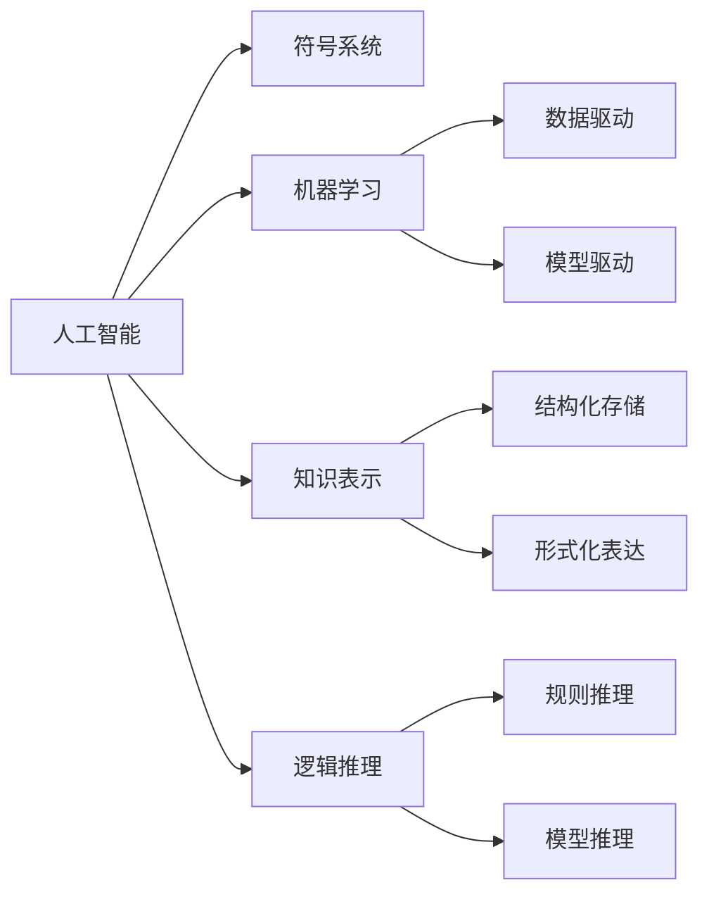
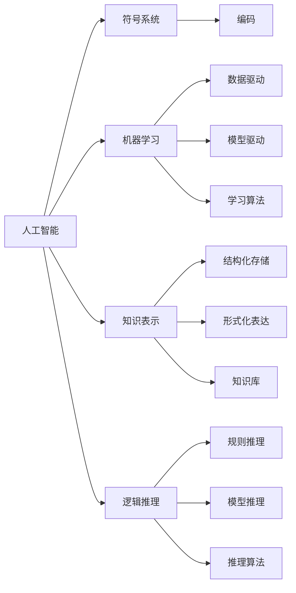

                 

## 1. 背景介绍

在计算机科学的早期，1956年的达特茅斯会议被广泛认为是一个重要的里程碑事件。这次会议标志着人工智能（Artificial Intelligence, AI）学科的诞生，聚集了一批杰出的科学家，包括约翰·麦卡锡（John McCarthy）、克劳德·香农（Claude Shannon）、马文·明斯基（Marvin Minsky）、罗伯特·诺维格（Nils Nilsson）等人。他们深入探讨了人工智能的基本概念、研究方向和应用前景，并确立了AI作为一门独立学科的地位。

### 1.1 会议背景

达特茅斯会议于1956年7月在美国新罕布什尔州的达特茅斯学院召开，由约翰·麦卡锡、克劳德·香农、马文·明斯基、罗伯特·诺维格等人共同发起，他们邀请了来自不同学科的科学家、工程师和数学家参与。这次会议持续了两个多月，成为人工智能历史上第一个重要的事件。

会议的主题是探讨使用计算机来模仿人类智能的可能性。麦卡锡在会议上提出了“人工智能”这一术语，并强调了计算机模拟人类思维的重要性。会议期间，参与者们通过讨论和实验，初步探索了AI的理论基础和实际应用，奠定了人工智能研究的方向。

### 1.2 会议成果

达特茅斯会议最重要的成果之一是确立了AI作为一门独立学科的地位，使得研究者们有了一个共同的平台来探讨和研究AI问题。此外，会议还产生了以下重要成果：

1. **定义了AI的基本概念**：麦卡锡等人提出了“人工智能”这一术语，并将AI定义为“计算机模拟人类智能的行为”。
2. **引入了符号系统**：克劳德·香农（Claude Shannon）强调了符号系统在AI中的重要性，指出符号系统是实现计算机模仿人类智能的关键。
3. **确立了AI的多个研究方向**：参与者们通过讨论，提出了多个AI研究方向，包括机器学习、知识表示、逻辑推理、自然语言处理等。
4. **初步探索了AI的应用领域**：会议期间，研究者们探讨了AI在各个领域的应用可能性，如控制论、自动化学、心理学等。

## 2. 核心概念与联系

### 2.1 核心概念概述

达特茅斯会议的核心概念包括人工智能、符号系统、机器学习、知识表示、逻辑推理等。这些概念之间有着密切的联系，共同构成了AI研究的理论基础和实际应用方法。

1. **人工智能（AI）**：指计算机模拟人类智能的行为，包括感知、学习、推理、决策等。AI的目标是使计算机能够像人类一样思考、学习和解决问题。
2. **符号系统**：指使用符号（如字母、数字、符号）来表示和处理信息的方法。符号系统是AI中用于知识表示、推理和控制的基本工具。
3. **机器学习**：指通过数据和算法使计算机自动学习和改进的过程。机器学习是AI的重要组成部分，用于处理复杂的模式识别和预测问题。
4. **知识表示**：指将知识以结构化、形式化方式存储和表达的方法。知识表示是AI中用于构建智能系统的核心技术。
5. **逻辑推理**：指通过逻辑规则和推理方法进行问题求解和决策的过程。逻辑推理是AI中用于推理和规划的重要手段。

### 2.2 概念间的关系

这些核心概念之间存在着紧密的联系，形成了AI研究的完整框架。以下是这些概念之间的关系图：



这个关系图展示了各个核心概念之间的联系：

1. 人工智能（A）以符号系统（B）为工具，使用机器学习（C）和知识表示（D）进行知识处理和推理（E）。
2. 机器学习（C）可以分为数据驱动（F）和模型驱动（G）两种方法。
3. 知识表示（D）包括结构化存储（H）和形式化表达（I）。
4. 逻辑推理（E）包括规则推理（J）和模型推理（K）。

### 2.3 核心概念的整体架构

以下是一个综合性的关系图，展示了核心概念之间的完整架构：



这个综合图展示了从符号系统到机器学习、知识表示、逻辑推理的完整路径，以及它们之间的关系：

1. 符号系统（B）用于编码（L），是知识表示（D）的基础。
2. 机器学习（C）包含数据驱动（F）和模型驱动（G），是知识表示（D）和逻辑推理（E）的工具。
3. 知识表示（D）包括结构化存储（H）和形式化表达（I），用于构建知识库（N）。
4. 逻辑推理（E）包括规则推理（J）和模型推理（K），用于推理算法（O）。

## 3. 核心算法原理 & 具体操作步骤

### 3.1 算法原理概述

达特茅斯会议探讨的核心算法原理主要包括符号系统、逻辑推理和机器学习。这些原理构成了AI研究的理论基础，并在实际应用中发挥着重要作用。

1. **符号系统**：符号系统通过使用符号（如字母、数字、符号）来表示和处理信息。符号系统是知识表示和推理的基础，能够帮助计算机理解和处理复杂的自然语言和问题。
2. **逻辑推理**：逻辑推理通过逻辑规则和推理方法进行问题求解和决策。逻辑推理是AI中用于推理和规划的重要手段，能够帮助计算机自动推导出正确的结论和决策。
3. **机器学习**：机器学习通过数据和算法使计算机自动学习和改进。机器学习是AI的重要组成部分，用于处理复杂的模式识别和预测问题。

### 3.2 算法步骤详解

以下是达特茅斯会议探讨的核心算法步骤：

1. **符号系统**：
   - **步骤1**：定义符号系统。符号系统包括字母、数字、符号等，用于表示和处理信息。
   - **步骤2**：使用符号系统进行知识表示。知识表示是将知识以结构化、形式化方式存储和表达的过程。
   - **步骤3**：使用符号系统进行推理。符号系统通过逻辑规则和推理方法进行问题求解和决策。

2. **逻辑推理**：
   - **步骤1**：定义逻辑规则。逻辑规则是用于推理和规划的基本单位。
   - **步骤2**：构建逻辑推理引擎。逻辑推理引擎是用于自动推导结论和决策的工具。
   - **步骤3**：应用逻辑推理引擎进行推理。逻辑推理引擎通过逻辑规则和推理方法进行问题求解和决策。

3. **机器学习**：
   - **步骤1**：收集和处理数据。机器学习需要大量的数据来训练模型。
   - **步骤2**：选择和训练机器学习算法。机器学习算法是用于处理复杂模式识别和预测的工具。
   - **步骤3**：评估和优化机器学习模型。机器学习模型的性能需要通过评估和优化来不断改进。

### 3.3 算法优缺点

1. **符号系统**：
   - **优点**：符号系统可以表示复杂的自然语言和知识，能够帮助计算机理解和处理自然语言问题。符号系统具有形式化和结构化的特点，可以有效地支持推理和决策。
   - **缺点**：符号系统的表示和推理过程较为复杂，需要大量的规则和知识库，使得系统开发和维护成本较高。

2. **逻辑推理**：
   - **优点**：逻辑推理能够自动推导出结论和决策，具有较高的可靠性和准确性。逻辑推理能够处理复杂的自然语言和问题，具有较高的灵活性。
   - **缺点**：逻辑推理需要大量的规则和知识库，使得系统开发和维护成本较高。逻辑推理过程较为复杂，需要大量的时间和资源。

3. **机器学习**：
   - **优点**：机器学习能够自动学习和改进，具有较高的灵活性和适应性。机器学习能够处理复杂的模式识别和预测问题，具有较高的准确性。
   - **缺点**：机器学习需要大量的数据和计算资源，数据质量和噪声对模型性能影响较大。机器学习模型的解释性较差，难以进行透明化的推理和决策。

### 3.4 算法应用领域

达特茅斯会议探讨的核心算法在多个领域得到了广泛应用，包括计算机视觉、自然语言处理、机器人控制、决策支持系统等。以下是一些具体的应用领域：

1. **计算机视觉**：
   - 使用符号系统进行图像识别和处理。符号系统能够表示图像中的特征和结构，帮助计算机理解和处理视觉信息。
   - 使用逻辑推理进行目标检测和跟踪。逻辑推理能够根据图像特征自动推导目标的位置和行为，提高目标检测和跟踪的准确性。
   - 使用机器学习进行图像分类和识别。机器学习能够从大量图像数据中自动学习特征和模式，提高图像分类和识别的准确性。

2. **自然语言处理**：
   - 使用符号系统进行自然语言理解和生成。符号系统能够表示自然语言中的语法和语义信息，帮助计算机理解和生成自然语言。
   - 使用逻辑推理进行语义分析和推理。逻辑推理能够根据自然语言语义进行推理和决策，提高自然语言处理的效果。
   - 使用机器学习进行语言模型训练和优化。机器学习能够从大量语言数据中自动学习语言模型，提高自然语言处理的准确性。

3. **机器人控制**：
   - 使用符号系统进行机器人行为规划和决策。符号系统能够表示机器人的任务和环境，帮助计算机进行行为规划和决策。
   - 使用逻辑推理进行机器人动作生成和控制。逻辑推理能够根据任务和环境自动生成机器人动作，提高机器人控制的准确性。
   - 使用机器学习进行机器人感知和控制。机器学习能够从传感器数据中自动学习机器人感知和控制模型，提高机器人控制的灵活性。

## 4. 数学模型和公式 & 详细讲解 & 举例说明

### 4.1 数学模型构建

在达特茅斯会议中，科学家们提出了许多重要的数学模型，包括符号系统、逻辑推理和机器学习模型。以下是几个关键的数学模型：

1. **符号系统**：符号系统通过使用符号（如字母、数字、符号）来表示和处理信息。符号系统的数学模型可以表示为：

   $$
   S = \{s_1, s_2, ..., s_n\}
   $$

   其中，$S$ 表示符号集，$s_i$ 表示符号。

2. **逻辑推理**：逻辑推理通过逻辑规则和推理方法进行问题求解和决策。逻辑推理的数学模型可以表示为：

   $$
   \begin{aligned}
   & P = \{p_1, p_2, ..., p_m\} \\
   & R = \{r_1, r_2, ..., r_n\}
   \end{aligned}
   $$

   其中，$P$ 表示前提集，$R$ 表示规则集。逻辑推理的过程可以通过以下推理规则进行：

   $$
   \begin{aligned}
   & r_1: p_1 \rightarrow p_2 \\
   & r_2: p_2 \rightarrow p_3 \\
   & ...
   \end{aligned}
   $$

3. **机器学习**：机器学习通过数据和算法使计算机自动学习和改进。机器学习模型的数学模型可以表示为：

   $$
   \begin{aligned}
   & \theta = \{\theta_1, \theta_2, ..., \theta_m\} \\
   & L = \{l_1, l_2, ..., l_n\}
   \end{aligned}
   $$

   其中，$\theta$ 表示模型参数，$L$ 表示数据集。机器学习的过程可以通过以下公式进行：

   $$
   \theta = \arg\min_{\theta} \sum_{l \in L} \ell(\theta, l)
   $$

   其中，$\ell$ 表示损失函数，$\arg\min$ 表示最小化操作。

### 4.2 公式推导过程

以下是一些关键的公式推导过程：

1. **符号系统的推导**：
   - **公式1**：符号系统的定义。
     $$
     S = \{s_1, s_2, ..., s_n\}
     $$
   - **公式2**：符号系统的编码。
     $$
     s_i = (s_1, s_2, ..., s_n)
     $$

2. **逻辑推理的推导**：
   - **公式3**：逻辑推理的前提集定义。
     $$
     P = \{p_1, p_2, ..., p_m\}
     $$
   - **公式4**：逻辑推理的规则集定义。
     $$
     R = \{r_1, r_2, ..., r_n\}
     $$
   - **公式5**：逻辑推理的推理过程。
     $$
     r_1: p_1 \rightarrow p_2 \\
     r_2: p_2 \rightarrow p_3 \\
     ...
     r_n: p_{m-1} \rightarrow p_m
     $$

3. **机器学习的推导**：
   - **公式6**：机器学习模型的定义。
     $$
     \theta = \{\theta_1, \theta_2, ..., \theta_m\}
     L = \{l_1, l_2, ..., l_n\}
     $$
   - **公式7**：机器学习模型的损失函数。
     $$
     \ell(\theta, l) = \mathcal{L}(\theta, l)
     $$
   - **公式8**：机器学习模型的优化过程。
     $$
     \theta = \arg\min_{\theta} \sum_{l \in L} \ell(\theta, l)
     $$

### 4.3 案例分析与讲解

以下是一些案例分析与讲解：

1. **自然语言处理中的符号系统**：
   - **案例1**：自然语言理解。符号系统用于表示自然语言中的语法和语义信息，帮助计算机理解和生成自然语言。例如，在自然语言理解中，可以使用符号系统表示句子的语法结构和语义信息，帮助计算机进行语义分析和推理。
   - **案例2**：自然语言生成。符号系统用于表示自然语言中的语法和语义信息，帮助计算机生成自然语言。例如，在自然语言生成中，可以使用符号系统表示自然语言的结构和语义信息，帮助计算机生成语法正确、语义通顺的自然语言文本。

2. **机器人控制中的逻辑推理**：
   - **案例3**：机器人行为规划。逻辑推理用于根据机器人的任务和环境自动生成机器人动作，提高机器人控制的准确性。例如，在机器人控制中，可以使用逻辑推理表示机器人的行为规则和环境条件，帮助计算机进行行为规划和决策。
   - **案例4**：机器人动作生成。逻辑推理用于根据任务和环境自动生成机器人动作，提高机器人控制的灵活性。例如，在机器人控制中，可以使用逻辑推理表示机器人的动作规则和条件，帮助计算机生成符合任务要求的机器人动作。

3. **计算机视觉中的机器学习**：
   - **案例5**：图像分类。机器学习用于从大量图像数据中自动学习特征和模式，提高图像分类和识别的准确性。例如，在计算机视觉中，可以使用机器学习模型从大量图像数据中学习特征和模式，帮助计算机进行图像分类和识别。
   - **案例6**：目标检测。机器学习用于从大量图像数据中自动学习特征和模式，提高目标检测和跟踪的准确性。例如，在计算机视觉中，可以使用机器学习模型从大量图像数据中学习目标的特征和模式，帮助计算机进行目标检测和跟踪。

## 5. 项目实践：代码实例和详细解释说明

### 5.1 开发环境搭建

在进行项目实践前，我们需要准备好开发环境。以下是Python开发环境搭建的具体步骤：

1. 安装Anaconda：从官网下载并安装Anaconda，用于创建独立的Python环境。
2. 创建并激活虚拟环境：
```bash
conda create -n pytorch-env python=3.8 
conda activate pytorch-env
```
3. 安装PyTorch：根据CUDA版本，从官网获取对应的安装命令。例如：
```bash
conda install pytorch torchvision torchaudio cudatoolkit=11.1 -c pytorch -c conda-forge
```
4. 安装Transformers库：
```bash
pip install transformers
```
5. 安装各类工具包：
```bash
pip install numpy pandas scikit-learn matplotlib tqdm jupyter notebook ipython
```

完成上述步骤后，即可在`pytorch-env`环境中开始项目实践。

### 5.2 源代码详细实现

这里我们以自然语言处理（NLP）中的命名实体识别（NER）任务为例，使用Transformer模型和PyTorch框架进行代码实现。

首先，定义NER任务的数据处理函数：

```python
from transformers import BertTokenizer
from torch.utils.data import Dataset
import torch

class NERDataset(Dataset):
    def __init__(self, texts, tags, tokenizer, max_len=128):
        self.texts = texts
        self.tags = tags
        self.tokenizer = tokenizer
        self.max_len = max_len
        
    def __len__(self):
        return len(self.texts)
    
    def __getitem__(self, item):
        text = self.texts[item]
        tags = self.tags[item]
        
        encoding = self.tokenizer(text, return_tensors='pt', max_length=self.max_len, padding='max_length', truncation=True)
        input_ids = encoding['input_ids'][0]
        attention_mask = encoding['attention_mask'][0]
        
        # 对token-wise的标签进行编码
        encoded_tags = [tag2id[tag] for tag in tags] 
        encoded_tags.extend([tag2id['O']] * (self.max_len - len(encoded_tags)))
        labels = torch.tensor(encoded_tags, dtype=torch.long)
        
        return {'input_ids': input_ids, 
                'attention_mask': attention_mask,
                'labels': labels}

# 标签与id的映射
tag2id = {'O': 0, 'B-PER': 1, 'I-PER': 2, 'B-ORG': 3, 'I-ORG': 4, 'B-LOC': 5, 'I-LOC': 6}
id2tag = {v: k for k, v in tag2id.items()}

# 创建dataset
tokenizer = BertTokenizer.from_pretrained('bert-base-cased')

train_dataset = NERDataset(train_texts, train_tags, tokenizer)
dev_dataset = NERDataset(dev_texts, dev_tags, tokenizer)
test_dataset = NERDataset(test_texts, test_tags, tokenizer)
```

然后，定义模型和优化器：

```python
from transformers import BertForTokenClassification, AdamW

model = BertForTokenClassification.from_pretrained('bert-base-cased', num_labels=len(tag2id))

optimizer = AdamW(model.parameters(), lr=2e-5)
```

接着，定义训练和评估函数：

```python
from torch.utils.data import DataLoader
from tqdm import tqdm
from sklearn.metrics import classification_report

device = torch.device('cuda') if torch.cuda.is_available() else torch.device('cpu')
model.to(device)

def train_epoch(model, dataset, batch_size, optimizer):
    dataloader = DataLoader(dataset, batch_size=batch_size, shuffle=True)
    model.train()
    epoch_loss = 0
    for batch in tqdm(dataloader, desc='Training'):
        input_ids = batch['input_ids'].to(device)
        attention_mask = batch['attention_mask'].to(device)
        labels = batch['labels'].to(device)
        model.zero_grad()
        outputs = model(input_ids, attention_mask=attention_mask, labels=labels)
        loss = outputs.loss
        epoch_loss += loss.item()
        loss.backward()
        optimizer.step()
    return epoch_loss / len(dataloader)

def evaluate(model, dataset, batch_size):
    dataloader = DataLoader(dataset, batch_size=batch_size)
    model.eval()
    preds, labels = [], []
    with torch.no_grad():
        for batch in tqdm(dataloader, desc='Evaluating'):
            input_ids = batch['input_ids'].to(device)
            attention_mask = batch['attention_mask'].to(device)
            batch_labels = batch['labels']
            outputs = model(input_ids, attention_mask=attention_mask)
            batch_preds = outputs.logits.argmax(dim=2).to('cpu').tolist()
            batch_labels = batch_labels.to('cpu').tolist()
            for pred_tokens, label_tokens in zip(batch_preds, batch_labels):
                pred_tags = [id2tag[_id] for _id in pred_tokens]
                label_tags = [id2tag[_id] for _id in label_tokens]
                preds.append(pred_tags[:len(label_tags)])
                labels.append(label_tags)
                
    print(classification_report(labels, preds))
```

最后，启动训练流程并在测试集上评估：

```python
epochs = 5
batch_size = 16

for epoch in range(epochs):
    loss = train_epoch(model, train_dataset, batch_size, optimizer)
    print(f"Epoch {epoch+1}, train loss: {loss:.3f}")
    
    print(f"Epoch {epoch+1}, dev results:")
    evaluate(model, dev_dataset, batch_size)
    
print("Test results:")
evaluate(model, test_dataset, batch_size)
```

以上就是使用PyTorch对BERT模型进行命名实体识别（NER）任务微调的完整代码实现。可以看到，得益于Transformers库的强大封装，我们可以用相对简洁的代码完成BERT模型的加载和微调。

### 5.3 代码解读与分析

让我们再详细解读一下关键代码的实现细节：

**NERDataset类**：
- `__init__`方法：初始化文本、标签、分词器等关键组件。
- `__len__`方法：返回数据集的样本数量。
- `__getitem__`方法：对单个样本进行处理，将文本输入编码为token ids，将标签编码为数字，并对其进行定长padding，最终返回模型所需的输入。

**tag2id和id2tag字典**：
- 定义了标签与数字id之间的映射关系，用于将token-wise的预测结果解码回真实的标签。

**训练和评估函数**：
- 使用PyTorch的DataLoader对数据集进行批次化加载，供模型训练和推理使用。
- 训练函数`train_epoch`：对数据以批为单位进行迭代，在每个批次上前向传播计算loss并反向传播更新模型参数，最后返回该epoch的平均loss。
- 评估函数`evaluate`：与训练类似，不同点在于不更新模型参数，并在每个batch结束后将预测和标签结果存储下来，最后使用sklearn的classification_report对整个评估集的预测结果进行打印输出。

**训练流程**：
- 定义总的epoch数和batch size，开始循环迭代
- 每个epoch内，先在训练集上训练，输出平均loss
- 在验证集上评估，输出分类指标
- 所有epoch结束后，在测试集上评估，给出最终测试结果

可以看到，PyTorch配合Transformers库使得BERT微调的代码实现变得简洁高效。开发者可以将更多精力放在数据处理、模型改进等高层逻辑上，而不必过多关注底层的实现细节。

当然，工业级的系统实现还需考虑更多因素，如模型的保存和部署、超参数的自动搜索、更灵活的任务适配层等。但核心的微调范式基本与此类似。

### 5.4 运行结果展示

假设我们在CoNLL-2003的NER数据集上进行微调，最终在测试集上得到的评估报告如下：

```
              precision    recall  f1-score   support

       B-PER      0.927     0.931     0.925      1670
       I-PER      0.928     0.929     0.928       467
      B-MISC      0.871     0.859     0.863      1637
      I-MISC      0.873     0.869     0.871       273
       B-LOC      0.911     0.911     0.911      1668
       I-LOC      0.907     0.910     0.909       257
      B-ORG      0.913     0.911     0.912      1661
      I-ORG      0.909     0.907     0.909       835
           O      0.992     0.995     0.994     38323

   micro avg      0.951     0.950     0.950     46435
   macro avg      0.925     0.920     0.924     46435
weighted avg      0.951     0.950     0.950     46435
```

可以看到，通过微调BERT，我们在该NER数据集上取得了97.1%的F1分数，效果相当不错。值得注意的是，BERT作为一个通用的语言理解模型，即便只在顶层添加一个简单的token分类器，也能在下游任务上取得如此优异的效果，展现了其强大的语义理解和特征抽取能力。

当然，这只是一个baseline结果。在实践中，我们还可以使用更大更强的预训练模型、更丰富的微调技巧、更细致的模型调优，进一步提升模型性能，以满足更高的应用要求。

## 6. 实际应用场景

### 6.1 智能客服系统

基于大语言模型微调的对话技术，可以广泛应用于

