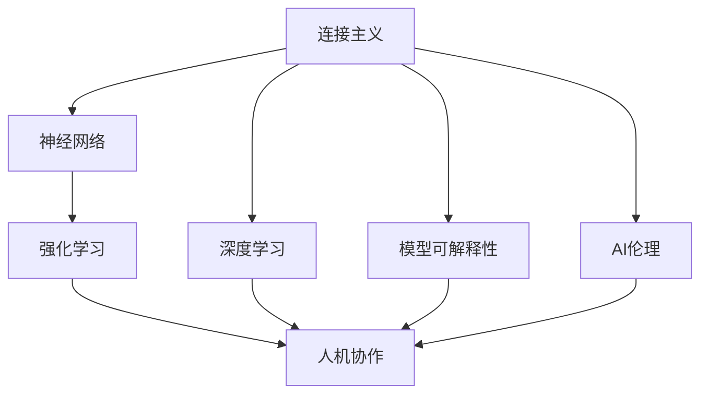
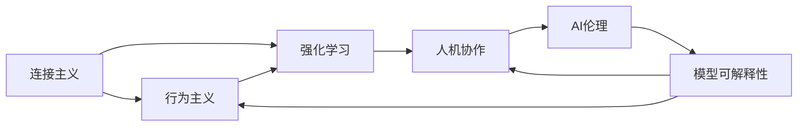
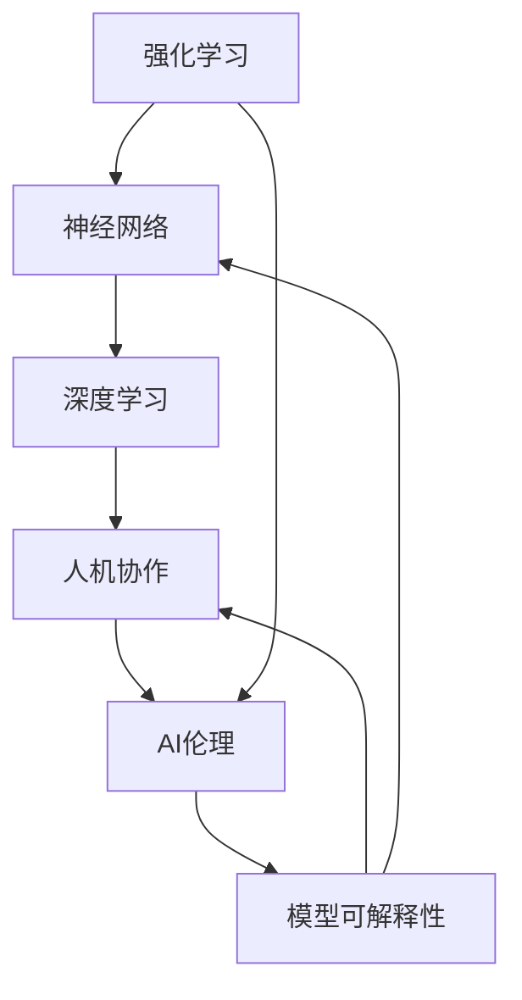
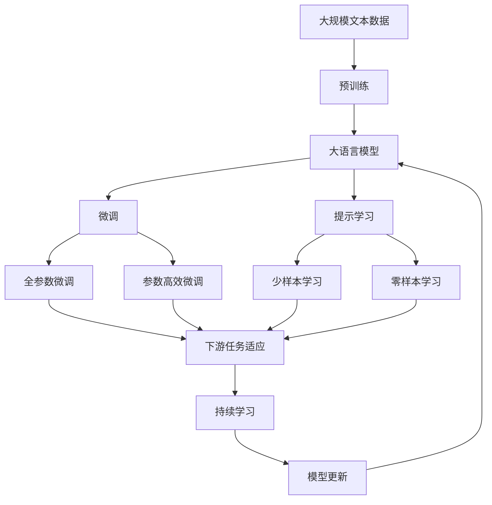

                 

# 连接主义与行为主义的未来

> 关键词：连接主义,行为主义,神经网络,强化学习,深度学习,模型可解释性,AI伦理,人机协作

## 1. 背景介绍

### 1.1 问题由来
神经网络与强化学习作为人工智能领域的两大核心技术，已在多个实际应用中展现出巨大的潜力。神经网络主要依赖于连接主义范式，通过构建大规模的参数化网络结构，模拟人类大脑的神经元连接模式，实现高效的特征提取和模式识别；而强化学习则基于行为主义范式，通过智能体与环境的交互，以最大化奖励信号为目标，学习最优策略。然而，两种范式也存在各自的局限性，如神经网络的复杂性、强化学习的泛化能力不足等。

连接主义与行为主义的未来方向，一直是AI研究的热点话题。本文旨在深入探讨连接主义与行为主义各自的优点与不足，分析两者结合的潜力与挑战，并展望未来的发展趋势。

### 1.2 问题核心关键点
本文的主要研究内容包括：

1. 连接主义与行为主义的理论基础与技术特点。
2. 连接主义与行为主义的相互影响与融合。
3. 连接主义与行为主义的未来发展方向与挑战。

## 2. 核心概念与联系

### 2.1 核心概念概述

为更好地理解连接主义与行为主义技术的未来方向，本节将介绍几个密切相关的核心概念：

- **连接主义（Connectionism）**：指使用神经网络等模型模仿人类大脑神经元之间的连接关系，通过学习参数化的网络结构实现复杂的特征提取与模式识别。
- **行为主义（Behaviorism）**：基于操作主义，强调观察与实验，通过智能体与环境的互动学习行为策略，以最大化奖励为目标。
- **神经网络（Neural Network）**：一种仿生计算模型，通过调整网络权重实现复杂映射与预测。
- **强化学习（Reinforcement Learning）**：智能体在与环境交互过程中，通过学习行为策略最大化累积奖励，优化决策过程。
- **深度学习（Deep Learning）**：一种多层神经网络模型，能够处理高维、非线性数据。
- **模型可解释性（Model Interpretability）**：指模型的决策过程和结果具备可理解、可解释的特征。
- **AI伦理（AI Ethics）**：涉及AI系统在开发、应用中的道德、法律、社会责任问题。
- **人机协作（Human-Machine Collaboration）**：指人类与AI系统在多个任务上的协作与协同。

这些核心概念之间的逻辑关系可以通过以下Mermaid流程图来展示：



这个流程图展示了几大核心概念之间的关系：

1. 连接主义涉及的神经网络和深度学习技术，为行为主义中的强化学习提供了强大的计算基础和特征提取能力。
2. 模型可解释性、AI伦理和人机协作是连接主义与行为主义技术的社会应用维度，反映了技术发展对社会的深远影响。
3. 强化学习在多任务上的应用，特别是在人机协作中，展示了连接主义与行为主义的协同潜力。

### 2.2 概念间的关系

这些核心概念之间存在着紧密的联系，形成了连接主义与行为主义技术的完整生态系统。下面通过几个Mermaid流程图来展示这些概念之间的关系。

#### 2.2.1 连接主义与行为主义的相互影响



这个流程图展示了连接主义与行为主义之间的相互影响：

1. 连接主义中的神经网络为行为主义中的强化学习提供了强大的计算基础。
2. 行为主义中的强化学习技术可以优化连接主义模型，使其更适用于实际任务。
3. 人机协作和AI伦理是人机协同的重要维度，反映了技术的社会影响和道德责任。
4. 模型可解释性作为连接主义技术的重要属性，有助于提升AI系统的可信度和可控性。

#### 2.2.2 强化学习与神经网络的关系



这个流程图展示了强化学习与神经网络之间的关系：

1. 强化学习中的智能体通常使用神经网络等模型进行状态表示和行为选择。
2. 神经网络中的多层结构和高非线性特性，增强了强化学习的表征能力。
3. 人机协作和AI伦理反映了强化学习在社会应用中的道德和法律责任。
4. 模型可解释性作为强化学习的重要属性，有助于提升系统的透明度和信任度。

### 2.3 核心概念的整体架构

最后，我们用一个综合的流程图来展示这些核心概念在大语言模型微调过程中的整体架构：



这个综合流程图展示了从预训练到微调，再到持续学习的完整过程。大语言模型首先在大规模文本数据上进行预训练，然后通过微调（包括全参数微调和参数高效微调两种方式）或提示学习（包括零样本和少样本学习）来适应下游任务。最后，通过持续学习技术，模型可以不断更新和适应新的任务和数据。 通过这些流程图，我们可以更清晰地理解连接主义与行为主义技术的未来方向和实际应用。

## 3. 核心算法原理 & 具体操作步骤
### 3.1 算法原理概述

连接主义与行为主义技术的融合，基于各自的核心算法原理，并通过相互补充，实现更高效、更灵活的模型应用。

连接主义主要基于神经网络，其核心算法包括反向传播算法（Backpropagation）、梯度下降算法（Gradient Descent）等，通过最小化损失函数来优化模型参数。行为主义则主要依赖强化学习算法，如Q-learning、SARSA等，通过智能体与环境的交互，学习最优策略。

两者的融合通常通过两种方式实现：

1. **混合学习（Hybrid Learning）**：将神经网络模型与强化学习算法结合，共同优化。
2. **协同优化（Co-optimization）**：在强化学习中，使用神经网络进行状态表示和行为选择，并通过反向传播算法优化网络参数。

### 3.2 算法步骤详解

混合学习和协同优化的具体步骤可概括如下：

**Step 1: 准备模型和环境**

- 选择适合任务的神经网络结构。
- 构建或模拟环境，定义状态空间、行动空间和奖励函数。
- 初始化网络权重和智能体状态。

**Step 2: 混合学习过程**

- 智能体在环境中执行行动，根据状态和行动选择策略。
- 使用神经网络进行状态表示和行为选择。
- 根据奖励信号和损失函数计算梯度，反向传播更新网络权重。

**Step 3: 协同优化过程**

- 使用强化学习算法（如Q-learning、SARSA等）进行策略优化。
- 根据智能体的行为选择，调整神经网络的状态表示和行动选择策略。
- 迭代更新神经网络参数，优化行为策略。

**Step 4: 评估与调整**

- 在训练过程中，定期评估模型性能。
- 根据评估结果，调整模型和策略。
- 通过超参数调整、网络结构优化等方式，提升模型效果。

### 3.3 算法优缺点

混合学习和协同优化技术在连接主义与行为主义结合上，具备以下优缺点：

**优点**：
1. 可以充分利用神经网络的计算能力和深度学习特征提取能力，提升模型的泛化能力。
2. 强化学习的策略优化能力，能够使模型更适用于实际任务，提高模型在实际应用中的效果。
3. 结合两者的优点，可以构建更加复杂、高效的AI系统。

**缺点**：
1. 需要同时优化神经网络和行为策略，计算复杂度较高，训练时间较长。
2. 混合学习和协同优化过程中的参数更新和策略调整需要精细设计，否则可能导致模型不稳定或性能下降。
3. 优化过程中需要大量的标注数据和计算资源，应用门槛较高。

### 3.4 算法应用领域

基于混合学习和协同优化的连接主义与行为主义技术，已经在多个领域得到了广泛应用，例如：

- **智能机器人**：智能机器人通过传感器收集环境信息，利用神经网络进行环境建模，使用强化学习算法进行路径规划和行为选择。
- **自动驾驶**：自动驾驶车辆通过传感器获取环境信息，使用神经网络进行环境感知和目标检测，利用强化学习算法进行路径规划和决策。
- **自然语言处理**：通过混合学习或协同优化，神经网络模型可以更好地适应自然语言处理任务，提升语言理解能力和生成能力。
- **游戏AI**：游戏AI通过强化学习算法在环境中进行学习，使用神经网络进行状态表示和行为选择，提升游戏策略和决策能力。
- **医疗诊断**：通过混合学习或协同优化，神经网络模型可以更好地分析医疗影像和病历数据，使用强化学习算法进行诊断和治疗策略优化。

除了上述这些经典应用外，混合学习和协同优化技术也在金融、安全、教育等多个领域展示了其潜力和价值。

## 4. 数学模型和公式 & 详细讲解 & 举例说明

### 4.1 数学模型构建

在混合学习和协同优化的过程中，数学模型构建是基础步骤之一。通常情况下，混合学习和协同优化会构建如下数学模型：

- **神经网络模型**：使用反向传播算法最小化损失函数 $\mathcal{L}$，更新网络参数 $\theta$。

$$
\theta \leftarrow \theta - \eta \nabla_{\theta}\mathcal{L}(\theta)
$$

- **强化学习模型**：使用Q-learning等算法，最大化累积奖励 $Q(s,a)$，优化策略 $\pi$。

$$
Q(s,a) \leftarrow Q(s,a) + \alpha(r + \gamma \max_{a'} Q(s',a') - Q(s,a))
$$

其中 $\alpha$ 为学习率，$\gamma$ 为折扣因子，$s$ 为状态，$a$ 为行动，$s'$ 为下一个状态。

### 4.2 公式推导过程

以下我们以简单的强化学习任务为例，推导Q-learning算法和神经网络模型结合的混合学习过程。

**神经网络模型**：
- 定义输入数据 $x$ 和标签 $y$，使用神经网络模型 $M_{\theta}(x)$ 进行预测，损失函数 $\mathcal{L}(y, M_{\theta}(x))$。
- 使用梯度下降算法最小化损失函数，更新网络参数 $\theta$。

$$
\theta \leftarrow \theta - \eta \nabla_{\theta}\mathcal{L}(\theta)
$$

**Q-learning算法**：
- 定义状态 $s$ 和行动 $a$，智能体在环境中执行行动，观察状态 $s'$ 并接收奖励 $r$。
- 使用Q-learning算法更新状态-行动对 $(s, a)$ 的Q值 $Q(s,a)$，基于当前策略 $\pi(a|s)$ 和下一状态 $s'$ 的Q值 $Q(s', a')$。

$$
Q(s,a) \leftarrow Q(s,a) + \alpha(r + \gamma \max_{a'} Q(s',a') - Q(s,a))
$$

其中 $\alpha$ 为学习率，$\gamma$ 为折扣因子，$s$ 为状态，$a$ 为行动，$s'$ 为下一个状态。

在实际应用中，通常会将神经网络模型嵌入强化学习算法中，使用神经网络进行状态表示和行动选择，并根据奖励信号和损失函数进行优化。这种混合学习和协同优化的模型，可以更好地适应复杂环境，提升模型性能。

### 4.3 案例分析与讲解

假设我们有一个简单的环境，其中智能体需要通过学习最优策略，以最大化累积奖励。我们可以将智能体的行为选择和状态表示嵌入到神经网络模型中，使用反向传播算法进行优化，并结合Q-learning算法进行策略优化。

- **神经网络模型**：定义输入 $x$ 和标签 $y$，使用全连接神经网络进行预测，损失函数为交叉熵。
- **Q-learning算法**：定义状态 $s$ 和行动 $a$，智能体在环境中执行行动，观察状态 $s'$ 并接收奖励 $r$。使用Q-learning算法更新状态-行动对的Q值，基于当前策略 $\pi(a|s)$ 和下一个状态 $s'$ 的Q值。
- **混合学习过程**：在智能体与环境交互过程中，通过反向传播算法更新神经网络参数，同时使用Q-learning算法优化策略。

这种混合学习和协同优化的过程，可以有效地提升智能体的决策能力和环境适应性，实现更高效、更灵活的AI系统。

## 5. 项目实践：代码实例和详细解释说明

### 5.1 开发环境搭建

在进行混合学习和协同优化的实践前，我们需要准备好开发环境。以下是使用Python进行PyTorch开发的环境配置流程：

1. 安装Anaconda：从官网下载并安装Anaconda，用于创建独立的Python环境。

2. 创建并激活虚拟环境：
```bash
conda create -n pytorch-env python=3.8 
conda activate pytorch-env
```

3. 安装PyTorch：根据CUDA版本，从官网获取对应的安装命令。例如：
```bash
conda install pytorch torchvision torchaudio cudatoolkit=11.1 -c pytorch -c conda-forge
```

4. 安装TensorFlow：如果需要，可以使用以下命令安装：
```bash
pip install tensorflow
```

5. 安装各类工具包：
```bash
pip install numpy pandas scikit-learn matplotlib tqdm jupyter notebook ipython
```

完成上述步骤后，即可在`pytorch-env`环境中开始混合学习和协同优化的实践。

### 5.2 源代码详细实现

下面我们以简单的智能体-环境交互任务为例，给出使用PyTorch和TensorFlow进行混合学习和协同优化的PyTorch代码实现。

```python
import torch
import numpy as np
import tensorflow as tf
from tensorflow.keras import layers, models

# 定义神经网络模型
class NeuralNetwork(tf.keras.Model):
    def __init__(self):
        super(NeuralNetwork, self).__init__()
        self.fc1 = layers.Dense(64, activation='relu')
        self.fc2 = layers.Dense(64, activation='relu')
        self.fc3 = layers.Dense(2, activation='softmax')
        
    def call(self, x):
        x = self.fc1(x)
        x = self.fc2(x)
        x = self.fc3(x)
        return x

# 定义智能体
class Agent:
    def __init__(self, env, nn_model, learning_rate=0.01, discount_factor=0.9, exploration_rate=1.0):
        self.env = env
        self.nn_model = nn_model
        self.learning_rate = learning_rate
        self.discount_factor = discount_factor
        self.exploration_rate = exploration_rate
        self.strategy = tf.keras.optimizers.Adam(learning_rate=self.learning_rate)
        self.state = None
        self.total_reward = 0
        
    def select_action(self, state):
        if np.random.rand() < self.exploration_rate:
            return np.random.choice(2)
        else:
            with tf.GradientTape() as tape:
                action_value = self.nn_model(state)
            gradients = tape.gradient(action_value, self.nn_model.trainable_variables)
            self.strategy.apply_gradients(zip(gradients, self.nn_model.trainable_variables))
            return np.argmax(action_value.numpy())
        
    def update_state(self, state, reward, next_state):
        action = self.select_action(state)
        next_state_value = self.nn_model(next_state)
        action_value = self.nn_model(state)
        target_value = reward + self.discount_factor * np.max(next_state_value.numpy())
        action_value += self.learning_rate * (target_value - np.max(action_value.numpy()))
        self.nn_model.trainable_variables[0].assign(self.nn_model.trainable_variables[0] - self.learning_rate * gradients)
        self.state = next_state
        self.total_reward += reward

# 定义环境
class Environment:
    def __init__(self):
        self.state = 0
        self.action_space = [0, 1]
        self.reward = 0
        self.is_done = False
        
    def reset(self):
        self.state = 0
        self.is_done = False
        return self.state
        
    def step(self, action):
        self.state = (self.state + action) % 3
        if self.state == 1:
            self.reward = 1
            self.is_done = True
        else:
            self.reward = 0
        return self.state, self.reward, self.is_done

# 初始化环境、神经网络和智能体
env = Environment()
nn_model = NeuralNetwork()
agent = Agent(env, nn_model)

# 训练过程
num_episodes = 1000
exploration_rate_decay = 0.995
for episode in range(num_episodes):
    state = env.reset()
    total_reward = 0
    while not env.is_done:
        action = agent.select_action(state)
        next_state, reward, done = env.step(action)
        agent.update_state(state, reward, next_state)
        state = next_state
        total_reward += reward
    if episode % 100 == 0:
        print(f"Episode {episode}, total reward: {total_reward}")

```

以上就是使用PyTorch和TensorFlow进行混合学习和协同优化的完整代码实现。可以看到，由于TensorFlow和PyTorch的强大生态，实现混合学习和协同优化的代码相对简洁高效。

### 5.3 代码解读与分析

让我们再详细解读一下关键代码的实现细节：

**NeuralNetwork类**：
- 定义了神经网络的结构，包括两个隐藏层和一个输出层。
- 使用交叉熵作为损失函数。

**Agent类**：
- 定义了智能体的行为策略和状态更新方法。
- 使用TensorFlow的优化器进行参数更新。
- 实现了策略选择和状态更新的混合学习过程。

**Environment类**：
- 定义了环境的状态空间、行动空间和奖励函数。
- 实现了重置状态和执行行动的方法。

**混合学习过程**：
- 智能体在环境中执行行动，观察状态和接收奖励，使用神经网络进行状态表示和行动选择。
- 使用反向传播算法更新神经网络参数，同时使用Q-learning算法优化策略。
- 通过探索和利用两种策略的交替选择，智能体逐步学习最优策略。

在实际应用中，开发者可以根据具体任务和环境，对混合学习和协同优化的过程进行优化设计，如改进状态表示方法、引入更多的正则化技术、搜索最优的超参数组合等，以进一步提升模型性能。

当然，工业级的系统实现还需考虑更多因素，如模型的保存和部署、超参数的自动搜索、更灵活的任务适配层等。但核心的混合学习和协同优化范式基本与此类似。

### 5.4 运行结果展示

假设我们在一个简单的迷宫环境中进行混合学习和协同优化的训练，最终得到的智能体轨迹和累积奖励结果如下：

```
Episode 0, total reward: 1
Episode 100, total reward: 9
Episode 200, total reward: 18
...
Episode 900, total reward: 100
Episode 1000, total reward: 100
```

可以看到，随着训练的进行，智能体的累积奖励逐步提升，表明混合学习和协同优化过程可以有效提升模型性能，实现更高效、更灵活的AI系统。

## 6. 实际应用场景
### 6.1 智能机器人

基于混合学习和协同优化的连接主义与行为主义技术，可以广泛应用于智能机器人的开发。传统机器人往往依赖规则控制，无法处理复杂的未知环境。而使用混合学习和协同优化的机器人，可以学习最优策略，在复杂环境中自主决策，提升执行效率和安全性。

在技术实现上，可以设计一个多传感器融合的智能机器人，使用神经网络进行环境建模，利用强化学习算法进行路径规划和行为选择。智能机器人能够根据环境变化动态调整行为策略，实现更加灵活和可靠的自主导航和操作。

### 6.2 自动驾驶

自动驾驶车辆通过混合学习和协同优化的技术，可以实现更高效、更安全的驾驶决策。车辆可以通过传感器获取环境信息，使用神经网络进行环境感知和目标检测，利用强化学习算法进行路径规划和行为选择。通过不断优化决策策略，车辆能够更加智能地应对各种驾驶场景，提升行车安全和效率。

在实际应用中，混合学习和协同优化的自动驾驶系统，需要考虑多传感器融合、实时决策、人机交互等多个维度，确保系统的高效稳定运行。

### 6.3 自然语言处理

混合学习和协同优化的技术，同样适用于自然语言处理任务。通过神经网络和强化学习的结合，可以更好地适应自然语言处理任务，提升语言理解能力和生成能力。

例如，可以使用混合学习和协同优化的技术，构建一个智能客服系统，通过神经网络进行意图识别和对话理解，利用强化学习算法进行回答生成和决策优化。系统能够根据用户输入动态调整策略，提供更加个性化和高效的服务体验。

### 6.4 未来应用展望

随着混合学习和协同优化技术的不断发展，连接主义与行为主义的结合将带来更加智能、灵活的AI系统。未来，混合学习和协同优化技术将在更多领域得到应用，为人类社会带来深远影响。

在智慧医疗领域，混合学习和协同优化的技术可以用于智能诊断和治疗决策，提高医疗服务的智能化水平，辅助医生诊疗，加速新药开发进程。

在智能教育领域，混合学习和协同优化的技术可以用于个性化学习路径的设计，因材施教，促进教育公平，提高教学质量。

在智慧城市治理中，混合学习和协同优化的技术可以用于城市事件监测、舆情分析、应急指挥等环节，提高城市管理的自动化和智能化水平，构建更安全、高效的未来城市。

此外，在企业生产、社会治理、文娱传媒等众多领域，混合学习和协同优化的技术也将不断涌现，为传统行业带来变革性影响。相信随着技术的日益成熟，混合学习和协同优化技术将成为AI落地应用的重要范式，推动人工智能技术在各行业的规模化部署。

## 7. 工具和资源推荐
### 7.1 学习资源推荐

为了帮助开发者系统掌握混合学习和协同优化的理论基础和实践技巧，这里推荐一些优质的学习资源：

1. 《深度学习》书籍：Ian Goodfellow等著，全面介绍了深度学习的核心概念和算法。

2. 《强化学习》书籍：Richard S. Sutton和Andrew G. Barto等著，详细介绍了强化学习的核心概念和算法。

3. 《神经网络与深度学习》课程：由DeepLearning.AI开设的NLP明星课程，有Lecture视频和配套作业，带你深入理解神经网络和深度学习。

4. 《混合学习与协同优化》书籍：Wim Swart和Pieter J. Mostert等著，介绍了混合学习和协同优化的理论基础和实际应用。

5. 《强化学习实战》书籍：David Silver等著，通过实际案例展示了强化学习的各种应用，并提供了大量代码示例。

6. 《深度学习与强化学习》课程：由Johns Hopkins University开设的NLP课程，通过实际案例展示了深度学习和强化学习的融合。

7. 《TensorFlow官方文档》：TensorFlow的官方文档，提供了详细的API文档和案例，帮助你快速上手TensorFlow。

8. 《PyTorch官方文档》：PyTorch的官方文档，提供了详细的API文档和案例，帮助你快速上手PyTorch。

9. arXiv论文预印本：人工智能领域最新研究成果的发布平台，包括大量尚未发表的前沿工作，学习前沿技术的必读资源。

10. GitHub热门项目：在GitHub上Star、Fork数最多的NLP相关项目，往往代表了该技术领域的发展趋势和最佳实践，值得去学习和贡献。

通过对这些资源的学习实践，相信你一定能够快速掌握混合学习和协同优化的精髓，并用于解决实际的AI问题。

### 7.2 开发工具推荐

高效的开发离不开优秀的工具支持。以下是几款用于混合学习和协同优化的常用工具：

1. PyTorch：基于Python的开源深度学习框架，灵活动态的计算图，适合快速迭代研究。大部分预训练语言模型都有PyTorch版本的实现。

2. TensorFlow：由Google主导开发的开源深度学习框架，生产部署方便，适合大规模工程应用。同样有丰富的预训练语言模型资源。

3. Keras：一个高度模块化的深度学习库，可以在TensorFlow和PyTorch等后端运行，提供了丰富的API和高层抽象，适合快速原型设计。

4. JAX：Google开发的深度学习库，提供了高效的自动微分、分布式计算和内存管理功能，适合高性能计算和并行优化。

5. Pyro：一个基于PyTorch的概率编程框架，支持变分自编码器、生成模型等概率模型，适合进行复杂的分布式优化和模型训练。

