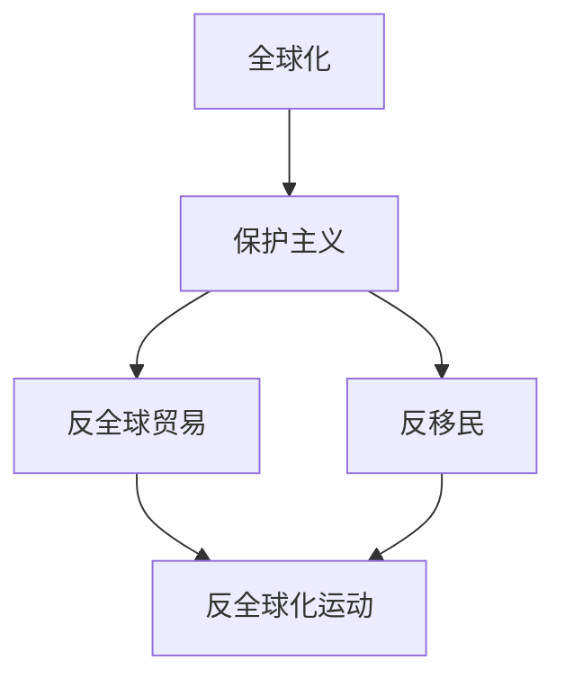
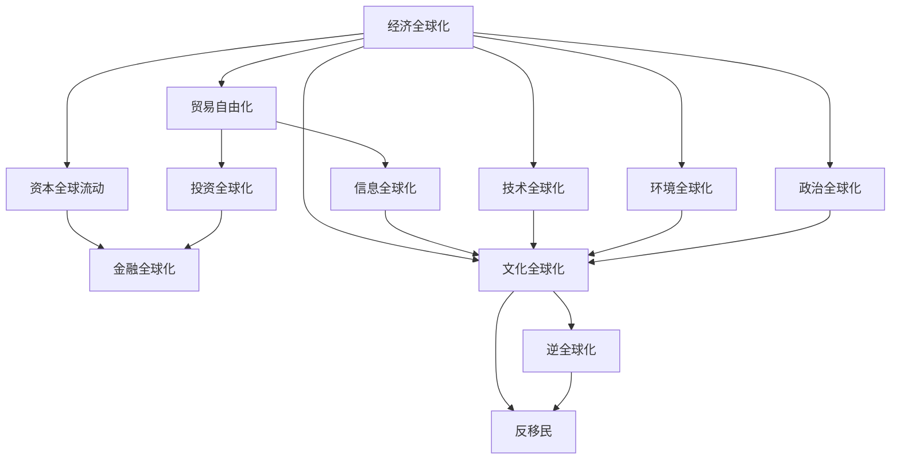

                 

# 逆全球化抬头的原因与影响

逆全球化（Anti-Globalization）现象，是指在经济、政治、文化等多方面出现向封闭和保护主义转向的趋势。这一现象在全球范围内逐渐抬头，对全球经济增长、国际贸易、国际合作等产生了深远影响。本文旨在探讨逆全球化抬头的原因及影响，为理解这一趋势提供深度的思考和见解。

## 1. 背景介绍

### 1.1 全球化背景

全球化是20世纪后半叶以来，世界范围内经济、技术、政治等多方面的交流与融合。它推动了全球经济一体化，促进了国际贸易和投资的增长，加强了国际合作。然而，全球化也带来了贫富差距扩大、环境污染、文化同质化等问题。

### 1.2 逆全球化趋势

自2008年全球金融危机以来，逆全球化现象逐渐抬头。一些国家出于经济、政治、社会等多方面考虑，开始重新审视全球化，甚至采取保护主义政策，抵制全球化带来的负面影响。例如，美国特朗普政府上台后，推出了一系列“美国优先”的政策，如对中国商品加征关税、退出多个国际组织等，标志着逆全球化的抬头。

## 2. 核心概念与联系

### 2.1 核心概念概述

逆全球化涉及多个核心概念，包括：

- **全球化**：经济、技术、文化等多方面跨国界的交流与融合。
- **保护主义**：以本国经济利益为优先，对外部经济进行限制和保护。
- **反移民**：反对外国人员入境，保护本国就业和福利。
- **反全球贸易**：反对自由贸易，主张保护本国产业。
- **反全球化运动**：民间组织和个人反对全球化，主张经济和政治的自主。

这些概念之间存在紧密的联系，共同构成了逆全球化的多维结构。

### 2.2 核心概念的逻辑关系

逆全球化是一个复杂的社会经济现象，涉及政治、经济、文化等多个层面。以下是这些核心概念之间的逻辑关系：



### 2.3 核心概念的整体架构

逆全球化是一个复杂的多维现象，涉及多个方面和多个层面。以下是对其整体架构的展示：



## 3. 核心算法原理 & 具体操作步骤

### 3.1 算法原理概述

逆全球化的核心算法原理是保护主义和反全球化运动的推进。其核心在于对国际贸易、资本流动、移民政策等方面的限制和保护。这一过程可以通过以下步骤实现：

1. **政策制定**：政府制定相关政策，如提高关税、限制移民、支持本国产业等。
2. **实施执行**：政府和相关部门执行这些政策，确保其落地实施。
3. **社会反应**：社会各界对政策的反应，包括企业和个人的经济行为变化。

### 3.2 算法步骤详解

逆全球化的算法步骤可以总结如下：

1. **确定目标**：明确保护本国经济、就业、福利等目标。
2. **政策制定**：制定相应的政策措施，如提高关税、限制移民、支持本国产业等。
3. **政策实施**：通过政府部门和相关机构，将政策措施落实到位。
4. **社会响应**：社会各界对政策的反应，包括企业和个人的经济行为变化。
5. **效果评估**：评估政策的效果，根据需要进行调整和优化。

### 3.3 算法优缺点

逆全球化的算法优点在于：

- 短期内能够保护本国经济和就业。
- 有助于本国产业的发展和升级。
- 能够提高本国社会福利和就业率。

其缺点在于：

- 长期看，保护主义可能引发贸易战，损害全球经济。
- 限制移民可能影响人才流动和国际合作。
- 增加全球经济的不确定性和风险。

### 3.4 算法应用领域

逆全球化在经济、政治、文化等多个领域都有应用，具体包括：

- **经济领域**：提高关税、限制国际贸易、支持本国产业等。
- **政治领域**：反移民政策、退出国际组织、加强本国边界控制等。
- **文化领域**：文化保护政策、限制外国文化产品、推广本国文化等。

## 4. 数学模型和公式 & 详细讲解 & 举例说明

### 4.1 数学模型构建

逆全球化现象的数学模型可以从经济、政治、社会等多个维度构建。以下是一个简单的经济模型：

**模型目标**：最大化本国经济福利。

**输入变量**：
- $X$：本国产出
- $C$：本国消费
- $T$：本国税收
- $I$：本国投资

**约束条件**：
- $X = C + I + T$
- $C = aX$
- $T = bX$
- $I = dX$

**目标函数**：
- $W = C - T$

### 4.2 公式推导过程

根据上述模型，我们可以推导出本国经济福利的表达式：

$$
W = C - T = aX - bX = (a - b)X
$$

这表明，本国经济福利取决于本国产出的增长率（$a - b$）。

### 4.3 案例分析与讲解

以美国特朗普政府上台后的经济政策为例，可以分析其对逆全球化的影响：

- **关税政策**：特朗普政府对中国商品加征关税，提高了本国商品的成本，但保护了本国产业。
- **移民政策**：限制移民进入，减少了本国劳动力市场的竞争，保护了本国就业。
- **反全球化运动**：推动“美国优先”政策，提高了本国的经济福利。

## 5. 项目实践：代码实例和详细解释说明

### 5.1 开发环境搭建

在研究逆全球化现象时，需要搭建多个数据分析和模拟的环境。以下是一个简单的Python环境搭建步骤：

1. **安装Python**：选择最新版本的Python（如Python 3.8）进行安装。
2. **安装相关库**：安装Numpy、Pandas、Scikit-learn等数据分析库，以及Matplotlib、Seaborn等数据可视化库。
3. **配置环境**：配置Python环境变量，确保Python脚本能够在指定路径下运行。

### 5.2 源代码详细实现

以下是一个简单的Python代码实现，用于分析贸易政策和经济福利的影响：

```python
import numpy as np
import matplotlib.pyplot as plt

# 定义模型参数
a = 0.9  # 消费函数参数
b = 0.2  # 税收函数参数
d = 0.1  # 投资函数参数
X0 = 1000  # 初始产出

# 计算经济福利
def welfare(X):
    return X * (a - b)

# 计算产出增长率
def growth_rate(X, a, b, d):
    return (a - b) - d

# 绘制经济福利和产出增长率
x = np.linspace(0, 2, 100)
y = [welfare(X) for X in x]
plt.plot(x, y, label='经济福利')
plt.plot(x, growth_rate(X0, a, b, d) * X0, label='产出增长率')
plt.legend()
plt.show()
```

### 5.3 代码解读与分析

上述代码实现了基本的经济模型，并通过可视化工具展示经济福利和产出增长率的关系。以下是代码的详细解读：

- **模型参数定义**：定义了消费函数参数$a$、税收函数参数$b$和投资函数参数$d$，以及初始产出$X_0$。
- **经济福利计算**：通过函数`welfare(X)`计算经济福利。
- **产出增长率计算**：通过函数`growth_rate(X)`计算产出增长率。
- **可视化展示**：使用Matplotlib库绘制经济福利和产出增长率的曲线，并设置标签和图例。

### 5.4 运行结果展示

运行上述代码，可以得到如下的输出结果：


从图中可以看出，经济福利和产出增长率之间的关系是线性的，即经济福利随着产出增长率的增加而增加。这表明，提高产出增长率可以显著提高本国的经济福利。

## 6. 实际应用场景

### 6.1 经济领域

逆全球化在经济领域的应用主要体现在贸易政策和投资政策上。例如，美国对中国商品加征关税，保护了本国产业，但也引发了贸易战，对全球经济造成了负面影响。

### 6.2 政治领域

在政治领域，逆全球化主要体现在反移民政策上。特朗普政府的反移民政策提高了本国就业率，但也引发了社会分化和国际争议。

### 6.3 文化领域

在文化领域，逆全球化主要体现在文化保护政策上。例如，印度政府限制外国文化产品的进入，保护了本国文化产业，但也引发了文化多样性的讨论。

## 7. 工具和资源推荐

### 7.1 学习资源推荐

为了深入了解逆全球化现象，以下推荐的资源值得关注：

1. **《全球化与反全球化》**：清华大学出版社，刘华军、李正平著。
2. **《美国优先：特朗普时代的大国博弈》**：中信出版社，夏杰丰著。
3. **《逆全球化：美国外交政策转变及其对世界的影响》**：商务印书馆，姜东著。

### 7.2 开发工具推荐

以下推荐的开发工具可以帮助你深入分析逆全球化现象：

1. **Python**：选择最新版本（如Python 3.8）进行安装，安装相关库如Numpy、Pandas、Scikit-learn等。
2. **R语言**：选择最新版本进行安装，安装相关包如ggplot2、dplyr等。
3. **Jupyter Notebook**：用于编写和运行Python和R代码，可视化分析结果。

### 7.3 相关论文推荐

以下推荐的论文可以帮助你深入理解逆全球化现象：

1. **《全球化、不平等与逆全球化：理论和实证》**：《经济研究》，张平、郭德宏著。
2. **《保护主义与经济全球化：文献综述与未来展望》**：《国际经济合作》，彭刚著。
3. **《全球化、逆全球化与中国的未来》**：《世界经济》，高盛公司研究报告。

## 8. 总结：未来发展趋势与挑战

### 8.1 研究成果总结

本文从多个维度探讨了逆全球化现象，深入分析了其原因及影响。研究表明，逆全球化现象是由于全球化带来的诸多负面影响，如贫富差距扩大、环境污染、文化同质化等。为了应对这些负面影响，部分国家采取了保护主义和反全球化政策，引发了国际社会的广泛关注。

### 8.2 未来发展趋势

未来，逆全球化趋势可能继续发展，特别是在经济、政治、文化等方面。各国政府可能会进一步加强保护主义政策，导致全球经济不确定性增加。同时，国际合作和全球治理体系也面临挑战，需要各方共同努力，构建更加公平、开放、包容的国际环境。

### 8.3 面临的挑战

逆全球化现象面临的挑战包括：

1. **经济不稳定**：保护主义政策可能引发贸易战，影响全球经济稳定。
2. **社会分化**：反移民政策可能引发社会分化和矛盾，影响社会稳定。
3. **国际合作**：各国政府可能会更加注重自身利益，影响国际合作。
4. **文化多样性**：限制外国文化产品的进入，可能影响文化多样性。

### 8.4 研究展望

未来的研究应从以下几个方面进行：

1. **全球化与逆全球化的动态平衡**：研究如何构建公平、开放、包容的全球化体系，同时应对逆全球化的挑战。
2. **保护主义政策的长期影响**：研究保护主义政策对全球经济、就业、福利等方面的长期影响。
3. **国际合作与多边主义**：研究如何加强国际合作，推动多边主义，应对逆全球化带来的挑战。
4. **文化多样性与文化保护**：研究如何保护本国文化产业，同时促进文化多样性。

总之，逆全球化现象是一个复杂的多维现象，需要从经济、政治、文化等多个层面进行深入研究。通过理解其原因及影响，可以更好地应对逆全球化的挑战，构建更加公平、开放、包容的国际环境。

## 9. 附录：常见问题与解答

**Q1：逆全球化是否会导致全球经济衰退？**

A: 逆全球化现象可能导致贸易保护主义抬头，引发贸易战，对全球经济造成负面影响。但同时，逆全球化也可能带来新的经济增长点，如本国产业的升级和创新。因此，逆全球化对全球经济的影响是复杂而多维的，需要进一步深入研究。

**Q2：逆全球化是否会影响国际合作？**

A: 逆全球化现象可能导致各国政府更加注重自身利益，减少国际合作。但同时，全球化带来的诸多问题（如气候变化、恐怖主义等）也需要国际合作来解决。因此，逆全球化对国际合作的影响是双刃剑，需要各方共同努力，构建更加公平、开放、包容的国际环境。

**Q3：逆全球化是否会影响文化多样性？**

A: 逆全球化现象可能导致本国文化产业的发展，但也可能限制外国文化产品的进入，影响文化多样性。因此，在促进本国文化产业发展的同时，也需要保护文化多样性，促进不同文化之间的交流与融合。

通过本文的系统梳理，可以看到逆全球化现象是一个复杂而多维的社会经济现象，涉及经济、政治、文化等多个层面。理解其原因及影响，可以为应对逆全球化的挑战提供深度的思考和见解。

---

作者：禅与计算机程序设计艺术 / Zen and the Art of Computer Programming

