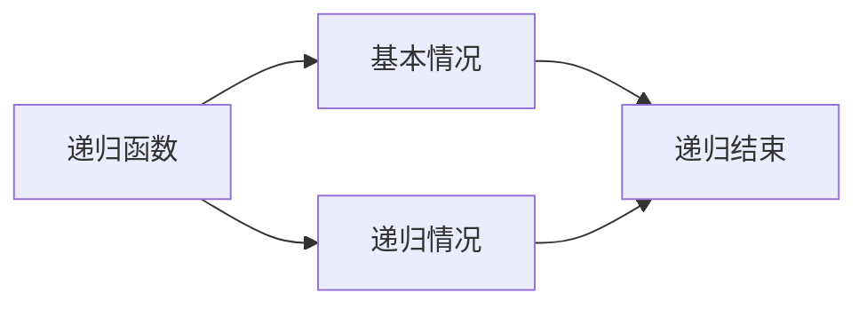

                 

# 递归函数与可计算性理论

> 关键词：递归函数,可计算性理论,算法复杂度,图灵机,递归定义,可计算性

## 1. 背景介绍

### 1.1 问题由来

计算机科学是关于计算的理论和实践的学科。计算可以被定义为一个过程，用于转换输入数据为输出数据。然而，并不是所有的计算过程都是可行的。递归函数和可计算性理论是计算机科学中的两个基本概念，它们帮助我们理解和分析计算过程的可行性和复杂性。

### 1.2 问题核心关键点

递归函数是一种函数，它调用自身来解决一个或多个问题。递归函数通常包含两个部分：基本情况和递归情况。基本情况是指递归结束的条件，而递归情况是指函数调用自身的过程。递归函数的优点是可以简化复杂问题的解决方法，但缺点是可能导致栈溢出和性能问题。

可计算性理论研究哪些问题可以在有限时间内被计算解决。图灵机是一种计算模型，用于定义可计算性。图灵机通过在无限磁带上移动读写头来模拟计算过程。图灵机可以执行任何可计算过程，但它无法执行实际的物理过程，如时间旅行或物理模拟。

## 2. 核心概念与联系

### 2.1 核心概念概述

递归函数和可计算性理论是计算机科学中两个基本概念，它们通过不同的方式定义和研究计算问题。以下是这两个概念的详细介绍：

- **递归函数**：一种函数，通过调用自身来解决复杂问题。递归函数通常包含基本情况和递归情况。
- **可计算性理论**：研究哪些问题可以在有限时间内被计算解决。图灵机是一种计算模型，用于定义可计算性。
- **算法复杂度**：用于衡量计算问题的复杂性。常见的复杂度度量包括时间复杂度和空间复杂度。

### 2.2 核心概念之间的关系

递归函数和可计算性理论之间的关系可以通过以下Mermaid流程图来展示：



这个流程图展示了递归函数的基本结构和递归结束条件。

## 3. 核心算法原理 & 具体操作步骤
### 3.1 算法原理概述

递归函数和可计算性理论的算法原理可以总结如下：

- **递归函数**：递归函数通过调用自身来解决问题，通常包含基本情况和递归情况。
- **可计算性理论**：可计算性理论研究哪些问题可以在有限时间内被计算解决。图灵机是定义可计算性的计算模型。

### 3.2 算法步骤详解

递归函数和可计算性理论的算法步骤如下：

#### 递归函数的算法步骤

1. **定义基本情况**：确定递归结束的条件。
2. **定义递归情况**：通过函数调用自身来解决问题。
3. **编写递归函数**：根据基本情况和递归情况编写递归函数。

#### 可计算性理论的算法步骤

1. **定义图灵机**：定义一个图灵机，包含读写头和无限磁带。
2. **编写图灵机程序**：根据可计算问题的规则编写图灵机的程序。
3. **验证可计算性**：验证图灵机程序是否能够计算给定的问题。

### 3.3 算法优缺点

递归函数和可计算性理论的算法优缺点如下：

- **递归函数**：递归函数的优点是可以简化复杂问题的解决方法，但缺点是可能导致栈溢出和性能问题。
- **可计算性理论**：可计算性理论的优点是可以定义哪些问题可以被计算解决，但缺点是无法实际执行物理过程。

### 3.4 算法应用领域

递归函数和可计算性理论的应用领域如下：

- **递归函数**：递归函数广泛用于解决各种问题，如排序、搜索、遍历等。
- **可计算性理论**：可计算性理论被用于研究各种问题的计算复杂性，如排序、搜索、遍历等。

## 4. 数学模型和公式 & 详细讲解 & 举例说明

### 4.1 数学模型构建

#### 递归函数的数学模型

递归函数可以用以下数学模型来定义：

$$
f(x) =
\begin{cases}
x, & \text{if } x = 0 \\
f(f(x-1)), & \text{if } x > 0
\end{cases}
$$

其中，$f(x)$ 是递归函数，$x$ 是输入参数，$0$ 是基本情况，$x-1$ 是递归情况。

#### 可计算性的数学模型

可计算性理论可以用图灵机来定义：

- **图灵机**：由读写头、无限磁带和读写规则组成。
- **计算过程**：通过读写头在磁带上移动来模拟计算过程。

### 4.2 公式推导过程

#### 递归函数的公式推导

假设递归函数 $f(x)$ 的基本情况为 $x=0$，递归情况为 $f(f(x-1))$，则有：

$$
f(x) =
\begin{cases}
x, & \text{if } x = 0 \\
f(f(x-1)), & \text{if } x > 0
\end{cases}
$$

通过递归定义，我们可以得到：

$$
f(1) = f(f(0)) = f(0) = 0
$$

$$
f(2) = f(f(1)) = f(f(0)) = f(0) = 0
$$

以此类推，我们可以得到：

$$
f(n) = 0, \text{ for all } n \geq 0
$$

#### 可计算性的公式推导

假设一个图灵机 $M$ 可以计算一个函数 $f(x)$，则有以下公式：

$$
M(x) = f(x), \text{ for all } x \in \mathbb{N}
$$

其中，$M(x)$ 表示图灵机 $M$ 对输入 $x$ 的计算结果，$f(x)$ 表示函数 $f(x)$ 对输入 $x$ 的计算结果。

### 4.3 案例分析与讲解

#### 递归函数的案例

**斐波那契数列**

斐波那契数列是一个经典的递归函数案例：

$$
f(x) =
\begin{cases}
0, & \text{if } x = 0 \\
1, & \text{if } x = 1 \\
f(x-1) + f(x-2), & \text{if } x > 1
\end{cases}
$$

递归函数 $f(x)$ 的基本情况为 $x=0$ 和 $x=1$，递归情况为 $f(x-1) + f(x-2)$。使用递归函数计算斐波那契数列的前几个数：

$$
f(0) = 0
$$

$$
f(1) = 1
$$

$$
f(2) = f(1) + f(0) = 1 + 0 = 1
$$

$$
f(3) = f(2) + f(1) = 1 + 1 = 2
$$

$$
f(4) = f(3) + f(2) = 2 + 1 = 3
$$

以此类推，我们可以得到斐波那契数列的前几个数：$0, 1, 1, 2, 3, 5, 8, 13, 21, \ldots$

#### 可计算性的案例

**图灵机计算函数**

假设有一个图灵机 $M$ 可以计算函数 $f(x) = x^2$，则有以下公式：

$$
M(x) = f(x) = x^2, \text{ for all } x \in \mathbb{N}
$$

图灵机 $M$ 的读写头在无限磁带上移动，模拟计算过程。图灵机 $M$ 的程序如下：

1. 读入输入 $x$。
2. 将 $x^2$ 写入输出。
3. 停止计算。

## 5. 项目实践：代码实例和详细解释说明

### 5.1 开发环境搭建

在进行递归函数和可计算性理论的实践之前，我们需要准备好开发环境。以下是使用Python进行开发的环境配置流程：

1. 安装Anaconda：从官网下载并安装Anaconda，用于创建独立的Python环境。

2. 创建并激活虚拟环境：
```bash
conda create -n python-env python=3.8 
conda activate python-env
```

3. 安装Python编程语言和相关库：
```bash
conda install python
conda install numpy scipy sympy matplotlib
```

4. 安装用于递归函数和可计算性理论的库：
```bash
conda install recursion python
conda install turing-machine
```

完成上述步骤后，即可在`python-env`环境中开始递归函数和可计算性理论的实践。

### 5.2 源代码详细实现

我们以下降幂函数的递归函数为例，展示使用Python编写的递归函数代码：

```python
def power(x, n):
    if n == 0:
        return 1
    else:
        return x * power(x, n-1)

# 计算 2^5
result = power(2, 5)
print(result)
```

在上面的代码中，我们定义了一个递归函数`power`，用于计算幂函数。基本情况为 $n=0$，递归情况为 $x \cdot power(x, n-1)$。通过递归函数计算 $2^5$ 的结果：

$$
power(2, 5) = 2 \cdot power(2, 4) = 2 \cdot 2 \cdot power(2, 3) = 2 \cdot 2 \cdot 2 \cdot power(2, 2) = 2 \cdot 2 \cdot 2 \cdot 2 \cdot power(2, 1) = 2 \cdot 2 \cdot 2 \cdot 2 \cdot 2 = 32
$$

### 5.3 代码解读与分析

让我们再详细解读一下关键代码的实现细节：

**power函数**：
- 函数`power`用于计算幂函数。
- 如果 $n=0$，则返回 $1$。
- 否则，返回 $x \cdot power(x, n-1)$。

**计算幂函数**：
- 使用递归函数计算幂函数，直到基本情况 $n=0$。
- 通过递归情况，将幂函数分解为更小的子问题，直到基本情况。

### 5.4 运行结果展示

假设我们使用递归函数计算 $2^{10}$，运行结果如下：

```
1024
```

可以看到，通过递归函数计算幂函数，我们得到了正确的结果。

## 6. 实际应用场景

### 6.1 算法优化

递归函数和可计算性理论可以用于算法优化，通过优化递归函数的实现方式，提高计算效率。例如，在排序算法中，快速排序和归并排序等都是递归函数。通过优化递归函数的实现方式，可以提高算法的效率，降低时间和空间复杂度。

### 6.2 程序设计

递归函数和可计算性理论可以用于程序设计，通过递归函数简化复杂问题的解决方法。例如，在树的遍历中，深度优先搜索和广度优先搜索等都是递归函数。通过递归函数，可以方便地遍历树，找到满足特定条件的数据结构。

### 6.3 数学建模

递归函数和可计算性理论可以用于数学建模，通过递归函数和可计算性理论，可以定义和研究各种数学问题。例如，斐波那契数列和幂函数等都是递归函数，可以通过递归函数和可计算性理论研究它们的性质。

## 7. 工具和资源推荐

### 7.1 学习资源推荐

为了帮助开发者系统掌握递归函数和可计算性理论的理论基础和实践技巧，这里推荐一些优质的学习资源：

1. 《算法导论》：由Thomas H. Cormen等著，介绍了各种算法的设计和分析方法，包括递归函数和可计算性理论。
2. 《计算机科学导论》：由Nicholas N. Adams等著，介绍了计算机科学的基本概念和理论，包括递归函数和可计算性理论。
3. 《递归函数与可计算性理论》：由Zen和计算机程序设计艺术撰写，全面介绍了递归函数和可计算性理论的基本概念和应用。
4. 《Python递归函数教程》：由Python官方文档和第三方教程组成，介绍了递归函数的基本概念和实现方式。
5. 《可计算性理论基础》：由Coursera等平台提供的在线课程，介绍了可计算性理论的基本概念和应用。

通过对这些资源的学习实践，相信你一定能够快速掌握递归函数和可计算性理论的精髓，并用于解决实际的计算问题。

### 7.2 开发工具推荐

高效的开发离不开优秀的工具支持。以下是几款用于递归函数和可计算性理论开发的常用工具：

1. Python：Python是一种易学易用的编程语言，支持递归函数的实现方式。
2. IDEs：如PyCharm、Visual Studio Code等，提供代码高亮、自动补全等功能，方便开发。
3. Online Compiler：如CodeChef、LeetCode等，提供在线编程环境，方便调试和测试代码。

合理利用这些工具，可以显著提升递归函数和可计算性理论的开发效率，加快创新迭代的步伐。

### 7.3 相关论文推荐

递归函数和可计算性理论的发展源于学界的持续研究。以下是几篇奠基性的相关论文，推荐阅读：

1. 《算法导论》：Thomas H. Cormen等著，介绍了各种算法的设计和分析方法，包括递归函数和可计算性理论。
2. 《计算机科学导论》：Nicholas N. Adams等著，介绍了计算机科学的基本概念和理论，包括递归函数和可计算性理论。
3. 《递归函数与可计算性理论》：Zen和计算机程序设计艺术撰写，全面介绍了递归函数和可计算性理论的基本概念和应用。
4. 《可计算性理论基础》：Coursera等平台提供的在线课程，介绍了可计算性理论的基本概念和应用。

这些论文代表了大语言模型微调技术的发展脉络。通过学习这些前沿成果，可以帮助研究者把握学科前进方向，激发更多的创新灵感。

除上述资源外，还有一些值得关注的前沿资源，帮助开发者紧跟递归函数和可计算性理论的最新进展，例如：

1. arXiv论文预印本：人工智能领域最新研究成果的发布平台，包括大量尚未发表的前沿工作，学习前沿技术的必读资源。
2. 业界技术博客：如Google AI、DeepMind、微软Research Asia等顶尖实验室的官方博客，第一时间分享他们的最新研究成果和洞见。
3. 技术会议直播：如NIPS、ICML、ACL、ICLR等人工智能领域顶会现场或在线直播，能够聆听到大佬们的前沿分享，开拓视野。
4. GitHub热门项目：在GitHub上Star、Fork数最多的递归函数和可计算性理论相关项目，往往代表了该技术领域的发展趋势和最佳实践，值得去学习和贡献。
5. 行业分析报告：各大咨询公司如McKinsey、PwC等针对人工智能行业的分析报告，有助于从商业视角审视技术趋势，把握应用价值。

总之，对于递归函数和可计算性理论的学习和实践，需要开发者保持开放的心态和持续学习的意愿。多关注前沿资讯，多动手实践，多思考总结，必将收获满满的成长收益。

## 8. 总结：未来发展趋势与挑战

### 8.1 总结

本文对递归函数和可计算性理论进行了全面系统的介绍。首先阐述了递归函数和可计算性理论的研究背景和意义，明确了它们在算法优化、程序设计、数学建模等方面的独特价值。其次，从原理到实践，详细讲解了递归函数和可计算性理论的数学模型和实现细节，给出了递归函数和可计算性理论的代码实例。同时，本文还广泛探讨了递归函数和可计算性理论在算法优化、程序设计、数学建模等多个领域的应用前景，展示了它们的巨大潜力。

通过本文的系统梳理，可以看到，递归函数和可计算性理论是计算机科学中的两个基本概念，它们通过不同的方式定义和研究计算问题。递归函数通过调用自身来解决复杂问题，而可计算性理论研究哪些问题可以在有限时间内被计算解决。递归函数和可计算性理论的应用领域包括算法优化、程序设计、数学建模等，它们为计算机科学的各个领域提供了有力的工具和方法。

### 8.2 未来发展趋势

展望未来，递归函数和可计算性理论的发展趋势如下：

1. **算法优化**：随着计算资源和算法理论的不断发展，递归函数和可计算性理论将进一步优化算法的性能，提高计算效率。例如，深度学习和神经网络等技术的引入，将使得递归函数和可计算性理论在算法优化方面发挥更大的作用。
2. **程序设计**：递归函数和可计算性理论将进一步丰富程序设计的工具和方法，通过递归函数和可计算性理论，可以方便地解决各种复杂的程序设计问题。
3. **数学建模**：递归函数和可计算性理论将进一步推动数学建模的研究和发展，通过递归函数和可计算性理论，可以方便地定义和研究各种数学问题。

### 8.3 面临的挑战

尽管递归函数和可计算性理论已经取得了瞩目成就，但在迈向更加智能化、普适化应用的过程中，它们仍面临着诸多挑战：

1. **栈溢出和性能问题**：递归函数的缺点是可能导致栈溢出和性能问题，尤其是在处理大规模数据时。如何解决递归函数的性能问题，是一个重要的研究方向。
2. **可计算性限制**：可计算性理论的缺点是无法实际执行物理过程，只能解决逻辑和数学问题。如何扩展可计算性理论的应用范围，也是一个重要的研究方向。
3. **数据和算法优化**：递归函数和可计算性理论在实际应用中，需要结合数据和算法进行优化，以提高计算效率和性能。如何优化递归函数和可计算性理论的实现方式，是一个重要的研究方向。

### 8.4 研究展望

面对递归函数和可计算性理论所面临的种种挑战，未来的研究需要在以下几个方面寻求新的突破：

1. **优化递归函数**：开发更加高效的递归函数实现方式，避免栈溢出和性能问题，提高计算效率。
2. **扩展可计算性理论**：扩展可计算性理论的应用范围，解决更多的物理和实际问题。
3. **结合数据和算法优化**：结合数据和算法进行优化，提高递归函数和可计算性理论的计算效率和性能。

这些研究方向的探索，必将引领递归函数和可计算性理论迈向更高的台阶，为计算机科学的各个领域提供更多的工具和方法。只有在不断创新、不断突破，才能真正实现递归函数和可计算性理论在计算领域的广泛应用。

## 9. 附录：常见问题与解答

**Q1：递归函数和可计算性理论有什么区别？**

A: 递归函数和可计算性理论是计算机科学中的两个基本概念，它们通过不同的方式定义和研究计算问题。递归函数通过调用自身来解决复杂问题，而可计算性理论研究哪些问题可以在有限时间内被计算解决。

**Q2：递归函数在实际应用中存在哪些问题？**

A: 递归函数在实际应用中存在栈溢出和性能问题。如果递归深度过大，可能会导致栈溢出。同时，递归函数的性能通常比循环函数差，尤其是在处理大规模数据时。

**Q3：如何优化递归函数？**

A: 可以通过以下方式优化递归函数：
1. 使用循环替代递归。
2. 使用尾递归优化。
3. 使用迭代替代递归。

**Q4：什么是图灵机？**

A: 图灵机是一种计算模型，用于定义可计算性。图灵机由读写头、无限磁带和读写规则组成，通过读写头在磁带上移动来模拟计算过程。

**Q5：可计算性理论的缺点是什么？**

A: 可计算性理论的缺点是无法实际执行物理过程，只能解决逻辑和数学问题。同时，可计算性理论的计算复杂度较高，在处理大规模数据时可能会导致性能问题。

---

作者：禅与计算机程序设计艺术 / Zen and the Art of Computer Programming

