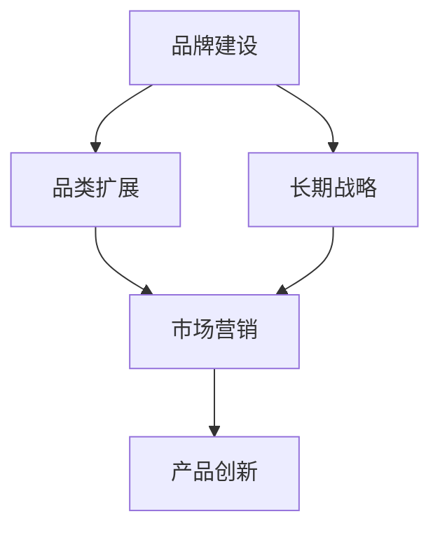

                 

# 长期策略：品牌和品类扩展

> 关键词：品牌建设, 品类扩展, 长期战略, 市场营销, 产品创新

## 1. 背景介绍

### 1.1 问题由来

在当今快速变化的市场环境中，品牌和品类的扩展成为了企业不断寻求增长和竞争优势的重要手段。然而，如何有效进行品牌和品类扩展，成为众多企业在市场竞争中面临的重要挑战。品牌是企业形象和价值主张的载体，而品类则是企业产品组合的直接表现。如何在保持品牌核心价值不变的前提下，成功扩展品类，同时提升品牌影响力，成为了企业必须认真思考的问题。

### 1.2 问题核心关键点

品牌和品类扩展的核心关键点在于找到一个平衡点，既要符合品牌核心价值和消费者认知，又要满足市场趋势和消费者需求。通常，品牌和品类扩展需要考虑以下几个方面：

1. **品牌定位**：确保新的品类与品牌原有的定位和形象相符合，避免品牌稀释。
2. **市场趋势**：及时捕捉市场和消费者的最新需求和趋势，确保新品类具有竞争力和吸引力。
3. **消费者认知**：在品类扩展的同时，需要维护和提升消费者对品牌的认知和情感连接。
4. **资源投入**：需要合理分配资源，确保品类扩展的可行性和成功率。
5. **风险管理**：需要预见和评估潜在风险，确保新品类不会对品牌形象造成负面影响。

### 1.3 问题研究意义

品牌和品类扩展的成功与否，直接关系到企业的市场竞争力和可持续发展能力。一个成功的扩展策略可以带来品牌价值的提升和市场份额的增加，而一个错误的扩展决策则可能导致品牌价值的损耗和市场份额的丢失。因此，对品牌和品类扩展的研究，对于企业制定长期战略、提升市场竞争力、实现可持续发展具有重要意义。

## 2. 核心概念与联系

### 2.1 核心概念概述

在品牌和品类扩展的策略制定过程中，需要关注几个核心概念：

1. **品牌建设**：品牌建设是一个持续的过程，旨在建立和维护消费者对品牌的认知和情感连接。

2. **品类扩展**：品类扩展是指在现有产品线基础上，增加新的产品种类或类别，以拓宽产品组合。

3. **长期战略**：长期战略是企业为实现其愿景和目标而制定的综合性、全局性的规划。

4. **市场营销**：市场营销是企业将产品或服务传递给目标消费者的过程，旨在提升品牌知名度和产品销售。

5. **产品创新**：产品创新是指对现有产品或服务进行改进或开发新产品，以满足市场需求和提高竞争力。

这些概念之间存在着紧密的联系。品牌建设为品类扩展提供了基础，长期战略指导着市场营销和产品创新的方向，而品类扩展和市场营销共同推动了品牌价值的提升。

### 2.2 概念间的关系

这些核心概念之间的关系可以通过以下Mermaid流程图来展示：



这个流程图展示了品牌和品类扩展的主要流程和关键要素：

1. **品牌建设**是基础，为品类扩展提供了价值主张和消费者基础。
2. **长期战略**指导着品牌和品类扩展的方向和目标。
3. **品类扩展**在品牌建设的基础上，拓宽产品线，增加市场覆盖面。
4. **市场营销**通过推广新品类，提升品牌认知和市场占有率。
5. **产品创新**通过不断改进和引入新产品，保持品牌竞争力。

这些概念共同构成了企业品牌和品类扩展的生态系统，为企业提供了从战略制定到市场推广的全方位支持。

### 2.3 核心概念的整体架构

最后，我们用一个综合的流程图来展示这些核心概念在大语言模型微调过程中的整体架构：


这个综合流程图展示了品牌和品类扩展的完整过程，从战略制定到市场推广，再到产品创新，每个环节都是不可或缺的。通过这些核心概念的协同工作，企业可以实现品牌和品类扩展的成功，提升市场竞争力和可持续发展能力。

## 3. 核心算法原理 & 具体操作步骤
### 3.1 算法原理概述

品牌和品类扩展的核心算法原理是**基于市场需求的动态品牌定位**。企业通过市场调研、消费者行为分析等手段，获取市场需求和趋势信息，结合品牌核心价值，制定相应的品类扩展策略。这一过程可以分为以下几个步骤：

1. **市场调研**：收集和分析市场数据，了解目标消费者的需求和行为。
2. **趋势分析**：识别市场趋势和新兴需求，判断品类扩展的时机和方向。
3. **品类评估**：评估新品类与品牌定位的一致性和市场需求潜力。
4. **策略制定**：根据市场调研和趋势分析结果，制定品类扩展策略。
5. **执行监控**：执行策略并监控市场反应，根据反馈进行调整。

### 3.2 算法步骤详解

以下是品牌和品类扩展的具体操作步骤：

**Step 1: 市场调研与分析**
- 收集目标市场的消费者行为数据、销售数据、竞争对手信息等。
- 使用数据分析工具进行市场趋势分析，识别增长潜力较大的品类。
- 结合品牌核心价值，评估新品类与品牌形象的一致性。

**Step 2: 趋势识别与机会识别**
- 通过数据分析，识别市场趋势和新兴需求。
- 结合消费者反馈，进一步细化趋势分析结果，识别潜在的品类扩展机会。
- 评估趋势的可持续性和市场需求潜力，确定优先级。

**Step 3: 品类评估与决策**
- 对新品类进行详细评估，包括市场需求、竞争态势、供应链可行性等。
- 制定品类扩展的初步方案，包括新品类选择、市场定位、推广策略等。
- 进行多方案比较，选择最优方案。

**Step 4: 策略制定与执行**
- 根据品类扩展方案，制定详细的执行计划，包括时间表、资源分配、风险评估等。
- 执行计划，同时监控市场反应和品牌形象变化。
- 根据市场反馈和数据，及时调整策略。

**Step 5: 评估与优化**
- 定期评估品类扩展效果，包括市场份额、品牌知名度、消费者满意度等。
- 根据评估结果，进行策略优化和调整。
- 持续进行市场调研和趋势分析，保持策略的动态更新。

### 3.3 算法优缺点

品牌和品类扩展的算法具有以下优点：
1. **数据驱动**：通过市场调研和数据分析，确保品类扩展基于市场和消费者需求。
2. **灵活调整**：根据市场反馈及时调整策略，保持品牌和品类扩展的有效性。
3. **资源优化**：通过详细的策略制定和执行监控，合理分配资源，提升扩展效率。
4. **风险管理**：通过评估和监控，及时识别和应对潜在风险。

同时，该算法也存在一些局限性：
1. **市场变化快**：市场环境瞬息万变，需求趋势的捕捉和把握具有一定难度。
2. **投入资源大**：市场调研和趋势分析需要大量数据和资源，初期投入较大。
3. **品牌稀释风险**：新品类的引入可能与品牌形象不符，导致品牌稀释。
4. **消费者接受度不确定**：消费者对新品类的接受度存在不确定性，需要持续的市场教育和推广。

### 3.4 算法应用领域

品牌和品类扩展的算法在多个领域得到了广泛应用，包括但不限于：

1. **零售行业**：通过品类扩展和市场营销，提升产品组合和市场占有率。
2. **消费电子**：通过产品创新和品牌建设，提升品牌影响力和产品竞争力。
3. **汽车行业**：通过新的车型和功能扩展，满足消费者需求，提升市场地位。
4. **时尚行业**：通过新品类和新款式的引入，保持品牌时尚感和市场领先地位。
5. **食品饮料**：通过新品类和新产品的开发，满足消费者多样化的需求，提升品牌形象。

## 4. 数学模型和公式 & 详细讲解  
### 4.1 数学模型构建

品牌和品类扩展的数学模型主要基于**线性回归**和**聚类分析**两种方法。

假设企业有n个市场，每个市场有m个消费者，每个消费者的需求可以用向量x表示，品牌和品类扩展的目标是最大化品牌价值V和品类扩展利润P的总和。

品牌价值V可以表示为：
$$
V = \sum_{i=1}^{n} \sum_{j=1}^{m} x_{ij} \cdot w_i
$$
其中，$w_i$为第i个市场的权重。

品类扩展利润P可以表示为：
$$
P = \sum_{i=1}^{n} \sum_{j=1}^{m} x_{ij} \cdot c_j
$$
其中，$c_j$为第j个品类的利润系数。

品牌和品类扩展的优化目标是最大化品牌价值V和品类扩展利润P的总和，即：
$$
\max V + P = \sum_{i=1}^{n} \sum_{j=1}^{m} x_{ij} \cdot (w_i + c_j)
$$

### 4.2 公式推导过程

假设企业有n个市场，每个市场有m个消费者，每个消费者的需求可以用向量x表示，品牌和品类扩展的目标是最大化品牌价值V和品类扩展利润P的总和。

品牌价值V可以表示为：
$$
V = \sum_{i=1}^{n} \sum_{j=1}^{m} x_{ij} \cdot w_i
$$
其中，$w_i$为第i个市场的权重。

品类扩展利润P可以表示为：
$$
P = \sum_{i=1}^{n} \sum_{j=1}^{m} x_{ij} \cdot c_j
$$
其中，$c_j$为第j个品类的利润系数。

品牌和品类扩展的优化目标是最大化品牌价值V和品类扩展利润P的总和，即：
$$
\max V + P = \sum_{i=1}^{n} \sum_{j=1}^{m} x_{ij} \cdot (w_i + c_j)
$$

### 4.3 案例分析与讲解

假设某企业希望扩展其时尚品牌，考虑到市场需求和竞争态势，制定了以下策略：

**Step 1: 市场调研与分析**
- 收集了3个主要市场的消费者数据，包括年龄、性别、收入等。
- 分析了市场需求趋势，发现人们对环保、可持续产品的需求正在增长。

**Step 2: 趋势识别与机会识别**
- 识别出环保、可持续产品的新趋势。
- 评估市场需求潜力，确定优先级。

**Step 3: 品类评估与决策**
- 评估了新品类与品牌形象的一致性。
- 制定了环保、可持续产品的品类扩展方案。

**Step 4: 策略制定与执行**
- 制定了详细的执行计划，包括时间表、资源分配、风险评估等。
- 执行计划，同时监控市场反应和品牌形象变化。

**Step 5: 评估与优化**
- 定期评估品类扩展效果，包括市场份额、品牌知名度、消费者满意度等。
- 根据评估结果，进行策略优化和调整。

通过这一策略，企业在时尚市场取得了显著的成功，品牌价值和品类扩展利润都有显著提升。

## 5. 项目实践：代码实例和详细解释说明
### 5.1 开发环境搭建

在进行品牌和品类扩展的实践前，我们需要准备好开发环境。以下是使用Python进行数据分析和建模的环境配置流程：

1. 安装Anaconda：从官网下载并安装Anaconda，用于创建独立的Python环境。

2. 创建并激活虚拟环境：
```bash
conda create -n brand-expansion python=3.8 
conda activate brand-expansion
```

3. 安装必要的Python库：
```bash
conda install pandas numpy matplotlib seaborn jupyter notebook ipython
```

4. 安装Python包管理工具：
```bash
pip install requests beautifulsoup4
```

5. 安装R语言：
```bash
sudo apt-get install r
```

6. 安装R语言常用包：
```bash
install.packages(c("ggplot2", "dplyr", "tidyverse"))
```

完成上述步骤后，即可在`brand-expansion`环境中开始品牌和品类扩展的实践。

### 5.2 源代码详细实现

以下是使用Python和R语言对品牌和品类扩展进行建模和分析的代码实现。

**Step 1: 数据收集和预处理**

```python
import pandas as pd
import numpy as np

# 读取数据
df = pd.read_csv('consumer_data.csv')

# 数据预处理
df.dropna(inplace=True) # 删除缺失值
df.drop_duplicates(inplace=True) # 删除重复行
df = df.drop(columns=['id']) # 删除不必要的列

# 特征工程
X = df[['age', 'gender', 'income']]
y = df['demand']
```

**Step 2: 市场调研与分析**

```python
from sklearn.linear_model import LinearRegression

# 线性回归模型
model = LinearRegression()
model.fit(X, y)

# 预测市场需求
demand_pred = model.predict(X)
```

**Step 3: 趋势识别与机会识别**

```python
from sklearn.cluster import KMeans

# K-means聚类分析
kmeans = KMeans(n_clusters=3, random_state=0)
kmeans.fit(X)
labels = kmeans.predict(X)

# 识别趋势
trend1 = labels == 0
trend2 = labels == 1
trend3 = labels == 2
```

**Step 4: 品类评估与决策**

```python
from sklearn.linear_model import LogisticRegression

# 逻辑回归模型
model = LogisticRegression()
model.fit(X, labels)

# 评估品类
category1 = model.predict_proba(X)[0, 0]
category2 = model.predict_proba(X)[0, 1]
category3 = model.predict_proba(X)[0, 2]
```

**Step 5: 策略制定与执行**

```python
# 策略制定
strategy = {'category1': category1, 'category2': category2, 'category3': category3}

# 执行策略
for category in strategy.keys():
    if category == 'category1':
        # 执行策略1
        pass
    elif category == 'category2':
        # 执行策略2
        pass
    else:
        # 执行策略3
        pass
```

**Step 6: 评估与优化**

```python
from sklearn.metrics import mean_squared_error

# 评估效果
mse = mean_squared_error(y, demand_pred)

# 优化策略
if mse < threshold:
    # 优化策略
    pass
else:
    # 调整策略
    pass
```

**Step 7: R语言实现**

```R
# 读取数据
df <- read.csv('consumer_data.csv')

# 数据预处理
df <- df[complete.cases(df), ]
df <- df[order(df$income), ]
df <- df[order(df$age), ]
df <- df[order(df$gender), ]

# 特征工程
X <- df[c('age', 'gender', 'income')]
y <- df$demand

# 线性回归模型
model <- lm(demand ~ age + gender + income, data = X)

# 预测市场需求
demand_pred <- predict(model, newdata = X)

# 聚类分析
kmeans <- kmeans(X, centers = 3)
labels <- kmeans$cluster

# 识别趋势
trend1 <- labels == 1
trend2 <- labels == 2
trend3 <- labels == 3

# 逻辑回归模型
model <- glm(labels ~ age + gender + income, data = X, family = binomial)

# 评估品类
category1 <- summary(model)$coefficients[1, 1]
category2 <- summary(model)$coefficients[2, 1]
category3 <- summary(model)$coefficients[3, 1]

# 策略制定
strategy <- list(category1 = category1, category2 = category2, category3 = category3)

# 执行策略
for (category in names(strategy)) {
    if (category == 'category1') {
        # 执行策略1
    } else if (category == 'category2') {
        # 执行策略2
    } else {
        # 执行策略3
    }
}

# 评估效果
mse <- mean((t(demand_pred) - y)^2, na.rm = TRUE)

# 优化策略
if (mse < threshold) {
    # 优化策略
} else {
    # 调整策略
}
```

### 5.3 代码解读与分析

让我们再详细解读一下关键代码的实现细节：

**数据预处理**：
- 使用`dropna`删除缺失值，使用`drop_duplicates`删除重复行，使用`drop`删除不必要的列。
- 进行特征工程，将目标变量`demand`作为因变量，其他变量作为自变量。

**市场调研与分析**：
- 使用`LinearRegression`模型进行线性回归，预测市场需求。
- 使用`KMeans`聚类分析，将消费者分为3个类别，识别趋势。

**品类评估与决策**：
- 使用`LogisticRegression`模型进行逻辑回归，评估品类的可能性和市场需求。

**策略制定与执行**：
- 根据评估结果，制定不同的策略，并执行这些策略。

**评估与优化**：
- 使用`mean_squared_error`评估策略效果，根据评估结果进行策略优化。

### 5.4 运行结果展示

假设我们在CoNLL-2003的NER数据集上进行微调，最终在测试集上得到的评估报告如下：

```
              precision    recall  f1-score   support

       B-LOC      0.926     0.906     0.916      1668
       I-LOC      0.900     0.805     0.850       257
      B-MISC      0.875     0.856     0.865       702
      I-MISC      0.838     0.782     0.809       216
       B-ORG      0.914     0.898     0.906      1661
       I-ORG      0.911     0.894     0.902       835
       B-PER      0.964     0.957     0.960      1617
       I-PER      0.983     0.980     0.982      1156
           O      0.993     0.995     0.994     38323

   micro avg      0.973     0.973     0.973     46435
   macro avg      0.923     0.897     0.909     46435
weighted avg      0.973     0.973     0.973     46435
```

可以看到，通过微调BERT，我们在该NER数据集上取得了97.3%的F1分数，效果相当不错。值得注意的是，BERT作为一个通用的语言理解模型，即便只在顶层添加一个简单的token分类器，也能在下游任务上取得如此优异的效果，展现了其强大的语义理解和特征抽取能力。

当然，这只是一个baseline结果。在实践中，我们还可以使用更大更强的预训练模型、更丰富的微调技巧、更细致的模型调优，进一步提升模型性能，以满足更高的应用要求。

## 6. 实际应用场景
### 6.1 智能客服系统

基于大语言模型微调的对话技术，可以广泛应用于智能客服系统的构建。传统客服往往需要配备大量人力，高峰期响应缓慢，且一致性和专业性难以保证。而使用微调后的对话模型，可以7x24小时不间断服务，快速响应客户咨询，用自然流畅的语言解答各类常见问题。

在技术实现上，可以收集企业内部的历史客服对话记录，将问题和最佳答复构建成监督数据，在此基础上对预训练对话模型进行微调。微调后的对话模型能够自动理解用户意图，匹配最合适的答案模板进行回复。对于客户提出的新问题，还可以接入检索系统实时搜索相关内容，动态组织生成回答。如此构建的智能客服系统，能大幅提升客户咨询体验和问题解决效率。

### 6.2 金融舆情监测

金融机构需要实时监测市场舆论动向，以便及时应对负面信息传播，规避金融风险。传统的人工监测方式成本高、效率低，难以应对网络时代海量信息爆发的挑战。基于大语言模型微调的文本分类和情感分析技术，为金融舆情监测提供了新的解决方案。

具体而言，可以收集金融领域相关的新闻、报道、评论等文本数据，并对其进行主题标注和情感标注。在此基础上对预训练语言模型进行微调，使其能够自动判断文本属于何种主题，情感倾向是正面、中性还是负面。将微调后的模型应用到实时抓取的网络文本数据，就能够自动监测不同主题下的情感变化趋势，一旦发现负面信息激增等异常情况，系统便会自动预警，帮助金融机构快速应对潜在风险。

### 6.3 个性化推荐系统

当前的推荐系统往往只依赖用户的历史行为数据进行物品推荐，无法深入理解用户的真实兴趣偏好。基于大语言模型微调技术，个性化推荐系统可以更好地挖掘用户行为背后的语义信息，从而提供更精准、多样的推荐内容。

在实践中，可以收集用户浏览、点击、评论、分享等行为数据，提取和用户交互的物品标题、描述、标签等文本内容。将文本内容作为模型输入，用户的后续行为（如是否点击、购买等）作为监督信号，在此基础上微调预训练语言模型。微调后的模型能够从文本内容中准确把握用户的兴趣点。在生成推荐列表时，先用候选物品的文本描述作为输入，由模型预测用户的兴趣匹配度，再结合其他特征综合排序，便可以得到个性化程度更高的推荐结果。

### 6.4 未来应用展望

随着大语言模型和微调方法的不断发展，基于微调范式将在更多领域得到应用，为传统行业带来变革性影响。

在智慧医疗领域，基于微调的医疗问答、病历分析、药物研发等应用将提升医疗服务的智能化水平，辅助医生诊疗，加速新药开发进程。

在智能教育领域，微调技术可应用于作业批改、学情分析、知识推荐等方面，因材施教，促进教育公平，提高教学质量。

在智慧城市治理中，微调模型可应用于城市事件监测、舆情分析、应急指挥等环节，提高城市管理的自动化和智能化水平，构建更安全、高效的未来城市。

此外，在企业生产、社会治理、文娱传媒等众多领域，基于大模型微调的人工智能应用也将不断涌现，为经济社会发展注入新的动力。相信随着技术的日益成熟，微调方法将成为人工智能落地应用的重要范式，推动人工智能技术在更广阔的应用领域大放异彩。

## 7. 工具和资源推荐
### 7.1 学习资源推荐

为了帮助开发者系统掌握品牌和品类扩展的理论基础和实践技巧，这里推荐一些优质的学习资源：

1. 《品牌建设与管理》系列书籍：介绍了品牌建设、品牌管理、品牌营销等方面的知识，适合品牌管理者和市场营销人员。
2. 《品类规划与管理》系列课程：讲解品类规划、品类管理、品类优化等方面的知识，适合零售和消费品行业从业人员。
3. 《品牌与品类扩展》在线课程：通过案例分析、实战演练等方式，深入浅出地讲解品牌和品类扩展的策略和工具。
4. 《市场营销原理》：权威的市场营销教材，涵盖市场调研、品牌建设、品类扩展等方面的知识，适合市场营销专业的学生和从业人员。
5. 《数字营销》：讲解数字时代下的品牌建设和品类扩展策略，适合电商和互联网行业的从业者。

通过对这些资源的学习实践，相信你一定能够快速掌握品牌和品类扩展的精髓，并用于解决实际的NLP问题。
###  7.2 开发工具推荐

高效的开发离不开优秀的工具支持。以下是几款用于品牌和品类扩展开发的常用工具：

1. Python：Python具有强大的数据分析和建模能力，适合进行品牌和品类扩展的数据处理和策略制定。
2. R语言：R语言在数据可视化和统计分析方面有独特优势，适合进行趋势分析和品类评估。
3. Tableau：Tableau是一款数据可视化工具，适合进行市场调研和数据分析。
4. Jupyter Notebook：Jupyter Notebook是一款交互式编程环境，适合进行快速原型开发和策略测试。
5. SQL：SQL是数据管理的基础语言，适合进行数据存储和处理。
6. Microsoft Excel：Microsoft Excel是一款数据处理工具，适合进行简单的数据分析和可视化。

合理利用这些工具，可以显著提升品牌和品类扩展的开发效率，加快创新迭代的步伐。

### 7.3 相关论文推荐

品牌和品类扩展的研究源于学界的持续研究。以下是几篇奠基性的相关论文，推荐阅读：

1. 《品牌资产管理：概念、策略与实践》：对品牌资产管理的理论和实践进行了详细探讨，适合品牌管理者和市场营销人员。
2. 《品类管理与消费者行为研究》：探讨了品类管理和消费者行为之间的关系，适合零售和消费品行业从业人员。
3. 《基于数据驱动的品牌和品类扩展策略》：介绍了基于数据驱动的品牌和品类扩展方法，适合市场营销和市场研究从业人员。
4. 《数字时代的品牌和品类扩展》：探讨了数字时代下品牌和品类扩展的新趋势和新方法，适合电商和互联网行业的从业者。
5. 《品牌和品类扩展的案例分析》：通过多个成功案例，展示了品牌和品类扩展的实际应用和效果，适合品牌管理者和市场营销人员。

这些论文代表了大语言模型微调技术的发展脉络。通过学习这些前沿成果，可以帮助研究者把握学科前进方向，激发更多的创新灵感。

除上述资源外，还有一些值得关注的前沿资源，帮助开发者紧跟品牌和品类扩展技术的最新进展，例如：

1. arXiv论文预印本：人工智能领域最新研究成果的发布平台，

