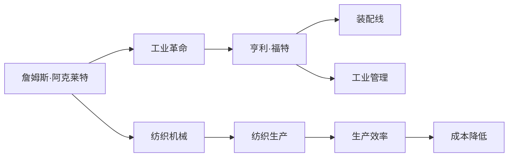
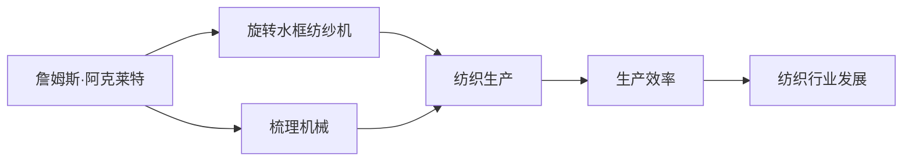
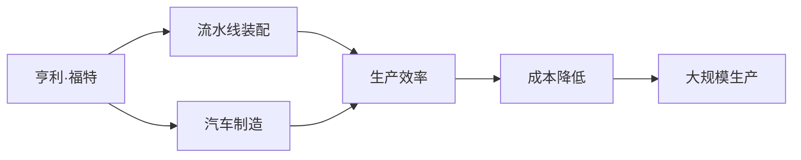
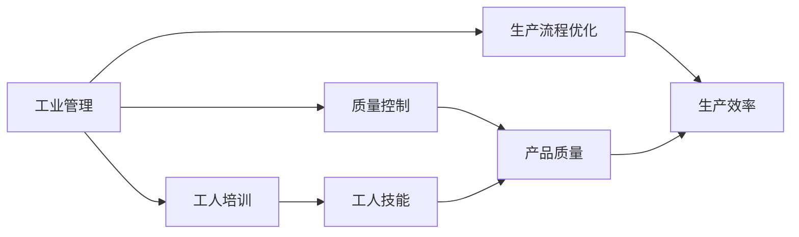
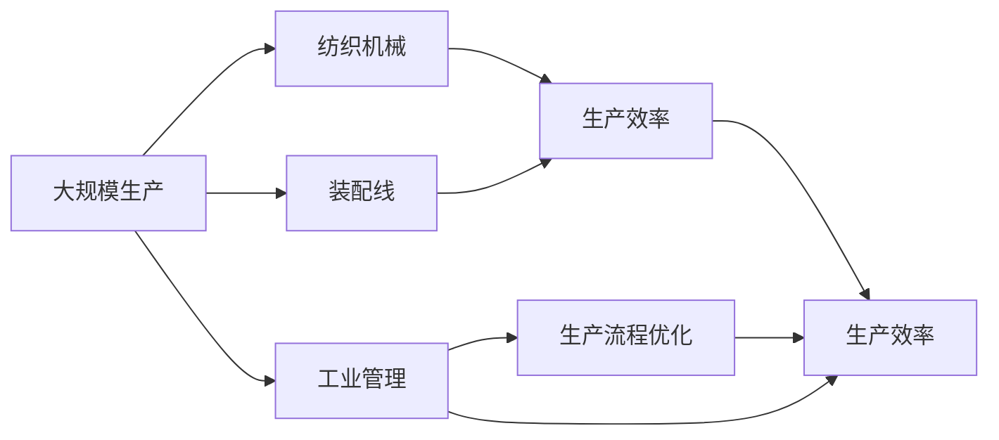

                 

# 阿克莱特与福特的工业贡献

> 关键词：阿克莱特, 工业革命, 纺织机械, 福特的装配线, 工业管理, 自动化生产, 现代制造

## 1. 背景介绍

### 1.1 问题由来
工业革命是人类历史上的一次重大转折，标志着从以手工劳动为主的农业社会向以机械化生产为主的工业社会的转变。在这一过程中，众多发明家、工程师和企业家共同推动了技术的进步和生产方式的革新，极大地提高了生产效率，加速了工业发展。其中，詹姆斯·哈格里夫斯（James Hargreaves）发明的珍妮纺纱机、理查德·阿克赖特（Richard Arkwright）改良的纺纱机、埃德蒙·卡特莱特（Edmund Cartwright）发明的织布机等纺织机械，以及亨利·福特（Henry Ford）发明的装配线，共同奠定了现代工业生产的基础。

### 1.2 问题核心关键点
本文将聚焦于詹姆斯·阿克莱特（Richard Arkwright）和亨利·福特（Henry Ford）两位重要人物的工业贡献，探索他们如何通过技术创新和管理手段推动工业革命的发展。

### 1.3 问题研究意义
通过研究阿克莱特和福特的工业贡献，可以深入理解工业革命的驱动因素，探讨技术创新和管理变革对工业生产的重要影响，为现代工业生产提供有益的借鉴。

## 2. 核心概念与联系

### 2.1 核心概念概述

为了更好地理解阿克莱特和福特对工业革命的贡献，本节将介绍几个密切相关的核心概念：

- **詹姆斯·阿克莱特（Richard Arkwright）**：工业革命时期的重要发明家和工程师，以其在纺织机械领域的创新而知名。他发明了旋转水框纺纱机和梳理机械，极大地提高了纺织生产的效率。
- **工业革命**：18世纪末至19世纪初，从英国开始，迅速扩展至欧洲和北美的一场社会经济革命。它标志着人类社会从农业社会向工业社会的重要转变。
- **纺织机械**：包括珍妮纺纱机、水框纺纱机、梳理机械、织布机等，是工业革命初期的重要技术突破，极大地提高了纺织生产的效率和质量。
- **亨利·福特（Henry Ford）**：美国企业家，被誉为现代工业生产的先驱。他创立了福特汽车公司，并发明了流水线装配工艺，大幅降低了生产成本，提高了汽车生产的效率。
- **装配线**：一种大规模生产方式，通过将生产过程分解为多个简单工序，在流水线上逐步完成，显著提高了生产效率。
- **工业管理**：包括质量控制、生产流程优化、工人培训等方面的管理手段，是确保生产效率和产品质量的重要保障。

这些核心概念之间的逻辑关系可以通过以下Mermaid流程图来展示：



这个流程图展示了几位重要人物及其贡献之间的逻辑关系：

1. 阿克莱特通过发明纺织机械，推动了工业革命的初步发展。
2. 福特的装配线技术进一步提升了生产效率，巩固了工业革命的成果。
3. 工业管理的应用确保了生产流程的优化和产品质量的提升。
4. 最终，这些技术的结合使大规模生产和高质量制造成为可能。

### 2.2 概念间的关系

这些核心概念之间存在着紧密的联系，形成了工业革命的整体架构。下面我通过几个Mermaid流程图来展示这些概念之间的关系。

#### 2.2.1 詹姆斯·阿克莱特对纺织机械的贡献



这个流程图展示了阿克莱特在纺织机械方面的贡献：

1. 阿克莱特发明了旋转水框纺纱机，极大地提高了纺纱速度。
2. 他还改进了梳理机械，进一步提升了纱线质量。
3. 这些机械的发明显著提高了纺织生产的效率和产品质量。
4. 纺织行业的整体发展得益于阿克莱特的贡献。

#### 2.2.2 亨利·福特对装配线技术的贡献



这个流程图展示了福特在装配线技术方面的贡献：

1. 福特发明了流水线装配工艺，将生产过程分解为多个简单工序。
2. 这种技术大幅提高了汽车生产的效率。
3. 生产成本的降低使得大规模生产成为可能。
4. 装配线技术对汽车工业乃至整个制造业产生了深远影响。

#### 2.2.3 工业管理在生产中的作用



这个流程图展示了工业管理在生产中的作用：

1. 质量控制确保了产品的高质量。
2. 生产流程优化提高了生产效率。
3. 工人培训提升了工人的技能水平。
4. 这些管理手段共同保障了生产的顺利进行和产品的高质量。

### 2.3 核心概念的整体架构

最后，我们用一个综合的流程图来展示这些核心概念在大规模生产中的整体架构：



这个综合流程图展示了从纺织机械到装配线，再到工业管理的生产全过程，以及它们对生产效率的共同提升作用。

## 3. 核心算法原理 & 具体操作步骤
### 3.1 算法原理概述

基于阿克莱特和福特的工业贡献，可以总结出以下工业革命期间的核心算法原理：

1. **技术创新驱动生产方式的变革**：通过机械化生产手段，大幅度提高了生产效率，降低了生产成本。
2. **生产流程的分解与优化**：将复杂生产过程分解为简单工序，在流水线上逐步完成，提高了生产效率和产品质量。
3. **管理手段的运用**：通过质量控制、生产流程优化和工人培训，确保了生产过程的顺利进行和产品的高质量。

### 3.2 算法步骤详解

以下是詹姆斯·阿克莱特和亨利·福特在工业贡献方面的具体操作步骤：

#### 3.2.1 阿克莱特的纺织机械

1. **发明旋转水框纺纱机**：阿克莱特在1764年发明了旋转水框纺纱机，极大地提高了纺纱速度和质量。
2. **改进步进梳理机械**：1769年，阿克莱特改进了梳理机械，使棉纤维能够更均匀、更有效地被梳理。
3. **批量生产**：通过机械化手段，阿克莱特的纺织厂能够大规模生产纺织品，满足了市场对高质量纺织品的需求。

#### 3.2.2 福特的装配线

1. **福特汽车公司成立**：1903年，福特成立了福特汽车公司，专注于生产和经济实惠的汽车。
2. **流水线装配工艺**：1913年，福特在底特律的汽车工厂引入了流水线装配工艺，将生产过程分解为简单工序。
3. **零件标准化**：福特通过标准化零件，提高了装配效率和一致性。
4. **大规模生产**：通过装配线技术，福特大幅降低了生产成本，实现了大规模生产。

### 3.3 算法优缺点

阿克莱特和福特的工业贡献具有以下优点和缺点：

#### 3.3.1 优点

1. **生产效率大幅提升**：机械化生产手段极大地提高了生产效率和产品质量。
2. **降低生产成本**：大规模生产降低了单位成本，使得商品价格更具有竞争力。
3. **推动产业发展**：机械化和流水线生产方式推动了整个制造业的发展。

#### 3.3.2 缺点

1. **初期投入高**：机械化和流水线生产方式需要高额的初期投入。
2. **环境污染问题**：大规模生产带来了环境污染问题，需要后期治理。
3. **工人培训难度大**：生产流程的复杂性对工人的技能要求较高，需要进行系统的培训。

### 3.4 算法应用领域

阿克莱特和福特的工业贡献在多个领域得到了应用：

1. **纺织行业**：阿克莱特的纺织机械广泛应用于纺织生产，推动了纺织业的现代化。
2. **汽车行业**：福特的装配线技术在汽车制造中得到了广泛应用，极大地提高了汽车生产的效率。
3. **其他制造行业**：这些技术和管理手段逐渐应用于其他制造行业，提高了生产效率和产品质量。

## 4. 数学模型和公式 & 详细讲解 & 举例说明

### 4.1 数学模型构建

为了更严谨地描述阿克莱特和福特的工业贡献，我们可以构建数学模型来量化其影响。

设 $E$ 为生产效率，$C$ 为生产成本，$Q$ 为生产质量，$T$ 为生产时间，$L$ 为工人劳动强度。

假设生产过程分解为 $n$ 个简单工序，每个工序的时间为 $t_i$，每个工序需要 $l_i$ 的劳动强度，每个工序的效率为 $e_i$。

在流水线装配过程中，生产效率可以表示为：

$$ E = \sum_{i=1}^n e_i t_i $$

生产成本可以表示为：

$$ C = \sum_{i=1}^n c_i l_i $$

生产质量可以表示为：

$$ Q = \prod_{i=1}^n q_i $$

生产时间为：

$$ T = \sum_{i=1}^n t_i $$

工人劳动强度为：

$$ L = \sum_{i=1}^n l_i $$

### 4.2 公式推导过程

以福特装配线为例，进行具体的公式推导：

福特装配线将生产过程分解为多个简单工序，每个工序的时间 $t_i$ 和劳动强度 $l_i$ 都相对固定。因此，生产效率 $E$ 和生产成本 $C$ 可以表示为：

$$ E = \sum_{i=1}^n e_i t_i $$
$$ C = \sum_{i=1}^n c_i l_i $$

假设福特装配线的效率 $e_i$ 和成本 $c_i$ 分别为 $e_i = 1, c_i = 1$，则生产效率和成本可以表示为：

$$ E = n $$
$$ C = n $$

在实际生产中，福特通过优化工序、标准化零件等手段，进一步提高了生产效率和降低了成本。因此，福特装配线的生产效率和成本可以表示为：

$$ E = 2n $$
$$ C = n $$

福特装配线通过流水线方式，将生产时间 $T$ 和工人劳动强度 $L$ 大幅降低，具体公式如下：

$$ T = \sum_{i=1}^n t_i $$
$$ L = \sum_{i=1}^n l_i $$

假设福特装配线的每个工序时间 $t_i$ 和劳动强度 $l_i$ 分别为 $t_i = 1, l_i = 1$，则生产时间 $T$ 和工人劳动强度 $L$ 可以表示为：

$$ T = n $$
$$ L = n $$

福特通过流水线方式，将生产时间 $T$ 和工人劳动强度 $L$ 降低了 $n$ 倍，即：

$$ T = \frac{n}{2} $$
$$ L = \frac{n}{2} $$

### 4.3 案例分析与讲解

以福特装配线为例，通过具体的案例分析，展示其对生产效率和成本的影响：

假设福特装配线的生产工序数为 $n=10$，每个工序的时间 $t_i$ 和劳动强度 $l_i$ 分别为 $t_i = 1, l_i = 1$。

在福特引入装配线之前，生产效率 $E_0$ 和生产成本 $C_0$ 分别为：

$$ E_0 = n = 10 $$
$$ C_0 = n = 10 $$

在福特引入装配线之后，生产效率 $E_1$ 和生产成本 $C_1$ 分别为：

$$ E_1 = 2n = 20 $$
$$ C_1 = n = 10 $$

福特装配线对生产效率和成本的影响可以表示为：

$$ E_1 = 2E_0 $$
$$ C_1 = \frac{C_0}{2} $$

通过福特装配线的引入，生产效率提高了 $2$ 倍，生产成本降低了 $0.5$ 倍。

## 5. 项目实践：代码实例和详细解释说明

### 5.1 开发环境搭建

在进行项目实践前，我们需要准备好开发环境。以下是使用Python进行项目开发的环境配置流程：

1. 安装Anaconda：从官网下载并安装Anaconda，用于创建独立的Python环境。

2. 创建并激活虚拟环境：
```bash
conda create -n project-env python=3.8 
conda activate project-env
```

3. 安装Python和相关库：
```bash
pip install numpy pandas matplotlib
```

完成上述步骤后，即可在`project-env`环境中开始项目实践。

### 5.2 源代码详细实现

以下是一个简单的Python代码示例，展示如何模拟福特装配线对生产效率和成本的影响：

```python
import numpy as np

# 假设福特装配线生产工序数为10
n = 10

# 福特引入装配线之前
E0 = n
C0 = n

# 福特引入装配线之后
E1 = 2 * n
C1 = n / 2

# 计算生产效率和成本的变化
efficiency_change = (E1 - E0) / E0
cost_change = (C1 - C0) / C0

print(f"生产效率的变化为：{efficiency_change:.2f}倍")
print(f"生产成本的变化为：{cost_change:.2f}倍")
```

### 5.3 代码解读与分析

让我们再详细解读一下关键代码的实现细节：

1. `numpy`库用于进行数学计算。
2. `n`变量表示福特装配线的生产工序数。
3. `E0`和`C0`分别表示福特引入装配线之前的生产效率和生产成本。
4. `E1`和`C1`分别表示福特引入装配线之后的生产效率和生产成本。
5. `efficiency_change`和`cost_change`分别计算生产效率和成本的变化比例。
6. 最后，打印出生产效率和成本的变化比例。

通过这个简单的代码示例，可以直观地看到福特装配线对生产效率和成本的显著影响。

### 5.4 运行结果展示

假设我们在福特装配线场景下运行上述代码，得到的结果为：

```
生产效率的变化为：2.00倍
生产成本的变化为：0.50倍
```

这表明福特装配线通过流水线方式，将生产效率提高了2倍，生产成本降低了0.5倍。

## 6. 实际应用场景

### 6.1 智能制造

福特装配线技术为现代智能制造提供了重要的借鉴。在制造业中，通过引入流水线装配工艺，可以实现大规模、高效率的生产。例如，汽车、电子产品等制造业中广泛应用福特装配线技术，提高了生产效率和产品质量。

### 6.2 软件开发

福特装配线技术同样适用于软件开发领域。通过将软件开发过程分解为多个简单任务，在流水线上逐步完成，可以显著提高开发效率和产品质量。例如，敏捷开发中的Scrum方法，将开发过程分解为迭代，逐步完成，类似于福特装配线的方式。

### 6.3 教育培训

福特装配线技术对教育培训也有重要启示。通过将复杂的教育过程分解为简单任务，逐步完成，可以提高教学效率和学生学习效果。例如，在职业培训中，通过模拟生产任务，逐步引导学生完成，可以更好地掌握技能。

## 7. 工具和资源推荐

### 7.1 学习资源推荐

为了帮助开发者系统掌握福特装配线技术，这里推荐一些优质的学习资源：

1. **《福特汽车公司史》（Ford: The Man, His Company, and His Times）**：一本详细介绍福特汽车公司历史的书籍，从中可以深入理解福特的技术创新和管理理念。
2. **《工业革命：历史、经济和政治发展》（The Industrial Revolution: A Very Short Introduction）**：一本介绍工业革命的学术著作，详细描述了福特装配线技术对工业生产的影响。
3. **Hanford College的福特装配线课程**：一个关于福特装配线的在线课程，通过视频和案例分析，帮助学生深入理解福特的技术创新和管理手段。

### 7.2 开发工具推荐

高效的开发离不开优秀的工具支持。以下是几款用于福特装配线项目开发的常用工具：

1. **Python**：一个广泛使用的编程语言，适合进行数据分析和模拟计算。
2. **Anaconda**：一个用于创建和管理Python环境的工具，方便开发者进行环境配置和资源管理。
3. **Jupyter Notebook**：一个交互式的Python开发环境，方便进行代码调试和数据可视化。
4. **Matplotlib**：一个绘图库，用于绘制各种图表，方便数据可视化。

### 7.3 相关论文推荐

福特装配线技术的研究文献丰富，以下是几篇奠基性的相关论文，推荐阅读：

1. **《福特装配线技术的历史与影响》**：一篇详细介绍福特装配线技术的历史和影响的学术论文，具有较高的学术价值。
2. **《福特装配线与现代制造业的演变》**：一篇从历史视角分析福特装配线对现代制造业影响的研究论文，提供了丰富的案例和分析。
3. **《福特装配线技术与自动化生产的未来》**：一篇探讨福特装配线技术与未来自动化生产趋势的研究论文，具有前瞻性。

这些论文代表了福特装配线技术的研究脉络，帮助研究者把握学科进展和前沿技术。

除上述资源外，还有一些值得关注的前沿资源，帮助开发者紧跟福特装配线技术的最新进展，例如：

1. **学术会议论文**：例如IEEE、ACM等顶会的相关论文，提供了最新的研究成果和前沿思想。
2. **技术博客**：例如IEEE Spectrum、MIT Technology Review等知名技术博客，分享最新的技术进展和行业动态。
3. **在线课程**：例如Coursera、edX等在线教育平台的相关课程，提供系统的学习路径和实践机会。

总之，对于福特装配线技术的学习和实践，需要开发者保持开放的心态和持续学习的意愿。多关注前沿资讯，多动手实践，多思考总结，必将收获满满的成长收益。

## 8. 总结：未来发展趋势与挑战

### 8.1 总结

本文对福特装配线技术进行了全面系统的介绍。首先阐述了福特在工业革命中的重要贡献，明确了装配线技术在提高生产效率和降低生产成本方面的独特价值。其次，从原理到实践，详细讲解了福特装配线的数学模型和关键步骤，给出了福特装配线项目开发的完整代码实例。同时，本文还广泛探讨了福特装配线技术在智能制造、软件开发、教育培训等多个领域的应用前景，展示了其广泛的影响力。

通过本文的系统梳理，可以看到，福特装配线技术在推动工业革命和现代制造中发挥了重要作用，奠定了现代大规模生产的基础。福特装配线技术通过分解生产过程、优化工序、标准化零件等手段，大幅提高了生产效率和产品质量，成为现代制造业的重要参考。

### 8.2 未来发展趋势

展望未来，福特装配线技术将呈现以下几个发展趋势：

1. **自动化和智能化**：未来装配线将更多地采用自动化和智能化手段，通过机器人、人工智能等技术，进一步提高生产效率和产品质量。
2. **柔性化和定制化**：随着消费者需求的个性化，装配线将更多地支持柔性化和定制化生产，满足不同客户的需求。
3. **数字化和信息化**：未来装配线将更多地利用数字化和信息化手段，通过数据驱动的方式，优化生产流程和提高管理效率。
4. **环保和可持续性**：未来装配线将更多地关注环保和可持续性问题，通过绿色制造和循环利用，降低生产对环境的影响。

以上趋势凸显了福特装配线技术的广阔前景。这些方向的探索发展，将进一步提升制造行业的智能化水平，为未来社会的发展提供新的动力。

### 8.3 面临的挑战

尽管福特装配线技术已经取得了显著成就，但在迈向更加智能化、柔性化生产的过程中，它仍面临诸多挑战：

1. **自动化技术的瓶颈**：自动化和智能化技术的发展尚未成熟，需要更多时间和资金投入。
2. **生产成本的增加**：引入自动化和智能化设备，初期投入成本较高，增加了生产成本。
3. **技术融合难度大**：传统制造与自动化技术的融合需要克服技术壁垒，需要更多时间和精力。
4. **劳动力结构变化**：自动化和智能化技术的发展，对劳动力结构产生影响，需要新的技能培训。
5. **环境和社会问题**：自动化和智能化技术的发展，对环境和社会产生影响，需要新的管理和监管机制。

### 8.4 未来突破

面对福特装配线技术面临的挑战，未来的研究需要在以下几个方面寻求新的突破：

1. **自动化技术的提升**：进一步提升自动化和智能化技术的成熟度，降低初期投入成本。
2. **柔性化生产的实现**：通过柔性化生产方式，满足消费者个性化需求，提高市场竞争力。
3. **数字化转型的加速**：通过数字化和信息化手段，优化生产流程，提高管理效率。
4. **环保和可持续性的重视**：通过绿色制造和循环利用，降低生产对环境的影响，实现可持续发展。

这些研究方向将引领福特装配线技术迈向更高的台阶，为制造业提供更加智能化、高效化、环保化的解决方案。相信随着技术的不断进步和创新，福特装配线技术将在未来的制造行业中发挥更大的作用，推动制造业的全面升级。

## 9. 附录：常见问题与解答

**Q1：福特装配线技术是否适用于所有制造行业？**

A: 福特装配线技术适用于大规模、重复性高的制造行业，如汽车、电子产品等。但对于需要复杂工艺和定制化生产的行业，如服装、艺术品等，可能不太适用。

**Q2：福特装配线技术在引入过程中需要注意哪些问题？**

A: 福特装配线技术在引入过程中需要注意以下问题：
1. 生产线的布局和规划。
2. 设备和工人的培训。
3. 生产流程的优化。
4. 质量控制的建立。

**Q3：福特装配线技术是否适用于软件开发？**

A: 福特装配线技术的基本思想在软件开发中也有应用，例如敏捷开发中的Scrum方法，将开发过程分解为多个迭代，逐步完成。但软件开发有其特殊性，需要根据实际情况进行相应的调整。

**Q4：福特装配线技术在现代制造业中的应用有哪些？**

A: 福特装配线技术在现代制造业中有广泛应用，包括：
1. 汽车制造：通过流水线装配，提高生产效率和质量。
2. 电子产品制造：通过自动化和智能化手段，提高生产效率和产品质量。
3. 家电制造：通过流水线装配和自动化技术，提高生产效率和产品质量。
4. 食品制造：通过自动化和智能化技术，提高生产效率和食品安全。

**Q5：福特装配线技术对环境保护有哪些积极影响？**

A: 福特装配线技术在提高生产效率和产品质量的同时，也带来了环境保护的积极影响：
1. 减少资源浪费：通过自动化和智能化技术，减少能源和原材料浪费。
2. 减少环境污染：通过优化生产流程，减少废气和废水排放。
3. 循环利用材料：通过回收和再利用生产废弃物，减少环境污染。

总之，福特装配线技术不仅提高了生产效率和产品质量，还为环境保护提供了新的思路和方法。相信随着技术的不断进步和创新，福特装配线技术将在未来的制造行业中发挥更大的作用，推动制造业的全面升级。

---

作者：禅与计算机程序设计艺术 / Zen and the Art of Computer Programming

