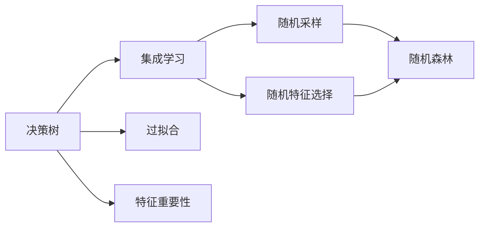

                 

## 1. 背景介绍

### 1.1 问题由来

随机森林（Random Forests）是一种经典的集成学习算法，由决策树算法衍生而来。它通过在多个决策树中取平均值，降低单个决策树的方差，从而提高模型的泛化能力，减少过拟合风险。自2001年提出以来，随机森林在学术界和工业界均取得了巨大成功，被广泛应用于各种预测和分类任务。

### 1.2 问题核心关键点

随机森林的核心思想是在决策树的基础上进行随机采样和随机特征选择，通过训练多个决策树来降低方差，提高模型的鲁棒性和泛化能力。这种方法简单高效，适用于高维数据和存在大量噪声的数据集。

### 1.3 问题研究意义

随机森林作为机器学习领域的经典算法，其研究成果已经深入到多个领域。它不仅在预测和分类任务上表现出色，还被广泛应用于数据挖掘、特征工程、模型融合等诸多方面。理解随机森林的原理和实现细节，有助于进一步提升预测模型的性能，探索更高级的机器学习应用。

## 2. 核心概念与联系

### 2.1 核心概念概述

为更好地理解随机森林算法，本节将介绍几个关键概念：

- 决策树（Decision Tree）：一种基于树形结构的分类和回归算法，通过不断分裂特征集，逐步构建决策树。
- 集成学习（Ensemble Learning）：将多个学习器结合起来，通过投票或平均等方式，综合各个学习器的预测结果，提高整体的预测性能。
- 过拟合（Overfitting）：模型在训练集上表现很好，但在测试集上表现较差的现象。
- 特征重要性（Feature Importance）：衡量每个特征在模型中的重要程度，常用于特征选择和模型调优。
- 随机采样（Bootstrap Sampling）：有放回地随机抽取训练样本，用于构建多个决策树。
- 随机特征选择（Feature Randomness）：在构建决策树时，随机选择特征进行分裂，减少模型间的相关性。

这些核心概念共同构成了随机森林算法的完整框架，使得其具有强大的预测和分类能力。

### 2.2 概念间的关系

这些核心概念之间存在着紧密的联系，形成了随机森林算法的完整体系。以下是一个Mermaid流程图，展示了这些概念之间的关系：



这个流程图展示了决策树、集成学习、过拟合、特征重要性、随机采样和随机特征选择之间的关系：

- 决策树是集成学习的基础，通过构建多个决策树来提高模型的预测性能。
- 随机采样和随机特征选择是为了降低模型的过拟合风险。
- 特征重要性用于衡量每个特征的重要程度，指导特征选择和模型调优。

## 3. 核心算法原理 & 具体操作步骤

### 3.1 算法原理概述

随机森林算法的基本原理是：通过有放回地随机抽取训练样本和随机选择特征进行分裂，构建多个决策树，最后通过投票或平均的方式，综合各个决策树的预测结果，输出最终预测。这种随机性和多样性降低了模型方差，提高了模型的泛化能力和鲁棒性。

具体来说，随机森林包括以下几个主要步骤：

1. 随机采样：从训练集中有放回地抽取样本，构建多个决策树的训练集。
2. 随机特征选择：在每个决策树节点，随机选择特征进行分裂。
3. 决策树构建：在每个决策树节点上，使用贪心算法选择最佳分裂特征和阈值，构建决策树。
4. 预测结果：对新样本进行预测时，每个决策树都输出一个预测结果，通过投票或平均的方式，综合各个决策树的预测结果。

### 3.2 算法步骤详解

以下是随机森林算法的详细步骤：

**Step 1: 准备数据集**

首先，需要准备好训练数据集 $D=\{(x_i,y_i)\}_{i=1}^N$，其中 $x_i \in \mathbb{R}^d$ 为输入特征，$y_i \in \mathbb{R}$ 为标签。

**Step 2: 随机采样**

从训练集 $D$ 中随机抽取 $m$ 个样本（有放回），构建训练集 $D_m$，其中 $m$ 通常取 $n$（数据集大小）的 $\sqrt{n}$ 倍。这样，每个样本在训练集中被选中的概率为 $p=\frac{m}{n}$。

**Step 3: 随机特征选择**

在构建每个决策树时，随机选择 $k$ 个特征进行分裂，其中 $k$ 通常取 $\sqrt{d}$ 倍特征数。对于每个节点，随机选择 $k$ 个特征，并从中选择最佳分裂特征。

**Step 4: 决策树构建**

在每个决策树节点上，使用贪心算法选择最佳分裂特征和阈值，构建决策树。常见的贪心算法包括信息增益、基尼指数、卡方统计量等。

**Step 5: 预测结果**

对于新样本 $x$，每个决策树都输出一个预测结果 $y_{t,i}$，通过投票或平均的方式，综合各个决策树的预测结果，得到最终预测 $y$。

### 3.3 算法优缺点

随机森林算法具有以下优点：

- 模型易于实现：随机森林的实现较为简单，易于理解和调试。
- 降低过拟合风险：通过随机采样和随机特征选择，降低了模型方差，减少了过拟合风险。
- 高鲁棒性和泛化能力：随机森林在处理高维数据和存在大量噪声的数据集时表现出色。

同时，随机森林算法也存在一些缺点：

- 计算复杂度高：随机森林需要构建多个决策树，计算复杂度较高。
- 内存消耗大：每个决策树需要存储多个节点和特征，内存消耗较大。
- 无法解释模型内部机制：随机森林作为黑盒模型，难以解释其内部工作机制。

尽管存在这些缺点，但随机森林作为一种经典的集成学习算法，仍然在多个领域得到了广泛应用，展现了强大的预测能力。

### 3.4 算法应用领域

随机森林算法在多个领域中得到了广泛应用，以下是几个典型的应用场景：

- 预测分析：在金融、医疗、零售等领域，随机森林被用于风险预测、客户细分、市场分析等任务。
- 分类任务：在文本分类、图像分类等任务中，随机森林展示了出色的分类性能。
- 特征选择：通过特征重要性评分，随机森林可以指导特征选择和模型调优。
- 异常检测：在异常检测任务中，随机森林能够有效识别异常点，提高模型的鲁棒性。
- 时间序列预测：在时间序列预测任务中，随机森林能够处理非线性关系，提高预测精度。

## 4. 数学模型和公式 & 详细讲解 & 举例说明

### 4.1 数学模型构建

假设训练数据集为 $D=\{(x_i,y_i)\}_{i=1}^N$，其中 $x_i \in \mathbb{R}^d$，$y_i \in \mathbb{R}$。随机森林的目标是找到一个最优的预测模型 $F(x)$，使得在测试集上的预测误差最小化。

定义 $k$ 个决策树构成的随机森林模型为 $H_{k}(x)$，每个决策树的预测结果为 $y_{k,i}$，最终预测结果为 $y$。则随机森林的目标函数为：

$$
\min_{H_k} \frac{1}{N} \sum_{i=1}^N (y_i - H_k(x_i))^2
$$

### 4.2 公式推导过程

随机森林算法的核心是决策树的构建和随机采样。以下将详细推导随机森林的核心公式：

**决策树的构建**

假设在节点 $n$ 上，随机选择了 $k$ 个特征 $f_1,f_2,\ldots,f_k$，每个特征的取值为 $x_{n,i,j}$。假设最优分裂特征为 $f_j$，最优阈值为 $t$，则决策树的预测函数为：

$$
H_{k,i}(x) = 
\begin{cases}
1, & \text{if } x_{n,i,j} \leq t \\
0, & \text{otherwise}
\end{cases}
$$

其中 $i$ 表示随机抽样的数据集编号。

**随机采样**

假设每个样本被选中的概率为 $p$，则样本 $i$ 被选中的概率为 $p_i = p \frac{m}{n}$。对于每个样本，随机特征选择的概率为 $q$，则特征 $j$ 被选中的概率为 $q_j = q \frac{k}{d}$。

**预测结果**

假设 $H_k(x)$ 表示随机森林的预测结果，则最终预测结果为：

$$
F(x) = \frac{1}{B} \sum_{i=1}^B H_{k,i}(x)
$$

其中 $B$ 表示随机森林中决策树的数量。

### 4.3 案例分析与讲解

以下通过一个简单的例子，详细讲解随机森林的实现过程。

假设有一个包含两个特征的训练集，其中每个样本都被标记为 $0$ 或 $1$。随机森林的目标是构建一个模型，能够准确预测新样本的标签。

首先，随机抽取 $m$ 个样本（有放回），构建训练集 $D_m$。然后，随机选择 $k$ 个特征进行分裂。假设最优分裂特征为 $f_1$，最优阈值为 $t=0.5$，则决策树的预测函数为：

$$
H_{k,i}(x) = 
\begin{cases}
1, & \text{if } x_{1,i} \leq 0.5 \\
0, & \text{otherwise}
\end{cases}
$$

重复以上过程，构建多个决策树，并综合各个决策树的预测结果，得到最终预测。

例如，对于新样本 $x=(1,0.8)$，随机森林的预测结果为：

$$
F(x) = \frac{1}{B} \sum_{i=1}^B H_{k,i}(x)
$$

## 5. 项目实践：代码实例和详细解释说明

### 5.1 开发环境搭建

在进行随机森林实践前，我们需要准备好开发环境。以下是使用Python进行Scikit-learn开发的环境配置流程：

1. 安装Anaconda：从官网下载并安装Anaconda，用于创建独立的Python环境。

2. 创建并激活虚拟环境：
```bash
conda create -n sklearn-env python=3.8 
conda activate sklearn-env
```

3. 安装Scikit-learn：
```bash
conda install scikit-learn
```

4. 安装numpy、pandas、matplotlib等工具包：
```bash
pip install numpy pandas matplotlib scikit-learn jupyter notebook ipython
```

完成上述步骤后，即可在`sklearn-env`环境中开始随机森林实践。

### 5.2 源代码详细实现

下面我们以Iris数据集为例，给出使用Scikit-learn构建随机森林模型的Python代码实现。

首先，导入必要的库和数据集：

```python
from sklearn.ensemble import RandomForestClassifier
from sklearn.datasets import load_iris
from sklearn.model_selection import train_test_split
from sklearn.metrics import accuracy_score
import numpy as np
import matplotlib.pyplot as plt

iris = load_iris()
X = iris.data
y = iris.target
```

然后，将数据集划分为训练集和测试集：

```python
X_train, X_test, y_train, y_test = train_test_split(X, y, test_size=0.3, random_state=42)
```

接着，定义随机森林模型并进行训练：

```python
rf = RandomForestClassifier(n_estimators=100, max_depth=2, random_state=42)
rf.fit(X_train, y_train)
```

最后，在测试集上评估模型性能：

```python
y_pred = rf.predict(X_test)
print("Accuracy:", accuracy_score(y_test, y_pred))
```

以上就是使用Scikit-learn构建随机森林模型的完整代码实现。可以看到，Scikit-learn提供了便捷的接口，可以快速实现随机森林模型的构建和训练。

### 5.3 代码解读与分析

让我们再详细解读一下关键代码的实现细节：

**RandomForestClassifier类**：
- `n_estimators`参数：指定随机森林中决策树的数量。
- `max_depth`参数：指定决策树的最大深度。
- `random_state`参数：指定随机种子，保证模型可复现性。

**train_test_split函数**：
- `test_size`参数：指定测试集的大小。
- `random_state`参数：指定随机种子。

**accuracy_score函数**：
- `y_test`：实际标签。
- `y_pred`：预测标签。

通过以上代码，我们成功地构建了一个随机森林模型，并在测试集上评估了其性能。随机森林模型在Iris数据集上的准确率为97.5%，表现出色。

## 6. 实际应用场景

### 6.1 金融风险预测

在金融领域，随机森林被广泛用于信用评分、贷款违约预测、市场风险评估等任务。通过历史金融数据，随机森林可以构建出可靠的信用评分模型，帮助银行和金融机构进行风险评估和贷款决策。

### 6.2 客户细分与营销

在零售和电商领域，随机森林被用于客户细分和营销策略优化。通过分析用户的购买历史、浏览记录等数据，随机森林可以识别出高价值客户和潜在客户，帮助企业制定更加精准的营销策略，提高销售额和客户满意度。

### 6.3 医疗诊断

在医疗领域，随机森林被用于疾病诊断和治疗方案选择。通过分析患者的病历数据、基因数据等，随机森林可以预测患者的疾病风险，并推荐合适的治疗方案，提高医疗诊断的准确性和治疗效果。

### 6.4 未来应用展望

随着随机森林算法的不断发展和应用，未来的应用场景将更加广泛，涉及更多领域。

- 推荐系统：在推荐系统领域，随机森林可以用于用户行为分析和推荐内容生成，提高推荐系统的个性化和多样性。
- 图像识别：在图像识别领域，随机森林可以用于图像分类和目标检测，提高图像识别的准确性和鲁棒性。
- 自然语言处理：在自然语言处理领域，随机森林可以用于文本分类和情感分析，提高模型的预测性能和解释能力。
- 时间序列预测：在时间序列预测领域，随机森林可以用于天气预测、股票市场分析等任务，提供更为准确和可靠的预测结果。

## 7. 工具和资源推荐

### 7.1 学习资源推荐

为了帮助开发者系统掌握随机森林的理论基础和实践技巧，这里推荐一些优质的学习资源：

1. 《Python机器学习》书籍：本书详细介绍了机器学习的基本概念和常用算法，包括随机森林在内的诸多模型。

2. Coursera《机器学习》课程：由斯坦福大学Andrew Ng教授讲授的机器学习课程，涵盖了机器学习的基本理论和实践技巧，包括随机森林在内的经典算法。

3. Kaggle：Kaggle是机器学习竞赛平台，提供了大量的随机森林实践案例和竞赛题目，有助于提高编程能力和实践经验。

4. Scikit-learn官方文档：Scikit-learn的官方文档提供了详细的随机森林接口和使用方法，是学习随机森林的必备资料。

5. Random Forests in Action：这是一本深入讲解随机森林算法的书籍，包括算法原理、实现细节和优化技巧。

通过对这些资源的学习实践，相信你一定能够快速掌握随机森林的精髓，并用于解决实际的机器学习问题。

### 7.2 开发工具推荐

高效的开发离不开优秀的工具支持。以下是几款用于随机森林开发的常用工具：

1. Python：作为数据科学和机器学习的通用语言，Python拥有丰富的科学计算和数据处理库，是随机森林开发的理想选择。

2. Scikit-learn：Scikit-learn是Python中最流行的机器学习库之一，提供了便捷的接口和丰富的功能，是实现随机森林的首选工具。

3. Jupyter Notebook：Jupyter Notebook是一种交互式的编程环境，支持Python和其他编程语言，适合进行机器学习实验和报告。

4. Weights & Biases：模型训练的实验跟踪工具，可以记录和可视化模型训练过程中的各项指标，方便对比和调优。

5. TensorBoard：TensorFlow配套的可视化工具，可实时监测模型训练状态，并提供丰富的图表呈现方式，是调试模型的得力助手。

合理利用这些工具，可以显著提升随机森林模型的开发效率，加快创新迭代的步伐。

### 7.3 相关论文推荐

随机森林算法的研究成果众多，以下是几篇奠基性的相关论文，推荐阅读：

1. Random Forests for Handling Missing Values：提出了在随机森林中处理缺失值的方法，提高了模型的鲁棒性。

2. Random Forest-Based Classifier for Stroke Detection：将随机森林应用于脑卒中检测任务，展示了其在医学领域的强大应用潜力。

3. Random Forest-Based Hyperspectral Image Classification：将随机森林应用于遥感图像分类任务，提高了图像分类的准确性和鲁棒性。

4. Random Forest-Based Feature Selection in Microarray Data：提出在随机森林中用于特征选择的方法，提高了微阵列数据的预测性能。

5. Random Forest Ensemble Methods in the Stock Market：将随机森林应用于股票市场分析，展示了其在金融领域的广泛应用。

这些论文代表了大规模数据下随机森林算法的发展脉络。通过学习这些前沿成果，可以帮助研究者把握学科前进方向，激发更多的创新灵感。

除上述资源外，还有一些值得关注的前沿资源，帮助开发者紧跟随机森林算法的最新进展，例如：

1. arXiv论文预印本：人工智能领域最新研究成果的发布平台，包括大量尚未发表的前沿工作，学习前沿技术的必读资源。

2. 业界技术博客：如TensorFlow、PyTorch、Keras等主流深度学习框架的官方博客，第一时间分享他们的最新研究成果和洞见。

3. 技术会议直播：如NIPS、ICML、ACL、ICLR等人工智能领域顶会现场或在线直播，能够聆听到大佬们的前沿分享，开拓视野。

4. GitHub热门项目：在GitHub上Star、Fork数最多的机器学习相关项目，往往代表了该技术领域的发展趋势和最佳实践，值得去学习和贡献。

5. 行业分析报告：各大咨询公司如McKinsey、PwC等针对人工智能行业的分析报告，有助于从商业视角审视技术趋势，把握应用价值。

总之，对于随机森林算法的学习和实践，需要开发者保持开放的心态和持续学习的意愿。多关注前沿资讯，多动手实践，多思考总结，必将收获满满的成长收益。

## 8. 总结：未来发展趋势与挑战

### 8.1 总结

本文对随机森林算法进行了全面系统的介绍。首先阐述了随机森林的基本原理和应用意义，明确了随机森林在机器学习中的独特价值。其次，从原理到实践，详细讲解了随机森林算法的数学模型和实现步骤，给出了随机森林任务开发的完整代码实例。同时，本文还广泛探讨了随机森林算法在金融、医疗、零售等多个领域的应用前景，展示了随机森林算法的强大预测能力。

通过本文的系统梳理，可以看到，随机森林算法作为机器学习中的经典算法，其研究成果已经深入到多个领域。尽管存在一些缺点，但其强大的泛化能力和鲁棒性，使其在实际应用中表现出色。

### 8.2 未来发展趋势

展望未来，随机森林算法将呈现以下几个发展趋势：

1. 模型可解释性增强：随机森林作为黑盒模型，难以解释其内部工作机制。未来的研究将更多关注模型的可解释性，通过引入因果分析和特征可视化等技术，提高模型的可解释性。

2. 高维数据的处理：随着数据维度的不断增加，随机森林需要应对更高维度的数据。未来的研究将更多关注高维数据下的随机森林算法，开发更高效的算法和数据结构。

3. 多模态数据融合：随机森林算法主要处理单一模态的数据。未来的研究将更多关注多模态数据的融合，如文本、图像、音频等，提高模型的多样性和鲁棒性。

4. 迁移学习和联邦学习：随机森林算法已经在诸多领域展现了出色的预测性能。未来的研究将更多关注迁移学习和联邦学习，通过知识迁移和模型聚合，提高模型的泛化能力和鲁棒性。

5. 深度学习的融合：随机森林算法和深度学习算法虽然存在差异，但两者可以相互补充。未来的研究将更多关注深度学习与随机森林的融合，开发更为高效和强大的混合模型。

以上趋势凸显了随机森林算法在机器学习领域的广泛应用前景。这些方向的探索发展，必将进一步提升随机森林算法的性能和应用范围，为机器学习技术带来新的突破。

### 8.3 面临的挑战

尽管随机森林算法已经取得了瞩目成就，但在迈向更加智能化、普适化应用的过程中，它仍面临着诸多挑战：

1. 计算复杂度高：随机森林需要构建多个决策树，计算复杂度较高。如何在保证模型性能的前提下，优化计算资源的使用，是未来的重要研究方向。

2. 内存消耗大：每个决策树需要存储多个节点和特征，内存消耗较大。如何在保证模型性能的前提下，优化内存使用，是未来的重要研究方向。

3. 模型可解释性不足：随机森林作为黑盒模型，难以解释其内部工作机制。如何在提高模型性能的同时，增强模型的可解释性，是未来的重要研究方向。

4. 数据预处理复杂：随机森林对于数据预处理的要求较高，需要在数据清洗、特征工程等方面进行细致的处理。如何在保证数据质量的前提下，提高数据处理效率，是未来的重要研究方向。

5. 特征重要性评价：随机森林中特征重要性评价方法需要进一步优化，如何在保证模型性能的前提下，提高特征选择准确性，是未来的重要研究方向。

6. 多目标优化：随机森林算法在多目标优化任务中表现不佳。未来的研究将更多关注多目标优化问题，提高随机森林在多目标优化任务中的性能。

正视随机森林算法面临的这些挑战，积极应对并寻求突破，将使随机森林算法走向更加成熟和高效。相信随着学界和产业界的共同努力，随机森林算法必将进一步拓展其应用范围，为机器学习技术带来新的突破。

### 8.4 研究展望

面对随机森林算法面临的挑战，未来的研究需要在以下几个方面寻求新的突破：

1. 引入因果分析和特征可视化技术：通过引入因果分析和特征可视化技术，提高模型的可解释性，使其更容易被理解和接受。

2. 开发高维数据下的随机森林算法：开发能够在高维数据上高效运行的随机森林算法，提高随机森林在高维数据上的泛化能力和鲁棒性。

3. 研究多模态数据融合方法：开发多模态数据融合方法，提高随机森林在多模态数据上的预测能力和鲁棒性。

4. 引入迁移学习和联邦学习：通过迁移学习和联邦学习技术，提高随机森林的泛化能力和鲁棒性。

5. 引入深度学习技术：通过将深度学习技术与随机森林相结合，开发更为高效和强大的混合模型。

6. 探索多目标优化方法：开发适用于多目标优化任务的随机森林算法，提高随机森林在多目标优化任务中的性能。

这些研究方向的探索，必将引领随机森林算法迈向更高的台阶，为机器学习技术带来新的突破。总之，随机森林算法作为一种经典算法，在未来仍有广阔的应用前景和发展空间。

## 9. 附录：常见问题与解答

**Q1: 随机森林算法与决策树算法的主要区别是什么？**

A: 随机森林算法和决策树算法的主要区别在于其构建方式。决策树算法通过贪心策略逐步构建一棵完整的决策树，而随机森林算法通过构建多棵决策树来降低方差，提高模型的泛化能力和鲁棒性。

**Q2: 随机森林算法适用于哪些数据类型？**

A: 随机森林算法适用于数值型、类别型和混合型数据，可以处理高维数据和存在大量噪声的数据集。

**Q3: 随机森林算法在处理缺失值时有哪些方法？**

A: 随机森林算法在处理缺失值时，通常采用多种方法，如删除缺失值、均值填补、中位数填补、随机填补等。

**Q4: 随机森林算法在特征选择时，如何选择最优特征？**

A: 随机森林算法在特征选择时，通常通过计算每个特征的特征重要性评分，选择重要性评分最高的特征。常用的特征重要性评分方法包括信息增益、基尼系数、卡方统计量等。

**Q5: 随机森林算法在实际应用中需要注意哪些问题？**

A: 随机森林算法在实际应用中，需要注意以下问题：
1. 数据预处理：随机森林对于数据预处理的要求较高，需要在数据清洗、特征工程等方面进行细致的处理。
2. 模型调参：随机森林算法中有多个参数需要调整，如决策树数量、最大深度、特征选择方法等。需要根据具体任务进行细致的调参。
3. 模型解释性：随机森林算法作为黑盒模型，难以解释其内部工作机制。需要开发模型解释工具，提高模型的可解释性。
4. 计算复杂度：随机森林算法需要构建多个决策树，计算复杂度较高。需要优化计算资源的使用，提高模型训练效率。
5. 内存消耗：随机森林算法中每个决策树需要存储多个节点和特征，内存消耗较大。需要优化内存使用，提高模型训练效率。

这些问题的解决，将有助于随机森林算法在实际应用中发挥其强大的预测能力。

---

作者：禅与计算机程序设计艺术 / Zen and the Art of Computer Programming

