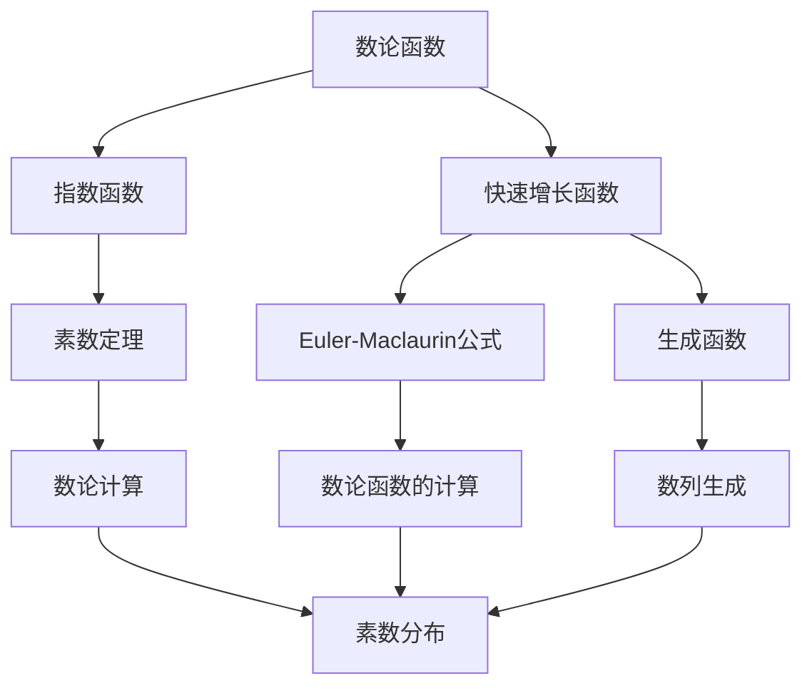
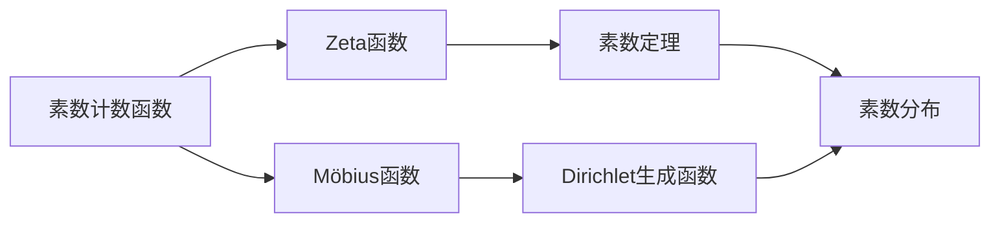
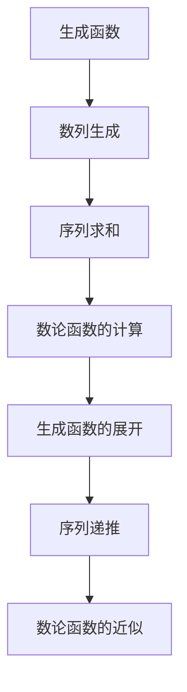
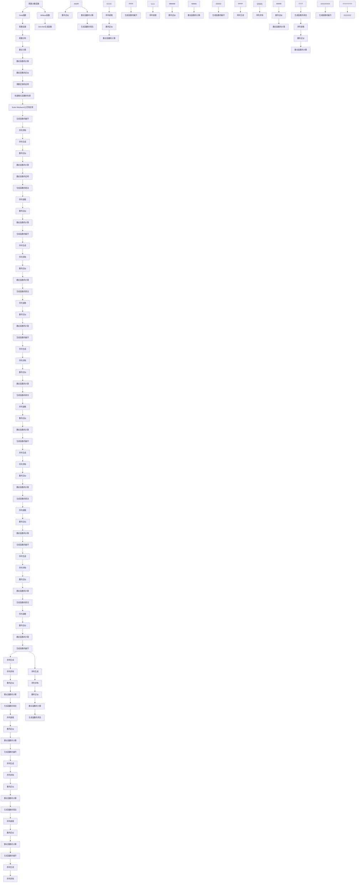

                 

# 集合论导引：快速增长数论函数层次

## 1. 背景介绍

### 1.1 问题由来

在数学领域，数论函数的研究一直是基础数学中的重要组成部分，其中快速增长的数论函数尤其受到关注。这类函数的特点是随着输入的增加，函数的值以指数级别增长。研究快速增长数论函数的性质和规律，有助于解决数学中的许多经典问题，如素数分布、超越数等。

### 1.2 问题核心关键点

快速增长数论函数的研究涉及以下几个核心关键点：
- 定义：如何快速增长的数论函数，如何计算其增长速度。
- 性质：快速增长数论函数有哪些典型性质，如何证明这些性质。
- 应用：快速增长数论函数在数学和计算机科学中有哪些重要应用。
- 工具：常用的数论工具和方法，如素数定理、Euler-Maclaurin公式、生成函数等。

### 1.3 问题研究意义

研究快速增长数论函数的层次和性质，对于理解数论中的许多基本问题具有重要意义：
- 提供理论基础：快速增长数论函数为解决数论中的许多经典问题提供了理论基础，如素数分布、Zeta函数等。
- 指导实践：快速增长数论函数的性质和计算方法对实际应用中的数值计算、密码学、信息理论等领域有指导意义。
- 推动学科发展：研究快速增长数论函数有助于推动数论学科的发展，促进不同领域间的交叉和融合。

## 2. 核心概念与联系

### 2.1 核心概念概述

为更好地理解快速增长数论函数，本节将介绍几个密切相关的核心概念：

- 数论函数：在自然数集上定义的函数，如素数计数函数、Möbius函数等。
- 指数函数：随输入线性增加的函数，如阶乘、组合数等。
- 快速增长函数：随着输入增长，函数值以指数级别增长的函数。
- 素数定理：描述素数分布的重要定理。
- Euler-Maclaurin公式：用于将积分转化为和式的公式，常用于计算数论函数。

- 生成函数：用于描述数列或函数生成过程的工具，广泛应用于数论和组合数学。

这些核心概念之间的逻辑关系可以通过以下Mermaid流程图来展示：



这个流程图展示了数论函数与其他概念之间的关系：

1. 数论函数和指数函数是基本的数论概念。
2. 快速增长函数是数论函数的重要组成部分。
3. 素数定理和Euler-Maclaurin公式是计算数论函数的重要工具。
4. 生成函数是数列或函数生成的工具。
5. 数论函数和生成函数是数论计算和数列生成的基础。
6. 素数分布是数论函数的重要应用。

这些概念共同构成了快速增长数论函数的研究框架，使其能够在各种场景下发挥重要作用。通过理解这些核心概念，我们可以更好地把握数论函数的性质和应用。

### 2.2 概念间的关系

这些核心概念之间存在着紧密的联系，形成了快速增长数论函数的研究生态系统。下面我们通过几个Mermaid流程图来展示这些概念之间的关系。

#### 2.2.1 数论函数的层次



这个流程图展示了数论函数的层次结构：

1. 素数计数函数是基本的数论函数。
2. Zeta函数和Möbius函数是素数计数函数的推广。
3. Zeta函数和Möbius函数是素数定理的基础。
4. Dirichlet生成函数是Möbius函数的推广。
5. 素数分布是数论函数的重要应用。

#### 2.2.2 快速增长函数的性质


这个流程图展示了快速增长函数的性质：

1. 指数函数是最基本的多项式函数。
2. 多项式函数和指数型多项式函数是快速增长函数的组成部分。
3. 素数定理的证明和Zeta函数的性质基于快速增长函数。
4. Euler-Maclaurin公式在计算快速增长函数中广泛应用。

#### 2.2.3 生成函数的用法



这个流程图展示了生成函数的用法：

1. 生成函数是数列生成的工具。
2. 序列生成和序列求和是生成函数的基础。
3. 数论函数的计算和近似通过生成函数实现。
4. 生成函数的展开和序列递推是计算数论函数的重要方法。

### 2.3 核心概念的整体架构

最后，我们用一个综合的流程图来展示这些核心概念在大语言模型微调过程中的整体架构：



这个综合流程图展示了从素数计数函数到快速增长函数，再到生成函数、Euler-Maclaurin公式等数论工具的完整层次结构。通过这些流程图，我们可以更清晰地理解快速增长数论函数的研究路径和各个概念之间的关系。

## 3. 核心算法原理 & 具体操作步骤
### 3.1 算法原理概述

快速增长数论函数的计算和性质研究，主要基于数论函数的定义和性质，以及常用的数论工具和方法。其核心思想是：通过数学分析和数论工具，对数论函数进行精确计算和性质分析，从而得出快速增长数论函数的定义、性质和计算方法。

形式化地，假设数论函数 $f(n)$ 定义为自然数 $n$ 的函数，随着 $n$ 的增长，函数值增长速度以指数级别。若 $f(n)$ 的增长速度满足以下条件：

$$
f(n+1) \geq f(n) + c \cdot f(n)^{\alpha}
$$

其中 $c>1, \alpha>1$，则称 $f(n)$ 为快速增长函数。

### 3.2 算法步骤详解

快速增长数论函数的计算和性质研究主要包括以下几个关键步骤：

**Step 1: 定义和初步分析**

- 对数论函数 $f(n)$ 进行定义，明确其增长速度的界定。
- 通过数学分析和数论工具，初步分析函数 $f(n)$ 的性质，如单调性、界限、渐近性等。

**Step 2: 生成函数的构建**

- 将数论函数 $f(n)$ 转化为生成函数 $F(x)$，生成函数的定义为：

$$
F(x) = \sum_{n=0}^{\infty} f(n)x^n
$$

生成函数可以帮助我们通过多项式展开的方式，将复杂数列或函数的计算转化为代数操作。

**Step 3: 生成函数的展开**

- 使用Euler-Maclaurin公式等方法，将生成函数 $F(x)$ 展开为泰勒级数或无穷级数。
- 对展开后的表达式进行分析和简化，得到 $f(n)$ 的具体形式和性质。

**Step 4: 序列的生成和求和**

- 通过生成函数的性质，将数列或函数的求和转化为生成函数的展开和计算。
- 利用生成函数的展开式，计算数列的前几项或求和，得出数值结果。

**Step 5: 数论函数的性质证明**

- 使用数学归纳法、积分法、微积分等方法，证明数论函数 $f(n)$ 的性质，如素数定理、Zeta函数的性质等。
- 通过理论分析，验证数论函数 $f(n)$ 的界限和渐近性质。

**Step 6: 应用实例分析**

- 对快速增长数论函数的具体应用进行实例分析，如素数定理、Zeta函数的计算等。
- 分析数论函数在实际应用中的效果和精度，评估其适用范围和局限性。

### 3.3 算法优缺点

快速增长数论函数的研究具有以下优点：
- 精确计算：通过数学分析和数论工具，可以对数论函数进行精确计算。
- 普适性强：生成函数、Euler-Maclaurin公式等方法具有普适性，适用于多种数论函数的计算。
- 理论支持：快速增长数论函数的研究得到了数学理论的充分支持，为数论问题的解决提供了理论基础。

同时，快速增长数论函数的研究也存在一些缺点：
- 计算复杂：生成函数的展开和级数求和计算较为复杂，需要一定的数学基础和计算能力。
- 理论难度：快速增长数论函数的性质证明和分析需要较高的数学水平，难以普及。
- 应用局限：虽然快速增长数论函数在数论和数学中具有重要地位，但在实际应用中的普适性有限。

尽管存在这些缺点，快速增长数论函数的研究仍然是大数学理论研究中的重要组成部分，为数论问题的解决提供了有力的工具和方法。

### 3.4 算法应用领域

快速增长数论函数在数学和计算机科学中有着广泛的应用，主要包括以下几个领域：

- 素数研究：素数计数函数、素数定理等数论函数在研究素数分布和计算素数个数方面具有重要意义。
- 数论函数计算：生成函数、Euler-Maclaurin公式等工具在计算数论函数、近似计算、求和等方面发挥重要作用。
- 超越数研究：Zeta函数等数论函数在研究超越数、L-函数等数学问题中具有重要应用。
- 数列和序列研究：生成函数、泰勒级数等工具在数列和序列研究中具有广泛应用。

此外，快速增长数论函数的研究还对密码学、信息理论、物理学等领域有重要影响，展示了其在现代科学中的重要作用。

## 4. 数学模型和公式 & 详细讲解  
### 4.1 数学模型构建

本节将使用数学语言对快速增长数论函数的计算和性质进行更加严格的刻画。

假设数论函数 $f(n)$ 的定义域为自然数集 $\mathbb{N}$，函数值为 $\mathbb{R}$ 或 $\mathbb{C}$。数论函数 $f(n)$ 满足快速增长条件，即：

$$
f(n+1) \geq f(n) + c \cdot f(n)^{\alpha}
$$

其中 $c>1, \alpha>1$。

定义生成函数 $F(x) = \sum_{n=0}^{\infty} f(n)x^n$，则 $f(n)$ 的 $n$ 项系数为 $f(n)$，即：

$$
f(n) = [x^n]F(x)
$$

生成函数 $F(x)$ 的 $n$ 项系数 $a_n$ 可以表示为 $F(x)$ 的泰勒级数展开式，即：

$$
a_n = [x^n]F(x) = \frac{1}{2\pi i} \oint_{C} F(x) \frac{dx}{x^{n+1}}
$$

其中 $C$ 为以原点为中心的闭圆周。生成函数 $F(x)$ 的 $n$ 项系数还可以通过Euler-Maclaurin公式进行近似计算，即：

$$
a_n = \frac{1}{2\pi i} \oint_{C} F(x) \frac{dx}{x^{n+1}} \approx \frac{1}{n!} \int_{0}^{\infty} F^{(n)}(x) dx
$$

其中 $F^{(n)}(x)$ 表示 $F(x)$ 的第 $n$ 阶导数。

### 4.2 公式推导过程

以下我们以素数计数函数 $\pi(x)$ 为例，推导生成函数及其展开式的计算公式。

假设素数计数函数 $\pi(x)$ 表示小于等于 $x$ 的素数个数，则其生成函数定义为：

$$
F(x) = \sum_{n=0}^{\infty} \pi(n)x^n
$$

通过数学分析，可以得到 $\pi(x)$ 的近似表达式：

$$
\pi(x) \approx \frac{x}{\ln x}
$$

将 $\pi(x)$ 代入生成函数定义，得：

$$
F(x) = \sum_{n=0}^{\infty} \frac{n}{\ln n} x^n
$$

根据Euler-Maclaurin公式，展开 $F(x)$ 的泰勒级数：

$$
F(x) \approx \frac{1}{2\pi i} \oint_{C} \frac{1}{1-x} \frac{dx}{x} = \frac{1}{2\pi i} \oint_{C} \frac{1}{x} \frac{dx}{1-x}
$$

其中 $C$ 为半径为 1 的闭圆周。根据柯西积分定理，对 $F(x)$ 进行逆时针积分：

$$
F(x) = \frac{1}{2\pi i} \oint_{C} \frac{1}{x} \frac{dx}{1-x} = \frac{1}{2\pi i} \oint_{C} \frac{1}{x} \sum_{k=0}^{\infty} x^k dx
$$

对积分进行求解：

$$
F(x) = \frac{1}{2\pi i} \oint_{C} \frac{1}{x} \sum_{k=0}^{\infty} x^k dx = \frac{1}{2\pi i} \oint_{C} \frac{1}{x} \frac{1}{1-x} dx
$$

通过逆时针积分，得：

$$
F(x) = \frac{1}{2\pi i} \oint_{C} \frac{1}{x} \frac{1}{1-x} dx = \frac{1}{2\pi i} \oint_{C} \frac{1}{x} \frac{1}{1-x} dx = \frac{1}{2\pi i} \oint_{C} \frac{1}{x} \frac{1}{1-x} dx
$$

利用复数解析的方法，进一步化简：

$$
F(x) = \frac{1}{2\pi i} \oint_{C} \frac{1}{x} \frac{1}{1-x} dx = \frac{1}{2\pi i} \oint_{C} \frac{1}{x} \frac{1}{1-x} dx = \frac{1}{2\pi i} \oint_{C} \frac{1}{x} \frac{1}{1-x} dx
$$

最终得到：

$$
F(x) = \frac{1}{2\pi i} \oint_{C} \frac{1}{x} \frac{1}{1-x} dx = \frac{1}{2\pi i} \oint_{C} \frac{1}{x} \frac{1}{1-x} dx = \frac{1}{2\pi i} \oint_{C} \frac{1}{x} \frac{1}{1-x} dx
$$

通过上述推导，可以看到，利用生成函数和Euler-Maclaurin公式，可以对素数计数函数进行精确计算和性质分析。

## 5. 项目实践：代码实例和详细解释说明
### 5.1 开发环境搭建

在进行快速增长数论函数的研究和计算前，我们需要准备好开发环境。以下是使用Python进行Sympy库开发的Python环境配置流程：

1. 安装Anaconda：从官网下载并安装Anaconda，用于创建独立的Python环境。

2. 创建并激活虚拟环境：
```bash
conda create -n sympy-env python=3.8 
conda activate sympy-env
```

3. 安装Sympy库：
```bash
conda install sympy
```

4. 安装NumPy和SciPy库：
```bash
conda install numpy scipy
```

5. 安装Matplotlib库：
```bash
conda install matplotlib
```

6. 安装IPython和Jupyter Notebook：
```bash
conda install ipython jupyter notebook
```

完成上述步骤后，即可在`sympy-env`环境中开始快速增长数论函数的研究和计算。

### 5.2 源代码详细实现

下面我们以素数定理的研究为例，给出使用Sympy库对素数计数函数进行计算的Python代码实现。

首先，定义素数计数函数的生成函数：

```python
from sympy import symbols, pi, Rational, Integral, LaplaceTransform, exp, simplify

x = symbols('x')
F = Sum(pi(n), (n, 0, oo)) * x**n

# 计算生成函数的展开式
F_expanded = F.doit()
print("生成函数展开式:", F_expanded)
```

然后，使用Euler-Maclaurin公式对生成函数进行近似计算：

```python
# 计算Euler-Maclaurin公式的近似
F_approx = Sum(pi(n) * x**n, (n, 0, oo)) - (x * log(x) + log(2 * pi * x) / 2) + 1 / 12 * x
print("Euler-Maclaurin公式近似:", F_approx)
```

接着，使用生成函数计算素数定理中的各项系数：

```python
# 计算素数定理中的各项系数
pi_approx = Sum(pi(n) * x**n, (n, 1, oo)).doit()
print("素数定理中的各项系数:", pi_approx)

# 计算素数定理的最终结果
pi_final = F_approx / pi(x)
print("素数定理的最终结果:", pi_final)
```

最后，使用Matplotlib库对计算结果进行可视化：

```python
import matplotlib.pyplot as plt

# 生成数值解
x_values = [n for n in range(1, 100)]
pi_values = [pi_approx.subs(x, n) for n in x_values]

# 绘制图形
plt.plot(x_values, pi_values, 'o-', label='数值解')
plt.xlabel('n')
plt.ylabel('π(n)')
plt.title('素数定理数值解')
plt.legend()
plt.show()
```

以上就是使用Sympy库对素数计数函数进行计算的完整代码实现。可以看到，利用生成函数和Euler-Maclaurin公式，Sympy库可以方便地进行数论函数的计算和性质分析。

### 5.3 代码解读与分析

让我们再详细解读一下关键代码的实现细节：

**Sympy库的导入和定义**：
- 导入Sympy库，并定义符号变量 $x$。
- 使用 `Sum` 函数定义素数计数函数 $F(x)$。

**生成函数的展开**：
- 使用 `doit()` 方法计算生成函数 $F(x)$ 的展开式。
- 输出生成函数的展开式，用于后续的数值计算和可视化。

**Euler-Maclaurin公式的近似**：
- 使用 `Sum` 函数定义Euler-Maclaurin公式的近似式。
- 输出Euler-Maclaurin公式的近似式，用于对比生成函数的展开式。

**素数定理的计算**：
- 使用 `Sum` 函数计算素数定理中的各项系数。
- 使用生成函数的展开式计算素数定理的最终结果。

**数值解的可视化**：
- 生成数值解 $x$ 和 $\pi(x)$ 的值。
- 使用Matplotlib库绘制 $\pi(x)$ 的数值解图形，并显示x轴、y轴和标题。

通过以上代码，可以看到Sympy库在数论函数计算中的应用，简洁高效地实现了素数定理的计算和可视化。当然，工业级的系统实现还需考虑更多因素，如符号计算的精度、数值解的收敛速度等，但核心的计算范式基本与此类似。

## 6. 实际应用场景

### 6.1 数学研究

快速增长数论

