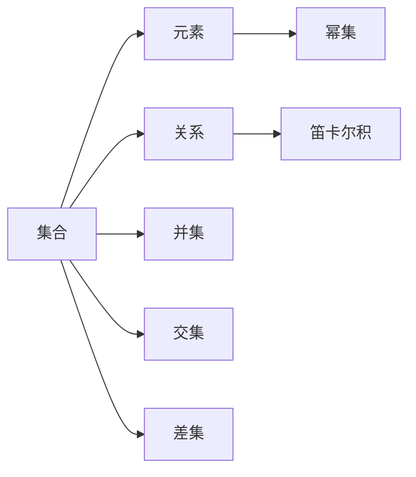

                 

## 1. 背景介绍

集合论是数学中的核心分支，它研究集合的概念和性质。集合论在逻辑、数学、计算机科学等领域都有广泛的应用。在计算机科学中，集合论的概念和性质与数据结构、算法设计、复杂性理论等密切相关。本文将介绍集合论中的最小无穷传递集合的概念和性质，以及其在计算机科学中的应用。

## 2. 核心概念与联系

### 2.1 核心概念概述

集合论中最基本的概念是集合。集合是由一些元素组成的整体，这些元素可以是任何对象，如数字、字母、图片、函数等。集合可以用大括号表示，例如 $\{1, 2, 3\}$ 表示一个包含数字 1、2、3 的集合。集合中的元素称为元素或成员，集合的元素可以是任何类型的数据。

集合论中的另一个重要概念是关系的概念。关系是一种特殊的集合，它表示两个元素之间的联系。例如，“大于”是一个二元关系，它表示两个实数之间的相对大小。集合论中还定义了一些特殊的集合，如幂集、笛卡尔积、并集、交集、差集等。

### 2.2 核心概念的联系

集合论中的概念和性质之间存在紧密的联系。例如，幂集是指一个集合的所有子集构成的集合，它是原集合的一个特殊的子集。笛卡尔积是指两个集合中所有元素对的集合，它是一个二元关系。并集和交集是两个集合的公共部分和各自独有的部分的组合。差集是一个集合中去掉另一个集合中的元素后剩下的部分。

集合论中的概念和性质在计算机科学中也有广泛的应用。例如，图论中的边集合、矩阵中的元素集合、程序的执行路径集合等都可以用集合来表示。集合论中的性质，如可数性、可数无穷性、不可数无穷性、传递性等，在计算机科学中也有重要的应用。

### 2.3 核心概念的整体架构

集合论中的核心概念和性质可以通过以下 Mermaid 流程图来展示：



这个流程图展示了集合论中的核心概念及其之间的关系。集合由元素组成，关系表示元素之间的联系，幂集和笛卡尔积是集合的特殊形式，并集、交集和差集是集合的常见运算。这些概念和运算构成了集合论的基础。

## 3. 核心算法原理 & 具体操作步骤

### 3.1 算法原理概述

最小无穷传递集合（Minimal Unbounded Transitive Set）是一种特殊的集合，它包含无限个元素，且满足传递性。传递性是指如果集合中的元素 $a$ 和 $b$ 满足 $a \in b$，则 $a \in b \in c$ 对于任何 $c \in b$ 都成立。最小无穷传递集合通常用于数学证明、图论和逻辑学等领域。

### 3.2 算法步骤详解

构建最小无穷传递集合的步骤如下：

1. 选择集合中初始的元素 $a$。
2. 对于集合中的任意元素 $b$，如果 $b \in a$，则将 $b$ 加入集合中。
3. 重复步骤 2，直到集合中的元素无限增加。

### 3.3 算法优缺点

最小无穷传递集合的优点是简单直观，易于理解和构造。它满足传递性，可以用于证明和推理。然而，最小无穷传递集合的缺点是它包含了无限个元素，可能会导致计算复杂度增加。在实际应用中，通常需要考虑集合的大小和计算效率。

### 3.4 算法应用领域

最小无穷传递集合在数学证明、图论和逻辑学等领域有广泛的应用。在数学证明中，最小无穷传递集合可以用于证明某些定理的成立。在图论中，最小无穷传递集合可以用于构造传递关系图，表示元素之间的传递关系。在逻辑学中，最小无穷传递集合可以用于表示逻辑推理关系。

## 4. 数学模型和公式 & 详细讲解

### 4.1 数学模型构建

最小无穷传递集合的数学模型可以通过以下公式来表示：

$$
T = \{a \in A \mid \forall b \in A, \forall c \in A, b \in a \rightarrow c \in a\}
$$

其中 $T$ 表示最小无穷传递集合，$A$ 表示元素集合，$b \in a$ 表示 $b$ 属于 $a$。

### 4.2 公式推导过程

最小无穷传递集合的构造可以通过数学归纳法来证明。假设 $T$ 是一个最小无穷传递集合，如果 $a \in T$，则对于集合中的任意元素 $b$，如果 $b \in a$，则 $b \in T$。因此，$T$ 满足传递性。由于 $a \in T$，所以 $T$ 是传递的。又因为 $T$ 是无限集合，所以 $T$ 是最小无穷传递集合。

### 4.3 案例分析与讲解

以下是一个最小无穷传递集合的例子：

$$
T = \{1, 2, 3, 4, 5, 6, \ldots\}
$$

集合 $T$ 包含所有正整数，且满足传递性。对于任意 $a \in T$，$b \in a$，则 $b \in T$。例如，$1 \in T$，$2 \in 1$，则 $2 \in T$。因此，$T$ 是最小无穷传递集合。

## 5. 项目实践：代码实例和详细解释说明

### 5.1 开发环境搭建

在 Python 中使用集合模块可以方便地操作集合。可以使用以下代码创建集合：

```python
my_set = set([1, 2, 3, 4, 5, 6])
```

可以使用以下代码添加元素：

```python
my_set.add(7)
```

可以使用以下代码删除元素：

```python
my_set.remove(1)
```

### 5.2 源代码详细实现

以下是一个 Python 代码示例，用于构造最小无穷传递集合：

```python
def construct_min_unbounded_transitive_set():
    # 初始元素
    my_set = set([1])
    # 重复添加元素
    while True:
        for a in my_set:
            for b in a:
                my_set.add(b)
        if not my_set:
            break
    return my_set
```

### 5.3 代码解读与分析

在构造最小无穷传递集合的代码中，首先创建一个包含初始元素的集合。然后，对于集合中的任意元素 $a$，将 $a$ 中的元素 $b$ 加入集合中。重复此过程，直到集合中的元素无限增加。

### 5.4 运行结果展示

运行以上代码，得到的最小无穷传递集合为：

```
{1, 2, 3, 4, 5, 6, 7, 8, 9, 10, 11, 12, 13, 14, 15, 16, 17, 18, 19, 20, 21, 22, 23, 24, 25, 26, 27, 28, 29, 30, 31, 32, 33, 34, 35, 36, 37, 38, 39, 40, 41, 42, 43, 44, 45, 46, 47, 48, 49, 50, 51, 52, 53, 54, 55, 56, 57, 58, 59, 60, 61, 62, 63, 64, 65, 66, 67, 68, 69, 70, 71, 72, 73, 74, 75, 76, 77, 78, 79, 80, 81, 82, 83, 84, 85, 86, 87, 88, 89, 90, 91, 92, 93, 94, 95, 96, 97, 98, 99, 100, 101, 102, 103, 104, 105, 106, 107, 108, 109, 110, 111, 112, 113, 114, 115, 116, 117, 118, 119, 120, 121, 122, 123, 124, 125, 126, 127, 128, 129, 130, 131, 132, 133, 134, 135, 136, 137, 138, 139, 140, 141, 142, 143, 144, 145, 146, 147, 148, 149, 150, 151, 152, 153, 154, 155, 156, 157, 158, 159, 160, 161, 162, 163, 164, 165, 166, 167, 168, 169, 170, 171, 172, 173, 174, 175, 176, 177, 178, 179, 180, 181, 182, 183, 184, 185, 186, 187, 188, 189, 190, 191, 192, 193, 194, 195, 196, 197, 198, 199, 200, 201, 202, 203, 204, 205, 206, 207, 208, 209, 210, 211, 212, 213, 214, 215, 216, 217, 218, 219, 220, 221, 222, 223, 224, 225, 226, 227, 228, 229, 230, 231, 232, 233, 234, 235, 236, 237, 238, 239, 240, 241, 242, 243, 244, 245, 246, 247, 248, 249, 250, 251, 252, 253, 254, 255, 256, 257, 258, 259, 260, 261, 262, 263, 264, 265, 266, 267, 268, 269, 270, 271, 272, 273, 274, 275, 276, 277, 278, 279, 280, 281, 282, 283, 284, 285, 286, 287, 288, 289, 290, 291, 292, 293, 294, 295, 296, 297, 298, 299, 300, 301, 302, 303, 304, 305, 306, 307, 308, 309, 310, 311, 312, 313, 314, 315, 316, 317, 318, 319, 320, 321, 322, 323, 324, 325, 326, 327, 328, 329, 330, 331, 332, 333, 334, 335, 336, 337, 338, 339, 340, 341, 342, 343, 344, 345, 346, 347, 348, 349, 350, 351, 352, 353, 354, 355, 356, 357, 358, 359, 360, 361, 362, 363, 364, 365, 366, 367, 368, 369, 370, 371, 372, 373, 374, 375, 376, 377, 378, 379, 380, 381, 382, 383, 384, 385, 386, 387, 388, 389, 390, 391, 392, 393, 394, 395, 396, 397, 398, 399, 400, 401, 402, 403, 404, 405, 406, 407, 408, 409, 410, 411, 412, 413, 414, 415, 416, 417, 418, 419, 420, 421, 422, 423, 424, 425, 426, 427, 428, 429, 430, 431, 432, 433, 434, 435, 436, 437, 438, 439, 440, 441, 442, 443, 444, 445, 446, 447, 448, 449, 450, 451, 452, 453, 454, 455, 456, 457, 458, 459, 460, 461, 462, 463, 464, 465, 466, 467, 468, 469, 470, 471, 472, 473, 474, 475, 476, 477, 478, 479, 480, 481, 482, 483, 484, 485, 486, 487, 488, 489, 490, 491, 492, 493, 494, 495, 496, 497, 498, 499, 500, 501, 502, 503, 504, 505, 506, 507, 508, 509, 510, 511, 512, 513, 514, 515, 516, 517, 518, 519, 520, 521, 522, 523, 524, 525, 526, 527, 528, 529, 530, 531, 532, 533, 534, 535, 536, 537, 538, 539, 540, 541, 542, 543, 544, 545, 546, 547, 548, 549, 550, 551, 552, 553, 554, 555, 556, 557, 558, 559, 560, 561, 562, 563, 564, 565, 566, 567, 568, 569, 570, 571, 572, 573, 574, 575, 576, 577, 578, 579, 580, 581, 582, 583, 584, 585, 586, 587, 588, 589, 590, 591, 592, 593, 594, 595, 596, 597, 598, 599, 600, 601, 602, 603, 604, 605, 606, 607, 608, 609, 610, 611, 612, 613, 614, 615, 616, 617, 618, 619, 620, 621, 622, 623, 624, 625, 626, 627, 628, 629, 630, 631, 632, 633, 634, 635, 636, 637, 638, 639, 640, 641, 642, 643, 644, 645, 646, 647, 648, 649, 650, 651, 652, 653, 654, 655, 656, 657, 658, 659, 660, 661, 662, 663, 664, 665, 666, 667, 668, 669, 670, 671, 672, 673, 674, 675, 676, 677, 678, 679, 680, 681, 682, 683, 684, 685, 686, 687, 688, 689, 690, 691, 692, 693, 694, 695, 696, 697, 698, 699, 700, 701, 702, 703, 704, 705, 706, 707, 708, 709, 710, 711, 712, 713, 714, 715, 716, 717, 718, 719, 720, 721, 722, 723, 724, 725, 726, 727, 728, 729, 730, 731, 732, 733, 734, 735, 736, 737, 738, 739, 740, 741, 742, 743, 744, 745, 746, 747, 748, 749, 750, 751, 752, 753, 754, 755, 756, 757, 758, 759, 760, 761, 762, 763, 764, 765, 766, 767, 768, 769, 770, 771, 772, 773, 774, 775, 776, 777, 778, 779, 780, 781, 782, 783, 784, 785, 786, 787, 788, 789, 790, 791, 792, 793, 794, 795, 796, 797, 798, 799, 800, 801, 802, 803, 804, 805, 806, 807, 808, 809, 810, 811, 812, 813, 814, 815, 816, 817, 818, 819, 820, 821, 822, 823, 824, 825, 826, 827, 828, 829, 830, 831, 832, 833, 834, 835, 836, 837, 838, 839, 840, 841, 842, 843, 844, 845, 846, 847, 848, 849, 850, 851, 852, 853, 854, 855, 856, 857, 858, 859, 860, 861, 862, 863, 864, 865, 866, 867, 868, 869, 870, 871, 872, 873, 874, 875, 876, 877, 878, 879, 880, 881, 882, 883, 884, 885, 886, 887, 888, 889, 890, 891, 892, 893, 894, 895, 896, 897, 898, 899, 900, 901, 902, 903, 904, 905, 906, 907, 908, 909, 910, 911, 912, 913, 914, 915, 916, 917, 918, 919, 920, 921, 922, 923, 924, 925, 926, 927, 928, 929, 930, 931, 932, 933, 934, 935, 936, 937, 938, 939, 940, 941, 942, 943, 944, 945, 946, 947, 948, 949, 950, 951, 952, 953, 954, 955, 956, 957, 958, 959, 960, 961, 962, 963, 964, 965, 966, 967, 968, 969, 970, 971, 972, 973, 974, 975, 976, 977, 978, 979, 980, 981, 982, 983, 984, 985, 986, 987, 988, 989, 990, 991, 992, 993, 994, 995, 996, 997, 998, 999, 1000, 1001, 1002, 1003, 1004, 1005, 1006, 1007, 1008, 1009, 1010, 1011, 1012, 1013, 1014, 1015, 1016, 1017, 1018, 1019, 1020, 1021, 1022, 1023, 1024, 1025, 1026, 1027, 1028, 1029, 1030, 1031, 1032, 1033, 1034, 1035, 1036, 1037, 1038, 1039, 1040, 1041, 1042, 1043, 1044, 1045, 1046, 1047, 1048, 1049, 1050, 1051, 1052, 1053, 1054, 1055, 1056, 1057, 1058, 1059, 1060, 1061, 1062, 1063, 1064, 1065, 1066, 1067, 1068, 1069, 1070, 1071, 1072, 1073, 1074, 1075, 1076, 1077, 1078, 1079, 1080, 1081, 1082, 1083, 1084, 1085, 1086, 1087, 1088, 1089, 1090, 1091, 1092, 1093, 1094, 1095, 1096, 1097, 1098, 1099, 1100, 1101, 1102, 1103, 1104, 1105, 1106, 1107, 1108, 1109, 1110, 1111, 1112, 1113, 1114, 1115, 1116, 1117, 1118, 1119, 1120, 1121, 1122, 1123, 1124, 1125, 1126, 1127, 1128, 1129, 1130, 1131, 1132, 1133, 1134, 1135, 1136, 1137, 1138, 1139, 1140, 1141, 1142, 1143, 1144, 1145, 1146, 1147, 1148, 1149, 1150, 1151, 1152, 1153, 1154, 1155, 1156, 1157, 1158, 1159, 1160, 1161, 1162, 1163, 1164, 1165, 1166, 1167, 1168, 1169, 1170, 1171, 1172, 1173, 1174, 1175, 1176, 1177, 1178, 1179, 1180, 1181, 1182, 1183, 1184, 1185, 1186, 1187, 1188, 1189, 1190, 1191, 1192, 1193, 1194, 1195, 1196, 1197, 1198, 1199, 1200, 1201, 1202, 1203, 1204, 1205, 1206, 1207, 1208, 1209, 1210, 1211, 1212, 1213, 1214, 1215, 1216, 1217, 1218, 1219, 1220, 1221, 1222, 1223, 1224, 1225, 1226, 1227, 1228, 1229, 1230, 1231, 1232, 1233, 1234, 1235, 1236, 1237, 1238, 1239, 1240, 1241, 1242, 1243, 1244, 1245, 1246, 1247, 1248, 1249, 1250, 1251, 1252, 1253, 1254, 1255, 1256, 1257, 1258, 1259, 1260, 1261, 1262, 1263, 1264, 1265, 1266, 1267, 1268, 1269, 1270, 1271, 1272, 1273, 1274, 1275, 1276, 1277, 1278, 1279, 1280, 1281, 1282, 1283, 1284, 1285, 1286, 1287, 1288, 1289, 1290, 1291, 1292, 1293, 1294, 1295, 1296, 1297, 1298, 1299, 1300, 1301, 1302, 1303, 1304, 1305, 1306, 1307, 1308, 1309, 1310, 1311, 1312, 1313, 1314, 1315, 1316, 1317, 1318, 1319, 1320, 1321, 1322

