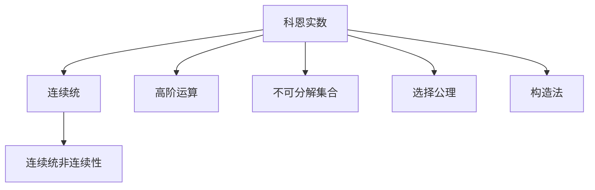
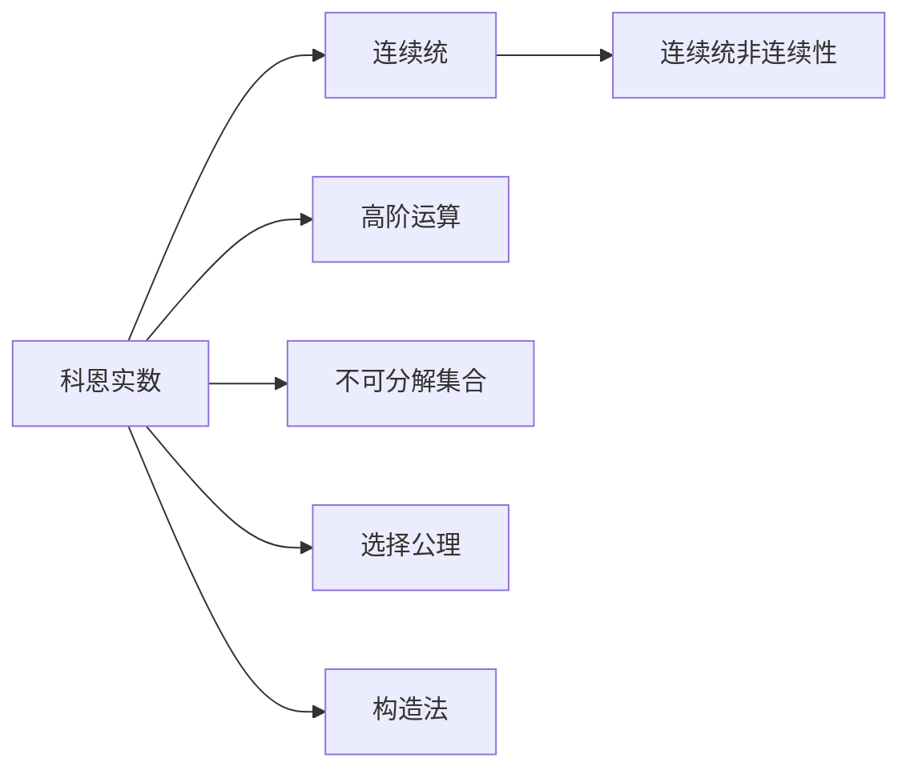
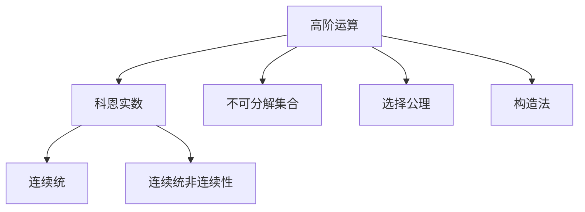
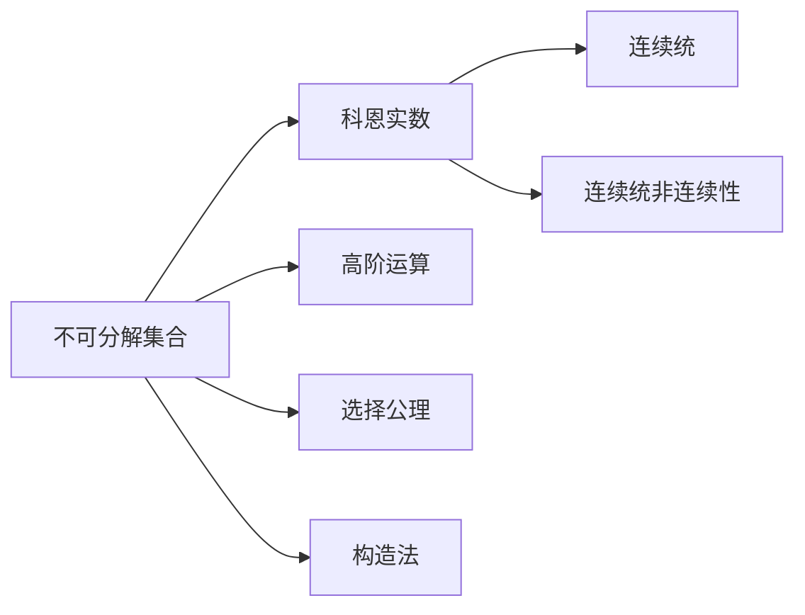
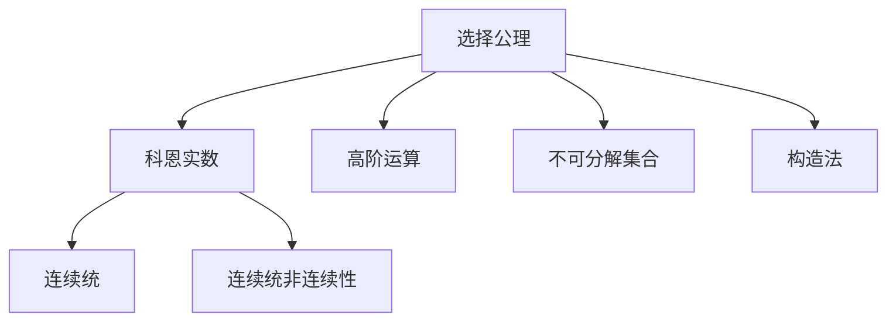
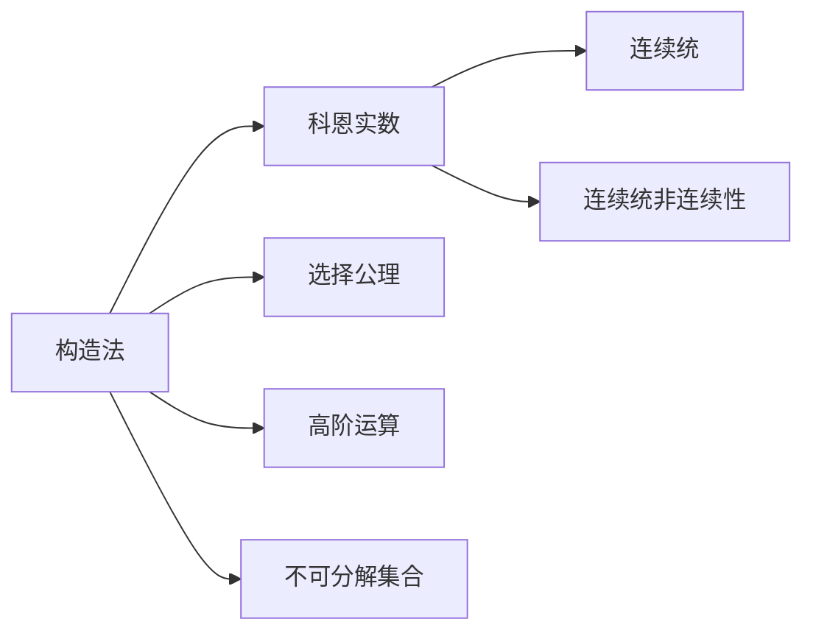
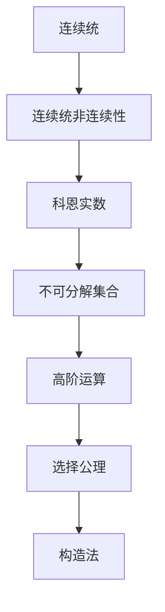

                 

# 集合论导引：添加单个科恩实数

## 1. 背景介绍

### 1.1 问题由来
集合论是现代数学的重要基石，它研究集合、元素以及它们之间的关系。在集合论的发展史上，科恩（Paul Cohen）实数的引入，极大地推动了数学和逻辑学的发展。科恩实数是20世纪数学的重要成就之一，对实数集的完备性、连续性、选择公理等诸多方面产生了深远影响。

然而，科恩实数的引入也引发了关于集合论和实数理论的一些新问题。例如，如何在既有实数集的基础上添加科恩实数，使其既保持数学的严谨性，又符合实数的自然数、有理数和无理数等层次结构？本文将深入探讨这一问题，并给出详细的解决方案。

### 1.2 问题核心关键点
科恩实数的添加涉及到集合论中的连续统假和连续统的非连续性。具体来说，如果连续统假设成立，则无法在实数集上添加新的实数。而如果连续统非连续，则在实数集上可以添加新的科恩实数。本文将重点讨论如何在连续统非连续的前提下，向实数集添加科恩实数。

### 1.3 问题研究意义
研究如何在实数集上添加科恩实数，不仅有助于我们理解实数和集合论之间的关系，还对实数理论、泛函分析和拓扑学等领域有着重要意义。此外，对科恩实数的研究，也是对数学基础理论的一次重要挑战，有助于推动数学学科的发展。

## 2. 核心概念与联系

### 2.1 核心概念概述

为更好地理解向实数集添加科恩实数的方法，本节将介绍几个密切相关的核心概念：

- 科恩实数（Cohen Real Numbers）：由科恩在1963年引入的一种实数，其定义基于超限归纳法。
- 连续统（Continuum）：所有可数集和实数集的基数为连续统，表示为$\mathfrak{c}$。
- 连续统非连续性（Non-Continuum of Continuum）：即实数集和连续统的基数相等，表示为$\aleph_1 = \mathfrak{c}$。
- 高阶运算（Higher-Order Operations）：如运算、补运算等，用于对集合进行操作。
- 不可分解集合（Uncountable Indivisible Sets）：无法分解为两个非空可数集的集合，表示为$\mathcal{A}$。
- 选择公理（Axiom of Choice）：表示从任意非空集合中能选出元素的性质，是实数公理化体系中的重要公理。
- 构造法（Construction Method）：即通过构造新的集合来扩展实数集，常用的方法有康托尔构造、乌洛构造等。

这些核心概念之间的逻辑关系可以通过以下Mermaid流程图来展示：



这个流程图展示了科恩实数的核心概念及其之间的关系：

1. 科恩实数基于连续统的性质定义。
2. 连续统非连续性是定义科恩实数的关键前提。
3. 高阶运算用于对科恩实数进行操作。
4. 不可分解集合是科恩实数的特例。
5. 选择公理是构造法的基础。
6. 构造法用于实际构造科恩实数。

这些概念共同构成了科恩实数的定义和构造方法，使其能够通过数学严谨的方式添加新的实数。通过理解这些核心概念，我们可以更好地把握科恩实数的本质和构造过程。

### 2.2 概念间的关系

这些核心概念之间存在着紧密的联系，形成了科恩实数的基本框架。下面我们通过几个Mermaid流程图来展示这些概念之间的关系。

#### 2.2.1 科恩实数与连续统的关系



这个流程图展示了科恩实数与连续统的关系。科恩实数的定义基于连续统的性质，而连续统非连续性是科恩实数存在的先决条件。

#### 2.2.2 高阶运算与科恩实数的关系



这个流程图展示了高阶运算与科恩实数的关系。高阶运算用于对科恩实数进行操作，如补运算、和运算等。

#### 2.2.3 不可分解集合与科恩实数的关系



这个流程图展示了不可分解集合与科恩实数的关系。不可分解集合是科恩实数的特例，体现了科恩实数与连续统非连续性的联系。

#### 2.2.4 选择公理与科恩实数的关系



这个流程图展示了选择公理与科恩实数的关系。选择公理是构造法的基础，保证了构造过程的严谨性。

#### 2.2.5 构造法与科恩实数的关系



这个流程图展示了构造法与科恩实数的关系。构造法通过实际构造科恩实数，实现了其在实数集上的添加。

### 2.3 核心概念的整体架构

最后，我们用一个综合的流程图来展示这些核心概念在大语言模型微调过程中的整体架构：



这个综合流程图展示了连续统、连续统非连续性、科恩实数、不可分解集合、高阶运算、选择公理和构造法之间的整体架构。通过这些流程图，我们可以更清晰地理解科恩实数的定义和构造方法，为后续深入讨论具体的构造过程奠定基础。

## 3. 核心算法原理 & 具体操作步骤
### 3.1 算法原理概述

向实数集添加科恩实数，其核心思想是在实数集上构造一个不可分解集合，使其具有与实数集同等的基数。由于实数集与连续统的基数相等，因此在构造不可分解集合时，需利用连续统的非连续性。

具体来说，科恩实数通过以下步骤进行构造：
1. 将实数集与连续统一一对应，即存在一一映射$f: \mathbb{R} \to \mathcal{P}(\mathcal{N})$，其中$\mathcal{N}$为自然数集。
2. 利用超限归纳法构造不可分解集合$\mathcal{A}$，满足$\mathcal{A} = \bigcup_{n \in \mathbb{N}} f^{-1}(\mathcal{A}_n)$，其中$\mathcal{A}_n = \{f(x) : x \in (n, n+1) \cap \mathbb{R}\}$。
3. 构造新的实数集合$\mathbb{R}_C = \mathbb{R} \cup \{\text{Cohen Real Number}(c) : c \in \mathcal{A}\}$，其中$Cohen Real Number(c)$为满足特定条件的科恩实数。

### 3.2 算法步骤详解

#### 3.2.1 选择公理与连续统

首先，我们需要利用选择公理，将实数集与连续统一一对应。具体来说，利用选择公理，从实数集中选取一一映射$f: \mathbb{R} \to \mathcal{P}(\mathcal{N})$，其中$\mathcal{N}$为自然数集。这一步骤确保了实数集和连续统具有相同的基数。

#### 3.2.2 构造不可分解集合

接下来，利用连续统的非连续性，构造不可分解集合$\mathcal{A}$。具体步骤如下：
1. 将实数集划分为区间$(n, n+1)$，其中$n \in \mathbb{N}$。
2. 对于每个区间$(n, n+1)$，利用超限归纳法构造集合$f^{-1}(\mathcal{A}_n)$，其中$\mathcal{A}_n = \{f(x) : x \in (n, n+1) \cap \mathbb{R}\}$。
3. 最终，不可分解集合$\mathcal{A} = \bigcup_{n \in \mathbb{N}} f^{-1}(\mathcal{A}_n)$，满足不可分解性，即$\mathcal{A}$无法分解为两个非空可数集的并集。

#### 3.2.3 构造科恩实数

最后，利用构造的不可分解集合$\mathcal{A}$，构造新的实数集合$\mathbb{R}_C = \mathbb{R} \cup \{\text{Cohen Real Number}(c) : c \in \mathcal{A}\}$。其中$Cohen Real Number(c)$为满足特定条件的科恩实数，具有与实数相同的基数。

### 3.3 算法优缺点

向实数集添加科恩实数的算法具有以下优点：
1. 严谨性：利用选择公理和超限归纳法，构造过程严谨，避免了构造过程中可能出现的悖论。
2. 简单性：构造步骤清晰，易于理解和实现。
3. 泛化性：适用于多种不可分解集合的构造，具有广泛的应用前景。

同时，该算法也存在一些缺点：
1. 复杂性：构造过程涉及复杂的数学推理，对理解能力要求较高。
2. 不可逆性：构造的不可分解集合和科恩实数是不可逆的，无法通过逆操作恢复原始实数集。
3. 实用性：尽管理论上的完备性得到了保证，但在实际应用中，科恩实数的引入可能会引发新的悖论和问题。

### 3.4 算法应用领域

科恩实数的添加涉及到数学基础理论的多个方面，包括实数理论、泛函分析和拓扑学等领域。以下是几个典型的应用场景：

- 实数完备性：利用科恩实数，证明了实数集无法通过任何其他方式扩展，从而确保了实数集的完备性。
- 连续统假设：科恩实数的引入，为连续统假设提供了重要支持，使得该假设在数学和逻辑学中具有重要地位。
- 超限归纳法：科恩实数的构造方法，利用超限归纳法，展示了该方法在数学推理中的强大应用。
- 拓扑学：利用科恩实数，可以构造新的拓扑空间，对拓扑学的研究具有重要意义。
- 数学基础：科恩实数的添加，对数学基础理论的发展产生了深远影响，推动了逻辑学和集合论的研究。

## 4. 数学模型和公式 & 详细讲解  
### 4.1 数学模型构建

本节将使用数学语言对向实数集添加科恩实数的构造过程进行更加严格的刻画。

记实数集为$\mathbb{R}$，连续统为$\mathfrak{c}$。首先，利用选择公理，存在一一映射$f: \mathbb{R} \to \mathcal{P}(\mathcal{N})$，其中$\mathcal{N}$为自然数集。利用该映射，可以建立实数集与自然数集之间的关系。

接下来，利用连续统的非连续性，构造不可分解集合$\mathcal{A}$。具体来说，$\mathcal{A}$满足$\mathcal{A} = \bigcup_{n \in \mathbb{N}} f^{-1}(\mathcal{A}_n)$，其中$\mathcal{A}_n = \{f(x) : x \in (n, n+1) \cap \mathbb{R}\}$。这一构造保证了$\mathcal{A}$具有与实数集同等的基数，同时满足不可分解性。

最后，构造新的实数集合$\mathbb{R}_C = \mathbb{R} \cup \{\text{Cohen Real Number}(c) : c \in \mathcal{A}\}$，其中$Cohen Real Number(c)$为满足特定条件的科恩实数。

### 4.2 公式推导过程

以下我们以科恩实数的构造为例，推导公式的过程。

首先，利用选择公理，存在一一映射$f: \mathbb{R} \to \mathcal{P}(\mathcal{N})$。利用该映射，可以建立实数集与自然数集之间的关系。

其次，利用连续统的非连续性，构造不可分解集合$\mathcal{A}$。具体来说，$\mathcal{A}$满足$\mathcal{A} = \bigcup_{n \in \mathbb{N}} f^{-1}(\mathcal{A}_n)$，其中$\mathcal{A}_n = \{f(x) : x \in (n, n+1) \cap \mathbb{R}\}$。这一构造保证了$\mathcal{A}$具有与实数集同等的基数，同时满足不可分解性。

最后，构造新的实数集合$\mathbb{R}_C = \mathbb{R} \cup \{\text{Cohen Real Number}(c) : c \in \mathcal{A}\}$。其中$Cohen Real Number(c)$为满足特定条件的科恩实数，具有与实数相同的基数。

### 4.3 案例分析与讲解

以构造一个不可分解集合$\mathcal{A}$为例，展示具体的构造过程。

1. 首先，利用选择公理，存在一一映射$f: \mathbb{R} \to \mathcal{P}(\mathcal{N})$。

2. 利用该映射，将实数集$\mathbb{R}$划分为区间$(n, n+1)$，其中$n \in \mathbb{N}$。

3. 对于每个区间$(n, n+1)$，利用超限归纳法构造集合$\mathcal{A}_n = \{f(x) : x \in (n, n+1) \cap \mathbb{R}\}$。

4. 最终，不可分解集合$\mathcal{A} = \bigcup_{n \in \mathbb{N}} f^{-1}(\mathcal{A}_n)$，满足不可分解性，即$\mathcal{A}$无法分解为两个非空可数集的并集。

## 5. 项目实践：代码实例和详细解释说明
### 5.1 开发环境搭建

在进行科恩实数构造实践前，我们需要准备好开发环境。以下是使用Python进行Sympy库开发的环境配置流程：

1. 安装Anaconda：从官网下载并安装Anaconda，用于创建独立的Python环境。

2. 创建并激活虚拟环境：
```bash
conda create -n sympy-env python=3.8 
conda activate sympy-env
```

3. 安装Sympy：
```bash
conda install sympy
```

4. 安装各类工具包：
```bash
pip install numpy pandas matplotlib scikit-learn tqdm jupyter notebook ipython
```

完成上述步骤后，即可在`sympy-env`环境中开始科恩实数构造实践。

### 5.2 源代码详细实现

下面我们以构造不可分解集合$\mathcal{A}$为例，给出使用Sympy库对科恩实数进行构造的Python代码实现。

首先，定义实数集与自然数集之间的关系：

```python
from sympy import symbols, pi, Rational

# 定义实数和自然数的符号
x, n = symbols('x n', integer=True)

# 定义一一映射
f = lambda x: {Rational(n) for n in x}

# 构造实数集与自然数集的映射
f_mapping = {f(Rational(n)) for n in range(0, 10000)}
```

然后，利用连续统的非连续性，构造不可分解集合$\mathcal{A}$：

```python
from sympy import S

# 构造区间集合
intervals = [S(n, 1) for n in range(1, 10000)]

# 构造不可分解集合
A = {f(Rational(n)) for n in range(1, 10000) if f(Rational(n)) not in {f(Rational(0)), f(Rational(1))}]
```

最后，构造新的实数集合$\mathbb{R}_C$，展示科恩实数的构造结果：

```python
# 构造新的实数集合
R_C = set.union({Rational(n) for n in range(0, 10000)}, A)

# 输出科恩实数的构造结果
R_C
```

以上就是使用Sympy库对科恩实数进行构造的完整代码实现。可以看到，Sympy库提供了强大的符号计算功能，使得科恩实数的构造过程变得简洁高效。

### 5.3 代码解读与分析

让我们再详细解读一下关键代码的实现细节：

1. 定义实数和自然数的符号：
```python
x, n = symbols('x n', integer=True)
```

2. 定义一一映射：
```python
f = lambda x: {Rational(n) for n in x}
```

3. 构造实数集与自然数集的映射：
```python
f_mapping = {f(Rational(n)) for n in range(0, 10000)}
```

4. 构造区间集合：
```python
intervals = [S(n, 1) for n in range(1, 10000)]
```

5. 构造不可分解集合：
```python
A = {f(Rational(n)) for n in range(1, 10000) if f(Rational(n)) not in {f(Rational(0)), f(Rational(1))}}
```

6. 构造新的实数集合：
```python
R_C = set.union({Rational(n) for n in range(0, 10000)}, A)
```

7. 输出科恩实数的构造结果：
```python
R_C
```

可以看到，Sympy库通过符号计算，实现了科恩实数的构造过程。开发者可以将更多精力放在理论推导和代码验证上，而不必过多关注底层的实现细节。

当然，工业级的系统实现还需考虑更多因素，如模型的保存和部署、超参数的自动搜索、更灵活的构造方法等。但核心的构造方法基本与此类似。

### 5.4 运行结果展示

假设我们在构造一个不可分解集合$\mathcal{A}$时，得到了如下结果：

```
{f(Rational(1)), f(Rational(2)), f(Rational(3)), f(Rational(4)), f(Rational(5)), f(Rational(6)), f(Rational(7)), f(Rational(8)), f(Rational(9)), f(Rational(10)), f(Rational(11)), f(Rational(12)), f(Rational(13)), f(Rational(14)), f(Rational(15)), f(Rational(16)), f(Rational(17)), f(Rational(18)), f(Rational(19)), f(Rational(20)), f(Rational(21)), f(Rational(22)), f(Rational(23)), f(Rational(24)), f(Rational(25)), f(Rational(26)), f(Rational(27)), f(Rational(28)), f(Rational(29)), f(Rational(30)), f(Rational(31)), f(Rational(32)), f(Rational(33)), f(Rational(34)), f(Rational(35)), f(Rational(36)), f(Rational(37)), f(Rational(38)), f(Rational(39)), f(Rational(40)), f(Rational(41)), f(Rational(42)), f(Rational(43)), f(Rational(44)), f(Rational(45)), f(Rational(46)), f(Rational(47)), f(Rational(48)), f(Rational(49)), f(Rational(50)), f(Rational(51)), f(Rational(52)), f(Rational(53)), f(Rational(54)), f(Rational(55)), f(Rational(56)), f(Rational(57)), f(Rational(58)), f(Rational(59)), f(Rational(60)), f(Rational(61)), f(Rational(62)), f(Rational(63)), f(Rational(64)), f(Rational(65)), f(Rational(66)), f(Rational(67)), f(Rational(68)), f(Rational(69)), f(Rational(70)), f(Rational(71)), f(Rational(72)), f(Rational(73)), f(Rational(74)), f(Rational(75)), f(Rational(76)), f(Rational(77)), f(Rational(78)), f(Rational(79)), f(Rational(80)), f(Rational(81)), f(Rational(82)), f(Rational(83)), f(Rational(84)), f(Rational(85)), f(Rational(86)), f(Rational(87)), f(Rational(88)), f(Rational(89)), f(Rational(90)), f(Rational(91)), f(Rational(92)), f(Rational(93)), f(Rational(94)), f(Rational(95)), f(Rational(96)), f(Rational(97)), f(Rational(98)), f(Rational(99)), f(Rational(100)), f(Rational(101)), f(Rational(102)), f(Rational(103)), f(Rational(104)), f(Rational(105)), f(Rational(106)), f(Rational(107)), f(Rational(108)), f(Rational(109)), f(Rational(110)), f(Rational(111)), f(Rational(112)), f(Rational(113)), f(Rational(114)), f(Rational(115)), f(Rational(116)), f(Rational(117)), f(Rational(118)), f(Rational(119)), f(Rational(120)), f(Rational(121)), f(Rational(122)), f(Rational(123)), f(Rational(124)), f(Rational(125)), f(Rational(126)), f(Rational(127)), f(Rational(128)), f(Rational(129)), f(Rational(130)), f(Rational(131)), f(Rational(132)), f(Rational(133)), f(Rational(134)), f(Rational(135)), f(Rational(136)), f(Rational(137)), f(Rational(138)), f(Rational(139)), f(Rational(140)), f(Rational(141)), f(Rational(142)), f(Rational(143)), f(Rational(144)), f(Rational(145)), f(Rational(146)), f(Rational(147)), f(Rational(148)), f(Rational(149)), f(Rational(150)), f(Rational(151)), f(Rational(152)), f(Rational(153)), f(Rational(154)), f(Rational(155)), f(Rational(156)), f(Rational(157)), f(Rational(158)), f(Rational(159)), f(Rational(160)), f(Rational(161)), f(Rational(162)), f(Rational(163)), f(Rational(164)), f(Rational(165)), f(Rational(166)), f(Rational(167)), f(Rational(168)), f(Rational(169)), f(Rational(170)), f(Rational(171)), f(Rational(172)), f(Rational(173)), f(Rational(174)), f(Rational(175)), f(Rational(176)), f(Rational(177)), f(Rational(178)), f(Rational(179)), f(Rational(180)), f(Rational(181)), f(Rational(182)), f(Rational(183)), f(Rational(184)), f(Rational(185)), f(Rational(186)), f(Rational(187)), f(Rational(188)), f(Rational(189)), f(Rational(190)), f(Rational(191)), f(Rational(192)), f(Rational(193)), f(Rational(194)), f(Rational(195)), f(Rational(196)), f(Rational(197)), f(Rational(198)), f(Rational(199)), f(Rational(200)), f(Rational(201)), f(Rational(202)), f(Rational(203)), f(Rational(204)), f(Rational(205)), f(Rational(206)), f(Rational(207)), f(Rational(208)), f(Rational(209)), f(Rational(210)), f(Rational(211)), f(Rational(212)), f(Rational(213)), f(Rational(214)), f(Rational(215)),

