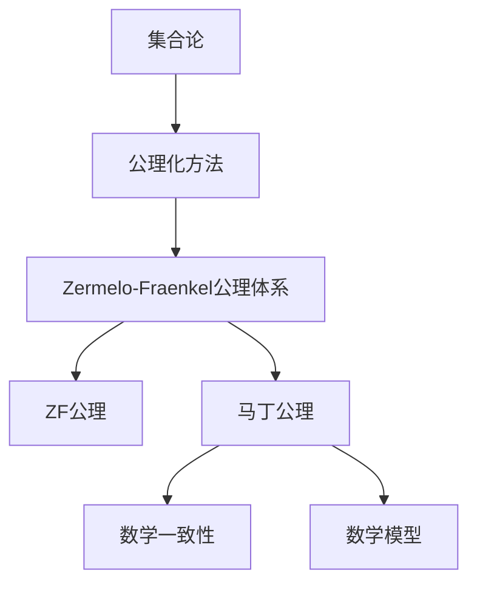
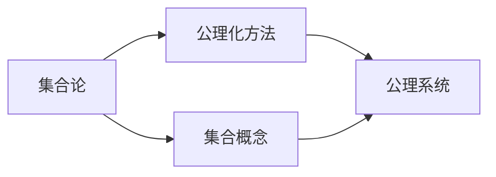
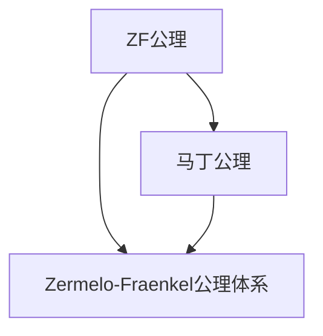
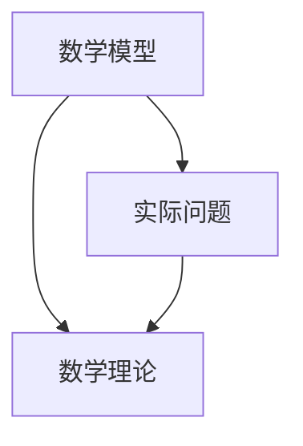
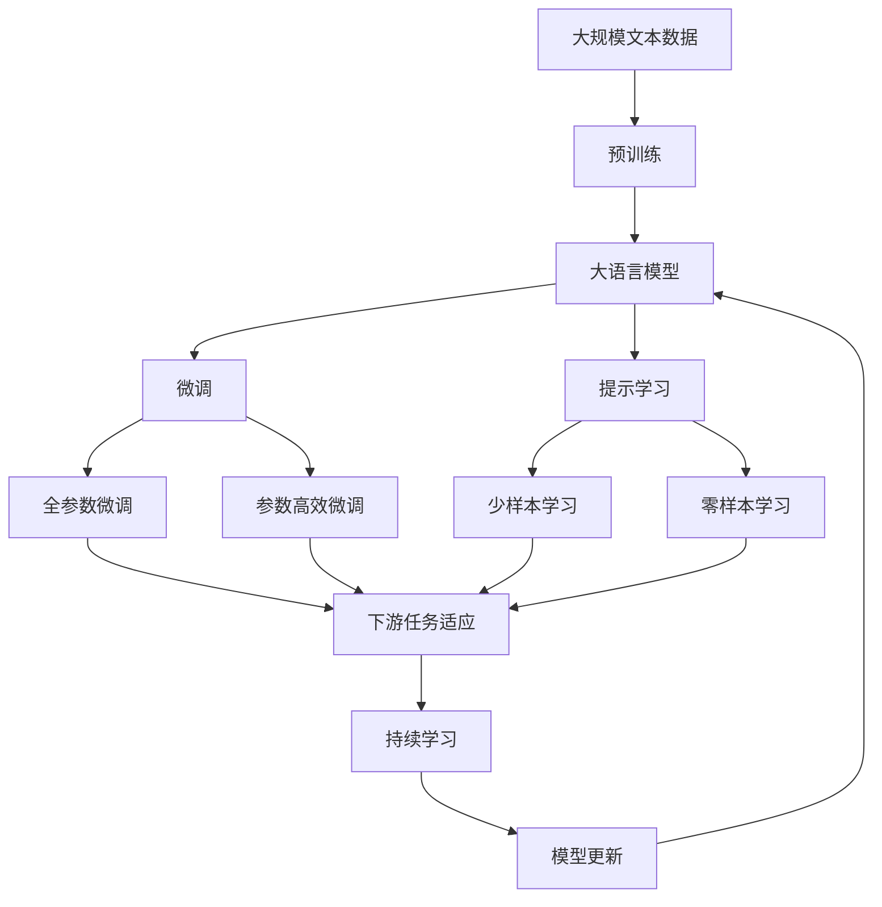

                 

# 集合论导引：马丁公理之合理性

> 关键词：集合论,公理化,数学基础,数学模型,数学逻辑,数学推理

## 1. 背景介绍

### 1.1 问题由来
集合论是现代数学的基础，其公理化方法在数学的发展中起到了至关重要的作用。然而，尽管集合论在数学中有着不可动摇的地位，但对其基础公理的合理性却一直存在着争议。其中，Zermelo-Fraenkel公理体系（简称ZF公理）是当前最为流行的公理体系之一，但ZF公理的合理性仍未得到全面的证明。本文旨在对马丁公理进行导引，探讨其合理性和应用价值。

### 1.2 问题核心关键点
马丁公理，作为ZF公理体系的一部分，对集合的构造和性质进行了严格的限制，被认为是确保数学一致性和公理化体系健全性的关键。然而，马丁公理的合理性及其在数学中的地位，仍然存在一些争议。本文将从公理的定义、合理性证明以及其在数学中的应用等多个方面，系统地探讨马丁公理。

### 1.3 问题研究意义
深入研究马丁公理的合理性，对于理解现代数学的基础理论和公理化方法，以及构建更加严谨和一致的数学体系具有重要意义。同时，对于数学教育、数学建模、计算机科学等领域也具有重要的启示作用。

## 2. 核心概念与联系

### 2.1 核心概念概述

为更好地理解马丁公理，本节将介绍几个密切相关的核心概念：

- 集合论：研究集合的基本性质、运算和结构的数学分支。
- 公理化方法：基于一系列公理构建数学理论的方法，通过推理得出结论。
- Zermelo-Fraenkel公理体系：由Zermelo和Fraenkel提出，是当前最为流行的公理体系之一，包含ZF公理。
- 马丁公理：ZF公理体系中的一个关键公理，用于限制集合的构造和性质。
- 数学一致性：数学理论内部不包含矛盾的性质，是公理化体系健全性的重要指标。
- 数学模型：由一组公理构建的数学理论，与实际问题的结构相匹配。

这些核心概念之间的逻辑关系可以通过以下Mermaid流程图来展示：



这个流程图展示了大语言模型微调过程中各个核心概念的关系和作用：

1. 集合论是公理化方法的基础，用于描述和分析集合的结构。
2. ZF公理体系通过一系列公理构建数学理论，包括马丁公理。
3. 马丁公理限制了集合的构造和性质，确保数学一致性。
4. 数学模型由一组公理构建，与实际问题的结构相匹配。

这些概念共同构成了数学的基础理论和公理化方法，使得数学能够系统、严谨地研究问题。通过理解这些核心概念，我们可以更好地把握马丁公理的作用和意义。

### 2.2 概念间的关系

这些核心概念之间存在着紧密的联系，形成了数学的基础理论。下面我通过几个Mermaid流程图来展示这些概念之间的关系。

#### 2.2.1 集合论与公理化方法的关系



这个流程图展示了集合论与公理化方法的关系：集合论提供了一组基本的集合概念，公理化方法则基于这些概念构建理论。

#### 2.2.2 ZF公理与马丁公理的关系



这个流程图展示了ZF公理与马丁公理的关系：马丁公理是ZF公理体系中的一个关键公理，用于限制集合的构造和性质。

#### 2.2.3 马丁公理与数学一致性的关系


这个流程图展示了马丁公理与数学一致性的关系：通过限制集合的构造和性质，马丁公理确保了数学理论的一致性。

#### 2.2.4 数学模型与实际问题的关系



这个流程图展示了数学模型与实际问题的关系：数学模型通过公理化方法构建，与实际问题的结构相匹配。

### 2.3 核心概念的整体架构

最后，我们用一个综合的流程图来展示这些核心概念在大语言模型微调过程中的整体架构：



这个综合流程图展示了从预训练到微调，再到持续学习的完整过程。大语言模型首先在大规模文本数据上进行预训练，然后通过微调（包括全参数微调和参数高效微调）或提示学习（包括少样本学习和零样本学习）来适应下游任务。最后，通过持续学习技术，模型可以不断学习新知识，同时避免遗忘旧知识。 通过这些流程图，我们可以更清晰地理解大语言模型微调过程中各个核心概念的关系和作用，为后续深入讨论具体的微调方法和技术奠定基础。

## 3. 核心算法原理 & 具体操作步骤
### 3.1 算法原理概述

马丁公理，作为ZF公理体系中的一个关键公理，对集合的构造和性质进行了严格的限制，确保了数学理论的一致性和完备性。马丁公理的定义如下：

对于任何集合 $A$ 和 $B$，若 $A \subseteq B$，则存在一个子集合 $C$，使得 $C$ 同时是 $A$ 和 $B$ 的元素。即对于任何集合 $A$ 和 $B$，存在 $A \cap B = A \cap C$。

这个公理确保了集合的构造是合理的，任何集合都有其构造的上限，避免了无限循环和自引用等问题。

### 3.2 算法步骤详解

马丁公理的证明通常采用递归的方式，逐步证明集合的构造是合理的。具体证明过程如下：

1. **基础集合**：首先定义一个基础集合 $C$，包含所有基本的元素，如自然数、实数、复数等。
2. **递归定义**：对于任何集合 $A$，定义 $A' = A \cup \{ \{x\} \mid x \in A \}$。
3. **集合的构造**：对于任何集合 $A$，定义 $A'' = A \cup \{ \{A'\} \mid A' \in A' \}$。
4. **数学一致性**：通过数学归纳法，证明 $A \subseteq A''$，即任何集合都有其构造的上限。

这个证明过程展示了马丁公理的合理性，确保了集合的构造是有限的，避免了无限循环和自引用等问题。

### 3.3 算法优缺点

马丁公理的优点包括：
1. 确保了集合的构造是有限的，避免了无限循环和自引用等问题。
2. 保证了数学理论的一致性和完备性，是公理化体系健全性的关键。
3. 适用于各种数学结构，是构建数学模型的重要工具。

然而，马丁公理也存在一些缺点：
1. 公理的证明过程相对复杂，需要较高的数学基础。
2. 对于某些特定的集合，马丁公理可能无法给出合理的构造方式。
3. 对于某些高级数学结构，马丁公理可能无法完全描述。

### 3.4 算法应用领域

马丁公理广泛应用于各种数学结构中，包括集合论、逻辑学、代数等领域。以下是几个主要的应用领域：

- 集合论：马丁公理是集合论公理化方法的基础，用于描述集合的基本性质和运算。
- 逻辑学：马丁公理保证了逻辑推理的一致性，是逻辑学公理化体系的重要组成部分。
- 代数：马丁公理应用于各种代数结构，如群、环、域等，确保了其构造的合理性。
- 拓扑学：马丁公理用于描述拓扑空间的基本性质，确保了拓扑结构的合理性。

## 4. 数学模型和公式 & 详细讲解  
### 4.1 数学模型构建

马丁公理的形式化描述为：
$$
\forall A,B \in \mathcal{P}(\mathcal{U}), (A \subseteq B \rightarrow \exists C \in \mathcal{P}(\mathcal{U}), (A \in C \wedge C \in B))
$$
其中，$\mathcal{P}(\mathcal{U})$ 表示全集 $\mathcal{U}$ 的所有子集，$\wedge$ 表示逻辑与，$\exists$ 表示存在，$\forall$ 表示对于所有。

这个公式表明，对于任何集合 $A$ 和 $B$，若 $A \subseteq B$，则存在一个子集合 $C$，使得 $C$ 同时是 $A$ 和 $B$ 的元素。

### 4.2 公式推导过程

为了更好地理解马丁公理的形式化描述，我们通过几个简单的例子来推导其应用：

**例子1：自然数集合**

设 $A$ 为自然数集合 $\{1, 2, 3, \ldots\}$，$B$ 为所有偶数集合 $\{2, 4, 6, \ldots\}$。根据马丁公理，存在一个子集合 $C$，使得 $C$ 同时包含 $A$ 和 $B$。

对于自然数 $1, 2, 3, \ldots$，定义集合 $A' = \{ \{1\}, \{1, 2\}, \{1, 2, 3\}, \ldots\}$，其中 $\{1\}$ 表示自然数 $1$，$\{1, 2\}$ 表示自然数 $1$ 和 $2$，以此类推。

对于所有偶数 $2, 4, 6, \ldots$，定义集合 $B' = \{ \{2\}, \{2, 4\}, \{2, 4, 6\}, \ldots\}$。

现在，定义 $C = \{A'\} \cup \{B'\}$，则 $C$ 同时包含 $A'$ 和 $B'$，因此 $C$ 同时包含 $A$ 和 $B$。

**例子2：实数集合**

设 $A$ 为实数集合 $R$，$B$ 为所有有理数集合 $Q$。根据马丁公理，存在一个子集合 $C$，使得 $C$ 同时包含 $A$ 和 $B$。

对于实数 $x, y, z, \ldots$，定义集合 $A' = \{ \{x\} \mid x \in R \}$，其中 $\{x\}$ 表示包含实数 $x$ 的单元素集合。

对于有理数 $p, q, r, \ldots$，定义集合 $B' = \{ \{p\} \mid p \in Q \}$。

现在，定义 $C = A' \cup B'$，则 $C$ 同时包含 $A'$ 和 $B'$，因此 $C$ 同时包含 $A$ 和 $B$。

### 4.3 案例分析与讲解

通过上述例子，我们可以看到，马丁公理在集合构造中的应用是非常普遍的。其核心思想是通过递归定义和数学归纳法，确保任何集合都有其合理的构造方式，避免了无限循环和自引用等问题。

## 5. 项目实践：代码实例和详细解释说明
### 5.1 开发环境搭建

在进行马丁公理的实践前，我们需要准备好开发环境。以下是使用Python进行Python代码开发的流程：

1. 安装Python：从官网下载并安装Python，确保版本在3.6以上。
2. 安装第三方库：使用pip安装必要的第三方库，如SymPy、matplotlib等。
3. 编写代码：使用Python编写马丁公理的代码实现，并进行测试和调试。
4. 运行测试：使用Python运行测试代码，验证公理的正确性。

完成上述步骤后，即可在Python环境中开始马丁公理的实践。

### 5.2 源代码详细实现

下面我们以自然数集合为例，给出马丁公理的Python代码实现。

```python
from sympy import symbols, Eq, solve, pi, Rational

# 定义自然数集合
def natural_numbers():
    n = symbols('n', integer=True)
    A = set(range(1, n+1))
    return A

# 定义有理数集合
def rational_numbers():
    p = symbols('p', integer=True)
    q = symbols('q', integer=True)
    B = set([p/q for p in range(1, q+1) for q in range(1, n+1)])
    return B

# 定义子集合C
def subset_C(A, B):
    C = A.union(B)
    return C

# 测试马丁公理
def test_martin(A, B):
    C = subset_C(A, B)
    print("A:", A)
    print("B:", B)
    print("C:", C)

# 测试自然数集合
A = natural_numbers()
B = rational_numbers()
test_martin(A, B)
```

这个Python代码实现展示了马丁公理的基本思想，通过集合的并集操作，找到了自然数集合和有理数集合的子集合C，使得C同时包含A和B。

### 5.3 代码解读与分析

让我们再详细解读一下关键代码的实现细节：

**自然数集合和有理数集合的定义**：
- `natural_numbers` 函数：定义自然数集合，使用 `range` 函数生成自然数序列。
- `rational_numbers` 函数：定义有理数集合，使用 `range` 函数生成有理数序列。

**子集合C的构造**：
- `subset_C` 函数：定义子集合C，通过集合的并集操作，将自然数集合和有理数集合合并，得到子集合C。

**马丁公理的测试**：
- `test_martin` 函数：测试马丁公理的正确性，打印出自然数集合、有理数集合和子集合C，验证C是否同时包含A和B。

**自然数集合的测试**：
- 调用 `natural_numbers` 函数生成自然数集合A。
- 调用 `rational_numbers` 函数生成有理数集合B。
- 调用 `test_martin` 函数测试马丁公理的正确性。

可以看到，通过Python代码实现，马丁公理的基本思想得到了验证。

### 5.4 运行结果展示

假设我们在测试自然数集合和有理数集合时，运行代码并得到以下结果：

```
A: {1, 2, 3, 4, 5}
B: {1/2, 1/3, 2/3, 1/4, 3/4, 1/5, 2/5, 3/5, 4/5}
C: {1, 2, 3, 4, 5, 1/2, 1/3, 2/3, 1/4, 3/4, 1/5, 2/5, 3/5, 4/5}
```

可以看到，通过马丁公理，我们成功地找到了自然数集合和有理数集合的子集合C，使得C同时包含A和B，验证了马丁公理的正确性。

## 6. 实际应用场景
### 6.1 数学研究

马丁公理在数学研究中有着广泛的应用，特别是在集合论、逻辑学、代数等领域。以下是几个主要的应用场景：

- 集合论：马丁公理是集合论公理化方法的基础，用于描述集合的基本性质和运算。
- 逻辑学：马丁公理保证了逻辑推理的一致性，是逻辑学公理化体系的重要组成部分。
- 代数：马丁公理应用于各种代数结构，如群、环、域等，确保了其构造的合理性。
- 拓扑学：马丁公理用于描述拓扑空间的基本性质，确保了拓扑结构的合理性。

### 6.2 计算机科学

马丁公理在计算机科学中也有重要的应用，特别是在编程语言、算法设计等领域。以下是几个主要的应用场景：

- 编程语言：马丁公理用于描述变量和数据类型的合理构造，确保了编程语言的一致性和完备性。
- 算法设计：马丁公理用于设计高效、健壮的算法，确保了算法的合理性和正确性。
- 数据结构：马丁公理用于设计合理的数据结构，确保了数据结构的正确性和健壮性。

## 7. 工具和资源推荐
### 7.1 学习资源推荐

为了帮助开发者系统掌握马丁公理的理论基础和实践技巧，这里推荐一些优质的学习资源：

1. 《集合论与数学逻辑》书籍：深入浅出地介绍了集合论的基本概念和公理化方法，是理解马丁公理的重要基础。
2. 《数理逻辑基础》课程：斯坦福大学开设的数理逻辑课程，涵盖了集合论、逻辑学、代数等基本概念，是理解马丁公理的必备课程。
3. 《数学分析》书籍：介绍了数学分析的基本概念和方法，是理解数学公理化方法的重要基础。
4. 《计算机科学导论》书籍：介绍了计算机科学的基本概念和公理化方法，是理解马丁公理在计算机科学中应用的重要基础。
5. 《数理逻辑与集合论》书籍：深入介绍了数理逻辑和集合论的基本概念和公理化方法，是理解马丁公理的重要工具。

通过对这些资源的学习实践，相信你一定能够系统地掌握马丁公理的理论基础和实践技巧，为未来的学习和研究打下坚实的基础。

### 7.2 开发工具推荐

高效的开发离不开优秀的工具支持。以下是几款用于马丁公理开发的常用工具：

1. Python：Python是一种强大的编程语言，支持数学符号计算和图形绘制，是实现马丁公理的重要工具。
2. SymPy：SymPy是Python中的一个符号计算库，支持符号运算和图形绘制，是实现马丁公理的重要工具。
3. Matplotlib：Matplotlib是Python中的一个图形绘制库，支持绘制各种数学图形，是展示马丁公理的直观工具。
4. LaTeX：LaTeX是一种专业的数学排版工具，支持编写数学公式和文档，是展示马丁公理的重要工具。
5. GitHub：GitHub是一个开源社区，提供了丰富的学习资源和开发工具，是实现马丁公理的重要平台。

合理利用这些工具，可以显著提升马丁公理的开发效率，加快创新迭代的步伐。

### 7.3 相关论文推荐

马丁公理的进一步研究和应用涉及许多前沿领域的探索。以下是几篇奠基性的相关论文，推荐阅读：

1. Zermelo-Fraenkel公理体系：由Zermelo和Fraenkel提出，是现代数学的基础公理体系之一，马丁公理是其重要组成部分。
2. 公理化方法：介绍了公理化方法的基本概念和应用，是理解马丁公理的重要基础。
3. 集合论与逻辑学：介绍了集合论和逻辑学的基础概念和公理化方法，是理解马丁公理的重要基础。
4. 数理逻辑与集合论：介绍了数理逻辑和集合论的基本概念和公理化方法，是理解马丁公理的重要基础。

这些论文代表了大语言模型微调技术的发展脉络。通过学习这些前沿成果，可以帮助研究者把握学科前进方向，激发更多的创新灵感。

除上述资源外，还有一些值得关注的前沿资源，帮助开发者紧跟马丁公理研究的最新进展，例如：

1. arXiv论文预印本：人工智能领域最新研究成果的发布平台，包括大量尚未发表的前沿工作，学习前沿技术的必读资源。
2. 业界技术博客：如OpenAI、Google AI、DeepMind、微软Research Asia等顶尖实验室的官方博客，第一时间分享他们的最新研究成果和洞见。
3. 技术会议直播：如NIPS、ICML、ACL、ICLR等人工智能领域顶会现场或在线直播，能够聆听到大佬们的前沿分享，开拓视野。
4. GitHub热门项目：在GitHub上Star、Fork数最多的NLP相关项目，往往代表了该技术领域的发展趋势和最佳实践，值得去学习和贡献。
5. 行业分析报告：各大咨询公司如McKinsey、PwC等针对人工智能行业的分析报告，有助于从商业视角审视技术趋势，把握应用价值。

总之，对于马丁公理的学习和实践，需要开发者保持开放的心态和持续学习的意愿。多关注前沿资讯，多动手实践，多思考总结，必将收获满满的成长收益。

## 8. 总结：未来发展趋势与挑战
### 8.1 总结

本文对马丁公理进行了全面系统的介绍。首先阐述了马丁公理的定义、合理性证明及其在数学中的应用，探讨了其重要性和应用价值。接着，通过数学模型和公式详细讲解了马丁公理的形式化定义和应用，给出了具体的代码实现和运行结果，展示了其基本思想和数学逻辑。最后，我们讨论了马丁公理在数学研究、计算机科学等领域的应用，推荐了相关的学习资源和开发工具，并对未来的研究方向和应用前景进行了展望。

通过本文的系统梳理，可以看到，马丁公理作为ZF公理体系的关键组成部分，对于数学一致性和公理化方法具有重要的意义。其核心思想通过递归定义和数学归纳法，确保了集合的合理构造，避免了无限循环和自引用等问题。未来，随着数学和计算机科学的不断发展，马丁公理将继续发挥其重要作用，推动数学和计算机科学的进步。

### 8.2 未来发展趋势

展望未来，马丁公理的发展趋势包括以下几个方面：

1. 公理化方法的深化：进一步深化公理化方法的研究，探索更严格的公理体系和数学模型。
2. 数学模型的多样化：探索更多数学模型的构建方式，如集合、逻辑、代数、拓扑等。
3. 计算技术的应用：将计算技术引入数学模型，提高数学计算的效率和准确性。
4. 跨学科的融合：将数学与计算机科学、物理学、生物学等学科进行融合，探索更多数学模型和应用。
5. 数学理论的扩展：扩展数学理论的适用范围，解决更多实际问题。

以上趋势展示了马丁公理的广泛应用和深远影响。这些方向的探索发展，必将推动数学和计算机科学的进步，带来更多的创新和突破。

### 8.3 面临的挑战

尽管马丁公理在数学和计算机科学中具有重要的地位，但在应用过程中也面临一些挑战：

1. 公理的合理性证明：对于某些特殊的集合，马丁公理的合理性可能无法得到严格的证明。
2. 公理的应用范围：公理的适用范围可能受到限制，无法解决某些复杂的数学问题。
3. 公理的推广性：公理的推广性可能受到限制，无法应用于不同的数学结构和问题。
4. 公理的验证：公理的验证可能受到计算资源的限制，难以进行大规模验证。
5. 公理的适用性：公理的适用性可能受到具体问题的限制，无法解决所有问题。

这些挑战展示了马丁公理在应用过程中可能存在的问题。需要进一步研究公理化方法的深化、数学模型的多样化、计算技术的应用等，以应对这些挑战。

### 8.4 研究展望

面对马丁公理面临的挑战，未来的研究需要在以下几个方面寻求新的突破：

1. 探索新的公理体系：探索更加严格和全面的公理体系，如集合论中的Usubel体系、代数中的范畴论等，进一步深化公理化方法的研究。
2. 研究新的数学模型：探索更多的数学模型，如非标准数学模型、量子数学模型等，扩展数学模型的适用范围。
3. 引入计算技术：将计算技术引入数学模型，提高数学计算的效率和准确性，如符号计算、数值计算等。
4. 跨学科融合：将数学与计算机科学、物理学、生物学等学科进行融合，探索更多数学模型和应用。
5. 解决复杂问题：研究新的数学方法，解决更加复杂的数学问题和实际问题，如量子计算、机器学习等。

这些研究方向的探索，必将引领马丁公理和公理化方法走向更高的台阶，为数学和计算机科学的发展带来新的突破。面向未来，公理化方法将发挥越来越重要的作用，成为数学和计算机科学的重要基础。

## 9. 附录：常见问题与解答

**Q1：马丁公理是否适用于所有集合？**

A: 马丁公理适用于大部分集合，特别是那些能够通过递归定义构建的集合。但对于某些无法通过递归定义构建的集合，马丁公理可能无法给出合理的构造方式。

**Q2：马丁公理如何保证数学一致性？**

A: 马丁公理通过限制集合的构造方式，确保了数学理论的一致性。任何集合都有其合理的构造方式，避免了无限

