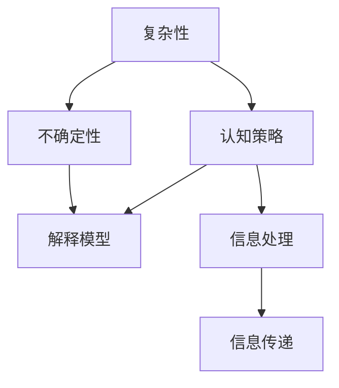

                 

# 面对无法解释事物的认知阶段

在这个信息爆炸的时代，我们被各种复杂的信息所包围。无论是科学、经济还是社会问题，都充满了各种难以解释的现象和数据。这些现象不仅复杂多变，而且常常缺乏明确的因果关系，使得我们对它们的认知充满了挑战。本文将从认知科学的视角出发，探讨人类如何面对无法解释的事物，分析其背后的心理机制和认知策略，提出一些解决策略，帮助我们在复杂世界中更好地理解和处理信息。

## 1. 背景介绍

### 1.1 问题由来

认知科学是一门研究人类认知过程及其背后的生理和心理机制的学科。认知科学家通过研究人类的感知、记忆、注意力、推理、情感等方面的能力，揭示了大脑如何处理信息，理解世界。然而，在当今社会，许多复杂的现象已经超出了人类传统的认知能力范围。

例如，大数据时代下，海量数据往往包含着极为复杂和隐秘的规律，我们很难从中找到明确的模式。此外，人工智能、机器学习等新兴技术的发展，使得计算机能够处理更复杂的信息，但同时也增加了我们对这些技术背后“黑箱”的依赖。

这些问题不仅影响到科学家的研究，也使得普通人在面对复杂世界时感到困惑和无力。因此，本文旨在探讨人类如何面对无法解释的事物，提供一些有效的认知策略和方法，帮助我们在复杂世界中保持清晰的思维和行动。

### 1.2 问题核心关键点

- **复杂性与不确定性**：现代世界中的许多现象是复杂且不确定的，难以用传统的方法简单地解释。
- **人类认知的局限性**：人类认知系统在处理复杂信息时存在一定的局限性，容易产生偏见和误判。
- **信息处理策略**：人类通过各种策略来处理复杂信息，但这些策略是否有效值得研究。
- **机器学习与人工智能**：AI技术的普及增加了我们对技术的依赖，但其背后的机制和结果往往难以解释。

## 2. 核心概念与联系

### 2.1 核心概念概述

为了更好地理解复杂世界的认知过程，本文将介绍几个关键概念：

- **复杂性（Complexity）**：指系统中的变量、元素之间存在复杂的相互作用，难以用简单规则描述的现象。
- **不确定性（Uncertainty）**：指系统中的结果和行为存在多种可能性，难以准确预测。
- **认知策略（Cognitive Strategies）**：指人们在面对复杂问题时，所采用的各种心理和行为策略。
- **解释模型（Explanatory Models）**：指人们为了解释复杂现象而构建的简化模型或理论。
- **信息处理（Information Processing）**：指人们如何处理和利用信息，包括信息的收集、存储、加工和传递。

### 2.2 概念间的关系

这些概念之间存在着紧密的联系，可以构建出一个全面的认知模型。以下是一个Mermaid流程图，展示了这些概念之间的逻辑关系：



这个流程图展示了复杂性与不确定性如何影响认知策略，进而影响人们对复杂现象的解释和信息处理。

## 3. 核心算法原理 & 具体操作步骤

### 3.1 算法原理概述

在认知科学中，面对复杂和不确定的现象，人们通常会采用以下策略来构建解释模型：

1. **简化与抽象（Simplification & Abstraction）**：将复杂的现象简化为更易理解的形式，通过抽象出关键特征来处理信息。
2. **归纳与推理（Induction & Deduction）**：从具体事例中归纳出一般规律，利用推理来预测未来结果。
3. **假设检验（Hypothesis Testing）**：通过实验和数据来检验假设的真实性，修正认知模型。
4. **类比与迁移（Analogy & Transfer）**：将已知的知识应用于新的领域，通过类比来理解复杂现象。

这些策略往往需要结合实际情境进行灵活运用，以达到最佳解释效果。

### 3.2 算法步骤详解

下面详细描述这些认知策略的具体操作步骤：

1. **简化与抽象**
   - 步骤1：收集数据，识别关键特征。
   - 步骤2：选择简化模型，如统计模型、数学模型等。
   - 步骤3：利用简化模型处理数据，预测结果。
   - 步骤4：评估预测效果，调整模型参数。

2. **归纳与推理**
   - 步骤1：收集样本数据，标记结果。
   - 步骤2：选择合适的统计方法，如回归分析、分类算法等。
   - 步骤3：训练模型，得到预测公式。
   - 步骤4：使用新数据验证模型，调整参数。

3. **假设检验**
   - 步骤1：提出假设，设计实验。
   - 步骤2：收集实验数据，进行统计分析。
   - 步骤3：检验假设的真实性，得出结论。
   - 步骤4：根据结果，调整认知模型。

4. **类比与迁移**
   - 步骤1：识别已知领域的关键知识和规律。
   - 步骤2：将知识迁移到新领域，构建类比模型。
   - 步骤3：验证类比模型的有效性。
   - 步骤4：根据验证结果，调整模型。

### 3.3 算法优缺点

这些认知策略有其优点和局限性：

- **优点**：
  - 简化模型易于理解和处理，适用于复杂现象的初步分析。
  - 归纳与推理能够从数据中提取规律，预测未来结果。
  - 假设检验和类比迁移能够通过实验和数据验证假设，修正认知模型。

- **缺点**：
  - 简化模型可能丢失一些重要细节，难以全面描述复杂现象。
  - 归纳与推理依赖于数据的样本量和方法的选择，容易产生误判。
  - 假设检验和类比迁移需要大量实验和数据，耗时耗力。

### 3.4 算法应用领域

这些认知策略广泛应用于各个领域，例如：

- **科学研究**：通过假设检验和归纳推理，科学家用实验验证假设，发现新规律。
- **工程设计**：通过简化与抽象，工程师设计出可行的解决方案。
- **金融分析**：通过类比与迁移，分析师预测市场趋势，进行投资决策。
- **医学诊断**：通过归纳与推理，医生诊断疾病，制定治疗方案。

## 4. 数学模型和公式 & 详细讲解 & 举例说明

### 4.1 数学模型构建

在认知科学中，面对复杂现象时，我们通常会构建各种简化模型来解释其行为。以下是一个简单的回归模型：

$$
y = b_0 + b_1 x_1 + b_2 x_2 + \ldots + b_n x_n + \epsilon
$$

其中，$y$ 表示预测结果，$x_i$ 表示输入变量，$b_i$ 表示回归系数，$\epsilon$ 表示误差项。

### 4.2 公式推导过程

对于线性回归模型，可以通过最小二乘法求解回归系数：

$$
\hat{b} = (X^TX)^{-1}X^Ty
$$

其中，$\hat{b}$ 表示回归系数的估计值，$X$ 表示设计矩阵，$y$ 表示响应变量。

### 4.3 案例分析与讲解

例如，假设我们要预测房屋价格，可以收集房屋面积、房间数量等特征，构建一个线性回归模型。通过最小二乘法计算出回归系数后，可以得到房屋价格的预测公式。

然而，在实际应用中，我们通常会面临更多复杂的问题，需要结合多种认知策略来解决。

## 5. 项目实践：代码实例和详细解释说明

### 5.1 开发环境搭建

为了进行实际的认知策略操作，我们需要搭建开发环境。以下是一个Python的开发环境搭建步骤：

1. 安装Python和相关库，如numpy、scipy、pandas等。
2. 安装相关的数据分析库，如matplotlib、seaborn等。
3. 安装机器学习库，如scikit-learn、TensorFlow等。

### 5.2 源代码详细实现

下面是一个简单的线性回归模型的Python代码实现：

```python
import numpy as np
from sklearn.linear_model import LinearRegression

# 定义数据
x = np.array([[1, 2], [2, 3], [3, 4]])
y = np.array([2, 4, 6])

# 构建模型
model = LinearRegression()

# 训练模型
model.fit(x, y)

# 预测结果
x_new = np.array([[4, 5]])
y_new = model.predict(x_new)

print(y_new)
```

### 5.3 代码解读与分析

这个代码实现了简单的线性回归模型，通过训练得到回归系数，并利用新数据进行预测。

- 代码第3行，我们使用numpy库定义了输入变量$x$和响应变量$y$。
- 代码第5行，我们实例化了scikit-learn库中的线性回归模型。
- 代码第7行，我们使用训练数据对模型进行拟合，得到回归系数。
- 代码第11行，我们使用新数据进行预测，得到预测结果。

### 5.4 运行结果展示

假设我们的模型预测结果为7.5，我们可以得到如下输出：

```
[7.5]
```

这表示，当输入数据为4和5时，预测结果为7.5。

## 6. 实际应用场景

### 6.1 科学研究

在科学研究中，面对复杂现象，科学家们常常采用假设检验和归纳推理的方法来构建解释模型。例如，在天文学中，通过观测恒星的亮度和颜色，科学家可以推测其类型和年龄，构建恒星演化模型。

### 6.2 金融分析

在金融分析中，分析师们常常使用类比与迁移的方法，将历史数据和市场规律应用于新的领域。例如，通过分析历史股价数据，预测未来的市场走势。

### 6.3 医学诊断

在医学诊断中，医生们通过归纳与推理的方法，分析患者的症状和病史，构建疾病模型。例如，通过分析患者的血常规数据，诊断出血液疾病。

## 7. 工具和资源推荐

### 7.1 学习资源推荐

为了更好地理解认知策略和解释模型，以下是一些推荐的学习资源：

- 《认知心理学》书籍：介绍了人类认知过程的基本原理和机制。
- 《统计学习基础》书籍：详细讲解了各种统计方法的理论和应用。
- 《机器学习》在线课程：讲解了机器学习的各种算法和应用。
- 《深度学习》在线课程：介绍了深度学习的基础知识和应用场景。

### 7.2 开发工具推荐

在认知策略和解释模型的实现中，以下工具可以提供支持：

- Jupyter Notebook：用于编写和运行代码，可视化分析结果。
- Python：广泛用于数据科学和机器学习领域。
- R：另一个广泛用于统计分析和机器学习的语言。
- SQL：用于处理和管理大数据。

### 7.3 相关论文推荐

以下论文对认知策略和解释模型有深入的探讨：

- Tversky & Kahneman（1974）：《启发式和偏差：思维的经济学》。
- Fodor（1975）：《心理语言的理论》。
- Shepard & Metzler（1971）：《心理和计算机中的图灵测试》。
- Simon（1987）：《人类计算：思维与信息处理》。

## 8. 总结：未来发展趋势与挑战

### 8.1 研究成果总结

面对无法解释的事物，人类采用了各种认知策略和解释模型。这些策略和模型在科学、工程、金融、医学等多个领域得到了广泛应用。未来，随着技术的不断进步，认知科学将进一步发展，提供更加有效的方法来解决复杂问题。

### 8.2 未来发展趋势

未来，认知科学将向以下几个方向发展：

1. **多模态信息处理**：结合视觉、听觉等多模态信息，构建更全面的认知模型。
2. **人工智能与认知的融合**：利用AI技术，模拟人类的认知过程，提升信息处理能力。
3. **跨学科研究**：结合心理学、神经科学、计算机科学等多个学科的知识，深入理解认知机制。
4. **普适性认知模型**：构建可应用于各种复杂问题的普适性认知模型。

### 8.3 面临的挑战

尽管认知科学已经取得了一定的进展，但仍面临一些挑战：

1. **数据质量和数量**：高质量、大规模数据的需求，仍是制约认知研究的重要因素。
2. **算法复杂性**：构建复杂的认知模型需要高超的算法和计算能力。
3. **跨学科协作**：不同学科之间的协作和知识共享仍然存在障碍。
4. **伦理和安全问题**：认知模型的应用可能涉及到隐私和安全问题，需要慎重考虑。

### 8.4 研究展望

未来，认知科学需要在以下几个方面进行深入研究：

1. **数据收集与处理**：探索更高效的数据收集和处理方法，提高数据质量和数量。
2. **算法优化**：开发更高效的算法，减少计算资源消耗，提升模型性能。
3. **跨学科合作**：加强不同学科之间的协作，促进知识的整合和创新。
4. **伦理和安全保障**：确保认知模型的应用符合伦理和安全标准，保护用户隐私。

## 9. 附录：常见问题与解答

### Q1：认知科学中的简化与抽象策略是否总是有效？

A: 简化与抽象策略在处理简单问题时是有效的，但在处理复杂问题时可能丢失一些关键细节。此时需要结合其他策略，如假设检验和类比迁移，来提高模型的准确性。

### Q2：如何处理复杂现象的不确定性？

A: 处理复杂现象的不确定性，可以通过增加样本量、改进模型假设、引入先验知识等方式来提高预测的准确性。同时，采用贝叶斯方法等概率模型，可以更好地处理不确定性。

### Q3：在实际应用中，机器学习模型的结果是否总是可解释的？

A: 机器学习模型通常具有黑箱性质，难以解释其内部机制和决策过程。在应用中，需要结合领域知识和专家经验，对模型的输出进行解释和验证。

### Q4：在处理复杂问题时，如何平衡复杂性和可解释性？

A: 在处理复杂问题时，需要寻找一个平衡点。可以通过简化问题、引入先验知识、多模型融合等方式，在保证可解释性的前提下，提高模型的性能。

### Q5：如何提高认知模型的普适性？

A: 提高认知模型的普适性，需要构建更加灵活和通用的模型。可以引入可解释的规则和约束，增加模型的可适应性和鲁棒性。同时，需要不断积累数据和经验，改进模型参数。

---

作者：禅与计算机程序设计艺术 / Zen and the Art of Computer Programming

