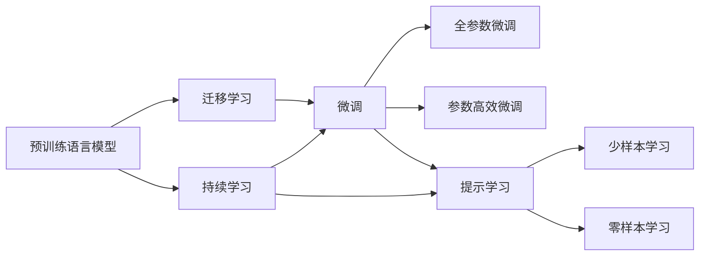
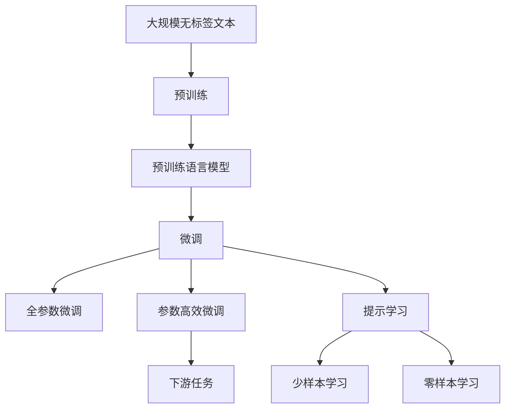

                 

# 预训练与微调的实战经验

> 关键词：预训练, 微调, 迁移学习, 深度学习, 自然语言处理(NLP), 预训练语言模型, 微调范式, Transformers, BERT, 微调, 参数高效微调(PEFT)

## 1. 背景介绍

### 1.1 问题由来

近年来，深度学习在自然语言处理（NLP）领域取得了长足的进展。大规模预训练语言模型（Pre-trained Language Models, PLMs），如BERT、GPT等，通过在大规模无标签数据上进行自监督预训练，学习到丰富的语言表示，展现出了强大的语言理解与生成能力。这些预训练模型在多种下游任务中展示了卓越的性能，推动了NLP技术的快速发展。

然而，预训练模型往往需要处理海量数据，耗时长、成本高，且其通用性在特定任务上仍有局限。为了解决这些问题，预训练与微调（Fine-Tuning）技术应运而生。预训练-微调是一种典型的迁移学习（Transfer Learning）范式，旨在利用预训练模型的强大表征能力，通过少量标注数据进行微调，适配特定任务。

### 1.2 问题核心关键点

预训练与微调的核心在于如何将通用预训练模型转化为特定任务的解决方案。其关键在于选择合适的微调策略，优化微调过程，使得模型能够快速适应新任务，同时尽可能保留预训练模型的知识。目前常见的微调策略包括：

- **微调范式选择**：选择全参数微调或参数高效微调（PEFT），决定哪些参数参与微调。
- **超参数设定**：学习率、批次大小、训练轮数等超参数的调整。
- **正则化技术**：L2正则、Dropout、Early Stopping等，避免过拟合。
- **数据增强**：通过改写、回译等方法扩充训练集，提高模型鲁棒性。
- **对抗训练**：加入对抗样本，提高模型鲁棒性。
- **提示学习**：通过精心设计输入格式，引导模型生成期望输出。

预训练与微调方法已经在问答、翻译、摘要、对话等多个NLP任务上取得了显著效果，成为NLP技术落地的重要手段。本文将深入探讨预训练与微调的实战经验，包括核心概念、算法原理、操作步骤、案例分析和项目实践，以期为实践者提供参考。

## 2. 核心概念与联系

### 2.1 核心概念概述

理解预训练与微调，需要掌握以下关键概念：

- **预训练语言模型（PLMs）**：如BERT、GPT等，通过在大规模无标签文本上自监督预训练学习语言表示。
- **微调（Fine-Tuning）**：利用标注数据对预训练模型进行有监督的优化，适配特定任务。
- **迁移学习（Transfer Learning）**：将一个领域学到的知识迁移到另一个领域。
- **全参数微调**：更新模型所有参数，以适应新任务。
- **参数高效微调（PEFT）**：只更新少量参数，保留大部分预训练权重。
- **提示学习（Prompt Learning）**：通过输入格式设计，引导模型生成期望输出，无需更新模型参数。
- **少样本学习（Few-shot Learning）**：在少量样本下进行学习，利用预训练模型知识。
- **零样本学习（Zero-shot Learning）**：无需训练，仅通过任务描述即可生成输出。
- **对抗训练（Adversarial Training）**：加入对抗样本，提高模型鲁棒性。
- **持续学习（Continual Learning）**：模型不断学习新知识，避免灾难性遗忘。

这些概念之间存在紧密联系，构成预训练与微调的整体框架。下图展示了这些概念之间的联系：



通过理解这些核心概念，可以更深刻地把握预训练与微调的技术本质。

### 2.2 概念间的关系

预训练与微调的核心流程为：

1. **预训练**：在大规模无标签文本上自监督预训练，学习语言表示。
2. **微调**：在特定任务上利用标注数据进行有监督学习，适配任务需求。

下图展示了预训练与微调的整体流程：



通过预训练，模型学习到语言的通用表示；通过微调，模型进一步学习特定任务的相关知识，从而提升任务性能。以下各节将详细介绍预训练、微调的具体步骤与操作。

## 3. 核心算法原理 & 具体操作步骤

### 3.1 算法原理概述

预训练与微调的原理是迁移学习。通过在大规模无标签文本上进行预训练，学习到语言的通用表示；然后在特定任务上利用少量标注数据进行微调，适配新任务需求。微调的损失函数通常设计为模型预测输出与真实标签之间的差异，如交叉熵损失等。微调的目标是最小化损失函数，从而优化模型性能。

### 3.2 算法步骤详解

预训练与微调通常包括以下步骤：

**Step 1: 准备数据集和模型**

- **数据集准备**：收集特定任务的标注数据，划分为训练集、验证集和测试集。标注数据应与预训练数据的分布尽可能一致。
- **模型准备**：选择合适的预训练语言模型，如BERT、GPT等。

**Step 2: 添加任务适配层**

- **任务适配层**：根据任务类型，设计合适的输出层和损失函数。例如，对于分类任务，通常使用线性分类器和交叉熵损失。

**Step 3: 设置微调超参数**

- **超参数**：选择优化器（如AdamW、SGD）及其参数，如学习率、批次大小、迭代轮数等。
- **正则化**：选择合适的正则化技术，如L2正则、Dropout、Early Stopping等。
- **冻结预训练参数**：决定哪些预训练参数参与微调，如仅微调顶层，或全参数微调。

**Step 4: 执行微调训练**

- **训练循环**：在训练集上迭代训练，计算损失函数并反向传播更新模型参数。
- **验证评估**：周期性在验证集上评估模型性能，决定是否停止训练。

**Step 5: 测试和部署**

- **测试集评估**：在测试集上评估微调后模型的性能。
- **模型部署**：将微调后的模型部署到实际应用系统中。

### 3.3 算法优缺点

**优点**：

- **简单高效**：通过少量标注数据即可提升模型性能，成本较低。
- **通用性强**：适用于多种NLP任务，如分类、匹配、生成等。
- **参数高效**：通过参数高效微调技术，可以在保持预训练知识的同时，仅更新少量参数。
- **效果显著**：在许多任务上取得了优异的性能，提升了模型性能。

**缺点**：

- **依赖标注数据**：微调效果受标注数据质量与数量影响较大。
- **迁移能力有限**：预训练模型可能难以适应特定任务，迁移能力有限。
- **负迁移风险**：预训练模型的偏见可能传递到下游任务，造成负面影响。
- **可解释性不足**：微调模型的决策过程缺乏可解释性，难以调试。

### 3.4 算法应用领域

预训练与微调方法已经在问答、翻译、摘要、对话等多个NLP任务上取得了显著效果，被广泛应用于实际应用中。

- **问答系统**：基于预训练与微调，自动回答用户查询。
- **机器翻译**：将源语言翻译为目标语言。
- **文本摘要**：将长文本压缩为简短摘要。
- **对话系统**：使机器能够与人类自然对话。
- **命名实体识别**：识别文本中的实体。
- **关系抽取**：从文本中抽取实体之间的关系。

## 4. 数学模型和公式 & 详细讲解

### 4.1 数学模型构建

记预训练模型为 $M_{\theta}$，其中 $\theta$ 为预训练参数。假设微调任务的训练集为 $D=\{(x_i,y_i)\}_{i=1}^N$，其中 $x_i$ 为输入，$y_i$ 为标签。

微调的优化目标是最小化经验风险：

$$
\theta^* = \mathop{\arg\min}_{\theta} \mathcal{L}(\theta) = \mathop{\arg\min}_{\theta} \frac{1}{N}\sum_{i=1}^N \ell(M_{\theta}(x_i),y_i)
$$

其中，$\ell$ 为损失函数，$\mathcal{L}$ 为经验风险。

### 4.2 公式推导过程

以二分类任务为例，假设模型输出为 $\hat{y}=M_{\theta}(x) \in [0,1]$，真实标签为 $y \in \{0,1\}$。二分类交叉熵损失函数为：

$$
\ell(M_{\theta}(x),y) = -[y\log \hat{y} + (1-y)\log (1-\hat{y})]
$$

微调的优化目标是最小化经验风险，即：

$$
\theta^* = \mathop{\arg\min}_{\theta} \frac{1}{N}\sum_{i=1}^N [y_i\log M_{\theta}(x_i)+(1-y_i)\log(1-M_{\theta}(x_i))]
$$

根据链式法则，损失函数对参数 $\theta_k$ 的梯度为：

$$
\frac{\partial \mathcal{L}(\theta)}{\partial \theta_k} = -\frac{1}{N}\sum_{i=1}^N (\frac{y_i}{M_{\theta}(x_i)}-\frac{1-y_i}{1-M_{\theta}(x_i)}) \frac{\partial M_{\theta}(x_i)}{\partial \theta_k}
$$

其中 $\frac{\partial M_{\theta}(x_i)}{\partial \theta_k}$ 为反向传播计算得到。

## 5. 项目实践：代码实例和详细解释说明

### 5.1 开发环境搭建

以下是在PyTorch中进行BERT微调的开发环境搭建步骤：

1. 安装Anaconda：
```bash
conda create -n pytorch-env python=3.8 
conda activate pytorch-env
```

2. 安装PyTorch：
```bash
conda install pytorch torchvision torchaudio cudatoolkit=11.1 -c pytorch -c conda-forge
```

3. 安装HuggingFace Transformers库：
```bash
pip install transformers
```

4. 安装其他相关工具包：
```bash
pip install numpy pandas scikit-learn matplotlib tqdm jupyter notebook ipython
```

### 5.2 源代码详细实现

以下是一个使用BERT进行命名实体识别（NER）任务微调的代码实现：

```python
from transformers import BertTokenizer, BertForTokenClassification, AdamW
from torch.utils.data import Dataset, DataLoader
import torch

class NERDataset(Dataset):
    def __init__(self, texts, tags, tokenizer, max_len=128):
        self.texts = texts
        self.tags = tags
        self.tokenizer = tokenizer
        self.max_len = max_len
        
    def __len__(self):
        return len(self.texts)
    
    def __getitem__(self, item):
        text = self.texts[item]
        tags = self.tags[item]
        
        encoding = self.tokenizer(text, return_tensors='pt', max_length=self.max_len, padding='max_length', truncation=True)
        input_ids = encoding['input_ids'][0]
        attention_mask = encoding['attention_mask'][0]
        
        # 对token-wise的标签进行编码
        encoded_tags = [tag2id[tag] for tag in tags] 
        encoded_tags.extend([tag2id['O']] * (self.max_len - len(encoded_tags)))
        labels = torch.tensor(encoded_tags, dtype=torch.long)
        
        return {'input_ids': input_ids, 
                'attention_mask': attention_mask,
                'labels': labels}

# 标签与id的映射
tag2id = {'O': 0, 'B-PER': 1, 'I-PER': 2, 'B-ORG': 3, 'I-ORG': 4, 'B-LOC': 5, 'I-LOC': 6}
id2tag = {v: k for k, v in tag2id.items()}

# 创建dataset
tokenizer = BertTokenizer.from_pretrained('bert-base-cased')

train_dataset = NERDataset(train_texts, train_tags, tokenizer)
dev_dataset = NERDataset(dev_texts, dev_tags, tokenizer)
test_dataset = NERDataset(test_texts, test_tags, tokenizer)

# 定义模型和优化器
model = BertForTokenClassification.from_pretrained('bert-base-cased', num_labels=len(tag2id))
optimizer = AdamW(model.parameters(), lr=2e-5)

# 设置微调超参数
device = torch.device('cuda') if torch.cuda.is_available() else torch.device('cpu')
model.to(device)

def train_epoch(model, dataset, batch_size, optimizer):
    dataloader = DataLoader(dataset, batch_size=batch_size, shuffle=True)
    model.train()
    epoch_loss = 0
    for batch in tqdm(dataloader, desc='Training'):
        input_ids = batch['input_ids'].to(device)
        attention_mask = batch['attention_mask'].to(device)
        labels = batch['labels'].to(device)
        model.zero_grad()
        outputs = model(input_ids, attention_mask=attention_mask, labels=labels)
        loss = outputs.loss
        epoch_loss += loss.item()
        loss.backward()
        optimizer.step()
    return epoch_loss / len(dataloader)

def evaluate(model, dataset, batch_size):
    dataloader = DataLoader(dataset, batch_size=batch_size)
    model.eval()
    preds, labels = [], []
    with torch.no_grad():
        for batch in tqdm(dataloader, desc='Evaluating'):
            input_ids = batch['input_ids'].to(device)
            attention_mask = batch['attention_mask'].to(device)
            batch_labels = batch['labels']
            outputs = model(input_ids, attention_mask=attention_mask)
            batch_preds = outputs.logits.argmax(dim=2).to('cpu').tolist()
            batch_labels = batch_labels.to('cpu').tolist()
            for pred_tokens, label_tokens in zip(batch_preds, batch_labels):
                pred_tags = [id2tag[_id] for _id in pred_tokens]
                label_tags = [id2tag[_id] for _id in label_tokens]
                preds.append(pred_tags[:len(label_tags)])
                labels.append(label_tags)
                
    print(classification_report(labels, preds))

# 训练和评估
epochs = 5
batch_size = 16

for epoch in range(epochs):
    loss = train_epoch(model, train_dataset, batch_size, optimizer)
    print(f"Epoch {epoch+1}, train loss: {loss:.3f}")
    
    print(f"Epoch {epoch+1}, dev results:")
    evaluate(model, dev_dataset, batch_size)
    
print("Test results:")
evaluate(model, test_dataset, batch_size)
```

### 5.3 代码解读与分析

这段代码实现了一个使用BERT模型进行命名实体识别任务的微调。关键步骤如下：

1. 定义了NERDataset类，用于处理文本和标签。
2. 创建了标签和id的映射字典，用于将token-wise的预测结果解码回真实的标签。
3. 训练函数train_epoch：迭代数据，前向传播计算loss并反向传播更新模型参数。
4. 评估函数evaluate：对模型进行评估，输出分类指标。

## 6. 实际应用场景

预训练与微调技术已经广泛应用于多个领域，推动了NLP技术的产业化进程。

### 6.1 智能客服系统

基于预训练与微调技术，智能客服系统能够处理大量客户咨询，提升客户满意度。系统利用历史客服数据进行微调，使其能够自动理解用户意图，匹配最佳答案，实现7x24小时不间断服务。

### 6.2 金融舆情监测

金融机构利用微调技术进行金融舆情监测，实时监测市场舆论动向，避免负面信息传播，规避金融风险。系统通过微调模型自动判断文本主题和情感，及时预警异常情况。

### 6.3 个性化推荐系统

推荐系统利用微调技术进行物品推荐，挖掘用户兴趣点，提供个性化推荐，提升用户满意度。系统利用用户行为数据进行微调，学习物品与用户之间的语义关系。

## 7. 工具和资源推荐

### 7.1 学习资源推荐

1. 《Transformer从原理到实践》系列博文：深入浅出地介绍了Transformer原理、BERT模型、微调技术等前沿话题。
2. CS224N《深度学习自然语言处理》课程：斯坦福大学开设的NLP明星课程，涵盖了NLP领域的基本概念和经典模型。
3. 《Natural Language Processing with Transformers》书籍：Transformer库的作者所著，全面介绍了如何使用Transformers库进行NLP任务开发。
4. HuggingFace官方文档：提供海量预训练模型和完整的微调样例代码。
5. CLUE开源项目：涵盖大量不同类型的中文NLP数据集，并提供了基于微调的baseline模型。

### 7.2 开发工具推荐

1. PyTorch：基于Python的开源深度学习框架，适合快速迭代研究。
2. TensorFlow：由Google主导开发的开源深度学习框架，生产部署方便。
3. Transformers库：HuggingFace开发的NLP工具库，集成了众多SOTA语言模型。
4. Weights & Biases：模型训练的实验跟踪工具。
5. TensorBoard：TensorFlow配套的可视化工具。
6. Google Colab：谷歌推出的在线Jupyter Notebook环境，免费提供GPU/TPU算力。

### 7.3 相关论文推荐

1. Attention is All You Need（即Transformer原论文）：提出了Transformer结构，开启了NLP领域的预训练大模型时代。
2. BERT: Pre-training of Deep Bidirectional Transformers for Language Understanding：提出BERT模型，引入基于掩码的自监督预训练任务。
3. Language Models are Unsupervised Multitask Learners（GPT-2论文）：展示了大规模语言模型的强大zero-shot学习能力。
4. Parameter-Efficient Transfer Learning for NLP：提出Adapter等参数高效微调方法。
5. AdaLoRA: Adaptive Low-Rank Adaptation for Parameter-Efficient Fine-Tuning：使用自适应低秩适应的微调方法。
6. Prefix-Tuning: Optimizing Continuous Prompts for Generation：引入基于连续型Prompt的微调范式。

## 8. 总结：未来发展趋势与挑战

### 8.1 研究成果总结

本文详细介绍了预训练与微调技术的基本原理、操作步骤和应用场景。通过理论推导和代码实现，展示了预训练与微调技术的广泛适用性和高效性。预训练与微调技术已经成为NLP领域的重要范式，推动了NLP技术的产业化进程。

### 8.2 未来发展趋势

预训练与微调技术将呈现以下发展趋势：

1. **模型规模增大**：预训练模型参数量将持续增长，超大规模语言模型具备更丰富的语言知识。
2. **微调方法多样**：参数高效微调等方法将进一步优化，提升微调效率。
3. **持续学习常态化**：微调模型需要不断学习新知识，保持性能。
4. **数据依赖降低**：无监督和半监督微调方法将减少对标注数据的依赖。
5. **多模态微调兴起**：视觉、语音等多模态数据的整合将提升模型性能。
6. **通用性增强**：预训练模型将具备更强的常识推理和跨领域迁移能力。

### 8.3 面临的挑战

预训练与微调技术仍面临以下挑战：

1. **标注成本高**：微调效果受标注数据质量与数量影响。
2. **鲁棒性不足**：微调模型面对域外数据时，泛化性能有限。
3. **推理效率低**：大模型推理速度慢，资源消耗大。
4. **可解释性差**：微调模型的决策过程缺乏可解释性。
5. **安全性风险**：预训练模型可能学习到有害信息，传递到下游任务。
6. **知识整合不足**：微调模型缺乏灵活吸收外部知识的能力。

### 8.4 研究展望

未来的研究应在以下几个方向取得突破：

1. **无监督和半监督微调**：减少对标注数据的依赖。
2. **参数高效和计算高效**：提升微调效率。
3. **多模态融合**：提升模型性能。
4. **持续学习与知识图谱**：增强模型的常识推理能力。
5. **对抗训练与博弈论**：提高模型鲁棒性。
6. **伦理与安全约束**：避免模型偏见，确保输出安全。

## 9. 附录：常见问题与解答

### Q1: 预训练与微调适用于所有NLP任务吗？

A: 预训练与微调在大多数NLP任务上都能取得较好效果，特别是数据量较小的任务。但对于一些特定领域的任务，如医学、法律等，预训练模型的通用性有限。

### Q2: 如何选择合适的学习率？

A: 微调的学习率通常比预训练时小1-2个数量级，一般从1e-5开始调参，逐步减小。可以使用warmup策略，逐步过渡到预设值。

### Q3: 预训练与微调中如何缓解过拟合问题？

A: 常见的缓解策略包括数据增强、正则化、对抗训练、参数高效微调等。

### Q4: 预训练与微调在实际部署中需要注意哪些问题？

A: 预训练与微调模型需要考虑模型裁剪、量化加速、服务化封装、弹性伸缩、监控告警和安全性防护等问题。

通过深入理解预训练与微调技术，可以有效提升NLP系统的性能和应用范围，推动人工智能技术的产业化进程。未来，预训练与微调技术将继续演化，为NLP领域带来更多突破和创新。

