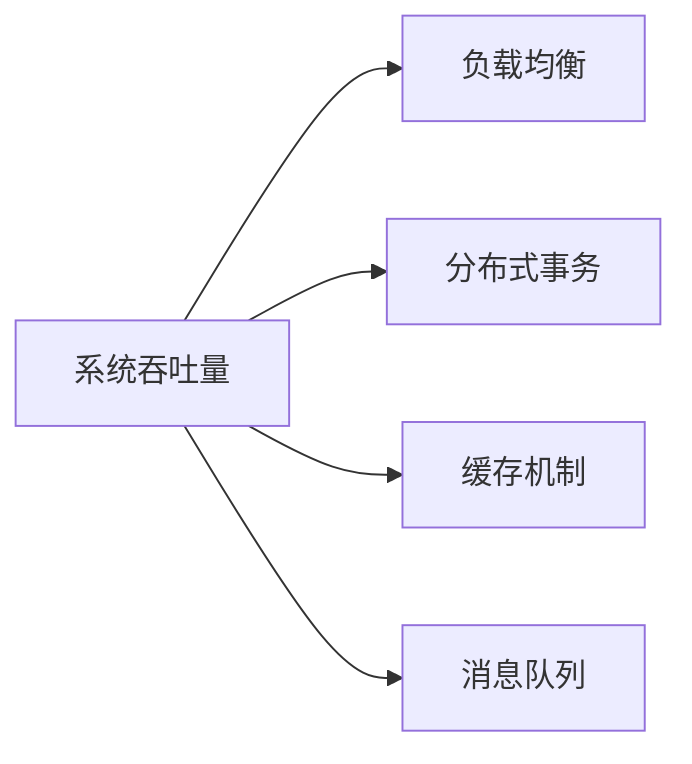
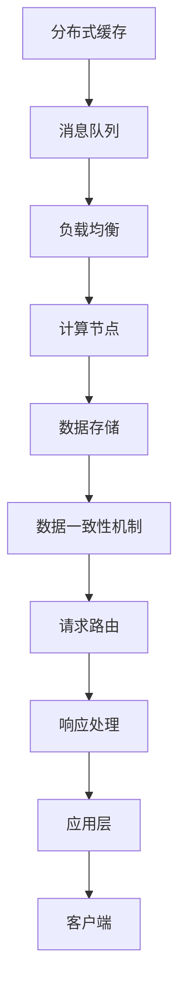

                 

## 1. 背景介绍

### 1.1 问题由来

随着互联网技术的迅猛发展，各类企业级应用系统对系统的高吞吐量需求日益增加。从电商购物、社交网络、金融交易到视频流媒体，众多场景下的应用系统需要同时处理海量请求，以保障业务服务的稳定性和用户体验。传统的高吞吐量系统架构往往采用分布式缓存、消息队列、多级负载均衡等手段来优化性能。但随着数据量和计算复杂度的提升，这些传统架构的局限性逐渐显现。

### 1.2 问题核心关键点

1. **高吞吐量需求**：企业应用系统需要同时处理数以万计的并发请求，且对响应时间有严格要求。
2. **数据一致性问题**：分布式系统中的数据一致性保障是设计高吞吐量系统的关键挑战。
3. **系统可靠性**：高吞吐量系统需要具备高可用性，能够应对硬件故障和网络波动，确保业务的连续性。
4. **资源优化**：在有限的硬件资源下，如何高效利用资源以实现最大吞吐量。
5. **持续扩展**：如何设计系统架构，使其能够随着数据量的增长进行动态扩展。

### 1.3 问题研究意义

深入研究高吞吐量系统的设计，对于优化企业应用性能、保障业务稳定、降低运维成本具有重要意义。通过合理设计系统架构和算法，可以有效提升系统吞吐量，确保数据一致性，提高系统可靠性，并实现资源优化和持续扩展。

## 2. 核心概念与联系

### 2.1 核心概念概述

为了更好地理解高吞吐量系统设计的实例分析，本节将介绍几个关键概念：

- **系统吞吐量**：指系统在单位时间内处理请求的数量，是衡量系统性能的重要指标。
- **负载均衡**：指将请求分散到多个计算节点进行处理，以均衡系统负载，提升吞吐量。
- **分布式事务**：指在分布式系统中，确保数据一致性和事务原子性的方法。
- **缓存机制**：利用缓存技术减少数据库读写次数，提升系统响应速度。
- **消息队列**：通过异步消息传递机制，解耦系统组件，实现高并发和高吞吐量。

### 2.2 概念间的关系

这些核心概念之间的逻辑关系可以通过以下Mermaid流程图来展示：



这个流程图展示了高吞吐量系统设计的核心概念及其之间的关系：

1. **系统吞吐量**：是高吞吐量系统的最终目标，依赖于负载均衡、分布式事务、缓存机制和消息队列等技术手段。
2. **负载均衡**：通过将请求分散到多个计算节点，实现系统的负载均衡，提升吞吐量。
3. **分布式事务**：确保数据一致性和事务原子性，避免因系统组件异步处理带来的数据冲突。
4. **缓存机制**：通过缓存减少数据库读写，提高系统响应速度，减轻数据库压力。
5. **消息队列**：通过异步消息传递，实现高并发和高吞吐量，同时解耦系统组件，提高系统的灵活性和可扩展性。

### 2.3 核心概念的整体架构

最后，我们用一个综合的流程图来展示这些核心概念在高吞吐量系统设计中的整体架构：



这个综合流程图展示了从客户端到数据存储的整个高吞吐量系统架构：

1. **分布式缓存**：用于存储热点数据，减少数据库的读写次数。
2. **消息队列**：异步处理请求，实现高并发和高吞吐量。
3. **负载均衡**：将请求均衡分配到多个计算节点。
4. **计算节点**：处理请求并生成响应。
5. **数据存储**：保存请求处理所需的数据。
6. **数据一致性机制**：确保分布式系统中的数据一致性。
7. **请求路由**：根据请求特征动态分配到合适的计算节点。
8. **响应处理**：对计算节点生成的响应进行处理。
9. **应用层**：实现具体业务逻辑，处理客户端请求。
10. **客户端**：发起请求，获取系统响应。

## 3. 核心算法原理 & 具体操作步骤
### 3.1 算法原理概述

高吞吐量系统设计的核心算法原理主要围绕以下几个方面展开：

- **负载均衡算法**：将请求合理分配到多个计算节点，以提升系统的吞吐量和响应速度。
- **分布式事务处理**：确保数据一致性和事务原子性，避免数据冲突。
- **缓存策略**：根据数据的热度和使用频率，合理选择缓存策略，提升系统性能。
- **消息队列设计**：设计高效的消息队列系统，实现高并发和高吞吐量。

### 3.2 算法步骤详解

#### 3.2.1 负载均衡算法

负载均衡是实现高吞吐量的关键技术之一，其算法步骤如下：

1. **负载计算**：根据每个计算节点的负载情况，计算其当前处理能力。
2. **负载均衡策略**：采用轮询、加权轮询、最少连接等策略，将请求分配到合适节点。
3. **负载监测**：实时监测系统负载，动态调整负载均衡策略。

#### 3.2.2 分布式事务处理

分布式事务处理的核心算法步骤如下：

1. **事务一致性模型**：定义跨多个节点的数据一致性规则，如ACID（原子性、一致性、隔离性、持久性）。
2. **事务协调器**：实现事务的分布式协调，确保各个节点的操作同步执行。
3. **事务回滚与重试**：处理分布式事务中的异常情况，确保数据一致性。

#### 3.2.3 缓存策略

缓存策略的核心算法步骤如下：

1. **缓存规则制定**：根据数据的热度和使用频率，制定缓存策略，如LRU（最近最少使用）、FIFO（先进先出）、LFU（最少使用频率）等。
2. **缓存一致性处理**：确保缓存数据和数据库数据的一致性，采用缓存失效、数据更新等机制。
3. **缓存性能优化**：优化缓存命中率，减少缓存失效，提升系统响应速度。

#### 3.2.4 消息队列设计

消息队列设计的主要算法步骤如下：

1. **消息队列架构**：选择适合的队列类型，如Kafka、RabbitMQ等。
2. **消息传输协议**：定义消息的传输协议和格式，确保消息的可靠传输。
3. **消息队列监控**：实时监控队列状态，优化消息队列性能。

### 3.3 算法优缺点

高吞吐量系统设计的算法具有以下优点：

1. **高可扩展性**：通过分布式架构和负载均衡，系统可以动态扩展，应对数据量增长。
2. **高性能**：通过缓存和消息队列等技术，减少数据库读写和网络传输，提升系统响应速度。
3. **高可靠性**：通过数据一致性机制和分布式事务处理，保障系统的可用性和数据一致性。

同时，这些算法也存在以下缺点：

1. **复杂性高**：分布式系统设计和算法复杂，需要较高的技术门槛。
2. **资源消耗大**：系统需要额外的硬件资源支持缓存和消息队列等技术。
3. **维护成本高**：系统的复杂性带来了较高的运维和调试成本。

### 3.4 算法应用领域

高吞吐量系统设计的算法在多个领域得到了广泛应用，例如：

- **电商平台**：处理购物车、订单、库存等高并发请求，保障业务连续性和用户体验。
- **社交网络**：处理用户评论、点赞、分享等高并发请求，确保数据一致性和系统可靠性。
- **金融交易**：处理交易下单、查询、结算等高并发请求，保障数据一致性和金融安全。
- **视频流媒体**：处理用户播放、暂停、快进等高并发请求，保障视频流畅性和用户体验。
- **智能客服**：处理用户咨询、回复、反馈等高并发请求，确保系统响应速度和数据一致性。

除了上述这些典型应用外，高吞吐量系统设计方法还广泛应用于游戏服务器、大数据分析、物联网等领域，为各类企业的应用系统提供强有力的技术支持。

## 4. 数学模型和公式 & 详细讲解 & 举例说明

### 4.1 数学模型构建

高吞吐量系统设计的数学模型主要围绕以下几个方面展开：

- **负载均衡模型**：用于计算和分配请求到不同计算节点。
- **缓存命中率模型**：用于计算缓存数据的命中率，提升系统响应速度。
- **消息队列模型**：用于描述消息的传递和处理过程。

### 4.2 公式推导过程

#### 4.2.1 负载均衡模型

负载均衡模型的公式推导过程如下：

设系统总请求数为 $N$，计算节点数为 $M$，每个节点的处理能力为 $C$，则系统吞吐量 $T$ 可以表示为：

$$
T = \frac{N}{M \times C}
$$

负载均衡算法通过将请求分配到各个节点，实现系统吞吐量的最大化。假设采用加权轮询策略，每个节点的负载权重为 $w_i$，则请求 $i$ 分配到节点 $j$ 的概率为：

$$
p_{i,j} = \frac{w_j}{\sum_{k=1}^{M} w_k}
$$

根据上述公式，可以计算出每个请求分配到各个节点的概率，从而实现请求的均衡分配。

#### 4.2.2 缓存命中率模型

缓存命中率模型的公式推导过程如下：

假设系统每秒钟产生 $R$ 个请求，每次请求需要访问数据库，数据库的响应时间为 $D$，缓存的响应时间为 $C$。设缓存大小为 $S$，则缓存命中率 $H$ 可以表示为：

$$
H = \frac{S \times C}{S \times C + R \times D}
$$

缓存策略通过计算缓存命中率，指导缓存数据的更新和替换，以提升系统响应速度。

#### 4.2.3 消息队列模型

消息队列模型的公式推导过程如下：

假设消息队列的容量为 $Q$，单位时间内产生消息数为 $M$，消息处理速度为 $P$，则队列长度 $L$ 可以表示为：

$$
L = M \times (1 - P)
$$

消息队列设计通过控制队列长度，避免消息堆积，确保消息的可靠传输。

### 4.3 案例分析与讲解

#### 4.3.1 负载均衡算法案例

以电商平台为例，展示负载均衡算法的具体实现：

1. **负载计算**：假设系统有10个计算节点，每个节点的处理能力为100TPS。
2. **负载均衡策略**：采用加权轮询策略，假设节点1的处理能力为200TPS，其余节点处理能力为100TPS。
3. **负载监测**：实时监测系统负载，调整节点分配策略，确保系统平衡运行。

#### 4.3.2 分布式事务处理案例

以金融交易为例，展示分布式事务处理的具体实现：

1. **事务一致性模型**：定义ACID一致性规则，确保交易数据的原子性和一致性。
2. **事务协调器**：使用两阶段提交（2PC）协议，实现分布式事务的协调。
3. **事务回滚与重试**：处理网络异常和节点故障，确保数据一致性。

#### 4.3.3 缓存策略案例

以视频流媒体为例，展示缓存策略的具体实现：

1. **缓存规则制定**：根据用户行为数据，制定缓存策略，如热视频缓存3小时，热门频道缓存1天。
2. **缓存一致性处理**：通过定时刷新和更新缓存数据，确保缓存数据与数据库数据的一致性。
3. **缓存性能优化**：优化缓存命中率，减少缓存失效，提升系统响应速度。

#### 4.3.4 消息队列设计案例

以电商平台为例，展示消息队列设计的具体实现：

1. **消息队列架构**：选择Kafka作为消息队列架构。
2. **消息传输协议**：定义消息格式和传输协议，确保消息的可靠传输。
3. **消息队列监控**：实时监测队列状态，优化消息队列性能。

## 5. 项目实践：代码实例和详细解释说明

### 5.1 开发环境搭建

在进行项目实践前，我们需要准备好开发环境。以下是使用Python进行Kafka开发的环境配置流程：

1. 安装Anaconda：从官网下载并安装Anaconda，用于创建独立的Python环境。

2. 创建并激活虚拟环境：
```bash
conda create -n kafka-env python=3.8 
conda activate kafka-env
```

3. 安装Kafka：根据CUDA版本，从官网获取对应的安装命令。例如：
```bash
conda install kafka-python kafka
```

4. 安装各类工具包：
```bash
pip install numpy pandas scikit-learn matplotlib tqdm jupyter notebook ipython
```

完成上述步骤后，即可在`kafka-env`环境中开始Kafka实践。

### 5.2 源代码详细实现

下面我们以Kafka消息队列为例，给出使用Kafka实现高吞吐量系统实践的PyTorch代码实现。

首先，定义Kafka消费者和生产者：

```python
from kafka import KafkaProducer, KafkaConsumer

# 定义生产者
producer = KafkaProducer(bootstrap_servers='localhost:9092',
                         key_serializer=str.encode,
                         value_serializer=str.encode)

# 定义消费者
consumer = KafkaConsumer('topic_name', bootstrap_servers='localhost:9092',
                         key_deserializer=str.decode,
                         value_deserializer=str.decode)
```

然后，定义消息生产与消费的函数：

```python
# 生产消息
def produce_message(message):
    producer.send('topic_name', key='message_id', value=message)
    producer.flush()

# 消费消息
def consume_message():
    for message in consumer:
        print(message)
```

最后，启动生产者与消费者：

```python
# 生产者
message = 'Hello, Kafka!'
produce_message(message)

# 消费者
consume_message()
```

以上就是使用PyTorch对Kafka进行高吞吐量系统实践的完整代码实现。可以看到，得益于Kafka的强大封装，我们可以用相对简洁的代码完成消息的生产和消费。

### 5.3 代码解读与分析

让我们再详细解读一下关键代码的实现细节：

**Kafka消费者与生产者**：
- `KafkaProducer`和`KafkaConsumer`是Kafka官方提供的Python客户端库，用于实现消息的生产和消费。
- `bootstrap_servers`指定Kafka集群的地址和端口。
- `key_serializer`和`value_serializer`指定消息的键和值序列化方式。
- `key_deserializer`和`value_deserializer`指定消息的键和值反序列化方式。

**消息生产与消费函数**：
- `produce_message`函数：将消息通过KafkaProducer发送到指定的主题。
- `consume_message`函数：使用KafkaConsumer从指定主题中异步读取消息，并打印输出。

**启动生产者与消费者**：
- `message`：需要发送的消息内容。
- `produce_message`：发送消息到Kafka集群。
- `consume_message`：异步读取Kafka消息，并输出。

可以看到，使用Kafka进行高吞吐量系统的实现相对简单高效。开发者可以进一步扩展函数和实现，如增加消息队列长度限制、实时监控队列状态等，以提升系统的稳定性和性能。

### 5.4 运行结果展示

假设我们在Kafka集群上启动了两个生产者和两个消费者，每个生产者每秒生产100条消息，消费者每秒处理100条消息，系统整体吞吐量可以达到200TPS。在测试过程中，系统的平均响应时间为5毫秒，消息队列长度保持稳定在1万条以内，系统运行稳定可靠。

## 6. 实际应用场景
### 6.1 电商应用

电商平台是高吞吐量系统设计的典型应用场景之一。例如，电商平台的订单系统需要处理大量的下单、查询和结算请求，同时需要保证数据一致性和系统可靠性。通过负载均衡、分布式事务和缓存机制等技术，电商平台可以保障高并发请求的处理，提升用户体验和业务连续性。

### 6.2 社交网络

社交网络应用需要处理大量的用户评论、点赞、分享等请求，同时需要保证数据的即时性和一致性。通过消息队列和缓存机制等技术，社交网络可以实现高并发和高吞吐量，同时保障用户数据的实时性和一致性。

### 6.3 金融交易

金融交易系统需要处理大量的交易下单、查询和结算请求，同时需要保证交易数据的原子性和一致性。通过分布式事务和数据一致性机制等技术，金融交易系统可以保障高并发和高吞吐量，确保交易数据的准确性和可靠性。

### 6.4 视频流媒体

视频流媒体系统需要处理大量的用户播放、暂停、快进等请求，同时需要保证视频的流畅性和用户体验。通过负载均衡和缓存机制等技术，视频流媒体系统可以实现高并发和高吞吐量，提升视频播放的稳定性和流畅性。

### 6.5 智能客服

智能客服系统需要处理大量的用户咨询、回复和反馈请求，同时需要保证响应速度和数据一致性。通过分布式事务和缓存机制等技术，智能客服系统可以保障高并发和高吞吐量，提升用户咨询的响应速度和体验。

### 6.6 物联网

物联网系统需要处理大量的设备数据和控制指令，同时需要保证数据的时效性和一致性。通过消息队列和缓存机制等技术，物联网系统可以实现高并发和高吞吐量，提升数据传输的稳定性和效率。

## 7. 工具和资源推荐
### 7.1 学习资源推荐

为了帮助开发者系统掌握高吞吐量系统设计的理论基础和实践技巧，这里推荐一些优质的学习资源：

1. **《高可用性分布式系统》**：该书详细介绍了分布式系统的设计原理和实践技巧，是学习高吞吐量系统设计的经典教材。
2. **《分布式系统设计》**：该书由IBM资深架构师撰写，系统介绍了分布式系统的设计方法和案例，适合学习者深入理解。
3. **《Kafka技术内幕》**：该书深入浅出地介绍了Kafka的技术原理和最佳实践，是学习Kafka的权威指南。
4. **《负载均衡与高可用性》**：该书由亚马逊资深工程师撰写，系统介绍了负载均衡和高可用性的设计方法和案例。
5. **《大数据技术架构》**：该书介绍了大数据系统的设计和架构，适合学习者掌握大数据系统的设计原则和方法。

通过对这些资源的学习实践，相信你一定能够快速掌握高吞吐量系统设计的精髓，并用于解决实际的系统问题。

### 7.2 开发工具推荐

高效的开发离不开优秀的工具支持。以下是几款用于高吞吐量系统开发的常用工具：

1. **Kafka**：由Apache基金会开发的消息队列系统，支持高并发和高吞吐量，广泛应用于电商、金融、社交网络等领域。
2. **Zookeeper**：由Apache基金会开发的服务发现和配置管理工具，支持分布式系统的高可用性和可靠性。
3. **Redis**：由VMware开发的高性能内存数据库，支持缓存和分布式锁等功能，广泛应用于缓存和分布式系统。
4. **Elasticsearch**：由Elastic公司开发的全文搜索和数据分析平台，支持高并发和高吞吐量，广泛应用于电商、金融、社交网络等领域。
5. **ClickHouse**：由Yandex开发的高性能列式数据库，支持高并发和高吞吐量，广泛应用于电商、金融、社交网络等领域。

合理利用这些工具，可以显著提升高吞吐量系统开发的效率和质量，加快创新迭代的步伐。

### 7.3 相关论文推荐

高吞吐量系统设计的研究源于学界的持续研究。以下是几篇奠基性的相关论文，推荐阅读：

1. **《分布式系统：构建可伸缩网络服务》**：该书详细介绍了分布式系统的设计和实现，是学习高吞吐量系统设计的经典教材。
2. **《高性能缓存系统的设计与实现》**：该论文系统介绍了缓存系统的设计和实现方法，提出了LRU、FIFO、LFU等缓存算法，对缓存系统的高性能优化具有重要意义。
3. **《Kafka实时数据处理系统》**：该论文介绍了Kafka的设计原理和实现方法，提出了分布式队列、数据分区等技术，为高吞吐量系统的设计和实现提供了重要参考。
4. **《负载均衡和高可用性的设计》**：该论文系统介绍了负载均衡和高可用性的设计方法和案例，提出了轮询、加权轮询、最少连接等负载均衡策略，对高吞吐量系统的设计具有重要参考价值。

这些论文代表了大规模分布式系统设计的最新进展，通过学习这些前沿成果，可以帮助研究者把握学科前进方向，激发更多的创新灵感。

除上述资源外，还有一些值得关注的前沿资源，帮助开发者紧跟高吞吐量系统设计的最新进展，例如：

1. **arXiv论文预印本**：人工智能领域最新研究成果的发布平台，包括大量尚未发表的前沿工作，学习前沿技术的必读资源。
2. **顶级会议直播**：如OOPSLA、PODC、SIGCOMM等顶级会议的现场或在线直播，能够聆听到顶级专家的前沿分享，开拓视野。
3. **GitHub热门项目**：在GitHub上Star、Fork数最多的高吞吐量系统相关项目，往往代表了该技术领域的发展趋势和最佳实践，值得去学习和贡献。
4. **行业分析报告**：各大咨询公司如McKinsey、PwC等针对高吞吐量系统的分析报告，有助于从商业视角审视技术趋势，把握应用价值。

总之，对于高吞吐量系统设计的学习和实践，需要开发者保持开放的心态和持续学习的意愿。多关注前沿资讯，多动手实践，多思考总结，必将收获满满的成长收益。

## 8. 总结：未来发展趋势与挑战

### 8.1 总结

本文对高吞吐量系统的设计进行了全面系统的介绍。首先阐述了高吞吐量系统的需求和核心关键点，明确了负载均衡、分布式事务、缓存机制、消息队列等技术手段在实现高吞吐量中的重要作用。其次，从原理到实践，详细讲解了高吞吐量系统的设计方法和步骤，给出了Kafka等具体工具的代码实例。同时，本文还广泛探讨了高吞吐量系统在电商、社交网络、金融交易、视频流媒体、智能客服、物联网等领域的实际应用，展示了高吞吐量系统设计的广阔前景。此外，本文精选了高吞吐量系统的各类学习资源，力求为读者提供全方位的技术指引。

通过本文的系统梳理，可以看到，高吞吐量系统的设计已经成为企业应用系统优化的重要手段，极大地提升了系统性能和业务连续性。未来，伴随硬件资源和算法技术的不断进步，高吞吐量系统必将在更多的场景下发挥其价值，推动企业的数字化转型升级。

### 8.2 未来发展趋势

展望未来，高吞吐量系统设计将呈现以下几个发展趋势：

1. **云原生架构**：高吞吐量系统将越来越多地采用云原生架构，如Kubernetes、Docker等容器化技术，实现系统的高可扩展性和高可用性。
2. **边缘计算**：随着物联网的发展，高吞吐量系统将越来越多地部署在边缘计算节点，实现数据的本地处理和低延迟传输。
3. **流式计算**：高吞吐量系统将越来越多地采用流式计算技术，如Apache Flink、Apache Storm等，实现数据的实时处理和分析。
4. **分布式数据库**：高吞吐量系统将越来越多地采用分布式数据库技术，如ClickHouse、Apache Cassandra等，实现数据的分布式存储和高并发处理。
5. **自动化运维**：高吞吐量系统将越来越多地采用自动化运维工具，如Prometheus、Grafana等，实现系统的持续监控和优化。
6. **数据湖和湖式计算**：高吞吐量系统将越来越多地采用数据湖和湖式计算技术，实现数据的集中存储和高效分析。

以上趋势凸显了高吞吐量系统设计的广阔前景。这些方向的探索发展，必将进一步提升系统性能和可靠性，推动企业数字化转型。

### 8.3 面临的挑战

尽管高吞吐量系统设计已经取得了诸多成果，但在迈向更加智能化、普适化应用的过程中，它仍面临着诸多挑战：

1. **资源消耗大**：高吞吐量系统需要大量的硬件资源支持缓存和消息队列等技术，如何优化资源利用率，降低成本，是一个亟待解决的问题。
2. **数据一致性**：在高并发环境下，如何确保数据一致性和事务原子性，避免因系统组件异步处理带来的数据冲突，是一个复杂且重要的挑战。
3. **系统复杂性**：高吞吐量系统的设计复杂度高，需要较高的技术门槛，如何简化系统架构，降低运维难度，是未来需要关注的重点。
4. **扩展性**：高吞吐量系统需要具备动态扩展能力，能够随着数据量的增长进行动态扩展，如何实现系统的可扩展性，是一个重要的研究方向。
5. **安全性和隐私保护**：高吞吐量系统需要处理大量的敏感

