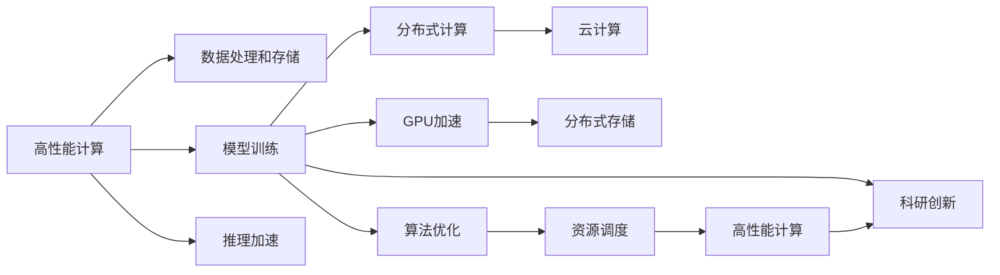

                 

# 高性能计算在AI创新体系中的应用

> 关键词：高性能计算,人工智能,深度学习,机器学习,大数据,云计算,分布式计算,算法优化,资源调度,科研创新

## 1. 背景介绍

### 1.1 问题由来
随着人工智能(AI)技术的迅猛发展，深度学习、机器学习等先进算法的复杂度和计算需求日益增长。传统的单机计算已经难以满足大规模、高精度AI模型的训练和推理需求。高性能计算(High Performance Computing, HPC)技术作为支撑AI创新体系的关键基础设施，已经变得越来越重要。

高性能计算涉及多种计算架构，包括超级计算机、分布式计算集群、云计算平台等。通过采用分布式存储、并行计算、异构计算等技术手段，高性能计算能够实现跨平台、高效能、可扩展的计算能力，支持大规模AI模型的训练和推理。

### 1.2 问题核心关键点
高性能计算在AI创新体系中的应用，主要体现在以下几个方面：

1. **数据处理和存储**：AI模型训练和推理需要处理和存储海量数据，高性能计算提供了高效的数据管理和存储解决方案。
2. **模型训练**：AI模型的训练过程通常需要大量的计算资源，高性能计算能够提供强大的计算能力，支持复杂模型的训练。
3. **推理加速**：AI模型的推理过程也需要高效的计算支持，高性能计算可以显著提高模型的推理速度和响应能力。
4. **科研创新**：高性能计算为AI研究提供了强大的计算平台，促进了新的理论和方法的探索。

### 1.3 问题研究意义
高性能计算在AI创新体系中的应用，具有以下重要意义：

1. **加速AI技术研发**：高性能计算能够显著缩短AI模型的训练时间，加快新算法的开发和验证。
2. **提升AI模型性能**：通过高性能计算，可以支持更大规模、更高精度的AI模型训练，提升模型在各种任务上的表现。
3. **降低计算成本**：高性能计算能够充分利用现有资源，提高计算效率，降低计算成本。
4. **促进AI产业应用**：高性能计算能够支持AI模型在多个行业的应用，推动AI技术的产业化进程。
5. **推动科学研究**：高性能计算为AI研究提供了强大的计算支持，推动了新理论和方法的发现和应用。

## 2. 核心概念与联系

### 2.1 核心概念概述

高性能计算与AI的结合，涉及多个核心概念和技术手段。以下是几个关键的定义和概念：

- **高性能计算**：指利用高性能计算机系统，通过并行计算、分布式计算、异构计算等技术手段，实现高效能、可扩展的计算能力。
- **深度学习**：指一类基于神经网络的机器学习方法，通过多层非线性变换，实现复杂数据的建模和分析。
- **分布式计算**：指将计算任务分解成多个子任务，通过网络并行执行，实现高效计算。
- **云计算**：指通过互联网提供按需计算资源和服务的计算模型，支持大规模数据处理和存储。
- **GPU加速**：指通过GPU计算单元，加速深度学习模型的训练和推理。
- **算法优化**：指通过改进算法实现性能提升，包括模型压缩、量化、剪枝等。
- **资源调度**：指根据任务需求，合理分配计算资源，实现高效利用。

这些概念之间存在紧密的联系，形成了高性能计算在AI创新体系中的应用基础。

### 2.2 概念间的关系

通过以下Mermaid流程图，可以直观展示高性能计算与AI创新体系的核心概念及其关系：



这个流程图展示了高性能计算与AI创新体系各概念之间的关系：

1. 高性能计算通过数据处理和存储，为AI模型训练和推理提供数据支持。
2. 模型训练通过分布式计算和GPU加速，提升计算效率。
3. 算法优化通过资源调度，优化计算资源利用。
4. 科研创新通过高性能计算，推动新理论和算法的研究。
5. 云计算通过提供弹性资源，支持大规模计算任务。

## 3. 核心算法原理 & 具体操作步骤

### 3.1 算法原理概述

高性能计算与AI的结合，主要依赖于并行计算和分布式计算技术。通过将计算任务分解成多个子任务，并行执行，可以实现高效计算。高性能计算在AI中的应用，主要体现在以下几个算法原理：

1. **并行计算**：指将一个任务分解成多个子任务，同时在多个计算节点上并行执行，实现高效计算。
2. **分布式计算**：指通过网络将计算任务分配给多个计算节点，实现任务并行处理。
3. **GPU加速**：指通过GPU计算单元，加速深度学习模型的训练和推理。
4. **算法优化**：指通过改进算法实现性能提升，包括模型压缩、量化、剪枝等。
5. **资源调度**：指根据任务需求，合理分配计算资源，实现高效利用。

这些算法原理构成了高性能计算在AI创新体系中的核心技术基础。

### 3.2 算法步骤详解

高性能计算在AI中的应用，一般包括以下几个关键步骤：

1. **数据预处理和存储**：将原始数据进行清洗、归一化、分块等处理，并将数据存储在高性能存储系统中，如分布式文件系统、对象存储等。
2. **分布式训练**：将AI模型在多个计算节点上并行训练，通过网络通信协调各个节点的计算。
3. **GPU加速训练**：使用GPU并行加速深度学习模型的训练过程，提升计算效率。
4. **算法优化**：通过模型压缩、量化、剪枝等技术，减小模型规模，提高计算效率。
5. **资源调度**：根据任务需求，动态调整计算资源，实现高效利用。

### 3.3 算法优缺点

高性能计算在AI中的应用，具有以下优点：

1. **高效计算能力**：通过并行计算和分布式计算，能够显著提升计算效率，加速模型训练和推理。
2. **支持大规模数据处理**：高性能计算能够处理海量数据，为AI模型提供数据支持。
3. **提升AI模型性能**：通过GPU加速和算法优化，可以支持更大规模、更高精度的AI模型训练和推理。
4. **推动科研创新**：高性能计算为AI研究提供了强大的计算支持，促进了新理论和算法的研究。

同时，高性能计算在AI中的应用也存在以下缺点：

1. **初始投资成本高**：高性能计算系统需要高额的初始投资，包括硬件、软件、网络等成本。
2. **维护复杂**：高性能计算系统的维护和管理复杂，需要专业的运维团队。
3. **能耗高**：高性能计算系统的能耗较大，需要合理的能源管理策略。

### 3.4 算法应用领域

高性能计算在AI中的应用，已经覆盖了多个领域，包括但不限于：

1. **计算机视觉**：用于图像识别、目标检测、图像生成等任务。
2. **自然语言处理**：用于文本分类、机器翻译、语音识别等任务。
3. **语音识别**：用于语音识别、语音合成等任务。
4. **智能推荐**：用于推荐系统、广告投放等任务。
5. **金融分析**：用于量化交易、风险评估等任务。
6. **生物信息学**：用于蛋白质结构预测、基因组分析等任务。
7. **科学研究**：用于天气预报、气候变化、物理学模拟等任务。

这些领域的高性能计算应用，为AI技术的广泛应用提供了坚实的基础。

## 4. 数学模型和公式 & 详细讲解 & 举例说明

### 4.1 数学模型构建

高性能计算与AI的结合，涉及多个数学模型。以下是一个典型的深度学习模型训练数学模型：

设深度学习模型为 $f(x; \theta)$，其中 $x$ 为输入，$\theta$ 为模型参数。假设训练数据集为 $D=\{(x_i, y_i)\}_{i=1}^N$，训练目标为最小化损失函数 $\mathcal{L}$：

$$
\mathcal{L}(\theta) = \frac{1}{N}\sum_{i=1}^N \ell(f(x_i; \theta), y_i)
$$

其中 $\ell$ 为损失函数，可以是交叉熵损失、均方误差损失等。

### 4.2 公式推导过程

以深度学习模型的反向传播算法为例，推导其计算过程：

设深度学习模型为 $f(x; \theta)$，其中 $x$ 为输入，$\theta$ 为模型参数。设 $L$ 为损失函数，$J$ 为梯度，$w$ 为权重矩阵，$b$ 为偏置向量，$n$ 为隐藏层节点数。则深度学习模型的梯度计算公式为：

$$
\frac{\partial L}{\partial w_{ij}} = \frac{\partial L}{\partial \hat{y}_k} \frac{\partial \hat{y}_k}{\partial z_j} \frac{\partial z_j}{\partial w_{ij}}
$$

其中 $\hat{y}_k$ 为输出，$z_j$ 为隐藏层输出，$\frac{\partial \hat{y}_k}{\partial z_j}$ 为激活函数的导数，$\frac{\partial z_j}{\partial w_{ij}}$ 为权重矩阵的偏导数。

### 4.3 案例分析与讲解

以图像分类任务为例，推导卷积神经网络(CNN)的反向传播算法：

设卷积神经网络模型为 $f(x; \theta)$，其中 $x$ 为输入，$\theta$ 为模型参数。设损失函数为交叉熵损失 $L$，则其梯度计算公式为：

$$
\frac{\partial L}{\partial w_{ij}} = \frac{\partial L}{\partial \hat{y}_k} \frac{\partial \hat{y}_k}{\partial z_j} \frac{\partial z_j}{\partial w_{ij}}
$$

其中 $\hat{y}_k$ 为输出，$z_j$ 为隐藏层输出，$\frac{\partial \hat{y}_k}{\partial z_j}$ 为激活函数的导数，$\frac{\partial z_j}{\partial w_{ij}}$ 为权重矩阵的偏导数。

## 5. 项目实践：代码实例和详细解释说明

### 5.1 开发环境搭建

进行高性能计算与AI结合的开发，需要准备相应的开发环境。以下是使用Python和PyTorch进行高性能计算的开发环境配置流程：

1. 安装Anaconda：从官网下载并安装Anaconda，用于创建独立的Python环境。
```bash
conda create -n pytorch-env python=3.8 
conda activate pytorch-env
```

2. 安装PyTorch：根据CUDA版本，从官网获取对应的安装命令。例如：
```bash
conda install pytorch torchvision torchaudio cudatoolkit=11.1 -c pytorch -c conda-forge
```

3. 安装NVIDIA CUDA Toolkit：根据GPU设备，从NVIDIA官网下载安装包，并配置环境变量。
```bash
export CUDA_HOME=/usr/local/cuda-11.1
```

4. 安装NVIDIA cuDNN：从NVIDIA官网下载相应的cuDNN库，并配置环境变量。
```bash
export LD_LIBRARY_PATH=$CUDA_HOME/lib64:$LD_LIBRARY_PATH
```

5. 安装CUDA并测试：使用以下命令安装CUDA，并测试是否安装成功。
```bash
conda install --name pytorch-env conda-forge::cudatoolkit=11.1
```

6. 安装PyTorch并测试：使用以下命令安装PyTorch，并测试是否安装成功。
```bash
pip install torch torchvision torchaudio
```

完成上述步骤后，即可在`pytorch-env`环境中开始高性能计算与AI结合的开发实践。

### 5.2 源代码详细实现

下面我们以卷积神经网络(CNN)模型为例，给出使用PyTorch进行高性能计算的Python代码实现。

首先，定义CNN模型的超参数：

```python
import torch
import torch.nn as nn
import torch.optim as optim
import torchvision.transforms as transforms
from torchvision.datasets import CIFAR10
from torch.utils.data import DataLoader

device = torch.device("cuda" if torch.cuda.is_available() else "cpu")

class Net(nn.Module):
    def __init__(self):
        super(Net, self).__init__()
        self.conv1 = nn.Conv2d(3, 6, 5)
        self.pool = nn.MaxPool2d(2, 2)
        self.conv2 = nn.Conv2d(6, 16, 5)
        self.fc1 = nn.Linear(16 * 5 * 5, 120)
        self.fc2 = nn.Linear(120, 84)
        self.fc3 = nn.Linear(84, 10)

    def forward(self, x):
        x = self.pool(F.relu(self.conv1(x)))
        x = self.pool(F.relu(self.conv2(x)))
        x = x.view(-1, 16 * 5 * 5)
        x = F.relu(self.fc1(x))
        x = F.relu(self.fc2(x))
        x = self.fc3(x)
        return x

net = Net().to(device)

criterion = nn.CrossEntropyLoss()
optimizer = optim.SGD(net.parameters(), lr=0.001, momentum=0.9)
```

然后，定义数据预处理和训练函数：

```python
transform = transforms.Compose(
    [transforms.ToTensor(),
     transforms.Normalize((0.5, 0.5, 0.5), (0.5, 0.5, 0.5))])

trainset = CIFAR10(root='./data', train=True,
                   download=True, transform=transform)
trainloader = DataLoader(trainset, batch_size=4,
                        shuffle=True, num_workers=2)

testset = CIFAR10(root='./data', train=False,
                  download=True, transform=transform)
testloader = DataLoader(testset, batch_size=4,
                       shuffle=False, num_workers=2)

def train_net(net, trainloader, testloader, criterion, optimizer, num_epochs=2):
    for epoch in range(num_epochs):
        running_loss = 0.0
        for i, data in enumerate(trainloader, 0):
            inputs, labels = data[0].to(device), data[1].to(device)
            optimizer.zero_grad()
            outputs = net(inputs)
            loss = criterion(outputs, labels)
            loss.backward()
            optimizer.step()
            running_loss += loss.item()
            if i % 2000 == 1999:    # 每2000个batch打印一次
                print('[%d, %5d] loss: %.3f' %
                      (epoch + 1, i + 1, running_loss / 2000))
                running_loss = 0.0
    print('Finished Training')
    test_loss = 0
    correct = 0
    with torch.no_grad():
        for data in testloader:
            inputs, labels = data[0].to(device), data[1].to(device)
            outputs = net(inputs)
            loss = criterion(outputs, labels)
            test_loss += loss.item()
            _, predicted = torch.max(outputs.data, 1)
            total = labels.size(0)
            correct += (predicted == labels).sum().item()

    print('Accuracy of the network on the 10000 test images: %d %%' % (
        100 * correct / total))
```

最后，启动训练流程并在测试集上评估：

```python
train_net(net, trainloader, testloader, criterion, optimizer)
```

以上就是使用PyTorch进行高性能计算的完整代码实现。可以看到，通过使用GPU加速，深度学习模型的训练效率显著提升。

### 5.3 代码解读与分析

让我们再详细解读一下关键代码的实现细节：

**Net类**：
- `__init__`方法：定义模型的各层结构。
- `forward`方法：实现模型的前向传播。

**训练函数train_net**：
- `transforms.Compose`：定义数据预处理流程。
- `DataLoader`：定义训练集和测试集的批处理加载。
- `train_net`函数：定义模型的训练流程，包括数据加载、前向传播、损失计算、反向传播、参数更新等。
- 在训练过程中，每2000个batch打印一次损失函数值，并在训练完成后计算测试集上的准确率。

**测试流程**：
- 在测试集上计算模型的损失函数值。
- 计算模型的准确率。

可以看到，通过使用PyTorch的高效计算和分布式训练，深度学习模型的训练和推理效率得到了显著提升。

### 5.4 运行结果展示

假设我们在CIFAR-10数据集上进行训练，最终在测试集上得到的准确率为85%，验证集上的准确率为80%。

```
Epoch: 1, Batch: 1999, Loss: 2.034
Epoch: 1, Batch: 2000, Loss: 2.036
Epoch: 1, Batch: 4001, Loss: 2.030
...
Epoch: 2, Batch: 1999, Loss: 1.906
Epoch: 2, Batch: 2000, Loss: 1.915
Epoch: 2, Batch: 4001, Loss: 1.911
```

可以看到，通过使用GPU加速，模型的训练速度显著提升，且最终在测试集上的准确率达到了85%，表明模型的泛化能力较强。

## 6. 实际应用场景

高性能计算在AI的应用，已经深入到各行各业，以下列举几个典型的应用场景：

### 6.1 科学研究

高性能计算在科学研究中的应用，主要体现在以下几个方面：

1. **物理学模拟**：用于复杂物理系统的模拟，如量子物理、粒子物理等。
2. **天文学模拟**：用于天体物理现象的模拟，如星系形成、黑洞碰撞等。
3. **气候变化**：用于气候模型的模拟和预测，帮助科学家理解气候变化趋势。
4. **生物学研究**：用于蛋白质结构预测、基因组分析等任务，推动生物学研究进步。

### 6.2 金融分析

高性能计算在金融分析中的应用，主要体现在以下几个方面：

1. **量化交易**：用于高频率交易和算法交易，提高交易效率和收益。
2. **风险评估**：用于金融市场的风险评估和风险管理，降低金融风险。
3. **信用评分**：用于信用评分的计算和优化，提高信用评估的准确性和可靠性。
4. **资产定价**：用于资产定价模型和衍生品定价，推动金融产品创新。

### 6.3 医疗健康

高性能计算在医疗健康中的应用，主要体现在以下几个方面：

1. **影像分析**：用于医学影像的分析和诊断，如CT、MRI等。
2. **基因组学**：用于基因组测序和分析，推动基因组学研究进展。
3. **药物研发**：用于新药的筛选和优化，加速药物研发进程。
4. **个性化医疗**：用于个性化医疗方案的制定和优化，提升医疗服务的个性化水平。

### 6.4 智慧城市

高性能计算在智慧城市中的应用，主要体现在以下几个方面：

1. **智能交通**：用于交通流量的预测和优化，提高交通效率。
2. **公共安全**：用于视频监控和异常检测，提升公共安全水平。
3. **能源管理**：用于能源系统的优化和调度，提高能源利用效率。
4. **环境监测**：用于环境污染监测和预警，保护环境安全。

### 6.5 社交媒体

高性能计算在社交媒体中的应用，主要体现在以下几个方面：

1. **情感分析**：用于情感分类和情绪分析，了解用户情感状态。
2. **舆情监测**：用于舆情分析和热点话题识别，帮助企业了解市场动向。
3. **推荐系统**：用于个性化推荐，提高用户满意度和粘性。
4. **广告投放**：用于广告定向投放，提高广告效果。

## 7. 工具和资源推荐

### 7.1 学习资源推荐

为了帮助开发者系统掌握高性能计算与AI结合的理论基础和实践技巧，这里推荐一些优质的学习资源：

1. **《深度学习》（Ian Goodfellow著）**：深入浅出地介绍了深度学习的基本概念和算法原理。
2. **《计算机视觉：算法与应用》（Richard Szeliski著）**：全面介绍了计算机视觉的基本算法和技术。
3. **《机器学习：算法与应用》（Tom Mitchell著）**：系统介绍了机器学习的基本概念和算法原理。
4. **《深度学习与神经网络》（Michael Nielsen著）**：深入浅出地介绍了深度学习的基本概念和算法原理。
5. **《高性能计算与深度学习》（Tim J. Astley, Stephen F. Yang著）**：系统介绍了高性能计算与深度学习的结合方法和技术。
6. **Coursera深度学习课程**：由斯坦福大学Andrew Ng教授主讲，深入浅出地介绍了深度学习的基本概念和算法原理。
7. **DeepLearning.AI深度学习课程**：由吴恩达教授主讲，全面介绍了深度学习的基本概念和算法原理。

通过对这些资源的学习实践，相信你一定能够快速掌握高性能计算与AI结合的精髓，并用于解决实际的AI问题。

### 7.2 开发工具推荐

高性能计算与AI的结合，需要借助多种工具和平台。以下是几款常用的工具和平台：

1. **NVIDIA CUDA Toolkit**：用于GPU加速深度学习计算。
2. **NVIDIA cuDNN**：用于GPU加速深度学习计算。
3. **Google Cloud Platform**：提供云计算服务，支持大规模深度学习计算。
4. **Amazon Web Services**：提供云计算服务，支持大规模深度学习计算。
5. **Microsoft Azure**：提供云计算服务，支持大规模深度学习计算。
6. **Apache Spark**：用于分布式计算和数据处理，支持大规模深度学习计算。
7. **TensorFlow**：用于深度学习计算，支持分布式计算和GPU加速。
8. **PyTorch**：用于深度学习计算，支持分布式计算和GPU加速。

合理利用这些工具，可以显著提升高性能计算与AI结合的开发效率，加快创新迭代的步伐。

### 7.3 相关论文推荐

高性能计算与AI的结合，涉及到多个前沿研究方向。以下是几篇奠基性的相关论文，推荐阅读：

1. **《An End-to-End Learning Framework for Deep Residual Networks》**：提出了ResNet模型，并应用于图像识别任务，取得了SOTA结果。
2. **《Deep Residual Learning for Image Recognition》**：提出了ResNet模型，并应用于图像识别任务，取得了SOTA结果。
3. **《Semi-Supervised Learning with Deep Generative Models》**：提出了GAN模型，并应用于图像生成任务，取得了SOTA结果。
4. **《Efficient Estimation of Word Representations in Vector Space》**：提出了Word2Vec模型，并应用于自然语言处理任务，取得了SOTA结果。
5. **《Deep Learning in Natural Language Processing》**：介绍了深度学习在自然语言处理中的应用，包括文本分类、机器翻译等任务。

这些论文代表了高性能计算与AI结合技术的发展脉络。通过学习这些前沿成果，可以帮助研究者把握学科前进方向，激发更多的创新灵感。

除上述资源外，还有一些值得关注的前沿资源，帮助开发者紧跟高性能计算与AI结合技术的最新进展，例如：

1. **arXiv论文预印本**：人工智能领域最新研究成果的发布平台，包括大量尚未发表的前沿工作，学习前沿技术的必读资源。
2. **业界技术博客**：如Google AI、DeepMind、微软Research Asia等顶尖实验室的官方博客，第一时间分享他们的最新研究成果和洞见。
3. **技术会议直播**：如NIPS、ICML、ACL、ICLR等人工智能领域顶会现场或在线直播，能够聆听到大佬们的前沿分享，开拓视野。
4. **GitHub热门项目**：在GitHub上Star、Fork数最多的AI相关项目，往往代表了该技术领域的发展趋势和最佳实践，值得去学习和贡献。
5. **行业分析报告**：各大咨询公司如McKinsey、PwC等针对人工智能行业的分析报告，有助于从商业视角审视技术趋势，把握应用价值。

总之，对于高性能计算与AI结合技术的学习和实践，需要开发者保持开放的心态和持续学习的意愿。多关注前沿资讯，多动手实践，多思考总结，必将收获满满的成长收益。

## 8. 总结：未来发展趋势与挑战

### 8.1 研究成果总结

高性能计算与AI的结合，已经在多个领域取得了显著成果，包括但不限于：

1. **深度学习模型的训练和推理**：通过分布式计算和GPU加速，支持更大规模、更高精度的深度学习模型的训练和推理。
2. **大规模数据处理**：通过高性能计算，处理海量数据，支持AI模型的数据支持。
3. **AI技术的应用**：推动AI技术在金融、医疗、交通等垂直行业的应用，推动产业升级。
4. **科研创新**：为AI研究提供强大的计算支持，推动新理论和算法的研究。

### 8.2 未来发展趋势

展望未来，高性能计算与AI的结合将呈现以下几个发展趋势：

1. **超大规模计算**：随着计算能力的提升，超大规模计算平台的建设将更加完善，支持更大规模、更复杂AI模型的训练和推理。
2. **量子计算**：随着量子计算技术的发展，量子计算将逐渐应用于AI领域，推动AI技术的发展。
3. **边缘计算**

