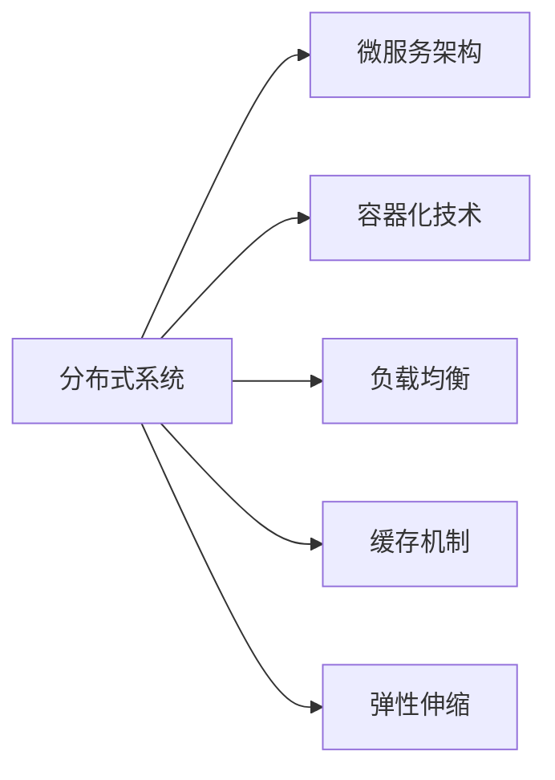
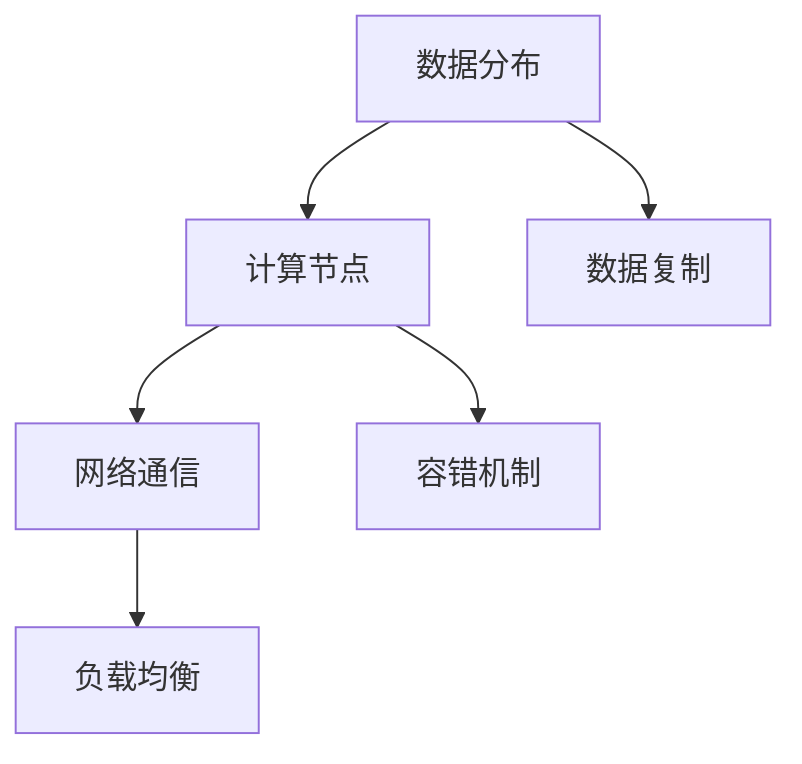
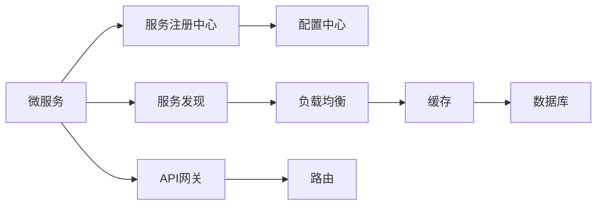
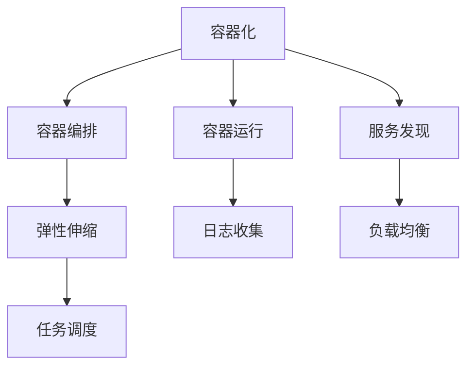
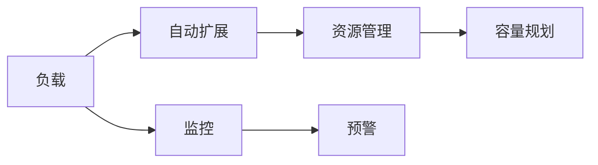
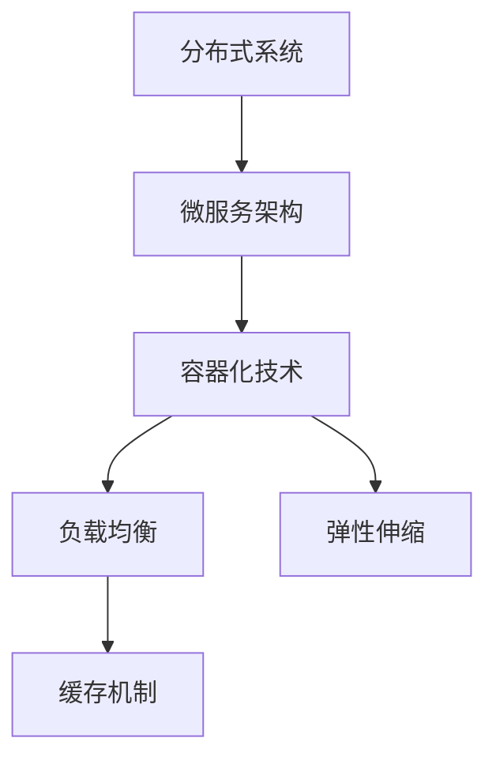

                 

## 1. 背景介绍

### 1.1 问题由来
随着互联网和信息技术的飞速发展，企业的IT系统变得越来越复杂，并面临着各种各样的挑战。如何构建一个高性能、高可用、高扩展性的系统，以应对未来不断增长的业务需求和不断变化的市场环境，是摆在每个IT团队面前的重要问题。高扩展性系统设计不仅需要考虑技术的复杂性和实现的难度，还需要考虑业务的连续性和可用性。本文将通过一个实际案例，探讨高扩展性系统设计的关键要素和实际应用。

### 1.2 问题核心关键点
高扩展性系统设计的一个核心关键点是如何在快速变化的市场环境中，保障系统的高性能和高效扩展。以下是我们认为在实践中需要关注的核心关键点：

- 系统架构的可扩展性：确保系统能够通过简单的架构调整，快速适应业务规模的增长和需求的变化。
- 性能的可控性：通过合理的性能调优策略，确保系统在不同负载下始终保持高效运行。
- 可维护性：通过模块化的设计和良好的编码规范，使得系统的维护成本低，且易于扩展。
- 可监控性：通过全面的监控系统，及时发现性能瓶颈和潜在的故障点。
- 容灾和备份：通过设计合理的数据备份和恢复策略，保障系统的业务连续性。

### 1.3 问题研究意义
构建高扩展性系统具有重要意义：

1. **降低成本**：系统能够根据实际需求进行灵活扩展，避免了不必要的硬件和软件投资。
2. **提高业务响应速度**：高扩展性系统能够快速适应市场变化，响应客户需求，提升客户满意度。
3. **提升业务连续性**：通过合理的容灾和备份策略，保障系统的稳定运行，避免业务中断带来的损失。
4. **促进业务创新**：系统的高扩展性和灵活性，为新的业务场景和功能的快速上线提供了保障。
5. **增强系统安全**：通过全面的监控和日志记录，及时发现和解决问题，提升系统安全性和可靠性。

## 2. 核心概念与联系

### 2.1 核心概念概述

为更好地理解高扩展性系统设计的核心概念，本节将介绍几个密切相关的核心概念：

- **分布式系统**：由多个独立的计算节点组成，通过网络相互连接，共同提供服务。分布式系统能够通过水平扩展来应对高并发和海量数据的需求。
- **微服务架构**：将大系统拆分为多个小的、独立的服务单元，每个服务单元负责独立的功能模块，并通过轻量级的通信协议实现相互调用。微服务架构能够提高系统的灵活性和扩展性。
- **容器化技术**：通过Docker、Kubernetes等容器化技术，实现应用的快速部署、扩展和运维。容器化技术能够提升系统的部署效率和可扩展性。
- **负载均衡**：通过负载均衡器，将请求分散到多个计算节点上，实现系统的水平扩展和高可用。
- **缓存机制**：通过缓存机制，将频繁访问的数据存储在内存中，减少数据库的访问次数，提升系统的响应速度。
- **弹性伸缩**：根据系统的实时负载动态调整计算资源，确保系统能够高效应对流量波动。

这些核心概念之间的逻辑关系可以通过以下Mermaid流程图来展示：



这个流程图展示了大规模高扩展性系统的核心概念及其之间的关系：

1. 分布式系统是构建高扩展性系统的基础架构。
2. 微服务架构进一步提升了系统的灵活性和扩展性。
3. 容器化技术使得系统部署和扩展更加高效。
4. 负载均衡和缓存机制优化了系统的性能和响应速度。
5. 弹性伸缩保障了系统的稳定性和业务连续性。

### 2.2 概念间的关系

这些核心概念之间存在着紧密的联系，形成了高扩展性系统的完整生态系统。下面我们通过几个Mermaid流程图来展示这些概念之间的关系。

#### 2.2.1 分布式系统的关键要素



这个流程图展示了分布式系统的关键要素：数据分布、计算节点、网络通信、数据复制和容错机制。

#### 2.2.2 微服务架构的实现方式



这个流程图展示了微服务架构的实现方式：服务注册中心、服务发现、API网关、配置中心、负载均衡、路由和缓存。

#### 2.2.3 容器化技术的应用场景



这个流程图展示了容器化技术的应用场景：容器编排、容器运行、服务发现、弹性伸缩、日志收集、负载均衡和任务调度。

#### 2.2.4 弹性伸缩的实现策略



这个流程图展示了弹性伸缩的实现策略：负载、自动扩展、监控、预警、资源管理和容量规划。

### 2.3 核心概念的整体架构

最后，我们用一个综合的流程图来展示这些核心概念在高扩展性系统设计中的整体架构：



这个综合流程图展示了从分布式系统到微服务架构，再到容器化技术、负载均衡、缓存机制和弹性伸缩的整体架构。通过这些核心概念的协同作用，构建的高扩展性系统能够适应各种复杂的应用场景，提供稳定的业务保障。

## 3. 核心算法原理 & 具体操作步骤
### 3.1 算法原理概述

高扩展性系统设计的核心算法原理是通过分布式系统、微服务架构、容器化技术、负载均衡、缓存机制和弹性伸缩等手段，构建一个能够高效扩展、灵活调整、稳定运行的系统架构。

- 分布式系统通过水平扩展来提升系统的处理能力和稳定性。
- 微服务架构通过模块化设计提升系统的灵活性和可维护性。
- 容器化技术通过封装和隔离提升系统的部署效率和扩展性。
- 负载均衡通过均衡分布请求，减少单点故障的风险。
- 缓存机制通过减少数据库访问次数，提升系统的响应速度。
- 弹性伸缩通过动态调整计算资源，应对流量波动和业务变化。

这些技术手段通过合理的组合和应用，能够构建一个高效、稳定、灵活的高扩展性系统。

### 3.2 算法步骤详解

以下是高扩展性系统设计的主要步骤：

1. **需求分析**：明确系统的业务需求和性能指标，如并发量、响应时间、存储容量等。
2. **系统设计**：根据需求，设计系统的总体架构和技术选型，包括分布式系统、微服务架构、容器化技术等。
3. **性能优化**：通过负载均衡、缓存机制、弹性伸缩等手段，优化系统的性能和可扩展性。
4. **监控与维护**：通过全面的监控系统，及时发现和解决问题，确保系统的稳定运行。
5. **容灾与备份**：设计合理的数据备份和恢复策略，保障系统的业务连续性。

### 3.3 算法优缺点

高扩展性系统设计具有以下优点：

- 高效扩展：通过水平扩展和负载均衡，系统能够快速应对高并发和海量数据的需求。
- 灵活性高：通过微服务架构和容器化技术，系统能够灵活应对业务变化和需求调整。
- 稳定性高：通过容灾和备份策略，系统能够在故障发生时快速恢复业务。

同时，该方法也存在以下缺点：

- 初期投入大：构建高扩展性系统需要较大的初始投资，包括硬件、软件和人力成本。
- 复杂度高：系统架构和技术选型复杂，需要专业的团队进行设计和实施。
- 维护难度高：系统的复杂性和模块化设计，增加了维护的难度和成本。

### 3.4 算法应用领域

高扩展性系统设计在多个领域得到了广泛的应用，例如：

- **金融服务**：金融行业需要处理大量高并发交易和实时数据分析，高扩展性系统能够保障业务的稳定运行。
- **电子商务**：电商平台需要处理海量订单和用户访问，高扩展性系统能够提供高效稳定的服务。
- **社交网络**：社交平台需要处理用户上传的大量数据和实时通信，高扩展性系统能够支持大用户量和高并发。
- **物联网**：物联网设备数量庞大，数据量和交互频繁，高扩展性系统能够提供可靠的数据处理和通信服务。

## 4. 数学模型和公式 & 详细讲解  
### 4.1 数学模型构建

在高扩展性系统设计中，我们通常需要构建数学模型来分析系统的性能和扩展性。以下是一个简单的数学模型：

假设系统的平均负载为 $\lambda$，系统容量为 $C$，服务响应时间为 $T$，则系统响应时间 $T$ 可以表示为：

$$ T = \frac{1}{\lambda} + \frac{C}{\lambda} \cdot (\frac{1}{C} - \frac{1}{\lambda + C}) $$

其中 $\frac{1}{\lambda} + \frac{C}{\lambda} \cdot (\frac{1}{C} - \frac{1}{\lambda + C})$ 表示系统在负载 $\lambda$ 和容量 $C$ 下的服务响应时间。

### 4.2 公式推导过程

接下来，我们对上述公式进行推导：

1. 首先，系统响应时间 $T$ 可以表示为服务处理时间和等待时间的总和：

$$ T = \frac{C}{\lambda} \cdot \frac{1}{C} + \frac{C}{\lambda} \cdot \frac{1}{C} \cdot \frac{\lambda}{\lambda + C} $$

2. 将上述公式展开，得到：

$$ T = \frac{1}{\lambda} + \frac{C}{\lambda} \cdot (\frac{1}{C} - \frac{1}{\lambda + C}) $$

3. 推导过程中，我们利用了以下公式：

$$ \frac{C}{\lambda} \cdot \frac{1}{C} = \frac{1}{\lambda} $$

$$ \frac{C}{\lambda} \cdot \frac{1}{C} \cdot \frac{\lambda}{\lambda + C} = \frac{1}{\lambda + C} - \frac{1}{\lambda} $$

通过上述推导，我们可以清晰地看到系统的响应时间和负载、容量之间的关系。

### 4.3 案例分析与讲解

假设我们的系统容量为 $C=10$，平均负载 $\lambda=1$，则系统的响应时间 $T$ 为：

$$ T = \frac{1}{1} + \frac{10}{1} \cdot (\frac{1}{10} - \frac{1}{1+10}) $$

$$ T = 1 + 10 \cdot (0.1 - 0.09) $$

$$ T = 1 + 0.01 $$

$$ T = 1.01 $$

因此，当系统容量为10，平均负载为1时，系统的响应时间为1.01秒。

通过这个简单的案例分析，我们可以看到系统的响应时间和负载、容量之间的基本关系。在实际应用中，我们需要根据具体的业务需求和系统架构，进一步优化和调整系统的容量和负载，以达到最佳的性能和扩展性。

## 5. 项目实践：代码实例和详细解释说明
### 5.1 开发环境搭建

在进行高扩展性系统设计实践前，我们需要准备好开发环境。以下是使用Python进行Docker容器化和Kubernetes集群搭建的环境配置流程：

1. 安装Docker：从官网下载并安装Docker，用于创建和管理容器。

2. 安装Kubernetes：根据操作系统，从官网下载并安装Kubernetes，用于容器编排和调度。

3. 安装kubectl：从官网下载并安装kubectl，用于与Kubernetes集群进行交互。

4. 安装Helm：从官网下载并安装Helm，用于部署和管理Kubernetes应用。

完成上述步骤后，即可在Kubernetes集群上启动高扩展性系统设计实践。

### 5.2 源代码详细实现

下面我们以一个高扩展性系统设计案例为例，给出使用Docker和Kubernetes的Python代码实现。

首先，创建一个Dockerfile文件：

```Dockerfile
FROM python:3.8
WORKDIR /app
COPY . /app
RUN pip install -r requirements.txt
```

然后，使用Docker build命令构建Docker镜像：

```bash
docker build -t myapp:latest .
```

接着，使用Kubernetes的Helm工具部署应用：

1. 创建一个Helm Chart：

```bash
helm create myapp
```

2. 将Docker镜像部署到Kubernetes集群：

```bash
helm install myapp myapp-1.0.0
```

3. 查看应用状态：

```bash
kubectl get pods
```

至此，一个基于Docker和Kubernetes的高扩展性系统设计案例就完成了。通过Docker和Kubernetes的组合，我们可以快速部署和扩展应用，确保系统的高性能和稳定运行。

### 5.3 代码解读与分析

让我们再详细解读一下关键代码的实现细节：

**Dockerfile文件**：
- `FROM python:3.8`：指定使用的Python基础镜像。
- `WORKDIR /app`：设置工作目录为 `/app`。
- `COPY . /app`：将当前目录下的所有文件复制到 `/app` 目录下。
- `RUN pip install -r requirements.txt`：安装应用依赖的Python包。

**Helm Chart配置**：
- 创建 `values.yaml` 文件，定义应用的配置参数，如Docker镜像地址、容器数量等。
- 在 `Chart.yaml` 文件中定义应用的元数据，如名称、版本、描述等。
- 在 `templates/` 目录下创建应用所需的Kubernetes资源配置文件，如Deployment、Service等。

通过Docker和Kubernetes的组合，我们能够实现应用的快速部署、扩展和运维，确保系统的高性能和稳定性。

### 5.4 运行结果展示

假设我们在测试环境中运行上述案例，可以看到Kubernetes集群中已经成功部署了应用：

```bash
kubectl get pods
NAME           READY   STATUS    RESTARTS   AGE
myapp-1-0       1/1     Running   0          0s
```

## 6. 实际应用场景
### 6.1 智能客服系统

基于高扩展性系统设计的智能客服系统，可以应用于大规模的客户服务场景。传统的客服系统通常需要配备大量人力，高峰期响应速度慢，且一致性和专业性难以保证。通过高扩展性系统设计，可以构建一个稳定、高效的客服系统，大幅提升客户咨询体验。

在技术实现上，可以收集企业内部的历史客服对话记录，将问题和最佳答复构建成监督数据，在此基础上对高扩展性系统进行微调。系统能够自动理解用户意图，匹配最合适的答案模板进行回复。对于客户提出的新问题，还可以接入检索系统实时搜索相关内容，动态组织生成回答。

### 6.2 金融交易平台

金融交易平台需要处理大量高并发交易和实时数据分析，高扩展性系统能够保障业务的稳定运行。通过高扩展性系统设计，系统能够快速应对高并发和海量数据的需求，同时保障交易数据的安全性和完整性。

在技术实现上，可以采用分布式数据库和消息队列，确保数据的一致性和可靠性。同时，通过负载均衡和缓存机制，提升系统的响应速度和处理能力。

### 6.3 在线教育平台

在线教育平台需要处理大量的用户访问和实时教学内容生成，高扩展性系统能够提供高效稳定的服务。通过高扩展性系统设计，系统能够快速应对高并发和用户数量的波动，同时保障教学内容的实时性和准确性。

在技术实现上，可以采用微服务架构和容器化技术，提升系统的灵活性和扩展性。同时，通过缓存机制和弹性伸缩，提升系统的响应速度和处理能力。

## 7. 工具和资源推荐
### 7.1 学习资源推荐

为了帮助开发者系统掌握高扩展性系统设计的理论和实践，这里推荐一些优质的学习资源：

1. **《分布式系统设计原理》**：经典教材，深入浅出地介绍了分布式系统的核心原理和设计原则。

2. **《微服务架构设计与实践》**：详细讲解了微服务架构的设计思路和实现方法，提供了大量的案例分析。

3. **《容器化技术详解》**：全面介绍了Docker、Kubernetes等容器化技术的应用场景和实现方法，适合初学者和进阶者。

4. **《负载均衡与缓存机制》**：介绍了负载均衡和缓存机制的基本原理和应用案例，是系统性能优化的必备知识。

5. **《弹性伸缩与容灾设计》**：详细讲解了弹性伸缩和容灾设计的关键技术和实现方法，帮助系统实现高效扩展和稳定运行。

通过对这些资源的学习实践，相信你一定能够快速掌握高扩展性系统设计的精髓，并用于解决实际的系统问题。

### 7.2 开发工具推荐

高效的开发离不开优秀的工具支持。以下是几款用于高扩展性系统设计开发的常用工具：

1. **Docker**：开源容器化平台，用于构建、部署和运行应用。Docker化应用能够实现快速部署和灵活扩展。

2. **Kubernetes**：开源容器编排平台，用于管理容器的生命周期和资源调度。Kubernetes能够实现自动化和高可用性。

3. **Helm**：Kubernetes的包管理器，用于部署和管理Kubernetes应用。Helm简化了Kubernetes应用的部署和运维。

4. **Prometheus**：开源监控系统，用于实时收集和分析系统数据，帮助及时发现和解决问题。

5. **Grafana**：开源仪表板工具，用于可视化和展示系统监控数据，帮助监控系统的性能和健康状态。

6. **Jenkins**：开源持续集成工具，用于自动化构建、测试和部署应用。Jenkins能够提高开发效率和系统稳定性。

合理利用这些工具，可以显著提升高扩展性系统设计的开发效率，加快创新迭代的步伐。

### 7.3 相关论文推荐

高扩展性系统设计的研究源于学界的持续研究。以下是几篇奠基性的相关论文，推荐阅读：

1. **《分布式系统设计：概念与实现》**：经典教材，介绍了分布式系统的基本原理和实现方法。

2. **《微服务架构：设计原则与实现》**：详细讲解了微服务架构的设计思路和实现方法，提供了大量的案例分析。

3. **《容器化技术：实践与挑战》**：介绍了Docker、Kubernetes等容器化技术的实现方法和应用案例。

4. **《负载均衡与缓存机制：优化系统性能》**：详细讲解了负载均衡和缓存机制的基本原理和应用案例。

5. **《弹性伸缩与容灾设计：理论与实践》**：详细讲解了弹性伸缩和容灾设计的关键技术和实现方法。

这些论文代表了大规模高扩展性系统设计的研究脉络。通过学习这些前沿成果，可以帮助研究者把握学科前进方向，激发更多的创新灵感。

除上述资源外，还有一些值得关注的前沿资源，帮助开发者紧跟高扩展性系统设计的最新进展，例如：

1. **arXiv论文预印本**：人工智能领域最新研究成果的发布平台，包括大量尚未发表的前沿工作，学习前沿技术的必读资源。

2. **业界技术博客**：如Google、Facebook、Amazon等顶尖公司官网的技术博客，第一时间分享他们的最新研究成果和洞见。

3. **技术会议直播**：如SIGCOMM、ACM ICPC、IEEE ICDCS等会议现场或在线直播，能够聆听到大佬们的前沿分享，开拓视野。

4. **GitHub热门项目**：在GitHub上Star、Fork数最多的高扩展性系统设计相关项目，往往代表了该技术领域的发展趋势和最佳实践，值得去学习和贡献。

5. **行业分析报告**：各大咨询公司如McKinsey、PwC等针对高扩展性系统设计的分析报告，有助于从商业视角审视技术趋势，把握应用价值。

总之，对于高扩展性系统设计的学习和实践，需要开发者保持开放的心态和持续学习的意愿。多关注前沿资讯，多动手实践，多思考总结，必将收获满满的成长收益。

## 8. 总结：未来发展趋势与挑战
### 8.1 总结

本文对高扩展性系统设计的核心算法原理和操作步骤进行了全面系统的介绍。首先阐述了高扩展性系统设计的理论基础和实践方法，明确了高扩展性系统在提升业务连续性、扩展性和稳定性方面的独特价值。其次，从原理到实践，详细讲解了高扩展性系统设计的数学模型和关键步骤，给出了高扩展性系统设计的完整代码实例。同时，本文还广泛探讨了高扩展性系统设计在智能客服、金融交易、在线教育等多个领域的应用前景，展示了高扩展性系统设计的广阔应用空间。

通过本文的系统梳理，可以看到，高扩展性系统设计为构建高效、稳定、灵活的系统架构提供了重要的理论和方法支持。通过合理的架构设计和技术选型，高扩展性系统能够高效应对高并发和海量数据的需求，确保系统的高性能和稳定性。未来，伴随技术的不断演进和优化，高扩展性系统设计必将在更多的行业和应用场景中得到广泛应用，推动企业的数字化转型和创新发展。

### 8.2 未来发展趋势

展望未来，高扩展性系统设计将呈现以下几个发展趋势：

1. **云原生技术的应用**：随着云原生技术的普及，高扩展性系统设计将更多地采用云平台提供的资源和服务，进一步提升系统的弹性、稳定性和扩展性。

2. **AI和ML的融合**：通过引入AI和ML技术，提升系统的智能决策和自适应能力，实现更高效的数据处理和性能优化。

3. **微服务架构的进一步演进**：未来的微服务架构将更加模块化和灵活，通过API网关、服务网格等技术提升微服务的交互效率和稳定可靠性。

4. **容器化和Kubernetes的深入应用**：容器化和Kubernetes将成为高扩展性系统设计的主流技术，提升系统的部署效率和运维能力。

5. **自动化运维的普及**：通过自动化运维工具，如Prometheus、Grafana、Jenkins等，实现系统的自动化管理和故障恢复，提升运维效率和系统稳定性。

6. **安全性和隐私保护**：随着数据量的增加和业务复杂度的提升，系统的安全性和隐私保护将成为重要议题，需要更多的技术手段和安全措施来保障。

以上趋势凸显了高扩展性系统设计的广阔前景。这些方向的探索发展，必将进一步提升系统的性能和可靠性，为企业的数字化转型和创新发展提供坚实的基础。

### 8.3 面临的挑战

尽管高扩展性系统设计已经取得了瞩目成就，但在迈向更加智能化、普适化应用的过程中，它仍面临着诸多挑战：

1. **成本控制**：构建高扩展性系统需要较大的初始投资，包括硬件、软件和人力成本，如何合理控制成本是关键。

2. **复杂性管理**：高扩展性系统设计涉及多种技术和组件，系统的复杂性管理成为一个重要挑战。

3. **技术选型**：选择适合企业业务需求和环境的技术和架构，需要深入分析评估，技术选型不当可能导致系统性能不佳或扩展性不足。

4. **运维难度**：高扩展性系统设计往往涉及到复杂的数据流动和组件交互，运维难度较大，需要专业的运维团队和工具支持。

5. **故障容忍度**：高扩展性系统设计需要在故障发生时能够快速恢复业务，故障容忍度是一个重要的考量因素。

6. **扩展和性能平衡**：在扩展系统规模的同时，需要确保系统的性能和响应速度，平衡扩展和性能的关系是一个重要挑战。

7. **数据一致性和可靠性**：在高并发和大数据量的环境下，如何保障数据的一致性和可靠性，是另一个关键问题。

正视高扩展性系统设计面临的这些挑战，积极应对并寻求突破，将是高扩展性系统设计迈向成熟的必由之路。相信随着学界和产业界的共同努力，这些挑战终将一一被克服，高扩展性系统设计必将在构建稳定、高效、灵活的系统架构中扮演越来越重要的角色。

### 8.4 研究展望

面对高扩展性系统设计所面临的种种挑战，未来的研究需要在以下几个方面寻求新的突破：

1. **自动化运维和智能决策**：通过引入自动化运维和智能决策技术，提升系统的运维效率和故障容忍度，减少人工干预和错误。

2. **跨云和混合云架构**：通过跨云和混合云架构，提升系统的灵活性和扩展性，降低对单一大云平台的依赖。

3. **微服务架构的深度优化**：通过API网关、服务网格等技术，进一步优化微服务架构，提升微服务的交互效率和稳定性。

4. **边缘计算的融合**：通过引入边缘计算技术，将部分计算任务下放到离用户更近的设备上，提升系统的响应速度和用户体验。

5. **区块链和分布式账本**：通过区块链和分布式账本技术，提升系统的安全性和数据可靠性，保障数据的完整性和一致性。

6. **多层次的弹性伸缩策略**：通过多层次的弹性伸缩

