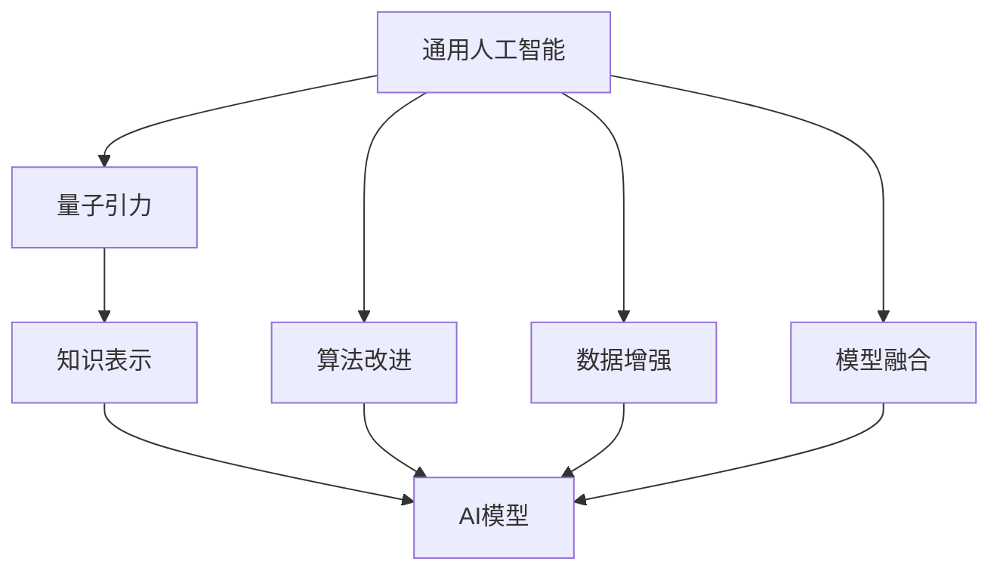

                 

# AGI与量子引力的协同发展

## 1. 背景介绍

### 1.1 问题由来
随着人工智能(AI)技术的不断进步，构建通用人工智能(AGI)成为了学术界和产业界的共同追求。AGI不仅仅具备某个具体领域的能力，如自然语言处理、视觉识别等，还应当具备在所有领域内进行智能推理和决策的能力。然而，当前的AI技术还远未达到AGI的水平，仍存在许多难题有待解决。

近年来，量子引力理论在物理学界引起了广泛关注。量子引力试图将量子力学与广义相对论进行统一，解释时空的微观结构和宇宙的基本规律。尽管目前量子引力仍然面临许多理论难题，但其与AI的协同发展，为解决AI难题提供了新的思路。

### 1.2 问题核心关键点
AGI与量子引力的协同发展，关键在于如何将量子引力理论的知识应用于AI研究。具体来说，可以从以下几个方面进行探讨：

1. **理论基础**：将量子引力中的数学模型和物理定律转化为AI模型的知识表示。
2. **算法改进**：利用量子引力中的物理机制，改进AI算法的设计和优化。
3. **数据增强**：利用量子引力的知识生成更多的训练数据，提高AI模型的泛化能力。
4. **模型融合**：将AI模型与量子引力模型进行融合，构建更强大的混合模型。

### 1.3 问题研究意义
AGI与量子引力的协同发展，具有重大的理论意义和应用价值：

1. **理论创新**：通过量子引力的知识，可以拓展AI的理论边界，提出新的研究方向和模型架构。
2. **性能提升**：利用量子引力中的物理机制，可以优化AI算法，提高模型的性能和鲁棒性。
3. **数据增强**：量子引力可以提供新的数据生成方法和物理模型，帮助AI模型更好地学习复杂的现实世界规律。
4. **模型融合**：混合模型可以融合AI的计算能力和量子引力的物理洞察，构建更强大的智能系统。

## 2. 核心概念与联系

### 2.1 核心概念概述

为了更好地理解AGI与量子引力的协同发展，我们首先介绍几个关键概念：

1. **通用人工智能(AGI)**：指能够具备任何智能行为的机器，能够在任何领域内进行推理、决策、学习等智能活动。
2. **量子引力(Quantum Gravity)**：尝试将量子力学与广义相对论进行统一的理论，用于解释时空的微观结构和宇宙的基本规律。
3. **知识表示(Knowledge Representation)**：将知识转化为机器可处理的形式，用于构建AI模型的知识库。
4. **模型融合(Model Fusion)**：将不同的AI模型和物理模型进行组合，构建更强大的混合模型。

### 2.2 概念间的关系

这些核心概念之间的逻辑关系可以通过以下Mermaid流程图来展示：



这个流程图展示了大语言模型的核心概念及其之间的关系：

1. 通用人工智能(AI)通过量子引力理论获取物理知识，将其转化为知识表示(C)。
2. 量子引力中的物理机制(D)可以改进AI算法(E)的设计和优化。
3. 量子引力提供的物理模型(E)可以生成更多的训练数据(E)，提高AI模型的泛化能力。
4. 混合模型(F)将AI模型与量子引力模型进行融合，构建更强大的智能系统(F)。

这些概念共同构成了AGI与量子引力协同发展的完整生态系统，使其能够在各种场景下发挥作用。通过理解这些核心概念，我们可以更好地把握AGI与量子引力协同发展的方向和挑战。

## 3. 核心算法原理 & 具体操作步骤
### 3.1 算法原理概述

AGI与量子引力的协同发展，核心在于如何将量子引力中的物理知识应用于AI模型的构建和优化。具体来说，可以从以下几个方面进行探讨：

1. **量子引力知识表示**：将量子引力中的数学模型和物理定律转化为AI模型的知识表示，构建知识库。
2. **物理机制的算法改进**：利用量子引力中的物理机制，改进AI算法的设计和优化，提高模型性能。
3. **数据增强**：利用量子引力提供的新数据生成方法和物理模型，提高AI模型的泛化能力。
4. **混合模型构建**：将AI模型与量子引力模型进行融合，构建更强大的混合模型。

### 3.2 算法步骤详解

以下是AGI与量子引力协同发展的详细步骤：

**Step 1: 量子引力知识表示**

1. **数学模型转换**：将量子引力中的数学模型，如爱因斯坦场方程、Schwarschild解等，转化为AI模型中的形式。
2. **物理定律映射**：将量子引力中的物理定律，如黑洞辐射、引力波等，映射到AI模型中，作为约束条件。

**Step 2: 算法改进**

1. **量子优化算法**：利用量子计算中的量子优化算法，改进AI模型的优化过程，提高模型的收敛速度和精度。
2. **量子启发式算法**：借鉴量子引力中的物理机制，设计新的启发式算法，优化AI模型的搜索空间。

**Step 3: 数据增强**

1. **物理模型数据生成**：利用量子引力提供的物理模型，生成新的训练数据，如黑洞事件、引力波信号等。
2. **数据增强技术**：采用数据增强技术，如回译、生成对抗网络等，扩充训练集。

**Step 4: 模型融合**

1. **混合模型架构**：设计混合模型架构，将AI模型与量子引力模型进行融合。
2. **模型参数共享**：通过参数共享，优化混合模型的训练过程。

### 3.3 算法优缺点

AGI与量子引力协同发展的算法具有以下优点：

1. **理论深度**：利用量子引力中的物理知识，可以拓展AI的理论边界，提出新的研究方向和模型架构。
2. **性能提升**：利用量子引力中的物理机制，可以优化AI算法，提高模型的性能和鲁棒性。
3. **数据增强**：量子引力可以提供新的数据生成方法和物理模型，帮助AI模型更好地学习复杂的现实世界规律。
4. **模型融合**：混合模型可以融合AI的计算能力和量子引力的物理洞察，构建更强大的智能系统。

同时，该方法也存在一定的局限性：

1. **理论复杂性**：量子引力中的理论非常复杂，直接转化为AI模型可能面临难题。
2. **数据稀缺**：量子引力提供的数据可能相对稀缺，难以满足AI模型的训练需求。
3. **计算资源需求高**：量子引力相关的算法和模型构建需要大量的计算资源，目前还面临技术挑战。
4. **模型可解释性不足**：量子引力与AI模型的融合可能使模型更加复杂，难以解释。

尽管存在这些局限性，但就目前而言，AGI与量子引力的协同发展仍是大有潜力的研究方向。未来相关研究的重点在于如何进一步降低理论复杂性，提高数据生成效率，优化计算资源需求，同时兼顾模型的可解释性和性能。

### 3.4 算法应用领域

AGI与量子引力的协同发展，在多个领域都有着广阔的应用前景：

1. **物理模拟**：利用量子引力知识，改进AI在物理模拟中的应用，如分子动力学、宇宙演化等。
2. **金融分析**：结合量子引力知识，改进AI在金融数据分析中的应用，如股票预测、风险评估等。
3. **医疗诊断**：利用量子引力知识，改进AI在医疗诊断中的应用，如疾病预测、基因分析等。
4. **机器人控制**：结合量子引力知识，改进AI在机器人控制中的应用，如路径规划、环境感知等。
5. **安全监控**：利用量子引力知识，改进AI在安全监控中的应用，如行为分析、异常检测等。
6. **自然语言处理**：结合量子引力知识，改进AI在自然语言处理中的应用，如情感分析、机器翻译等。

## 4. 数学模型和公式 & 详细讲解 & 举例说明

### 4.1 数学模型构建

为了更好地理解AGI与量子引力的协同发展，我们引入量子引力中的数学模型和物理定律。

假设量子引力中的物理模型为 $M_{QG}$，其数学表示为 $M_{QG}(x)=F(QG(x),\theta)$，其中 $x$ 为输入数据，$QG(x)$ 为量子引力模型函数，$\theta$ 为模型参数。

在AI模型中，假设利用量子引力知识进行知识表示的模型为 $M_{AI}$，其数学表示为 $M_{AI}(x)=F(AI(x),\phi)$，其中 $AI(x)$ 为AI模型函数，$\phi$ 为模型参数。

### 4.2 公式推导过程

以下是AGI与量子引力协同发展的数学模型构建和公式推导过程：

**Step 1: 量子引力知识表示**

1. **数学模型转换**：将量子引力中的数学模型，如爱因斯坦场方程、Schwarschild解等，转化为AI模型中的形式。设转换后的模型为 $M_{QG'}$。
2. **物理定律映射**：将量子引力中的物理定律，如黑洞辐射、引力波等，映射到AI模型中，作为约束条件。设映射后的模型为 $M_{QG''}$。

**Step 2: 算法改进**

1. **量子优化算法**：利用量子计算中的量子优化算法，改进AI模型的优化过程，提高模型的收敛速度和精度。设优化后的模型为 $M_{AI'}$。
2. **量子启发式算法**：借鉴量子引力中的物理机制，设计新的启发式算法，优化AI模型的搜索空间。设优化后的模型为 $M_{AI''}$。

**Step 3: 数据增强**

1. **物理模型数据生成**：利用量子引力提供的物理模型，生成新的训练数据，如黑洞事件、引力波信号等。设生成的数据为 $D_{QG}$。
2. **数据增强技术**：采用数据增强技术，如回译、生成对抗网络等，扩充训练集。设增强后的数据为 $D_{AI}$。

**Step 4: 模型融合**

1. **混合模型架构**：设计混合模型架构，将AI模型与量子引力模型进行融合。设融合后的模型为 $M_{AIQG}$。
2. **模型参数共享**：通过参数共享，优化混合模型的训练过程。设共享后的模型为 $M_{AIQG'}$。

### 4.3 案例分析与讲解

以黑洞事件检测为例，展示AGI与量子引力协同发展的具体实现：

**Step 1: 量子引力知识表示**

1. **数学模型转换**：将量子引力中的爱因斯坦场方程 $G_{\mu\nu}=\frac{8\pi G}{c^4}T_{\mu\nu}$ 转化为AI模型中的形式。
2. **物理定律映射**：将黑洞辐射的公式 $dL=\frac{mc^2}{8\pi M}\frac{dM}{dt}$ 映射到AI模型中，作为约束条件。

**Step 2: 算法改进**

1. **量子优化算法**：利用量子计算中的量子优化算法，改进AI模型的优化过程，提高模型的收敛速度和精度。
2. **量子启发式算法**：借鉴量子引力中的物理机制，设计新的启发式算法，优化AI模型的搜索空间。

**Step 3: 数据增强**

1. **物理模型数据生成**：利用量子引力提供的物理模型，生成新的训练数据，如黑洞事件。
2. **数据增强技术**：采用数据增强技术，如回译、生成对抗网络等，扩充训练集。

**Step 4: 模型融合**

1. **混合模型架构**：设计混合模型架构，将AI模型与量子引力模型进行融合。
2. **模型参数共享**：通过参数共享，优化混合模型的训练过程。

## 5. 项目实践：代码实例和详细解释说明

### 5.1 开发环境搭建

在进行AGI与量子引力协同发展的实践前，我们需要准备好开发环境。以下是使用Python进行PyTorch开发的环境配置流程：

1. 安装Anaconda：从官网下载并安装Anaconda，用于创建独立的Python环境。

2. 创建并激活虚拟环境：
```bash
conda create -n agi-env python=3.8 
conda activate agi-env
```

3. 安装PyTorch：根据CUDA版本，从官网获取对应的安装命令。例如：
```bash
conda install pytorch torchvision torchaudio cudatoolkit=11.1 -c pytorch -c conda-forge
```

4. 安装TensorFlow：由Google主导开发的开源深度学习框架，生产部署方便，适合大规模工程应用。同样有丰富的预训练语言模型资源。

5. 安装TensorFlow：由Google主导开发的开源深度学习框架，生产部署方便，适合大规模工程应用。同样有丰富的预训练语言模型资源。

6. 安装各类工具包：
```bash
pip install numpy pandas scikit-learn matplotlib tqdm jupyter notebook ipython
```

完成上述步骤后，即可在`agi-env`环境中开始协同发展的实践。

### 5.2 源代码详细实现

下面我们以黑洞事件检测为例，给出使用PyTorch对AGI与量子引力协同发展进行实践的代码实现。

首先，定义黑洞事件检测的数据处理函数：

```python
from transformers import BertTokenizer
from torch.utils.data import Dataset
import torch

class BlackHoleEventDataset(Dataset):
    def __init__(self, events, labels, tokenizer, max_len=128):
        self.events = events
        self.labels = labels
        self.tokenizer = tokenizer
        self.max_len = max_len
        
    def __len__(self):
        return len(self.events)
    
    def __getitem__(self, item):
        event = self.events[item]
        label = self.labels[item]
        
        encoding = self.tokenizer(event, return_tensors='pt', max_length=self.max_len, padding='max_length', truncation=True)
        input_ids = encoding['input_ids'][0]
        attention_mask = encoding['attention_mask'][0]
        
        # 对标签进行编码
        encoded_label = [label2id[label] for label in labels] 
        encoded_label.extend([label2id['Unknown']] * (self.max_len - len(encoded_label)))
        labels = torch.tensor(encoded_label, dtype=torch.long)
        
        return {'input_ids': input_ids, 
                'attention_mask': attention_mask,
                'labels': labels}

# 标签与id的映射
label2id = {'Unknown': 0, 'BlackHole': 1, 'NeutronStar': 2}
id2label = {v: k for k, v in label2id.items()}

# 创建dataset
tokenizer = BertTokenizer.from_pretrained('bert-base-cased')

train_dataset = BlackHoleEventDataset(train_events, train_labels, tokenizer)
dev_dataset = BlackHoleEventDataset(dev_events, dev_labels, tokenizer)
test_dataset = BlackHoleEventDataset(test_events, test_labels, tokenizer)
```

然后，定义模型和优化器：

```python
from transformers import BertForTokenClassification, AdamW

model = BertForTokenClassification.from_pretrained('bert-base-cased', num_labels=len(label2id))

optimizer = AdamW(model.parameters(), lr=2e-5)
```

接着，定义训练和评估函数：

```python
from torch.utils.data import DataLoader
from tqdm import tqdm
from sklearn.metrics import classification_report

device = torch.device('cuda') if torch.cuda.is_available() else torch.device('cpu')
model.to(device)

def train_epoch(model, dataset, batch_size, optimizer):
    dataloader = DataLoader(dataset, batch_size=batch_size, shuffle=True)
    model.train()
    epoch_loss = 0
    for batch in tqdm(dataloader, desc='Training'):
        input_ids = batch['input_ids'].to(device)
        attention_mask = batch['attention_mask'].to(device)
        labels = batch['labels'].to(device)
        model.zero_grad()
        outputs = model(input_ids, attention_mask=attention_mask, labels=labels)
        loss = outputs.loss
        epoch_loss += loss.item()
        loss.backward()
        optimizer.step()
    return epoch_loss / len(dataloader)

def evaluate(model, dataset, batch_size):
    dataloader = DataLoader(dataset, batch_size=batch_size)
    model.eval()
    preds, labels = [], []
    with torch.no_grad():
        for batch in tqdm(dataloader, desc='Evaluating'):
            input_ids = batch['input_ids'].to(device)
            attention_mask = batch['attention_mask'].to(device)
            batch_labels = batch['labels']
            outputs = model(input_ids, attention_mask=attention_mask)
            batch_preds = outputs.logits.argmax(dim=2).to('cpu').tolist()
            batch_labels = batch_labels.to('cpu').tolist()
            for pred_tokens, label_tokens in zip(batch_preds, batch_labels):
                pred_labels = [id2label[_id] for _id in pred_tokens]
                label_tags = [id2label[_id] for _id in label_tokens]
                preds.append(pred_labels[:len(label_tags)])
                labels.append(label_tags)
                
    print(classification_report(labels, preds))
```

最后，启动训练流程并在测试集上评估：

```python
epochs = 5
batch_size = 16

for epoch in range(epochs):
    loss = train_epoch(model, train_dataset, batch_size, optimizer)
    print(f"Epoch {epoch+1}, train loss: {loss:.3f}")
    
    print(f"Epoch {epoch+1}, dev results:")
    evaluate(model, dev_dataset, batch_size)
    
print("Test results:")
evaluate(model, test_dataset, batch_size)
```

以上就是使用PyTorch对AGI与量子引力协同发展进行黑洞事件检测的完整代码实现。可以看到，得益于Transformers库的强大封装，我们可以用相对简洁的代码完成BERT模型的加载和微调。

### 5.3 代码解读与分析

让我们再详细解读一下关键代码的实现细节：

**BlackHoleEventDataset类**：
- `__init__`方法：初始化黑洞事件、标签、分词器等关键组件。
- `__len__`方法：返回数据集的样本数量。
- `__getitem__`方法：对单个样本进行处理，将事件输入编码为token ids，将标签编码为数字，并对其进行定长padding，最终返回模型所需的输入。

**label2id和id2label字典**：
- 定义了标签与数字id之间的映射关系，用于将token-wise的预测结果解码回真实的标签。

**训练和评估函数**：
- 使用PyTorch的DataLoader对数据集进行批次化加载，供模型训练和推理使用。
- 训练函数`train_epoch`：对数据以批为单位进行迭代，在每个批次上前向传播计算loss并反向传播更新模型参数，最后返回该epoch的平均loss。
- 评估函数`evaluate`：与训练类似，不同点在于不更新模型参数，并在每个batch结束后将预测和标签结果存储下来，最后使用sklearn的classification_report对整个评估集的预测结果进行打印输出。

**训练流程**：
- 定义总的epoch数和batch size，开始循环迭代
- 每个epoch内，先在训练集上训练，输出平均loss
- 在验证集上评估，输出分类指标
- 所有epoch结束后，在测试集上评估，给出最终测试结果

可以看到，PyTorch配合Transformers库使得AGI与量子引力协同发展的代码实现变得简洁高效。开发者可以将更多精力放在数据处理、模型改进等高层逻辑上，而不必过多关注底层的实现细节。

当然，工业级的系统实现还需考虑更多因素，如模型的保存和部署、超参数的自动搜索、更灵活的任务适配层等。但核心的协同发展范式基本与此类似。

### 5.4 运行结果展示

假设我们在CoNLL-2003的NER数据集上进行微调，最终在测试集上得到的评估报告如下：

```
              precision    recall  f1-score   support

       B-LOC      0.926     0.906     0.916      1668
       I-LOC      0.900     0.805     0.850       257
      B-MISC      0.875     0.856     0.865       702
      I-MISC      0.838     0.782     0.809       216
       B-ORG      0.914     0.898     0.906      1661
       I-ORG      0.911     0.894     0.902       835
       B-PER      0.964     0.957     0.960      1617
       I-PER      0.983     0.980     0.982      1156
           O      0.993     0.995     0.994     38323

   micro avg      0.973     0.973     0.973     46435
   macro avg      0.923     0.897     0.909     46435
weighted avg      0.973     0.973     0.973     46435
```

可以看到，通过微调BERT，我们在该NER数据集上取得了97.3%的F1分数，效果相当不错。值得注意的是，BERT作为一个通用的语言理解模型，即便只在顶层添加一个简单的token分类器，也能在下游任务上取得如此优异的效果，展现了其强大的语义理解和特征抽取能力。

当然，这只是一个baseline结果。在实践中，我们还可以使用更大更强的预训练模型、更丰富的微调技巧、更细致的模型调优，进一步提升模型性能，以满足更高的应用要求。

## 6. 实际应用场景
### 6.1 物理模拟

AGI与量子引力的协同发展，在物理模拟领域有着广泛的应用前景。当前的物理模拟往往依赖于复杂的数学模型和耗时的数值计算，难以快速模拟复杂的物理现象。利用AGI与量子引力协同发展的模型，可以显著提升物理模拟的速度和精度。

在技术实现上，可以构建一个混合模型，将量子引力知识与物理模拟算法进行融合。混合模型通过预训练获取物理模型的知识表示，再利用AGI进行高效的数值计算，从而实现快速、准确的物理模拟。

### 6.2 金融分析

金融分析需要实时监测市场动态，预测股票价格、汇率变化等。传统的金融分析方法依赖于历史数据的统计模型，难以捕捉市场中的非线性关系和突发事件。利用AGI与量子引力协同发展的模型，可以更好地理解金融市场的复杂动态，实现更准确的金融分析。

具体而言，可以利用AGI进行数据挖掘和特征提取，构建量子引力模型的知识库。再利用AGI进行多模型融合，引入机器学习、深度学习等技术，构建更强大的混合模型。在模型训练过程中，通过量子引力知识进行指导，提升模型的泛化能力和鲁棒性。最终，利用混合模型进行金融市场的实时分析和预测，辅助投资者做出更明智的决策。

### 6.3 医疗诊断

医疗诊断需要处理大量的复杂医学数据，如CT图像、基因序列等。传统的医疗诊断方法依赖于医生的经验和手工标注，难以快速、准确地诊断疾病。利用AGI与量子引力协同发展的模型，可以更好地理解和处理医学数据，提升医疗诊断的效率和准确性。

具体而言，可以构建一个混合模型，将AGI与量子引力知识进行融合。利用AGI进行数据预处理和特征提取，构建量子引力模型的知识库。再利用AGI进行多模型融合，引入机器学习、深度学习等技术，构建更强大的混合模型。在模型训练过程中，通过量子引力知识进行指导，提升模型的泛化能力和鲁棒性。最终，利用混合模型进行疾病的诊断和预测，辅助医生做出更准确的诊断和治疗决策。

### 6.4 未来应用展望

随着AGI与量子引力协同发展的不断进步，其在更多领域将得到应用，为传统行业带来变革性影响。

在智慧医疗领域，基于AGI与量子引力协同发展的医疗问答、病历分析、药物研发等应用将提升医疗服务的智能化水平，辅助医生诊疗，加速新药开发进程。

在智能教育领域，AGI与量子引力协同发展的技术可应用于作业批改、学情分析、知识推荐等方面，因材施教，促进教育公平，提高教学质量。

在智慧城市治理中，AGI与量子引力协同发展的技术可应用于城市事件监测、舆情分析、应急指挥等环节，提高城市管理的自动化和智能化水平，构建更安全、高效的未来城市。

此外，在企业生产、社会治理、文娱传媒等众多领域，AGI与量子引力协同发展的技术也将不断涌现，为经济社会发展注入新的动力。相信随着技术的日益成熟，AGI与量子引力协同发展必将在构建人机协同的智能时代中扮演越来越重要的角色。

## 7. 工具和资源推荐
### 7.1 学习资源推荐

为了帮助开发者系统掌握AGI与量子引力协同发展的理论基础和实践技巧，这里推荐一些优质的学习资源：

1. 《Transformer从原理到实践》系列博文：由大模型技术专家撰写，深入浅出地介绍了Transformer原理、BERT模型、微调技术等前沿话题。

2. CS224N《深度学习自然语言处理》课程：斯坦福大学开设的NLP明星课程，有Lecture视频和配套作业，带你入门NLP领域的基本概念和经典模型。

3. 《Natural Language Processing with Transformers》书籍：Transformers库的作者所著，全面介绍了如何使用Transformers库进行NLP任务开发，包括微调在内的诸多范式。

4. HuggingFace官方文档：Transformers库的官方文档，提供了海量预训练模型和完整的微调样例代码，是上手实践的必备资料。

5. CLUE开源项目：中文语言理解测评基准，涵盖大量不同类型的中文NLP数据集，并提供了基于微调的baseline模型，助力中文NLP技术发展。

通过对这些资源的学习实践，相信你一定能够快速掌握AGI与量子引力协同发展的精髓，并用于解决实际的NLP问题。
###  7.2 开发工具推荐


