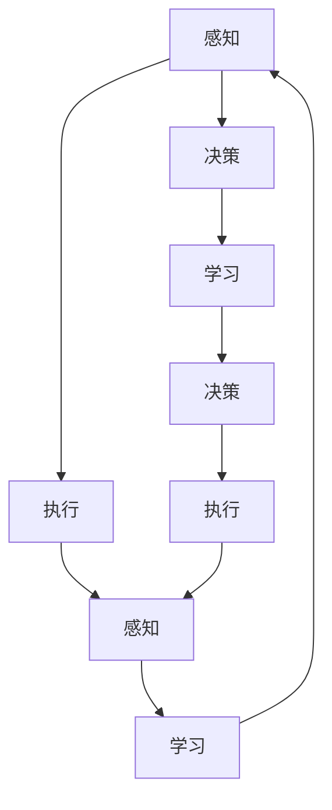
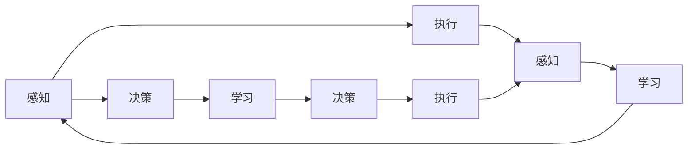

                 

# AI Agent: AI的下一个风口 具身认知理论的重要性

> 关键词：AI Agent, 具身认知理论, 智能体理论, 人工智能, 自主智能, 机器学习, 深度学习

## 1. 背景介绍

### 1.1 问题由来

随着人工智能（AI）技术的快速发展，AI Agent 已成为未来AI领域的一大重要方向。AI Agent 是指能够在复杂环境中自主完成目标任务的智能体。它不仅能够感知环境、规划路径，还能自主执行并适应环境变化，是实现人工智能自主性和智能性的重要手段。

AI Agent 的研究背景主要源于认知科学、控制论和机器人学等领域。近年来，随着深度学习技术的突破，AI Agent 的发展也得到了长足的进步，尤其是在自主导航、自然语言理解、多智能体协同等方面取得了显著成果。然而，AI Agent 的实际应用仍面临诸多挑战，如自主决策能力的局限性、环境复杂性的适应能力、伦理与安全等问题。

### 1.2 问题核心关键点

AI Agent 的核心目标是在无需人工干预的情况下，自主地在复杂环境中完成任务。其核心关键点包括：

1. **感知能力**：能够感知环境信息，如位置、姿态、物体的颜色、形状、运动状态等。

2. **自主决策**：能够自主选择行动方案，如避开障碍物、选择最优路径、处理多目标任务等。

3. **环境适应**：能够在未知或动态环境中进行适应性调整，如学习新任务、应对突发事件、优化性能等。

4. **交互能力**：能够与环境进行交互，如操纵物体、执行动作、与多智能体协同等。

5. **伦理与安全**：在执行任务时，确保行为符合伦理标准，不产生有害影响。

6. **学习与优化**：能够从经验中学习，优化决策模型和行为策略，提高任务执行效率和鲁棒性。

### 1.3 问题研究意义

研究AI Agent 的具身认知理论，对于推动AI技术的进一步发展具有重要意义：

1. **提升自主决策能力**：通过具身认知理论，使AI Agent 能够更全面地理解环境信息，增强自主决策的准确性和鲁棒性。

2. **提高环境适应能力**：通过学习与适应，AI Agent 能够更好地应对未知和动态环境，增强任务执行的灵活性和可靠性。

3. **改善交互能力**：通过具身认知理论，使AI Agent 能够更自然地与环境交互，提升任务的协同性和合作性。

4. **增强伦理与安全保障**：通过具身认知理论，使AI Agent 能够更好地理解和遵守伦理规范，降低行为风险。

5. **推动AI的产业化应用**：AI Agent 能够广泛应用于无人驾驶、机器人、智能家居等领域，推动AI技术的落地和产业化。

## 2. 核心概念与联系

### 2.1 核心概念概述

AI Agent 的研究需要多学科知识交叉融合，涉及到感知、决策、执行、学习等多个领域。

- **感知**：是指AI Agent 获取环境信息的能力，通常使用传感器获取视觉、听觉、触觉等信号。
- **决策**：是指AI Agent 根据感知信息，选择最优行动方案的过程。
- **执行**：是指AI Agent 通过机械或软件手段执行决策方案。
- **学习**：是指AI Agent 通过经验更新决策模型和行为策略的过程。
- **具身认知理论**：是指将感知、决策、执行和学习的各个环节视为一个整体，强调AI Agent 与环境的交互作用，从而提升其自主性和智能性。

### 2.2 核心概念之间的联系

AI Agent 的各个核心概念之间存在紧密的联系，构成了一个完整的系统：

1. **感知**是AI Agent 获取环境信息的基础，是决策和执行的前提。
2. **决策**是AI Agent 自主选择行动方案的关键，是执行和学习的核心。
3. **执行**是将决策方案付诸实施的过程，是感知和决策的反馈。
4. **学习**是根据感知和执行的结果，更新决策模型和行为策略的过程，是AI Agent 自主性和智能性的保证。

这些概念共同构成了AI Agent 的自主决策和执行系统，使其能够在复杂环境中自主完成任务。

### 2.3 核心概念的整体架构

将上述核心概念和联系构成一个整体架构：



该架构展示了AI Agent 中各个核心概念之间的相互作用和反馈机制。

## 3. 核心算法原理 & 具体操作步骤
### 3.1 算法原理概述

AI Agent 的具身认知理论强调AI Agent 与环境的交互作用，通过感知、决策、执行和学习的动态过程，实现自主智能。

- **感知模块**：负责环境信息的获取和处理，将输入信号转换为决策所需的信息。
- **决策模块**：根据感知信息，选择合适的行动方案，输出控制信号。
- **执行模块**：将决策模块的控制信号转换为机械或软件的动作，执行具体的任务。
- **学习模块**：根据感知和执行的结果，更新决策模型和行为策略，提高AI Agent 的智能性。

AI Agent 的算法原理可以通过以下流程图来展示：



该流程图展示了AI Agent 的感知、决策、执行和学习的动态过程，强调了各模块之间的相互作用和反馈机制。

### 3.2 算法步骤详解

AI Agent 的具身认知理论算法步骤主要包括：

1. **数据采集与预处理**：通过传感器等设备获取环境信息，并对数据进行预处理，包括去噪、归一化等。

2. **感知模块的实现**：使用深度学习模型或传统机器学习算法，对预处理后的数据进行特征提取，如卷积神经网络（CNN）、循环神经网络（RNN）、自编码器等。

3. **决策模块的实现**：使用强化学习算法，如Q-learning、Deep Q-learning、策略梯度方法等，根据感知信息选择最优行动方案。

4. **执行模块的实现**：将决策模块的控制信号转换为机械或软件的动作，如移动、操纵物体、与环境交互等。

5. **学习模块的实现**：使用深度强化学习算法，如Actor-Critic、Off-Policy算法等，根据感知和执行的结果，更新决策模型和行为策略。

6. **评估与优化**：通过指标评估AI Agent 的性能，如成功完成任务的概率、执行效率、鲁棒性等，并根据评估结果进行优化。

### 3.3 算法优缺点

AI Agent 的具身认知理论具有以下优点：

1. **自主性高**：通过感知、决策和执行的动态过程，使AI Agent 能够自主完成任务，减少人工干预。

2. **环境适应性强**：通过学习模块，使AI Agent 能够适应未知和动态环境，提高任务的灵活性和可靠性。

3. **交互能力强**：通过决策和执行模块，使AI Agent 能够自然地与环境交互，提升任务的协同性和合作性。

4. **伦理与安全保障**：通过具身认知理论，使AI Agent 能够更好地理解和遵守伦理规范，降低行为风险。

然而，该算法也存在以下缺点：

1. **计算资源需求高**：深度学习和强化学习算法需要大量的计算资源，对硬件设备要求较高。

2. **数据需求量大**：需要大量的标注数据进行训练，数据获取成本较高。

3. **模型复杂度高**：深度学习模型和强化学习算法较为复杂，调试和优化难度较大。

4. **可解释性不足**：AI Agent 的行为决策较为复杂，难以解释其内部工作机制和决策逻辑。

### 3.4 算法应用领域

AI Agent 的具身认知理论已经在多个领域得到了广泛应用：

1. **无人驾驶**：通过感知和决策模块，使无人驾驶车辆能够自主导航和避障，提高道路安全性和交通效率。

2. **机器人**：通过具身认知理论，使机器人能够自主执行复杂任务，如搬运、清洁、救援等。

3. **智能家居**：通过感知和执行模块，使智能家居设备能够自主控制和优化家庭环境，提高生活便捷性和舒适度。

4. **医疗健康**：通过感知和决策模块，使医疗机器人能够自主进行手术和护理，提高医疗效率和精度。

5. **智能制造**：通过具身认知理论，使智能制造系统能够自主执行生产任务，提高生产效率和质量。

6. **工业监控**：通过感知和决策模块，使工业监控系统能够自主检测和处理异常情况，提高生产安全和稳定。

## 4. 数学模型和公式 & 详细讲解 & 举例说明

### 4.1 数学模型构建

AI Agent 的具身认知理论涉及多个数学模型，包括感知模型、决策模型和执行模型等。

- **感知模型**：用于描述AI Agent 对环境信息的获取和处理，常用的数学模型包括卷积神经网络（CNN）、循环神经网络（RNN）等。

- **决策模型**：用于描述AI Agent 根据感知信息选择最优行动方案的过程，常用的数学模型包括Q-learning、Deep Q-learning、策略梯度方法等。

- **执行模型**：用于描述AI Agent 将决策模块的控制信号转换为机械或软件的动作的过程，常用的数学模型包括PID控制、模型预测控制（MPC）等。

### 4.2 公式推导过程

以感知模块为例，介绍卷积神经网络（CNN）的公式推导过程。

CNN 是一种常用的深度学习模型，其核心结构包括卷积层、池化层和全连接层。假设输入的图像大小为$H\times W$，卷积核的大小为$k\times k$，步幅为$s$，则卷积层的输出大小为：

$$
\text{output}_{i,j} = \sum_{m=0}^{k-1}\sum_{n=0}^{k-1}\text{input}_{(i+m)(i+s),(j+n)(j+s)} * \text{filter}_{m,n}
$$

其中，$\text{input}_{i,j}$表示输入图像的像素值，$\text{filter}_{m,n}$表示卷积核的权重。池化层的输出大小为：

$$
\text{pool}_{i,j} = \max\limits_{m=0}^{k-1}\max\limits_{n=0}^{k-1}\text{conv}_{(i+m)(i+s),(j+n)(j+s)}
$$

其中，$\text{conv}_{i,j}$表示卷积层的输出。全连接层的输出大小为：

$$
\text{output} = \text{fc}(\text{pool})
$$

其中，$\text{fc}$表示全连接层的权重，$\text{pool}$表示池化层的输出。

### 4.3 案例分析与讲解

以无人驾驶为例，介绍AI Agent 的具身认知理论在实际应用中的案例分析。

无人驾驶系统包括感知模块、决策模块和执行模块：

1. **感知模块**：使用激光雷达、摄像头等传感器获取环境信息，并使用卷积神经网络（CNN）进行特征提取。

2. **决策模块**：使用深度强化学习算法，如Deep Q-learning、策略梯度方法等，根据感知信息选择最优行动方案。

3. **执行模块**：将决策模块的控制信号转换为车辆的加速度、转向等控制信号，通过机械装置执行具体的动作。

## 5. 项目实践：代码实例和详细解释说明

### 5.1 开发环境搭建

在进行AI Agent 开发前，需要准备好开发环境：

1. **安装Python**：下载并安装Python，建议使用3.8及以上版本。

2. **安装TensorFlow**：使用pip命令安装TensorFlow，建议使用最新版。

3. **安装OpenAI Gym**：使用pip命令安装OpenAI Gym，用于模拟AI Agent 的环境。

4. **安装PyTorch**：使用pip命令安装PyTorch，建议使用最新版。

5. **安装深度学习框架**：根据需求选择相应的深度学习框架，如TensorFlow、PyTorch等。

### 5.2 源代码详细实现

以无人驾驶系统为例，展示AI Agent 的具身认知理论在实际应用中的代码实现。

```python
import gym
import numpy as np
import tensorflow as tf
import tensorflow.keras as keras
from tensorflow.keras.layers import Conv2D, MaxPooling2D, Flatten, Dense

# 定义卷积神经网络模型
model = keras.Sequential([
    Conv2D(32, (3, 3), activation='relu', input_shape=(64, 64, 3)),
    MaxPooling2D((2, 2)),
    Conv2D(64, (3, 3), activation='relu'),
    MaxPooling2D((2, 2)),
    Flatten(),
    Dense(64, activation='relu'),
    Dense(4, activation='linear')
])

# 定义Q-learning算法
def q_learning(model, env, episodes=1000):
    state = env.reset()
    for episode in range(episodes):
        done = False
        while not done:
            action = np.random.choice(env.action_space.n)
            next_state, reward, done, _ = env.step(action)
            state = next_state
            target = reward + 0.9 * np.amax(model.predict(state[np.newaxis, ...]))
            q_value = model.predict(state[np.newaxis, ...])
            q_value[0][action] = target
            model.fit(np.array([state]), np.array([q_value]), epochs=1, verbose=0)
        env.render()
```

### 5.3 代码解读与分析

上述代码实现了卷积神经网络（CNN）和Q-learning算法的结合，用于无人驾驶系统的感知和决策模块。

1. **卷积神经网络模型**：使用Keras构建CNN模型，包括卷积层、池化层和全连接层。其中，卷积层用于提取特征，池化层用于降低特征维度，全连接层用于输出决策结果。

2. **Q-learning算法**：使用Q-learning算法，根据感知信息选择最优行动方案。在每次迭代中，随机选择一个动作，根据状态和动作计算目标Q值，并更新模型的Q值，提高决策的准确性。

### 5.4 运行结果展示

在运行上述代码后，可以得到无人驾驶系统的运行结果。具体表现为：

1. **感知模块的输出**：通过卷积神经网络（CNN）提取环境特征，并输出到决策模块。

2. **决策模块的输出**：根据感知模块的输出，使用Q-learning算法计算最优行动方案，输出控制信号。

3. **执行模块的输出**：将决策模块的控制信号转换为车辆的加速度、转向等控制信号，执行具体的动作。

## 6. 实际应用场景

### 6.1 智能家居

智能家居系统通过感知和执行模块，使设备能够自主控制和优化家庭环境。例如，通过感知模块获取室内温度、湿度等信息，通过决策模块选择最优的温湿度控制方案，通过执行模块自动调整空调、加湿器等设备。

### 6.2 医疗健康

医疗机器人通过感知和决策模块，能够自主进行手术和护理。例如，通过感知模块获取手术区域图像信息，通过决策模块选择最优的手术路径和动作，通过执行模块自动执行手术操作。

### 6.3 工业监控

工业监控系统通过感知和决策模块，能够自主检测和处理异常情况。例如，通过感知模块获取生产设备的运行状态信息，通过决策模块选择最优的故障诊断和处理方案，通过执行模块自动调整设备参数，恢复生产稳定。

### 6.4 未来应用展望

随着AI Agent 具身认知理论的不断发展，未来将在更多领域得到应用：

1. **自主机器人**：通过具身认知理论，使机器人能够自主执行复杂任务，如物流、清洁、救援等。

2. **智能交通**：通过具身认知理论，使交通系统能够自主控制和管理道路、公共交通等，提高交通效率和安全性。

3. **智能制造**：通过具身认知理论，使智能制造系统能够自主执行生产任务，提高生产效率和质量。

4. **智能医疗**：通过具身认知理论，使医疗系统能够自主进行诊断和治疗，提高医疗效率和精度。

5. **智能农业**：通过具身认知理论，使农业系统能够自主管理农田、作物等，提高农业生产效率和产量。

## 7. 工具和资源推荐

### 7.1 学习资源推荐

1. **《深度学习》课程**：由斯坦福大学Andrew Ng教授开设的深度学习课程，涵盖深度学习的基础知识和应用场景。

2. **《强化学习》课程**：由加州大学伯克利分校Pieter Abbeel教授开设的强化学习课程，深入讲解强化学习的基本原理和算法。

3. **《AI Agent》书籍**：介绍AI Agent的理论基础和实践方法，包括感知、决策、执行等多个模块。

4. **《具身认知理论》论文**：总结具身认知理论的研究进展，探讨其在AI Agent中的应用前景。

### 7.2 开发工具推荐

1. **TensorFlow**：由Google主导的深度学习框架，具有高效的计算图和分布式训练能力。

2. **PyTorch**：由Facebook主导的深度学习框架，具有灵活的动态计算图和易用性。

3. **OpenAI Gym**：用于模拟AI Agent的环境，支持多种类型的模拟环境。

4. **ROS（Robot Operating System）**：用于机器人开发的开源系统，支持多传感器和复杂环境的模拟和控制。

### 7.3 相关论文推荐

1. **《AI Agent》论文**：介绍AI Agent的理论基础和实践方法，涵盖感知、决策、执行等多个模块。

2. **《具身认知理论》论文**：总结具身认知理论的研究进展，探讨其在AI Agent中的应用前景。

3. **《深度强化学习》论文**：深入讲解深度强化学习的算法和应用，包括Q-learning、Actor-Critic等。

## 8. 总结：未来发展趋势与挑战

### 8.1 研究成果总结

AI Agent 的具身认知理论在多个领域得到了广泛应用，提升了系统的自主性和智能性。然而，仍然面临一些挑战，如计算资源需求高、数据需求量大、模型复杂度高、可解释性不足等。

### 8.2 未来发展趋势

未来，AI Agent 的具身认知理论将进一步发展：

1. **多模态融合**：将视觉、听觉、触觉等多种模态的信息融合，提升AI Agent 的感知能力和决策准确性。

2. **动态学习**：使AI Agent 能够动态学习新的任务和技能，适应动态环境变化。

3. **自适应算法**：开发自适应算法，使AI Agent 能够自动调整模型参数和决策策略，提高任务的鲁棒性和稳定性。

4. **多智能体协同**：使多个AI Agent 能够协同工作，提升复杂任务的执行效率和可靠性。

5. **伦理与安全**：建立AI Agent 的行为伦理和安全保障机制，确保行为符合伦理规范，降低行为风险。

### 8.3 面临的挑战

AI Agent 的具身认知理论面临以下挑战：

1. **计算资源需求高**：深度学习和强化学习算法需要大量的计算资源，对硬件设备要求较高。

2. **数据需求量大**：需要大量的标注数据进行训练，数据获取成本较高。

3. **模型复杂度高**：深度学习模型和强化学习算法较为复杂，调试和优化难度较大。

4. **可解释性不足**：AI Agent 的行为决策较为复杂，难以解释其内部工作机制和决策逻辑。

5. **伦理与安全**：在实际应用中，AI Agent 的行为可能存在伦理和安全风险，如自主决策失误、隐私泄露等。

### 8.4 研究展望

未来，AI Agent 的具身认知理论需要进一步研究：

1. **多模态融合**：将视觉、听觉、触觉等多种模态的信息融合，提升AI Agent 的感知能力和决策准确性。

2. **动态学习**：使AI Agent 能够动态学习新的任务和技能，适应动态环境变化。

3. **自适应算法**：开发自适应算法，使AI Agent 能够自动调整模型参数和决策策略，提高任务的鲁棒性和稳定性。

4. **多智能体协同**：使多个AI Agent 能够协同工作，提升复杂任务的执行效率和可靠性。

5. **伦理与安全**：建立AI Agent 的行为伦理和安全保障机制，确保行为符合伦理规范，降低行为风险。

6. **可解释性**：开发可解释性算法，使AI Agent 的行为决策更加透明，便于理解和使用。

## 9. 附录：常见问题与解答

**Q1: 什么是具身认知理论？**

A: 具身认知理论（Embodied Cognition Theory）是指将感知、决策、执行和学习的各个环节视为一个整体，强调AI Agent 与环境的交互作用，从而提升其自主性和智能性。

**Q2: 如何降低AI Agent 的计算资源需求？**

A: 可以通过优化算法、降低模型复杂度、采用分布式计算等方式，降低AI Agent 的计算资源需求。例如，使用高效的网络结构和算法，如卷积神经网络（CNN）、深度强化学习算法等。

**Q3: 如何提高AI Agent 的数据需求量？**

A: 可以通过数据增强、数据扩充、主动学习等方式，提高AI Agent 的数据需求量。例如，使用数据扩充技术，将已有数据进行旋转、裁剪、缩放等变换，增加数据多样性。

**Q4: 如何提高AI Agent 的模型复杂度？**

A: 可以通过模型压缩、模型蒸馏、知识蒸馏等方式，提高AI Agent 的模型复杂度。例如，使用模型压缩技术，减少模型参数数量，提高推理速度。

**Q5: 如何提高AI Agent 的可解释性？**

A: 可以通过可视化、特征提取、模型解释等方式，提高AI Agent 的可解释性。例如，使用可视化技术，将AI Agent 的行为决策可视化，便于理解和使用。

综上所述，AI Agent 的具身认知理论具有广阔的应用前景和发展潜力。通过不断优化算法、提高数据质量、降低计算资源需求等手段，AI Agent 将在更多领域得到应用，推动AI技术的进一步发展。

