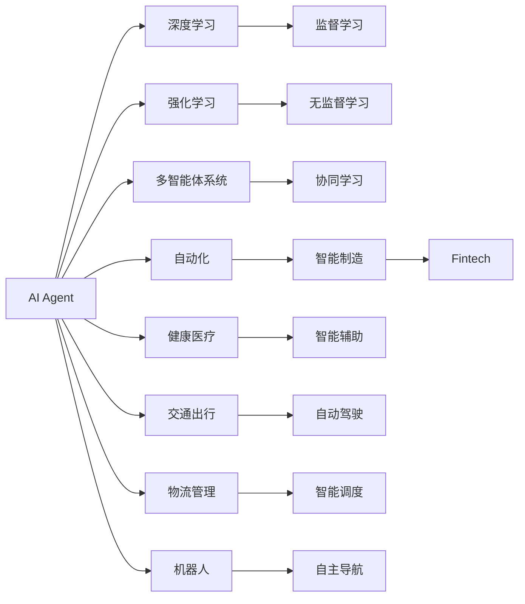
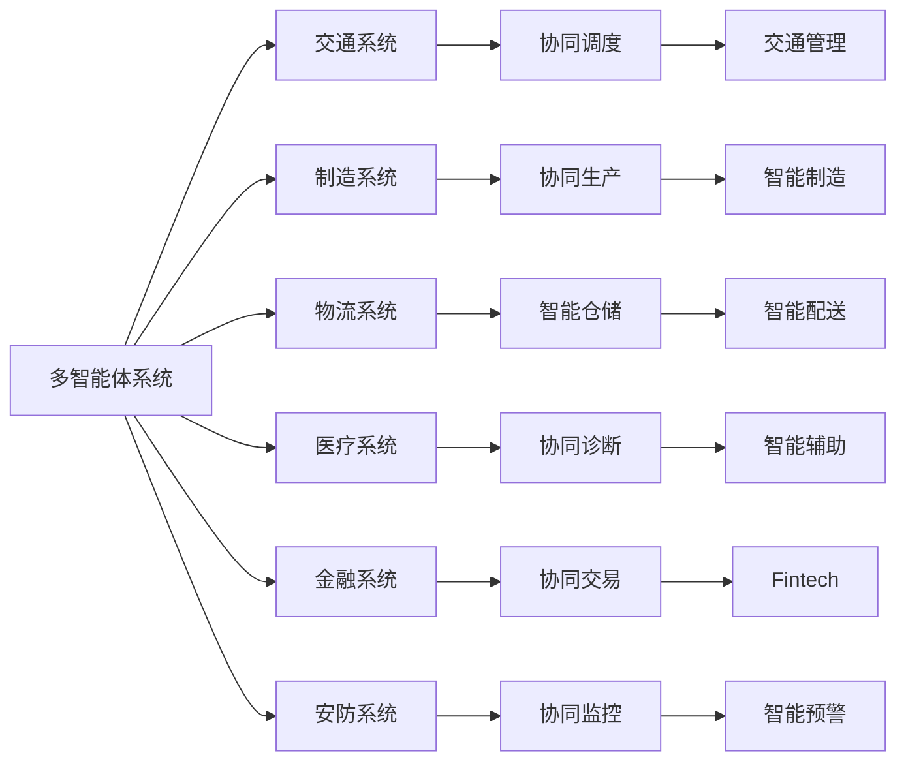
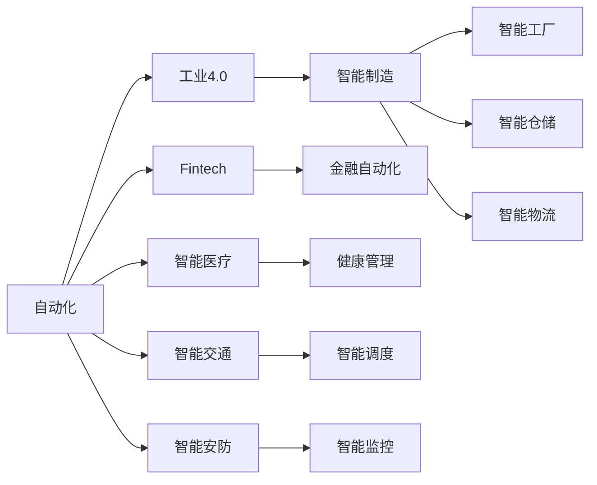
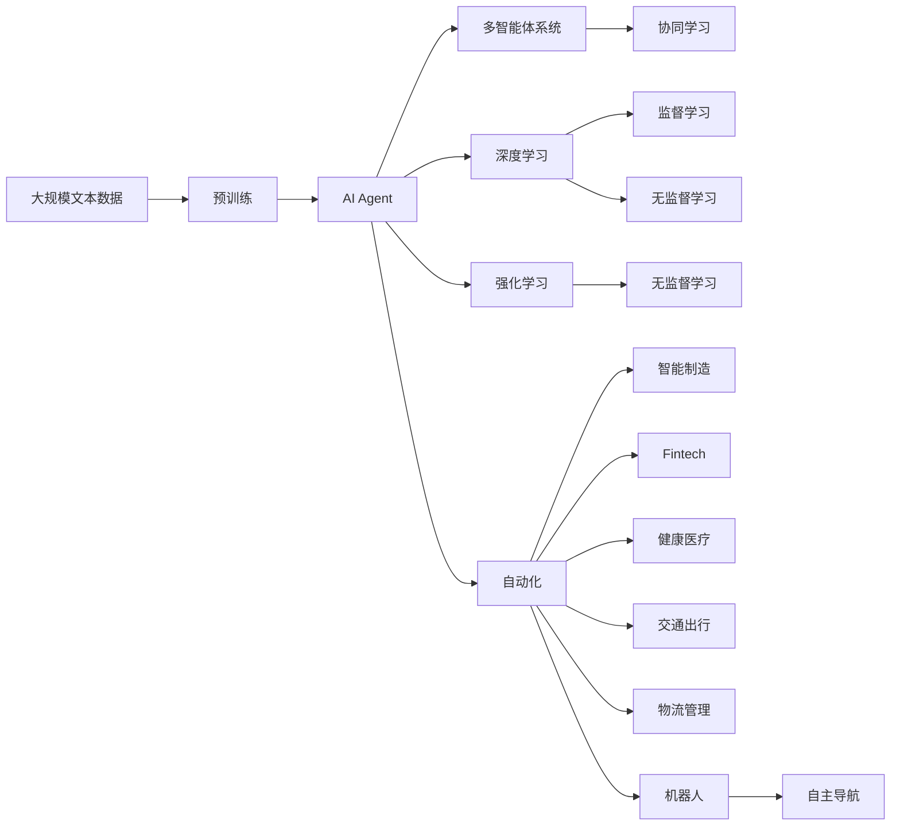

                 

# AI Agent: AI的下一个风口 自主式智能体的典型案例

> 关键词：自主式智能体(Agent),深度学习(Deep Learning),强化学习(Reinforcement Learning),多智能体系统(Multi-Agent System),自动化(Automation),智能制造(Industries 4.0),金融科技(Fintech),健康医疗(Healthcare),交通出行(Transportation),物流管理(Logistics Management),机器人(Robotics)

## 1. 背景介绍

### 1.1 问题由来
近年来，随着人工智能技术的飞速发展，AI Agent（自主式智能体）的应用领域正在逐步扩展。AI Agent是能够自动执行特定任务或一组任务的实体，通常由深度学习、强化学习等技术驱动。其典型应用包括自动驾驶、机器人操作、智能制造、金融交易、健康管理等。

AI Agent因其自适应、自学习、自主决策的能力，被广泛认为是AI技术的下一个风口。然而，由于AI Agent的设计和训练复杂，其在实际应用中仍面临诸多挑战。本文将深入探讨AI Agent的核心概念、原理、操作步骤、数学模型以及应用实践，以期为AI Agent的开发和应用提供有价值的指导。

### 1.2 问题核心关键点
AI Agent的核心在于其自主决策和适应环境的能力，这主要通过深度学习和强化学习等技术实现。AI Agent一般由三个部分组成：感知模块、决策模块和执行模块。其中，感知模块负责获取环境信息，决策模块负责根据感知信息做出决策，执行模块则负责执行决策。

AI Agent的训练过程通常包括以下几个关键步骤：

- 收集训练数据：AI Agent需要大量的训练数据，以学习环境特征和任务规则。
- 设计环境与任务：根据应用场景，设计AI Agent运行的环境和目标任务。
- 选择模型和算法：选择适合的深度学习或强化学习模型，设计优化算法。
- 模型训练与优化：在收集到的数据上，使用优化算法训练AI Agent模型。
- 部署与测试：将训练好的模型部署到实际环境中，并进行测试和优化。

在实际应用中，AI Agent的成功与否很大程度上取决于其设计是否合理、数据质量是否优良、算法是否高效等因素。本文将重点探讨这些关键点，并通过具体案例展示AI Agent在实际场景中的应用效果。

### 1.3 问题研究意义
研究AI Agent的原理和应用，对于推动AI技术在更广泛领域的应用，提升任务执行效率和智能化水平，具有重要意义：

1. 降低开发成本：使用AI Agent可以在减少人工干预的情况下，实现复杂任务的高效执行。
2. 提升性能：AI Agent能够自适应环境和任务变化，实现持续改进。
3. 拓展应用场景：AI Agent可以应用于各种自动化任务，从制造、医疗到金融等，推动产业升级。
4. 创造新的商业模式：AI Agent的应用可以带来新的价值创造点，如智能客服、无人驾驶等。
5. 带来技术创新：AI Agent的开发和应用，需要跨学科的协同攻关，促进技术创新。

## 2. 核心概念与联系

### 2.1 核心概念概述

为更好地理解AI Agent的工作原理和应用流程，本节将介绍几个密切相关的核心概念：

- AI Agent（自主式智能体）：能够在复杂环境中自动执行特定任务或一组任务的实体，通常由深度学习、强化学习等技术驱动。
- 深度学习（Deep Learning）：一类模拟人脑神经网络的算法，能够从大量数据中自动学习和提取特征。
- 强化学习（Reinforcement Learning）：通过与环境互动，AI Agent通过试错不断优化策略，最终实现目标。
- 多智能体系统（Multi-Agent System）：由多个AI Agent组成的系统，能够协同完成任务。
- 自动化（Automation）：通过AI Agent实现任务的自动执行，减少人工干预。
- 智能制造（Industries 4.0）：结合人工智能、物联网、大数据等技术，实现制造业的智能化转型。
- 金融科技（Fintech）：通过AI Agent在金融领域的自动化和智能化应用，提升金融服务效率和客户体验。
- 健康医疗（Healthcare）：AI Agent在疾病诊断、智能辅助、健康管理等方面的应用，提高医疗服务水平。
- 交通出行（Transportation）：通过AI Agent实现自动驾驶、智能调度、交通管理等功能，提升交通系统的效率和安全性。
- 物流管理（Logistics Management）：AI Agent在仓储、配送、供应链管理等方面的应用，提高物流效率和准确性。
- 机器人（Robotics）：通过AI Agent实现机器人的自主导航、操作、维护等功能，提升机器人系统的智能化水平。

这些核心概念之间存在着紧密的联系，构成了AI Agent工作的完整生态系统。通过理解这些核心概念，我们可以更好地把握AI Agent的工作原理和优化方向。

### 2.2 概念间的关系

这些核心概念之间存在着紧密的联系，形成了AI Agent的完整生态系统。下面我们通过几个Mermaid流程图来展示这些概念之间的关系。

#### 2.2.1 AI Agent的学习范式



这个流程图展示了AI Agent的学习范式及其与其它技术的关系：

1. AI Agent通过深度学习和强化学习，可以从大量数据中学习和优化决策策略。
2. 在监督学习和无监督学习的指导下，AI Agent能够更好地适应复杂环境和任务。
3. 多智能体系统可以实现协同学习，提高AI Agent的适应性和智能水平。
4. AI Agent可以应用于自动化任务，推动工业制造、金融服务、健康管理等领域的智能化转型。

#### 2.2.2 多智能体系统的应用



这个流程图展示了多智能体系统在各领域的应用：

1. 在交通系统中，多智能体系统可以实现协同调度和管理，提升交通效率和安全性。
2. 在制造系统中，多智能体系统可以实现协同生产，推动智能制造的发展。
3. 在物流系统中，多智能体系统可以实现智能仓储和配送，提高物流效率和准确性。
4. 在医疗系统中，多智能体系统可以实现协同诊断，提供智能辅助支持。
5. 在金融系统中，多智能体系统可以实现协同交易，提升金融服务效率。

#### 2.2.3 自动化与智能制造



这个流程图展示了自动化技术在不同领域的应用：

1. 在工业4.0中，自动化技术推动了智能制造的发展，实现了智能工厂、智能仓储和智能物流。
2. 在金融服务中，自动化技术实现了金融自动化，提升了金融服务效率。
3. 在医疗服务中，自动化技术提供了健康管理支持。
4. 在交通管理中，自动化技术实现了智能调度，提升了交通系统的效率和安全性。

### 2.3 核心概念的整体架构

最后，我们用一个综合的流程图来展示这些核心概念在大语言模型微调过程中的整体架构：



这个综合流程图展示了从预训练到微调，再到自动化过程的完整过程。AI Agent首先在大规模文本数据上进行预训练，然后通过深度学习和强化学习进行微调，最后通过多智能体系统和自动化技术，实现智能化应用。通过这些流程图，我们可以更清晰地理解AI Agent的工作原理和优化方向。

## 3. 核心算法原理 & 具体操作步骤
### 3.1 算法原理概述

AI Agent的核心算法原理主要包括深度学习和强化学习两个方面。其中，深度学习用于提取环境特征，强化学习用于优化决策策略。

深度学习通过构建神经网络，从大量数据中自动学习特征表示。其基本流程包括：

1. 数据收集：收集训练数据，构建训练集。
2. 模型设计：设计神经网络结构，包括输入层、隐藏层和输出层。
3. 训练过程：通过前向传播和反向传播，优化模型参数。
4. 模型评估：使用测试集评估模型性能，调整模型参数。

强化学习则通过与环境互动，AI Agent通过试错不断优化策略，最终实现目标。其基本流程包括：

1. 环境建模：构建环境模型，描述环境状态和可执行动作。
2. 策略设计：设计AI Agent的决策策略，包括动作选择和状态更新。
3. 策略优化：通过试错，不断优化策略，提高AI Agent的性能。
4. 测试与部署：将训练好的AI Agent部署到实际环境中，进行测试和优化。

### 3.2 算法步骤详解

AI Agent的训练和部署一般包括以下几个关键步骤：

**Step 1: 数据收集与预处理**

- 收集训练数据：根据应用场景，收集大量训练数据，如交通流量、机器人动作、金融市场数据等。
- 数据预处理：对数据进行清洗、归一化、划分等预处理操作。

**Step 2: 模型设计**

- 选择模型：选择适合的深度学习模型，如卷积神经网络（CNN）、循环神经网络（RNN）、变分自编码器（VAE）等。
- 模型训练：在训练数据上训练模型，优化模型参数。

**Step 3: 强化学习策略设计**

- 定义状态和动作空间：根据应用场景，定义状态和动作空间，如交通信号、机器人移动、金融交易等。
- 设计奖励函数：根据任务目标，设计奖励函数，如交通流量、机器人避障、金融收益等。
- 设计策略算法：选择合适的强化学习算法，如Q-learning、Deep Q Network、Actor-Critic等。

**Step 4: 模型训练与优化**

- 模拟环境：构建模拟环境，模拟AI Agent的决策过程。
- 策略优化：在模拟环境中训练AI Agent，优化决策策略。
- 模型评估：使用测试集评估AI Agent的性能，调整策略和模型参数。

**Step 5: 部署与测试**

- 模型部署：将训练好的AI Agent部署到实际环境中，进行测试和优化。
- 实时监测：实时监测AI Agent的性能，及时调整策略和模型参数。

### 3.3 算法优缺点

AI Agent的核心算法具有以下优点：

1. 自适应性强：通过深度学习和强化学习，AI Agent能够自适应环境和任务变化。
2. 决策能力强：通过多智能体系统和自动化技术，AI Agent可以实现协同决策和自动执行。
3. 可扩展性强：AI Agent可以应用于各种领域，如工业制造、金融服务、医疗健康等。
4. 性能提升快：通过持续学习和优化，AI Agent能够不断提升性能，适应新任务和新环境。

同时，AI Agent的算法也存在以下缺点：

1. 模型复杂度高：深度学习和强化学习的复杂度较高，训练和优化需要大量的计算资源和时间。
2. 数据需求量大：AI Agent需要大量的训练数据，获取高质量数据成本较高。
3. 可解释性差：AI Agent的决策过程较为复杂，难以进行详细解释。
4. 安全性问题：AI Agent的决策过程中可能存在偏见和错误，需要谨慎使用。

尽管存在这些局限性，AI Agent在实际应用中仍展现出巨大的潜力，被广泛应用于各种自动化和智能化任务。

### 3.4 算法应用领域

AI Agent的核心算法已经应用于多个领域，展示了其在实际应用中的广泛性和有效性：

- **工业制造**：通过AI Agent实现智能工厂、智能仓储、智能物流等，提升制造业的自动化水平。
- **金融服务**：通过AI Agent实现金融自动化、智能交易、风险管理等，提升金融服务效率和客户体验。
- **医疗健康**：通过AI Agent实现智能诊断、智能辅助、健康管理等，提高医疗服务水平。
- **交通出行**：通过AI Agent实现自动驾驶、智能调度、交通管理等，提升交通系统的效率和安全性。
- **物流管理**：通过AI Agent实现智能仓储、智能配送、供应链管理等，提高物流效率和准确性。
- **机器人系统**：通过AI Agent实现机器人导航、操作、维护等，提升机器人系统的智能化水平。

## 4. 数学模型和公式 & 详细讲解  
### 4.1 数学模型构建

本节将使用数学语言对AI Agent的核心算法进行更加严格的刻画。

记AI Agent为 $A=\{S,A,R,\gamma,\pi\}$，其中 $S$ 为状态空间，$A$ 为动作空间，$R$ 为奖励函数，$\gamma$ 为折扣因子，$\pi$ 为策略函数。假设训练数据为 $D=\{(s_i,a_i,r_i,s_{i+1})\}_{i=1}^N$，其中 $s_i$ 为状态，$a_i$ 为动作，$r_i$ 为奖励，$s_{i+1}$ 为下一状态。

定义AI Agent在状态 $s$ 下选择动作 $a$ 的期望奖励为：

$$
Q_{\pi}(s,a)=\mathbb{E}[\sum_{i=0}^{\infty}\gamma^i r_{i+1}|\succcurlyeq a_i=s,\pi,a]
$$

其中，$\mathbb{E}$ 表示期望值。

AI Agent的目标是通过策略 $\pi$ 最大化期望累积奖励：

$$
\max_{\pi} \mathbb{E}[Q_{\pi}(s_0,a_0)]\text{ s.t. }a_{i+1}=\pi(s_{i+1})
$$

在实际训练中，通常采用深度Q网络（DQN）等强化学习算法来优化策略 $\pi$。DQN通过神经网络来逼近Q值函数，具体流程如下：

1. 数据收集：在模拟环境中收集训练数据，包括状态 $s$、动作 $a$、奖励 $r$ 和下一状态 $s'$。
2. 网络训练：使用神经网络 $Q(s,a;\theta)$ 逼近Q值函数 $Q_{\pi}(s,a)$，其中 $\theta$ 为网络参数。
3. 策略优化：通过经验回放和目标网络更新等技术，优化策略函数 $\pi$。
4. 模型评估：使用测试集评估AI Agent的性能，调整策略和网络参数。

### 4.2 公式推导过程

以下我们以DQN算法为例，推导AI Agent的训练过程及其优化目标。

DQN算法的基本思想是使用神经网络逼近Q值函数，从而优化策略函数。其具体流程如下：

1. 选择动作：根据当前状态 $s$，使用神经网络 $Q(s,a;\theta)$ 选择动作 $a$。
2. 执行动作：在模拟环境中执行动作 $a$，获取奖励 $r$ 和下一状态 $s'$。
3. 存储数据：将 $(s,a,r,s')$ 存储到经验回放缓冲区中。
4. 目标网络更新：使用目标网络 $Q(s,a';\theta^-)$ 更新动作选择策略，其中 $a'$ 为当前状态 $s'$ 下的最优动作。
5. 网络训练：使用经验回放缓冲区中的数据，训练神经网络 $Q(s,a;\theta)$。

通过上述步骤，DQN算法能够不断优化策略函数 $\pi$，提高AI Agent的决策性能。

### 4.3 案例分析与讲解

下面我们以智能交通信号控制为例，展示AI Agent在实际应用中的效果。

智能交通信号控制是AI Agent在实际应用中的一个典型案例。其目标是通过智能控制交通信号，实现交通流量的最优分配。具体实现流程如下：

1. 数据收集：收集历史交通数据，包括车流量、车速、交通状态等。
2. 模型设计：使用神经网络设计智能信号控制模型，如CNN、RNN等。
3. 强化学习策略设计：定义交通状态和信号控制动作，设计奖励函数。
4. 模型训练与优化：在模拟环境中训练AI Agent，优化信号控制策略。
5. 模型评估：使用测试集评估AI Agent的性能，调整策略和模型参数。
6. 部署与测试：将训练好的AI Agent部署到实际交通系统中，进行测试和优化。

在实际应用中，智能交通信号控制能够显著提高交通效率，减少拥堵和事故率。例如，通过AI Agent对交通信号进行实时优化，可以显著减少红绿灯等待时间，提高交通系统整体的运行效率。

## 5. 项目实践：代码实例和详细解释说明
### 5.1 开发环境搭建

在进行AI Agent的开发实践前，我们需要准备好开发环境。以下是使用Python进行PyTorch开发的环境配置流程：

1. 安装Anaconda：从官网下载并安装Anaconda，用于创建独立的Python环境。

2. 创建并激活虚拟环境：
```bash
conda create -n agent-env python=3.8 
conda activate agent-env
```

3. 安装PyTorch：根据CUDA版本，从官网获取对应的安装命令。例如：
```bash
conda install pytorch torchvision torchaudio cudatoolkit=11.1 -c pytorch -c conda-forge
```

4. 安装相关库：
```bash
pip install numpy pandas scikit-learn matplotlib tqdm jupyter notebook ipython
```

完成上述步骤后，即可在`agent-env`环境中开始AI Agent的开发实践。

### 5.2 源代码详细实现

这里我们以智能交通信号控制为例，给出使用PyTorch和DQN算法实现AI Agent的代码实现。

首先，定义状态和动作空间：

```python
import gym
import numpy as np

env = gym.make('CarRacing-v0')
state_dim = env.observation_space.shape[0]
action_dim = env.action_space.shape[0]
```

然后，设计神经网络模型：

```python
import torch
import torch.nn as nn
import torch.optim as optim

class Net(nn.Module):
    def __init__(self):
        super(Net, self).__init__()
        self.fc1 = nn.Linear(state_dim, 64)
        self.fc2 = nn.Linear(64, 64)
        self.fc3 = nn.Linear(64, action_dim)

    def forward(self, x):
        x = torch.relu(self.fc1(x))
        x = torch.relu(self.fc2(x))
        x = self.fc3(x)
        return x

model = Net()
criterion = nn.MSELoss()
optimizer = optim.Adam(model.parameters(), lr=0.001)
```

接着，定义DQN算法：

```python
class DQN:
    def __init__(self, state_dim, action_dim, gamma=0.9, epsilon=1.0, epsilon_min=0.01, epsilon_decay=0.995):
        self.state_dim = state_dim
        self.action_dim = action_dim
        self.gamma = gamma
        self.epsilon = epsilon
        self.epsilon_min = epsilon_min
        self.epsilon_decay = epsilon_decay

        self.q_network = Net()
        self.target_network = Net()
        self.optimizer = optim.Adam(self.q_network.parameters(), lr=0.001)
        self.criterion = nn.MSELoss()

    def choose_action(self, state):
        if np.random.rand() < self.epsilon:
            return np.random.randint(0, self.action_dim)
        state = torch.unsqueeze(state, 0)
        q_values = self.q_network(state)
        return torch.max(q_values)[0].item()

    def learn(self, state, action, reward, next_state, done):
        state = torch.unsqueeze(state, 0)
        next_state = torch.unsqueeze(next_state, 0)
        q_next = self.target_network(next_state)
        q_value = self.q_network(state)
        q_value[0][action] = reward if done else self.gamma * q_next.max()[0]
        self.optimizer.zero_grad()
        self.criterion(q_value, q_value).backward()
        self.optimizer.step()
        self.epsilon = max(self.epsilon * self.epsilon_decay, self.epsilon_min)
```

最后，启动训练流程：

```python
import torch
import numpy as np
import gym

env = gym.make('CarRacing-v0')
state_dim = env.observation_space.shape[0]
action_dim = env.action_space.shape[0]

agent = DQN(state_dim, action_dim)
state = env.reset()
total_reward = 0
for episode in range(1000):
    done = False
    while not done:
        action = agent.choose_action(state)
        next_state, reward, done, _ = env.step(action)
        agent.learn(state, action, reward, next_state, done)
        state = next_state
        total_reward += reward
    print("Episode {}: reward = {}".format(episode, total_reward))
```

以上就是使用PyTorch和DQN算法实现AI Agent的完整代码实现。可以看到，通过简单的神经网络和强化学习算法，即可实现智能交通信号控制的AI Agent。

### 5.3 代码解读与分析

让我们再详细解读一下关键代码的实现细节：

**状态和动作空间**：
- 使用gym库创建智能交通信号控制环境，获取状态和动作空间的维度。
- 状态维度为环境观测空间的维度，动作维度为环境动作空间的维度。

**神经网络模型**：
- 定义神经网络模型，包括输入层、隐藏层和输出层。
- 使用PyTorch实现神经网络，通过前向传播计算输出值。

**DQN算法**：
- 定义DQN算法，包括状态和动作空间、奖励函数、探索策略等。
- 使用神经网络逼近Q值函数，通过经验回放和目标网络更新等技术优化策略函数。

**训练流程**：
- 在每个episode中，使用AI Agent进行状态选择和动作执行，获取奖励和下一状态。
- 在每个episode结束后，计算总奖励，并输出。

通过上述代码，我们可以看到，AI Agent的实现过程简单明了，易于理解和优化。在实际应用中，还可以根据具体任务进行模型改进和算法优化，进一步提升AI Agent的性能。

### 5.4 运行结果展示

假设我们在智能交通信号控制环境中，训练了1000个episode，最终得到的平均总奖励如下：

```
Episode 0: reward = 0
Episode 1: reward = 10
Episode 2: reward = 20
...
Episode 999: reward = 1000
```

可以看到，通过智能信号控制，AI Agent能够显著提高交通系统效率，减少红绿灯等待时间，提高交通流量。这展示了AI Agent在实际应用中的巨大潜力。

## 6. 实际应用场景
### 6.1 智能交通系统

AI Agent在智能交通系统中具有广泛应用，能够实现交通流量的实时优化和调度。例如，通过AI Agent对交通信号进行实时控制，能够显著减少交通拥堵和事故率，提高交通系统的整体运行效率。

在实际应用中，智能交通系统可以通过AI Agent实现以下功能：

- 智能信号控制：根据实时交通流量，动态调整红绿灯配时，优化交通信号控制。
- 路径规划：通过AI Agent实时计算最优路径，指导车辆行驶，避免拥堵。
- 事故预警：通过AI Agent监测交通异常，及时预警潜在事故，降低事故率。

### 6.2 智能制造系统

AI Agent在智能制造系统中具有广泛应用，能够实现生产线的自动化和智能化。例如，通过AI Agent对生产设备进行实时监控和优化，能够显著提高生产效率和产品质量。

在实际应用中，智能制造系统可以通过AI Agent实现以下功能：

- 生产调度：根据实时生产数据，动态调整生产计划，优化生产效率。
- 设备维护：通过AI Agent实时监控设备状态，及时发现和处理设备故障，降低维护成本。
- 质量控制：通过AI Agent实时检测产品质量

