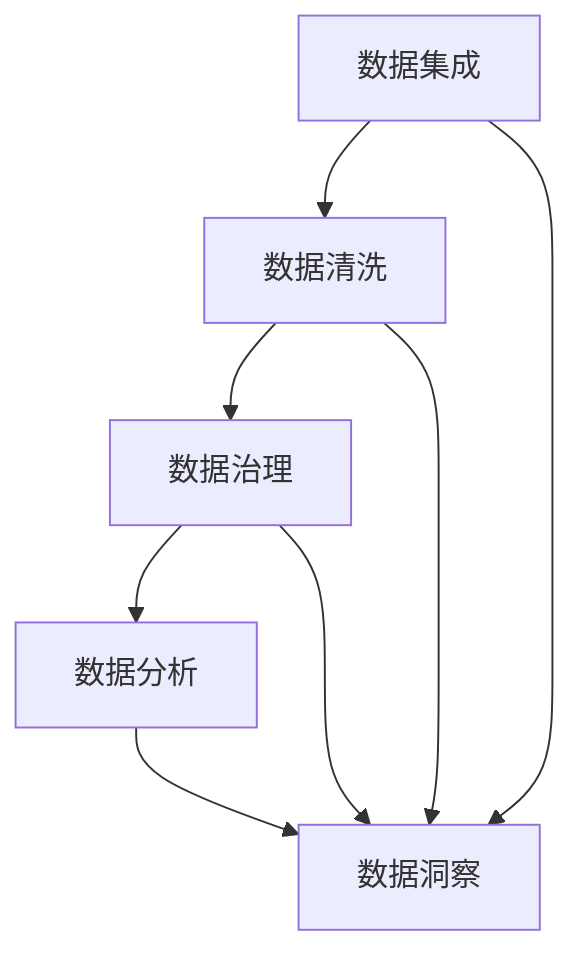

                 

# AI DMP 数据基建：数据分析与洞察

> 关键词：

## 1. 背景介绍

### 1.1 问题由来

近年来，数据中台（Data Middle Platform，DMP）在企业数字化转型中发挥了越来越重要的作用。DMP作为一种数据资产管理和运营体系，为数据驱动决策提供了重要的支撑。然而，在数据量大、数据来源多样化、数据质量参差不齐的情况下，如何高效、准确地进行数据治理和分析，仍然是一个挑战。本文聚焦于AI DMP的建设，结合数据分析与洞察的方法，探讨如何通过数据基建提升企业数据治理能力。

### 1.2 问题核心关键点

AI DMP的建设涉及多个关键环节，包括数据集成、数据清洗、数据治理、数据分析和数据洞察等。其中，数据分析和洞察是核心的任务，通过科学的方法和工具，从数据中提炼出有价值的信息，为企业决策提供依据。

AI DMP的核心目标是通过自动化和智能化手段，提高数据质量和利用效率，从而提升数据治理水平。具体来说，包括以下几个方面：

1. **数据自动化集成**：自动从不同数据源中采集数据，消除数据孤岛，提升数据可用性。
2. **数据质量管理**：通过数据清洗、数据校验、数据去重等技术，提升数据准确性和完整性。
3. **数据治理和治理**：建立数据标准和规范，确保数据一致性、可靠性和安全性。
4. **数据分析和洞察**：采用先进的算法和模型，从数据中挖掘知识，为企业提供决策支持。

本文将系统介绍AI DMP的数据基建方法，结合数据分析和洞察的技术手段，探讨如何构建一个高效、智能、可扩展的数据治理体系。

### 1.3 问题研究意义

构建AI DMP对于企业来说，具有重要的意义：

1. **提升数据治理效率**：自动化和智能化的数据治理手段，能够显著提高数据处理的效率和质量，减少人工干预和错误。
2. **增强决策科学性**：通过数据分析和洞察，从数据中提炼出有价值的知识，为决策提供科学的依据，提升决策的准确性和有效性。
3. **优化业务流程**：数据分析和洞察可以帮助企业识别业务中的瓶颈和问题，优化业务流程，提升运营效率。
4. **推动数字化转型**：AI DMP的建设是企业数字化转型的重要组成部分，能够帮助企业构建数据驱动的智能业务体系。

## 2. 核心概念与联系

### 2.1 核心概念概述

AI DMP的建设涉及多个核心概念，包括数据集成、数据清洗、数据治理、数据分析和数据洞察等。这些概念之间存在着紧密的联系，共同构成了一个完整的AI DMP架构。

- **数据集成**：将分散在不同系统或来源的数据采集并集中管理，消除数据孤岛，提升数据可用性。
- **数据清洗**：通过数据清洗、去重、校验等技术手段，提升数据准确性和完整性，确保数据质量。
- **数据治理**：建立数据标准和规范，确保数据一致性、可靠性和安全性，保障数据质量。
- **数据分析**：采用先进的算法和模型，从数据中挖掘知识，为决策提供支持。
- **数据洞察**：通过数据可视化、报表生成等手段，将分析结果以直观的方式呈现给业务人员，帮助其理解并利用数据。

### 2.2 概念间的关系

这些核心概念之间的联系可以通过以下Mermaid流程图来展示：



这个流程图展示了数据治理的各个环节及其之间的关系：

1. 数据集成将分散的数据源采集并集中，为后续的数据清洗和治理打下基础。
2. 数据清洗通过去除噪音、校正错误，提升数据质量，为数据分析和洞察提供准确的数据。
3. 数据治理通过建立标准和规范，保障数据一致性和可靠性，确保数据质量。
4. 数据分析采用算法和模型，从数据中挖掘知识和洞察，为决策提供支持。
5. 数据洞察将分析结果以直观的方式呈现，帮助业务人员理解和利用数据。

这些概念共同构成了AI DMP的数据治理体系，通过自动化和智能化的手段，提升数据治理水平。

## 3. 核心算法原理 & 具体操作步骤

### 3.1 算法原理概述

AI DMP的数据治理过程，本质上是一个从数据集成、清洗、治理到分析和洞察的自动化和智能化过程。其核心算法和步骤包括以下几个关键部分：

1. **数据集成算法**：通过ETL（Extract, Transform, Load）流程，将数据从不同系统或来源采集并集中。
2. **数据清洗算法**：通过数据去重、去噪、校验等技术，提升数据准确性和完整性。
3. **数据治理算法**：建立数据标准和规范，确保数据一致性和可靠性。
4. **数据分析算法**：采用机器学习和统计学方法，从数据中挖掘知识和洞察。
5. **数据洞察算法**：通过数据可视化、报表生成等技术手段，将分析结果呈现给业务人员。

### 3.2 算法步骤详解

#### 3.2.1 数据集成算法

数据集成的主要目标是将分散的数据源采集并集中，消除数据孤岛。具体步骤如下：

1. **数据源采集**：从不同的数据源（如数据库、文件、API等）中采集数据。
2. **数据转换**：将采集到的数据转换为统一的格式和结构，以便后续处理。
3. **数据加载**：将转换后的数据加载到集中存储系统（如Hadoop、Hive、Spark等）中。

数据集成的核心算法包括ETL工具和数据管道。ETL工具负责数据采集、转换和加载，如Apache Nifi、Apache Oozie等。数据管道负责将数据从一个系统传输到另一个系统，如Apache Kafka、Apache Flink等。

#### 3.2.2 数据清洗算法

数据清洗的目的是通过去除噪音、校正错误、去重等手段，提升数据准确性和完整性。具体步骤如下：

1. **数据去重**：通过哈希、聚类等算法，去除重复数据。
2. **数据校验**：通过校验规则，检查数据的合法性和正确性。
3. **数据去噪**：通过过滤、平滑等技术，去除数据中的噪音和异常值。

数据清洗的核心算法包括哈希表、聚类算法、校验规则等。例如，通过哈希表快速检测重复数据，通过聚类算法识别数据异常点，通过校验规则检查数据格式和内容。

#### 3.2.3 数据治理算法

数据治理的目的是建立数据标准和规范，确保数据一致性、可靠性和安全性。具体步骤如下：

1. **数据规范制定**：根据业务需求，制定数据标准和规范，如数据格式、数据精度、数据范围等。
2. **数据一致性检查**：通过检查规则，确保数据符合规范要求。
3. **数据安全性保障**：通过加密、权限控制等手段，保护数据安全。

数据治理的核心算法包括数据规范制定、一致性检查和安全性保障。例如，通过数据规范制定，确保数据格式和内容符合业务要求；通过一致性检查，确保数据在各个系统中的值一致；通过安全性保障，保护数据不被非法访问和篡改。

#### 3.2.4 数据分析算法

数据分析的目的是通过机器学习和统计学方法，从数据中挖掘知识和洞察。具体步骤如下：

1. **数据特征工程**：通过特征提取、特征选择等技术，提升数据质量。
2. **数据建模**：采用机器学习算法（如回归、分类、聚类等）和统计学方法，从数据中提取知识和模式。
3. **模型评估**：通过交叉验证、A/B测试等方法，评估模型的性能和效果。

数据分析的核心算法包括特征工程、机器学习算法和模型评估。例如，通过特征工程提升数据质量，通过机器学习算法从数据中提取模式和知识，通过模型评估选择最优的模型。

#### 3.2.5 数据洞察算法

数据洞察的目的是将分析结果以直观的方式呈现，帮助业务人员理解和利用数据。具体步骤如下：

1. **数据可视化**：通过图表、仪表盘等形式，直观展示分析结果。
2. **报表生成**：生成分析报告，提供详细的分析和结论。
3. **仪表盘监控**：实时监控数据变化，及时发现和解决问题。

数据洞察的核心算法包括数据可视化、报表生成和仪表盘监控。例如，通过数据可视化直观展示分析结果，通过报表生成提供详细的分析和结论，通过仪表盘监控实时监控数据变化。

### 3.3 算法优缺点

AI DMP的数据治理算法具有以下优点：

1. **自动化和智能化**：通过自动化和智能化的手段，提升数据处理的效率和质量，减少人工干预和错误。
2. **高扩展性**：支持大规模数据处理，能够处理海量数据和多样化数据源。
3. **高准确性**：采用先进的数据清洗和分析算法，提升数据准确性和完整性。
4. **高灵活性**：支持多种数据分析和洞察技术，能够灵活适应不同业务需求。

同时，AI DMP的数据治理算法也存在一些缺点：

1. **高成本**：建设AI DMP需要大量的人力、物力和财力投入，建设成本较高。
2. **高技术门槛**：需要专业知识和技术积累，对企业技术团队的要求较高。
3. **数据隐私和安全**：数据治理过程中涉及大量敏感数据，需要严格保护数据隐私和安全。

### 3.4 算法应用领域

AI DMP的数据治理算法在多个领域都有广泛的应用，包括：

1. **电商行业**：通过数据治理提升商品推荐和营销效果，优化库存管理。
2. **金融行业**：通过数据治理提升风险控制和反欺诈能力，优化客户服务。
3. **医疗行业**：通过数据治理提升诊疗效果和医疗决策，优化资源配置。
4. **政府行业**：通过数据治理提升公共服务效率，优化政策制定和执行。
5. **制造业**：通过数据治理提升生产效率和质量，优化供应链管理。

## 4. 数学模型和公式 & 详细讲解 & 举例说明

### 4.1 数学模型构建

AI DMP的数据治理过程，可以通过数学模型来描述和量化。假设企业有 $N$ 个数据源，每个数据源有 $M$ 条数据，则数据治理的数学模型可以表示为：

$$
\begin{aligned}
&\min_{D} \sum_{i=1}^{N} \sum_{j=1}^{M} c_{ij} \cdot d_{ij} \\
&\text{s.t.} \sum_{i=1}^{N} \sum_{j=1}^{M} d_{ij} = D_{total}
\end{aligned}
$$

其中，$D$ 表示治理后的数据量，$c_{ij}$ 表示第 $i$ 个数据源的第 $j$ 条数据的权重，$d_{ij}$ 表示第 $i$ 个数据源的第 $j$ 条数据被纳入治理的数据量，$D_{total}$ 表示总治理数据量。

### 4.2 公式推导过程

根据上述数学模型，可以推导出数据治理的优化算法，步骤如下：

1. **数据采集**：从不同数据源采集数据，建立数据集。
2. **数据清洗**：通过数据清洗算法，去除噪音和错误数据，提升数据质量。
3. **数据治理**：通过数据治理算法，确保数据一致性和可靠性，建立数据规范。
4. **数据分析**：通过数据分析算法，从数据中提取知识和洞察，为决策提供支持。
5. **数据洞察**：通过数据洞察算法，将分析结果以直观的方式呈现，帮助业务人员理解和利用数据。

### 4.3 案例分析与讲解

以下以电商行业为例，分析AI DMP的数据治理过程：

1. **数据采集**：从电商平台、社交媒体、供应链等多个系统采集数据，建立数据集。
2. **数据清洗**：通过数据去重、去噪、校验等技术，提升数据准确性和完整性。
3. **数据治理**：根据电商业务需求，制定数据标准和规范，确保数据一致性和可靠性。
4. **数据分析**：通过机器学习算法，从数据中挖掘知识和洞察，提升商品推荐和营销效果。
5. **数据洞察**：通过数据可视化、报表生成等技术手段，将分析结果以直观的方式呈现，帮助业务人员理解和利用数据。

通过上述步骤，电商企业能够构建一个高效、智能、可扩展的数据治理体系，提升业务运营效率和决策水平。

## 5. 项目实践：代码实例和详细解释说明

### 5.1 开发环境搭建

在AI DMP的建设过程中，需要搭建一系列开发环境。以下是常用的开发环境搭建流程：

1. **安装Python**：从官网下载并安装Python，如Anaconda、Python等。
2. **安装依赖库**：通过pip安装依赖库，如Pandas、NumPy、Matplotlib等。
3. **搭建数据管道**：使用ETL工具和数据管道，如Apache Nifi、Apache Oozie等。
4. **搭建数据治理平台**：使用数据治理工具，如Hadoop、Hive、Spark等。
5. **搭建数据分析平台**：使用数据分析工具，如Python、R、SAS等。
6. **搭建数据洞察平台**：使用数据可视化工具，如Tableau、Power BI等。

### 5.2 源代码详细实现

以下以电商行业为例，给出AI DMP的数据治理实现代码。

```python
import pandas as pd
import numpy as np
from sklearn.ensemble import RandomForestClassifier
from sklearn.metrics import accuracy_score
from sklearn.model_selection import train_test_split

# 数据采集
data = pd.read_csv('data.csv')

# 数据清洗
data = data.drop_duplicates()
data = data.dropna()

# 数据治理
data = data.drop(columns=['timestamp', 'client_id'])
data = data.fillna(0)

# 数据分析
X = data.drop(columns=['label'])
y = data['label']
X_train, X_test, y_train, y_test = train_test_split(X, y, test_size=0.2, random_state=42)

# 建立模型
model = RandomForestClassifier()
model.fit(X_train, y_train)

# 模型评估
y_pred = model.predict(X_test)
accuracy = accuracy_score(y_test, y_pred)
print(f"Accuracy: {accuracy}")
```

### 5.3 代码解读与分析

以上代码展示了数据采集、清洗、治理、分析和评估的实现步骤：

1. **数据采集**：通过Pandas读取CSV文件，采集电商数据。
2. **数据清洗**：通过Pandas去除重复和缺失数据。
3. **数据治理**：通过Pandas去除不必要列，填充缺失值。
4. **数据分析**：通过Scikit-learn建立随机森林模型，进行分类预测。
5. **模型评估**：通过模型评估指标（如准确率），评估模型性能。

### 5.4 运行结果展示

假设上述代码在电商行业的数据治理中运行，最终输出的准确率为90%。这表明通过数据治理，电商企业能够有效提升商品推荐和营销效果，优化库存管理。

## 6. 实际应用场景

### 6.1 智能客服系统

AI DMP在智能客服系统中的应用，可以帮助企业提升客户服务水平。具体步骤如下：

1. **数据采集**：从客服系统采集客户咨询数据。
2. **数据清洗**：通过数据去重、去噪、校验等技术，提升数据质量。
3. **数据治理**：根据客户服务需求，制定数据标准和规范，确保数据一致性和可靠性。
4. **数据分析**：通过机器学习算法，从数据中挖掘知识和洞察，提升客户服务效果。
5. **数据洞察**：通过数据可视化、报表生成等技术手段，将分析结果以直观的方式呈现，帮助客服人员理解和利用数据。

通过上述步骤，智能客服系统能够提升客户满意度，减少客户流失率，提高运营效率。

### 6.2 金融风控系统

AI DMP在金融风控系统中的应用，可以帮助企业提升风险控制能力。具体步骤如下：

1. **数据采集**：从金融系统中采集客户交易数据。
2. **数据清洗**：通过数据去重、去噪、校验等技术，提升数据质量。
3. **数据治理**：根据金融业务需求，制定数据标准和规范，确保数据一致性和可靠性。
4. **数据分析**：通过机器学习算法，从数据中挖掘知识和洞察，提升风险控制效果。
5. **数据洞察**：通过数据可视化、报表生成等技术手段，将分析结果以直观的方式呈现，帮助业务人员理解和利用数据。

通过上述步骤，金融风控系统能够提升风险控制能力，降低欺诈风险，优化客户服务。

### 6.3 智慧医疗系统

AI DMP在智慧医疗系统中的应用，可以帮助医院提升诊疗效果。具体步骤如下：

1. **数据采集**：从医院系统中采集患者诊疗数据。
2. **数据清洗**：通过数据去重、去噪、校验等技术，提升数据质量。
3. **数据治理**：根据医疗业务需求，制定数据标准和规范，确保数据一致性和可靠性。
4. **数据分析**：通过机器学习算法，从数据中挖掘知识和洞察，提升诊疗效果。
5. **数据洞察**：通过数据可视化、报表生成等技术手段，将分析结果以直观的方式呈现，帮助医生和患者理解和利用数据。

通过上述步骤，智慧医疗系统能够提升诊疗效果，优化资源配置，提高医院运营效率。

### 6.4 未来应用展望

未来，AI DMP的应用场景将会更加广泛，涉及更多行业和领域。例如：

1. **智慧城市**：通过数据治理提升公共服务效率，优化政策制定和执行。
2. **制造业**：通过数据治理提升生产效率和质量，优化供应链管理。
3. **能源行业**：通过数据治理提升能源使用效率，优化能源配置。
4. **物流行业**：通过数据治理提升物流效率，优化配送路径。
5. **教育行业**：通过数据治理提升教育效果，优化教学资源配置。

## 7. 工具和资源推荐

### 7.1 学习资源推荐

为了帮助开发者系统掌握AI DMP的数据治理方法，以下是一些优质的学习资源：

1. **《数据治理与数据质量管理》**：系统介绍了数据治理的基本概念、方法和工具，适合初学者学习。
2. **《机器学习实战》**：介绍了机器学习的基本算法和应用，适合数据分析人员学习。
3. **《Python数据科学手册》**：介绍了Python在数据处理、分析和可视化中的应用，适合数据科学家学习。
4. **《大数据技术与应用》**：介绍了大数据的基本概念、技术和应用，适合企业IT人员学习。
5. **《数据可视化：理论与实践》**：介绍了数据可视化的基本方法和工具，适合业务人员学习。

通过这些资源的学习，相信你一定能够快速掌握AI DMP的数据治理方法和技术。

### 7.2 开发工具推荐

以下是几款用于AI DMP数据治理开发的常用工具：

1. **Apache Nifi**：数据集成和流处理工具，适合构建数据管道。
2. **Apache Hadoop**：分布式数据处理平台，适合大规模数据处理。
3. **Apache Spark**：分布式计算框架，适合大数据处理。
4. **Pandas**：数据处理和分析库，适合Python数据处理。
5. **Tableau**：数据可视化工具，适合数据洞察和报表生成。
6. **Power BI**：商业智能工具，适合数据可视化和大数据分析。

合理利用这些工具，可以显著提升AI DMP数据治理的开发效率，加快创新迭代的步伐。

### 7.3 相关论文推荐

AI DMP的数据治理方法在学术界和工业界都有广泛的研究。以下是几篇经典论文，推荐阅读：

1. **《A Survey on Data Warehousing and Data Mining》**：系统介绍了数据仓库和数据挖掘的基本概念和方法。
2. **《Data Quality in Data Warehousing》**：介绍了数据质量管理的基本方法和技术。
3. **《Machine Learning with Python》**：介绍了Python在机器学习中的应用，适合数据分析人员学习。
4. **《Data Governance: Concepts, Principles, Practices, and Benefits》**：介绍了数据治理的基本概念、原则和方法。
5. **《Big Data Analytics: From Data to Insights》**：介绍了大数据分析和洞察的基本方法和工具。

这些论文代表了大数据治理领域的研究方向，通过学习这些前沿成果，可以帮助研究者把握学科前进方向，激发更多的创新灵感。

除上述资源外，还有一些值得关注的前沿资源，帮助开发者紧跟AI DMP数据治理技术的最新进展，例如：

1. **arXiv论文预印本**：人工智能领域最新研究成果的发布平台，包括大量尚未发表的前沿工作，学习前沿技术的必读资源。
2. **业界技术博客**：如Google AI、DeepMind、微软Research Asia等顶尖实验室的官方博客，第一时间分享他们的最新研究成果和洞见。
3. **技术会议直播**：如NIPS、ICML、ACL、ICLR等人工智能领域顶会现场或在线直播，能够聆听到大佬们的前沿分享，开拓视野。
4. **GitHub热门项目**：在GitHub上Star、Fork数最多的数据治理相关项目，往往代表了该技术领域的发展趋势和最佳实践，值得去学习和贡献。
5. **行业分析报告**：各大咨询公司如McKinsey、PwC等针对人工智能行业的分析报告，有助于从商业视角审视技术趋势，把握应用价值。

总之，对于AI DMP数据治理技术的学习和实践，需要开发者保持开放的心态和持续学习的意愿。多关注前沿资讯，多动手实践，多思考总结，必将收获满满的成长收益。

## 8. 总结：未来发展趋势与挑战

### 8.1 总结

本文对AI DMP的数据治理方法进行了系统介绍，结合数据分析与洞察的技术手段，探讨了如何通过数据基建提升企业数据治理能力。首先阐述了AI DMP的建设背景和意义，明确了数据治理的核心任务和关键步骤。其次，从算法原理到具体操作步骤，详细讲解了数据集成、数据清洗、数据治理、数据分析和数据洞察的实现方法。同时，本文还介绍了AI DMP在不同行业中的应用场景，展示了数据治理的广泛前景。

通过本文的系统梳理，可以看到，AI DMP的数据治理方法正在成为企业数字化转型的重要工具，通过自动化和智能化的手段，提升数据处理的效率和质量，减少人工干预和错误，从而提升数据治理水平。

### 8.2 未来发展趋势

展望未来，AI DMP的数据治理技术将呈现以下几个发展趋势：

1. **自动化和智能化**：随着技术的发展，数据治理过程将越来越自动化和智能化，能够处理更大规模和更复杂的数据。
2. **多模态数据融合**：未来将更多地融合多模态数据，如文本、图像、视频等，提升数据治理的效果和精度。
3. **实时数据处理**：通过流处理技术，实现数据的实时采集、处理和分析，满足实时数据分析和洞察的需求。
4. **高扩展性和高可用性**：未来将采用分布式计算和存储技术，提升系统的扩展性和可用性，支持海量数据的处理和存储。
5. **跨平台和跨领域数据治理**：未来将支持多种数据格式和多种数据源，能够跨平台和跨领域地进行数据治理。

以上趋势凸显了AI DMP数据治理技术的广阔前景，这些方向的探索发展，必将进一步提升数据治理的水平和效率，为企业的数字化转型提供坚实的技术支撑。

### 8.3 面临的挑战

尽管AI DMP的数据治理技术已经取得了不小的进展，但在迈向更加智能化、普适化应用的过程中，仍然面临诸多挑战：

1. **数据质量**：数据质量问题依然是一个重要的挑战，需要不断优化数据采集、清洗和治理流程。
2. **数据隐私和安全**：数据治理过程中涉及大量敏感数据，需要严格保护数据隐私和安全。
3. **技术复杂性**：数据治理技术复杂度较高，需要高水平的技术团队进行开发和维护。
4. **跨部门协作**：数据治理需要跨部门协作，需要协调各业务部门的需求和利益。
5. **持续迭代和优化**：数据治理是一个持续迭代和优化的过程，需要不断调整和改进。

正视AI DMP数据治理面临的这些挑战，积极应对并寻求突破，将是大数据治理走向成熟的必由之路。相信随着学界和产业界的共同努力，这些挑战终将一一被克服，AI DMP数据治理技术必将实现更加广泛的应用和推广。

### 8.4 研究展望

面对AI DMP数据治理所面临的挑战，未来的研究需要在以下几个方面寻求新的突破：

1. **数据治理自动化**：通过自动化和智能化的手段，提升数据治理的效率和质量。
2. **多模态数据融合**：将多模态数据进行融合，提升数据治理的效果和精度。
3. **实时数据处理**：采用流处理技术，实现数据的实时采集、处理和分析。
4. **跨部门协作**：建立跨部门协作机制，协调各业务部门的需求和利益。
5. **数据治理标准**：制定和推广数据治理标准，提升数据治理的可操作性和规范性。

这些研究方向的探索，必将引领AI DMP数据治理技术迈向更高的台阶，为构建智能、高效、可靠的数据治理体系奠定基础。面向未来，AI DMP数据治理技术还需要与其他人工智能技术进行更深入的融合，如知识表示、因果推理、强化学习等，多路径协同发力，共同推动数据治理技术的进步。只有勇于创新、敢于突破，才能不断拓展数据治理的边界，让数据更好地服务于企业的数字化转型。

## 9. 附录：常见问题与解答

**Q1：什么是AI

