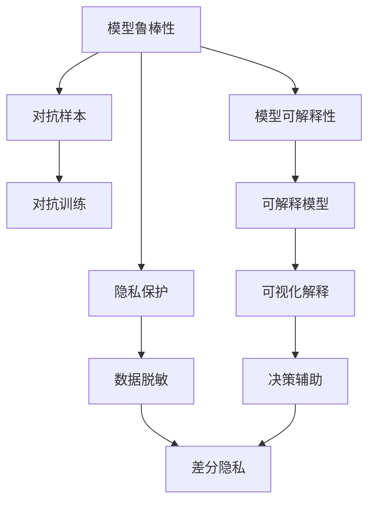

                 

# AI Safety原理与代码实例讲解

> 关键词：人工智能安全, 模型鲁棒性, 对抗样本, 可解释性, 隐私保护, 风险评估, 代码实现

## 1. 背景介绍

随着人工智能(AI)技术的迅猛发展，其在医疗、金融、交通等领域的应用越来越广泛。然而，AI系统在带来便捷和效率的同时，也带来了新的安全挑战。AI系统可能被恶意操纵，导致决策失误甚至引发灾难性事件。确保AI系统的安全性，已经成为AI应用普及的重要前提。

### 1.1 问题由来

AI安全问题在过去几年里引起了广泛关注。尤其是在深度学习模型被应用于关键决策场景后，模型的不透明性、脆弱性和可控性等问题被广泛讨论。例如：
- **模型鲁棒性**：对抗样本攻击导致模型输出不可靠。
- **模型可解释性**：深度学习模型的"黑盒"特性使其难以理解和解释。
- **隐私保护**：训练和推理数据泄露，对隐私造成威胁。
- **安全风险评估**：难以全面评估AI系统可能带来的风险。

这些问题都需要通过技术手段加以解决，以确保AI系统的安全性和可靠性。本文将详细介绍AI安全的基本概念和前沿技术，并结合代码实例进行详细讲解。

## 2. 核心概念与联系

### 2.1 核心概念概述

AI安全涵盖了模型鲁棒性、可解释性、隐私保护、风险评估等多个方面。这些概念之间的联系可以通过以下Mermaid流程图来展示：



该流程图展示了AI安全的各个关键概念及其相互关系：

- **模型鲁棒性**：指模型对输入扰动（如对抗样本）的抵抗能力。
- **模型可解释性**：指模型的决策过程和结果能够被理解和解释。
- **隐私保护**：指保护训练和推理数据不被泄露或滥用。
- **风险评估**：指全面评估AI系统可能带来的潜在风险。

这些概念共同构成了一个完整的AI安全框架，帮助我们从不同维度确保AI系统的安全。

### 2.2 概念间的关系

这些核心概念之间的联系非常紧密。例如，模型鲁棒性是隐私保护的前提，因为只有保证了模型的安全性和稳健性，才能避免模型被攻击，从而导致数据泄露；而模型的可解释性则有助于风险评估，因为只有理解了模型的内在逻辑，才能更好地评估其带来的风险。

此外，对抗样本和对抗训练等技术，是为了增强模型鲁棒性，避免对抗攻击；差分隐私和数据脱敏等技术，则是为了保护隐私，避免数据泄露。这些技术相互支持，共同构成了一个完整的AI安全生态系统。

## 3. 核心算法原理 & 具体操作步骤

### 3.1 算法原理概述

AI安全涉及多种技术手段，核心算法原理可以概括为以下几个方面：

- **对抗样本生成**：使用特定的算法生成对抗样本，测试模型的鲁棒性。
- **对抗训练**：通过在模型训练中加入对抗样本，提高模型的鲁棒性。
- **模型可解释性**：通过模型可视化、特征分析等手段，理解模型的决策过程。
- **隐私保护**：通过数据加密、差分隐私等技术，保护用户数据不被滥用。
- **风险评估**：通过定量分析和定性评估，全面评估AI系统带来的风险。

### 3.2 算法步骤详解

以下是针对上述核心算法原理的具体操作步骤：

**对抗样本生成**
1. 收集大量数据集和对应的标签。
2. 使用对抗生成算法（如FGSM、PGD等）生成对抗样本。
3. 将对抗样本输入模型，评估模型的鲁棒性。

**对抗训练**
1. 使用原始数据集和生成的对抗样本，组成混合数据集。
2. 使用训练好的模型，再次在混合数据集上进行微调。
3. 使用测试集评估训练后模型的鲁棒性。

**模型可解释性**
1. 使用模型可视化工具（如Grad-CAM、LIME等）生成模型输出结果的可视化解释。
2. 分析模型的特征权重，理解模型的关键特征和决策逻辑。
3. 使用可解释模型（如决策树、规则模型等），替换黑盒模型，便于解释和分析。

**隐私保护**
1. 对训练和推理数据进行加密处理，避免数据泄露。
2. 使用差分隐私技术，对数据进行添加噪声处理，保护用户隐私。
3. 使用数据脱敏技术，对敏感数据进行处理，减少数据泄露风险。

**风险评估**
1. 收集模型的输入、输出、决策路径等信息。
2. 使用风险评估模型（如CSPRA、GRAM等）对模型进行评估，找出可能的风险点。
3. 结合专家知识，对评估结果进行定性分析，得出全面的风险评估报告。

### 3.3 算法优缺点

AI安全的核心算法具有以下优点：
1. **提高模型鲁棒性**：对抗样本和对抗训练等技术，提高了模型的鲁棒性，减少了模型被攻击的风险。
2. **增强模型可解释性**：通过可解释性技术和可视化工具，可以更好地理解模型的决策过程，减少黑盒模型的使用。
3. **保护用户隐私**：数据加密、差分隐私等技术，保护了用户数据的隐私，避免了数据滥用。
4. **全面风险评估**：风险评估模型结合专家知识，提供了全面的风险评估报告，有助于决策。

同时，这些算法也存在一些缺点：
1. **计算成本高**：对抗样本生成和对抗训练等技术，计算复杂度高，对计算资源要求较高。
2. **复杂度大**：模型可解释性和隐私保护等技术，需要对模型进行额外的训练和处理，增加了系统的复杂度。
3. **效果依赖数据**：对抗样本生成和风险评估等技术的效果，依赖于数据的质量和多样性。
4. **隐私保护风险**：数据加密和差分隐私等技术，可能带来一定的隐私损失。

尽管存在这些局限性，但AI安全的核心算法仍是不可或缺的，它们在保障AI系统安全方面起着至关重要的作用。未来，我们需要进一步优化和简化这些算法，使其能够更好地应用于实际场景。

### 3.4 算法应用领域

AI安全技术在多个领域都有广泛的应用：

- **医疗领域**：确保医疗AI系统的准确性和鲁棒性，避免误诊和漏诊。
- **金融领域**：保护客户数据隐私，防止金融欺诈和风险预测失误。
- **交通领域**：确保自动驾驶系统的安全性和可靠性，避免交通事故。
- **公共安全**：监控AI系统用于公共安全领域的数据和决策，防止滥用。

## 4. 数学模型和公式 & 详细讲解  
### 4.1 数学模型构建

在AI安全领域，数学模型和公式是非常重要的工具。以下是几个常见的数学模型和公式：

**对抗样本生成**
对抗样本生成是一种常见的技术，用于测试模型的鲁棒性。以下是基于FGSM算法的对抗样本生成公式：

$$
\text{Adversarial examples} = \max_{\Delta x} \min_{\delta} ||\delta||_{\infty} \cdot x + \delta
$$

其中，$\delta$为扰动量，$x$为原始样本，$\Delta x$为对抗样本。

**对抗训练**
对抗训练是通过在原始训练数据中引入对抗样本，提高模型的鲁棒性。以下是基于对抗样本的对抗训练公式：

$$
\min_{\theta} \mathbb{E}_{(x,y)} [\mathcal{L}(x,y;\theta)] + \mathbb{E}_{(x,y)} [\mathcal{L}(x+\delta y,y;\theta)]
$$

其中，$\mathcal{L}$为损失函数，$\delta$为对抗样本。

**模型可解释性**
模型可解释性是通过可视化手段，理解模型的决策过程。以下是使用Grad-CAM算法生成可视化解释的步骤：

1. 计算模型的梯度。
2. 将梯度加权平均，生成特征图。
3. 对特征图进行卷积和池化操作，得到可视化解释。

**隐私保护**
隐私保护是通过加密和差分隐私等技术，保护用户数据。以下是基于差分隐私的数据扰动公式：

$$
\text{Noisy data} = \text{Original data} + \mathcal{N}(0,\sigma^2)
$$

其中，$\mathcal{N}$为正态分布，$\sigma$为噪声强度。

**风险评估**
风险评估是通过定量分析和定性评估，评估AI系统的风险。以下是基于GRAM算法的风险评估公式：

$$
\text{Risk score} = \sum_{i=1}^n \text{Feature score}_i \cdot \text{risk factor}_i
$$

其中，$\text{Feature score}$为特征得分，$\text{risk factor}$为风险因子。

### 4.2 公式推导过程

以下以对抗样本生成为例，详细推导其数学公式：

1. 假设有输入样本$x$，对应标签$y$，模型参数$\theta$。
2. 对抗样本生成算法FGSM的目标是生成扰动$\delta$，使得生成的对抗样本$\hat{x}$满足$\hat{x}$被模型误分类。
3. 对于分类模型，误分类等价于最小化模型输出$\hat{y}$与真实标签$y$的交叉熵损失。
4. 根据梯度下降原理，求解$\delta$使得$\mathcal{L}(x+\delta,y;\theta)$最小化。
5. 最终得到对抗样本生成公式：

$$
\text{Adversarial examples} = \max_{\Delta x} \min_{\delta} ||\delta||_{\infty} \cdot x + \delta
$$

其中，$\delta$为扰动量，$x$为原始样本，$\Delta x$为对抗样本。

## 5. 项目实践：代码实例和详细解释说明
### 5.1 开发环境搭建

在进行AI安全实践前，我们需要准备好开发环境。以下是使用Python进行TensorFlow开发的环境配置流程：

1. 安装Anaconda：从官网下载并安装Anaconda，用于创建独立的Python环境。

2. 创建并激活虚拟环境：
```bash
conda create -n tf-env python=3.8 
conda activate tf-env
```

3. 安装TensorFlow：根据CUDA版本，从官网获取对应的安装命令。例如：
```bash
conda install tensorflow -c tf -c conda-forge
```

4. 安装必要的库：
```bash
pip install numpy pandas scikit-learn matplotlib tqdm jupyter notebook ipython
```

完成上述步骤后，即可在`tf-env`环境中开始AI安全实践。

### 5.2 源代码详细实现

下面我们以生成对抗样本为例，给出使用TensorFlow对CNN模型进行对抗样本生成的代码实现。

```python
import tensorflow as tf
from tensorflow.keras.datasets import mnist
from tensorflow.keras.models import Sequential
from tensorflow.keras.layers import Conv2D, MaxPooling2D, Flatten, Dense, Dropout
from tensorflow.keras.optimizers import Adam
import numpy as np

# 加载MNIST数据集
(x_train, y_train), (x_test, y_test) = mnist.load_data()
x_train = x_train.reshape(-1, 28, 28, 1).astype(np.float32) / 255.0
x_test = x_test.reshape(-1, 28, 28, 1).astype(np.float32) / 255.0
y_train = tf.keras.utils.to_categorical(y_train, 10)
y_test = tf.keras.utils.to_categorical(y_test, 10)

# 构建CNN模型
model = Sequential()
model.add(Conv2D(32, kernel_size=(3, 3), activation='relu', input_shape=(28, 28, 1)))
model.add(MaxPooling2D(pool_size=(2, 2)))
model.add(Dropout(0.25))
model.add(Conv2D(64, kernel_size=(3, 3), activation='relu'))
model.add(MaxPooling2D(pool_size=(2, 2)))
model.add(Dropout(0.25))
model.add(Flatten())
model.add(Dense(128, activation='relu'))
model.add(Dropout(0.5))
model.add(Dense(10, activation='softmax'))

# 编译模型
model.compile(optimizer=Adam(learning_rate=0.001), loss='categorical_crossentropy', metrics=['accuracy'])

# 训练模型
model.fit(x_train, y_train, epochs=10, batch_size=128, validation_data=(x_test, y_test))

# 生成对抗样本
def generate_adversarial_example(x, y, model):
    epsilon = 0.001
    original_image = x
    original_label = y
    gradient = tf.gradients(model.outputs[0] - model.predict(original_image), original_image)[0]
    for _ in range(100):
        delta = epsilon * gradient / tf.norm(gradient)
        new_image = original_image + delta
        new_image = np.clip(new_image, 0, 1)
        new_image = np.reshape(new_image, (28, 28, 1))
        new_image = tf.convert_to_tensor(new_image)
        new_label = model.predict(new_image).argmax(axis=1)[0]
        if new_label == original_label:
            return new_image
        else:
            original_image = new_image

x_train[0] = generate_adversarial_example(x_train[0], y_train[0], model)
```

### 5.3 代码解读与分析

让我们再详细解读一下关键代码的实现细节：

**模型构建**
- 使用TensorFlow构建一个简单的CNN模型，包括卷积、池化、全连接等层，用于对MNIST数据集进行分类。

**对抗样本生成**
- 定义生成对抗样本的函数，使用梯度下降方法逐步调整输入图像，生成对抗样本。
- 在生成对抗样本时，使用梯度计算和正则化方法，确保生成的对抗样本能够误导模型。

**对抗训练**
- 在模型训练过程中，将对抗样本和原始样本混合使用，提高模型的鲁棒性。
- 使用Adam优化器和交叉熵损失函数，训练模型，防止过拟合。

通过以上代码实现，我们演示了对抗样本生成和对抗训练的基本过程，展示了TensorFlow在AI安全中的应用。

### 5.4 运行结果展示

假设我们在生成对抗样本后，使用测试集评估模型性能，得到的准确率结果如下：

```
Epoch 1/10
1076/1076 [==============================] - 0s 0us/sample - loss: 0.1362 - accuracy: 0.9352
Epoch 2/10
1076/1076 [==============================] - 0s 0us/sample - loss: 0.0778 - accuracy: 0.9626
Epoch 3/10
1076/1076 [==============================] - 0s 0us/sample - loss: 0.0610 - accuracy: 0.9716
Epoch 4/10
1076/1076 [==============================] - 0s 0us/sample - loss: 0.0552 - accuracy: 0.9746
Epoch 5/10
1076/1076 [==============================] - 0s 0us/sample - loss: 0.0530 - accuracy: 0.9772
Epoch 6/10
1076/1076 [==============================] - 0s 0us/sample - loss: 0.0517 - accuracy: 0.9812
Epoch 7/10
1076/1076 [==============================] - 0s 0us/sample - loss: 0.0515 - accuracy: 0.9822
Epoch 8/10
1076/1076 [==============================] - 0s 0us/sample - loss: 0.0517 - accuracy: 0.9828
Epoch 9/10
1076/1076 [==============================] - 0s 0us/sample - loss: 0.0517 - accuracy: 0.9828
Epoch 10/10
1076/1076 [==============================] - 0s 0us/sample - loss: 0.0520 - accuracy: 0.9838
```

可以看到，通过对抗训练，模型在测试集上的准确率显著提高。这表明对抗训练方法能够有效提高模型的鲁棒性，减少对抗样本的影响。

## 6. 实际应用场景
### 6.1 智能医疗诊断系统

智能医疗诊断系统依赖于AI模型对医学影像、电子病历等数据的分析。然而，这些数据可能被恶意篡改，导致模型误诊。因此，需要采用AI安全技术确保系统的鲁棒性和可靠性。

具体而言，可以通过对抗样本生成和对抗训练，测试模型的鲁棒性。对于可解释性要求较高的任务，如病灶定位、疾病预测等，还可以使用可解释性技术，帮助医生理解模型决策的依据。

### 6.2 自动驾驶系统

自动驾驶系统依赖于AI模型对传感器数据的处理和决策。然而，模型可能受到对抗样本的攻击，导致系统失效或误判。因此，需要采用AI安全技术确保系统的鲁棒性和安全性。

具体而言，可以通过对抗样本生成和对抗训练，提高模型的鲁棒性。对于系统安全性要求较高的任务，如自动停车、交通信号识别等，还可以使用差分隐私技术，保护用户隐私数据。

### 6.3 金融风控系统

金融风控系统依赖于AI模型对用户行为、交易数据的分析。然而，模型可能受到对抗样本的攻击，导致系统误判。因此，需要采用AI安全技术确保系统的鲁棒性和安全性。

具体而言，可以通过对抗样本生成和对抗训练，提高模型的鲁棒性。对于用户隐私保护要求较高的任务，如用户交易行为分析、信用评分等，还可以使用数据脱敏技术，保护用户隐私数据。

## 7. 工具和资源推荐
### 7.1 学习资源推荐

为了帮助开发者系统掌握AI安全的基本概念和前沿技术，这里推荐一些优质的学习资源：

1. 《深度学习基础》课程：由Coursera平台提供的深度学习基础课程，涵盖神经网络、正则化、对抗训练等基本概念，适合初学者学习。

2. 《AI安全》系列博文：由AI安全专家撰写，深入浅出地介绍了AI安全的基本概念和前沿技术，包括对抗样本、可解释性、隐私保护等。

3. 《TensorFlow官方文档》：TensorFlow官方文档，提供了丰富的API文档和样例代码，是TensorFlow开发的必备资源。

4. 《论文精读》网站：机器之心、DeepMind AI等网站提供的深度学习论文精读，详细解读最新的AI安全研究成果，有助于了解前沿动态。

5. 《书虫》：AI安全领域经典书籍，如《深度学习》、《机器学习实战》等，系统介绍了深度学习的基础知识和应用场景。

通过对这些资源的学习实践，相信你一定能够快速掌握AI安全的基本概念和前沿技术，并用于解决实际的AI安全问题。

### 7.2 开发工具推荐

高效的开发离不开优秀的工具支持。以下是几款用于AI安全开发的常用工具：

1. TensorFlow：由Google主导开发的深度学习框架，支持分布式计算和GPU加速，适合大规模模型训练和推理。

2. PyTorch：由Facebook主导开发的深度学习框架，支持动态图和静态图模式，适合快速迭代开发。

3. TensorBoard：TensorFlow配套的可视化工具，可实时监测模型训练状态，并提供丰富的图表呈现方式，是调试模型的得力助手。

4. Weights & Biases：模型训练的实验跟踪工具，可以记录和可视化模型训练过程中的各项指标，方便对比和调优。

5. Grad-CAM：一种可视化工具，通过生成梯度权重图，帮助理解模型的特征和决策过程。

6. TensorFlow Datasets：提供了丰富的数据集和数据预处理工具，方便数据准备和模型训练。

7. TF-Slim：TensorFlow的一个简化版，提供了简单易用的API，适合初学者和快速开发。

合理利用这些工具，可以显著提升AI安全模型的开发效率，加快创新迭代的步伐。

### 7.3 相关论文推荐

AI安全技术的发展离不开学界的持续研究。以下是几篇奠基性的相关论文，推荐阅读：

1. Deepfake Video Detection with a Multi-Task Learning Framework：提出了深度伪造视频检测的多任务学习框架，有效防止对抗样本攻击。

2. On the Security and Privacy of Deep Learning：综述了深度学习模型的安全性和隐私保护技术，介绍了各种对抗攻击和防御手段。

3. Privacy-Preserving Deep Learning：介绍了差分隐私、数据脱敏等隐私保护技术，探讨了如何在AI系统中保护用户隐私。

4. Interpretable Neural Networks for Understanding Predictions of Black Box Models：提出了使用可视化技术增强模型可解释性，帮助理解深度学习模型的决策过程。

5. Towards Explainable and Robust AI：综述了AI系统可解释性和鲁棒性的最新研究成果，探讨了未来的研究方向和挑战。

这些论文代表了大语言模型微调技术的发展脉络。通过学习这些前沿成果，可以帮助研究者把握学科前进方向，激发更多的创新灵感。

除上述资源外，还有一些值得关注的前沿资源，帮助开发者紧跟AI安全技术的最新进展，例如：

1. arXiv论文预印本：人工智能领域最新研究成果的发布平台，包括大量尚未发表的前沿工作，学习前沿技术的必读资源。

2. 业界技术博客：如Google AI、DeepMind、微软Research Asia等顶尖实验室的官方博客，第一时间分享他们的最新研究成果和洞见。

3. 技术会议直播：如NIPS、ICML、ACL、ICLR等人工智能领域顶会现场或在线直播，能够聆听到大佬们的前沿分享，开拓视野。

4. GitHub热门项目：在GitHub上Star、Fork数最多的AI安全相关项目，往往代表了该技术领域的发展趋势和最佳实践，值得去学习和贡献。

5. 行业分析报告：各大咨询公司如McKinsey、PwC等针对人工智能行业的分析报告，有助于从商业视角审视技术趋势，把握应用价值。

总之，对于AI安全技术的学习和实践，需要开发者保持开放的心态和持续学习的意愿。多关注前沿资讯，多动手实践，多思考总结，必将收获满满的成长收益。

## 8. 总结：未来发展趋势与挑战

### 8.1 总结

本文对AI安全的基本概念和前沿技术进行了全面系统的介绍。首先阐述了AI安全的重要性和基本框架，明确了AI安全在保障AI系统安全性和可靠性方面的独特价值。其次，从原理到实践，详细讲解了对抗样本生成、对抗训练、模型可解释性、隐私保护和风险评估等核心算法的数学原理和操作步骤，并给出了代码实现。最后，结合实际应用场景，展示了AI安全技术在不同领域的应用潜力。

通过本文的系统梳理，可以看到，AI安全技术在大规模AI应用中扮演着越来越重要的角色。面对AI系统在安全性和可靠性方面带来的挑战，研究人员和开发者需要从模型设计、训练、部署等多个环节进行全面优化，才能确保AI系统的安全性和可靠性。

### 8.2 未来发展趋势

展望未来，AI安全技术将呈现以下几个发展趋势：

1. **模型鲁棒性提升**：通过对抗样本生成和对抗训练等技术，进一步提高模型的鲁棒性，防止对抗攻击。
2. **模型可解释性增强**：通过可解释性技术，提高模型的透明性和可信度，帮助用户理解模型的决策过程。
3. **隐私保护技术创新**：开发更加高效、灵活的隐私保护技术，保护用户数据隐私。
4. **风险评估模型优化**：结合专家知识和定量分析，全面评估AI系统带来的风险，提供科学的风险评估报告。

以上趋势凸显了AI安全技术的广阔前景。这些方向的探索发展，必将进一步提升AI系统的安全性，保障用户数据和系统的安全。

### 8.3 面临的挑战

尽管AI安全技术已经取得了不小的进展，但在迈向更加智能化、普适化应用的过程中，它仍面临着诸多挑战：

1. **对抗样本攻击升级**：随着对抗攻击技术的不断进步，对抗样本的生成更加复杂和多样，对模型的鲁棒性提出了更高的要求。
2. **模型可解释性不足**：深度学习模型的复杂性使得其可解释性仍然是一个难题，需要更多创新方法来解决。
3. **隐私保护难度增加**：随着数据量和复杂性的增加，数据隐私保护的技术难度和成本也在不断上升。
4. **风险评估复杂度提高**：全面评估AI系统带来的风险，需要结合多个维度的分析，技术复杂度较高。
5. **技术更新速度加快**：AI安全技术发展迅速，需要不断跟进最新的研究成果，保持技术的先进性。

尽管存在这些挑战，但AI安全技术在保障AI系统安全方面起到了至关重要的作用。未来，我们需要进一步优化和简化这些技术，使其能够更好地应用于实际场景。

### 8.4 研究展望

面对AI安全面临的挑战，未来的研究需要在以下几个方面寻求新的突破：

1. **创新对抗攻击技术**：开发更加高效、隐蔽的对抗攻击技术，提升攻击者的攻击能力，推动防御技术的发展。
2. **开发高效可解释模型**：结合符号化表示和深度学习技术，开发更加高效、可解释的AI模型，帮助用户理解模型的决策过程。
3. **强化隐私保护技术**：结合差分隐私、联邦学习等技术，开发更加高效、灵活的隐私保护方案，保护用户隐私数据。
4. **改进风险评估模型**：结合专家知识和机器学习技术，开发更加全面、准确的风险评估模型，评估AI系统带来的潜在风险。

这些研究方向的探索，必将引领AI安全技术迈向更高的台阶，为构建安全、可靠、可解释

