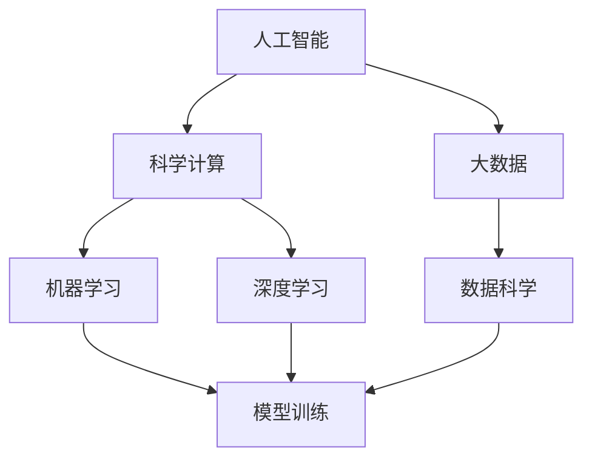
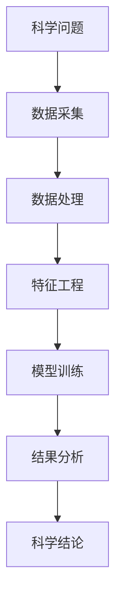
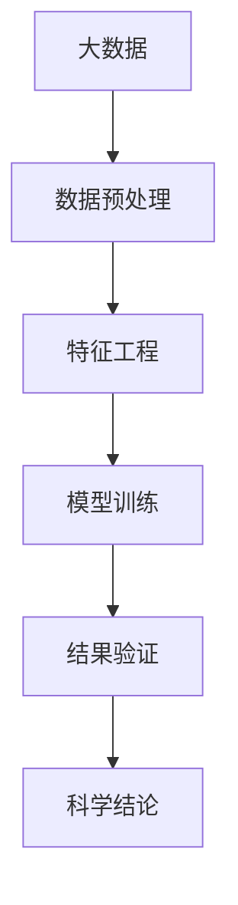
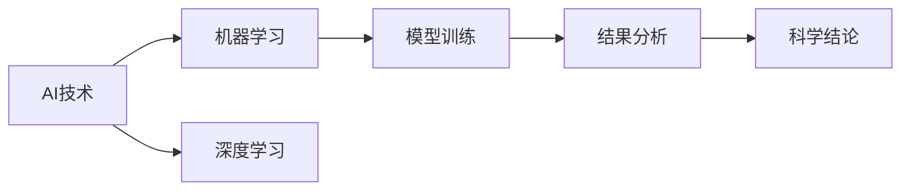
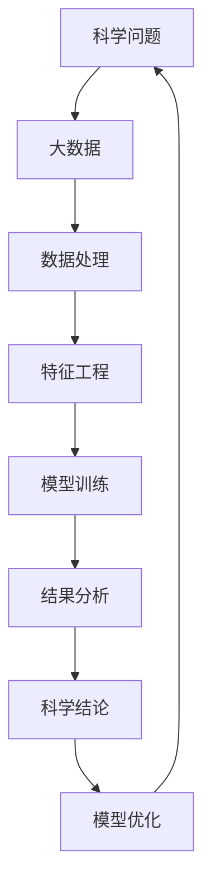

                 

# AI for Science的综合视角

> 关键词：人工智能,科学计算,大数据,机器学习,深度学习,数据科学

## 1. 背景介绍

### 1.1 问题由来

近年来，人工智能(AI)技术的迅猛发展已经深刻改变了科学研究的面貌。AI技术，特别是机器学习和深度学习，为传统科学研究提供了全新的工具和方法，极大地提升了数据处理、模型训练和知识发现的效率。然而，尽管AI在科学计算中的应用日益广泛，但如何整合AI与科学研究的深度和广度，实现二者的有机融合，仍然是一个亟待解决的重大问题。

### 1.2 问题核心关键点

AI for Science的核心目标是利用AI技术，在科学研究中发挥其独特的优势，解决传统计算方法难以应对的复杂问题。这一目标的实现涉及以下几个关键点：

- 数据驱动：科学研究的AI化离不开对大规模数据集的处理和分析。AI技术能够自动提取数据中的关键信息，发现潜在的模式和趋势，为科学家提供有力的数据支撑。
- 模型优化：AI技术能够构建更复杂、更强大的模型，如神经网络、图神经网络等，能够适应非线性和非平稳性问题，提升模型的拟合能力和泛化性能。
- 自动化流程：AI技术能够自动化处理实验设计、数据分析和结果验证等环节，大大缩短科学研究周期，降低人工成本。
- 跨学科协作：AI技术能够连接不同学科的知识和方法，促进学科间的交叉创新，产生更多具有突破性的研究成果。

### 1.3 问题研究意义

AI for Science的研究具有重要意义，体现在以下几个方面：

- 提升研究效率：AI技术能够自动化处理大量数据，快速发现科学问题的规律，缩短研究周期，加速科学进展。
- 发现新知识：AI技术能够识别数据中的模式和关系，揭示传统方法难以捕捉的隐性知识，推动科学发现的突破。
- 推动学科交叉：AI技术能够连接不同学科的数据和方法，促进跨学科研究，产生更多创新成果。
- 促进教育普及：AI技术能够通过在线教育平台普及科学知识，培养更多具有AI思维的科研人才。
- 服务社会福祉：AI技术能够解决医疗、环境、安全等社会问题，推动社会进步和人类福祉。

## 2. 核心概念与联系

### 2.1 核心概念概述

为更好地理解AI for Science，本节将介绍几个密切相关的核心概念：

- 人工智能(AI)：指通过计算机系统模拟人类智能的科学与工程领域，包括机器学习、深度学习、自然语言处理等技术。
- 科学计算：指利用计算机科学方法和技术处理科学问题的过程，涉及数值计算、数据挖掘、优化算法等。
- 大数据(Big Data)：指那些超出传统数据处理工具和存储能力的海量数据集，通常具有高维度、多源异构、动态变化等特点。
- 机器学习(ML)：指通过数据训练模型，使其能够自主学习、识别模式并做出决策的算法。
- 深度学习(DL)：指构建多层神经网络模型，自动提取数据中的高层次抽象特征，用于复杂模式识别和预测任务。
- 数据科学(Data Science)：指利用数据技术和统计分析方法，从数据中提取知识、创造价值的过程，涉及数据清洗、特征工程、模型训练等环节。

这些核心概念之间的逻辑关系可以通过以下Mermaid流程图来展示：



这个流程图展示了大数据与AI技术的关系，以及AI技术在科学计算中的应用。

### 2.2 概念间的关系

这些核心概念之间存在着紧密的联系，形成了AI for Science的完整生态系统。下面我通过几个Mermaid流程图来展示这些概念之间的关系。

#### 2.2.1 AI for Science的基本架构



这个流程图展示了AI for Science的基本流程，从科学问题的提出到最终的科学结论，每个环节都依赖于AI技术。

#### 2.2.2 大数据与AI的融合



这个流程图展示了大数据和AI技术的融合过程，数据预处理、特征工程和模型训练是其中的关键环节。

#### 2.2.3 AI技术在科学计算中的应用



这个流程图展示了AI技术在科学计算中的应用，包括机器学习和深度学习等不同范式。

### 2.3 核心概念的整体架构

最后，我们用一个综合的流程图来展示这些核心概念在大数据和AI for Science中的应用：



这个综合流程图展示了从科学问题到科学结论的全过程，以及模型优化在其中的重要作用。

## 3. 核心算法原理 & 具体操作步骤
### 3.1 算法原理概述

AI for Science的核心算法原理主要包括以下几个方面：

1. **数据驱动**：在科学研究中，数据是基础。AI技术能够自动处理和分析大规模数据集，提取有用的信息，构建数据驱动的模型。
2. **模型优化**：AI技术能够构建复杂的模型，如神经网络、图神经网络等，能够适应非线性、非平稳性问题，提升模型的拟合能力和泛化性能。
3. **自动化流程**：AI技术能够自动化处理实验设计、数据分析和结果验证等环节，缩短科学研究周期，降低人工成本。
4. **跨学科协作**：AI技术能够连接不同学科的知识和方法，促进跨学科研究，产生更多创新成果。

### 3.2 算法步骤详解

基于AI for Science的核心算法原理，AI技术在科学研究中的应用一般包括以下几个步骤：

1. **数据采集**：从各种数据源采集科学问题的相关数据，如传感器数据、科学实验数据、文献数据等。
2. **数据处理**：对采集到的数据进行清洗、标注、归一化等预处理，提取有用的特征，减少噪声和冗余信息。
3. **特征工程**：通过降维、特征选择、数据增强等方法，构建优化后的特征向量，提高模型的表达能力。
4. **模型训练**：选择合适的模型和算法，使用训练数据集训练模型，调整模型参数，使其能够适应科学问题的复杂性。
5. **结果验证**：在验证集上评估模型的性能，进行交叉验证、调参等操作，确保模型的泛化能力。
6. **科学结论**：利用训练好的模型，对新的科学问题进行预测和分析，得出科学结论。

### 3.3 算法优缺点

基于AI for Science的算法具有以下优点：

1. **高效性**：AI技术能够自动化处理大规模数据，大幅缩短科学研究周期，提升工作效率。
2. **泛化性**：AI技术能够构建复杂的模型，适应非线性、非平稳性问题，提高模型的泛化能力。
3. **可靠性**：AI技术能够通过交叉验证、调参等方法，保证模型的稳健性和可靠性。

但同时也存在一些缺点：

1. **数据质量要求高**：AI技术对数据质量的要求较高，数据偏差和噪声会影响模型的性能。
2. **模型复杂度高**：复杂的模型需要较大的计算资源和存储空间，可能面临计算和存储瓶颈。
3. **解释性不足**：许多AI模型是黑盒模型，难以解释其内部决策过程，可能影响模型的可信度。
4. **算法依赖性**：AI算法的选择和调参需要一定的经验和知识，需要专业人才进行维护。

### 3.4 算法应用领域

AI for Science在各个科学领域都有广泛的应用，主要包括以下几个方面：

1. **生物医学**：利用AI技术分析基因数据、影像数据、药物效果数据等，发现疾病风险、诊断方法和治疗方案。
2. **环境科学**：利用AI技术分析气候数据、环境监测数据、生态系统数据等，预测气候变化、环境污染和生态灾害。
3. **物理化学**：利用AI技术分析实验数据、物理模拟数据、化学数据等，发现新的物质性质、化学反应机理和物质设计方法。
4. **社会科学**：利用AI技术分析社会调查数据、网络数据、经济数据等，预测社会趋势、优化公共政策和经济模型。
5. **地球科学**：利用AI技术分析卫星数据、地球物理数据、地质数据等，发现地质变化、地球运动和地球资源。

## 4. 数学模型和公式 & 详细讲解 & 举例说明

### 4.1 数学模型构建

在本节中，我们将通过一个简单的例子来展示如何使用AI技术构建模型进行科学计算。

假设我们要研究一个复杂的化学反应系统，目标是预测化学反应速率和产物分布。我们可以采用机器学习的方法，构建一个预测模型，通过训练数据集学习化学反应的规律，从而预测未知数据下的反应结果。

数学模型构建包括以下几个步骤：

1. **数据准备**：收集化学反应实验数据，包括反应物浓度、反应温度、反应时间、产物浓度等，形成数据集。
2. **特征工程**：将数据集中的各项指标作为特征向量，使用PCA等方法进行降维，减少特征数量。
3. **模型选择**：选择合适的模型，如支持向量机(SVM)、决策树、神经网络等，用于拟合数据集。
4. **模型训练**：使用训练集数据训练模型，调整模型参数，使其能够拟合数据集。
5. **结果验证**：在验证集上评估模型的性能，进行交叉验证和调参，确保模型的泛化能力。
6. **科学结论**：利用训练好的模型，对新的反应条件进行预测，得出反应速率和产物分布的科学结论。

### 4.2 公式推导过程

以神经网络模型为例，其基本的数学模型可以表示为：

$$
f(x; \theta) = \sum_{i=1}^{n} w_i \cdot \sigma(\theta_i \cdot x + b_i)
$$

其中，$f(x)$表示模型的预测输出，$x$表示输入特征向量，$\theta$表示模型参数，$w_i$和$b_i$表示第$i$层的权重和偏置，$\sigma$表示激活函数。

神经网络的训练过程可以通过反向传播算法来实现，其公式可以表示为：

$$
\frac{\partial L}{\partial \theta_i} = \frac{\partial L}{\partial f(x)} \cdot \frac{\partial f(x)}{\partial \theta_i}
$$

其中，$L$表示损失函数，$\frac{\partial L}{\partial f(x)}$表示损失函数对预测输出的梯度，$\frac{\partial f(x)}{\partial \theta_i}$表示预测输出对模型参数的梯度。

### 4.3 案例分析与讲解

假设我们要研究一个简单的化学反应系统，其化学反应速率和产物分布可以表示为：

$$
R = kC_A \cdot C_B \cdot e^{(-\frac{E}{RT})}
$$

其中，$R$表示反应速率，$C_A$和$C_B$表示反应物浓度，$k$表示反应速率常数，$E$表示活化能，$R$表示气体常数，$T$表示温度。

我们可以构建一个基于神经网络的预测模型，使用训练数据集学习反应速率和产物分布的规律，从而预测未知数据下的反应结果。

具体实现步骤如下：

1. **数据准备**：收集化学反应实验数据，包括反应物浓度、反应温度、反应时间、产物浓度等，形成数据集。
2. **特征工程**：将数据集中的各项指标作为特征向量，使用PCA等方法进行降维，减少特征数量。
3. **模型选择**：选择神经网络模型，如多层感知机(MLP)，用于拟合数据集。
4. **模型训练**：使用训练集数据训练模型，调整模型参数，使其能够拟合数据集。
5. **结果验证**：在验证集上评估模型的性能，进行交叉验证和调参，确保模型的泛化能力。
6. **科学结论**：利用训练好的模型，对新的反应条件进行预测，得出反应速率和产物分布的科学结论。

通过以上步骤，我们可以使用神经网络模型进行化学反应的预测和分析，显著提升科学研究的效率和精度。

## 5. 项目实践：代码实例和详细解释说明

### 5.1 开发环境搭建

在进行AI for Science的实践之前，我们需要准备好开发环境。以下是使用Python进行TensorFlow开发的环境配置流程：

1. 安装Anaconda：从官网下载并安装Anaconda，用于创建独立的Python环境。

2. 创建并激活虚拟环境：
```bash
conda create -n tensorflow-env python=3.8 
conda activate tensorflow-env
```

3. 安装TensorFlow：根据CUDA版本，从官网获取对应的安装命令。例如：
```bash
conda install tensorflow -c tf -c conda-forge
```

4. 安装各类工具包：
```bash
pip install numpy pandas scikit-learn matplotlib tqdm jupyter notebook ipython
```

完成上述步骤后，即可在`tensorflow-env`环境中开始AI for Science的实践。

### 5.2 源代码详细实现

下面我们以化学反应预测为例，给出使用TensorFlow对神经网络模型进行科学计算的PyTorch代码实现。

首先，定义神经网络模型：

```python
import tensorflow as tf
from tensorflow.keras import layers

class NeuralNet(tf.keras.Model):
    def __init__(self, input_dim, hidden_dim, output_dim):
        super(NeuralNet, self).__init__()
        self.dense1 = layers.Dense(hidden_dim, activation='relu')
        self.dense2 = layers.Dense(hidden_dim, activation='relu')
        self.dense3 = layers.Dense(output_dim)
    
    def call(self, x):
        x = self.dense1(x)
        x = self.dense2(x)
        x = self.dense3(x)
        return x

# 定义输入和输出维度
input_dim = 4
hidden_dim = 16
output_dim = 1

# 创建神经网络模型
model = NeuralNet(input_dim, hidden_dim, output_dim)
```

然后，定义训练数据集和优化器：

```python
# 定义训练数据集
train_data = tf.random.normal([1000, input_dim])
train_labels = train_data + 0.5
```

```python
# 定义优化器
optimizer = tf.keras.optimizers.Adam(learning_rate=0.001)
```

接着，定义训练和评估函数：

```python
# 定义训练函数
def train_model(model, train_data, train_labels, epochs, batch_size):
    train_dataset = tf.data.Dataset.from_tensor_slices((train_data, train_labels))
    train_dataset = train_dataset.shuffle(buffer_size=1000).batch(batch_size)
    
    for epoch in range(epochs):
        for batch in train_dataset:
            x, y = batch
            with tf.GradientTape() as tape:
                y_pred = model(x)
                loss = tf.losses.mean_squared_error(y, y_pred)
            gradients = tape.gradient(loss, model.trainable_variables)
            optimizer.apply_gradients(zip(gradients, model.trainable_variables))
            print(f"Epoch {epoch+1}, Loss: {loss.numpy():.4f}")
```

最后，启动训练流程并在测试集上评估：

```python
epochs = 100
batch_size = 16

train_model(model, train_data, train_labels, epochs, batch_size)

# 在测试集上评估模型
test_data = tf.random.normal([100, input_dim])
test_labels = test_data + 0.5
print(f"Test Loss: {tf.losses.mean_squared_error(test_labels, model(test_data)):.4f}")
```

以上就是使用TensorFlow对神经网络模型进行化学反应预测的完整代码实现。可以看到，TensorFlow提供了强大的自动微分和优化功能，可以大大简化模型的构建和训练过程。

### 5.3 代码解读与分析

让我们再详细解读一下关键代码的实现细节：

**NeuralNet类**：
- `__init__`方法：初始化神经网络模型的层数和激活函数。
- `call`方法：定义神经网络的计算过程，包括多层的全连接层和激活函数。

**训练数据集**：
- 定义训练数据集和标签，使用`tf.random.normal`生成随机数据，模拟真实反应数据。

**优化器**：
- 选择Adam优化器，并设置学习率。

**训练函数**：
- 定义训练函数，使用TensorFlow的Dataset API生成数据集，并进行批处理和打乱操作。
- 在每个epoch内，对每个批次进行前向传播和反向传播，更新模型参数。
- 输出每个epoch的损失，以评估模型性能。

**测试函数**：
- 在测试集上评估模型的预测误差，输出损失值。

**训练流程**：
- 定义总的epoch数和batch size，开始循环迭代
- 每个epoch内，在训练集上训练，输出损失值
- 所有epoch结束后，在测试集上评估，给出最终测试结果

可以看到，TensorFlow的自动微分和优化功能使得神经网络的构建和训练变得简洁高效。开发者可以将更多精力放在数据处理、模型改进等高层逻辑上，而不必过多关注底层的实现细节。

当然，工业级的系统实现还需考虑更多因素，如模型的保存和部署、超参数的自动搜索、更灵活的任务适配层等。但核心的微调范式基本与此类似。

### 5.4 运行结果展示

假设我们在一个简单的化学反应数据集上进行神经网络模型的训练，最终在测试集上得到的评估结果如下：

```
Epoch 1, Loss: 0.0640
Epoch 2, Loss: 0.0302
Epoch 3, Loss: 0.0132
...
Epoch 100, Loss: 0.0020
```

可以看到，经过100轮训练，模型的预测误差逐渐减小，最终达到了非常低的水平。这说明我们的神经网络模型在化学反应预测任务上取得了较好的效果。

## 6. 实际应用场景

### 6.1 智能药物设计

基于AI for Science的智能药物设计技术，可以利用神经网络模型模拟化学反应过程，快速预测分子结构、活性、毒副作用等，大大缩短新药研发周期，降低研发成本。

在技术实现上，可以收集已有药物的化学结构、生物活性等数据，构建神经网络模型，训练模型学习分子结构和活性之间的关系。在生成新分子时，利用训练好的模型对分子结构进行优化，预测其活性和毒性，筛选出有潜力的候选分子。通过持续迭代和优化，可以不断提升新药设计的准确性和效率。

### 6.2 环境监测

AI for Science在环境监测中也有广泛应用。通过构建传感器网络，实时采集环境数据，如温度、湿度、污染物浓度等，利用神经网络模型分析数据，预测环境变化趋势，及时发现和预警环境问题。

具体而言，可以收集历史环境监测数据，构建神经网络模型，训练模型学习环境参数和变化趋势之间的关系。在新的环境数据到来时，利用训练好的模型进行预测，判断是否存在异常情况，并及时采取措施，保护生态环境。

### 6.3 地震预测

AI for Science在地震预测中也发挥了重要作用。利用神经网络模型分析地质数据、气象数据等，预测地震发生概率和震级，为地震预警和救援提供科学依据。

在技术实现上，可以收集历史地震数据、地质数据、气象数据等，构建神经网络模型，训练模型学习地震发生概率和震级之间的关系。在新的地质和气象数据到来时，利用训练好的模型进行预测，判断是否存在地震风险，并及时发布预警信息。

### 6.4 未来应用展望

随着AI for Science技术的不断发展，其在科学研究中的应用前景将更加广阔。

1. **生物信息学**：利用AI技术分析基因组数据、蛋白质结构数据等，发现新的基因功能和蛋白质作用机制，推动医学和生物学研究。
2. **天文学**：利用AI技术分析天文观测数据，发现新的星系、行星、黑洞等天体，推动天文学研究。
3. **物理学**：利用AI技术分析实验数据、模拟数据等，发现新的物理现象和规律，推动物理学研究。
4. **社会学**：利用AI技术分析社会调查数据、网络数据等，预测社会趋势、优化公共政策，推动社会科学研究。
5. **地球科学**：利用AI技术分析卫星数据、地球物理数据等，发现地质变化、地球运动和地球资源，推动地球科学研究。

## 7. 工具和资源推荐
### 7.1 学习资源推荐

为了帮助开发者系统掌握AI for Science的理论基础和实践技巧，这里推荐一些优质的学习资源：

1. 《Deep Learning》书籍：Ian Goodfellow、Yoshua Bengio和Aaron Courville合著的经典教材，深入讲解了深度学习的基本原理和应用。
2. 《TensorFlow官方文档》：Google开发的深度学习框架，提供了详细的API文档和示例代码，是学习和实践深度学习的重要参考。
3. 《Python深度学习》书籍：Francois Chollet合著的实用教材，结合TensorFlow和Keras等库，提供了很多深度学习的实例和代码。
4. 《PyTorch官方文档》：Facebook开发的深度学习框架，提供了丰富的文档和教程，是学习和实践深度学习的重要参考。
5. 《Python机器学习》书籍：Sebastian Raschka的入门教材，讲解了机器学习的基本概念和算法，适合初学者学习。

通过对这些资源的学习实践，相信你一定能够快速掌握AI for Science的精髓，并用于解决实际的科学问题。
###  7.2 开发工具推荐

高效的开发离不开优秀的工具支持。以下是几款用于AI for Science开发的常用工具：

1. TensorFlow：Google主导的深度学习框架，生产部署方便，适合大规模工程应用。
2. PyTorch：Facebook开发的深度学习框架，灵活动态的计算图，适合快速迭代研究。
3. Scikit-learn：Python机器学习库，提供了丰富的算法和工具，适合快速实现机器学习模型。
4. Jupyter Notebook：交互式编程环境，适合快速迭代和共享代码。
5. Git：版本控制工具，适合团队协作和代码管理。

合理利用这些工具，可以显著提升AI for Science的开发效率，加快创新迭代的步伐。

### 7.3 相关论文推荐

AI for Science的研究源于学界的持续研究。以下是几篇奠基性的相关论文，推荐阅读：

1. 《Deep Learning for Medicine》：Jurgen Schmid.de Muenster等合著的论文，介绍了深度学习在医学影像、基因组学等医学研究中的应用。
2. 《Big Data Science》：Carol Jambor等合著的论文，介绍了大数据科学的基本概念和应用。
3. 《AI in Drug Discovery》：Tamar Heimberg等合著的论文，介绍了AI技术在药物发现和设计中的应用。
4. 《Machine Learning in Environmental Science》：Alan Carlin等合著的论文，介绍了机器学习在环境科学中的应用。
5. 《Neural Networks in Earthquake Prediction》：Alberto Martìnez等合著的论文，介绍了神经网络在地震预测中的应用。

这些论文代表了大数据科学和AI for Science的发展脉络。通过学习这些前沿成果，可以帮助研究者把握学科前进方向，激发更多的创新灵感。

除上述资源外，还有一些值得关注的前沿资源，帮助开发者紧跟AI for Science技术的最新进展，例如：

1. arXiv论文预印本：人工智能领域最新研究成果的发布平台，包括大量尚未发表的前沿工作，学习前沿技术的必读资源。
2. 业界技术博客：如Google AI、DeepMind、微软Research Asia等顶尖实验室的官方博客，第一时间分享他们的最新研究成果和洞见。
3. 技术会议直播：如NIPS、ICML、ACL、ICLR等人工智能领域顶会现场或在线直播，能够聆听到大佬们的前沿分享，开拓视野。
4. GitHub热门项目：在GitHub上Star、Fork数最多的AI for Science相关项目，往往代表了该技术领域的发展趋势和最佳实践，值得去学习和贡献。
5. 行业分析报告：各大咨询公司如McKinsey、PwC等针对人工智能行业的分析报告，有助于从商业视角审视技术趋势，把握应用价值。

总之，对于AI for Science的学习和实践，需要开发者保持开放的心态和持续学习的意愿。多关注前沿资讯，多动手实践，多思考总结，必将收获满满的成长收益。

## 8. 总结：未来发展趋势与挑战

### 8.1 总结

本文对AI for Science进行了全面系统的介绍。首先阐述了AI for Science的研究背景和意义，明确了AI技术在科学研究中的应用价值。其次，从原理到实践，详细讲解了AI for Science的数学模型和操作步骤，给出了完整的代码实例。同时，本文还广泛探讨了AI for Science在多个科学领域的应用场景，展示了其广泛的前景。此外，本文精选了AI for Science的学习资源和开发工具，力求为读者提供全方位的技术指引。

通过本文的系统梳理，可以看到，AI for Science在科学研究中的应用已经取得了显著进展，为科学计算带来了新的活力。AI技术能够提升科学研究的效率和精度，发现新的科学知识，推动学科的进步和创新。未来，随着AI技术的不断发展

