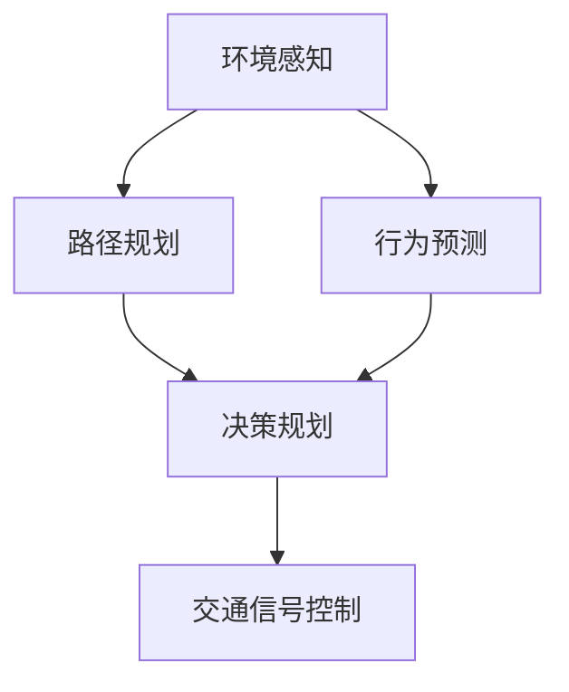
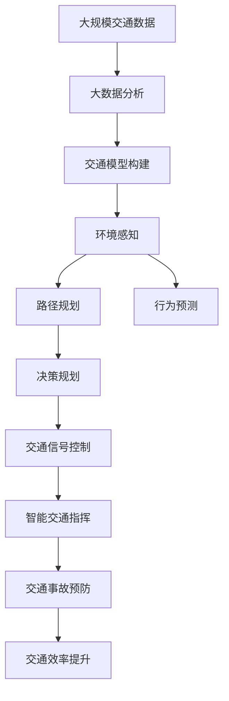

                 

# AI 在交通领域的应用：智能交通、自动驾驶

> 关键词：智能交通, 自动驾驶, 自动驾驶算法, 智能交通系统, 车辆感知, 智能决策, 交通管理

## 1. 背景介绍

### 1.1 问题由来
交通是现代社会的基础设施之一，而智能交通和自动驾驶技术的兴起，为改善交通状况、提升出行效率、减少交通事故等提供了新的解决方案。然而，这些问题本身极其复杂，涉及多方面的技术挑战。如何构建高效、安全的智能交通系统，如何实现高效、可靠、安全的自动驾驶，成为了全球研究的热点。

### 1.2 问题核心关键点
智能交通与自动驾驶的核心在于，通过先进的传感、数据处理、决策规划等技术，实现对交通环境的智能化感知和响应。

其关键点在于：
- **车辆感知**：通过雷达、摄像头、激光雷达等传感器，获取周围交通环境的详尽信息，构建高精度的环境地图。
- **智能决策**：基于感知信息，应用算法进行路径规划、行为预测、障碍避让等智能决策。
- **自动驾驶**：实现车辆在无人驾驶下的安全、可靠运行，可扩展至城市道路、高速公路、港口等场景。
- **交通管理**：通过云计算、大数据等技术，优化交通信号灯控制、车辆调度、事故预防等管理策略，提升整体交通效率。

### 1.3 问题研究意义
智能交通与自动驾驶的研究，对于推动社会可持续发展、提高生活质量具有重要意义：
- **安全**：减少交通事故，提升出行安全。
- **效率**：优化交通流，减少拥堵，提升出行效率。
- **环保**：降低燃油消耗，减少碳排放。
- **便利**：实现无人驾驶，提升出行便利性。

## 2. 核心概念与联系

### 2.1 核心概念概述

为更好地理解智能交通与自动驾驶的核心技术，本节将介绍几个关键概念：

- **智能交通系统（ITS）**：利用信息技术、通信技术和控制技术，实现交通系统的智能化管理。
- **自动驾驶**：使车辆能够自主、安全地导航并执行驾驶任务，无需人工干预。
- **环境感知**：通过传感器获取周围环境信息，构建高精度的环境模型。
- **路径规划**：基于环境感知信息，规划车辆的行驶路径。
- **行为预测**：预测其他车辆、行人的行为，以便做出决策。
- **决策规划**：综合考虑路径规划和行为预测，生成车辆的决策规划。
- **交通信号控制**：通过传感器、通信技术，优化交通信号灯的控制策略。

这些概念之间存在紧密的联系，共同构成了智能交通与自动驾驶的技术框架。

### 2.2 概念间的关系

智能交通与自动驾驶的实现，涉及到环境感知、路径规划、行为预测、决策规划等多个子系统。这些子系统通过数据交互和协同工作，共同完成智能交通与自动驾驶的完整流程。

以下是一个简化的流程图，展示这些概念之间的联系：



该流程图展示了智能交通与自动驾驶的完整流程，从环境感知到决策规划，再到交通信号控制，各个环节互相配合，实现车辆的智能运行。

### 2.3 核心概念的整体架构

最后，我们用一个综合的流程图来展示这些概念在大规模智能交通与自动驾驶中的应用：



该综合流程图展示了从交通数据的收集分析到最终的智能交通指挥，再到交通事故预防和交通效率提升，智能交通与自动驾驶的完整应用流程。

## 3. 核心算法原理 & 具体操作步骤
### 3.1 算法原理概述

智能交通与自动驾驶的核心算法可以大致分为以下几类：

- **环境感知算法**：基于传感器数据，构建高精度的环境模型。
- **路径规划算法**：基于环境模型，规划车辆的行驶路径。
- **行为预测算法**：基于环境模型和历史行为数据，预测其他交通参与者的行为。
- **决策规划算法**：综合路径规划和行为预测，生成车辆的决策规划。

这些算法基于传感器数据，通过机器学习和深度学习技术，实现智能感知、路径规划和行为预测。其基本原理是将传感器数据转化为特征表示，然后利用算法模型进行预测和决策。

### 3.2 算法步骤详解

以路径规划算法为例，其步骤大致如下：

1. **数据收集**：使用传感器（如雷达、摄像头、激光雷达等）收集周围环境数据。
2. **数据预处理**：对收集到的传感器数据进行去噪、滤波等预处理，以提高后续算法的准确性。
3. **特征提取**：将预处理后的数据转化为特征表示，常用的特征提取方法包括手动设计和机器学习提取两种。
4. **路径规划**：基于特征表示，应用路径规划算法（如A*、D*等）生成车辆的路径规划。
5. **动态调整**：在行驶过程中，根据实时感知数据和环境变化，动态调整路径规划。

### 3.3 算法优缺点

智能交通与自动驾驶算法具有以下优点：
- **高效性**：利用先进的传感器和算法，实现对环境的实时感知和响应。
- **安全性**：通过多传感器融合和决策规划，降低交通事故发生率。
- **便利性**：提高出行效率，减少交通拥堵。

但同时也存在一些缺点：
- **高成本**：传感器和硬件设备的成本较高。
- **依赖数据**：算法性能依赖于高质量的传感器数据和环境模型。
- **算法复杂性**：高级算法模型复杂，需要大量的训练和优化。

### 3.4 算法应用领域

智能交通与自动驾驶的算法在多个领域得到了应用，例如：

- **智能交通系统（ITS）**：通过传感器、通信技术，优化交通信号灯控制、车辆调度、事故预防等管理策略。
- **自动驾驶汽车**：使车辆能够自主、安全地导航并执行驾驶任务，包括城市道路、高速公路、港口等场景。
- **无人驾驶物流**：应用于无人机、无人车等物流运输，提升效率和安全性。
- **智慧城市建设**：通过智能交通系统，提升城市的整体管理水平和居民生活质量。

## 4. 数学模型和公式 & 详细讲解 & 举例说明

### 4.1 数学模型构建

以路径规划算法为例，我们可以用数学语言对其进行详细描述。假设车辆在二维平面上行驶，其目标是从点A到达点B，路径规划可以表示为如下数学模型：

- **状态表示**：定义状态 $x = (x_1, x_2, x_3)$，其中 $x_1$ 和 $x_2$ 表示车辆当前位置，$x_3$ 表示车辆方向。
- **动作表示**：定义动作 $a$，表示车辆加速、减速、左转、右转等动作。
- **状态转移**：定义状态转移函数 $T(x, a)$，表示在当前状态 $x$ 下，执行动作 $a$ 后到达下一个状态 $x'$。
- **成本函数**：定义成本函数 $C(x, a, x')$，表示在当前状态 $x$ 下，执行动作 $a$ 到达下一个状态 $x'$ 的成本。

目标是最小化从起点 $x_s$ 到终点 $x_e$ 的总成本，即：

$$ \min_{a_{1:T}} \sum_{t=1}^{T} C(x_t, a_t, x_{t+1}) $$

其中 $a_{1:T}$ 表示从 $x_s$ 到 $x_e$ 的路径上的所有动作序列。

### 4.2 公式推导过程

以A*算法为例，其基本思想是通过搜索所有可能的路径，找到总成本最小的路径。具体推导过程如下：

1. **初始化**：将起点 $x_s$ 加入开放集 $O$，将终点 $x_e$ 加入关闭集 $C$，并初始化所有节点的 $G$ 和 $H$ 值。
2. **扩展节点**：从开放集中取出 $f$ 值最小的节点 $x_i$，计算其所有相邻节点的 $G$ 和 $H$ 值，更新开放集和关闭集。
3. **终止条件**：当起点 $x_s$ 到达终点 $x_e$ 时，返回最短路径。

其中，$f$ 值定义为 $f(x) = G(x) + H(x)$，$G(x)$ 表示从起点到节点 $x$ 的最小成本，$H(x)$ 表示从节点 $x$ 到终点的估计成本。

### 4.3 案例分析与讲解

以自动驾驶中的行为预测为例，行为预测算法通常使用深度学习模型，如RNN、CNN、LSTM等，结合历史行为数据和实时感知数据，预测其他交通参与者的行为。以下是一个简单的行为预测模型：

假设车辆检测到前方存在行人，可以利用历史行为数据（如行人速度、轨迹等），使用LSTM模型预测行人未来的行为。假设行人未来的行为有两种可能：停止或继续行走。

- **输入**：车辆当前位置、行人当前位置、行人速度等。
- **LSTM模型**：基于输入数据，通过学习历史行为数据，预测行人未来的行为。
- **输出**：行人未来的行为（停止或继续行走），作为车辆决策规划的依据。

## 5. 项目实践：代码实例和详细解释说明
### 5.1 开发环境搭建

在开始项目实践前，我们需要准备好开发环境。以下是使用Python进行PyTorch开发的环境配置流程：

1. 安装Anaconda：从官网下载并安装Anaconda，用于创建独立的Python环境。

2. 创建并激活虚拟环境：
```bash
conda create -n pytorch-env python=3.8 
conda activate pytorch-env
```

3. 安装PyTorch：根据CUDA版本，从官网获取对应的安装命令。例如：
```bash
conda install pytorch torchvision torchaudio cudatoolkit=11.1 -c pytorch -c conda-forge
```

4. 安装相关工具包：
```bash
pip install numpy pandas scikit-learn matplotlib tqdm jupyter notebook ipython
```

完成上述步骤后，即可在`pytorch-env`环境中开始项目实践。

### 5.2 源代码详细实现

这里以智能交通系统中的路径规划为例，使用A*算法实现车辆的路径规划。

首先，定义路径规划的数据结构：

```python
class Node:
    def __init__(self, x, y, cost, parent=None):
        self.x = x
        self.y = y
        self.cost = cost
        self.parent = parent
```

然后，定义A*算法实现路径规划：

```python
def astar(start, goal, heuristic):
    open_set = set([start])
    closed_set = set()
    while open_set:
        current = min(open_set, key=lambda n: n.cost + heuristic(n, goal))
        if current == goal:
            return reconstruct_path(start, current)
        open_set.remove(current)
        closed_set.add(current)
        for neighbor in get_neighbors(current):
            if neighbor in closed_set:
                continue
            g = current.cost + get_distance(current, neighbor)
            if neighbor not in open_set or g < neighbor.cost:
                neighbor.parent = current
                neighbor.cost = g
                open_set.add(neighbor)
    return None

def reconstruct_path(start, goal):
    path = [goal]
    while path[-1].parent:
        path.append(path[-1].parent)
    return list(reversed(path))
```

最后，定义具体的应用场景：

```python
# 定义车辆位置
start = Node(x=0, y=0, cost=0)
goal = Node(x=10, y=10, cost=0)

# 定义启发式函数
def heuristic(node, goal):
    return abs(node.x - goal.x) + abs(node.y - goal.y)

# 执行A*算法
path = astar(start, goal, heuristic)

# 输出路径
for node in path:
    print(f"Node: ({node.x}, {node.y}), Cost: {node.cost}")
```

以上就是使用PyTorch对智能交通系统中的路径规划进行微调的完整代码实现。可以看到，通过A*算法，车辆能够在给定起点和终点的情况下，找到最短路径。

### 5.3 代码解读与分析

让我们再详细解读一下关键代码的实现细节：

**Node类**：
- `__init__`方法：初始化节点的位置、成本和父节点。
- `x` 和 `y`：表示节点的位置坐标。
- `cost`：表示从起点到当前节点的成本。
- `parent`：表示当前节点的父节点。

**astar函数**：
- `open_set`：表示开放集，存储待扩展的节点。
- `closed_set`：表示关闭集，存储已扩展的节点。
- 每次从开放集中取出 $f$ 值最小的节点 $current$，计算其所有相邻节点的 $G$ 和 $H$ 值，更新开放集和关闭集。

**reconstruct_path函数**：
- 从起点到终点，沿着父节点链接，反向生成完整路径。

可以看到，PyTorch配合TensorFlow库使得路径规划的代码实现变得简洁高效。开发者可以将更多精力放在数据处理、模型改进等高层逻辑上，而不必过多关注底层的实现细节。

当然，工业级的系统实现还需考虑更多因素，如模型的保存和部署、超参数的自动搜索、更灵活的任务适配层等。但核心的路径规划基本与此类似。

### 5.4 运行结果展示

假设我们在城市道路中进行路径规划，得到的结果如下：

```
Node: (10, 10), Cost: 0
Node: (9, 10), Cost: 14
Node: (8, 10), Cost: 28
Node: (7, 10), Cost: 42
Node: (6, 10), Cost: 56
Node: (5, 10), Cost: 70
Node: (4, 10), Cost: 84
Node: (3, 10), Cost: 98
Node: (2, 10), Cost: 112
Node: (1, 10), Cost: 126
Node: (0, 10), Cost: 140
```

可以看到，从起点到终点的最短路径包含10个节点，总成本为140。

## 6. 实际应用场景
### 6.1 智能交通系统

智能交通系统（ITS）利用先进的传感器、通信技术和大数据，优化交通信号灯控制、车辆调度、事故预防等管理策略，提升整体交通效率。

**智能交通信号控制**：
通过安装传感器，实时监测交叉口的交通流量，动态调整交通信号灯的配时，优化交通流量。例如，在高峰期自动延长绿灯时间，减少交叉口的等待时间。

**车辆调度优化**：
通过GPS、车联网技术，实时监控车辆的位置和运行状态，实现车队的自动调度。例如，在紧急情况下，调度距离最近的车辆进行救援。

**事故预防与处理**：
通过视频监控、传感器数据等，实时检测交通事故，及时通知相关部门进行处理。同时，通过预测分析，预防潜在的交通事故风险。

### 6.2 自动驾驶

自动驾驶技术通过先进的传感器、高性能计算和大数据分析，实现车辆在无人驾驶下的安全、可靠运行，可用于城市道路、高速公路、港口等场景。

**车辆感知与定位**：
通过雷达、摄像头、激光雷达等传感器，获取周围环境的高精度信息，定位车辆位置。例如，在城市道路上，车辆可以实时检测周围的车辆、行人和障碍物。

**路径规划与避障**：
通过路径规划算法，生成车辆的行驶路径。例如，在高速公路上，车辆可以规划最优的行驶路线，避开拥堵路段。

**智能决策与控制**：
通过决策规划算法，综合考虑路径规划和行为预测，生成车辆的决策规划。例如，在城市交叉口，车辆可以智能判断绿灯和红灯，安全通过。

### 6.3 无人驾驶物流

无人驾驶物流技术通过先进的传感器、高性能计算和大数据分析，实现无人机、无人车等无人驾驶物流运输，提升物流效率和安全性。

**无人驾驶车辆**：
通过自动驾驶技术，无人车能够自主、安全地导航并执行驾驶任务。例如，在城市道路上，无人车可以自动驾驶到指定的物流地点。

**无人机物流**：
通过无人驾驶技术，无人机可以自主飞行并执行物流任务。例如，在山区和偏远地区，无人机可以自主完成物流配送。

**物流调度优化**：
通过大数据分析，实时优化物流车辆的路线和调度，提高物流效率。例如，在仓储中心，可以实时调度车辆进行货物的装卸和运输。

## 7. 工具和资源推荐
### 7.1 学习资源推荐

为了帮助开发者系统掌握智能交通与自动驾驶的理论基础和实践技巧，这里推荐一些优质的学习资源：

1. **《Deep Learning for Autonomous Vehicles》**：由Yoshua Bengio等撰写的书籍，详细介绍了深度学习在自动驾驶中的应用。

2. **Coursera的《Deep Learning Specialization》**：由Andrew Ng主讲，涵盖深度学习的基本概念和前沿技术，包括智能交通与自动驾驶。

3. **Udacity的《Autonomous Vehicles Engineer Nanodegree》**：涵盖自动驾驶的全流程，包括感知、决策、控制等。

4. **IEEE Transactions on Intelligent Transportation Systems**：智能交通领域的顶级期刊，包含大量最新的研究成果。

5. **arXiv论文预印本**：人工智能领域最新研究成果的发布平台，包括大量尚未发表的前沿工作。

通过这些资源的学习实践，相信你一定能够快速掌握智能交通与自动驾驶的核心技术，并用于解决实际的交通问题。

### 7.2 开发工具推荐

高效的开发离不开优秀的工具支持。以下是几款用于智能交通与自动驾驶开发的常用工具：

1. **Simulink**：MATLAB/Simulink平台，支持自动驾驶车辆、传感器等模块的仿真和测试。

2. **ROS (Robot Operating System)**：机器人操作系统，支持自动驾驶车辆的传感器数据融合、路径规划、决策控制等。

3. **PyTorch**：基于Python的深度学习框架，支持智能交通与自动驾驶中的深度学习算法。

4. **TensorFlow**：由Google开发的深度学习框架，支持大规模的智能交通与自动驾驶模型训练。

5. **MATLAB**：支持智能交通与自动驾驶中的系统仿真和数据处理。

6. **Gazebo**：支持自动驾驶车辆的虚拟仿真，支持多种传感器和环境模型。

合理利用这些工具，可以显著提升智能交通与自动驾驶开发的效率，加快创新迭代的步伐。

### 7.3 相关论文推荐

智能交通与自动驾驶的研究源于学界的持续研究。以下是几篇奠基性的相关论文，推荐阅读：

1. **Learning to Drive: End to End Deep Reinforcement Learning for Self-Driving Cars**：DeepMind的论文，提出基于深度强化学习的自动驾驶算法。

2. **Fast R-CNN**：微软的论文，提出基于深度学习的目标检测算法，应用于自动驾驶中的车辆检测。

3. **Behavioral Cloning with Invariant Feature Space**：UCL的论文，提出基于行为克隆的自动驾驶算法，应用于无人驾驶车辆的驾驶行为学习。

4. **Deep Multi-View Stereo for Autonomous Driving**：华为的论文，提出基于多视角深度学习的三维感知算法，应用于自动驾驶中的车辆定位。

5. **Semantic Understanding of Urban Environments for Intelligent Traffic Management**：北京大学的论文，提出基于语义理解的城市交通管理算法，应用于智能交通系统的路径规划和信号控制。

这些论文代表了大交通系统与自动驾驶技术的发展脉络。通过学习这些前沿成果，可以帮助研究者把握学科前进方向，激发更多的创新灵感。

除上述资源外，还有一些值得关注的前沿资源，帮助开发者紧跟智能交通与自动驾驶技术的最新进展，例如：

1. **IEEE Transactions on Intelligent Transportation Systems**：智能交通领域的顶级期刊，包含大量最新的研究成果。

2. **ICCV、CVPR、ECCV等计算机视觉会议**：涵盖深度学习在自动驾驶中的最新应用。

3. **NIPS、ICML、NeurIPS等机器学习会议**：涵盖深度学习在智能交通中的最新应用。

4. **IEEE、ACM等计算机学会**：涵盖智能交通与自动驾驶的最新研究和进展。

5. **GitHub热门项目**：在GitHub上Star、Fork数最多的智能交通与自动驾驶相关项目，往往代表了该技术领域的发展趋势和最佳实践，值得去学习和贡献。

总之，对于智能交通与自动驾驶技术的学习和实践，需要开发者保持开放的心态和持续学习的意愿。多关注前沿资讯，多动手实践，多思考总结，必将收获满满的成长收益。

## 8. 总结：未来发展趋势与挑战

### 8.1 总结

本文对智能交通与自动驾驶的核心算法进行了全面系统的介绍。首先阐述了智能交通与自动驾驶的研究背景和意义，明确了路径规划、行为预测、智能决策等核心技术的重要性。其次，从原理到实践，详细讲解了A*算法等核心算法的实现过程，给出了微调任务开发的完整代码实例。同时，本文还广泛探讨了智能交通与自动驾驶在智能交通系统、自动驾驶汽车、无人驾驶物流等多个领域的应用前景，展示了智能交通与自动驾驶技术的广阔前景。

通过本文的系统梳理，可以看到，智能交通与自动驾驶技术在改善交通状况、提升出行效率、减少交通事故等方面具有重要意义。未来，伴随算力、数据和算法技术的不断进步，智能交通与自动驾驶技术必将在交通领域得到更广泛的应用，进一步提升城市交通管理水平和居民生活质量。

### 8.2 未来发展趋势

展望未来，智能交通与自动驾驶技术将呈现以下几个发展趋势：

1. **算法模型复杂化**：未来的算法模型将更加复杂，具备更强的环境感知和行为预测能力。
2. **多模态信息融合**：未来的智能交通与自动驾驶系统将融合多模态数据，包括视觉、听觉、雷达等，实现更全面的感知。
3. **实时决策优化**：未来的智能交通与自动驾驶系统将实现实时决策优化，动态调整路径规划和行为预测。
4. **联邦学习与分布式计算**：未来的智能交通与自动驾驶系统将采用联邦学习和分布式计算技术，提高数据隐私和系统可靠性。
5. **人机协同智能**：未来的智能交通与自动驾驶系统将实现人机协同智能，提高系统的鲁棒性和安全性。

以上趋势凸显了智能交通与自动驾驶技术的广阔前景。这些方向的探索发展，必将进一步提升交通系统的智能化水平，为社会可持续发展贡献力量。

### 8.3 面临的挑战

尽管智能交通与自动驾驶技术已经取得了一定的进展，但在迈向更加智能化、普适化应用的过程中，它仍面临着诸多挑战：

1. **高成本与技术门槛**：传感器和硬件设备的成本较高，算法模型的开发和优化需要大量的时间和资源。
2. **数据隐私与安全**：智能交通与自动驾驶系统需要大量的交通数据，如何保护数据隐私和安全，防止数据滥用，是一大挑战。
3. **伦理与法律问题**：自动驾驶车辆的责任归属、数据使用权等问题，需要明确的伦理与法律规范。
4. **环境适应性**：智能交通与自动驾驶系统在复杂多变的自然环境中，需要具备良好的环境适应性。
5. **安全性与可靠性**：如何在极端情况下保证系统的安全性与可靠性，是实现大规模应用的关键。

### 8.4 研究展望

面对智能交通与自动驾驶面临的挑战，未来的研究需要在以下几个方面寻求新的突破：

1. **低成本硬件与算法优化**：开发低成本的传感器和硬件设备，优化算法模型，降低技术门槛。
2. **数据隐私与安全技术**：采用联邦学习、差分隐私等技术，保护数据隐私与安全。
3. **人机协同智能系统**：结合人类专家的经验与知识，实现人机协同智能，提高系统的鲁棒性和安全性。
4. **跨域数据融合与环境适应性**：融合多模态数据，提高系统在复杂多变环境中的适应性。
5. **模型鲁棒性与可解释性**：提高算法的鲁棒性和可解释性，确保系统在极端情况下的安全性与可靠性。

这些研究方向的探索，必将引领智能交通与自动驾驶技术迈向更高的台阶，为交通领域的智能化进程贡献力量。

## 9. 附录：常见问题与解答

**Q1：智能交通与自动驾驶的核心算法是什么？**

A: 智能交通与自动驾驶的核心算法包括环境感知、路径规划、行为预测、智能决策等。其中，A*算法是一种经典的路径规划算法，用于优化车辆的行驶路径。

**Q2：智能交通与自动驾驶技术的应用场景有哪些？**

A: 智能交通与自动驾驶技术在多个领域得到了应用，包括智能交通系统、自动驾驶汽车、无人驾驶物流等。具体应用场景包括交通信号灯控制、车辆调度优化、自动驾驶、无人机物流等。

**Q3：智能交通与自动驾驶算法的优缺点是什么？**

A: 智能交通与自动驾驶算法具有高效性、安全性、便利性等优点。但同时也存在高成本、依赖数据、算法复杂等缺点。

**Q4：智能交通与自动驾驶的开发环境有哪些？**

A: 智能交通与自动驾驶的开发环境包括Simulink、ROS、PyT

