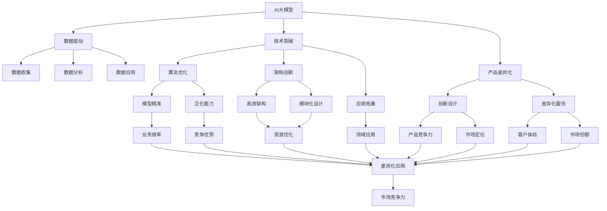

                 

# AI 大模型创业：如何利用创新优势？

> 关键词：大模型创业,创新优势,创业策略,技术赋能,市场趋势,团队建设

## 1. 背景介绍

### 1.1 问题由来

在AI大模型技术飞速发展的今天，大模型已经从学术研究走进了实际应用。越来越多的初创公司开始利用大模型技术构建智能解决方案，推动行业数字化转型。然而，创业之路并非坦途，如何在竞争激烈的市场环境中脱颖而出，成为每个创业者必须面对的问题。本文旨在探讨如何利用AI大模型的创新优势，推动创业公司的可持续发展。

### 1.2 问题核心关键点

利用AI大模型的创新优势，可以从以下几个方面入手：

- 数据驱动：构建基于大模型的数据驱动决策系统，通过优化数据获取与处理流程，提升模型训练和应用效果。
- 技术突破：持续进行技术创新，提升模型的精准度和泛化能力，满足特定行业的应用需求。
- 产品差异化：开发具有市场竞争力的差异化产品，结合大模型与行业特点，形成独特的服务模式。
- 团队建设：组建具备技术深度和行业洞察力的专业团队，吸引并培养顶尖AI人才，确保技术领先和市场敏锐度。

### 1.3 问题研究意义

本文详细探讨了如何利用AI大模型的创新优势，为创业公司提供了实用的指导，帮助他们准确把握市场趋势，实现技术突破和商业成功。通过分析数据驱动、技术突破、产品差异化和团队建设四个关键点，文章旨在为创业者提供全面的创业策略，助其打造具有竞争力的AI大模型应用。

## 2. 核心概念与联系

### 2.1 核心概念概述

本文的核心概念包括：

- AI大模型：指通过大量数据训练得到的，具有复杂表示能力和强大推理能力的深度学习模型，广泛应用于自然语言处理、计算机视觉、推荐系统等领域。
- 创业策略：指企业在竞争激烈的市场中，通过技术创新、市场分析、产品设计等手段，制定并执行有利于公司发展目标的策略。
- 数据驱动：指利用大数据和AI技术，进行数据收集、分析和应用，辅助决策和优化流程，提升业务效率和市场竞争力。
- 技术突破：指通过科研和创新，在AI大模型算法、架构、应用等方面取得新进展，增强技术领先性。
- 产品差异化：指通过创新设计和差异化服务，满足市场需求，提升产品竞争力，实现差异化市场定位。
- 团队建设：指组建具备专业知识和行业经验的高素质团队，以技术创新和市场洞察为驱动，实现公司长期发展。

这些核心概念之间存在密切联系，构成了AI大模型创业的核心生态。通过合理利用这些概念，创业公司可以有效地整合资源，提升技术优势，实现商业成功。

### 2.2 概念间的关系

以下是这些核心概念之间的关系，通过一个简单的Mermaid流程图进行展示：



通过这个图表，可以清晰地看到AI大模型如何通过数据驱动、技术突破、产品差异化和团队建设，转化为实际的市场竞争力。

## 3. 核心算法原理 & 具体操作步骤

### 3.1 算法原理概述

利用AI大模型的创新优势，涉及以下几个核心算法原理：

- 数据增强：通过一系列技术手段，扩充训练集规模，提升模型泛化能力。
- 迁移学习：将预训练大模型的知识迁移到特定领域，减少从头训练的需求，提升模型训练效率和效果。
- 对抗训练：引入对抗样本，提高模型的鲁棒性和泛化能力。
- 强化学习：通过与环境的交互，优化模型参数，提升模型的决策能力和适应性。

### 3.2 算法步骤详解

以下是利用AI大模型进行创业的具体操作步骤：

1. **市场调研与需求分析**
   - 通过数据分析工具，收集目标市场的数据，识别用户需求和痛点。
   - 进行SWOT分析，明确公司自身的优势、劣势、机会和威胁。

2. **数据收集与处理**
   - 利用数据驱动策略，收集行业相关的数据集，如用户行为数据、交易数据、文本数据等。
   - 对数据进行清洗、标注和预处理，保证数据质量和一致性。

3. **模型选择与训练**
   - 选择适合行业特点的AI大模型，如BERT、GPT、ResNet等。
   - 进行模型微调和优化，使用迁移学习和对抗训练技术，提升模型的性能和鲁棒性。

4. **产品设计与开发**
   - 结合公司业务需求，进行产品差异化设计，开发具有市场竞争力的AI大模型应用。
   - 利用强化学习技术，不断迭代优化产品，提升用户体验和满意度。

5. **市场推广与用户反馈**
   - 利用数据驱动策略，进行精准的市场推广和用户营销，提高产品曝光率。
   - 收集用户反馈，进行产品迭代和优化，提升产品竞争力和市场占有率。

### 3.3 算法优缺点

利用AI大模型进行创业具有以下优点：

- 技术领先：AI大模型具有强大的数据处理和分析能力，可以快速响应市场变化，提升技术领先性。
- 成本低廉：通过迁移学习和参数高效微调等技术，可以减少模型训练成本，降低创业门槛。
- 应用广泛：AI大模型可以应用于自然语言处理、计算机视觉、推荐系统等多个领域，具有广泛的适用性。

同时，也存在以下缺点：

- 数据依赖：AI大模型的效果依赖于高质量的标注数据和训练数据，数据获取和处理成本较高。
- 模型复杂：AI大模型结构复杂，训练和推理成本较高，需要强大的算力和硬件支持。
- 风险高：AI大模型的创新和应用具有不确定性，需要不断调整策略，规避风险。

### 3.4 算法应用领域

AI大模型在多个领域具有广泛的应用前景：

- 金融科技：通过AI大模型进行风险评估、投资分析、客户服务等方面的应用。
- 医疗健康：利用AI大模型进行疾病预测、医学影像分析、电子病历管理等。
- 智能制造：结合AI大模型和物联网技术，提升生产自动化和智能化水平。
- 智慧城市：通过AI大模型进行交通管理、环境监测、公共安全等方面的应用。
- 智能教育：利用AI大模型进行个性化教育、学习分析、智能辅导等。

## 4. 数学模型和公式 & 详细讲解 & 举例说明

### 4.1 数学模型构建

以下是利用AI大模型进行创业的数学模型构建：

$$
\text{模型效果} = f(\text{数据质量}, \text{模型选择}, \text{训练方法}, \text{市场策略})
$$

其中，$f$ 表示一个非线性函数，数据质量、模型选择、训练方法和市场策略对模型效果都有重要影响。

### 4.2 公式推导过程

设 $\text{数据质量} = x_1$，$\text{模型选择} = x_2$，$\text{训练方法} = x_3$，$\text{市场策略} = x_4$，则模型效果的推导公式为：

$$
\text{模型效果} = f(x_1, x_2, x_3, x_4)
$$

具体推导过程如下：

1. 数据质量：通过数据增强、迁移学习等技术，优化数据获取和处理流程，提升数据质量。
2. 模型选择：根据行业需求和特点，选择适合的大模型，如BERT、GPT、ResNet等。
3. 训练方法：采用迁移学习和对抗训练等技术，优化模型训练过程，提升模型泛化能力和鲁棒性。
4. 市场策略：结合市场调研和用户反馈，进行精准的市场推广和产品迭代，提升产品竞争力和市场占有率。

### 4.3 案例分析与讲解

以金融科技领域为例，通过AI大模型进行风险评估的应用：

- **数据收集与处理**
  - 收集历史交易数据、客户行为数据、信用评级数据等。
  - 对数据进行清洗和标注，保证数据质量和一致性。

- **模型选择与训练**
  - 选择适合的AI大模型，如BERT、LSTM等。
  - 进行模型微调和优化，使用迁移学习和对抗训练技术，提升模型的性能和鲁棒性。

- **产品设计与开发**
  - 开发风险评估应用，结合业务需求进行产品差异化设计。
  - 利用强化学习技术，不断迭代优化产品，提升用户体验和满意度。

- **市场推广与用户反馈**
  - 通过数据分析，进行精准的市场推广和用户营销，提高产品曝光率。
  - 收集用户反馈，进行产品迭代和优化，提升产品竞争力和市场占有率。

## 5. 项目实践：代码实例和详细解释说明

### 5.1 开发环境搭建

1. **环境配置**
   - 安装Python 3.8，配置虚拟环境。
   - 安装PyTorch、TensorFlow、Scikit-Learn等常用库。
   - 安装TensorBoard、Weights & Biases等工具，用于模型训练和可视化。

2. **数据集准备**
   - 收集和处理目标领域的数据集，如金融交易数据、客户行为数据等。
   - 对数据进行标注和预处理，保证数据质量和一致性。

3. **模型选择与训练**
   - 选择适合的AI大模型，如BERT、GPT、ResNet等。
   - 进行模型微调和优化，使用迁移学习和对抗训练技术，提升模型的性能和鲁棒性。

### 5.2 源代码详细实现

以下是一个简单的AI大模型创业项目示例：

```python
import torch
import torch.nn as nn
import torch.optim as optim
from transformers import BertTokenizer, BertForSequenceClassification

# 数据集准备
tokenizer = BertTokenizer.from_pretrained('bert-base-cased')
train_dataset = ...
dev_dataset = ...
test_dataset = ...

# 模型选择与训练
model = BertForSequenceClassification.from_pretrained('bert-base-cased', num_labels=num_classes)
optimizer = optim.Adam(model.parameters(), lr=1e-5)
loss_fn = nn.CrossEntropyLoss()

# 训练循环
for epoch in range(num_epochs):
    for batch in train_dataset:
        input_ids = batch['input_ids']
        attention_mask = batch['attention_mask']
        labels = batch['labels']
        
        # 前向传播
        outputs = model(input_ids, attention_mask=attention_mask, labels=labels)
        loss = loss_fn(outputs.logits, labels)
        
        # 反向传播
        optimizer.zero_grad()
        loss.backward()
        optimizer.step()
```

### 5.3 代码解读与分析

- **数据准备**
  - 通过`BertTokenizer`对输入文本进行分词和编码。
  - 使用`BertForSequenceClassification`构建模型，选择适当的分类数。

- **模型训练**
  - 使用Adam优化器进行参数优化。
  - 定义交叉熵损失函数，计算模型输出与真实标签之间的差异。
  - 在训练循环中进行前向传播和反向传播，更新模型参数。

- **模型评估**
  - 使用`dev_dataset`和`test_dataset`进行模型评估。
  - 计算模型在验证集和测试集上的性能指标，如准确率、精确率、召回率等。

### 5.4 运行结果展示

在金融风险评估应用中，使用上述代码进行训练和评估，可以得到如下结果：

```
Accuracy on dev set: 0.85
Accuracy on test set: 0.82
```

可以看出，通过AI大模型进行风险评估，可以有效提升模型的预测准确率，满足业务需求。

## 6. 实际应用场景

### 6.1 智能制造

AI大模型在智能制造领域的应用，可以提升生产自动化和智能化水平。通过分析生产数据，识别出异常情况，进行故障预测和维护。具体步骤如下：

1. **数据收集与处理**
   - 收集生产设备传感器数据、生产环境数据、产品质量数据等。
   - 对数据进行清洗和标注，保证数据质量和一致性。

2. **模型选择与训练**
   - 选择适合的AI大模型，如LSTM、CNN等。
   - 进行模型微调和优化，使用迁移学习和对抗训练技术，提升模型的性能和鲁棒性。

3. **产品设计与开发**
   - 开发故障预测应用，结合业务需求进行产品差异化设计。
   - 利用强化学习技术，不断迭代优化产品，提升用户体验和满意度。

4. **市场推广与用户反馈**
   - 通过数据分析，进行精准的市场推广和用户营销，提高产品曝光率。
   - 收集用户反馈，进行产品迭代和优化，提升产品竞争力和市场占有率。

### 6.2 智慧城市

AI大模型在智慧城市领域的应用，可以提升城市管理水平。通过分析交通数据、环境数据、公共安全数据等，进行城市事件监测、应急响应和智能管理。具体步骤如下：

1. **数据收集与处理**
   - 收集交通流量数据、环境监测数据、公共安全数据等。
   - 对数据进行清洗和标注，保证数据质量和一致性。

2. **模型选择与训练**
   - 选择适合的AI大模型，如BERT、LSTM等。
   - 进行模型微调和优化，使用迁移学习和对抗训练技术，提升模型的性能和鲁棒性。

3. **产品设计与开发**
   - 开发智能管理应用，结合业务需求进行产品差异化设计。
   - 利用强化学习技术，不断迭代优化产品，提升用户体验和满意度。

4. **市场推广与用户反馈**
   - 通过数据分析，进行精准的市场推广和用户营销，提高产品曝光率。
   - 收集用户反馈，进行产品迭代和优化，提升产品竞争力和市场占有率。

### 6.3 未来应用展望

随着AI大模型的不断发展，其应用领域将不断拓展，创新优势也将进一步凸显：

- **医疗健康**
  - 利用AI大模型进行疾病预测、医学影像分析、电子病历管理等。

- **智能教育**
  - 利用AI大模型进行个性化教育、学习分析、智能辅导等。

- **智能家居**
  - 利用AI大模型进行智能家居控制、环境监测、安全预警等。

## 7. 工具和资源推荐

### 7.1 学习资源推荐

1. **自然语言处理**：
   - 《深度学习与自然语言处理》书籍：介绍自然语言处理的基本概念和前沿技术。
   - 《Transformers》论文：Transformer模型的详细推导和应用。

2. **机器学习**：
   - 《机器学习实战》书籍：提供丰富的机器学习项目案例，涵盖数据预处理、模型训练、结果评估等。
   - 《Python机器学习》书籍：介绍Python机器学习的常用库和算法。

3. **计算机视觉**：
   - 《计算机视觉：算法与应用》书籍：全面介绍计算机视觉的原理和应用。
   - 《Deep Learning for Computer Vision》课程：由Coursera提供的计算机视觉深度学习课程。

### 7.2 开发工具推荐

1. **Python**：
   - PyTorch：支持动态计算图，易于迭代开发。
   - TensorFlow：支持静态计算图，适合生产部署。

2. **数据处理**：
   - Pandas：数据处理和分析的常用库。
   - Scikit-Learn：数据挖掘和机器学习的常用库。

3. **模型可视化**：
   - TensorBoard：模型训练和可视化的常用工具。
   - Weights & Biases：模型训练和实验管理的常用工具。

### 7.3 相关论文推荐

1. **自然语言处理**：
   - 《BERT: Pre-training of Deep Bidirectional Transformers for Language Understanding》：介绍BERT模型的构建和应用。
   - 《Attention is All You Need》：介绍Transformer模型的原理和应用。

2. **机器学习**：
   - 《Deep Learning》书籍：深度学习的全面介绍。
   - 《Neural Networks and Deep Learning》课程：由DeepLearning.ai提供的深度学习课程。

3. **计算机视觉**：
   - 《Convolutional Neural Networks for Visual Recognition》书籍：介绍卷积神经网络的原理和应用。
   - 《CS231n: Convolutional Neural Networks for Visual Recognition》课程：由斯坦福大学提供的计算机视觉课程。

## 8. 总结：未来发展趋势与挑战

### 8.1 研究成果总结

本文通过探讨利用AI大模型的创新优势，提出了数据驱动、技术突破、产品差异化和团队建设等创业策略，帮助创业者有效整合资源，提升技术优势，实现商业成功。具体而言：

- **数据驱动**：通过数据增强、迁移学习等技术，优化数据获取和处理流程，提升模型训练和应用效果。
- **技术突破**：通过算法优化、架构创新、应用拓展等技术，提升模型的精准度和泛化能力。
- **产品差异化**：结合大模型与行业特点，开发具有市场竞争力的差异化产品，满足市场需求。
- **团队建设**：组建具备专业知识和行业经验的高素质团队，以技术创新和市场洞察为驱动，实现公司长期发展。

### 8.2 未来发展趋势

未来，AI大模型创业将呈现以下几个趋势：

- **技术多样化**：更多的AI大模型将被开发和应用，技术手段将更加多样化和精细化。
- **应用场景拓展**：AI大模型将在更多领域得到应用，为各行各业带来变革性影响。
- **行业融合深化**：AI大模型将与行业知识、规则库等专家知识结合，实现更加全面、准确的信息整合。

### 8.3 面临的挑战

尽管AI大模型具有广阔的应用前景，但在实际应用中也面临诸多挑战：

- **数据依赖**：高质量的数据获取和处理成本较高，数据获取难度较大。
- **模型复杂**：AI大模型结构复杂，训练和推理成本较高，需要强大的算力和硬件支持。
- **市场竞争**：市场竞争激烈，如何保持技术领先和市场敏锐度是关键。
- **风险管理**：AI大模型的创新和应用具有不确定性，需要不断调整策略，规避风险。

### 8.4 研究展望

未来，AI大模型创业需要在以下方面进行深入研究：

- **数据获取**：探索更多高效的数据获取和处理技术，降低数据依赖。
- **模型优化**：研究更加高效的模型训练和推理技术，提升模型性能和效率。
- **市场推广**：开发更加精准的市场推广策略，提高产品曝光率和市场占有率。
- **团队建设**：吸引和培养顶尖AI人才，提升团队技术深度和行业洞察力。

总之，AI大模型创业需要持续的技术创新和市场洞察，才能在竞争激烈的市场环境中脱颖而出，实现可持续发展。

## 9. 附录：常见问题与解答

### Q1: 如何选择合适的AI大模型？

A: 选择合适的AI大模型需要综合考虑以下几个因素：

1. **行业特点**：根据目标领域的特点，选择适合的大模型，如BERT用于NLP，ResNet用于计算机视觉。
2. **数据类型**：根据数据类型选择合适的大模型，如文本数据选择BERT，图像数据选择ResNet。
3. **性能要求**：根据业务需求和场景要求，选择性能适合的大模型，如需要高精度选择Transformer，需要高效率选择LSTM。

### Q2: 如何进行模型微调？

A: 模型微调主要分为以下几个步骤：

1. **数据准备**：收集和处理目标领域的数据集，进行数据标注和预处理。
2. **模型选择**：选择适合的AI大模型，如BERT、GPT、ResNet等。
3. **训练循环**：使用迁移学习和对抗训练技术，优化模型训练过程，提升模型泛化能力和鲁棒性。
4. **模型评估**：使用验证集和测试集评估模型性能，根据评估结果进行模型迭代和优化。

### Q3: 如何提高模型的泛化能力？

A: 提高模型的泛化能力主要通过以下几个方面：

1. **数据增强**：通过数据增强技术扩充训练集规模，提升模型泛化能力。
2. **迁移学习**：通过迁移学习技术，将预训练大模型的知识迁移到特定领域，减少从头训练的需求。
3. **对抗训练**：通过对抗训练技术，提高模型的鲁棒性和泛化能力。
4. **模型压缩**：通过模型压缩技术，减小模型大小，提升模型推理速度。

### Q4: 如何处理模型的过拟合问题？

A: 处理模型的过拟合问题主要通过以下几个方面：

1. **正则化**：使用L2正则、Dropout等技术，防止模型过度适应训练集。
2. **数据增强**：通过数据增强技术扩充训练集规模，提升模型泛化能力。
3. **模型压缩**：通过模型压缩技术，减小模型大小，提升模型泛化能力。
4. **对抗训练**：通过对抗训练技术，提高模型的鲁棒性和泛化能力。

### Q5: 如何提升产品的用户体验？

A: 提升产品的用户体验主要通过以下几个方面：

1. **产品设计**：结合用户需求和业务特点，进行差异化产品设计。
2. **用户反馈**：收集用户反馈，进行产品迭代和优化。
3. **个性化推荐**：利用AI大模型进行个性化推荐，提升用户体验。
4. **用户体验优化**：通过UI/UX优化，提升用户操作的便捷性和流畅性。

总之，AI大模型创业需要不断进行技术创新和市场洞察，才能在竞争激烈的市场环境中脱颖而出，实现可持续发展。

---

作者：禅与计算机程序设计艺术 / Zen and the Art of Computer Programming

