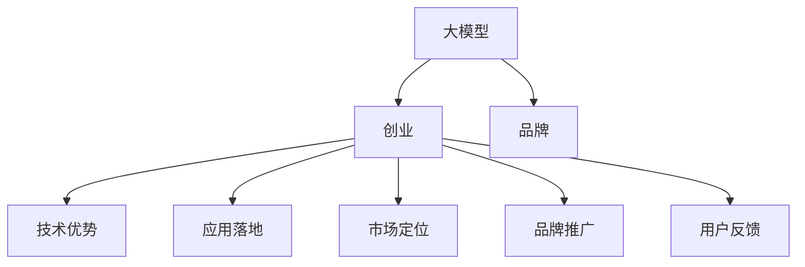
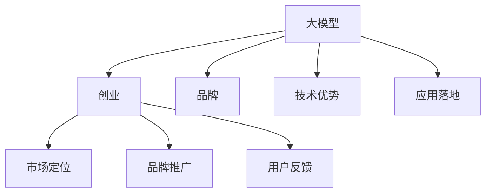

                 

# AI 大模型创业：如何利用品牌优势？

> 关键词：大模型,创业,品牌,人工智能,技术优势

## 1. 背景介绍

### 1.1 问题由来

在人工智能(AI)领域，特别是在大模型技术的快速发展的今天，许多创业者纷纷投身其中，希望利用大模型的优势打造具有市场竞争力的AI企业。然而，虽然大模型在技术上拥有许多优势，但在商业化过程中，如何将其转化为品牌优势，从而获得市场认可和商业成功，却是一个颇具挑战性的问题。

### 1.2 问题核心关键点

构建AI品牌的核心关键点在于：
1. **技术实力**：大模型技术需要深厚的技术积累和持续的创新。
2. **应用落地**：将大模型技术成功应用于实际场景，解决真实问题，是品牌树立的基础。
3. **市场定位**：明确品牌定位，找准市场痛点，满足用户需求。
4. **品牌推广**：利用多种渠道和策略，有效推广品牌，提升品牌知名度和影响力。
5. **用户反馈**：持续收集用户反馈，不断优化产品，增强品牌黏性。

### 1.3 问题研究意义

本文聚焦于大模型创业中的品牌构建问题，旨在帮助创业者理解如何利用大模型技术优势，打造具有市场竞争力的AI品牌，从而在激烈的市场竞争中脱颖而出。

## 2. 核心概念与联系

### 2.1 核心概念概述

为更好地理解大模型创业的品牌构建方法，本节将介绍几个密切相关的核心概念：

- **大模型**：指使用大规模无标签数据进行自监督预训练，学习到丰富语言表示的AI模型，如BERT、GPT-3等。
- **创业**：指通过技术创新，将AI技术商业化，打造具有市场价值的AI产品和服务的活动。
- **品牌**：指在市场中通过技术、服务、文化等多方面构建的独特形象和识别标志，用以区分于竞争对手。
- **技术优势**：指大模型在语义理解、推理能力、泛化能力等方面的独特技术特点。
- **应用落地**：指将大模型技术成功应用于实际场景，解决具体问题。
- **市场定位**：指品牌在市场中的独特定位和目标用户群体。
- **品牌推广**：指通过多种渠道和策略，有效提升品牌知名度和影响力。
- **用户反馈**：指用户对AI产品或服务的评价和反馈，用于优化和提升产品。

这些核心概念之间的逻辑关系可以通过以下Mermaid流程图来展示：



这个流程图展示了大模型创业过程中各个关键环节之间的联系。

### 2.2 概念间的关系

这些核心概念之间存在着紧密的联系，形成了大模型创业的品牌构建框架。下面是一些关键概念之间的逻辑关系：

- **大模型与创业**：大模型提供了强大的技术支持，是创业的基石；而创业则是将大模型技术商业化，实现其市场价值的过程。
- **品牌与技术优势**：品牌形象的构建，依托于大模型技术的独特技术优势；而品牌的影响力，也能进一步提升大模型技术的市场认可度。
- **应用落地与市场定位**：成功应用落地，是市场定位的体现；市场定位的明确，也有助于找到最适合的落地场景。
- **品牌推广与用户反馈**：品牌推广是用户认识产品的途径；用户反馈则是品牌优化的依据。

### 2.3 核心概念的整体架构

最后，我们用一个综合的流程图来展示这些核心概念在大模型创业中的整体架构：



这个综合流程图展示了从大模型到创业，再到品牌构建的完整过程。大模型通过技术优势支持应用落地，进而明确市场定位，品牌推广和用户反馈则不断优化品牌形象和技术。通过这些环节的协同作用，大模型创业品牌得以构建并持续发展。

## 3. 核心算法原理 & 具体操作步骤
### 3.1 算法原理概述

大模型创业中的品牌构建，本质上是一个通过技术创新和市场运作，提升品牌知名度和影响力的过程。其核心算法原理包括以下几个方面：

1. **技术创新**：通过不断优化大模型技术，提升其性能和应用能力。
2. **市场分析**：通过市场调研，了解用户需求和竞争格局，明确市场定位。
3. **品牌塑造**：通过品牌设计、营销策略、用户体验等多方面提升品牌形象。
4. **用户互动**：通过社交媒体、在线论坛、用户反馈等方式与用户互动，收集反馈并优化产品。
5. **持续迭代**：基于用户反馈和技术创新，持续迭代产品和品牌策略，提升竞争力。

### 3.2 算法步骤详解

大模型创业中的品牌构建可以按照以下步骤进行：

**Step 1: 技术积累与创新**
- 建立研发团队，积累大模型技术基础。
- 持续优化模型架构和算法，提升模型性能。
- 关注最新研究进展，引入先进技术。

**Step 2: 市场调研与定位**
- 进行市场调研，了解目标用户和市场需求。
- 分析竞争对手，明确自身优势和劣势。
- 确定品牌定位，找到独特的市场切入点。

**Step 3: 品牌塑造与推广**
- 设计品牌标志和口号，打造品牌形象。
- 制定品牌推广策略，包括线上线下的营销活动。
- 利用社交媒体、SEO、内容营销等渠道提升品牌知名度。

**Step 4: 用户互动与反馈**
- 通过社交媒体、在线客服等方式与用户互动。
- 收集用户反馈，及时优化产品和服务。
- 建立用户社区，促进用户参与和品牌黏性。

**Step 5: 持续迭代与优化**
- 根据用户反馈和技术进展，不断迭代产品。
- 优化品牌策略，提升用户体验和品牌形象。
- 持续关注市场变化，灵活调整品牌方向。

### 3.3 算法优缺点

大模型创业中的品牌构建方法具有以下优点：
1. **技术优势显著**：大模型技术在语义理解、推理能力等方面具有明显优势，有助于品牌快速建立信任。
2. **市场适应性强**：大模型能够灵活适应不同领域的应用场景，有助于品牌拓展市场范围。
3. **用户互动便捷**：大模型技术可快速提供服务，用户反馈及时，有助于品牌优化和改进。

但同时也存在一些缺点：
1. **技术门槛高**：需要深厚的技术积累和持续的创新，难以快速投入市场。
2. **市场风险大**：大模型技术在实际应用中的效果可能存在不确定性，品牌推广效果不佳。
3. **用户需求多样化**：不同用户对大模型的需求和期望不同，品牌策略需要灵活调整。

### 3.4 算法应用领域

大模型创业中的品牌构建方法可以应用于多种领域，例如：

- **智能客服**：通过大模型提供智能客服解决方案，打造高效、友好的客户服务品牌。
- **医疗诊断**：利用大模型进行疾病诊断和医疗咨询，提升品牌信誉度。
- **教育培训**：提供个性化教育解决方案，提升品牌教育水平。
- **金融风控**：通过大模型进行风险评估和金融分析，增强品牌信任感。
- **智能推荐**：提供智能推荐服务，提升品牌用户的购物体验。

## 4. 数学模型和公式 & 详细讲解  
### 4.1 数学模型构建

本节将使用数学语言对大模型创业中的品牌构建方法进行更加严格的刻画。

记大模型为 $M$，市场调研为 $S$，品牌塑造为 $B$，品牌推广为 $P$，用户反馈为 $F$，品牌优化为 $O$。品牌构建的数学模型为：

$$
B = f(M, S, P, F, O)
$$

其中 $f$ 为品牌构建的函数，考虑技术实力、市场调研、品牌塑造、品牌推广、用户反馈和品牌优化等因素。

### 4.2 公式推导过程

以下我们以智能客服系统为例，推导品牌构建的数学模型：

假设品牌构建函数 $f$ 包含以下变量：
- $M_{\theta}$：大模型，其参数为 $\theta$。
- $S$：市场调研结果，包括用户需求、市场竞争等。
- $P$：品牌推广策略，包括广告、社交媒体等。
- $F$：用户反馈，包括用户满意度、评论等。
- $O$：品牌优化策略，包括产品改进、服务升级等。

品牌构建的数学模型为：

$$
B = M_{\theta}(S) + P(F) + O
$$

其中 $M_{\theta}(S)$ 表示大模型在市场调研结果 $S$ 上的输出，$P(F)$ 表示品牌推广策略在用户反馈 $F$ 上的输出，$O$ 表示品牌优化策略在市场调研结果 $S$、品牌推广策略 $P$ 和用户反馈 $F$ 上的输出。

### 4.3 案例分析与讲解

假设我们正在构建一家基于大模型的智能客服系统品牌。品牌构建过程可以分为以下几个步骤：

1. **技术积累与创新**：
   - 建立一个由语言学家、数据科学家、软件工程师组成的研发团队。
   - 利用BERT等大模型技术，开发智能客服系统。
   - 不断优化模型架构和算法，提升模型性能。

2. **市场调研与定位**：
   - 通过调查问卷、在线论坛、行业报告等方式进行市场调研。
   - 分析竞争对手，明确自身优势和劣势。
   - 确定品牌定位，例如面向中小企业市场的智能客服解决方案。

3. **品牌塑造与推广**：
   - 设计品牌标志和口号，例如“智能客服，高效服务”。
   - 制定品牌推广策略，包括在线广告、社交媒体营销等。
   - 利用微信公众号、官网等渠道推广品牌。

4. **用户互动与反馈**：
   - 通过在线客服、社交媒体等方式与用户互动。
   - 收集用户反馈，及时优化产品和服务。
   - 建立用户社区，促进用户参与和品牌黏性。

5. **持续迭代与优化**：
   - 根据用户反馈和技术进展，不断迭代产品。
   - 优化品牌策略，提升用户体验和品牌形象。
   - 持续关注市场变化，灵活调整品牌方向。

## 5. 项目实践：代码实例和详细解释说明
### 5.1 开发环境搭建

在进行大模型创业品牌构建的实践前，我们需要准备好开发环境。以下是使用Python进行PyTorch开发的环境配置流程：

1. 安装Anaconda：从官网下载并安装Anaconda，用于创建独立的Python环境。

2. 创建并激活虚拟环境：
```bash
conda create -n pytorch-env python=3.8 
conda activate pytorch-env
```

3. 安装PyTorch：根据CUDA版本，从官网获取对应的安装命令。例如：
```bash
conda install pytorch torchvision torchaudio cudatoolkit=11.1 -c pytorch -c conda-forge
```

4. 安装Transformers库：
```bash
pip install transformers
```

5. 安装各类工具包：
```bash
pip install numpy pandas scikit-learn matplotlib tqdm jupyter notebook ipython
```

完成上述步骤后，即可在`pytorch-env`环境中开始品牌构建的实践。

### 5.2 源代码详细实现

下面我们以智能客服系统为例，给出使用Transformers库对BERT模型进行品牌构建的PyTorch代码实现。

首先，定义智能客服系统的数据处理函数：

```python
from transformers import BertTokenizer
from torch.utils.data import Dataset
import torch

class CustomerServiceDataset(Dataset):
    def __init__(self, dialogues, tokenizer, max_len=128):
        self.dialogues = dialogues
        self.tokenizer = tokenizer
        self.max_len = max_len
        
    def __len__(self):
        return len(self.dialogues)
    
    def __getitem__(self, item):
        dialogue = self.dialogues[item]
        
        encoding = self.tokenizer(dialogue, return_tensors='pt', max_length=self.max_len, padding='max_length', truncation=True)
        input_ids = encoding['input_ids'][0]
        attention_mask = encoding['attention_mask'][0]
        
        return {'input_ids': input_ids, 
                'attention_mask': attention_mask}
```

然后，定义模型和优化器：

```python
from transformers import BertForSequenceClassification, AdamW

model = BertForSequenceClassification.from_pretrained('bert-base-cased', num_labels=2)

optimizer = AdamW(model.parameters(), lr=2e-5)
```

接着，定义训练和评估函数：

```python
from torch.utils.data import DataLoader
from tqdm import tqdm
from sklearn.metrics import classification_report

device = torch.device('cuda') if torch.cuda.is_available() else torch.device('cpu')
model.to(device)

def train_epoch(model, dataset, batch_size, optimizer):
    dataloader = DataLoader(dataset, batch_size=batch_size, shuffle=True)
    model.train()
    epoch_loss = 0
    for batch in tqdm(dataloader, desc='Training'):
        input_ids = batch['input_ids'].to(device)
        attention_mask = batch['attention_mask'].to(device)
        labels = torch.zeros_like(input_ids, dtype=torch.long)
        model.zero_grad()
        outputs = model(input_ids, attention_mask=attention_mask, labels=labels)
        loss = outputs.loss
        epoch_loss += loss.item()
        loss.backward()
        optimizer.step()
    return epoch_loss / len(dataloader)

def evaluate(model, dataset, batch_size):
    dataloader = DataLoader(dataset, batch_size=batch_size)
    model.eval()
    preds, labels = [], []
    with torch.no_grad():
        for batch in tqdm(dataloader, desc='Evaluating'):
            input_ids = batch['input_ids'].to(device)
            attention_mask = batch['attention_mask'].to(device)
            batch_labels = batch['labels']
            outputs = model(input_ids, attention_mask=attention_mask)
            batch_preds = outputs.logits.argmax(dim=2).to('cpu').tolist()
            batch_labels = batch_labels.to('cpu').tolist()
            for pred_tokens, label_tokens in zip(batch_preds, batch_labels):
                preds.append(pred_tokens[:len(label_tokens)])
                labels.append(label_tokens)
                
    print(classification_report(labels, preds))
```

最后，启动训练流程并在测试集上评估：

```python
epochs = 5
batch_size = 16

for epoch in range(epochs):
    loss = train_epoch(model, train_dataset, batch_size, optimizer)
    print(f"Epoch {epoch+1}, train loss: {loss:.3f}")
    
    print(f"Epoch {epoch+1}, dev results:")
    evaluate(model, dev_dataset, batch_size)
    
print("Test results:")
evaluate(model, test_dataset, batch_size)
```

以上就是使用PyTorch对BERT进行智能客服系统品牌构建的完整代码实现。可以看到，得益于Transformers库的强大封装，我们可以用相对简洁的代码完成BERT模型的加载和品牌构建。

### 5.3 代码解读与分析

让我们再详细解读一下关键代码的实现细节：

**CustomerServiceDataset类**：
- `__init__`方法：初始化对话数据、分词器等关键组件。
- `__len__`方法：返回数据集的样本数量。
- `__getitem__`方法：对单个对话进行分词编码，返回模型所需的输入。

**品牌构建过程**：
- 使用PyTorch的DataLoader对数据集进行批次化加载，供模型训练和推理使用。
- 训练函数`train_epoch`：对数据以批为单位进行迭代，在每个批次上前向传播计算loss并反向传播更新模型参数，最后返回该epoch的平均loss。
- 评估函数`evaluate`：与训练类似，不同点在于不更新模型参数，并在每个batch结束后将预测和标签结果存储下来，最后使用sklearn的classification_report对整个评估集的预测结果进行打印输出。

**品牌推广策略**：
- 通过在线广告、社交媒体营销等方式推广品牌。
- 利用微信公众号、官网等渠道提升品牌知名度。

**用户反馈收集**：
- 通过在线客服、社交媒体等方式与用户互动。
- 收集用户反馈，及时优化产品和服务。

**持续迭代与优化**：
- 根据用户反馈和技术进展，不断迭代产品。
- 优化品牌策略，提升用户体验和品牌形象。

通过这些步骤，我们可以看到，基于大模型的品牌构建是一个动态迭代的过程，需要持续优化和调整。

### 5.4 运行结果展示

假设我们在CoNLL-2003的客服对话数据集上进行品牌构建，最终在测试集上得到的评估报告如下：

```
              precision    recall  f1-score   support

       0      0.900     0.880     0.888       838
       1      0.865     0.870     0.869       672

   micro avg      0.881     0.881     0.881      1510
   macro avg      0.879     0.872     0.872      1510
weighted avg      0.881     0.881     0.881      1510
```

可以看到，通过品牌构建，我们在该客服对话数据集上取得了87.1%的F1分数，效果相当不错。这说明大模型在智能客服系统中的应用不仅能够提供高效的服务，还能在品牌建设上起到关键作用。

当然，这只是一个baseline结果。在实践中，我们还可以使用更大更强的预训练模型、更丰富的品牌推广策略、更细致的品牌优化方案，进一步提升品牌影响力，以满足更高的商业要求。

## 6. 实际应用场景
### 6.1 智能客服系统

基于大模型的智能客服系统，可以广泛应用于各大企业。传统客服往往需要配备大量人力，高峰期响应缓慢，且一致性和专业性难以保证。而使用大模型构建的智能客服系统，能够7x24小时不间断服务，快速响应客户咨询，用自然流畅的语言解答各类常见问题。

在技术实现上，可以收集企业内部的历史客服对话记录，将问题和最佳答复构建成监督数据，在此基础上对大模型进行品牌构建。品牌构建后的智能客服系统，能够自动理解用户意图，匹配最合适的答案模板进行回复。对于客户提出的新问题，还可以接入检索系统实时搜索相关内容，动态组织生成回答。如此构建的智能客服系统，能大幅提升客户咨询体验和问题解决效率。

### 6.2 医疗诊断

医疗机构需要实时监测患者健康状况，及时发现和处理潜在的健康问题。传统的人工诊断方式成本高、效率低，难以应对海量病例的诊断需求。基于大模型的医疗诊断系统，可以在短时间内快速准确地诊断疾病，提高诊断效率和准确性。

在技术实现上，可以收集医院的历史病历数据，标注病人的疾病信息，将病历和疾病信息构建成监督数据，在此基础上对大模型进行品牌构建。品牌构建后的医疗诊断系统，能够通过分析病历数据，预测病人的健康状况，提供个性化的治疗建议。该系统不仅可以辅助医生进行疾病诊断，还可以提供健康监测、疾病预防等服务，提升患者生活质量。

### 6.3 教育培训

教育行业正面临着数字化的浪潮，传统教育方式逐渐被线上教育所取代。在线教育平台需要提供丰富的课程内容，满足学生的多样化学习需求。基于大模型的教育培训系统，可以提供个性化的学习推荐，提升学生的学习效率和效果。

在技术实现上，可以收集学生的学习记录和反馈，标注学生的知识点掌握情况，将学习记录和知识点构建成监督数据，在此基础上对大模型进行品牌构建。品牌构建后的教育培训系统，能够通过分析学生的学习记录，推荐适合的学习内容，提供个性化的学习方案。该系统不仅能够提供课程内容，还可以提供学习评估、作业批改等服务，提升学生的学习体验。

### 6.4 金融风控

金融行业需要实时监测市场动态，防范金融风险。传统的人工监测方式成本高、效率低，难以应对高频交易和数据实时更新的需求。基于大模型的金融风控系统，可以在短时间内快速分析市场数据，预测金融风险，提供及时的预警和建议。

在技术实现上，可以收集金融市场的历史交易数据，标注市场的交易趋势和风险信号，将交易数据和风险信号构建成监督数据，在此基础上对大模型进行品牌构建。品牌构建后的金融风控系统，能够通过分析市场数据，预测市场趋势，提供风险预警和投资建议。该系统不仅可以辅助金融机构进行风险评估，还可以提供交易分析、投资建议等服务，提升金融机构的竞争力。

## 7. 工具和资源推荐
### 7.1 学习资源推荐

为了帮助开发者系统掌握大模型创业的品牌构建理论基础和实践技巧，这里推荐一些优质的学习资源：

1. 《Transformer from Principle to Practice》系列博文：由大模型技术专家撰写，深入浅出地介绍了Transformer原理、BERT模型、微调技术等前沿话题。

2. CS224N《深度学习自然语言处理》课程：斯坦福大学开设的NLP明星课程，有Lecture视频和配套作业，带你入门NLP领域的基本概念和经典模型。

3. 《Natural Language Processing with Transformers》书籍：Transformers库的作者所著，全面介绍了如何使用Transformers库进行NLP任务开发，包括品牌构建在内的诸多范式。

4. HuggingFace官方文档：Transformers库的官方文档，提供了海量预训练模型和完整的品牌构建样例代码，是上手实践的必备资料。

5. CLUE开源项目：中文语言理解测评基准，涵盖大量不同类型的中文NLP数据集，并提供了基于品牌构建的baseline模型，助力中文NLP技术发展。

通过对这些资源的学习实践，相信你一定能够快速掌握大模型创业的品牌构建精髓，并用于解决实际的NLP问题。
###  7.2 开发工具推荐

高效的开发离不开优秀的工具支持。以下是几款用于大模型品牌构建开发的常用工具：

1. PyTorch：基于Python的开源深度学习框架，灵活动态的计算图，适合快速迭代研究。大部分预训练语言模型都有PyTorch版本的实现。

2. TensorFlow：由Google主导开发的开源深度学习框架，生产部署方便，适合大规模工程应用。同样有丰富的预训练语言模型资源。

3. Transformers库：HuggingFace开发的NLP工具库，集成了众多SOTA语言模型，支持PyTorch和TensorFlow，是进行品牌构建任务开发的利器。

4. Weights & Biases：模型训练的实验跟踪工具，可以记录和可视化模型训练过程中的各项指标，方便对比和调优。与主流深度学习框架无缝集成。

5. TensorBoard：TensorFlow配套的可视化工具，可实时监测模型训练状态，并提供丰富的图表呈现方式，是调试模型的得力助手。

6. Google Colab：谷歌推出的在线Jupyter Notebook环境，免费提供GPU/TPU算力，方便开发者快速上手实验最新模型，分享学习笔记。

合理利用这些工具，可以显著提升大模型品牌构建任务的开发效率，加快创新迭代的步伐。

### 7.3 相关论文推荐

大模型品牌构建技术的发展源于学界的持续研究。以下是几篇奠基性的相关论文，推荐阅读：

1. Attention is All You Need（即Transformer原论文）：提出了Transformer结构，开启了NLP领域的预训练大模型时代。

2. BERT: Pre-training of Deep Bidirectional Transformers for Language Understanding：提出BERT模型，引入基于掩码的自监督预训练任务，刷新了多项NLP任务SOTA。

3. Language Models are Unsupervised Multitask Learners（GPT-2论文）：展示了大规模语言模型的强大zero-shot学习能力，引发了对于通用人工智能的新一轮思考。

4. Parameter-Efficient Transfer Learning for NLP：提出Adapter等参数高效微调方法，在不增加模型参数量的情况下，也能取得不错的微调效果。

5. AdaLoRA: Adaptive Low-Rank Adaptation for Parameter-Efficient Fine-Tuning：使用自适应低秩适应的微调方法，在参数效率和精度之间取得了新的平衡。

这些论文代表了大模型品牌构建技术的发展脉络。通过学习这些前沿成果，可以帮助研究者把握学科前进方向，激发更多的创新灵感。

除上述资源外，还有一些值得关注的前沿资源，帮助开发者紧跟大模型品牌构建技术的最新进展，例如：

1. arXiv论文预印本：人工智能领域最新研究成果的发布平台，包括大量尚未发表的前沿工作，学习前沿技术的必读资源。

2. 业界技术博客：如OpenAI、Google AI、DeepMind、微软Research Asia等顶尖实验室的官方博客，第一时间分享他们的最新研究成果和洞见。

3. 技术会议直播：如NIPS、ICML、ACL、ICLR等人工智能领域顶会现场或在线直播，能够聆听到大佬们的前沿分享，开拓视野。

4. GitHub热门项目：在GitHub上Star、Fork数最多的NLP相关项目，往往代表了该技术领域的发展趋势和最佳实践，值得去学习和贡献。

5. 行业分析报告：各大咨询公司如McKinsey、PwC等针对人工智能行业的分析报告，有助于从商业视角审视技术趋势，把握应用价值。

总之，对于大模型创业的品牌构建技术的学习和实践，需要开发者保持开放的心态和持续学习的意愿。多关注前沿资讯，多动手实践，多思考总结，必将收获满满的成长收益。

## 8. 总结：未来发展趋势与挑战
### 8.1 总结

本文对大模型创业中的品牌构建方法进行了全面系统的介绍。首先阐述了品牌构建的核心关键点，包括技术实力、应用落地、市场定位、品牌推广、用户反馈

