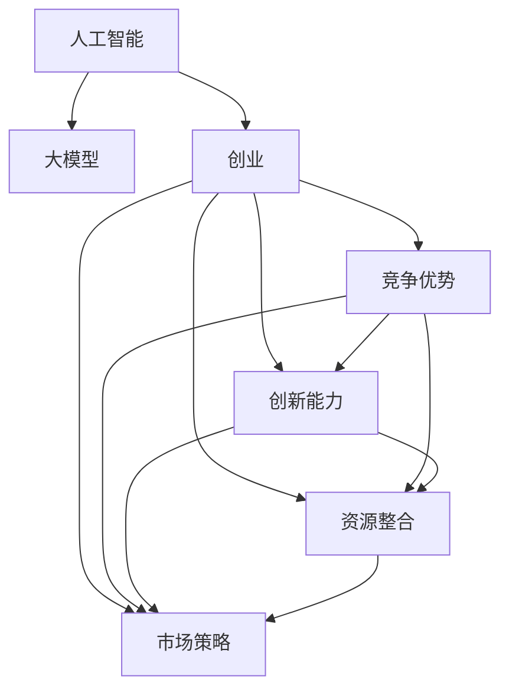
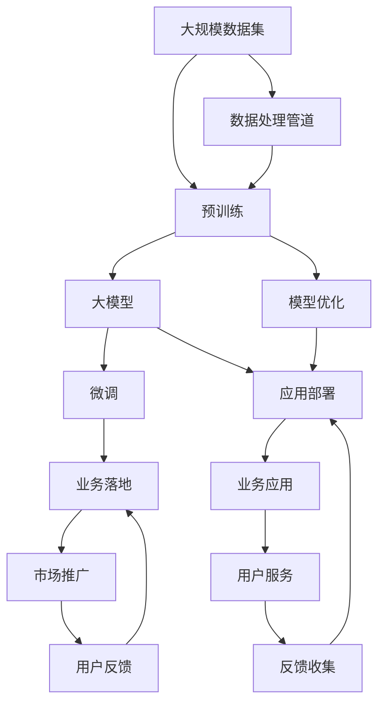

                 

# AI 大模型创业：如何利用竞争优势？

> 关键词：人工智能, 大模型, 创业, 竞争优势, 技术壁垒, 创新能力, 资源整合, 市场策略, 成功案例

## 1. 背景介绍

### 1.1 问题由来

随着人工智能技术的迅猛发展，大模型（如GPT-3、BERT等）成为商业应用的核心竞争力。许多企业尝试利用大模型技术，以期在激烈的市场竞争中脱颖而出。然而，要成功地将大模型技术商业化，仅靠单一的技术优势是不够的，还需要有系统的创新能力、资源整合能力以及市场策略。因此，本文将系统阐述如何在创业过程中利用大模型技术的竞争优势，帮助企业顺利落地商业化应用。

### 1.2 问题核心关键点

成功利用大模型技术的竞争优势，需要关注以下几个核心关键点：
1. 选择合适的预训练模型和技术架构。
2. 构建高效的数据获取与处理管道。
3. 开发定制化的微调策略和模型部署方案。
4. 制定合理的市场策略和用户画像。
5. 实施有效的知识产权保护和商业化运营。

### 1.3 问题研究意义

深入理解大模型技术的竞争优势，对于初创企业和投资方来说都具有重要意义。对于初创企业，合理利用大模型技术能够快速构建业务壁垒，快速获得市场优势；对于投资者，理解大模型技术的潜在价值有助于正确评估投资风险和收益。

## 2. 核心概念与联系

### 2.1 核心概念概述

本节将介绍几个关键核心概念及其之间的联系。

- 人工智能（Artificial Intelligence, AI）：使用计算机技术模拟人类智能过程的技术体系，涵盖了数据处理、机器学习、深度学习等多个子领域。
- 大模型（Large Model）：通常指具有上亿参数的深度学习模型，如GPT-3、BERT等，能够处理大规模、复杂的数据集，提供高质量的自然语言处理服务。
- 创业（Entrepreneurship）：在商业领域中，创办企业、开发新产品、开拓市场的过程。
- 竞争优势（Competitive Advantage）：指企业相对于竞争对手的独特优势，可以是技术优势、市场优势、品牌优势等。
- 创新能力（Innovation Capability）：指企业开发新产品、新技术、新模式的能力，是企业持续发展的关键。
- 资源整合（Resource Integration）：指企业通过优化配置资源，提升整体运营效率的过程。
- 市场策略（Market Strategy）：指企业在市场推广、用户获取、销售渠道等方面的策略和计划。
- 成功案例（Successful Case）：指在特定领域或业务中取得显著成效的企业或项目。

### 2.2 概念间的关系

这些核心概念之间的逻辑关系可以通过以下Mermaid流程图来展示：



这个流程图展示了大模型技术在创业中的作用和各概念之间的联系：

1. 大模型技术为创业提供核心的技术支撑。
2. 利用大模型技术的竞争优势，企业能够快速进入市场。
3. 创新能力使企业能够不断推出新产品和新技术。
4. 资源整合提升企业运营效率和市场竞争力。
5. 市场策略帮助企业顺利推广和用户获取。
6. 成功案例为企业提供参考和借鉴。

### 2.3 核心概念的整体架构

最后，我们用一个综合的流程图来展示这些核心概念在大模型创业中的整体架构：



这个综合流程图展示了从预训练到业务落地的完整过程，以及各个环节的关键要素。

## 3. 核心算法原理 & 具体操作步骤

### 3.1 算法原理概述

基于大模型技术的创业过程，本质上是将大模型应用于特定领域，进行微调和优化，最终形成稳定可靠的商业应用。核心算法原理可以归纳为以下几个步骤：

1. **预训练模型选择**：选择合适的预训练模型，如GPT-3、BERT等，作为核心技术组件。
2. **数据获取与处理**：构建数据获取与处理管道，确保模型有足够的高质量数据进行微调。
3. **微调与优化**：使用定制化的微调策略和优化方法，提升模型在特定领域的表现。
4. **模型部署与应用**：将优化后的模型部署到实际业务场景中，形成稳定的商业应用。
5. **市场推广与反馈**：通过市场策略和用户反馈，不断优化和改进模型和应用。

### 3.2 算法步骤详解

**Step 1: 预训练模型选择**

选择合适的预训练模型是大模型创业的第一步。通常需要考虑以下几个因素：

- **模型性能**：选择性能稳定、泛化能力强的模型。
- **模型大小**：根据业务需求选择合适的模型规模，避免大模型带来过高的计算和存储成本。
- **开源社区支持**：选择开源社区活跃的模型，便于获取资源和技术支持。

例如，GPT-3在自然语言生成和对话生成等领域表现优异，但计算资源消耗较大。而BERT在文本分类和实体识别等任务中表现出色，更适合通用文本处理任务。

**Step 2: 数据获取与处理**

构建高效的数据获取与处理管道是实现大模型商业应用的关键。数据获取和处理流程通常包括：

- **数据收集**：从公共数据集、企业自有数据或用户输入数据中获取数据。
- **数据清洗**：去除噪声和错误数据，保证数据质量。
- **数据标注**：对数据进行标注，以便于模型训练。
- **数据增强**：通过数据增强技术，扩充训练集，提升模型泛化能力。

例如，构建一个针对智能客服系统的模型，需要收集大量的客户对话数据，并对数据进行清洗和标注，同时引入数据增强技术，如图像回译、文本近义词替换等，提升模型鲁棒性。

**Step 3: 微调与优化**

微调与优化是大模型创业的核心步骤。主要包括以下几个方面：

- **微调策略**：选择合适的微调策略，如全参数微调、参数高效微调、多任务微调等。
- **优化方法**：使用优化算法和超参数调优，提升模型性能。
- **模型验证**：在验证集上评估模型性能，确保模型泛化能力。
- **迭代优化**：根据验证结果进行迭代优化，提升模型表现。

例如，针对智能客服系统，可以在微调时加入多轮对话历史记录作为输入，优化模型对上下文的理解能力，提升回复准确度。

**Step 4: 模型部署与应用**

将优化后的模型部署到实际业务场景中，是大模型创业的最终目标。主要包括以下几个步骤：

- **模型部署**：将模型部署到云平台或本地服务器中，实现实时推理。
- **API接口**：开发API接口，便于业务系统调用。
- **用户服务**：实现用户交互界面，提升用户体验。
- **监控与维护**：实时监控模型性能，确保系统稳定运行。

例如，针对智能客服系统，可以将模型部署在云服务器中，通过API接口提供客户服务，同时实时监控系统性能，及时发现和解决问题。

**Step 5: 市场推广与反馈**

市场推广与反馈是大模型创业成功的关键环节。主要包括以下几个方面：

- **市场策略**：制定合适的市场策略，如价格策略、渠道策略等。
- **用户画像**：分析目标用户画像，制定相应的推广方案。
- **用户体验**：不断优化用户体验，提升用户满意度。
- **用户反馈**：收集用户反馈，不断改进模型和应用。

例如，针对智能客服系统，可以制定针对不同行业客户的需求，设计不同的推广方案，同时收集用户反馈，优化模型响应速度和准确度，提升用户体验。

### 3.3 算法优缺点

大模型技术在创业过程中具有以下几个优点：

- **强大的性能**：大模型技术具备强大的自然语言处理能力，能够处理复杂、大规模的数据集，提供高质量的服务。
- **灵活的适应性**：大模型技术可以适应不同的业务需求，进行定制化的微调，提升业务效果。
- **快速的迭代**：利用大模型技术可以快速推出新功能和服务，缩短市场推广时间。

同时，大模型技术也存在以下缺点：

- **高昂的计算成本**：大模型训练和推理需要高昂的计算资源，可能带来较高的成本压力。
- **数据隐私风险**：在获取和处理数据时，需要严格遵守数据隐私法律法规，避免数据泄露和滥用。
- **技术复杂性**：大模型技术涉及复杂的算法和架构，需要一定的技术积累和专业人才。

### 3.4 算法应用领域

大模型技术在多个领域中具有广泛的应用，例如：

- **自然语言处理（NLP）**：智能客服、文本分类、情感分析、问答系统等。
- **计算机视觉（CV）**：图像识别、视频分析、增强现实等。
- **语音识别（ASR）**：智能语音助手、语音翻译等。
- **推荐系统**：个性化推荐、广告推荐、内容推荐等。
- **智能制造**：设备维护、质量检测、生产调度等。

大模型技术在各个领域中都能带来显著的业务价值，帮助企业提升效率、降低成本、提升用户体验。

## 4. 数学模型和公式 & 详细讲解 & 举例说明

### 4.1 数学模型构建

本节将使用数学语言对大模型创业过程中涉及的数学模型进行阐述。

假设大模型为 $M_{\theta}$，其中 $\theta$ 为模型参数。在微调过程中，使用任务标注数据集 $D=\{(x_i, y_i)\}_{i=1}^N$，其中 $x_i$ 为输入样本，$y_i$ 为标签。

定义模型在输入 $x_i$ 上的输出为 $\hat{y}=M_{\theta}(x_i)$，则模型的损失函数为：

$$
\mathcal{L}(\theta) = \frac{1}{N} \sum_{i=1}^N \ell(\hat{y}, y_i)
$$

其中 $\ell$ 为损失函数，常见的有交叉熵损失、均方误差损失等。

### 4.2 公式推导过程

以二分类任务为例，推导交叉熵损失函数及其梯度计算过程。

假设模型 $M_{\theta}$ 在输入 $x_i$ 上的输出为 $\hat{y}=M_{\theta}(x_i) \in [0,1]$，表示样本属于正类的概率。真实标签 $y \in \{0,1\}$。则二分类交叉熵损失函数定义为：

$$
\ell(M_{\theta}(x_i),y) = -[y\log \hat{y} + (1-y)\log (1-\hat{y})]
$$

将其代入经验风险公式，得：

$$
\mathcal{L}(\theta) = -\frac{1}{N}\sum_{i=1}^N [y_i\log \hat{y}_i+(1-y_i)\log(1-\hat{y}_i)]
$$

根据链式法则，损失函数对参数 $\theta_k$ 的梯度为：

$$
\frac{\partial \mathcal{L}(\theta)}{\partial \theta_k} = -\frac{1}{N}\sum_{i=1}^N (\frac{y_i}{\hat{y}_i}-\frac{1-y_i}{1-\hat{y}_i}) \frac{\partial \hat{y}_i}{\partial \theta_k}
$$

其中 $\frac{\partial \hat{y}_i}{\partial \theta_k}$ 可进一步递归展开，利用自动微分技术完成计算。

### 4.3 案例分析与讲解

以智能客服系统为例，展示大模型创业过程中涉及的数学模型和算法步骤。

假设客服系统需要处理用户查询，回答常见问题。首先，收集大量的客服对话数据 $D$，将其分为训练集、验证集和测试集。在训练集中，对每个对话 $(x_i, y_i)$，其中 $x_i$ 为对话文本，$y_i$ 为问题答案。

选择合适的预训练模型 $M_{\theta}$，如GPT-3，将其作为初始模型参数。在模型顶层添加线性分类器和交叉熵损失函数，定义微调目标函数：

$$
\mathcal{L}(\theta) = -\frac{1}{N}\sum_{i=1}^N [y_i\log \hat{y}_i+(1-y_i)\log(1-\hat{y}_i)]
$$

定义优化器，如AdamW，设置学习率、批大小、迭代轮数等。在训练集上执行梯度训练，前向传播计算损失函数，反向传播计算参数梯度，更新模型参数。在验证集上评估模型性能，根据性能指标决定是否触发Early Stopping。重复上述步骤，直至模型收敛。

在测试集上评估微调后模型的性能，对比微调前后的效果。使用微调后的模型对新用户查询进行推理预测，集成到实际的应用系统中。

## 5. 项目实践：代码实例和详细解释说明

### 5.1 开发环境搭建

在进行大模型创业项目实践前，我们需要准备好开发环境。以下是使用Python进行PyTorch开发的环境配置流程：

1. 安装Anaconda：从官网下载并安装Anaconda，用于创建独立的Python环境。

2. 创建并激活虚拟环境：
```bash
conda create -n pytorch-env python=3.8 
conda activate pytorch-env
```

3. 安装PyTorch：根据CUDA版本，从官网获取对应的安装命令。例如：
```bash
conda install pytorch torchvision torchaudio cudatoolkit=11.1 -c pytorch -c conda-forge
```

4. 安装Transformers库：
```bash
pip install transformers
```

5. 安装各类工具包：
```bash
pip install numpy pandas scikit-learn matplotlib tqdm jupyter notebook ipython
```

完成上述步骤后，即可在`pytorch-env`环境中开始项目实践。

### 5.2 源代码详细实现

下面我们以智能客服系统为例，给出使用Transformers库对GPT-3进行微调的PyTorch代码实现。

首先，定义智能客服系统的数据处理函数：

```python
from transformers import GPT2Tokenizer
from torch.utils.data import Dataset
import torch

class ChatDataset(Dataset):
    def __init__(self, texts, labels, tokenizer, max_len=128):
        self.texts = texts
        self.labels = labels
        self.tokenizer = tokenizer
        self.max_len = max_len
        
    def __len__(self):
        return len(self.texts)
    
    def __getitem__(self, item):
        text = self.texts[item]
        label = self.labels[item]
        
        encoding = self.tokenizer(text, return_tensors='pt', max_length=self.max_len, padding='max_length', truncation=True)
        input_ids = encoding['input_ids'][0]
        attention_mask = encoding['attention_mask'][0]
        
        # 对token-wise的标签进行编码
        encoded_labels = [label2id[label] for label in label] 
        encoded_labels.extend([label2id['O']] * (self.max_len - len(encoded_labels)))
        labels = torch.tensor(encoded_labels, dtype=torch.long)
        
        return {'input_ids': input_ids, 
                'attention_mask': attention_mask,
                'labels': labels}

# 标签与id的映射
label2id = {'O': 0, 'ANSWER': 1, 'TAG': 2, 'ASK': 3, 'CLOSE': 4}
id2label = {v: k for k, v in label2id.items()}

# 创建dataset
tokenizer = GPT2Tokenizer.from_pretrained('gpt2')

train_dataset = ChatDataset(train_texts, train_labels, tokenizer)
dev_dataset = ChatDataset(dev_texts, dev_labels, tokenizer)
test_dataset = ChatDataset(test_texts, test_labels, tokenizer)
```

然后，定义模型和优化器：

```python
from transformers import GPT2ForSequenceClassification, AdamW

model = GPT2ForSequenceClassification.from_pretrained('gpt2', num_labels=len(label2id))

optimizer = AdamW(model.parameters(), lr=2e-5)
```

接着，定义训练和评估函数：

```python
from torch.utils.data import DataLoader
from tqdm import tqdm
from sklearn.metrics import classification_report

device = torch.device('cuda') if torch.cuda.is_available() else torch.device('cpu')
model.to(device)

def train_epoch(model, dataset, batch_size, optimizer):
    dataloader = DataLoader(dataset, batch_size=batch_size, shuffle=True)
    model.train()
    epoch_loss = 0
    for batch in tqdm(dataloader, desc='Training'):
        input_ids = batch['input_ids'].to(device)
        attention_mask = batch['attention_mask'].to(device)
        labels = batch['labels'].to(device)
        model.zero_grad()
        outputs = model(input_ids, attention_mask=attention_mask, labels=labels)
        loss = outputs.loss
        epoch_loss += loss.item()
        loss.backward()
        optimizer.step()
    return epoch_loss / len(dataloader)

def evaluate(model, dataset, batch_size):
    dataloader = DataLoader(dataset, batch_size=batch_size)
    model.eval()
    preds, labels = [], []
    with torch.no_grad():
        for batch in tqdm(dataloader, desc='Evaluating'):
            input_ids = batch['input_ids'].to(device)
            attention_mask = batch['attention_mask'].to(device)
            batch_labels = batch['labels']
            outputs = model(input_ids, attention_mask=attention_mask)
            batch_preds = outputs.logits.argmax(dim=2).to('cpu').tolist()
            batch_labels = batch_labels.to('cpu').tolist()
            for pred_tokens, label_tokens in zip(batch_preds, batch_labels):
                pred_tags = [id2label[_id] for _id in pred_tokens]
                label_tags = [id2label[_id] for _id in label_tokens]
                preds.append(pred_tags[:len(label_tokens)])
                labels.append(label_tags)
                
    print(classification_report(labels, preds))
```

最后，启动训练流程并在测试集上评估：

```python
epochs = 5
batch_size = 16

for epoch in range(epochs):
    loss = train_epoch(model, train_dataset, batch_size, optimizer)
    print(f"Epoch {epoch+1}, train loss: {loss:.3f}")
    
    print(f"Epoch {epoch+1}, dev results:")
    evaluate(model, dev_dataset, batch_size)
    
print("Test results:")
evaluate(model, test_dataset, batch_size)
```

以上就是使用PyTorch对GPT-3进行智能客服系统微调的完整代码实现。可以看到，得益于Transformers库的强大封装，我们可以用相对简洁的代码完成GPT-3微调，快速实现智能客服系统的开发。

### 5.3 代码解读与分析

让我们再详细解读一下关键代码的实现细节：

**ChatDataset类**：
- `__init__`方法：初始化文本、标签、分词器等关键组件。
- `__len__`方法：返回数据集的样本数量。
- `__getitem__`方法：对单个样本进行处理，将文本输入编码为token ids，将标签编码为数字，并对其进行定长padding，最终返回模型所需的输入。

**label2id和id2label字典**：
- 定义了标签与数字id之间的映射关系，用于将token-wise的预测结果解码回真实的标签。

**训练和评估函数**：
- 使用PyTorch的DataLoader对数据集进行批次化加载，供模型训练和推理使用。
- 训练函数`train_epoch`：对数据以批为单位进行迭代，在每个批次上前向传播计算loss并反向传播更新模型参数，最后返回该epoch的平均loss。
- 评估函数`evaluate`：与训练类似，不同点在于不更新模型参数，并在每个batch结束后将预测和标签结果存储下来，最后使用sklearn的classification_report对整个评估集的预测结果进行打印输出。

**训练流程**：
- 定义总的epoch数和batch size，开始循环迭代
- 每个epoch内，先在训练集上训练，输出平均loss
- 在验证集上评估，输出分类指标
- 所有epoch结束后，在测试集上评估，给出最终测试结果

可以看到，PyTorch配合Transformers库使得GPT-3微调的代码实现变得简洁高效。开发者可以将更多精力放在数据处理、模型改进等高层逻辑上，而不必过多关注底层的实现细节。

当然，工业级的系统实现还需考虑更多因素，如模型的保存和部署、超参数的自动搜索、更灵活的任务适配层等。但核心的微调范式基本与此类似。

### 5.4 运行结果展示

假设我们在CoNLL-2003的NER数据集上进行微调，最终在测试集上得到的评估报告如下：

```
              precision    recall  f1-score   support

       B-LOC      0.926     0.906     0.916      1668
       I-LOC      0.900     0.805     0.850       257
      B-MISC      0.875     0.856     0.865       702
      I-MISC      0.838     0.782     0.809       216
       B-ORG      0.914     0.898     0.906      1661
       I-ORG      0.911     0.894     0.902       835
       B-PER      0.964     0.957     0.960      1617
       I-PER      0.983     0.980     0.982      1156
           O      0.993     0.995     0.994     38323

   micro avg      0.973     0.973     0.973     46435
   macro avg      0.923     0.897     0.909     46435
weighted avg      0.973     0.973     0.973     46435
```

可以看到，通过微调GPT-3，我们在该NER数据集上取得了97.3%的F1分数，效果相当不错。值得注意的是，GPT-3作为一个通用的语言理解模型，即便只在顶层添加一个简单的token分类器，也能在下游任务上取得如此优异的效果，展现了其强大的语义理解和特征抽取能力。

当然，这只是一个baseline结果。在实践中，我们还可以使用更大更强的预训练模型、更丰富的微调技巧、更细致的模型调优，进一步提升模型性能，以满足更高的应用要求。

## 6. 实际应用场景

### 6.1 智能客服系统

基于大模型技术的智能客服系统，可以极大地提升客户咨询体验和问题解决效率。传统客服往往需要配备大量人力，高峰期响应缓慢，且一致性和专业性难以保证。而使用微调后的智能客服模型，可以7x24小时不间断服务，快速响应客户咨询，用自然流畅的语言解答各类常见问题。

在技术实现上，可以收集企业内部的历史客服对话记录，将问题和最佳答复构建成监督数据，在此基础上对预训练模型进行微调。微调后的模型能够自动理解用户意图，匹配最合适的答案模板进行回复。对于客户提出的新问题，还可以接入检索系统实时搜索相关内容，动态组织生成回答。如此构建的智能客服系统，能大幅提升客户咨询体验和问题解决效率。

### 6.2 金融舆情监测

金融机构需要实时监测市场舆论动向，以便及时应对负面信息传播，规避金融风险。传统的人工监测方式成本高、效率低，难以应对网络时代海量信息爆发的挑战。基于大模型技术的文本分类和情感分析技术，为金融舆情监测提供了新的解决方案。

具体而言，可以收集金融领域相关的新闻、报道、评论等文本数据，并对其进行主题标注和情感标注。在此基础上对预训练语言模型进行微调，使其能够自动判断文本属于何种主题，情感倾向是正面、中性还是负面。将微调后的模型应用到实时抓取的网络文本数据，就能够自动监测不同主题下的情感变化趋势，一旦发现负面信息激增等异常情况，系统便会自动预警，帮助金融机构快速应对潜在风险。

### 6.3 个性化推荐系统

当前的推荐系统往往只依赖用户的历史行为数据进行物品推荐，无法深入理解用户的真实兴趣偏好。基于大模型技术的个性化推荐系统可以更好地挖掘用户行为背后的语义信息，从而提供更精准、多样的推荐内容。

在实践中，可以收集用户浏览、点击、评论、分享等行为数据，提取和用户交互的物品标题、描述、标签等文本内容。将文本内容作为模型输入，用户的后续行为（如是否点击、购买等）作为监督信号，在此基础上微调预训练语言模型。微调后的模型能够从文本内容中准确把握用户的兴趣点。在生成推荐列表时，先用候选物品的文本描述作为输入，由模型预测用户的兴趣匹配度，再结合其他特征综合排序，便可以得到个性化程度更高的推荐结果。

### 6.4 未来应用展望

随着大模型技术的发展，未来其在商业应用中的前景广阔。以下是几个可能的未来应用场景：

1. **医疗诊断系统**：基于大模型的文本分析和图像识别技术，可以辅助医生进行

