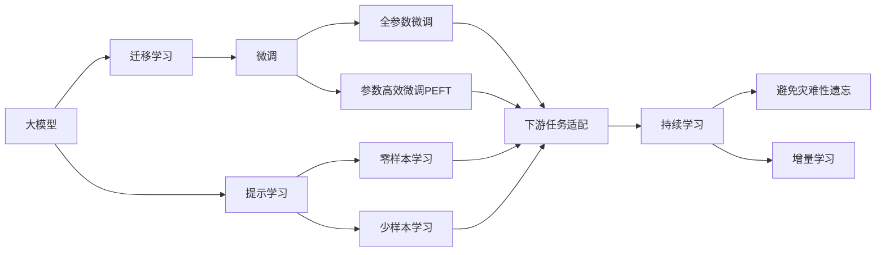

                 

## 1. 背景介绍

### 1.1 问题由来
随着人工智能（AI）技术的飞速发展，大模型已经在自然语言处理（NLP）、计算机视觉（CV）、生成对抗网络（GANs）等领域取得了令人瞩目的成果。然而，尽管大模型表现优异，但将其转化为商业应用，仍面临诸多挑战。其中，创业公司在利用大模型资源优势，打造具有市场竞争力的人工智能产品时，尤为困难。本文旨在探讨如何充分利用大模型资源，解决创业公司在AI创业中遇到的难题。

### 1.2 问题核心关键点
大模型资源的优势在于其规模庞大、学习能力卓越。但如何发挥这一优势，并将其转化为商业价值，是创业公司必须面对的核心挑战。本文将深入分析大模型的各种应用场景和创业公司可利用的资源优势，帮助创业公司找到实现商业成功的路径。

### 1.3 问题研究意义
本文的研究不仅有助于创业公司更好地理解和使用大模型，还将为未来的AI技术创业提供有价值的参考和指导，推动人工智能技术的产业化进程。

## 2. 核心概念与联系

### 2.1 核心概念概述

- **大模型（Large Model）**：指的是那些基于大规模数据集训练而成的神经网络模型，如BERT、GPT、ViT等。这些模型通常具有数亿甚至数十亿个参数，能够处理复杂的语言和视觉任务。

- **迁移学习（Transfer Learning）**：指将在大规模数据上预训练得到的模型，应用于特定任务或领域的学习方式。这不仅可以降低数据和计算资源的消耗，还能提升模型在小样本任务上的表现。

- **微调（Fine-tuning）**：指在大模型的基础上，针对特定任务进行参数更新，以提高模型在该任务上的性能。微调通常只需要较少的标注数据，能够快速提升模型精度。

- **参数高效微调（Parameter-Efficient Fine-tuning, PEFT）**：指在微调过程中，只更新少量的模型参数，以减少计算资源消耗的方法。PEFT不仅能提高效率，还能提升模型性能。

- **提示学习（Prompt Learning）**：指通过在输入数据中添加特定的提示信息，引导模型按照期望的方式输出。提示学习可以在不更新模型参数的情况下，实现零样本或少样本学习。

### 2.2 概念间的关系

这些核心概念之间存在着紧密的联系，构成了大模型创业的完整框架。以下是一个概括性图示：



这个图示展示了从大模型到微调、再到下游任务适配的完整过程，其中包含了迁移学习、提示学习、持续学习等多种技术手段。

## 3. 核心算法原理 & 具体操作步骤
### 3.1 算法原理概述

创业公司可以利用大模型的迁移学习能力和参数高效微调技术，将大模型应用于特定领域或任务的微调，以快速提升模型性能，降低开发成本。大模型的迁移学习能力使其能够在不使用大规模标注数据的情况下，适应新的任务和领域。参数高效微调技术则能够通过仅更新少量参数，实现对特定任务的微调，减少计算资源消耗。

### 3.2 算法步骤详解

以下是创业公司利用大模型进行迁移学习和微调的具体操作步骤：

1. **选择适当的大模型**：根据任务需求选择合适的大模型。如NLP任务可以选择BERT、GPT等预训练模型，CV任务可以选择ResNet、ViT等预训练模型。

2. **数据准备**：收集和标注任务所需的少量数据集，用于微调。数据集应尽可能覆盖任务的各种情况，以确保模型的泛化能力。

3. **微调模型**：使用选择的预训练模型，对数据集进行微调。微调时可以选择全参数微调或参数高效微调。

   - 全参数微调：更新所有参数以适应任务需求。
   - 参数高效微调：仅更新部分参数，如顶层分类器或解码器。

4. **评估和迭代**：使用验证集评估微调模型的性能，根据评估结果调整超参数和微调策略，直至达到满意效果。

5. **应用部署**：将微调好的模型部署到生产环境中，提供相应的API接口，供外界调用。

### 3.3 算法优缺点

**优点**：

- **快速迭代**：大模型具有很强的泛化能力，能够快速适应新任务。
- **高效利用资源**：参数高效微调和提示学习技术，能够减少计算资源消耗，降低开发成本。
- **灵活性高**：可以针对不同领域和任务进行微调，适应性强。

**缺点**：

- **数据依赖**：微调仍需一定的标注数据，数据获取和标注成本较高。
- **过拟合风险**：微调过程中可能出现过拟合，需要采取正则化等措施。
- **泛化能力有限**：在数据分布差异较大的情况下，泛化能力可能受限。

### 3.4 算法应用领域

大模型的迁移学习和微调技术，已经在NLP、CV、生成模型等领域得到了广泛应用。以下是几个典型的应用场景：

- **NLP领域**：如问答系统、文本分类、机器翻译、情感分析等。通过微调，能够提高模型的准确率和适应性。
- **CV领域**：如物体检测、图像分类、图像生成等。通过微调，能够提升模型的识别能力和生成效果。
- **生成模型**：如GANs、变分自编码器等。通过微调，能够生成更加逼真的图像、视频等内容。

## 4. 数学模型和公式 & 详细讲解  
### 4.1 数学模型构建

假设有一个大模型 $M_\theta$，其中 $\theta$ 为模型参数。选择一个下游任务 $T$，其标注数据集为 $D=\{(x_i, y_i)\}_{i=1}^N$，其中 $x_i$ 为输入数据，$y_i$ 为标签。

定义模型在输入数据 $x_i$ 上的损失函数为 $\ell(M_\theta(x_i), y_i)$。则经验风险为：

$$
\mathcal{L}(\theta) = \frac{1}{N}\sum_{i=1}^N \ell(M_\theta(x_i), y_i)
$$

### 4.2 公式推导过程

以二分类任务为例，定义模型 $M_\theta$ 在输入 $x$ 上的输出为 $\hat{y}=M_\theta(x) \in [0,1]$，表示样本属于正类的概率。真实标签 $y \in \{0,1\}$。

二分类交叉熵损失函数定义为：

$$
\ell(M_\theta(x),y) = -[y\log \hat{y} + (1-y)\log (1-\hat{y})]
$$

则经验风险为：

$$
\mathcal{L}(\theta) = -\frac{1}{N}\sum_{i=1}^N [y_i\log M_\theta(x_i)+(1-y_i)\log(1-M_\theta(x_i))]
$$

### 4.3 案例分析与讲解

考虑一个NLP任务，如情感分析。在微调过程中，将预训练模型 $M_\theta$ 作为特征提取器，对情感分析任务的标注数据集 $D$ 进行微调，更新部分参数以适应情感分析任务。微调后，模型输出 $\hat{y}=M_\theta(x)$ 表示输入文本 $x$ 的情感分类。

## 5. 项目实践：代码实例和详细解释说明
### 5.1 开发环境搭建

创业公司需要搭建一个Python开发环境，并选择合适的深度学习框架。以下是搭建环境的详细步骤：

1. **安装Python和虚拟环境**：使用Anaconda或Miniconda安装Python，并创建虚拟环境。
```bash
conda create -n pytorch_env python=3.8
conda activate pytorch_env
```

2. **安装深度学习框架**：选择PyTorch或TensorFlow作为深度学习框架。
```bash
pip install torch torchvision torchaudio transformers
```

3. **安装其他必要的库**：安装TensorBoard、Weights & Biases等工具，用于模型监控和调试。
```bash
pip install tensorboard weights_and_biases
```

4. **代码调试和优化**：利用PyTorch的动态图特性，快速迭代模型，并进行性能优化。

### 5.2 源代码详细实现

以使用PyTorch对BERT模型进行情感分析任务微调为例，以下是详细的代码实现：

```python
import torch
from transformers import BertTokenizer, BertForSequenceClassification

# 加载BERT模型和分词器
tokenizer = BertTokenizer.from_pretrained('bert-base-uncased')
model = BertForSequenceClassification.from_pretrained('bert-base-uncased', num_labels=2)

# 准备数据
train_data = ...
train_labels = ...

# 定义数据处理函数
def tokenize_and_tensor(texts, labels):
    encodings = tokenizer(texts, truncation=True, padding='max_length', max_length=128, return_tensors='pt')
    inputs = encodings['input_ids']
    labels = torch.tensor(labels)
    return inputs, labels

# 数据处理
train_inputs, train_labels = tokenize_and_tensor(train_data, train_labels)

# 定义损失函数和优化器
loss_fn = torch.nn.CrossEntropyLoss()
optimizer = torch.optim.AdamW(model.parameters(), lr=2e-5)

# 训练模型
model.train()
for epoch in range(5):
    optimizer.zero_grad()
    outputs = model(train_inputs)
    loss = loss_fn(outputs.logits, train_labels)
    loss.backward()
    optimizer.step()
    print(f"Epoch {epoch+1}, loss: {loss.item()}")

# 评估模型
model.eval()
eval_data = ...
eval_labels = ...
eval_inputs, eval_labels = tokenize_and_tensor(eval_data, eval_labels)

with torch.no_grad():
    outputs = model(eval_inputs)
    predicted_labels = outputs.logits.argmax(dim=1)
    print(f"Accuracy: {torch.tensor(predicted_labels).eq(eval_labels).float().mean().item()}")
```

### 5.3 代码解读与分析

以上代码实现了对BERT模型的情感分析任务微调。代码中，首先加载BERT模型和分词器，然后定义数据处理函数，处理训练数据和标签。接着定义损失函数和优化器，进行模型训练和评估。

## 6. 实际应用场景

### 6.1 智能客服系统

智能客服系统可以利用大模型进行情感分析，识别客户情感，提供个性化的服务。例如，在用户提出问题时，智能客服系统可以实时分析用户情感，调整回复策略，提高客户满意度。

### 6.2 金融舆情监测

金融机构可以利用大模型进行舆情监测，实时分析市场动态，预测风险。例如，利用大模型进行情感分析，监控新闻报道和社交媒体，及时发现市场波动，提前预警。

### 6.3 个性化推荐系统

个性化推荐系统可以利用大模型进行用户画像和行为分析，提升推荐效果。例如，利用大模型进行文本分类，分析用户偏好，生成个性化推荐列表。

### 6.4 未来应用展望

未来，大模型将继续在更多领域得到应用，推动人工智能技术的产业化进程。例如，医疗领域可以利用大模型进行疾病预测和患者管理，提升医疗服务质量；教育领域可以利用大模型进行智能辅导和作业批改，提高教学效果；农业领域可以利用大模型进行农作物识别和病虫害预测，提高农业生产效率。

## 7. 工具和资源推荐

### 7.1 学习资源推荐

- **《Deep Learning》**：Ian Goodfellow等著，全面介绍深度学习的基本理论和实践。
- **《Hands-On Machine Learning with Scikit-Learn, Keras, and TensorFlow》**：Aurélien Géron著，详细介绍Python深度学习框架的使用。
- **《Transformers: State-of-the-Art Natural Language Processing》**：Jacob Devlin等著，介绍Transformer模型及其在NLP中的应用。
- **《Pattern Recognition and Machine Learning》**：Christopher Bishop著，介绍机器学习的基本概念和算法。
- **Kaggle**：数据科学竞赛平台，提供大量开源数据集和竞赛，促进学习和实践。

### 7.2 开发工具推荐

- **PyTorch**：基于Python的深度学习框架，支持动态图和静态图计算。
- **TensorFlow**：由Google开发的深度学习框架，支持分布式计算和GPU加速。
- **Weights & Biases**：模型训练和调试工具，支持自动记录实验参数和结果。
- **TensorBoard**：模型可视化工具，支持绘制图表和实时监控训练过程。

### 7.3 相关论文推荐

- **"Attention is All You Need"**： Vaswani等，介绍Transformer模型。
- **"BERT: Pre-training of Deep Bidirectional Transformers for Language Understanding"**：Devlin等，介绍BERT模型及其在NLP中的应用。
- **"Parameter-Efficient Transfer Learning for NLP"**：Howard等，介绍参数高效微调方法。
- **"AdaLoRA: Adaptive Low-Rank Adaptation for Parameter-Efficient Fine-Tuning"**：Zhou等，介绍AdaLoRA方法。

## 8. 总结：未来发展趋势与挑战

### 8.1 研究成果总结

本文探讨了大模型在AI创业中的应用，详细介绍了迁移学习和微调技术的原理和操作步骤。通过案例分析和代码实现，展示了如何利用大模型资源，快速迭代和优化AI产品。

### 8.2 未来发展趋势

未来，大模型将继续在更多领域得到应用，推动AI技术的产业化进程。大模型将与其他AI技术如知识图谱、因果推理、强化学习等进行融合，提升模型的智能性和普适性。

### 8.3 面临的挑战

尽管大模型具有诸多优势，但创业公司在应用大模型时仍面临诸多挑战。数据获取和标注成本较高，模型泛化能力有限，模型过拟合风险大，模型的可解释性和安全问题也需关注。

### 8.4 研究展望

未来，应关注如何利用大模型进行无监督学习和半监督学习，提高模型的自适应能力。同时，需加强模型的可解释性和安全性，提升模型的可信度和适用性。

## 9. 附录：常见问题与解答

**Q1：大模型创业需要哪些资源？**

A: 大模型创业需要充足的资金、人才和技术资源。资金用于设备购置、技术研发和市场推广，人才包括数据科学家、算法工程师、产品经理等，技术资源包括深度学习框架、数据处理工具、模型训练平台等。

**Q2：如何选择合适的预训练模型？**

A: 选择合适的预训练模型应考虑任务的复杂度和数据量。对于大规模数据集，应选择参数量较大的模型；对于小规模数据集，应选择参数量较小的模型。同时，应评估模型的性能和可解释性。

**Q3：大模型在微调过程中如何进行参数优化？**

A: 在微调过程中，可以使用学习率调整、正则化技术、对抗训练等方法进行参数优化。同时，可以利用参数高效微调方法，减少计算资源消耗。

**Q4：如何评估微调模型的性能？**

A: 可以使用验证集进行评估，选择合适的评估指标如准确率、召回率、F1分数等。同时，可以进行可视化分析，了解模型的预测分布和错误原因。

**Q5：大模型在落地部署时需要注意哪些问题？**

A: 在部署过程中，应注意模型的加载速度、推理速度、计算资源消耗等问题。同时，需考虑模型的可扩展性和稳定性，确保系统的稳定运行。

本文旨在帮助创业公司充分利用大模型的资源优势，提升AI产品的竞争力。通过合理选择预训练模型，进行有效的微调和优化，并结合实际应用场景，可以充分发挥大模型的潜力，推动AI技术的落地应用。

---

作者：禅与计算机程序设计艺术 / Zen and the Art of Computer Programming

