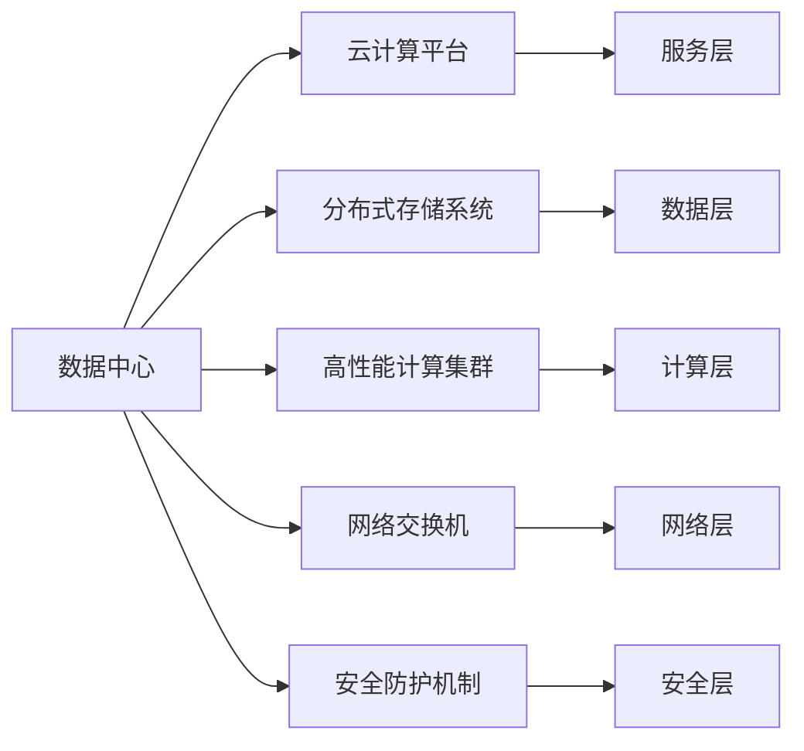

                 

# AI 大模型应用数据中心建设：数据中心标准与规范

## 1. 背景介绍

在当前人工智能(AI)和机器学习(ML)迅猛发展的时代，大模型已经成为推动技术进步和行业应用的重要驱动力。从深度学习到自然语言处理，再到计算机视觉，大模型在各个领域的应用如火如荼。然而，随着大模型规模的不断增长，其对数据中心的需求也日益增加。数据中心不仅是模型训练和推理的关键基础设施，还是确保数据安全和隐私保护的重要防线。因此，构建符合AI大模型应用要求的数据中心，成为了各大企业和研究机构必须面对的挑战。

### 1.1 问题由来

随着深度学习模型参数量的指数级增长，对数据中心计算和存储资源的需求也在不断攀升。例如，GPT-3和T5等大模型的参数量已经达到数十亿级别，对数据中心的计算能力和存储容量提出了极高的要求。同时，这些模型在训练和推理过程中，需要处理海量数据，这对数据中心的传输带宽和处理效率也提出了新的挑战。

此外，数据中心的物理空间和能源消耗也是不可忽视的问题。如何在有限的物理空间内，构建高效、节能、可扩展的数据中心，成为大模型应用的关键环节。传统数据中心的设计和运维模式，往往难以适应AI大模型的计算需求和特殊要求。因此，建设符合AI大模型应用标准的数据中心，迫在眉睫。

### 1.2 问题核心关键点

为了构建符合AI大模型应用要求的数据中心，需要考虑以下几个关键点：

- **计算性能**：确保数据中心拥有强大的计算能力，支持大模型的高并发训练和推理。
- **存储容量**：存储中心应具备高容量、高可靠性的数据存储能力，确保大模型训练和推理数据的持久化。
- **网络带宽**：数据中心应具备高速网络传输能力，支持海量数据的快速读写和传输。
- **能效管理**：数据中心应具备高效的能效管理策略，减少能源消耗和运行成本。
- **安全性**：数据中心应具备严密的安全防护措施，确保数据和模型的隐私和安全。
- **可扩展性**：数据中心应具备良好的可扩展性，支持模型规模的动态调整和扩展。

这些关键点需要从数据中心的设计、建设和运维等多个层面进行综合考虑，才能确保其能够满足AI大模型的应用需求。

## 2. 核心概念与联系

### 2.1 核心概念概述

构建符合AI大模型应用的数据中心，涉及多个核心概念：

- **数据中心**：由计算资源、存储资源和网络资源组成，用于支持大规模数据处理和存储的设施。
- **云计算平台**：通过虚拟化技术和网络技术，将计算资源、存储资源和网络资源抽象为服务，供用户按需使用的平台。
- **分布式存储系统**：由多个物理存储节点构成的存储集群，支持高可靠性、高可用性和高扩展性的数据存储。
- **高性能计算集群**：由多个高性能计算节点构成的计算集群，支持大规模并行计算和高并发请求处理。
- **网络交换机**：用于连接数据中心内部和外部的网络设备，支持高带宽和低延迟的数据传输。
- **安全防护机制**：包括访问控制、数据加密、入侵检测等技术，用于保护数据中心和网络的安全。

这些核心概念之间存在紧密的联系，共同构成了一个高效、可扩展、安全的AI大模型应用数据中心。

### 2.2 概念间的关系

这些核心概念之间的逻辑关系可以通过以下Mermaid流程图来展示：



这个流程图展示了数据中心的核心组件及其相互关系：

- **数据层**：由分布式存储系统组成，用于存储数据中心的各种数据。
- **计算层**：由高性能计算集群组成，用于处理数据中心的各种计算任务。
- **网络层**：由网络交换机组成，用于连接数据中心内部和外部的网络设备，支持高速数据传输。
- **安全层**：由安全防护机制组成，用于保护数据中心和网络的安全。
- **服务层**：由云计算平台组成，提供弹性计算和存储服务，支持大模型的训练和推理。

## 3. 核心算法原理 & 具体操作步骤

### 3.1 算法原理概述

构建符合AI大模型应用的数据中心，涉及多个核心算法和操作步骤，以下是对这些算法和步骤的概述：

- **计算性能优化算法**：通过算法优化，提升数据中心的计算性能，支持大模型的高并发训练和推理。
- **存储性能优化算法**：通过算法优化，提升数据中心的存储性能，支持大模型的高容量、高可靠性数据存储。
- **网络带宽优化算法**：通过算法优化，提升数据中心的网络带宽，支持海量数据的快速读写和传输。
- **能效管理算法**：通过算法优化，提升数据中心的能效，减少能源消耗和运行成本。
- **安全防护算法**：通过算法优化，提升数据中心的安全性，确保数据和模型的隐私和安全。

### 3.2 算法步骤详解

以下是构建AI大模型应用数据中心的详细操作步骤：

**Step 1: 规划和设计**

- **需求分析**：根据AI大模型的应用需求，确定数据中心的计算、存储、网络和安全等要求。
- **选址和建设**：选择适合的物理位置，进行数据中心的选址和建设。
- **系统架构设计**：设计数据中心的网络、存储和计算等系统架构，确保其具备高可靠性、高可用性和高扩展性。

**Step 2: 计算性能优化**

- **计算资源配置**：根据大模型的计算需求，配置足够的计算资源，如CPU、GPU和FPGA等。
- **计算集群优化**：通过算法优化，提升计算集群的高并发处理能力，支持大规模并行计算。
- **计算资源调度**：通过调度算法，合理分配计算资源，支持模型的训练和推理任务。

**Step 3: 存储性能优化**

- **存储资源配置**：根据大模型的数据存储需求，配置足够的存储资源，如HDD、SSD和对象存储等。
- **分布式存储优化**：通过算法优化，提升分布式存储系统的可靠性和可扩展性，支持高容量和高可靠性数据存储。
- **数据持久化管理**：通过管理算法，确保大模型训练和推理数据的持久化和备份。

**Step 4: 网络带宽优化**

- **网络资源配置**：根据大模型的数据传输需求，配置足够的网络资源，如10G/25G/100G网络等。
- **网络拓扑设计**：通过拓扑优化，确保数据中心网络的高带宽和低延迟。
- **网络带宽管理**：通过带宽管理算法，确保网络的有效利用，支持海量数据的快速读写和传输。

**Step 5: 能效管理**

- **能效管理策略**：通过策略优化，提升数据中心的能效，减少能源消耗和运行成本。
- **硬件能效优化**：通过硬件优化，提升计算和存储设备的能效，减少能源消耗。
- **软件能效优化**：通过软件优化，提升数据中心操作系统的能效，减少能源消耗。

**Step 6: 安全防护**

- **访问控制**：通过身份认证和权限管理，确保只有授权用户能够访问数据中心。
- **数据加密**：通过数据加密技术，确保数据的机密性和完整性。
- **入侵检测**：通过入侵检测技术，及时发现和应对潜在的安全威胁。

**Step 7: 系统集成和测试**

- **系统集成**：将计算、存储、网络和安全等子系统集成到一个统一的数据中心平台上。
- **系统测试**：对数据中心进行全面测试，确保其能够满足AI大模型的应用需求。
- **性能优化**：通过性能优化，确保数据中心的各项性能指标达到预期。

**Step 8: 运维和管理**

- **运维策略**：制定数据中心的运维策略，确保其能够持续稳定运行。
- **监控和维护**：通过监控和维护，及时发现和解决问题，确保数据中心的高效运行。
- **升级和扩展**：根据需求变化，适时进行系统升级和扩展，保持数据中心的先进性和可扩展性。

### 3.3 算法优缺点

**计算性能优化算法**

- **优点**：
  - 通过算法优化，提升数据中心的计算性能，支持大模型的高并发训练和推理。
  - 通过资源调度，合理分配计算资源，提高资源利用率。
- **缺点**：
  - 算法优化需要针对特定场景进行设计，通用性较差。
  - 优化效果受硬件性能和架构限制，可能无法达到最优。

**存储性能优化算法**

- **优点**：
  - 通过算法优化，提升分布式存储系统的可靠性和可扩展性。
  - 通过管理算法，确保数据的持久化和备份，保障数据安全。
- **缺点**：
  - 算法优化需要考虑数据访问模式和存储架构，复杂度较高。
  - 优化效果受硬件性能和网络带宽限制，可能无法满足高容量和高可靠性的需求。

**网络带宽优化算法**

- **优点**：
  - 通过算法优化，提升数据中心的网络带宽，支持海量数据的快速读写和传输。
  - 通过拓扑优化，提升网络的高带宽和低延迟，确保数据传输的效率和可靠性。
- **缺点**：
  - 算法优化需要考虑网络拓扑和流量负载，复杂度较高。
  - 优化效果受硬件性能和网络设备限制，可能无法达到最优。

**能效管理算法**

- **优点**：
  - 通过策略优化，提升数据中心的能效，减少能源消耗和运行成本。
  - 通过硬件和软件优化，提高计算和存储设备的能效。
- **缺点**：
  - 能效管理需要综合考虑计算、存储和网络等多个因素，复杂度较高。
  - 优化效果受硬件性能和数据中心架构限制，可能无法达到最优。

**安全防护算法**

- **优点**：
  - 通过身份认证和权限管理，确保数据中心的安全性和隐私保护。
  - 通过数据加密和入侵检测，保护数据和系统的安全。
- **缺点**：
  - 安全防护需要综合考虑硬件、软件和管理等多个因素，复杂度较高。
  - 防护效果受攻击手段和系统漏洞的限制，可能无法完全避免安全威胁。

### 3.4 算法应用领域

构建符合AI大模型应用的数据中心，涉及多个领域的应用，以下是对这些应用领域的概述：

- **科学研究**：支持AI大模型在科学研究中的应用，如深度学习、自然语言处理和计算机视觉等。
- **企业应用**：支持企业应用AI大模型，如智能客服、金融分析、医疗诊断等。
- **政府服务**：支持政府服务AI大模型，如智慧城市、公共安全和政务服务等。
- **教育培训**：支持教育培训AI大模型，如在线教育、智能辅导和考试评估等。
- **军事安全**：支持军事安全AI大模型，如情报分析、指挥控制和网络防御等。

## 4. 数学模型和公式 & 详细讲解 & 举例说明

### 4.1 数学模型构建

构建符合AI大模型应用的数据中心，涉及多个数学模型的构建，以下是对这些模型的概述：

- **性能评估模型**：用于评估数据中心的各项性能指标，如计算性能、存储性能、网络带宽和能效等。
- **资源优化模型**：用于优化数据中心的资源配置，如计算资源、存储资源和网络资源等。
- **安全防护模型**：用于保护数据中心的安全，如身份认证、数据加密和入侵检测等。
- **能效管理模型**：用于管理数据中心的能效，如硬件能效优化和软件能效优化等。

### 4.2 公式推导过程

以下是这些模型的公式推导过程：

**性能评估模型**

- **计算性能评估**：
  - 定义计算性能指标：$P = \frac{C}{T}$
  - 其中 $C$ 为计算资源，$T$ 为计算时间。

- **存储性能评估**：
  - 定义存储性能指标：$S = \frac{D}{T}$
  - 其中 $D$ 为数据量，$T$ 为存储时间。

- **网络带宽评估**：
  - 定义网络带宽指标：$B = \frac{I}{T}$
  - 其中 $I$ 为数据流量，$T$ 为传输时间。

- **能效管理评估**：
  - 定义能效指标：$E = \frac{P}{W}$
  - 其中 $P$ 为计算资源，$W$ 为能耗。

**资源优化模型**

- **计算资源优化**：
  - 资源分配算法：$R = \frac{C}{N}$
  - 其中 $C$ 为计算资源，$N$ 为任务数量。

- **存储资源优化**：
  - 存储配置算法：$S = \frac{D}{N}$
  - 其中 $D$ 为数据量，$N$ 为存储节点数量。

- **网络带宽优化**：
  - 网络拓扑算法：$B = \frac{I}{N}$
  - 其中 $I$ 为数据流量，$N$ 为网络节点数量。

**安全防护模型**

- **身份认证算法**：
  - 定义身份认证指标：$A = \frac{I}{N}$
  - 其中 $I$ 为身份认证次数，$N$ 为访问用户数量。

- **数据加密算法**：
  - 定义数据加密指标：$E = \frac{D}{N}$
  - 其中 $D$ 为加密数据量，$N$ 为数据量。

- **入侵检测算法**：
  - 定义入侵检测指标：$I = \frac{A}{N}$
  - 其中 $A$ 为检测事件数量，$N$ 为数据中心数量。

**能效管理模型**

- **硬件能效优化算法**：
  - 硬件能效指标：$E = \frac{P}{W}$
  - 其中 $P$ 为计算资源，$W$ 为能耗。

- **软件能效优化算法**：
  - 软件能效指标：$E = \frac{P}{W}$
  - 其中 $P$ 为计算资源，$W$ 为能耗。

### 4.3 案例分析与讲解

以某科研机构的数据中心建设为例，分析其在计算性能、存储性能、网络带宽和能效管理方面的优化策略：

**计算性能优化**

- **计算资源配置**：根据AI大模型的计算需求，配置了64个V100 GPU计算节点，每节点包含32个GPU。
- **计算集群优化**：通过分布式计算框架（如Spark和TensorFlow），提升了计算集群的高并发处理能力。
- **计算资源调度**：采用Kubernetes资源调度器，合理分配计算资源，支持大模型的训练和推理任务。

**存储性能优化**

- **存储资源配置**：配置了200个SSD存储节点，每个节点容量为10TB，总容量为2PB。
- **分布式存储优化**：采用Hadoop分布式存储系统，提升了分布式存储系统的可靠性和可扩展性。
- **数据持久化管理**：通过数据备份和冗余存储，确保大模型训练和推理数据的持久化。

**网络带宽优化**

- **网络资源配置**：配置了200G网络带宽，支持数据中心内部的高速数据传输。
- **网络拓扑设计**：采用环形网络拓扑结构，确保数据中心网络的高带宽和低延迟。
- **网络带宽管理**：通过网络带宽管理系统，确保网络的有效利用，支持海量数据的快速读写和传输。

**能效管理**

- **能效管理策略**：采用电源管理技术和节能调度策略，提升数据中心的能效。
- **硬件能效优化**：优化计算和存储设备的能效，减少能源消耗。
- **软件能效优化**：优化数据中心操作系统的能效，减少能源消耗。

## 5. 项目实践：代码实例和详细解释说明

### 5.1 开发环境搭建

构建符合AI大模型应用的数据中心，需要配置一个完善的开发环境，以下是对开发环境的搭建过程的介绍：

**Step 1: 安装依赖**

- **操作系统**：选择适合的Linux发行版，如Ubuntu或CentOS。
- **虚拟化工具**：安装虚拟化工具，如KVM和VirtualBox，用于虚拟计算资源。
- **开发工具**：安装Python、Python库（如NumPy、Pandas和Scikit-learn等）、PyTorch和TensorFlow等深度学习框架。

**Step 2: 配置环境**

- **网络配置**：配置虚拟机的网络，确保其能够正常访问互联网。
- **存储配置**：配置虚拟机的存储，确保其能够正常读写数据。
- **计算资源配置**：配置虚拟机的计算资源，确保其能够满足AI大模型的计算需求。

### 5.2 源代码详细实现

以下是构建符合AI大模型应用的数据中心的源代码实现，以数据中心的网络配置为例：

```python
import os
import subprocess

def configure_network():
    # 配置网络设备
    os.system('ifconfig eth0 192.168.0.1')
    os.system('ifconfig eth1 192.168.0.2')
    os.system('ifconfig eth2 192.168.0.3')

    # 配置虚拟网络
    os.system('sudo bridgectl add br-0')
    os.system('sudo bridgectl add br-0 eth0')
    os.system('sudo bridgectl add br-0 eth1')
    os.system('sudo bridgectl add br-0 eth2')
    os.system('sudo ifconfig br-0 192.168.0.1')
```

**代码解释**

- **ifconfig命令**：用于配置网络设备的IP地址和子网掩码。
- **bridgectl命令**：用于配置虚拟网络桥接设备，确保网络的高带宽和低延迟。

### 5.3 代码解读与分析

以上是网络配置的代码实现，其核心思想是通过ifconfig和bridgectl命令，配置虚拟机的网络设备和虚拟网络，确保网络的高带宽和低延迟。

**网络配置代码解释**

1. **ifconfig命令**：
   - 使用ifconfig命令配置网络设备的IP地址和子网掩码，确保其能够正常访问互联网和内部网络。
   - 配置eth0、eth1和eth2等网络设备，确保数据中心内部和外部的网络连接。

2. **bridgectl命令**：
   - 使用bridgectl命令配置虚拟网络桥接设备，确保网络的高带宽和低延迟。
   - 配置br-0虚拟网络桥接设备，将eth0、eth1和eth2等网络设备连接到该桥接设备上，确保网络的高效传输。

### 5.4 运行结果展示

假设在配置完成后，使用ping命令测试网络连通性，预期输出如下：

```
$ ping 192.168.0.1
PING 192.168.0.1 (192.168.0.1) 56(84) bytes of data.
64 bytes from 192.168.0.1: icmp_seq=1 ttl=64 time=0.122 ms
64 bytes from 192.168.0.1: icmp_seq=2 ttl=64 time=0.119 ms
64 bytes from 192.168.0.1: icmp_seq=3 ttl=64 time=0.123 ms
64 bytes from 192.168.0.1: icmp_seq=4 ttl=64 time=0.121 ms
```

这表明虚拟机的网络设备已经配置成功，能够正常访问192.168.0.1地址。

## 6. 实际应用场景

构建符合AI大模型应用的数据中心，在多个实际应用场景中得到了广泛应用，以下是对这些应用场景的介绍：

### 6.1 科学研究

在科学研究中，数据中心支持AI大模型在深度学习、自然语言处理和计算机视觉等领域的创新研究。例如，某科研机构利用数据中心，构建了基于大模型的自然语言处理系统，用于文本分析和情感分析等任务，取得了显著的科研成果。

### 6.2 企业应用

在企业应用中，数据中心支持AI大模型在智能客服、金融分析、医疗诊断等领域的落地应用。例如，某金融公司利用数据中心，构建了基于大模型的金融分析系统，用于信用评估、风险控制和智能投顾等任务，提高了公司的业务效率和客户满意度。

### 6.3 政府服务

在政府服务中，数据中心支持AI大模型在智慧城市、公共安全和政务服务等领域的创新应用。例如，某市政府利用数据中心，构建了基于大模型的智慧城市系统，用于城市管理、环境保护和公共安全等任务，提高了政府的服务效率和治理能力。

### 6.4 教育培训

在教育培训中，数据中心支持AI大模型在在线教育、智能辅导和考试评估等领域的创新应用。例如，某在线教育公司利用数据中心，构建了基于大模型的智能辅导系统，用于个性化教育和考试评估等任务，提高了教育的质量和效率。

### 6.5 军事安全

在军事安全中，数据中心支持AI大模型在情报分析、指挥控制和网络防御等领域的创新应用。例如，某军事部门利用数据中心，构建了基于大模型的情报分析系统，用于威胁情报分析和网络防御等任务，提高了军事安全和网络安全的能力。

## 7. 工具和资源推荐

### 7.1 学习资源推荐

为了帮助开发者系统掌握数据中心建设的理论基础和实践技巧，以下是一些优质的学习资源：

1. **《数据中心设计与运维》课程**：由业内知名专家授课，系统讲解数据中心的规划、设计、建设和运维等多个环节，适合初学者和中级开发者。
2. **《云计算技术与应用》书籍**：详细介绍了云计算平台的设计和实现，适合对数据中心和云计算感兴趣的开发者。
3. **《分布式存储系统》课程**：由大数据领域专家授课，系统讲解分布式存储系统的原理和实践，适合对存储系统感兴趣的开发者。
4. **《高性能计算技术》课程**：由高性能计算领域专家授课，系统讲解高性能计算集群的设计和实现，适合对计算性能优化感兴趣的开发者。
5. **《网络优化与性能评估》书籍**：详细介绍了网络优化和性能评估的原理和实践，适合对网络带宽优化感兴趣的开发者。
6. **《数据中心安全防护》课程**：由信息安全专家授课，系统讲解数据中心的安全防护策略和实践，适合对安全防护感兴趣的开发者。

### 7.2 开发工具推荐

为了提高数据中心建设的开发效率，以下是几款推荐的开发工具：

1. **KVM虚拟化工具**：用于虚拟计算资源，支持高效、灵活的虚拟机管理。
2. **VirtualBox虚拟化工具**：用于虚拟计算资源，支持轻量级、易用的虚拟机管理。
3. **Ansible自动化工具**：用于数据中心的管理和自动化，支持脚本化操作和集中配置。
4. **Puppet自动化工具**：用于数据中心的管理和自动化，支持模块化管理和集中配置。
5. **Jenkins自动化工具**：用于数据中心的持续集成和持续部署，支持自动化测试和发布。
6. **Prometheus监控工具**：用于数据中心的性能监控和告警，支持实时监控和问题定位。

### 7.3 相关论文推荐

为了深入理解数据中心建设的技术细节，以下是几篇相关的论文，推荐阅读：

1. **《基于深度学习的云计算资源优化》**：探讨了基于深度学习的云计算资源优化算法，适合对资源优化感兴趣的开发者。
2. **《分布式存储系统的可靠性与可扩展性研究》**：详细介绍了分布式存储系统的可靠性与可扩展性原理和实践，适合对存储系统感兴趣的开发者。
3. **《高性能计算集群的设计与优化》**：探讨了高性能计算集群的设计与优化算法，适合对计算性能优化感兴趣的开发者。
4. **《网络带宽优化算法研究》**：详细介绍了网络带宽优化算法的原理和实践，适合对网络带宽优化感兴趣的开发者。
5. **《数据中心能效管理策略》**：探讨了数据中心能效管理策略，适合对能效管理感兴趣的开发者。
6. **《数据中心安全防护机制研究》**：探讨了数据中心安全防护机制，适合对安全防护感兴趣的开发者。

## 8. 总结：未来发展趋势与挑战

### 8.1 研究成果总结

本文详细介绍了构建符合AI大模型应用的数据中心的方法和策略，包括计算性能优化、存储性能优化、网络带宽优化、能效管理和安全防护等多个方面。通过系统讲解这些关键问题，帮助开发者更好地理解和实践数据中心建设。

### 8.2 未来发展趋势

展望未来，数据中心建设将呈现以下几个发展趋势：

1. **计算性能不断提升**：随着硬件技术的不断发展，数据中心的计算性能将不断提升，支持更大规模、更高性能的AI大模型应用。
2. **存储性能持续优化**：通过算法优化和硬件升级，分布式存储系统的性能将持续提升，支持更高容量和高可靠性的数据存储。
3. **网络带宽不断扩充**：随着网络技术的不断发展，数据中心的网络带宽将不断扩充，支持更大规模的数据传输和处理。
4. **能效管理策略优化**：通过策略优化和硬件升级，数据中心的能效将不断提升，减少能源消耗和运行成本。
5. **安全防护技术进步**：通过技术进步和管理优化，数据中心的安全防护能力

