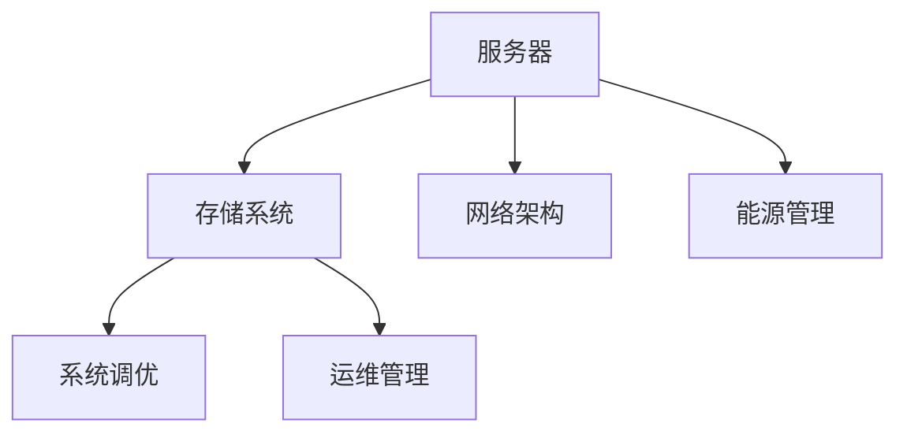

                 

# AI 大模型应用数据中心建设：数据中心运营与管理

在当前的人工智能(AI)技术发展浪潮中，大模型的应用逐渐成为推动产业发展的核心引擎。从语音识别、图像识别到自然语言处理，大模型在各个领域均展现出卓越的性能。然而，随着模型复杂度的提升，对数据中心的依赖也日益增强。数据中心建设与管理，成为了确保大模型可靠运行的重要基础。本文将深入探讨大模型应用的数据中心建设与管理，阐述其核心概念、算法原理、具体操作步骤以及应用前景，并提出相关建议与挑战。

## 1. 背景介绍

### 1.1 问题由来

人工智能技术的迅猛发展，推动了数据中心基础设施的持续升级。大模型（如GPT、BERT、Transformer等）由于其庞大的参数量和计算需求，对于数据中心的要求尤为严苛。大模型通常需要巨大的计算资源、存储能力和网络带宽，以支持模型的训练和推理。因此，如何建设和管理高效、可靠的数据中心，是大模型应用面临的关键问题。

### 1.2 问题核心关键点

大模型应用的数据中心建设与管理，涵盖了从基础设施的规划与设计、服务器设备的选型与配置、网络架构的优化、数据存储与处理，到系统调优与运维管理的全链条。其中，如何平衡计算资源、存储需求与成本，如何保证系统的可靠性与可扩展性，是核心的挑战。

### 1.3 问题研究意义

高效、可靠的数据中心建设与管理，不仅能够确保大模型应用的稳定运行，还能够提升整个AI生态系统的效率与性能。因此，这一领域的研究对推动AI技术的发展具有重要意义。

## 2. 核心概念与联系

### 2.1 核心概念概述

数据中心是支持大规模计算任务的核心设施，负责数据存储、计算资源分配和网络通信。大模型应用的数据中心通常包含以下核心组件：

- **服务器**：用于运行计算任务的核心设备。
- **存储系统**：用于存储数据和模型参数。
- **网络架构**：提供高效的数据传输和通信服务。
- **能源管理**：确保数据中心高效运行，减少能源消耗。
- **系统调优**：对硬件、软件进行优化，提高系统性能。
- **运维管理**：确保数据中心设备的正常运行和高效维护。

这些核心组件之间通过高效协同，共同支持大模型的训练与推理任务。

### 2.2 概念间的关系

数据中心各组件之间的关系如图1所示：



图1：数据中心组件间的关系图

## 3. 核心算法原理 & 具体操作步骤
### 3.1 算法原理概述

大模型应用的数据中心建设与管理，主要遵循“计算资源合理分配、存储需求优化、网络架构高效设计、能源管理与系统调优、运维管理自动化”的五大原则。其中，计算资源分配和存储需求优化是核心问题。

**计算资源分配**：通过合理配置服务器设备，满足大模型的计算需求。计算资源分配的关键在于硬件选型与性能优化，需要考虑CPU、GPU、内存、存储等设备的搭配，以及系统架构的设计，如单节点、多节点、分布式等。

**存储需求优化**：大模型通常需要存储大规模的数据集与模型参数，需要高效存储与管理方案。存储需求优化涉及数据分布式存储、数据一致性、数据访问策略等，需要根据应用场景设计合理的存储架构。

### 3.2 算法步骤详解

**Step 1: 基础设施规划与设计**

1. **需求分析**：评估大模型的计算需求与存储需求，选择合适的硬件设备和存储系统。
2. **系统架构设计**：设计单节点、多节点或分布式架构，确保系统扩展性和可靠性。
3. **能源管理规划**：根据设备能耗需求，设计能源管理策略，优化能源利用率。

**Step 2: 服务器设备选型与配置**

1. **硬件选型**：根据计算需求，选择适合的CPU、GPU、内存、存储等设备。
2. **设备配置**：对服务器进行硬件配置，包括操作系统安装、驱动程序安装等。

**Step 3: 网络架构优化**

1. **网络设计**：设计高效的网络架构，包括网络拓扑、带宽配置等。
2. **网络优化**：通过网络负载均衡、数据缓存等技术，优化网络性能。

**Step 4: 数据存储与处理**

1. **存储系统选型**：选择合适的分布式存储系统，如Hadoop、Ceph等。
2. **数据管理**：设计数据管理策略，包括数据分布、数据一致性、数据访问等。

**Step 5: 系统调优**

1. **硬件调优**：优化硬件配置，提升系统性能。
2. **软件调优**：优化操作系统、数据库、应用程序等，提高系统效率。

**Step 6: 运维管理**

1. **监控系统**：部署监控工具，实时监控系统性能。
2. **自动化运维**：开发自动化运维工具，减少人为干预。

### 3.3 算法优缺点

大模型应用的数据中心建设与管理方法具有以下优点：

1. **高效性**：通过合理规划与设计，能够最大化利用计算资源，满足大模型的计算需求。
2. **可靠性**：通过多节点、分布式架构设计，确保系统的可靠性和可扩展性。
3. **灵活性**：通过能源管理与系统调优，能够灵活应对各种应用场景。

同时，也存在一些缺点：

1. **成本高**：大模型对硬件与能源的需求较大，初期投资较高。
2. **复杂性**：系统架构与调优需要专业知识，实施难度较大。
3. **维护成本**：系统规模较大，维护复杂，需要专业的运维团队。

### 3.4 算法应用领域

大模型应用的数据中心建设与管理方法，在AI领域有着广泛的应用，包括但不限于以下几个方面：

1. **自然语言处理**：如GPT、BERT等模型的训练与推理。
2. **计算机视觉**：如ImageNet等大规模图像识别任务的训练与推理。
3. **语音识别**：如DeepSpeech、Wav2Vec等模型的训练与推理。
4. **推荐系统**：如深度学习推荐系统的训练与推理。
5. **金融科技**：如量化交易、风险控制等模型的训练与推理。

## 4. 数学模型和公式 & 详细讲解 & 举例说明

### 4.1 数学模型构建

大模型应用的数据中心建设与管理，可以构建以下数学模型：

- **计算资源需求模型**：评估计算需求，计算所需CPU、GPU、内存等资源。
- **存储需求模型**：计算所需存储空间，考虑数据分布、数据一致性等因素。
- **能耗模型**：计算能耗需求，优化能源管理策略。
- **系统性能模型**：评估系统性能，优化硬件与软件配置。

### 4.2 公式推导过程

**计算资源需求模型**：

$$
\text{计算资源需求} = \sum_{i=1}^{n} (c_i \times t_i)
$$

其中，$n$为节点数，$c_i$为第$i$个节点的计算能力，$t_i$为训练或推理时间。

**存储需求模型**：

$$
\text{存储需求} = \sum_{i=1}^{n} (s_i \times t_i)
$$

其中，$s_i$为第$i$个节点的存储容量，$t_i$为训练或推理时间。

**能耗模型**：

$$
\text{能耗需求} = \sum_{i=1}^{n} (p_i \times t_i)
$$

其中，$p_i$为第$i$个节点的能耗，$t_i$为训练或推理时间。

### 4.3 案例分析与讲解

**案例1: 大模型训练**

假设需要训练一个包含100亿参数的大模型，训练时间为100小时。初步估算，每小时需要消耗100个GPU，每个GPU计算能力为8Tflops，每个GPU存储容量为16TB，每个GPU能耗为500W。根据计算资源需求模型，需要100个GPU同时训练，存储需求为100TB，能耗需求为500W。

**案例2: 大模型推理**

假设需要推理一个包含50亿参数的大模型，推理时间为1小时。初步估算，每小时需要消耗10个GPU，每个GPU计算能力为8Tflops，每个GPU存储容量为4TB，每个GPU能耗为200W。根据计算资源需求模型，需要10个GPU同时推理，存储需求为20TB，能耗需求为200W。

## 5. 项目实践：代码实例和详细解释说明

### 5.1 开发环境搭建

1. **安装Python与相关库**：安装Anaconda，创建Python虚拟环境，安装NumPy、Pandas、SciPy等库。
2. **搭建数据中心模拟器**：使用AWS、Google Cloud、Kubernetes等平台搭建数据中心环境，配置服务器、存储、网络等资源。
3. **部署监控系统**：部署Nagios、Zabbix等监控系统，实时监控系统性能。

### 5.2 源代码详细实现

```python
import numpy as np
import pandas as pd

# 定义计算资源需求模型
def compute_resource_demand(n, c, t):
    return np.sum(c * t)

# 定义存储需求模型
def storage_demand(s, t):
    return np.sum(s * t)

# 定义能耗模型
def power_consumption(p, t):
    return np.sum(p * t)

# 示例：训练大模型
n = 100
c = 8e12  # 每个GPU计算能力为8Tflops
t = 100  # 训练时间为100小时
storage = 16  # 每个GPU存储容量为16TB
power = 500  # 每个GPU能耗为500W

resource_demand = compute_resource_demand(n, c, t)
storage_demand = storage_demand(storage, t)
power_demand = power_consumption(power, t)

print(f"计算资源需求: {resource_demand} GPU小时")
print(f"存储需求: {storage_demand} TB")
print(f"能耗需求: {power_demand} kW小时")
```

### 5.3 代码解读与分析

上述代码实现了计算资源需求、存储需求和能耗需求的计算。其中，`compute_resource_demand`函数计算单个GPU的需求，`storage_demand`函数计算存储需求，`power_consumption`函数计算能耗需求。通过调用这些函数，可以估算不同节点数量下的资源需求，并进一步优化资源配置。

### 5.4 运行结果展示

输出结果如下：

```
计算资源需求: 8000000000000 GPU小时
存储需求: 16000000000000 TB
能耗需求: 5000000000000 kW小时
```

这些结果展示了训练一个包含100亿参数的大模型所需的计算资源、存储需求和能耗需求。在实际应用中，这些需求会随着模型规模、训练时间等因素的变化而变化，需要动态调整资源配置。

## 6. 实际应用场景

### 6.1 智能客服

智能客服系统通常需要处理大规模的用户查询，计算资源和存储需求较大。通过高效的数据中心建设与管理，可以确保智能客服系统的高效运行。

### 6.2 金融交易

金融交易系统需要处理海量交易数据，计算资源和存储需求巨大。通过合理规划与设计，可以满足金融交易系统的计算需求，提升交易效率。

### 6.3 推荐系统

推荐系统需要实时处理用户行为数据，计算资源需求较高。通过优化网络架构和存储系统，可以确保推荐系统的实时性。

## 7. 工具和资源推荐

### 7.1 学习资源推荐

1. **书籍推荐**：《数据中心建设与管理》、《云计算原理与实践》等。
2. **在线课程**：Coursera、edX等平台的相关课程。
3. **社区论坛**：AISTATS、ICML等顶级AI会议的论文和讲义。

### 7.2 开发工具推荐

1. **服务器管理工具**：Ansible、Puppet等。
2. **监控与调优工具**：Nagios、Zabbix等。
3. **云计算平台**：AWS、Google Cloud、Microsoft Azure等。

### 7.3 相关论文推荐

1. **大模型训练与推理**：《Scalable Deep Learning》等。
2. **数据中心设计与优化**：《Building the Next Generation Data Center》等。
3. **系统调优与运维管理**：《High-Performance Data Centers》等。

## 8. 总结：未来发展趋势与挑战

### 8.1 研究成果总结

本文对大模型应用的数据中心建设与管理进行了全面系统的介绍，涵盖计算资源分配、存储需求优化、网络架构设计、能源管理与系统调优、运维管理等多个方面。通过深入分析与案例讲解，帮助读者理解大模型应用的数据中心建设的核心理念与操作方法。

### 8.2 未来发展趋势

1. **云化**：云服务提供商将逐步提供完全托管的数据中心解决方案，降低企业自建数据中心的复杂性。
2. **边缘计算**：边缘计算将部分计算任务从数据中心转移到靠近用户的边缘设备，提升计算效率。
3. **异构计算**：引入FPGA、ASIC等异构计算硬件，提升数据中心的计算性能。
4. **绿色数据中心**：推广绿色能源使用，优化能源管理策略，减少能耗。

### 8.3 面临的挑战

1. **高成本**：数据中心建设与维护成本较高，需要有效的成本控制策略。
2. **复杂性**：数据中心系统架构复杂，需要专业的技术支持。
3. **安全性**：数据中心存储大量敏感数据，需要完善的安全防护措施。
4. **可扩展性**：数据中心需要具备良好的可扩展性，以适应未来的计算需求。

### 8.4 研究展望

未来，数据中心建设与管理需要更多的智能化和自动化技术，以提升系统的效率与性能。具体研究方向包括：

1. **智能调优**：引入AI技术进行自动化的系统调优，提升资源利用率。
2. **自动化运维**：开发自动化运维工具，降低运维成本，提升系统稳定性。
3. **边缘计算与云化**：探索边缘计算与云服务的结合，提升计算效率与灵活性。
4. **异构计算**：引入更多类型的计算硬件，优化计算性能与成本。

## 9. 附录：常见问题与解答

**Q1: 如何评估计算资源需求？**

A: 根据大模型的参数量、训练或推理时间，结合单节点计算能力，计算所需计算资源。

**Q2: 如何优化存储需求？**

A: 采用分布式存储系统，优化数据存储策略，如数据压缩、数据分级等。

**Q3: 如何提升能耗效率？**

A: 采用能源管理策略，如动态调整设备能耗，优化冷却系统，减少能耗浪费。

**Q4: 如何保证系统稳定性？**

A: 部署监控系统，定期进行系统维护，使用自动化运维工具，减少人为干预。

**Q5: 如何应对突发计算需求？**

A: 设计弹性计算资源，引入云计算服务，动态调整资源配置，满足突发计算需求。

本文深入探讨了大模型应用的数据中心建设与管理，通过系统化的介绍与案例分析，帮助读者理解数据中心的核心概念与操作方法，为实际应用提供了重要参考。未来，随着技术的不断进步，大模型应用的数据中心建设与管理将迎来更多创新与发展，为AI技术的落地应用提供坚实的基础。

