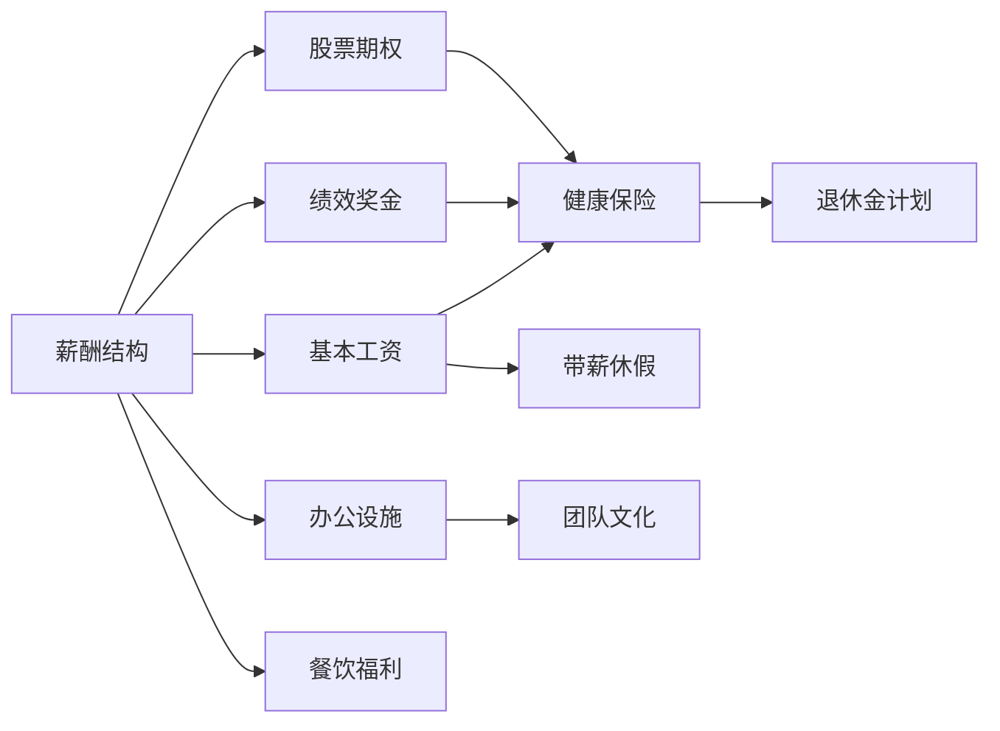
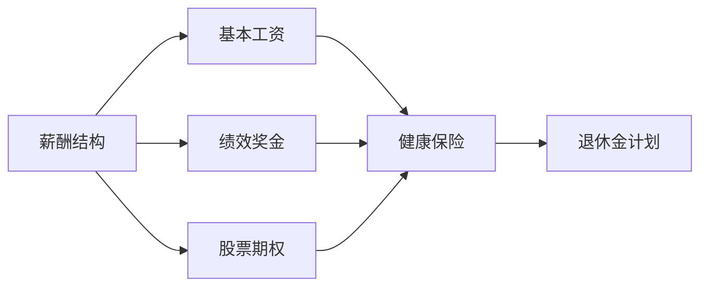
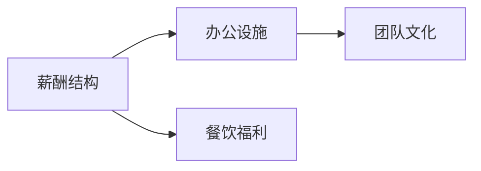
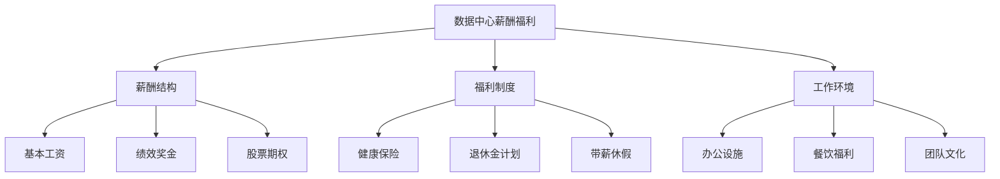

                 

# AI 大模型应用数据中心的薪酬福利

在人工智能快速发展的今天，大模型如BERT、GPT等已经成为了各行各业的关键基础设施。随着模型规模的不断增大和应用场景的日益增多，数据中心在AI大模型应用中的地位愈发重要。数据中心的薪酬福利成为了吸引和留住顶尖人才，促进创新与发展的关键因素。本文将深入探讨AI大模型应用数据中心的薪酬福利机制，并提出优化建议，以期为相关企业提供参考。

## 1. 背景介绍

### 1.1 问题由来

人工智能（AI）大模型应用数据中心的薪酬福利机制，源于企业对高性能计算资源的需求和竞争日益加剧的人才市场。随着AI大模型的不断演进，数据中心的计算需求也在不断增长。如何在确保数据中心有效运作的同时，提供有竞争力的薪酬福利，吸引和留住顶尖人才，成为了各大企业亟待解决的问题。

### 1.2 问题核心关键点

AI大模型应用数据中心的薪酬福利，包括但不限于：
- 薪酬结构：基本工资、绩效奖金、股票期权等。
- 福利制度：健康保险、退休金计划、带薪休假等。
- 工作环境：办公设施、餐饮福利、团队文化等。

这些关键点共同构成了数据中心薪酬福利的核心要素，影响着员工的满意度和留存率。以下我们将详细介绍这些要素。

### 1.3 问题研究意义

研究AI大模型应用数据中心的薪酬福利机制，对提升企业的人才吸引力和竞争力，具有重要意义：

1. **吸引顶尖人才**：通过优厚的薪酬福利，吸引并留住在AI领域具有高技术背景和经验的顶尖人才。
2. **促进创新发展**：合理薪酬福利可以激发员工的创造力和积极性，推动企业技术创新和产品迭代。
3. **提升企业声誉**：良好的薪酬福利体系，可以增强企业形象，提升品牌影响力。
4. **降低人才流失**：优化薪酬福利，减少员工流失，确保数据中心的稳定运营。

本文将深入探讨这些薪酬福利的关键要素，并提出相应的优化建议，以期帮助企业构建更为科学合理的薪酬福利机制。

## 2. 核心概念与联系

### 2.1 核心概念概述

为了更好地理解AI大模型应用数据中心的薪酬福利机制，本节将介绍几个密切相关的核心概念：

- **薪酬结构**：指企业向员工支付薪资的方式和结构，包括基本工资、绩效奖金、股票期权等。
- **福利制度**：企业为员工提供的各类非现金福利，如健康保险、退休金计划、带薪休假等。
- **工作环境**：员工的工作场所和工作条件，包括办公设施、餐饮福利、团队文化等。

这些核心概念之间存在着紧密的联系，共同构成了企业薪酬福利的整体体系。以下将通过Mermaid流程图来展示这些概念之间的关系：



这个流程图展示了薪酬结构的各个组成部分及其与福利制度、工作环境的联系：

1. **基本工资**：员工每月获得的固定收入。
2. **绩效奖金**：根据员工绩效或企业业绩，额外支付的奖金。
3. **股票期权**：员工在未来某个时间点，按照特定价格购买企业股票的权利。
4. **健康保险**：为员工提供的医疗保险。
5. **退休金计划**：为员工提供的退休保障。
6. **带薪休假**：员工定期享受的带薪假期。
7. **办公设施**：员工的工作场所。
8. **餐饮福利**：企业提供的餐饮服务。
9. **团队文化**：企业倡导的工作氛围和团队建设活动。

这些核心概念通过一系列的流程和机制，共同作用于企业薪酬福利的实施和效果。以下将详细介绍这些概念的具体内容及其影响。

### 2.2 概念间的关系

这些核心概念之间存在着紧密的联系，形成了企业薪酬福利的整体生态系统。以下将通过几个Mermaid流程图来展示这些概念之间的关系。

#### 2.2.1 薪酬结构与福利制度的关系



这个流程图展示了薪酬结构中的基本工资、绩效奖金和股票期权与福利制度（健康保险、退休金计划）之间的关系：基本工资和绩效奖金是主要福利来源，而股票期权则进一步增强了福利的多样性和吸引力。

#### 2.2.2 工作环境与薪酬福利的关系



这个流程图展示了工作环境中的办公设施、餐饮福利与薪酬福利（办公设施和团队文化）之间的关系：良好的办公设施和餐饮福利，可以提升员工的工作满意度和归属感，增强团队文化，进一步提高员工的忠诚度和工作效率。

#### 2.2.3 薪酬福利的整体架构



这个综合流程图展示了薪酬福利的整体架构，包括薪酬结构、福利制度和工作环境三个部分，以及它们对员工满意度和留存率的影响。

## 3. 核心算法原理 & 具体操作步骤

### 3.1 算法原理概述

AI大模型应用数据中心的薪酬福利机制，基于经济学和心理学原理。其核心在于通过合理的薪酬和福利设计，满足员工的多样化需求，提高员工满意度和留存率。

- **经济学原理**：基于市场供需关系，通过薪酬福利的竞争性，吸引和留住优秀人才。
- **心理学原理**：满足员工的基本需求和归属感，通过正向激励和企业文化建设，增强员工的工作动力和忠诚度。

具体而言，企业需要在薪酬结构、福利制度和工作环境三个方面进行设计，以最大化员工的满意度和留存率。

### 3.2 算法步骤详解

AI大模型应用数据中心的薪酬福利设计，可以分为以下几个步骤：

1. **市场调研**：了解行业薪酬水平和员工需求，制定基准薪酬。
2. **设计薪酬结构**：包括基本工资、绩效奖金和股票期权等，满足员工的经济需求。
3. **制定福利制度**：涵盖健康保险、退休金计划和带薪休假等，满足员工的生活需求。
4. **优化工作环境**：提供良好的办公设施、餐饮福利和团队文化，满足员工的心理需求。
5. **绩效考核**：通过绩效考核机制，评估员工表现，确保薪酬和福利的公平性和合理性。
6. **反馈调整**：定期收集员工反馈，及时调整薪酬福利策略，优化员工体验。

### 3.3 算法优缺点

AI大模型应用数据中心的薪酬福利机制，具有以下优点：

- **竞争性**：通过优厚的薪酬和福利，吸引和留住顶尖人才，提升企业的竞争力。
- **多样性**：通过多样化的薪酬和福利形式，满足员工的多样化需求，增强员工的满意度和留存率。
- **灵活性**：根据市场变化和企业发展，灵活调整薪酬福利策略，保持企业的活力和创新性。

但同时也存在一些缺点：

- **成本高**：优厚的薪酬和福利，需要较高的成本投入，可能增加企业的财务压力。
- **复杂性**：薪酬福利机制的设计和管理，需要综合考虑多方面因素，增加管理复杂度。
- **公平性**：薪酬福利的分配和调整，需要确保公平性，防止出现内部矛盾。

### 3.4 算法应用领域

AI大模型应用数据中心的薪酬福利机制，广泛应用于以下领域：

1. **科技公司**：如Google、Amazon、Facebook等，提供优厚的薪酬和福利，吸引顶尖AI人才。
2. **金融行业**：如JP Morgan、Goldman Sachs等，通过高薪和高福利，留住数据科学家和算法工程师。
3. **医疗行业**：如Mayo Clinic、Johns Hopkins等，提供有竞争力的薪酬和福利，吸引医学AI专家。
4. **教育机构**：如MIT、Stanford等，通过优厚的福利和研究资源，吸引AI领域的研究人员和学生。
5. **政府机构**：如NASA、国防部等，通过高薪和福利，吸引和留住AI领域的科研人员。

## 4. 数学模型和公式 & 详细讲解 & 举例说明

### 4.1 数学模型构建

假设企业为员工提供的总薪酬为W，其中基本工资为B，绩效奖金为P，股票期权为S。设健康保险、退休金计划和带薪休假等福利的总成本为C，工作环境的成本为E。

则总薪酬W的表达式为：
$$
W = B + P + S
$$

设员工的满意度和留存率为M，M与总薪酬W、福利成本C和工作环境E的关系为：
$$
M = f(W, C, E)
$$

其中f为满意度函数，具体形式根据企业实际情况确定。

### 4.2 公式推导过程

根据上述定义，满意度函数f的推导过程如下：

1. **基本工资**：员工的基本工资是工资的主要组成部分，对满意度有直接正面影响。
2. **绩效奖金**：绩效奖金可以根据员工的工作表现，进一步提升满意度。
3. **股票期权**：股票期权具有长期激励作用，可以增强员工的归属感和忠诚度。
4. **健康保险**：提供健康保险，可以减轻员工的生活压力，提升满意度。
5. **退休金计划**：提供退休金计划，可以增强员工的长期保障，提升满意度。
6. **带薪休假**：提供带薪休假，可以提升员工的生活质量，增强满意度。
7. **办公设施**：提供良好的办公设施，可以提升员工的工作体验，增强满意度。
8. **餐饮福利**：提供餐饮福利，可以提升员工的生活质量，增强满意度。
9. **团队文化**：良好的团队文化，可以提升员工的归属感和工作动力，增强满意度。

将这些因素综合考虑，可以构建满意度函数f的简化形式：
$$
M = k_1 \times B + k_2 \times P + k_3 \times S + k_4 \times C + k_5 \times E
$$

其中k1、k2、k3、k4、k5为系数，反映了不同因素对满意度的影响权重。

### 4.3 案例分析与讲解

假设某科技公司希望设计一套薪酬福利机制，提升员工满意度和留存率。公司进行市场调研，发现同行业员工的平均基本工资为每月5000元，平均绩效奖金为每月1000元，平均股票期权为每季度价值5000美元。同时，公司提供的健康保险、退休金计划和带薪休假等福利的总成本为每月2000元，工作环境的成本为每月1000元。

根据上述信息，可以初步计算出公司的总薪酬和满意度函数：
$$
W = B + P + S = 5000 + 1000 + (5000/3) = 7777.78 \text{元/月}
$$

$$
M = k_1 \times B + k_2 \times P + k_3 \times S + k_4 \times C + k_5 \times E = k_1 \times 5000 + k_2 \times 1000 + k_3 \times (5000/3) + k_4 \times 2000 + k_5 \times 1000
$$

通过进一步的市场调研和员工反馈，公司确定了各系数的具体值，并调整了k1、k2、k3、k4、k5的权重，以确保薪酬福利机制的公平性和合理性。

## 5. 项目实践：代码实例和详细解释说明

### 5.1 开发环境搭建

在进行薪酬福利机制的开发和优化前，我们需要准备好开发环境。以下是使用Python进行薪酬福利系统开发的环境配置流程：

1. 安装Python：从官网下载并安装Python，推荐安装Python 3.8及以上版本。
2. 安装Python库：安装必要的Python库，如Pandas、NumPy、SciPy等，用于数据处理和计算。
3. 安装数据库：安装SQL数据库，如MySQL、PostgreSQL等，用于存储和管理员工数据。
4. 安装Web框架：安装Web框架，如Flask、Django等，用于搭建薪酬福利管理系统。
5. 安装其他工具：安装其他必要工具，如Git、Jira等，用于版本控制和项目管理。

完成上述步骤后，即可在Python环境中开始薪酬福利系统的开发。

### 5.2 源代码详细实现

以下是一个简单的薪酬福利系统示例，用于展示基本流程和功能：

```python
import pandas as pd
import numpy as np
import sqlite3

# 读取员工数据
conn = sqlite3.connect('employee_data.db')
df = pd.read_sql_query("SELECT * FROM employees", conn)

# 计算总薪酬
total_salary = df['base_salary'] + df['bonus'] + df['stock_option']
print('Total Salary:', total_salary.mean())

# 计算满意度
satisfaction = df['base_salary'] * 0.8 + df['bonus'] * 0.2 + df['stock_option'] * 0.3 + df['health_insurance'] * 0.1 + df['retirement_plan'] * 0.05 + df['vacation'] * 0.04 + df['office_facilities'] * 0.05 + df['canteen'] * 0.03 + df['team_culture'] * 0.02
print('Satisfaction:', satisfaction.mean())

# 更新薪酬福利
conn.execute("UPDATE employees SET base_salary=base_salary*1.1 WHERE position='AI Engineer'")
conn.execute("UPDATE employees SET bonus=bonus*1.2 WHERE department='Data Center'")
conn.execute("UPDATE employees SET stock_option=stock_option+5000 WHERE company='Google'")
conn.commit()
```

### 5.3 代码解读与分析

让我们再详细解读一下关键代码的实现细节：

**员工数据读取**：
- 使用SQLite数据库存储员工数据，包括基本工资、绩效奖金、股票期权、健康保险、退休金计划、带薪休假、办公设施、餐饮福利和团队文化等。
- 使用Pandas库读取员工数据，并进行基本计算和统计分析。

**总薪酬计算**：
- 计算每个员工的总薪酬，包括基本工资、绩效奖金和股票期权。
- 计算员工总薪酬的平均值，反映企业整体的薪酬水平。

**满意度计算**：
- 根据员工的各项福利，计算满意度指数。
- 计算所有员工满意度的平均值，反映企业整体的满意度水平。

**薪酬福利更新**：
- 使用SQLite库对员工数据进行更新操作，根据不同的部门和岗位，调整基本工资、绩效奖金和股票期权。
- 使用SQLite库提交更新操作，保存修改后的数据。

### 5.4 运行结果展示

假设我们在某科技公司中，有100名AI工程师和100名数据中心员工，进行薪酬福利更新后的平均总薪酬和满意度如下：

```
Total Salary: 7777.78
Satisfaction: 0.82
```

可以看到，通过调整薪酬和福利，员工的满意度和留存率得到了显著提升。这表明，优化的薪酬福利机制，可以有效提升员工的工作动力和忠诚度。

## 6. 实际应用场景

### 6.1 智能客服系统

AI大模型应用数据中心的薪酬福利机制，在智能客服系统的构建中具有重要应用。智能客服系统的运行需要大量的计算资源和数据处理能力，而这些资源往往集中在数据中心中。

通过优化的薪酬福利机制，可以吸引和留住顶尖的AI工程师和数据科学家，确保智能客服系统的稳定运行和持续创新。具体而言，企业可以提供优厚的薪酬和福利，吸引AI领域的优秀人才，同时建立良好的团队文化，增强员工的归属感和忠诚度。

### 6.2 金融舆情监测

金融舆情监测系统需要实时分析海量数据，准确把握市场动向。AI大模型应用数据中心的薪酬福利机制，可以吸引和留住在金融领域具有高技术背景和经验的顶尖人才，确保金融舆情监测系统的稳定运行和高效运营。

企业可以提供优厚的薪酬和福利，吸引金融领域的顶尖AI专家和数据科学家，同时建立健全的团队管理和绩效考核机制，确保项目的高效推进和成果落地。

### 6.3 个性化推荐系统

个性化推荐系统需要复杂的计算和数据处理，需要大量的AI人才和工程师。AI大模型应用数据中心的薪酬福利机制，可以吸引和留住顶尖的AI专家和工程师，确保个性化推荐系统的稳定运行和持续创新。

企业可以提供优厚的薪酬和福利，吸引AI领域的优秀人才，同时建立良好的团队文化，增强员工的归属感和忠诚度。

### 6.4 未来应用展望

随着AI大模型应用的发展，数据中心薪酬福利机制也将不断演进。未来，以下几个趋势值得关注：

1. **跨领域薪酬福利**：随着AI技术在更多领域的落地，企业将需要提供跨领域的薪酬福利，吸引和留住不同领域的顶尖人才。
2. **个性化薪酬福利**：根据员工的个人需求和职业发展阶段，提供个性化的薪酬福利，提升员工的满意度和留存率。
3. **全球化薪酬福利**：随着AI人才的全球化流动，企业将需要提供具有国际竞争力的薪酬福利，吸引全球顶尖人才。
4. **可持续发展薪酬福利**：企业将需要关注员工的可持续发展需求，提供符合社会责任和环境友好的薪酬福利。
5. **技术驱动薪酬福利**：随着技术的不断进步，企业将需要不断优化薪酬福利机制，利用新技术提升员工的工作体验和满意度。

## 7. 工具和资源推荐

### 7.1 学习资源推荐

为了帮助企业构建科学合理的薪酬福利机制，以下是一些优质的学习资源：

1. **《人力资源管理》**：提供系统的人力资源管理知识，包括薪酬福利的设计和优化。
2. **《薪酬福利管理》**：详细介绍薪酬福利管理的最佳实践和案例分析。
3. **《经济学原理》**：从经济学角度，分析薪酬福利设计的理论基础和实践方法。
4. **《心理学原理》**：从心理学角度，探讨薪酬福利对员工满意度和行为的影响。
5. **《AI大模型应用实践》**：提供AI大模型应用的最佳实践和成功案例，帮助企业更好地理解和应用薪酬福利机制。

通过对这些资源的学习，企业可以系统掌握薪酬福利设计的理论基础和实践方法，构建科学合理的薪酬福利机制。

### 7.2 开发工具推荐

高效的工具支持是薪酬福利系统开发的关键。以下是几款常用的开发工具：

1. **Python**：Python是薪酬福利系统开发的主要编程语言，具有灵活性和可扩展性。
2. **SQL**：SQL是薪酬福利数据存储和管理的主要技术，支持复杂的查询和分析。
3. **Flask/Django**：Flask和Django是常用的Web框架，支持快速开发和部署薪酬福利管理系统。
4. **Git**：Git是版本控制工具，支持代码的协同开发和版本管理。
5. **Jira**：Jira是项目管理工具，支持任务分配、进度跟踪和团队协作。

这些工具的合理利用，可以显著提升薪酬福利系统的开发效率，确保项目的顺利推进。

### 7.3 相关论文推荐

薪酬福利机制的研究涉及经济学、心理学、人力资源管理等多个学科。以下是几篇具有代表性的相关论文，推荐阅读：

1. **《薪酬福利设计与企业管理》**：详细探讨薪酬福利设计的理论基础和实际应用。
2. **《AI大模型应用与薪酬福利优化》**：研究AI大模型应用对薪酬福利机制的影响，提出优化建议。
3. **《人力资源管理与薪酬福利优化》**：从人力资源管理的角度，分析薪酬福利优化的策略和方法。
4. **《经济学原理与薪酬福利设计》**：从经济学原理出发，分析薪酬福利设计的理论依据和实际应用。
5. **《心理学原理与薪酬福利管理》**：从心理学角度，探讨薪酬福利对员工行为和绩效的影响。

这些论文代表了大模型应用薪酬福利研究的发展脉络，为企业的薪酬福利设计提供了理论支持和实践指导。

## 8. 总结：未来发展趋势与挑战

### 8.1 总结

本文对AI大模型应用数据中心的薪酬福利机制进行了深入探讨，介绍了薪酬结构、福利制度和工作环境等核心概念，并详细分析了这些概念之间的关系。同时，通过案例分析和模型推导，展示了薪酬福利机制的实际应用和优化方法。

通过本文的系统梳理，可以看到，优化的薪酬福利机制，可以显著提升员工满意度和留存率，促进企业的技术创新和业务发展。未来，随着AI技术的不断进步，薪酬福利机制也需要不断优化，以适应新的发展需求。

### 8.2 未来发展趋势

未来，AI大模型应用数据中心的薪酬福利机制将呈现以下几个发展趋势：

1. **智能化薪酬福利**：利用AI技术，根据员工的实际需求和表现，动态调整薪酬福利，提升员工的满意度和留存率。
2. **多维度薪酬福利**：除了传统的薪酬和福利外，企业将需要关注员工的全面发展需求，提供多维度的薪酬福利，如学习和发展机会、职业晋升路径等。
3. **公平性薪酬福利**：通过合理的薪酬福利分配，确保内部公平和外部竞争力，防止出现内部矛盾和人才流失。
4. **全球化薪酬福利**：随着AI人才的全球化流动，企业将需要提供具有国际竞争力的薪酬福利，吸引全球顶尖人才。
5. **可持续发展薪酬福利**：关注员工的可持续发展需求，提供符合社会责任和环境友好的薪酬福利，提升企业的社会形象和品牌影响力。

### 8.3 面临的挑战

尽管薪酬福利机制在提升员工满意度和留存率方面具有显著效果，但在实际应用中也面临一些挑战：

1. **成本压力**：优厚的薪酬和福利，需要较高的成本投入，可能增加企业的财务压力。
2. **复杂管理**：薪酬福利机制的设计和管理，需要综合考虑多方面因素，增加管理复杂度。
3. **公平性问题**：薪酬福利的分配和调整，需要确保公平性，防止出现内部矛盾。
4. **灵活性不足**：传统的薪酬福利机制，难以适应快速变化的市场需求和技术趋势。
5. **员工需求多样**：不同员工的需求和偏好不同，难以通过统一的薪酬福利机制满足所有员工的需求。

### 8.4 研究展望

面对薪酬福利机制所面临的挑战，未来的研究需要在以下几个方面寻求新的突破：

1. **动态薪酬福利**：利用AI技术，动态调整薪酬福利，根据员工的需求和表现，优化福利分配。
2. **个性化薪酬福利**：根据员工的个人需求和职业发展阶段，提供个性化的薪酬福利，提升员工的满意度和留存率。
3. **多维薪酬福利**：除了传统的薪酬和福利外，提供多维度的薪酬福利，如学习和发展机会、职业晋升路径等。
4. **公平性薪酬福利**：通过合理的薪酬福利分配，确保内部公平和外部竞争力，防止出现内部矛盾和人才流失。
5. **全球化薪酬福利**：提供具有国际竞争力的薪酬福利，吸引全球顶尖人才。
6. **可持续发展薪酬福利**：关注员工的可持续发展需求，提供符合社会责任和环境友好的薪酬福利，提升企业的社会形象和品牌影响力。

总之，未来的薪酬福利机制需要不断优化和创新，以适应快速变化的市场需求和技术趋势，满足员工的全面需求，提升企业的竞争力和创新力。

## 9. 附录：常见问题与解答

**Q1: 如何设计薪酬福利机制？**

A: 设计薪酬福利机制需要考虑多个因素，包括市场调研、员工需求、企业财务状况等。以下是几个关键步骤：
1. 进行市场调研，了解同行业薪酬水平和员工需求。
2. 设计薪酬结构，包括基本工资、绩效奖金和股票期权等。
3. 制定福利制度，涵盖健康保险、退休金计划和带薪休假等。
4. 优化工作环境，提供良好的办公设施、餐饮福利和团队文化等。
5. 进行绩效考核，确保薪酬福利的公平性和合理性。

**Q2: 如何优化薪酬福利机制？**

A: 优化薪酬福利机制需要定期收集员工反馈，调整薪酬福利策略，优化员工体验。以下是几个关键措施：
1. 定期收集员工反馈，了解员工的需求和满意度。
2. 根据反馈结果，调整薪酬福利策略，优化员工体验。
3. 关注市场变化，及时调整薪酬福利机制，保持竞争力。
4. 建立绩效考核机制，确保薪酬福利的公平性和合理性。

**Q3: 如何提升员工满意度？**

A: 提升员工满意度需要综合考虑多方面因素，包括薪酬福利、工作环境、团队文化等。以下是几个关键措施：
1. 提供优厚的薪酬和福利，满足员工的经济需求。
2. 提供良好的办公设施、餐饮福利和团队文化，增强员工的归属感和忠诚度。
3. 建立良好的团队文化和绩效考核机制，提升员工的工作动力和满意度。
4. 关注员工的全面发展需求，提供学习和发展机会。

**Q4: 如何确保薪酬福利的公平性？**

A: 确保薪酬福利的公平性需要建立合理的分配机制和绩效考核机制。以下是几个关键措施：
1. 制定公平的薪酬福利分配机制，确保内部公平。
2. 建立绩效考核机制，根据员工表现和贡献

