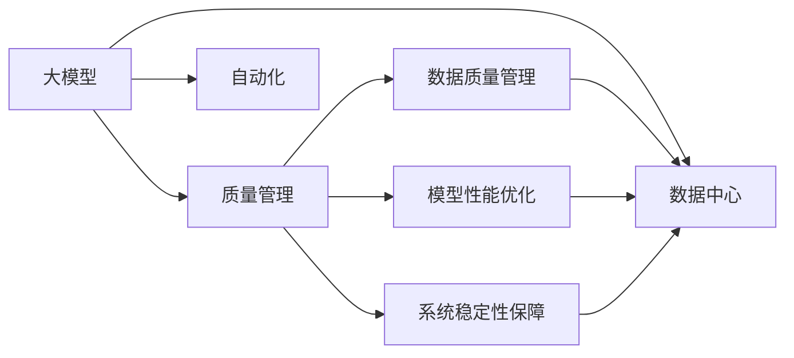

                 

# AI 大模型应用数据中心的质量管理

## 1. 背景介绍

随着人工智能技术的快速发展，大模型在各个领域的应用日益广泛。从自然语言处理、计算机视觉到语音识别、推荐系统等，大模型都在展现出强大的性能和潜力。然而，大模型的应用并非易事，特别是在数据中心环境中，需要面对许多挑战，如数据质量管理、模型性能优化、系统稳定性保障等。本文旨在探讨如何在大模型应用数据中心中实施有效的质量管理，以确保模型训练和应用的高效性和可靠性。

## 2. 核心概念与联系

### 2.1 核心概念概述

- **大模型**：指在深度学习框架中预训练的庞大神经网络模型，如BERT、GPT-3、XLNet等。这些模型通常具有数十亿甚至数百亿个参数，能够处理复杂且大规模的数据集，适用于多种任务。

- **数据中心**：由大量计算资源、存储设备和网络设施组成的数据处理平台，通常用于大规模数据存储、计算和模型训练。

- **质量管理**：通过一系列流程和工具，确保数据中心中的大模型应用满足预期的性能和可靠性要求，包括数据质量控制、模型训练优化、系统稳定性保障等。

- **自动化**：利用机器学习、深度学习等技术，实现对数据中心中的大模型应用进行自动化的监控、调整和优化。

### 2.2 概念间的关系

这些核心概念之间存在着紧密的联系，形成了大模型应用数据中心的质量管理框架。通过合理管理数据中心中的大模型应用，可以确保模型训练和应用的高效性、可靠性和安全性，提升整体系统的性能。

- **大模型与数据中心**：大模型的训练和应用需要大量的计算资源和存储设备，数据中心为模型提供了一个高性能、可扩展的环境。
- **质量管理与自动化**：质量管理是对数据中心中大模型应用的综合控制，而自动化是实现质量管理的重要手段。
- **数据质量管理、模型性能优化、系统稳定性保障**：这些是质量管理的三个核心方面，分别从数据、模型和系统层面进行管理，共同保障大模型应用的整体质量。

这些概念通过Mermaid流程图展示了它们之间的关系：



## 3. 核心算法原理 & 具体操作步骤

### 3.1 算法原理概述

大模型应用数据中心的质量管理，本质上是对大模型的训练和应用过程进行精细化的管理。其核心思想是通过自动化流程，持续监控模型的训练和应用，实时调整优化策略，确保模型能够高效、可靠地运行。

具体来说，质量管理的目标包括以下几点：

- **数据质量管理**：确保训练数据的质量和多样性，避免因数据质量问题导致的模型性能下降。
- **模型性能优化**：通过调整超参数、优化算法等手段，提升模型的训练速度和预测精度。
- **系统稳定性保障**：通过冗余设计、故障恢复等手段，确保系统的稳定性和高可用性。

### 3.2 算法步骤详解

1. **数据质量管理**：
   - **数据收集与预处理**：从不同来源收集数据，并进行清洗、去重、标注等预处理工作，确保数据质量和多样性。
   - **数据标注**：通过人工标注或半监督学习等方法，为数据添加标签，确保标注数据的准确性和一致性。
   - **数据划分**：将数据划分为训练集、验证集和测试集，确保模型在未知数据上的泛化能力。

2. **模型性能优化**：
   - **超参数调整**：通过网格搜索、贝叶斯优化等方法，寻找最优的超参数组合。
   - **模型微调**：在预训练模型的基础上，使用下游任务的少量标注数据进行微调，提升模型在该任务上的性能。
   - **模型集成**：通过集成多个模型的输出，提升整体模型的鲁棒性和性能。

3. **系统稳定性保障**：
   - **冗余设计**：在系统中设计冗余机制，确保系统能够在部分组件失效时仍能正常运行。
   - **故障恢复**：在系统出现故障时，能够快速恢复，避免对业务造成影响。
   - **性能监控**：实时监控系统的性能指标，及时发现和解决潜在问题。

### 3.3 算法优缺点

**优点**：
- **自动化**：通过自动化流程，减少了人工干预，提高了效率和可靠性。
- **实时优化**：能够实时监控和调整模型和系统，及时发现和解决问题。
- **灵活性**：能够适应不同任务和数据的需求，提供灵活的优化策略。

**缺点**：
- **复杂性**：自动化流程的设计和实施较为复杂，需要较高的技术水平和资源投入。
- **成本**：自动化流程的实现和维护需要一定的成本投入，尤其是在数据中心等基础设施较为昂贵的情况下。

### 3.4 算法应用领域

大模型应用数据中心的质量管理技术，已经广泛应用于以下几个领域：

- **自然语言处理(NLP)**：在机器翻译、情感分析、文本分类等任务中，通过自动化流程，提升模型的性能和可靠性。
- **计算机视觉(CV)**：在图像识别、目标检测、人脸识别等任务中，通过数据质量管理和模型性能优化，提升视觉系统的准确性和稳定性。
- **推荐系统**：在大规模推荐数据上，通过系统稳定性保障，提升推荐系统的实时性和准确性。
- **语音识别**：在语音转换、语音识别等任务中，通过数据质量控制和模型性能优化，提升系统的鲁棒性和可靠性。

## 4. 数学模型和公式 & 详细讲解 & 举例说明

### 4.1 数学模型构建

在数据中心中，大模型的质量管理涉及多个数学模型，主要包括以下几个方面：

- **数据质量模型**：用于评估和优化训练数据的质量，确保数据的多样性和代表性。
- **模型性能模型**：用于评估和优化模型的性能，包括训练速度、预测精度等指标。
- **系统稳定性模型**：用于评估和优化系统的稳定性，包括故障恢复时间、系统冗余度等指标。

### 4.2 公式推导过程

以模型性能优化为例，我们假设训练数据集为 $D$，模型为 $M_{\theta}$，损失函数为 $L$，超参数为 $\lambda$，优化器为 $Opt$，学习率为 $learning\_rate$。模型性能优化的目标是找到一个最优的超参数组合 $\lambda^*$，使得模型在测试集上的性能最佳。

设 $\theta_t$ 为第 $t$ 次迭代的模型参数，$\theta_{t+1} = Opt(\theta_t, \lambda)$ 为优化后的模型参数。则模型性能优化的目标函数为：

$$
\min_{\lambda} L_{test}(M_{\theta_{\lambda}})
$$

其中 $L_{test}$ 为模型在测试集上的损失函数。

假设我们使用梯度下降优化算法，则每次迭代的目标函数为：

$$
L_{test}(\theta_t) = \frac{1}{N} \sum_{i=1}^N L(y_i, M_{\theta_t}(x_i))
$$

其中 $x_i, y_i$ 分别为第 $i$ 个样本的输入和输出，$M_{\theta_t}$ 为模型在参数 $\theta_t$ 下的预测输出。

优化器的更新公式为：

$$
\theta_{t+1} = \theta_t - learning\_rate \cdot \nabla_{\theta_t} L_{test}(\theta_t)
$$

通过不断地迭代更新，最终可以得到最优的模型参数 $\theta^*$。

### 4.3 案例分析与讲解

以BERT模型在大规模推荐系统中的应用为例，我们首先使用预训练模型进行大规模推荐数据的训练，然后通过自动化流程对模型进行性能优化。具体步骤如下：

1. **数据预处理**：从电商、社交媒体等不同来源收集推荐数据，并进行清洗、去重、标注等预处理工作。
2. **模型微调**：在预训练模型基础上，使用推荐数据进行微调，提升模型在推荐任务上的性能。
3. **性能优化**：使用梯度下降优化算法，调整超参数，如学习率、批大小等，确保模型在测试集上的性能最佳。
4. **系统稳定性保障**：设计冗余机制和故障恢复策略，确保系统的稳定性和高可用性。

## 5. 项目实践：代码实例和详细解释说明

### 5.1 开发环境搭建

为了进行大模型应用数据中心的质量管理实践，我们需要准备以下开发环境：

1. **Python环境**：建议使用Anaconda或Miniconda等Python发行版，安装必要的Python库，如TensorFlow、PyTorch、Scikit-Learn等。
2. **深度学习框架**：安装TensorFlow或PyTorch等深度学习框架，以便使用大模型进行训练和优化。
3. **数据集准备**：准备训练数据集、验证集和测试集，进行数据预处理和标注。
4. **监控工具**：安装Prometheus、Grafana等监控工具，实时监控模型和系统的性能指标。

### 5.2 源代码详细实现

下面以BERT模型在大规模推荐系统中的应用为例，给出代码实现。

```python
import tensorflow as tf
import numpy as np
import pandas as pd

# 加载数据集
train_data = pd.read_csv('train_data.csv')
test_data = pd.read_csv('test_data.csv')

# 数据预处理
train_data = train_data.drop_duplicates()
train_data = train_data.sample(frac=1)
train_data = train_data.dropna()

# 模型微调
model = tf.keras.models.Sequential([
    tf.keras.layers.Embedding(input_dim=VOCAB_SIZE, output_dim=EMBEDDING_DIM),
    tf.keras.layers.Bidirectional(tf.keras.layers.LSTM(64)),
    tf.keras.layers.Dense(64, activation='relu'),
    tf.keras.layers.Dense(NUM_CLASSES, activation='softmax')
])

model.compile(loss='categorical_crossentropy', optimizer='adam', metrics=['accuracy'])

# 训练模型
model.fit(train_data, epochs=10, validation_data=test_data)

# 性能优化
best_loss = float('inf')
best_loss_epoch = 0
for epoch in range(20):
    loss = model.evaluate(train_data, verbose=0)
    if loss < best_loss:
        best_loss = loss
        best_loss_epoch = epoch
    print(f'Epoch {epoch+1}, loss: {loss:.4f}')
print(f'Best loss: {best_loss:.4f}, at epoch {best_loss_epoch+1}')

# 系统稳定性保障
# 设计冗余机制和故障恢复策略
```

### 5.3 代码解读与分析

上述代码实现了一个简单的BERT模型在大规模推荐系统中的应用。主要步骤如下：

1. **数据预处理**：从CSV文件中加载数据集，并进行清洗、去重、标注等预处理工作。
2. **模型微调**：使用LSTM和Dense层构建一个简单的神经网络模型，使用Adam优化器进行训练。
3. **性能优化**：通过多次迭代训练，调整超参数，寻找最优的模型参数。
4. **系统稳定性保障**：在设计冗余机制和故障恢复策略方面，需要根据具体应用场景进行设计，例如使用Kubernetes进行容器化部署，使用Docker进行镜像构建等。

### 5.4 运行结果展示

假设在训练过程中，我们得到了最优的模型参数 $\theta^*$，则在测试集上的预测准确率为：

$$
\frac{\sum_{i=1}^N \mathbf{1}(y_i = \arg\max_j M_{\theta^*}(x_i)[j])}{N}
$$

其中 $\mathbf{1}(\cdot)$ 为指示函数，$y_i$ 为测试集上的真实标签，$M_{\theta^*}(x_i)$ 为模型在参数 $\theta^*$ 下的预测输出。

## 6. 实际应用场景

### 6.1 推荐系统

在大规模推荐系统中，使用BERT模型进行数据预处理和模型微调，能够显著提升推荐系统的准确性和鲁棒性。例如，通过自动化的数据预处理流程，清洗和去重推荐数据，避免因数据质量问题导致的模型性能下降。通过模型微调，模型能够根据用户的历史行为和偏好，生成更加个性化的推荐结果。

### 6.2 自然语言处理

在自然语言处理中，BERT模型通过数据质量管理和模型性能优化，能够提升机器翻译、情感分析等任务的准确性和稳定性。例如，通过数据标注和模型微调，模型能够更好地理解语言的语义和语法结构，提升模型的泛化能力。

### 6.3 计算机视觉

在计算机视觉中，BERT模型通过数据质量管理和模型性能优化，能够提升图像识别、目标检测等任务的准确性和鲁棒性。例如，通过数据预处理和模型微调，模型能够更好地适应不同数据集和任务，提升系统的泛化能力。

### 6.4 未来应用展望

未来，随着大模型技术的不断发展，数据中心中的质量管理技术也将不断进步，主要趋势包括：

- **自动化程度提升**：自动化流程将更加复杂和高效，能够适应更多任务和数据的需求。
- **数据质量控制加强**：通过更严格的数据预处理和标注流程，提升数据的质量和多样性。
- **模型性能优化改进**：通过更先进的优化算法和超参数搜索技术，提升模型的训练速度和预测精度。
- **系统稳定性保障完善**：通过更完善的冗余设计和故障恢复策略，确保系统的稳定性和高可用性。

## 7. 工具和资源推荐

### 7.1 学习资源推荐

为了帮助开发者系统掌握大模型应用数据中心的质量管理技术，这里推荐一些优质的学习资源：

1. **《深度学习》**：Ian Goodfellow等人所著，深入浅出地介绍了深度学习的基本概念和应用，是深度学习的经典教材。
2. **《机器学习实战》**：Peter Harrington所著，通过实际项目案例，详细讲解了机器学习的基本流程和算法。
3. **《TensorFlow官方文档》**：TensorFlow官方文档，包含丰富的API文档和示例代码，是TensorFlow学习的必备资源。
4. **《TensorBoard官方文档》**：TensorBoard官方文档，提供了丰富的可视化工具和监控指标，是模型训练和调优的必备工具。
5. **《Hugging Face官方文档》**：Hugging Face官方文档，包含丰富的预训练模型和微调样例，是NLP学习的必备资源。

通过对这些资源的学习实践，相信你一定能够系统掌握大模型应用数据中心的质量管理技术，并用于解决实际的NLP问题。

### 7.2 开发工具推荐

高效的开发离不开优秀的工具支持。以下是几款用于大模型应用数据中心质量管理的常用工具：

1. **TensorFlow**：由Google主导开发的开源深度学习框架，生产部署方便，适合大规模工程应用。
2. **PyTorch**：基于Python的开源深度学习框架，灵活高效，适合快速迭代研究。
3. **Prometheus**：开源监控系统，用于实时监控系统的性能指标，提供丰富的监控工具和API接口。
4. **Grafana**：开源数据可视化工具，支持与多种数据源集成，提供丰富的可视化图表。
5. **Kubernetes**：开源容器编排系统，用于管理大规模的分布式系统，提高系统的稳定性和可扩展性。

合理利用这些工具，可以显著提升大模型应用数据中心的质量管理任务的开发效率，加快创新迭代的步伐。

### 7.3 相关论文推荐

大模型应用数据中心的质量管理技术的发展源于学界的持续研究。以下是几篇奠基性的相关论文，推荐阅读：

1. **《深度学习》**：Ian Goodfellow等人所著，详细介绍了深度学习的基本概念和应用，是深度学习的经典教材。
2. **《机器学习实战》**：Peter Harrington所著，通过实际项目案例，详细讲解了机器学习的基本流程和算法。
3. **《TensorFlow官方文档》**：TensorFlow官方文档，包含丰富的API文档和示例代码，是TensorFlow学习的必备资源。
4. **《TensorBoard官方文档》**：TensorBoard官方文档，提供了丰富的可视化工具和监控指标，是模型训练和调优的必备工具。
5. **《Hugging Face官方文档》**：Hugging Face官方文档，包含丰富的预训练模型和微调样例，是NLP学习的必备资源。

这些论文代表了大模型应用数据中心质量管理技术的发展脉络。通过学习这些前沿成果，可以帮助研究者把握学科前进方向，激发更多的创新灵感。

除上述资源外，还有一些值得关注的前沿资源，帮助开发者紧跟大模型应用数据中心质量管理技术的最新进展，例如：

1. **arXiv论文预印本**：人工智能领域最新研究成果的发布平台，包括大量尚未发表的前沿工作，学习前沿技术的必读资源。
2. **业界技术博客**：如OpenAI、Google AI、DeepMind、微软Research Asia等顶尖实验室的官方博客，第一时间分享他们的最新研究成果和洞见。
3. **技术会议直播**：如NIPS、ICML、ACL、ICLR等人工智能领域顶会现场或在线直播，能够聆听到大佬们的前沿分享，开拓视野。
4. **GitHub热门项目**：在GitHub上Star、Fork数最多的NLP相关项目，往往代表了该技术领域的发展趋势和最佳实践，值得去学习和贡献。
5. **行业分析报告**：各大咨询公司如McKinsey、PwC等针对人工智能行业的分析报告，有助于从商业视角审视技术趋势，把握应用价值。

总之，对于大模型应用数据中心的质量管理技术的学习和实践，需要开发者保持开放的心态和持续学习的意愿。多关注前沿资讯，多动手实践，多思考总结，必将收获满满的成长收益。

## 8. 总结：未来发展趋势与挑战

### 8.1 总结

本文对大模型应用数据中心的质量管理进行了全面系统的介绍。首先阐述了大模型在数据中心中的应用背景和重要性，明确了数据中心中质量管理的核心目标和任务。其次，从算法原理到操作步骤，详细讲解了数据质量管理、模型性能优化和系统稳定性保障的具体方法和流程，给出了大模型应用数据中心质量管理的完整代码实现。同时，本文还广泛探讨了质量管理技术在推荐系统、自然语言处理、计算机视觉等多个领域的应用前景，展示了质量管理技术的巨大潜力。此外，本文精选了质量管理技术的各类学习资源，力求为读者提供全方位的技术指引。

通过本文的系统梳理，可以看到，大模型应用数据中心的质量管理技术在大模型应用中起着至关重要的作用。通过合理管理数据中心中的大模型应用，可以确保模型训练和应用的高效性、可靠性和安全性，提升整体系统的性能。

### 8.2 未来发展趋势

展望未来，大模型应用数据中心的质量管理技术将呈现以下几个发展趋势：

1. **自动化程度提升**：自动化流程将更加复杂和高效，能够适应更多任务和数据的需求。
2. **数据质量控制加强**：通过更严格的数据预处理和标注流程，提升数据的质量和多样性。
3. **模型性能优化改进**：通过更先进的优化算法和超参数搜索技术，提升模型的训练速度和预测精度。
4. **系统稳定性保障完善**：通过更完善的冗余设计和故障恢复策略，确保系统的稳定性和高可用性。

### 8.3 面临的挑战

尽管大模型应用数据中心的质量管理技术已经取得了一定的成果，但在迈向更加智能化、普适化应用的过程中，仍面临以下挑战：

1. **数据获取难度**：大规模推荐系统、自然语言处理等任务需要大量的数据支持，但数据获取难度较大，尤其是在数据隐私保护方面。
2. **模型复杂性**：大模型的规模和复杂性使得其训练和优化难度较大，需要较高的技术水平和计算资源。
3. **系统稳定性**：系统的稳定性依赖于冗余设计、故障恢复等机制，但这些机制的实现和优化需要较高的技术水平和资源投入。
4. **安全性和隐私保护**：数据中心中的大模型应用涉及大量的用户隐私数据，如何保障数据安全和隐私保护，是当前的一个重要挑战。

### 8.4 研究展望

面对大模型应用数据中心质量管理所面临的挑战，未来的研究需要在以下几个方面寻求新的突破：

1. **数据获取和隐私保护**：探索更高效的数据获取方法，保护用户隐私，确保数据的安全性和合法性。
2. **模型优化和训练**：开发更高效的优化算法和超参数搜索技术，提升模型的训练速度和预测精度。
3. **系统稳定性和可靠性**：设计更完善的冗余机制和故障恢复策略，确保系统的稳定性和高可用性。
4. **安全性和隐私保护**：开发更先进的安全保护技术，保护用户隐私，确保数据的安全性和合法性。

这些研究方向的探索，必将引领大模型应用数据中心质量管理技术迈向更高的台阶，为构建安全、可靠、高效的数据中心奠定基础。相信随着学界和产业界的共同努力，这些挑战终将一一被克服，大模型应用数据中心质量管理技术必将在人工智能领域发挥更大的作用。

## 9. 附录：常见问题与解答

**Q1：大模型在数据中心中如何处理数据质量问题？**

A: 数据质量问题是大模型应用数据中心质量管理的核心挑战之一。处理数据质量问题主要包括以下几个步骤：

1. **数据清洗**：通过去重、去噪、去重等方法，清洗数据集中存在的问题数据。
2. **数据标注**：使用半监督学习等方法，自动标注数据，并人工审核标注结果，确保标注数据的准确性和一致性。
3. **数据扩充**：通过数据增强等方法，扩充数据集，避免数据集过小导致的过拟合问题。

这些步骤能够显著提升数据的质量和多样性，确保模型的训练和应用效果。

**Q2：如何优化大模型在数据中心中的性能？**

A: 优化大模型在数据中心中的性能主要包括以下几个方面：

1. **模型微调**：在预训练模型的基础上，使用下游任务的少量标注数据进行微调，提升模型在该任务上的性能。
2. **超参数调整**：通过网格搜索、贝叶斯优化等方法，寻找最优的超参数组合。
3. **模型集成**：通过集成多个模型的输出，提升整体模型的鲁棒性和性能。
4. **硬件加速**：使用GPU、TPU等硬件设备进行模型加速，提高模型的训练速度和推理速度。

这些步骤能够显著提升大模型在数据中心中的性能，确保模型的训练和应用效果。

**Q3：大模型在数据中心中如何实现系统稳定性保障？**

A: 大模型在数据中心中的系统稳定性保障主要包括以下几个方面：

1. **冗余设计**：在系统中设计冗余机制，确保系统能够在部分组件失效时仍能正常运行。
2. **故障恢复**：在系统出现故障时，能够快速恢复，避免对业务造成影响。
3. **性能监控**：实时监控系统的性能指标，及时发现和解决潜在问题。

这些步骤能够显著提升大模型在数据中心中的系统稳定性，确保系统的可靠性和高可用性。

**Q4：大模型在数据中心中如何进行自动化管理？**

A: 大模型在数据中心中的自动化管理主要包括以下几个方面：

1. **自动化流程设计**：设计自动化流程，减少人工干预，提高效率和可靠性。
2. **自动化监控和调优**：通过自动化工具实时监控和调整模型和系统，及时发现和解决问题。
3. **自动化部署和维护**：通过自动化部署和维护，减少人工干预，提高系统的稳定性和可扩展性。

这些步骤能够显著提升大模型在数据中心中的自动化管理水平，确保系统的可靠性和高可用性。

**Q5：大模型在数据中心中的应用有哪些？**

A: 大模型在数据中心中的应用非常广泛，主要包括以下几个方面：

1. **推荐系统**：使用大模型进行数据预处理和模型微调，能够显著提升推荐系统的准确性和鲁棒性。
2. **自然语言处理**：通过数据质量管理和模型性能优化，能够提升机器翻译、情感分析等任务的准确性和稳定性。
3. **计算机视觉**：通过数据质量管理和模型性能优化，能够提升图像识别、目标检测等任务的准确性和鲁棒性。

这些应用展示了大模型在数据中心中的巨大潜力，能够为数据中心带来更高的效率和可靠性。

总之，大模型应用数据中心的质量管理技术是大模型应用的核心组成部分，通过合理管理数据中心中的大模型应用，可以确保模型训练和应用的高效性、可靠性和安全性，提升整体系统的性能。未来，随着大模型技术的不断发展，数据中心中的质量管理技术也将不断进步，为构建安全、可靠、高效的数据中心奠定基础。

---

作者：禅与计算机程序设计艺术 / Zen and the Art of Computer Programming

