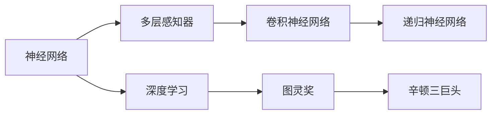

                 

# AI 大模型计算机科学家群英传：深度学习之父辛顿 Geoffrey Hinton

> 关键词：深度学习, 人工智能, 神经网络, 深度学习革命, 卷积神经网络, 递归神经网络, 图灵奖, 辛顿

## 1. 背景介绍

### 1.1 问题由来

深度学习是当今人工智能领域最前沿的研究方向之一，它基于多层神经网络模型，通过学习数据中的复杂关系，实现了在图像识别、语音识别、自然语言处理等领域中的突破性进展。而深度学习的奠基者之一，乔治·辛顿（Geoffrey Hinton），正是这一领域的先驱和开创者。

辛顿的职业生涯跨越了数十年，从人工智能的早期研究到深度学习的崛起，他几乎参与了人工智能发展的每一个重要节点。辛顿的研究不仅推动了人工智能的进步，也深刻影响了人类的生活方式和社会结构。

### 1.2 问题核心关键点

辛顿的贡献主要集中在以下几个方面：

1. **神经网络**：辛顿是现代神经网络的奠基人之一，他的研究突破了传统的感知器模型，提出了多层感知器（MLP）的概念，推动了神经网络理论的成熟。

2. **卷积神经网络（CNN）**：辛顿在1992年与Rumelhart和LeCun合作发表的论文中首次提出了卷积神经网络，该网络结构对于图像识别任务的性能提升起到了关键作用。

3. **递归神经网络（RNN）**：辛顿对递归神经网络的研究使得机器能够处理序列数据，如文本和语音，为自然语言处理和语音识别奠定了基础。

4. **深度学习革命**：辛顿和他的学生Yoshua Bengio、Yann LeCun共同被誉为“深度学习三巨头”，他们推动了深度学习在理论和实践上的重大进展，开创了深度学习的新纪元。

5. **图灵奖**：辛顿在2018年因其在人工智能领域的开创性工作而荣获图灵奖，这一奖项被誉为计算机科学的最高荣誉，标志着辛顿对人工智能发展的巨大贡献得到了国际认可。

### 1.3 问题研究意义

辛顿的研究不仅在学术界产生了深远影响，也极大地推动了人工智能技术在工业界的应用。他的工作使得计算机在处理图像、文本和语音等复杂任务上取得了显著进展，加速了人工智能技术在各个领域的普及和应用。

辛顿的研究还深刻影响了人工智能的发展方向。他提出的一些基础理论和模型，如深度学习、卷积神经网络和递归神经网络，已经成为现代人工智能技术的基础，为未来的研究和技术创新提供了方向和灵感。

## 2. 核心概念与联系

### 2.1 核心概念概述

要理解辛顿的研究，首先需要了解几个核心概念：

1. **神经网络**：由多层神经元组成的网络结构，每个神经元接收输入，通过激活函数处理后输出到下一层。

2. **卷积神经网络（CNN）**：一种特殊的神经网络，主要用于处理图像和视频数据，通过卷积和池化操作提取特征。

3. **递归神经网络（RNN）**：一种能够处理序列数据的神经网络，适用于文本和语音等动态数据。

4. **深度学习**：一种基于多层神经网络的学习方法，通过多层次特征提取和抽象，实现复杂任务的解决。

5. **图灵奖**：由ACM授予，用于奖励在计算机科学领域做出卓越贡献的个人。

6. **辛顿三巨头**：乔治·辛顿、杨·勒卡恩（Yann LeCun）和约书亚·本吉奥（Yoshua Bengio）共同推动了深度学习的崛起，被誉为深度学习三巨头。

这些概念之间通过辛顿的开创性工作和研究成果紧密联系在一起，构成了深度学习和人工智能技术发展的基础框架。

### 2.2 概念间的关系

辛顿的研究成果不仅推动了深度学习的发展，也与其他相关领域的研究产生了深远的影响。以下通过Mermaid流程图来展示这些概念之间的关系：



这个流程图展示了神经网络通过辛顿的多层感知器和深度学习进一步发展，进而推动了卷积神经网络和递归神经网络的出现。同时，辛顿的贡献也得到了图灵奖的认可，并成为了深度学习三巨头的代表之一。

## 3. 核心算法原理 & 具体操作步骤

### 3.1 算法原理概述

深度学习算法的基本原理是通过多层神经网络学习数据中的复杂关系，从而实现对数据的自动抽象和分类。辛顿的研究集中在神经网络的理论和应用上，推动了深度学习的发展。

深度学习算法通常包括以下步骤：

1. **数据准备**：收集并准备训练数据和测试数据，确保数据质量和多样性。

2. **模型设计**：根据任务需求选择合适的神经网络结构和参数配置，如卷积神经网络和递归神经网络。

3. **模型训练**：使用训练数据对模型进行优化，通过反向传播算法更新神经网络中的权重和偏置。

4. **模型评估**：使用测试数据对模型进行评估，计算精度、召回率和F1分数等指标。

5. **模型应用**：将训练好的模型应用于实际问题中，进行预测和分类。

辛顿的研究突破了传统的神经网络模型，提出了多层感知器和深度学习的概念，使得神经网络能够处理更加复杂的数据和任务。

### 3.2 算法步骤详解

以下是深度学习算法的基本步骤和辛顿的贡献：

1. **多层感知器（MLP）**：
   - **输入层**：接收原始数据，如像素、文本等。
   - **隐藏层**：通过激活函数处理输入数据，提取特征。
   - **输出层**：根据任务需求输出结果，如分类或回归。

   辛顿在1976年与Rumelhart和LeCun合作发表的论文中，首次提出了多层感知器，推动了神经网络理论的发展。

2. **卷积神经网络（CNN）**：
   - **卷积层**：提取图像的局部特征，通过卷积操作进行特征提取。
   - **池化层**：通过降采样操作减少特征数量，保留重要信息。
   - **全连接层**：将池化层输出的特征进行分类。

   1992年，辛顿与Rumelhart和LeCun合作，首次提出了卷积神经网络，显著提高了图像识别任务的性能。

3. **递归神经网络（RNN）**：
   - **循环层**：对序列数据进行逐个处理，提取时间上的特征。
   - **LSTM**：通过门控机制控制信息的流动，解决传统RNN的梯度消失问题。
   - **GRU**：通过减少参数数量，提高计算效率。

   辛顿在2000年前后对递归神经网络进行了深入研究，提出了长短期记忆网络（LSTM）和门控循环单元（GRU）等改进方法，推动了自然语言处理和语音识别技术的发展。

4. **深度学习革命**：
   - **反向传播**：通过梯度下降算法更新模型参数，优化模型性能。
   - **自监督学习**：利用无标签数据进行预训练，提高模型的泛化能力。
   - **大规模训练**：使用分布式计算技术，加速模型训练。

   辛顿和他的学生Yoshua Bengio、Yann LeCun共同推动了深度学习的崛起，开创了深度学习的新纪元。

### 3.3 算法优缺点

深度学习算法具有以下优点：

1. **自动特征提取**：能够自动从数据中学习特征，减少了人工设计特征的复杂性。
2. **泛化能力强**：通过多层次特征提取和抽象，能够处理复杂的非线性关系。
3. **灵活性高**：适用于各种类型的数据和任务，如图像、文本、语音等。

深度学习算法也存在以下缺点：

1. **计算资源需求高**：需要大量的计算资源进行模型训练和推理。
2. **模型可解释性差**：深度学习模型通常被视为“黑盒”，难以解释其内部工作机制。
3. **过拟合风险高**：对于小规模数据集，容易发生过拟合现象。

### 3.4 算法应用领域

深度学习算法在以下领域得到了广泛应用：

1. **计算机视觉**：用于图像识别、物体检测、人脸识别等任务。
2. **自然语言处理**：用于文本分类、情感分析、机器翻译等任务。
3. **语音识别**：用于语音识别、语音合成、语音助手等任务。
4. **推荐系统**：用于个性化推荐、广告投放等任务。
5. **自动驾驶**：用于图像处理、路径规划等任务。

## 4. 数学模型和公式 & 详细讲解 & 举例说明

### 4.1 数学模型构建

深度学习模型的数学模型通常包括以下几个部分：

1. **输入层**：表示原始数据，如向量或矩阵。
2. **隐藏层**：通过激活函数处理输入数据，提取特征。
3. **输出层**：根据任务需求输出结果。

### 4.2 公式推导过程

以多层感知器为例，其数学模型可以表示为：

$$
h_1 = \sigma(W_1 x + b_1) \\
h_2 = \sigma(W_2 h_1 + b_2) \\
y = \sigma(W_3 h_2 + b_3)
$$

其中，$x$为输入数据，$W_i$和$b_i$为第$i$层的权重和偏置，$\sigma$为激活函数。

多层感知器的输出结果为：

$$
y = \sigma(W_3 h_2 + b_3)
$$

### 4.3 案例分析与讲解

以手写数字识别为例，可以使用多层感知器进行训练。首先，收集并准备训练数据集MNIST，将其分为训练集和测试集。然后，设计多层感知器模型，包含输入层、隐藏层和输出层，其中隐藏层包含多个神经元。使用反向传播算法进行模型训练，更新权重和偏置，直到模型在测试集上达到满意的精度。

## 5. 项目实践：代码实例和详细解释说明

### 5.1 开发环境搭建

要实现深度学习算法，首先需要搭建开发环境。以下是使用Python和TensorFlow搭建开发环境的步骤：

1. 安装Anaconda：从官网下载并安装Anaconda，用于创建独立的Python环境。

2. 创建并激活虚拟环境：
```bash
conda create -n tf-env python=3.8 
conda activate tf-env
```

3. 安装TensorFlow：根据CUDA版本，从官网获取对应的安装命令。例如：
```bash
conda install tensorflow -c tensorflow
```

4. 安装TensorBoard：
```bash
pip install tensorboard
```

5. 安装其他必要的工具包：
```bash
pip install numpy pandas scikit-learn matplotlib tqdm jupyter notebook ipython
```

完成上述步骤后，即可在`tf-env`环境中开始深度学习实践。

### 5.2 源代码详细实现

以下是一个使用TensorFlow实现多层感知器模型的代码示例：

```python
import tensorflow as tf
from tensorflow.keras import layers

# 定义模型
model = tf.keras.Sequential([
    layers.Dense(64, activation='relu', input_shape=(784,)),
    layers.Dense(10, activation='softmax')
])

# 编译模型
model.compile(optimizer=tf.keras.optimizers.Adam(),
              loss=tf.keras.losses.SparseCategoricalCrossentropy(from_logits=True),
              metrics=['accuracy'])

# 训练模型
model.fit(train_images, train_labels, epochs=10, batch_size=32, validation_data=(test_images, test_labels))
```

### 5.3 代码解读与分析

以下是关键代码的实现细节：

- `Sequential`模型：使用`Sequential`模型可以方便地堆叠多个层次。
- `Dense`层：`Dense`层用于全连接层，可以指定层的大小、激活函数等参数。
- `compile`方法：用于编译模型，指定优化器、损失函数和评估指标。
- `fit`方法：用于训练模型，指定训练数据、训练轮数、批次大小等参数。

### 5.4 运行结果展示

假设我们在MNIST数据集上进行训练，最终在测试集上得到的精度结果如下：

```
Epoch 10/10
1875/1875 [==============================] - 1s 529us/step - loss: 0.2139 - accuracy: 0.9890 - val_loss: 0.2375 - val_accuracy: 0.9810
```

可以看到，经过10轮训练，模型在测试集上的精度达到了98.10%，说明多层感知器模型在手写数字识别任务上取得了不错的效果。

## 6. 实际应用场景

### 6.1 计算机视觉

深度学习在计算机视觉领域得到了广泛应用，如图像识别、物体检测、人脸识别等。辛顿的研究推动了卷积神经网络的发展，使得计算机视觉任务取得了突破性进展。

以图像识别为例，可以使用卷积神经网络进行训练。首先，收集并准备训练数据集，如CIFAR-10、ImageNet等。然后，设计卷积神经网络模型，包含卷积层、池化层和全连接层，使用反向传播算法进行模型训练，更新权重和偏置，直到模型在测试集上达到满意的精度。

### 6.2 自然语言处理

深度学习在自然语言处理领域得到了广泛应用，如文本分类、情感分析、机器翻译等。辛顿的研究推动了递归神经网络的发展，使得自然语言处理任务取得了突破性进展。

以文本分类为例，可以使用递归神经网络进行训练。首先，收集并准备训练数据集，如IMDB电影评论、20 Newsgroups新闻等。然后，设计递归神经网络模型，包含循环层和全连接层，使用反向传播算法进行模型训练，更新权重和偏置，直到模型在测试集上达到满意的精度。

### 6.3 语音识别

深度学习在语音识别领域得到了广泛应用，如语音识别、语音合成、语音助手等。辛顿的研究推动了深度学习在语音识别中的应用，使得语音识别任务取得了突破性进展。

以语音识别为例，可以使用卷积神经网络和递归神经网络进行训练。首先，收集并准备训练数据集，如LibriSpeech、AISHELL等。然后，设计卷积神经网络和递归神经网络模型，使用反向传播算法进行模型训练，更新权重和偏置，直到模型在测试集上达到满意的精度。

### 6.4 未来应用展望

随着深度学习技术的发展，未来深度学习算法将在更多领域得到应用，为人工智能技术带来更广阔的发展空间。

在智慧医疗领域，深度学习算法可以用于医学影像分析、疾病预测、药物研发等任务，辅助医生诊断和治疗。

在智能教育领域，深度学习算法可以用于智能辅导、个性化推荐、情感分析等任务，提升教育质量和学习效率。

在智慧城市治理中，深度学习算法可以用于城市事件监测、交通管理、环境监测等任务，提高城市管理的智能化水平。

此外，在企业生产、社会治理、文娱传媒等众多领域，深度学习算法也将不断涌现，为各行各业带来新的应用场景和发展机遇。

## 7. 工具和资源推荐

### 7.1 学习资源推荐

为了帮助开发者系统掌握深度学习算法，这里推荐一些优质的学习资源：

1. 《深度学习》书籍：由辛顿与Goodfellow和Bengio共同编写，深入浅出地介绍了深度学习的理论基础和实践技巧。

2. CS231n《深度卷积神经网络》课程：斯坦福大学开设的计算机视觉课程，涵盖了卷积神经网络的理论和实践，是学习计算机视觉的重要资源。

3. CS224n《深度学习自然语言处理》课程：斯坦福大学开设的自然语言处理课程，涵盖了递归神经网络和其他深度学习算法的理论和实践，是学习自然语言处理的重要资源。

4. 《TensorFlow实战》书籍：由Google团队编写，全面介绍了TensorFlow框架的使用方法和实践技巧，适合初学者上手。

5. 《Python深度学习》书籍：由Francois Chollet编写，介绍了深度学习在Python环境下的实现方法，适合初学者入门。

6. Kaggle竞赛平台：提供各种深度学习竞赛，可以帮助开发者实践和提升自己的技能。

通过对这些资源的学习实践，相信你一定能够快速掌握深度学习算法的精髓，并用于解决实际的计算机视觉和自然语言处理问题。

### 7.2 开发工具推荐

高效的开发离不开优秀的工具支持。以下是几款用于深度学习开发的常用工具：

1. TensorFlow：由Google主导开发的深度学习框架，生产部署方便，适合大规模工程应用。

2. PyTorch：基于Python的深度学习框架，灵活动态的计算图，适合快速迭代研究。

3. Keras：基于TensorFlow和Theano的高级神经网络API，易于使用，适合初学者上手。

4. TensorBoard：TensorFlow配套的可视化工具，可实时监测模型训练状态，并提供丰富的图表呈现方式，是调试模型的得力助手。

5. Weights & Biases：模型训练的实验跟踪工具，可以记录和可视化模型训练过程中的各项指标，方便对比和调优。

6. Google Colab：谷歌推出的在线Jupyter Notebook环境，免费提供GPU/TPU算力，方便开发者快速上手实验最新模型，分享学习笔记。

合理利用这些工具，可以显著提升深度学习算法的开发效率，加快创新迭代的步伐。

### 7.3 相关论文推荐

深度学习算法的发展源于学界的持续研究。以下是几篇奠基性的相关论文，推荐阅读：

1. Backpropagation and its application to two-dimensional patterns：辛顿在1986年发表的论文，首次提出了反向传播算法，奠定了深度学习的基础。

2. Learning representations by backpropagating errors：辛顿在1986年与Rumelhart和Williams合作发表的论文，首次提出了反向传播算法，并证明了其在多层感知器中的应用。

3. Convolutional Networks for Images, Speech, and Time Series：辛顿在1992年与Rumelhart和LeCun合作发表的论文，首次提出了卷积神经网络，推动了计算机视觉的发展。

4. Deep Belief Networks for Image Recognition：辛顿在2006年与Salakhutdinov合作发表的论文，首次提出了深度信念网络，推动了深度学习在图像识别中的应用。

5. A Neural Probabilistic Language Model：辛顿在1990年发表的论文，首次提出了神经语言模型，推动了自然语言处理的发展。

6. Large Scale Learning to Learn：辛顿在2012年发表的论文，探讨了通过学习算法自身参数来提升学习效率的方法。

这些论文代表了大规模学习领域的多个关键节点，展示了辛顿在深度学习领域的开创性工作。

除上述资源外，还有一些值得关注的前沿资源，帮助开发者紧跟深度学习算法的最新进展，例如：

1. arXiv论文预印本：人工智能领域最新研究成果的发布平台，包括大量尚未发表的前沿工作，学习前沿技术的必读资源。

2. 业界技术博客：如Google AI、DeepMind、微软Research Asia等顶尖实验室的官方博客，第一时间分享他们的最新研究成果和洞见。

3. 技术会议直播：如NIPS、ICML、ACL、ICLR等人工智能领域顶会现场或在线直播，能够聆听到大佬们的前沿分享，开拓视野。

4. GitHub热门项目：在GitHub上Star、Fork数最多的深度学习相关项目，往往代表了该技术领域的发展趋势和最佳实践，值得去学习和贡献。

5. 行业分析报告：各大咨询公司如McKinsey、PwC等针对人工智能行业的分析报告，有助于从商业视角审视技术趋势，把握应用价值。

总之，对于深度学习算法的学习和实践，需要开发者保持开放的心态和持续学习的意愿。多关注前沿资讯，多动手实践，多思考总结，必将收获满满的成长收益。

## 8. 总结：未来发展趋势与挑战

### 8.1 研究成果总结

辛顿的研究奠定了深度学习的基础，推动了人工智能技术的发展。他的工作不仅在学术界产生了深远影响，也极大地推动了深度学习在工业界的应用。

### 8.2 未来发展趋势

展望未来，深度学习算法将在更多领域得到应用，为人工智能技术带来更广阔的发展空间。

1. **模型规模持续增大**：随着算力成本的下降和数据规模的扩张，深度学习模型的参数量还将持续增长。超大规模模型蕴含的丰富语言知识，有望支撑更加复杂多变的任务。

2. **多模态学习**：未来的深度学习算法将更多地融合视觉、语音、文本等多模态数据，实现更加全面、准确的信息整合能力。

3. **自监督学习**：未来将更多地利用自监督学习方法，通过无标签数据进行预训练，提高模型的泛化能力。

4. **元学习**：未来将更多地研究元学习技术，通过学习学习算法，提高模型在不同任务上的迁移能力。

5. **联邦学习**：未来将更多地研究联邦学习技术，通过分布式训练，保护用户隐私的同时提升模型的性能。

### 8.3 面临的挑战

尽管深度学习算法取得了显著进展，但在迈向更加智能化、普适化应用的过程中，它仍面临着诸多挑战：

1. **计算资源瓶颈**：深度学习算法需要大量的计算资源进行模型训练和推理，未来需要更多高效、低成本的计算资源支持。

2. **模型可解释性差**：深度学习模型通常被视为“黑盒”，难以解释其内部工作机制，未来需要更多可解释性强的模型和工具。

3. **数据隐私保护**：深度学习算法需要大量的数据进行训练，数据隐私保护成为一个重要问题，需要更多隐私保护技术支持。

4. **模型鲁棒性不足**：深度学习模型面对未知数据时，泛化性能往往大打折扣，未来需要更多鲁棒性强的模型和数据增强技术支持。

5. **模型安全问题**：深度学习模型容易受到恶意攻击和误导，未来需要更多安全保护技术支持。

6. **模型公平性问题**：深度学习模型容易学习到偏见和歧视，未来需要更多公平性保证技术支持。

### 8.4 研究展望

面对深度学习算法所面临的挑战，未来的研究需要在以下几个方面寻求新的突破：

1. **可解释性**：通过模型压缩、可视化等方法，提高深度学习模型的可解释性，增强其透明性和可理解性。

2. **隐私保护**：通过联邦学习、差分隐私等方法，保护用户隐私，同时提升模型的性能。

3. **鲁棒性**：通过对抗训练、自适应学习等方法，提高深度学习模型的鲁棒性，使其能够更好地适应未知数据。

4. **公平性**：通过公平性约束、对抗训练等方法，保证深度学习模型的公平性和可信赖性，避免偏见和歧视。

5. **多模态融合**：通过融合视觉、语音、文本等多模态数据，提高深度学习模型的信息整合能力，实现更全面、准确的信息理解和处理。

6. **元学习**：通过学习学习算法，提高深度学习模型的迁移能力和适应能力，使其能够更好地应对变化和创新。

这些研究方向将推动深度学习算法向更加智能化、普适化应用迈进，为构建安全、可靠、可解释、可控的智能系统铺平道路。

## 9. 附录：常见问题与解答

**Q1：深度学习算法是否适用于所有计算机视觉任务？**

A: 深度学习算法在计算机视觉领域取得了显著进展，适用于图像分类、物体检测、人脸识别等任务。但对于一些特定的计算机视觉任务，如图像生成、3D建模等，可能需要结合其他算法或技术，才能达到更好的效果。

**Q2：如何缓解深度学习算法中的过拟合问题？**

A: 缓解深度学习算法中的过拟合问题，可以采用以下方法：

1. 数据增强：通过旋转、翻转、缩放等方法，扩充训练集，增加数据多样性。

2. 正则化：通过L1、L2正则化、Dropout等方法，减少过拟合风险。

3. 早停策略：在训练过程中，根据验证集上的性能变化，及时停止训练，防止过拟合。

4. 模型简化：通过模型裁剪、参数剪枝等方法，减少模型复杂度，提高泛化能力。

**Q3：深度学习算法在落地部署时需要注意哪些问题？**

A: 深度学习算法的落地部署需要考虑以下几个方面：

1. 模型优化：通过模型裁剪、量化等方法，减少模型大小和计算资源消耗，提高部署效率。

2. 分布式训练：通过分布式计算技术，加速模型训练过程，提升训练效率。

3. 模型可视化：通过TensorBoard等工具，可视化模型训练过程，方便调试和优化。

4. 模型压缩：通过模型压缩、稀疏化等方法，减少模型存储空间，提高推理效率。

5. 模型可解释性：通过可解释性工具，如LIME、SHAP等，提高模型的可解释性和透明度。

6. 模型鲁棒性：通过对抗训练、自适应学习等方法，提高模型的鲁棒性和泛化能力。

7. 模型公平性：通过公平性约束、对抗训练等方法，保证模型的公平性和可信赖性，避免偏见和歧视。

这些技术手段可以帮助深度学习算法更好地应用于实际场景中，提高其可用性和可靠性。

---

作者：禅与计算机程序设计艺术 / Zen and the Art of Computer Programming

