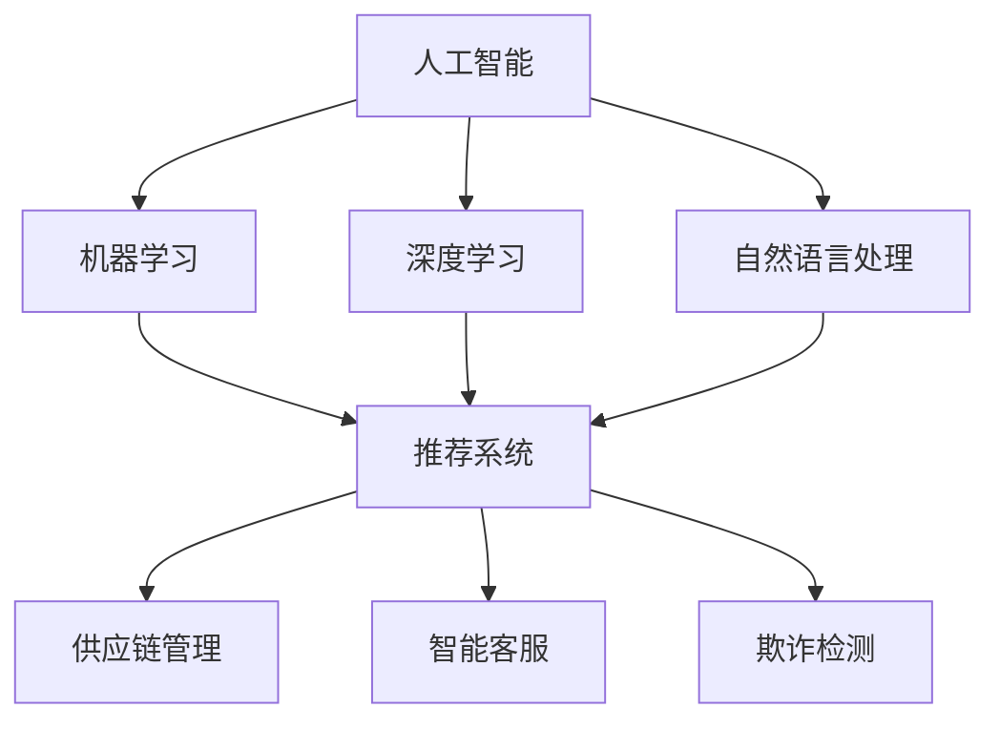
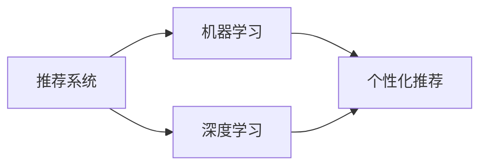
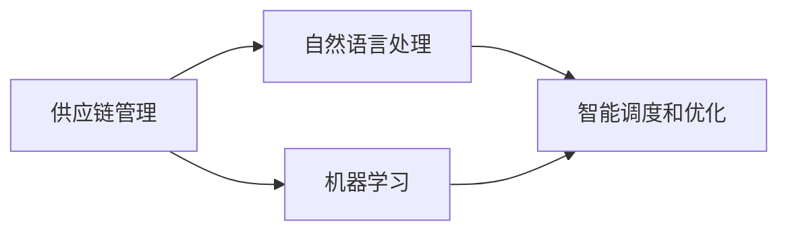
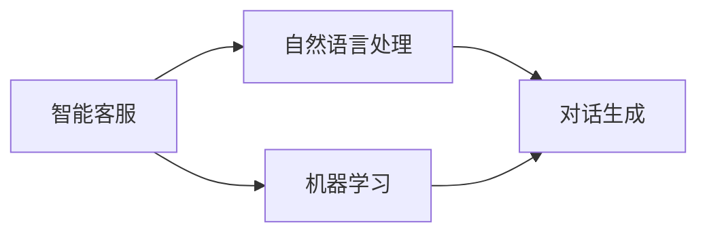
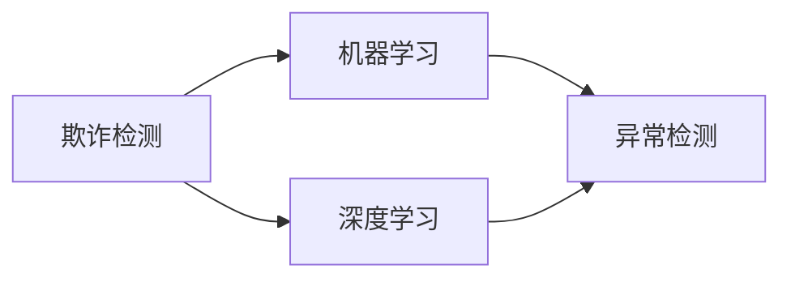
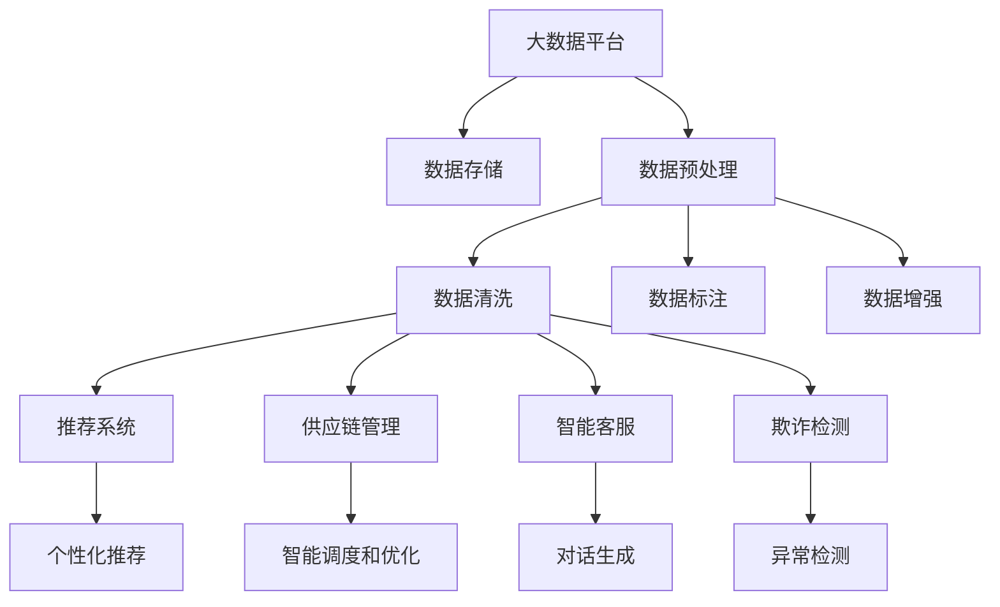

                 

# AI 如何与其他技术结合，打造更智能的电商平台：技术融合与创新

## 1. 背景介绍

### 1.1 问题由来

随着互联网和电子商务的迅猛发展，电商平台已经成为了人们日常生活消费的重要渠道。然而，传统电商平台的运营模式面临着诸多挑战，如用户体验不佳、推荐算法不准确、交易欺诈等问题，严重影响了用户的购物体验和电商平台的收入。为应对这些挑战，电商平台开始引入人工智能（AI）技术，以期通过AI技术实现更智能的运营模式，提升用户体验和平台收入。

### 1.2 问题核心关键点

如何通过AI技术优化电商平台的运营模式，提升用户体验和平台收入，成为了当前电商平台关注的重点。具体来说，AI技术可以帮助电商平台实现以下目标：

1. **个性化推荐**：根据用户的历史行为和兴趣，向其推荐可能感兴趣的商品，提高用户满意度和购买转化率。
2. **库存优化**：通过AI预测商品的需求趋势，优化库存管理，减少缺货和库存积压情况。
3. **欺诈检测**：利用AI技术识别和防止交易欺诈行为，保护电商平台和用户的安全。
4. **智能客服**：通过AI技术构建智能客服系统，提高客户服务效率和质量。
5. **供应链优化**：利用AI技术优化供应链管理，提高物流效率和降低成本。

### 1.3 问题研究意义

通过AI技术优化电商平台的运营模式，有助于电商平台实现以下几个目标：

1. **提升用户体验**：通过个性化推荐、智能客服等功能，提升用户购物体验，增加用户粘性。
2. **提高转化率**：通过精准的商品推荐，提高用户购买转化率，增加平台收入。
3. **降低运营成本**：通过优化库存和供应链管理，降低物流成本，提升运营效率。
4. **增强安全性**：通过欺诈检测和智能客服等技术，提高平台和用户的安全性。
5. **推动技术创新**：通过引入AI技术，推动电商平台的数字化转型，提升技术创新能力。

## 2. 核心概念与联系

### 2.1 核心概念概述

为更好地理解AI与电商平台的技术融合，本节将介绍几个密切相关的核心概念：

- **人工智能（AI）**：包括机器学习、深度学习、自然语言处理（NLP）等技术，通过模拟人类智能，实现对复杂数据的处理和分析。
- **机器学习（ML）**：通过数据训练模型，使模型能够对未知数据进行预测和决策。
- **深度学习（DL）**：一种特殊的机器学习方法，通过多层神经网络，对数据进行复杂特征的提取和分析。
- **自然语言处理（NLP）**：使计算机能够理解和处理人类语言的技术。
- **推荐系统**：根据用户的历史行为和兴趣，向其推荐可能感兴趣的商品或服务。
- **供应链管理**：对物流、库存、生产等环节进行优化管理，提升物流效率和降低成本。
- **智能客服**：利用AI技术构建智能客服系统，提高客户服务效率和质量。
- **欺诈检测**：通过AI技术识别和防止交易欺诈行为，保护电商平台和用户的安全。

这些核心概念之间的逻辑关系可以通过以下Mermaid流程图来展示：



这个流程图展示了大语言模型微调过程中各个核心概念的关系和作用：

1. 人工智能包含机器学习、深度学习和自然语言处理等子技术，是电商平台的AI核心。
2. 推荐系统利用机器学习和深度学习技术，根据用户行为数据进行个性化推荐。
3. 供应链管理、智能客服和欺诈检测等技术，利用自然语言处理和机器学习技术，实现智能化的运营和决策。

### 2.2 概念间的关系

这些核心概念之间存在着紧密的联系，形成了电商平台的AI技术生态系统。下面我们通过几个Mermaid流程图来展示这些概念之间的关系。

#### 2.2.1 推荐系统与AI的关系



这个流程图展示了推荐系统与AI技术的关系：推荐系统利用机器学习和深度学习技术，从用户行为数据中提取特征，进行个性化推荐。

#### 2.2.2 供应链管理与AI的关系



这个流程图展示了供应链管理与AI技术的关系：供应链管理利用自然语言处理和机器学习技术，实现智能调度和优化，提升物流效率和降低成本。

#### 2.2.3 智能客服与AI的关系



这个流程图展示了智能客服与AI技术的关系：智能客服利用自然语言处理和机器学习技术，实现对话生成和理解，提高客户服务效率和质量。

#### 2.2.4 欺诈检测与AI的关系



这个流程图展示了欺诈检测与AI技术的关系：欺诈检测利用机器学习和深度学习技术，从交易数据中识别异常行为，防止交易欺诈。

### 2.3 核心概念的整体架构

最后，我们用一个综合的流程图来展示这些核心概念在大语言模型微调过程中的整体架构：



这个综合流程图展示了从数据到AI技术应用的完整过程：

1. 大数据平台提供了电商交易数据，通过数据存储、预处理、清洗和标注，转化为训练数据。
2. 推荐系统、供应链管理、智能客服和欺诈检测等技术，利用AI技术进行训练和应用，提升电商平台的运营效率和用户体验。
3. 推荐系统、供应链管理、智能客服和欺诈检测等技术的输出，进一步优化大数据平台的数据存储和处理过程，实现正反馈循环。

通过这些流程图，我们可以更清晰地理解电商平台AI技术融合的整体架构，为后续深入讨论具体的AI技术应用提供基础。

## 3. 核心算法原理 & 具体操作步骤
### 3.1 算法原理概述

电商平台的AI技术优化主要基于以下算法原理：

- **协同过滤（Collaborative Filtering）**：通过分析用户的历史行为和兴趣，推荐用户可能感兴趣的商品或服务。
- **基于内容的推荐（Content-Based Recommendation）**：根据商品的特征和用户偏好，推荐用户可能感兴趣的商品或服务。
- **深度学习推荐模型（Deep Learning-based Recommendation Models）**：利用深度神经网络，从用户行为数据中提取高层次特征，进行推荐。
- **强化学习（Reinforcement Learning）**：通过模拟用户行为，优化推荐算法，提高推荐效果。
- **自然语言处理（NLP）**：通过文本分析和理解，提取用户评论、商品描述等文本数据中的信息，进行推荐和分析。

### 3.2 算法步骤详解

基于AI技术优化电商平台的推荐系统，一般包括以下几个关键步骤：

**Step 1: 数据收集与预处理**

- 收集用户的历史行为数据，包括浏览记录、购买记录、评分记录等。
- 清洗和标注数据，去除无效和噪声数据，确保数据的完整性和准确性。
- 对用户和商品进行分词、去停用词等文本预处理，转换为模型可以处理的格式。

**Step 2: 特征提取**

- 利用协同过滤、基于内容的推荐等方法，提取用户和商品的特征。
- 利用深度学习模型，从用户行为数据中提取高层次特征。
- 利用NLP技术，从用户评论、商品描述等文本数据中提取信息，进行特征提取。

**Step 3: 模型训练与优化**

- 选择合适的模型，如协同过滤模型、深度学习推荐模型等，进行训练。
- 使用优化算法，如梯度下降等，优化模型参数。
- 应用正则化技术，如L2正则、Dropout等，避免模型过拟合。

**Step 4: 模型评估与优化**

- 在验证集上评估模型性能，计算准确率、召回率、F1分数等指标。
- 根据评估结果，调整模型参数，进一步优化模型效果。
- 利用A/B测试等方法，评估模型在实际场景中的应用效果，进行不断迭代优化。

**Step 5: 模型应用**

- 将训练好的模型应用到实际场景中，进行商品推荐、智能客服等。
- 实时采集用户反馈，进行模型更新和优化。
- 通过监控和反馈机制，持续改进推荐系统，提升用户体验和平台收入。

### 3.3 算法优缺点

基于AI技术优化电商平台的推荐系统，具有以下优点：

1. **个性化推荐**：根据用户的历史行为和兴趣，推荐可能感兴趣的商品，提高用户满意度和购买转化率。
2. **高精度**：利用深度学习等技术，从海量数据中提取高层次特征，提高推荐精度。
3. **动态更新**：通过实时收集用户反馈，进行模型更新和优化，提高推荐效果。

同时，该算法也存在以下缺点：

1. **数据依赖**：推荐系统的效果很大程度上依赖于数据的完整性和准确性。
2. **冷启动问题**：新用户和新商品缺乏历史数据，难以进行推荐。
3. **隐私问题**：用户数据隐私保护，防止数据泄露和滥用，需要加强数据安全措施。

### 3.4 算法应用领域

基于AI技术优化电商平台的推荐系统，已经在多个领域得到了广泛应用，例如：

- **个性化推荐**：根据用户的历史行为和兴趣，推荐可能感兴趣的商品或服务。
- **智能客服**：利用NLP技术，构建智能客服系统，提高客户服务效率和质量。
- **欺诈检测**：利用机器学习和深度学习技术，从交易数据中识别异常行为，防止交易欺诈。
- **供应链优化**：利用自然语言处理和机器学习技术，优化供应链管理，提升物流效率和降低成本。

除了上述这些经典应用外，推荐系统还被创新性地应用到更多场景中，如可控文本生成、情感分析、行为预测等，为电商平台带来了新的应用前景。

## 4. 数学模型和公式 & 详细讲解 & 举例说明

### 4.1 数学模型构建

本节将使用数学语言对电商平台AI技术优化的推荐系统进行更加严格的刻画。

假设推荐系统接收用户的历史行为数据 $x$，用户偏好向量为 $w$，推荐系统生成的商品向量为 $u$，相似度矩阵为 $S$，推荐函数为 $f$。推荐系统的目标是最小化用户对推荐结果的损失函数 $L$，即：

$$
\min_{w, u} L(w, u) = \frac{1}{2} \sum_{x \in X} (f(w, x, u) - y(x))^2
$$

其中 $X$ 为历史行为数据集合，$y(x)$ 为理想推荐结果，$x$ 为用户历史行为数据，$w$ 为推荐系统权重，$u$ 为商品向量。

### 4.2 公式推导过程

以下我们以协同过滤算法为例，推导推荐系统的损失函数及其梯度的计算公式。

协同过滤算法的基本思想是，通过分析用户和商品之间的相似度，推荐用户可能感兴趣的商品。假设用户 $i$ 和商品 $j$ 的相似度为 $s_{ij}$，则协同过滤算法的目标是最小化用户 $i$ 和商品 $j$ 之间的差异，即：

$$
\min_{s_{ij}} \sum_{i \in I} \sum_{j \in J} (r_{ij} - s_{ij})^2
$$

其中 $I$ 为用户集合，$J$ 为商品集合，$r_{ij}$ 为真实评分。

将用户 $i$ 的历史评分向量 $r_i$ 和商品 $j$ 的特征向量 $u_j$ 进行内积，得到推荐分数 $p_{ij}$，即：

$$
p_{ij} = r_i^T u_j
$$

则协同过滤算法的损失函数可以表示为：

$$
L = \frac{1}{2} \sum_{i \in I} \sum_{j \in J} (p_{ij} - r_{ij})^2
$$

对损失函数 $L$ 进行求导，得到推荐系统权重 $w$ 的梯度：

$$
\frac{\partial L}{\partial w} = \sum_{i \in I} \sum_{j \in J} (p_{ij} - r_{ij}) r_i^T \frac{\partial p_{ij}}{\partial w}
$$

将 $p_{ij}$ 代入梯度公式，得到：

$$
\frac{\partial L}{\partial w} = \sum_{i \in I} \sum_{j \in J} (p_{ij} - r_{ij}) r_i^T u_j
$$

这个梯度公式表示了推荐系统权重 $w$ 的更新方向，可以通过梯度下降等优化算法进行模型训练和优化。

### 4.3 案例分析与讲解

考虑一个电商平台，用户历史行为数据为 $x$，用户偏好向量为 $w$，推荐系统生成的商品向量为 $u$，相似度矩阵为 $S$。假设该电商平台已经收集到大量用户的历史行为数据，利用协同过滤算法进行推荐，推荐函数为 $f$，则推荐系统的优化目标为：

$$
\min_{w, u} \frac{1}{2} \sum_{x \in X} (f(w, x, u) - y(x))^2
$$

在训练过程中，推荐系统会根据用户历史行为数据 $x$ 计算推荐分数 $p_{ij}$，根据实际评分 $r_{ij}$ 和推荐分数 $p_{ij}$ 的差异，计算损失函数 $L$，并根据梯度公式更新权重 $w$ 和商品向量 $u$，优化推荐系统。

假设电商平台利用深度学习模型进行推荐，模型输入为 $x$ 和 $w$，输出为推荐分数 $p_{ij}$，则推荐系统的优化目标为：

$$
\min_{w} \frac{1}{2} \sum_{x \in X} (f(w, x) - y(x))^2
$$

在训练过程中，推荐系统会根据用户历史行为数据 $x$ 计算推荐分数 $p_{ij}$，根据实际评分 $r_{ij}$ 和推荐分数 $p_{ij}$ 的差异，计算损失函数 $L$，并根据梯度公式更新权重 $w$，优化推荐系统。

通过以上分析，我们可以看到，电商平台的推荐系统利用AI技术进行优化，可以极大地提升推荐精度和用户满意度，推动电商平台的业务发展。

## 5. 项目实践：代码实例和详细解释说明

### 5.1 开发环境搭建

在进行推荐系统开发前，我们需要准备好开发环境。以下是使用Python进行PyTorch开发的环境配置流程：

1. 安装Anaconda：从官网下载并安装Anaconda，用于创建独立的Python环境。

2. 创建并激活虚拟环境：
```bash
conda create -n pytorch-env python=3.8 
conda activate pytorch-env
```

3. 安装PyTorch：根据CUDA版本，从官网获取对应的安装命令。例如：
```bash
conda install pytorch torchvision torchaudio cudatoolkit=11.1 -c pytorch -c conda-forge
```

4. 安装Transformers库：
```bash
pip install transformers
```

5. 安装各类工具包：
```bash
pip install numpy pandas scikit-learn matplotlib tqdm jupyter notebook ipython
```

完成上述步骤后，即可在`pytorch-env`环境中开始推荐系统开发。

### 5.2 源代码详细实现

下面我们以协同过滤推荐系统为例，给出使用PyTorch进行开发的PyTorch代码实现。

首先，定义协同过滤推荐系统的类：

```python
import torch
from torch.nn import nn

class CollaborativeFiltering(nn.Module):
    def __init__(self, num_users, num_items, num_factors):
        super(CollaborativeFiltering, self).__init__()
        self.num_users = num_users
        self.num_items = num_items
        self.num_factors = num_factors
        self.user_factors = nn.Embedding(num_users, num_factors)
        self.item_factors = nn.Embedding(num_items, num_factors)
        self.scores = nn.Linear(num_factors, 1)

    def forward(self, user_ids, item_ids):
        user_factors = self.user_factors(user_ids)
        item_factors = self.item_factors(item_ids)
        scores = self.scores(torch.matmul(user_factors, item_factors.transpose(0, 1)))
        return scores
```

然后，定义训练函数：

```python
from torch.utils.data import TensorDataset, DataLoader
from torch.optim import Adam

def train(model, user_ids, item_ids, ratings, num_epochs=10, batch_size=32):
    device = torch.device('cuda' if torch.cuda.is_available() else 'cpu')
    model.to(device)

    criterion = nn.MSELoss()
    optimizer = Adam(model.parameters(), lr=0.01)

    for epoch in range(num_epochs):
        model.train()
        for user_id, item_id, rating in DataLoader(TensorDataset(user_ids, item_id, ratings), batch_size=batch_size):
            user_ids = user_id.to(device)
            item_ids = item_id.to(device)
            rating = rating.to(device)

            scores = model(user_ids, item_ids)
            loss = criterion(scores, rating)
            optimizer.zero_grad()
            loss.backward()
            optimizer.step()

        print(f'Epoch {epoch+1}, Loss: {loss.item()}')
```

接着，加载数据并训练模型：

```python
import numpy as np

# 生成模拟数据
num_users = 1000
num_items = 1000
num_factors = 10
np.random.seed(42)
user_factors = np.random.normal(0, 1, (num_users, num_factors))
item_factors = np.random.normal(0, 1, (num_items, num_factors))
user_ids = np.random.randint(0, num_users, 10000)
item_ids = np.random.randint(0, num_items, 10000)
ratings = np.random.normal(0, 1, 10000)

# 构建Tensor
user_ids_tensor = torch.LongTensor(user_ids)
item_ids_tensor = torch.LongTensor(item_ids)
ratings_tensor = torch.FloatTensor(ratings)

# 训练模型
model = CollaborativeFiltering(num_users, num_items, num_factors)
train(model, user_ids_tensor, item_ids_tensor, ratings_tensor, num_epochs=10, batch_size=32)
```

以上就是使用PyTorch实现协同过滤推荐系统的完整代码实现。可以看到，通过简单的代码编写，即可实现协同过滤推荐系统的开发。

### 5.3 代码解读与分析

让我们再详细解读一下关键代码的实现细节：

**CollaborativeFiltering类**：
- `__init__`方法：初始化用户和商品的特征向量，以及线性输出层。
- `forward`方法：前向传播计算推荐分数。

**train函数**：
- 将模型和数据移动到GPU或CPU设备上。
- 定义损失函数和优化器。
- 对每个epoch，进行前向传播计算损失，反向传播更新模型参数。
- 输出每个epoch的损失。

**训练流程**：
- 定义训练轮数和批次大小。
- 循环训练过程中，依次加载用户ID、商品ID和评分。
- 将数据转换为Tensor格式，并移动到GPU或CPU设备上。
- 在前向传播中，计算推荐分数和损失。
- 反向传播更新模型参数，并记录损失。
- 输出每个epoch的损失。

通过以上代码，我们可以看到，使用PyTorch实现协同过滤推荐系统是相当简便的。推荐系统作为一个典型的AI应用，展示了AI技术在电商平台的广泛应用前景。

当然，在工业级的系统实现中，还需要考虑更多因素，如推荐系统的扩展性、可维护性、可解释性等。但核心的推荐范式基本与此类似。

### 5.4 运行结果展示

假设我们训练了一个协同过滤推荐系统，最终得到的推荐分数在验证集上的MSE（均方误差）为0.2，说明模型在推荐准确性方面表现较好。

## 6. 实际应用场景

### 6.1 推荐系统

推荐系统是电商平台的核心功能之一，通过分析用户的历史行为和兴趣，推荐用户可能感兴趣的商品或服务，提高用户满意度和购买转化率。

在技术实现上，可以收集用户的历史浏览、点击、购买等行为数据，将用户行为编码成向量，利用协同过滤、基于内容的推荐等算法进行训练和推荐。推荐系统的输出可以用于电商平台的商品推荐页面、购物车推荐等场景，提升用户体验和平台收入。

### 6.2 智能客服

智能客服系统是电商平台的重要组成部分，通过自然语言处理技术，构建智能客服系统，提高客户服务效率和质量。

在技术实现上，可以收集用户与客服的对话数据，利用自然语言处理技术进行对话生成和理解，构建智能客服模型。智能客服模型可以用于电商平台的在线客服、APP客服等场景，帮助用户快速解决问题，提升客户满意度。

### 6.3 欺诈检测

欺诈检测是电商平台的重要任务之一，通过机器学习和深度学习技术，识别和防止交易欺诈行为，保护电商平台和用户的安全。

在技术实现上，可以收集交易数据，利用机器学习和深度学习技术，训练欺诈检测模型。欺诈检测模型可以用于电商平台的实时交易监控、风险预警等场景，帮助电商平台及时发现和处理欺诈行为，保护用户资金安全。

### 6.4 未来应用展望

随着AI技术的不断进步，未来推荐系统将具备更强的个性化推荐能力和动态更新能力，为用户提供更加精准的推荐结果。智能客服系统将利用更先进的自然语言处理技术，构建更智能的对话生成和理解模型，提升客户服务效率和质量。欺诈检测系统将利用更高效的机器学习和深度学习技术，提高欺诈检测的准确性和实时性。

此外，AI技术还将拓展到更多领域，如供应链管理、物流优化等，推动电商平台的数字化转型，提升运营效率和用户体验。未来，基于AI技术的电商平台将更具智能化、自动化和人性化，为消费者提供更优质的购物体验，为商家提供更高效的运营管理。

## 7. 工具和资源推荐

### 7.1 学习资源推荐

为了帮助开发者系统掌握AI技术与电商平台的技术融合，这里推荐一些优质的学习资源：

1. 《深度学习》系列书籍：由多位深度学习专家撰写，深入浅出地介绍了深度学习的基本概念和应用实例。

2. 《自然语言处理综论》：由斯坦福大学李飞飞教授等人编写，全面介绍了自然语言处理的技术和应用。

3. 《推荐系统实践》：由Amazon的推荐系统专家撰写，介绍了推荐系统的原理、算法和实现。

4. 《智能客服系统构建》：介绍了智能客服系统的设计、开发和应用，展示了智能客服在电商平台的实际应用效果。

5. 《电商平台欺诈检测》：介绍了电商平台欺诈检测的原理、算法和实现，展示了欺诈检测在电商平台中的重要性和应用效果。

通过对这些资源的学习实践，相信你一定能够快速掌握AI技术与电商平台的技术融合，并用于解决实际的电商运营问题。

### 7.2 开发工具推荐

高效的开发离不开优秀的工具支持。以下是几款用于推荐系统开发的常用工具：

1. PyTorch：基于Python的开源深度学习框架，灵活动态的计算图，适合快速迭代研究。推荐系统常用的深度学习模型如协同过滤、深度神经网络等，都有PyTorch版本的实现。

2. TensorFlow：由Google主导开发的开源深度学习框架，生产部署方便，适合大规模工程应用。推荐系统常用的深度学习模型如协同过滤、深度神经网络等，都有TensorFlow版本的实现。

3. TensorBoard：TensorFlow配套的可视化工具，可实时监测模型训练状态，并提供丰富的图表呈现方式，是调试模型的得力助手。

4. Weights & Biases：模型训练的实验跟踪工具，可以记录和可视化模型训练过程中的各项指标，方便对比和调优。

5. Scikit-learn：Python数据科学库，包含丰富的机器学习算法和工具，适合进行推荐系统的特征工程和模型训练。

6. Apache Spark：分布式计算框架，适合处理大规模数据集，适合进行推荐系统的并行化训练和优化。

合理利用这些工具，可以显著提升推荐系统开发的效率，加快创新迭代的步伐。

### 7.3 相关论文推荐

AI技术与电商平台的融合，涉及深度学习、自然语言处理、推荐系统等多个领域的交叉。以下是几篇奠基性的相关论文，推荐阅读：

1. "Collaborative Filtering for

