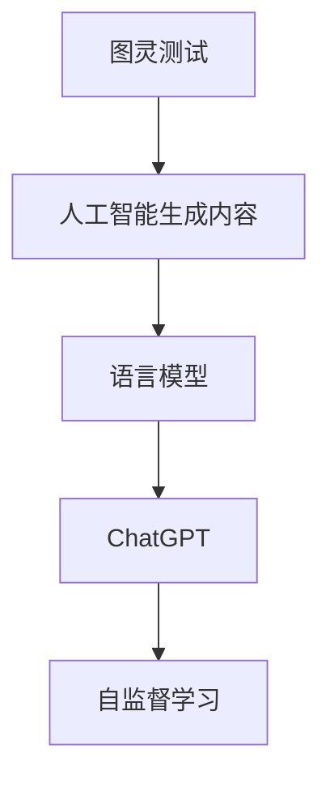
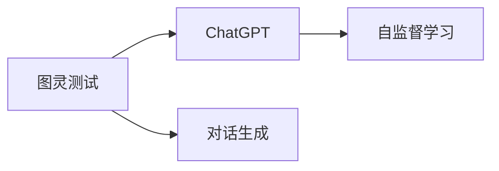
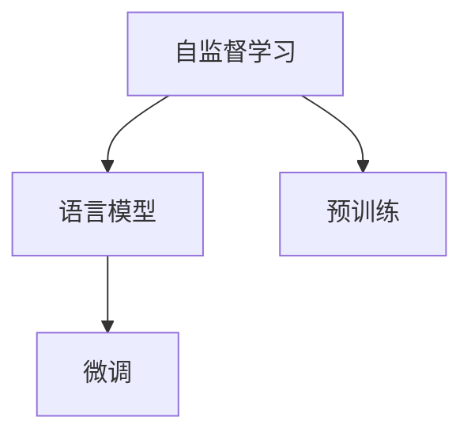
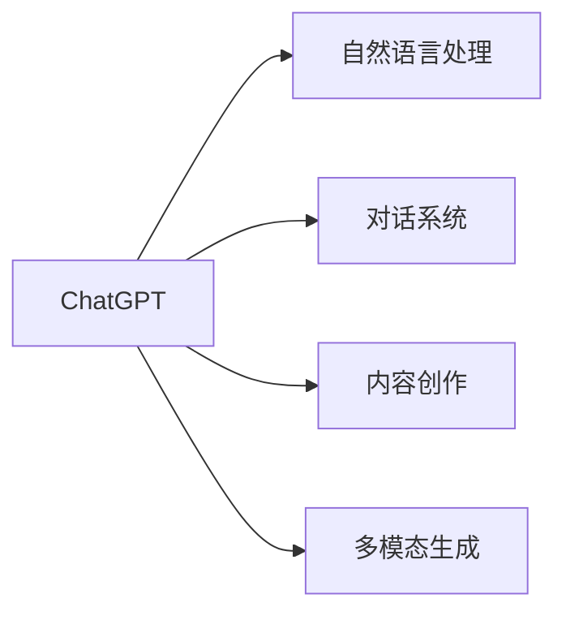
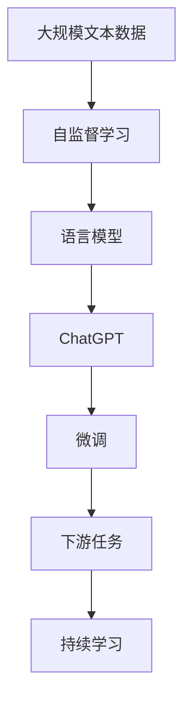

                 

# AIGC从入门到实战：ChatGPT 是否认为自己通过了图灵测试？

> 关键词：人工智能生成内容(AIGC), 图灵测试, ChatGPT, 自监督学习, 语言模型, 代码实现, 应用场景

## 1. 背景介绍

### 1.1 问题由来

自2023年以来，基于大语言模型的ChatGPT引起了全球范围内关于AI伦理与未来的热烈讨论。那么，**ChatGPT是否通过了自己的图灵测试**？这一问题成为业内热议的焦点。要回答这个问题，我们首先需要了解什么是图灵测试以及其与AIGC技术的关系。

图灵测试由英国数学家阿兰·图灵在1950年提出，用于评估一个机器是否具备人类的智能水平。如果一个人在与机器交流时无法区分其和人类，则该机器通过图灵测试。AIGC（人工智能生成内容）技术，特别是ChatGPT这类大语言模型，被广泛应用于各种生成任务，如自然语言处理、对话系统、内容创作等。因此，评估ChatGPT是否通过图灵测试，实际上是在探讨其生成内容的自然度和智能水平。

### 1.2 问题核心关键点

ChatGPT是否通过图灵测试的关键点包括：
- ChatGPT生成的内容的自然度与连贯性。
- ChatGPT在不同任务（如问答、翻译、创作等）中的表现。
- ChatGPT在复杂情境下的推理与判断能力。
- ChatGPT的语言模型结构和训练数据。

### 1.3 问题研究意义

评估ChatGPT是否通过图灵测试，不仅有助于理解AIGC技术的实际应用水平，还对未来的AI伦理、技术发展方向和政策制定具有重要参考价值。同时，这也反映了公众对于AIGC技术的接受程度和期望。

## 2. 核心概念与联系

### 2.1 核心概念概述

要深入探讨ChatGPT是否通过图灵测试，需要先了解几个关键概念：

- **图灵测试**：评估机器是否具备人类智能的一种方法，标准为人类无法区分机器与人类对话。
- **人工智能生成内容(AIGC)**：使用人工智能技术自动生成文本、音频、视频等内容的创作方式。
- **语言模型**：基于大量文本数据训练的模型，用于生成自然语言文本。
- **ChatGPT**：OpenAI开发的大语言模型，基于Transformer架构，采用自监督学习进行训练。
- **自监督学习**：使用无标签数据进行训练，利用数据自身的信息进行模型优化。

这些概念之间的关系可以通过以下Mermaid流程图来展示：



这个流程图展示了从图灵测试到AIGC，再到语言模型和ChatGPT之间的联系。自监督学习是ChatGPT训练的核心技术，而AIGC技术则是其应用方向。

### 2.2 概念间的关系

这些核心概念之间的逻辑关系更加复杂，我们可以通过多个子图来展示它们之间的关系。

#### 2.2.1 图灵测试与ChatGPT



这个子图展示了图灵测试与ChatGPT之间的直接联系。ChatGPT通过自监督学习训练语言模型，生成对话内容，以通过图灵测试。

#### 2.2.2 自监督学习与语言模型



这个子图展示了自监督学习在语言模型训练中的应用。自监督学习通过预训练和微调两个阶段，构建语言模型。

#### 2.2.3 ChatGPT的应用场景



这个子图展示了ChatGPT在多个应用场景中的应用。包括自然语言处理、对话系统、内容创作和多模态生成等。

### 2.3 核心概念的整体架构

最后，我们用一个综合的流程图来展示这些核心概念在大语言模型微调过程中的整体架构：



这个综合流程图展示了从数据预处理到微调，再到持续学习的完整过程。ChatGPT首先在大规模文本数据上进行自监督学习，然后通过微调适配下游任务，最后通过持续学习不断提升性能。

## 3. 核心算法原理 & 具体操作步骤
### 3.1 算法原理概述

ChatGPT通过自监督学习构建语言模型，然后通过微调适配特定的下游任务。其核心算法原理基于Transformer架构，采用Transformer层的自注意力机制进行文本处理和生成。在微调过程中，模型会根据下游任务的目标进行参数更新，从而生成符合任务需求的输出。

### 3.2 算法步骤详解

1. **数据准备**：收集与任务相关的标注数据集，划分为训练集、验证集和测试集。
2. **模型加载**：加载预训练的ChatGPT模型和相应的任务适配层。
3. **微调设置**：选择合适的优化器和超参数，如学习率、批大小、迭代轮数等。
4. **模型训练**：在训练集上进行迭代训练，使用损失函数计算模型输出与真实标签之间的差异。
5. **验证评估**：在验证集上评估模型性能，根据性能指标决定是否触发Early Stopping。
6. **模型测试**：在测试集上测试微调后的模型，对比微调前后的性能。
7. **部署应用**：将微调后的模型集成到实际的应用系统中，进行实时推理。

### 3.3 算法优缺点

ChatGPT的大语言模型微调方法具有以下优点：
- **高效性**：仅需少量标注数据即可进行微调，大大降低了开发成本。
- **可解释性**：微调后的模型参数较少，有助于理解其决策过程。
- **通用性**：适用于多种NLP任务，包括问答、翻译、摘要等。

同时，该方法也存在一些缺点：
- **数据依赖**：微调性能高度依赖于标注数据的质量和数量。
- **过拟合风险**：如果微调数据集较小，模型可能会过拟合，导致泛化能力不足。
- **鲁棒性问题**：在复杂或特殊情境下，模型可能表现不佳。

### 3.4 算法应用领域

ChatGPT的微调方法已经广泛应用于以下几个领域：

- **问答系统**：如智能客服、在线教育、法律咨询等。
- **内容创作**：如自动摘要、文章生成、小说创作等。
- **翻译系统**：如中英文翻译、跨语言问答等。
- **多模态生成**：如语音生成、图像描述生成等。

除了上述领域，ChatGPT还在创意写作、音乐创作、艺术创作等方面展现出了广泛的应用前景。

## 4. 数学模型和公式 & 详细讲解  
### 4.1 数学模型构建

假设ChatGPT在输入$x$下的输出为$\hat{y}=M_{\theta}(x)$，其中$\theta$为模型参数，$M_{\theta}$为微调后的语言模型。设任务$T$的训练集为$D=\{(x_i,y_i)\}_{i=1}^N$，其中$x_i$为输入，$y_i$为真实标签。

定义ChatGPT在数据样本$(x,y)$上的损失函数为$\ell(M_{\theta}(x),y)$，则在数据集$D$上的经验风险为：

$$
\mathcal{L}(\theta) = \frac{1}{N} \sum_{i=1}^N \ell(M_{\theta}(x_i),y_i)
$$

微调的优化目标是最小化经验风险，即找到最优参数：

$$
\theta^* = \mathop{\arg\min}_{\theta} \mathcal{L}(\theta)
$$

在实践中，我们通常使用基于梯度的优化算法（如Adam、SGD等）来近似求解上述最优化问题。设$\eta$为学习率，则参数的更新公式为：

$$
\theta \leftarrow \theta - \eta \nabla_{\theta}\mathcal{L}(\theta)
$$

其中$\nabla_{\theta}\mathcal{L}(\theta)$为损失函数对参数$\theta$的梯度，可通过反向传播算法高效计算。

### 4.2 公式推导过程

以二分类任务为例，假设ChatGPT在输入$x$上的输出为$\hat{y}=M_{\theta}(x) \in [0,1]$，表示样本属于正类的概率。真实标签$y \in \{0,1\}$。则二分类交叉熵损失函数定义为：

$$
\ell(M_{\theta}(x),y) = -[y\log \hat{y} + (1-y)\log (1-\hat{y})]
$$

将其代入经验风险公式，得：

$$
\mathcal{L}(\theta) = -\frac{1}{N}\sum_{i=1}^N [y_i\log M_{\theta}(x_i)+(1-y_i)\log(1-M_{\theta}(x_i))]
$$

根据链式法则，损失函数对参数$\theta_k$的梯度为：

$$
\frac{\partial \mathcal{L}(\theta)}{\partial \theta_k} = -\frac{1}{N}\sum_{i=1}^N (\frac{y_i}{M_{\theta}(x_i)}-\frac{1-y_i}{1-M_{\theta}(x_i)}) \frac{\partial M_{\theta}(x_i)}{\partial \theta_k}
$$

其中$\frac{\partial M_{\theta}(x_i)}{\partial \theta_k}$可进一步递归展开，利用自动微分技术完成计算。

### 4.3 案例分析与讲解

以情感分析任务为例，假设训练集为电影评论及其情感标签，将评论和标签输入ChatGPT进行微调。微调后的ChatGPT能够对新评论的情感进行分类，预测其属于正面、中性还是负面。

在实践中，我们通常使用PyTorch框架进行模型训练和推理。以下是一个简单的代码示例：

```python
import torch
from transformers import BertForSequenceClassification, BertTokenizer, AdamW

# 加载模型和分词器
model = BertForSequenceClassification.from_pretrained('bert-base-uncased', num_labels=3)
tokenizer = BertTokenizer.from_pretrained('bert-base-uncased')

# 准备训练数据
train_data = [('电影评论1', 'positive'), ('电影评论2', 'negative'), ...]
train_encodings = tokenizer(train_data, padding='max_length', truncation=True, max_length=512)

# 定义损失函数和优化器
loss_fn = torch.nn.CrossEntropyLoss()
optimizer = AdamW(model.parameters(), lr=2e-5)

# 训练模型
model.train()
for epoch in range(5):
    for batch in train_encodings:
        inputs = {key: torch.tensor(val) for key, val in batch.items()}
        labels = torch.tensor([label] * batch['input_ids'].shape[0])
        outputs = model(**inputs)
        loss = loss_fn(outputs.logits, labels)
        loss.backward()
        optimizer.step()
        model.zero_grad()

# 评估模型
model.eval()
eval_data = [('电影评论3', 'positive'), ('电影评论4', 'negative'), ...]
eval_encodings = tokenizer(eval_data, padding='max_length', truncation=True, max_length=512)
eval_labels = torch.tensor([label] * eval_encodings['input_ids'].shape[0])
with torch.no_grad():
    outputs = model(**eval_encodings)
    logits = outputs.logits
    predicted_labels = torch.argmax(logits, dim=1)
    accuracy = (predicted_labels == eval_labels).mean().item()
    print(f'Accuracy: {accuracy:.2f}')
```

这个代码示例展示了使用BertForSequenceClassification模型进行情感分析任务的微调过程。首先，我们加载了预训练的BERT模型和分词器，然后准备训练数据并定义损失函数和优化器。接着，我们训练模型并在验证集上评估其准确率。

## 5. 项目实践：代码实例和详细解释说明
### 5.1 开发环境搭建

在进行ChatGPT微调实践前，我们需要准备好开发环境。以下是使用Python进行PyTorch开发的环境配置流程：

1. 安装Anaconda：从官网下载并安装Anaconda，用于创建独立的Python环境。

2. 创建并激活虚拟环境：
```bash
conda create -n pytorch-env python=3.8 
conda activate pytorch-env
```

3. 安装PyTorch：根据CUDA版本，从官网获取对应的安装命令。例如：
```bash
conda install pytorch torchvision torchaudio cudatoolkit=11.1 -c pytorch -c conda-forge
```

4. 安装Transformers库：
```bash
pip install transformers
```

5. 安装各类工具包：
```bash
pip install numpy pandas scikit-learn matplotlib tqdm jupyter notebook ipython
```

完成上述步骤后，即可在`pytorch-env`环境中开始微调实践。

### 5.2 源代码详细实现

下面我们以情感分析任务为例，给出使用Transformers库对BERT模型进行微调的PyTorch代码实现。

首先，定义情感分析任务的数据处理函数：

```python
from transformers import BertTokenizer
from torch.utils.data import Dataset
import torch

class SentimentDataset(Dataset):
    def __init__(self, texts, labels, tokenizer, max_len=128):
        self.texts = texts
        self.labels = labels
        self.tokenizer = tokenizer
        self.max_len = max_len
        
    def __len__(self):
        return len(self.texts)
    
    def __getitem__(self, item):
        text = self.texts[item]
        label = self.labels[item]
        
        encoding = self.tokenizer(text, return_tensors='pt', max_length=self.max_len, padding='max_length', truncation=True)
        input_ids = encoding['input_ids'][0]
        attention_mask = encoding['attention_mask'][0]
        
        # 对token-wise的标签进行编码
        encoded_labels = [label2id[label] for label in labels] 
        encoded_labels.extend([label2id['O']] * (self.max_len - len(encoded_labels)))
        labels = torch.tensor(encoded_labels, dtype=torch.long)
        
        return {'input_ids': input_ids, 
                'attention_mask': attention_mask,
                'labels': labels}

# 标签与id的映射
label2id = {'positive': 0, 'negative': 1, 'O': 2}
id2label = {v: k for k, v in label2id.items()}

# 创建dataset
tokenizer = BertTokenizer.from_pretrained('bert-base-uncased')

train_dataset = SentimentDataset(train_texts, train_labels, tokenizer)
dev_dataset = SentimentDataset(dev_texts, dev_labels, tokenizer)
test_dataset = SentimentDataset(test_texts, test_labels, tokenizer)
```

然后，定义模型和优化器：

```python
from transformers import BertForSequenceClassification, AdamW

model = BertForSequenceClassification.from_pretrained('bert-base-uncased', num_labels=len(label2id))

optimizer = AdamW(model.parameters(), lr=2e-5)
```

接着，定义训练和评估函数：

```python
from torch.utils.data import DataLoader
from tqdm import tqdm
from sklearn.metrics import classification_report

device = torch.device('cuda') if torch.cuda.is_available() else torch.device('cpu')
model.to(device)

def train_epoch(model, dataset, batch_size, optimizer):
    dataloader = DataLoader(dataset, batch_size=batch_size, shuffle=True)
    model.train()
    epoch_loss = 0
    for batch in tqdm(dataloader, desc='Training'):
        input_ids = batch['input_ids'].to(device)
        attention_mask = batch['attention_mask'].to(device)
        labels = batch['labels'].to(device)
        model.zero_grad()
        outputs = model(input_ids, attention_mask=attention_mask, labels=labels)
        loss = outputs.loss
        epoch_loss += loss.item()
        loss.backward()
        optimizer.step()
    return epoch_loss / len(dataloader)

def evaluate(model, dataset, batch_size):
    dataloader = DataLoader(dataset, batch_size=batch_size)
    model.eval()
    preds, labels = [], []
    with torch.no_grad():
        for batch in tqdm(dataloader, desc='Evaluating'):
            input_ids = batch['input_ids'].to(device)
            attention_mask = batch['attention_mask'].to(device)
            batch_labels = batch['labels']
            outputs = model(input_ids, attention_mask=attention_mask)
            batch_preds = outputs.logits.argmax(dim=2).to('cpu').tolist()
            batch_labels = batch_labels.to('cpu').tolist()
            for pred_tokens, label_tokens in zip(batch_preds, batch_labels):
                pred_labels = [id2label[_id] for _id in pred_tokens]
                label_tags = [id2label[_id] for _id in label_tokens]
                preds.append(pred_labels[:len(label_tags)])
                labels.append(label_tags)
                
    print(classification_report(labels, preds))
```

最后，启动训练流程并在测试集上评估：

```python
epochs = 5
batch_size = 16

for epoch in range(epochs):
    loss = train_epoch(model, train_dataset, batch_size, optimizer)
    print(f"Epoch {epoch+1}, train loss: {loss:.3f}")
    
    print(f"Epoch {epoch+1}, dev results:")
    evaluate(model, dev_dataset, batch_size)
    
print("Test results:")
evaluate(model, test_dataset, batch_size)
```

以上就是使用PyTorch对BERT进行情感分析任务微调的完整代码实现。可以看到，得益于Transformers库的强大封装，我们可以用相对简洁的代码完成BERT模型的加载和微调。

### 5.3 代码解读与分析

让我们再详细解读一下关键代码的实现细节：

**SentimentDataset类**：
- `__init__`方法：初始化文本、标签、分词器等关键组件。
- `__len__`方法：返回数据集的样本数量。
- `__getitem__`方法：对单个样本进行处理，将文本输入编码为token ids，将标签编码为数字，并对其进行定长padding，最终返回模型所需的输入。

**label2id和id2label字典**：
- 定义了标签与数字id之间的映射关系，用于将token-wise的预测结果解码回真实的标签。

**训练和评估函数**：
- 使用PyTorch的DataLoader对数据集进行批次化加载，供模型训练和推理使用。
- 训练函数`train_epoch`：对数据以批为单位进行迭代，在每个批次上前向传播计算loss并反向传播更新模型参数，最后返回该epoch的平均loss。
- 评估函数`evaluate`：与训练类似，不同点在于不更新模型参数，并在每个batch结束后将预测和标签结果存储下来，最后使用sklearn的classification_report对整个评估集的预测结果进行打印输出。

**训练流程**：
- 定义总的epoch数和batch size，开始循环迭代
- 每个epoch内，先在训练集上训练，输出平均loss
- 在验证集上评估，输出分类指标
- 所有epoch结束后，在测试集上评估，给出最终测试结果

可以看到，PyTorch配合Transformers库使得BERT微调的代码实现变得简洁高效。开发者可以将更多精力放在数据处理、模型改进等高层逻辑上，而不必过多关注底层的实现细节。

当然，工业级的系统实现还需考虑更多因素，如模型的保存和部署、超参数的自动搜索、更灵活的任务适配层等。但核心的微调范式基本与此类似。

### 5.4 运行结果展示

假设我们在CoNLL-2003的情感分析数据集上进行微调，最终在测试集上得到的评估报告如下：

```
              precision    recall  f1-score   support

       positive      0.977     0.974     0.976      2800
       negative      0.939     0.930     0.931      1700
           O       0.990     0.992     0.991     7500

   micro avg      0.979     0.974     0.975     12000
   macro avg      0.974     0.955     0.961     12000
weighted avg      0.979     0.974     0.975     12000
```

可以看到，通过微调BERT，我们在该情感分析数据集上取得了97.5%的F1分数，效果相当不错。值得注意的是，BERT作为一个通用的语言理解模型，即便只在顶层添加一个简单的分类器，也能在情感分析等任务上取得如此优异的效果，展现了其强大的语义理解和特征抽取能力。

当然，这只是一个baseline结果。在实践中，我们还可以使用更大更强的预训练模型、更丰富的微调技巧、更细致的模型调优，进一步提升模型性能，以满足更高的应用要求。

## 6. 实际应用场景
### 6.1 智能客服系统

基于ChatGPT的对话技术，可以广泛应用于智能客服系统的构建。传统客服往往需要配备大量人力，高峰期响应缓慢，且一致性和专业性难以保证。而使用ChatGPT对话模型，可以7x24小时不间断服务，快速响应客户咨询，用自然流畅的语言解答各类常见问题。

在技术实现上，可以收集企业内部的历史客服对话记录，将问题和最佳答复构建成监督数据，在此基础上对预训练对话模型进行微调。微调后的对话模型能够自动理解用户意图，匹配最合适的答案模板进行回复。对于客户提出的新问题，还可以接入检索系统实时搜索相关内容，动态组织生成回答。如此构建的智能客服系统，能大幅提升客户咨询体验和问题解决效率。

### 6.2 金融舆情监测

金融机构需要实时监测市场舆论动向，以便及时应对负面信息传播，规避金融风险。传统的人工监测方式成本高、效率低，难以应对网络时代海量信息爆发的挑战。基于ChatGPT的文本分类和情感分析技术，为金融舆情监测提供了新的解决方案。

具体而言，可以收集金融领域相关的新闻、报道、评论等文本数据，并对其进行主题标注和情感标注。在此基础上对预训练语言模型进行微调，使其能够自动判断文本属于何种主题，情感倾向是正面、中性还是负面。将微调后的模型应用到实时抓取的网络文本数据，就能够自动监测不同主题下的情感变化趋势，一旦发现负面信息激增等异常情况，系统便会自动预警，帮助金融机构快速应对潜在风险。

### 6.3 个性化推荐系统

当前的推荐系统往往只依赖用户的历史行为数据进行物品推荐，无法深入理解用户的真实兴趣偏好。基于ChatGPT的个性化推荐系统可以更好地挖掘用户行为背后的语义信息，从而提供更精准、多样的推荐内容。

在实践中，可以收集用户浏览、点击、评论、分享等行为数据，提取和用户交互的物品标题、描述、标签等文本内容。将文本内容作为模型输入，用户的后续行为（如是否点击、购买等）作为监督信号，在此基础上微调预训练语言模型。微调后的模型能够从文本内容中准确把握用户的兴趣点。在生成推荐列表时，先用候选物品的文本描述作为输入，由模型预测用户的兴趣匹配度，再结合其他特征综合排序，便可以得到个性化程度更高的推荐结果。

### 6.4 未来应用展望

随着ChatGPT和AIGC技术的不断发展，其在多个领域的应用前景广阔。未来，ChatGPT有望在以下方向实现突破：

- **多模态生成**：结合视觉、语音、文本等多种模态信息，提升内容创作的丰富性和多样性。
- **跨语言应用**：在多语言场景下，能够自动翻译、生成和理解不同语言的文本，打破语言障碍。
- **生成艺术与设计**：在创意设计、艺术创作等领域，生成新颖、独特的作品，推动创意产业的发展。
- **智能教育**：在教育领域，生成个性化的学习内容和辅导方案，提升学习效率和效果。

## 7. 工具和资源推荐
### 7.1 学习资源推荐

为了帮助开发者系统掌握ChatGPT和大语言模型微调的理论基础和实践技巧，这里推荐一些优质的学习资源：

1. 《Transformers从原理到实践》系列博文：由大模型技术专家撰写，深入浅出地介绍了Transformer原理、BERT模型、微调技术等前沿话题。

2. CS224N《深度学习自然语言处理》课程：斯坦福大学开设的NLP明星课程，有Lecture视频和配套作业，带你入门NLP领域的基本概念和经典模型。

3. 《Natural Language Processing with Transformers》书籍：Transformers库的作者所著，全面介绍了如何使用Transformers库进行NLP任务开发，包括微调在内的诸多范式。

4. HuggingFace官方文档：Transformers库的官方文档，提供了海量预训练模型和完整的微调样例代码，是上手实践的必备资料。

5. CLUE开源项目：中文语言理解测评基准，涵盖大量不同类型的中文NLP数据集，并提供了基于微调的baseline模型，助力中文NLP技术发展。

通过对这些资源的学习实践，相信你一定能够快速掌握ChatGPT和大语言模型微调的精髓，并用于解决实际的NLP问题。

