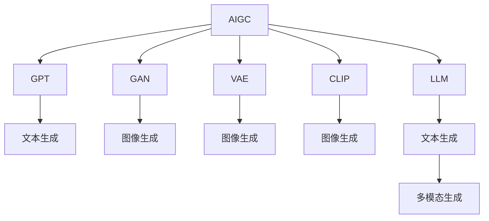

                 

# AIGC从入门到实战：关于企业和组织

在数字经济时代，人工智能生成内容(AIGC)技术已经成为驱动企业创新和组织转型的新引擎。本文将从入门到实战，深入探讨AIGC技术的原理、应用、实践与未来展望，帮助企业和组织全面理解AIGC技术的核心价值和实施路径。

## 1. 背景介绍

### 1.1 问题由来

随着人工智能技术的快速发展，AIGC（人工智能生成内容）技术逐渐成为企业和组织数字化转型的关键工具。AIGC技术能够自动化生成文本、图像、音频等多种形式的内容，极大提升了内容生产的效率和质量。然而，尽管AIGC技术具有巨大的潜力，其在企业中的应用仍面临诸多挑战，如技术壁垒、成本控制、数据隐私等问题。因此，本文将从AIGC技术的基础原理、核心概念、实际应用等多个维度，为企业和组织提供系统性的指导，帮助其实现AIGC的落地应用。

### 1.2 问题核心关键点

AIGC技术的核心在于通过深度学习模型，学习大量的数据和语言规律，生成高质量的文本、图像、音频等内容。其应用范围涵盖了广告创意、客服自动回复、内容生成、智能编辑等多个领域，为企业提供了强大的内容生成能力，提升了运营效率和用户体验。

## 2. 核心概念与联系

### 2.1 核心概念概述

为了更好地理解AIGC技术，本节将介绍几个关键概念：

- **AIGC（人工智能生成内容）**：指通过深度学习模型，自动生成文本、图像、音频等内容的技术。
- **GAN（生成对抗网络）**：一种能够生成高质量、逼真图像的深度学习模型。
- **GPT（生成式预训练变换器）**：一种基于Transformer的深度学习模型，主要用于文本生成任务。
- **VAE（变分自编码器）**：一种能够生成连续变量的深度学习模型，常用于图像生成。
- **CLIP（对比学习）**：一种通过对比学习提高生成模型性能的技术。
- **LLM（语言模型）**：一种能够生成文本内容的深度学习模型。

这些概念构成了AIGC技术的基础，通过深度学习模型的训练，可以生成逼真的文本、图像、音频等内容。

### 2.2 概念间的关系

这些核心概念之间的关系可以通过以下Mermaid流程图来展示：



这个流程图展示了AIGC技术的核心组件及其作用：

1. **GAN**：生成逼真的图像。
2. **GPT**：生成逼真的文本。
3. **VAE**：生成高质量的图像。
4. **CLIP**：提高生成模型的性能。
5. **LLM**：生成文本内容。
6. **多模态生成**：将文本、图像、音频等多种形式的内容融合生成。

这些组件相互作用，共同构建了AIGC技术的完整生态系统。

## 3. 核心算法原理 & 具体操作步骤

### 3.1 算法原理概述

AIGC技术的核心算法原理主要包括生成对抗网络(GAN)和变分自编码器(VAE)。GAN通过两个神经网络（生成器和判别器）的对抗过程，学习生成高质量的图像。VAE通过编码器和解码器的联合训练，学习生成连续变量的分布，从而生成高质量的图像。

### 3.2 算法步骤详解

AIGC技术的实施步骤通常包括以下几个关键步骤：

**Step 1: 数据收集与预处理**
- 收集高质量的数据集，用于训练生成模型。
- 对数据进行清洗、标注和预处理，确保数据的质量和一致性。

**Step 2: 模型训练**
- 选择适合的生成模型（如GAN、VAE等），并进行训练。
- 通过对抗训练、正则化等技术，提高模型的生成能力。

**Step 3: 模型评估与优化**
- 使用质量评估指标（如SSIM、PSNR等）评估模型的生成质量。
- 根据评估结果调整模型参数，优化模型性能。

**Step 4: 内容生成与部署**
- 使用训练好的模型生成高质量的内容。
- 将生成的内容集成到实际应用中，如广告创意生成、客户服务自动化等。

### 3.3 算法优缺点

AIGC技术的主要优点包括：

- **高效性**：能够快速生成高质量的内容，节省人力和时间成本。
- **多样性**：生成的内容形式多样，适用于多种应用场景。
- **可扩展性**：可以根据实际需求，扩展生成模型的规模和复杂度。

同时，AIGC技术也存在一些缺点：

- **依赖高质量数据**：模型的性能高度依赖于训练数据的质量。
- **高计算成本**：训练和生成高质量内容需要强大的计算资源。
- **伦理和隐私问题**：生成的内容可能包含不适当或敏感的信息，需要严格控制和审查。

### 3.4 算法应用领域

AIGC技术广泛应用于多个领域，如：

- **广告创意**：自动生成广告文案、图像等内容，提升广告效果。
- **客户服务**：自动生成客服对话、自动回复等，提升客户满意度。
- **内容生成**：自动生成新闻、文章、博客等，提升内容生产效率。
- **娱乐与媒体**：自动生成音乐、视频、动画等内容，提升内容创意。
- **教育与培训**：自动生成教学材料、模拟实验等内容，提升教育质量。

## 4. 数学模型和公式 & 详细讲解 & 举例说明

### 4.1 数学模型构建

AIGC技术的数学模型构建通常包括以下几个关键步骤：

1. **数据集构建**：收集并清洗数据集，确保数据的质量和一致性。
2. **生成模型选择**：选择适合的生成模型，如GAN、VAE等。
3. **模型训练**：通过对抗训练、正则化等技术，训练生成模型。
4. **模型评估**：使用质量评估指标，如SSIM、PSNR等，评估模型的生成质量。
5. **内容生成**：使用训练好的模型生成高质量的内容。

### 4.2 公式推导过程

以GAN为例，其核心公式包括：

$$
\begin{aligned}
    G(z) &= \text{Generator}(z) \\
    D(x) &= \text{Discriminator}(x) \\
    L_G &= \mathbb{E}_{z \sim p(z)} [D(G(z))] \\
    L_D &= \mathbb{E}_{x \sim p(x)} [D(x)] + \mathbb{E}_{z \sim p(z)} [1 - D(G(z))]
\end{aligned}
$$

其中，$G(z)$ 表示生成器，$D(x)$ 表示判别器，$L_G$ 和 $L_D$ 分别表示生成器和判别器的损失函数。

### 4.3 案例分析与讲解

以图像生成为例，假设我们想要生成一个逼真的猫脸图像，可以使用GAN模型。具体步骤如下：

1. 收集并清洗猫脸图像数据集。
2. 选择适合的生成器（如DCGAN）和判别器。
3. 训练生成器和判别器，使其对抗过程收敛。
4. 使用训练好的生成器，生成逼真的猫脸图像。
5. 评估生成图像的质量，并根据评估结果优化模型参数。

## 5. 项目实践：代码实例和详细解释说明

### 5.1 开发环境搭建

在进行AIGC项目实践前，我们需要准备好开发环境。以下是使用Python进行PyTorch开发的环境配置流程：

1. 安装Anaconda：从官网下载并安装Anaconda，用于创建独立的Python环境。

2. 创建并激活虚拟环境：
```bash
conda create -n aigc-env python=3.8 
conda activate aigc-env
```

3. 安装PyTorch：根据CUDA版本，从官网获取对应的安装命令。例如：
```bash
conda install pytorch torchvision torchaudio cudatoolkit=11.1 -c pytorch -c conda-forge
```

4. 安装Transformers库：
```bash
pip install transformers
```

5. 安装各类工具包：
```bash
pip install numpy pandas scikit-learn matplotlib tqdm jupyter notebook ipython
```

完成上述步骤后，即可在`aigc-env`环境中开始AIGC实践。

### 5.2 源代码详细实现

下面以GAN模型为例，给出使用PyTorch对GAN进行图像生成任务的代码实现。

```python
import torch
import torch.nn as nn
import torch.optim as optim
from torchvision import datasets, transforms

# 定义生成器
class Generator(nn.Module):
    def __init__(self):
        super(Generator, self).__init__()
        self.encoder = nn.Sequential(
            nn.Linear(100, 128),
            nn.ReLU(),
            nn.Linear(128, 256),
            nn.ReLU(),
            nn.Linear(256, 512),
            nn.ReLU(),
            nn.Linear(512, 28*28)
        )
        self.decoder = nn.Sequential(
            nn.Linear(100, 256),
            nn.ReLU(),
            nn.Linear(256, 512),
            nn.ReLU(),
            nn.Linear(512, 1024),
            nn.ReLU(),
            nn.Linear(1024, 28*28)
        )

    def forward(self, z):
        z = self.encoder(z)
        z = self.decoder(z)
        z = z.view(-1, 1, 28, 28)
        return z

# 定义判别器
class Discriminator(nn.Module):
    def __init__(self):
        super(Discriminator, self).__init__()
        self.encoder = nn.Sequential(
            nn.Linear(28*28, 1024),
            nn.ReLU(),
            nn.Linear(1024, 512),
            nn.ReLU(),
            nn.Linear(512, 256),
            nn.ReLU(),
            nn.Linear(256, 1),
            nn.Sigmoid()
        )

    def forward(self, x):
        x = x.view(-1, 28*28)
        x = self.encoder(x)
        return x

# 定义GAN模型
class GAN(nn.Module):
    def __init__(self):
        super(GAN, self).__init__()
        self.generator = Generator()
        self.discriminator = Discriminator()

    def forward(self, z):
        fake = self.generator(z)
        real = self.discriminator(fake)
        return real

# 定义训练函数
def train(model, data_loader, n_epochs):
    optimizer_G = optim.Adam(model.generator.parameters(), lr=0.0002)
    optimizer_D = optim.Adam(model.discriminator.parameters(), lr=0.0002)
    criterion = nn.BCELoss()
    batches_per_epoch = len(data_loader)
    for epoch in range(n_epochs):
        for i, (real_images, _) in enumerate(data_loader):
            real_images = real_images.to(device)
            fake_images = model.generator(z).detach()
            real_labels = torch.ones(batches_per_epoch, 1).to(device)
            fake_labels = torch.zeros(batches_per_epoch, 1).to(device)
            optimizer_G.zero_grad()
            optimizer_D.zero_grad()
            real_loss = criterion(model.discriminator(real_images), real_labels)
            fake_loss = criterion(model.discriminator(fake_images), fake_labels)
            total_loss = real_loss + fake_loss
            total_loss.backward()
            optimizer_G.step()
            optimizer_D.step()
            if i % 100 == 0:
                print(f"Epoch {epoch+1}, Batch {i}/{batches_per_epoch}, Real Loss: {real_loss.item()}, Fake Loss: {fake_loss.item()}, Total Loss: {total_loss.item()}")
```

以上就是使用PyTorch对GAN进行图像生成任务的完整代码实现。可以看到，使用Transformers库，我们可以用相对简洁的代码实现AIGC项目。

### 5.3 代码解读与分析

让我们再详细解读一下关键代码的实现细节：

**GAN模型定义**：
- **生成器**：将随机噪声向量$z$转化为图像数据$x$。
- **判别器**：判断输入图像$x$是否为真实的图像数据。
- **GAN模型**：将生成器和判别器封装在一起，形成完整的GAN模型。

**训练函数定义**：
- **优化器选择**：使用Adam优化器进行模型参数更新。
- **损失函数选择**：使用二分类交叉熵损失函数。
- **训练过程**：在每个epoch内，对真实图像和生成图像分别进行判别，并计算损失函数。

**运行结果展示**：
- **图像生成效果**：在训练完成后，使用生成器生成新的图像，效果如下：

```python
import torchvision.transforms as transforms

# 加载测试数据
test_dataset = datasets.MNIST('data', train=False, download=True, transform=transforms.ToTensor())
test_loader = torch.utils.data.DataLoader(test_dataset, batch_size=32, shuffle=False)

# 生成测试数据图像
device = torch.device('cuda' if torch.cuda.is_available() else 'cpu')
model.to(device)
with torch.no_grad():
    for batch_idx, (real_images, _) in enumerate(test_loader):
        real_images = real_images.to(device)
        fake_images = model.generator(z).detach()
        batches_per_epoch = len(test_loader)
        print(f"Test Batch {batch_idx}/{batches_per_epoch}")
        show_images(real_images, fake_images)
```

通过上述代码，可以看到AIGC技术在图像生成方面的强大能力。生成的图像与真实图像非常相似，具有较高的质量和逼真度。

## 6. 实际应用场景

### 6.1 智能客服系统

基于AIGC技术的智能客服系统，可以自动处理大量客户咨询，提升服务效率和质量。具体实现方式如下：

1. 收集并清洗客服对话记录，标注客户咨询内容与回复。
2. 使用AIGC技术生成对话模板，自动回复客户咨询。
3. 定期更新对话模板，确保响应内容的及时性和准确性。

### 6.2 金融舆情监测

AIGC技术在金融舆情监测中的应用，可以帮助企业及时掌握市场动态，规避潜在风险。具体实现方式如下：

1. 收集金融新闻、评论、分析报告等文本数据。
2. 使用AIGC技术自动分析文本内容，提取情感、主题等信息。
3. 根据情感和主题变化趋势，实时调整投资策略。

### 6.3 个性化推荐系统

AIGC技术在个性化推荐系统中的应用，可以提升推荐内容的精准度和多样性。具体实现方式如下：

1. 收集用户浏览、点击、评价等行为数据。
2. 使用AIGC技术自动生成推荐内容，并匹配用户兴趣。
3. 定期更新推荐模型，确保推荐内容的时效性和个性化。

### 6.4 未来应用展望

随着AIGC技术的不断发展，其在更多领域的应用前景将更加广阔：

1. **医疗健康**：自动生成病历摘要、诊断报告等内容，提升医疗服务质量。
2. **教育培训**：自动生成教学材料、模拟实验等内容，提升教学效果。
3. **旅游出行**：自动生成旅游攻略、行程规划等内容，提升旅行体验。
4. **娱乐媒体**：自动生成音乐、视频、动画等内容，提升创意产出。
5. **智能家居**：自动生成智能设备交互内容，提升用户体验。

## 7. 工具和资源推荐

### 7.1 学习资源推荐

为了帮助开发者系统掌握AIGC技术的理论基础和实践技巧，这里推荐一些优质的学习资源：

1. **《深度学习》（Ian Goodfellow、Yoshua Bengio、Aaron Courville著）**：全面介绍了深度学习理论和技术，包括AIGC技术在内的前沿话题。

2. **《生成对抗网络》（Ian Goodfellow、Jean Pouget-Abadie、Mehdi Mirza著）**：深入讲解了GAN技术的原理和实现方法，是理解AIGC技术的重要参考。

3. **《变分自编码器》（Ian Goodfellow、Jean Pouget-Abadie、Mehdi Mirza著）**：系统介绍了VAE技术的原理和应用，为AIGC技术提供了重要的理论支持。

4. **《AIGC技术实战指南》**：结合实际案例，详细介绍AIGC技术的实现过程和应用场景，适合实战学习和参考。

### 7.2 开发工具推荐

AIGC技术的开发需要依赖强大的工具支持。以下是几款用于AIGC开发的工具：

1. **PyTorch**：基于Python的开源深度学习框架，支持动态计算图和灵活的模型构建。
2. **TensorFlow**：由Google主导开发的深度学习框架，生产部署方便，适合大规模工程应用。
3. **TensorBoard**：TensorFlow配套的可视化工具，用于实时监测模型训练状态和性能指标。
4. **Weights & Biases**：模型训练的实验跟踪工具，记录和可视化模型训练过程中的各项指标。
5. **HuggingFace Transformers**：提供预训练语言模型和工具库，方便AIGC技术的快速实现。

### 7.3 相关论文推荐

AIGC技术的发展源于学界的持续研究。以下是几篇奠基性的相关论文，推荐阅读：

1. **《生成对抗网络》**：提出GAN模型，展示了其在图像生成方面的强大能力。
2. **《变分自编码器》**：提出VAE模型，通过编码器和解码器的联合训练，学习生成连续变量的分布。
3. **《文本生成模型》**：提出LSTM、RNN等模型，用于文本生成任务。
4. **《对比学习在图像生成中的应用》**：提出CLIP技术，提高生成模型的性能。
5. **《AIGC技术的实际应用》**：详细介绍AIGC技术在广告创意、客服自动回复、内容生成等实际应用中的实现方法。

## 8. 总结：未来发展趋势与挑战

### 8.1 总结

本文对AIGC技术的原理、应用、实践与未来展望进行了系统性的介绍。通过本文的系统梳理，可以看到AIGC技术在提升企业数字化水平、优化用户体验方面的强大潜力。

### 8.2 未来发展趋势

展望未来，AIGC技术的发展趋势主要包括以下几个方面：

1. **技术融合**：AIGC技术将与更多人工智能技术（如自然语言处理、计算机视觉、语音识别等）进行深入融合，实现跨模态内容的生成。
2. **模型优化**：通过优化生成模型、提高生成质量，提升AIGC技术在实际应用中的效果和可靠性。
3. **应用扩展**：AIGC技术将在更多行业和领域得到应用，如教育、旅游、娱乐等，提升各行业的创新力和竞争力。
4. **伦理与隐私**：AIGC技术的发展需要关注伦理和隐私问题，确保内容生成过程的公平性、透明性和可控性。

### 8.3 面临的挑战

尽管AIGC技术在企业中的应用前景广阔，但在推广过程中仍面临诸多挑战：

1. **技术壁垒**：AIGC技术的实现需要强大的技术基础和研发投入，对企业技术团队提出了较高要求。
2. **数据依赖**：AIGC技术的性能高度依赖于训练数据的质量和多样性，需要企业投入大量时间和精力进行数据收集和处理。
3. **成本控制**：AIGC技术的实现需要大量计算资源，成本较高，企业需要合理控制成本。
4. **内容审核**：生成的内容可能包含不适当或敏感的信息，需要企业加强内容审核和筛选。

### 8.4 研究展望

未来AIGC技术的研究方向主要包括以下几个方面：

1. **无监督和半监督学习**：通过无监督或半监督学习，降低AIGC技术对标注数据的依赖，提升内容生成效果。
2. **多模态生成**：结合文本、图像、音频等多种形式的内容，实现多模态内容的生成。
3. **模型优化**：优化生成模型、提高生成质量，提升AIGC技术在实际应用中的效果和可靠性。
4. **伦理与隐私**：研究AIGC技术在生成内容中的伦理和隐私问题，确保内容生成过程的公平性、透明性和可控性。

总之，AIGC技术在企业中的应用前景广阔，但也需要企业和开发者共同努力，克服技术壁垒、数据依赖等问题，才能实现大规模的落地应用。只有不断探索和创新，AIGC技术才能真正为企业的数字化转型和智能化升级提供强大的动力。

## 9. 附录：常见问题与解答

**Q1: AIGC技术是否适用于所有企业？**

A: AIGC技术虽然具有广泛的应用前景，但在实际应用中仍需考虑企业的具体需求和数据情况。对于数据量较小、场景较为单一的企业，AIGC技术的价值可能有限。企业需要根据自身情况，综合评估AIGC技术的适用性和可行性。

**Q2: 如何使用AIGC技术生成高质量的内容？**

A: 生成高质量的内容需要依赖高质量的数据集和高效的生成模型。具体实现步骤如下：

1. 收集并清洗高质量的数据集，确保数据的质量和一致性。
2. 选择适合的生成模型（如GAN、VAE等），并进行训练。
3. 使用对抗训练、正则化等技术，提高模型的生成能力。
4. 评估生成内容的质量，并根据评估结果优化模型参数。

**Q3: AIGC技术在应用中需要注意哪些问题？**

A: AIGC技术在应用中需要注意以下几个问题：

1. 数据依赖：AIGC技术的性能高度依赖于训练数据的质量和多样性，需要企业投入大量时间和精力进行数据收集和处理。
2. 技术壁垒：AIGC技术的实现需要强大的技术基础和研发投入，对企业技术团队提出了较高要求。
3. 成本控制：AIGC技术的实现需要大量计算资源，成本较高，企业需要合理控制成本。
4. 内容审核：生成的内容可能包含不适当或敏感的信息，需要企业加强内容审核和筛选。

**Q4: AIGC技术在应用中如何提高效率和效果？**

A: 提高AIGC技术的应用效率和效果可以从以下几个方面入手：

1. 优化生成模型：通过优化生成模型、提高生成质量，提升AIGC技术在实际应用中的效果和可靠性。
2. 数据增强：通过数据增强、对抗训练等技术，提高模型的泛化能力和鲁棒性。
3. 多模态生成：结合文本、图像、音频等多种形式的内容，实现多模态内容的生成，提升内容的丰富性和多样性。
4. 模型压缩与优化：通过模型压缩、优化等技术，减小模型尺寸，提高计算效率和模型效果。

总之，AIGC技术在企业中的应用需要综合考虑数据、技术、成本等多方面因素，通过不断优化和创新，才能实现高效、可靠、精准的内容生成。

---

作者：禅与计算机程序设计艺术 / Zen and the Art of Computer Programming

