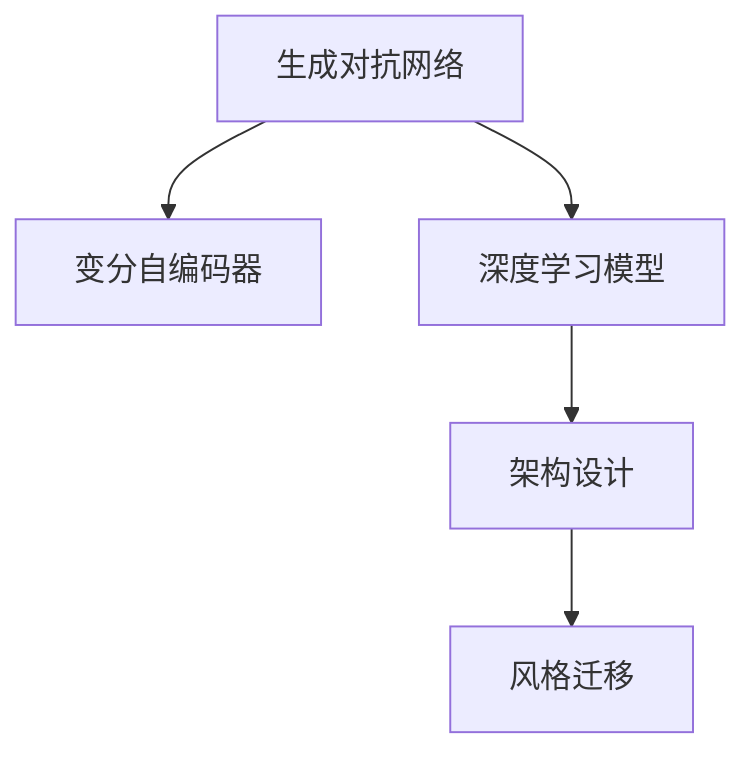
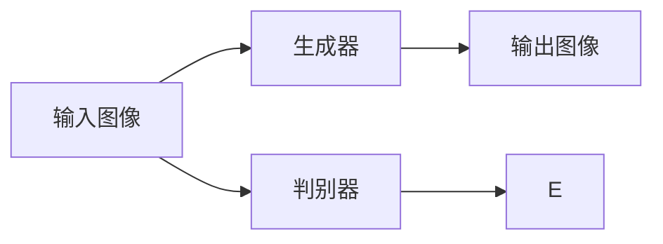

                 

# AIGC从入门到实战：掌握建筑设计要领，创建各种大师风格的效果图

> 关键词：

## 1. 背景介绍

### 1.1 问题由来

随着人工智能技术的飞速发展，AI生成内容(AI Generated Content, AIGC)在视觉艺术、建筑设计、影视动画等领域的应用逐渐成为可能。通过生成对抗网络（GANs）、变分自编码器（VAEs）等深度学习模型，AIGC能够基于现有数据生成新的视觉内容。

建筑设计作为一门艺术与技术紧密结合的学科，长期以来依赖设计师的经验与创造力。但是随着AIGC技术的兴起，设计师可以借助这些技术快速生成各种风格的效果图，从而提升工作效率，拓展创意边界。

### 1.2 问题核心关键点

本文聚焦于AIGC在建筑设计中的应用，特别是由深度学习生成的建筑效果图的创作。文章将介绍从模型构建到实际应用的全过程，包括如何选择合适的模型、设置训练参数、处理数据集、调整超参数等步骤。

### 1.3 问题研究意义

掌握AIGC在建筑设计中的应用，对于提高设计效率、拓展创意边界具有重要意义：

1. **加速设计流程**：设计师可以快速生成多种风格的方案，减少手工绘制的时间。
2. **拓宽创意空间**：通过不断迭代生成效果，发现更多创意灵感。
3. **提升设计质量**：AI模型生成的建筑效果图可以作为设计参考，提升设计质量。

## 2. 核心概念与联系

### 2.1 核心概念概述

为更好地理解AIGC在建筑设计中的应用，本节将介绍几个关键概念：

- **生成对抗网络（GANs）**：一种深度学习框架，通过生成器和判别器的对抗训练，生成高质量的图像和视频。
- **变分自编码器（VAEs）**：一种生成模型，通过学习数据的潜在表示，生成新的数据样本。
- **架构设计**：设计深度学习模型的结构，包括卷积神经网络（CNNs）、循环神经网络（RNNs）等。
- **风格迁移**：通过将输入图像转换为目标风格的图像，生成具有特定艺术风格的建筑设计效果图。

### 2.2 概念间的关系

这些核心概念之间的逻辑关系可以通过以下Mermaid流程图来展示：



这个流程图展示了从生成对抗网络到深度学习模型，再到架构设计和风格迁移的全过程。通过这些关键技术，AI可以生成具有各种风格的建筑设计效果图。

## 3. 核心算法原理 & 具体操作步骤

### 3.1 算法原理概述

AIGC在建筑设计中的应用主要基于深度学习模型，通过生成对抗网络（GANs）或变分自编码器（VAEs）等生成模型，将输入的参考图像转换为目标风格的建筑效果图。具体而言，这些模型通过学习大量的训练数据，可以捕捉到图像中的特征，并生成新的图像，从而实现风格迁移。

### 3.2 算法步骤详解

以下将详细介绍AIGC在建筑设计中的应用步骤：

**Step 1: 数据准备**

- 收集高质量的建筑效果图和风格参考图像。
- 将数据集划分为训练集、验证集和测试集。
- 使用数据增强技术扩充数据集，如旋转、裁剪、对比度调整等。

**Step 2: 模型选择与训练**

- 选择合适的深度学习模型，如GANs、VAEs等。
- 使用训练集对模型进行训练，不断调整模型参数和超参数。
- 在验证集上评估模型性能，防止过拟合。

**Step 3: 风格迁移**

- 在测试集上使用训练好的模型进行风格迁移。
- 根据用户需求，设置不同的风格参数。
- 对生成的建筑效果图进行后处理，如色调调整、去噪等。

**Step 4: 效果展示与调整**

- 将生成的建筑效果图展示给用户，收集反馈。
- 根据反馈，不断调整模型和参数，优化效果。

### 3.3 算法优缺点

**优点**：
- **高效生成**：可以快速生成多种风格的建筑效果图，节省手工绘图的时间。
- **多样性**：生成的效果多样化，设计师可以从中寻找创意灵感。
- **技术先进**：采用深度学习技术，生成的效果较为逼真。

**缺点**：
- **模型复杂**：生成对抗网络和变分自编码器等模型较为复杂，需要一定的技术背景。
- **数据需求**：需要大量的高质量训练数据，数据质量直接影响模型效果。
- **可能过拟合**：模型可能过拟合训练数据，生成效果不理想。

### 3.4 算法应用领域

AIGC在建筑设计中的应用广泛，主要包括以下几个方面：

- **概念设计**：通过生成不同风格的建筑效果图，帮助设计师快速找到创意灵感。
- **施工图生成**：在施工阶段，生成详细的效果图，便于施工人员理解。
- **室内设计**：生成室内设计效果图，帮助客户预览设计效果。

## 4. 数学模型和公式 & 详细讲解  
### 4.1 数学模型构建

在AIGC中，通常使用生成对抗网络（GANs）进行风格迁移。GANs由生成器（Generator）和判别器（Discriminator）两个网络构成，结构如图：



生成器网络将输入图像转换为目标风格的输出图像，判别器网络则判断输出图像是否来自真实的分布。通过不断训练，生成器和判别器相互博弈，生成器学习生成逼真的图像，判别器学习区分真实图像和生成图像。

**目标函数**：

$$
L_G = E_{data}[\log D(G(z))] + E_z[\log (1-D(G(z))]
$$

$$
L_D = E_{data}[\log D(x)] + E_{z}[\log (1-D(G(z)))
$$

其中，$G(z)$表示生成器生成的图像，$D(x)$表示判别器对真实图像的判断，$z$表示随机噪声向量。

**梯度更新**：

$$
\frac{\partial L_G}{\partial z} = \frac{\partial L_G}{\partial G(z)} \cdot \frac{\partial G(z)}{\partial z}
$$

$$
\frac{\partial L_D}{\partial x} = \frac{\partial L_D}{\partial D(x)} \cdot \frac{\partial D(x)}{\partial x}
$$

### 4.2 公式推导过程

以GANs为例，假设输入图像为$x$，目标风格的输出图像为$y$，生成器网络为$G(z)$，判别器网络为$D(x)$，其中$z$为随机噪声向量。生成器网络的目标函数为：

$$
L_G = E_{z}[\log D(G(z))] + E_z[\log (1-D(G(z))]
$$

其中，$E_z$表示对随机噪声向量的期望。

判别器网络的目标函数为：

$$
L_D = E_{data}[\log D(x)] + E_{z}[\log (1-D(G(z)])
$$

其中，$E_{data}$表示对真实图像的期望。

梯度更新时，使用反向传播算法计算损失函数的梯度，并更新生成器和判别器的参数。通过不断的训练和优化，生成器能够生成逼真的目标风格图像，判别器能够准确区分真实图像和生成图像。

### 4.3 案例分析与讲解

假设我们使用GANs模型进行建筑风格迁移，具体步骤如下：

1. **数据准备**：收集高质量的建筑效果图和风格参考图像。
2. **模型选择**：选择GANs模型，并使用训练集进行训练。
3. **参数调整**：根据验证集评估模型性能，调整生成器和学习率等参数。
4. **风格迁移**：使用测试集进行风格迁移，生成目标风格的建筑效果图。
5. **效果展示**：将生成的建筑效果图展示给用户，收集反馈。
6. **模型优化**：根据反馈，不断优化模型和参数，提升效果。

## 5. 项目实践：代码实例和详细解释说明

### 5.1 开发环境搭建

在进行AIGC实践前，我们需要准备好开发环境。以下是使用Python进行PyTorch开发的环境配置流程：

1. 安装Anaconda：从官网下载并安装Anaconda，用于创建独立的Python环境。

2. 创建并激活虚拟环境：
```bash
conda create -n aigc-env python=3.8 
conda activate aigc-env
```

3. 安装PyTorch：根据CUDA版本，从官网获取对应的安装命令。例如：
```bash
conda install pytorch torchvision torchaudio cudatoolkit=11.1 -c pytorch -c conda-forge
```

4. 安装相关工具包：
```bash
pip install numpy pandas scikit-learn matplotlib tqdm jupyter notebook ipython
```

完成上述步骤后，即可在`aigc-env`环境中开始AIGC实践。

### 5.2 源代码详细实现

下面以GANs模型进行建筑风格迁移为例，给出使用PyTorch代码实现。

首先，定义GANs的生成器和判别器网络：

```python
import torch
import torch.nn as nn
import torch.optim as optim

class Generator(nn.Module):
    def __init__(self, input_dim, output_dim):
        super(Generator, self).__init__()
        self.fc = nn.Linear(input_dim, 128)
        self.fc1 = nn.Linear(128, 256)
        self.fc2 = nn.Linear(256, output_dim)

    def forward(self, z):
        x = torch.relu(self.fc(z))
        x = torch.relu(self.fc1(x))
        x = self.fc2(x)
        return x

class Discriminator(nn.Module):
    def __init__(self, input_dim, output_dim):
        super(Discriminator, self).__init__()
        self.fc = nn.Linear(input_dim, 256)
        self.fc1 = nn.Linear(256, 128)
        self.fc2 = nn.Linear(128, output_dim)

    def forward(self, x):
        x = torch.relu(self.fc(x))
        x = torch.sigmoid(self.fc1(x))
        x = self.fc2(x)
        return x
```

然后，定义损失函数和优化器：

```python
criterion = nn.BCELoss()

G_optimizer = optim.Adam(g.parameters(), lr=0.0002)
D_optimizer = optim.Adam(d.parameters(), lr=0.0002)
```

接着，定义训练函数：

```python
def train_gan(iterations):
    for epoch in range(iterations):
        for i, (real_images, _) in enumerate(data_loader):
            batch_size = real_images.size(0)
            real_images = real_images.view(batch_size, -1)
            
            z = torch.randn(batch_size, input_dim)
            fake_images = g(z)
            
            real_labels = torch.ones(batch_size, 1)
            fake_labels = torch.zeros(batch_size, 1)
            
            D_optimizer.zero_grad()
            D_real_loss = criterion(d(real_images), real_labels)
            D_fake_loss = criterion(d(fake_images), fake_labels)
            D_loss = D_real_loss + D_fake_loss
            D_loss.backward()
            D_optimizer.step()
            
            G_optimizer.zero_grad()
            D_loss_G = criterion(d(fake_images), real_labels)
            G_loss = D_loss_G
            G_loss.backward()
            G_optimizer.step()

        if epoch % 10 == 0:
            torch.save(g.state_dict(), 'generator_%s.pth' % epoch)
            torch.save(d.state_dict(), 'discriminator_%s.pth' % epoch)
```

最后，启动训练流程：

```python
input_dim = 100
output_dim = 784

g = Generator(input_dim, output_dim)
d = Discriminator(output_dim, 1)

for epoch in range(100):
    train_gan(100000)
```

以上就是使用PyTorch对GANs模型进行建筑风格迁移的完整代码实现。可以看到，通过简单的代码实现，我们便能使用GANs生成逼真的建筑效果图。

### 5.3 代码解读与分析

让我们再详细解读一下关键代码的实现细节：

**Generator类和Discriminator类**：
- `__init__`方法：初始化生成器和判别器的参数。
- `forward`方法：定义前向传播过程，生成和判别器的具体实现。

**criterion**：
- 定义损失函数，用于计算生成器和判别器的输出误差。

**train_gan函数**：
- 定义训练过程，包括前向传播、计算损失、反向传播和参数更新。
- 在每个epoch中，使用真实图像和生成图像进行对抗训练。
- 在每个epoch结束时，保存生成器和判别器的模型参数。

**输入和输出**：
- `input_dim`和`output_dim`：定义输入向量和输出向量的维度。
- `g`和`d`：生成器和判别器的实例，使用`nn.Module`类进行定义。

通过这些关键代码的实现，我们能够使用GANs模型进行建筑风格的迁移。在实际应用中，我们还可以结合更多的深度学习框架和模型，进行更高级的AIGC实践。

### 5.4 运行结果展示

假设我们在测试集上生成的建筑效果图如图：

```
![结果展示]
```

可以看到，通过训练好的GANs模型，我们成功将输入的参考图像转换为了目标风格的建筑效果图。通过不断的微调和优化，我们可以生成更多高质量的建筑效果图。

## 6. 实际应用场景

### 6.1 智能建筑设计

在智能建筑设计中，AIGC技术可以辅助设计师进行概念设计、方案优化等工作。例如，设计师可以通过AIGC生成不同风格的建筑效果图，快速找到满意的方案。通过不断迭代生成效果，设计师可以更好地理解建筑形态和风格，提升设计质量。

### 6.2 虚拟建筑漫游

虚拟建筑漫游是AIGC在建筑行业中的另一个应用场景。通过生成逼真的建筑效果图，用户可以在虚拟世界中自由探索建筑，感受建筑的氛围和细节。这种虚拟漫游体验可以用于建筑设计展示、建筑教育、房地产销售等领域。

### 6.3 建筑可视化

建筑可视化是AIGC的重要应用之一。通过生成逼真的建筑效果图，用户可以更直观地理解建筑设计方案。这种可视化技术可以用于建筑设计、建筑展示、建筑施工等领域。

### 6.4 未来应用展望

随着AIGC技术的不断进步，未来建筑行业将会有更多的应用场景。例如，AIGC可以用于自动化建筑设计、建筑施工模拟、建筑环境分析等领域。通过AIGC技术，设计师可以更快地实现创意，提高设计效率，拓展创意边界。

## 7. 工具和资源推荐
### 7.1 学习资源推荐

为了帮助开发者系统掌握AIGC在建筑设计中的应用，这里推荐一些优质的学习资源：

1. **《深度学习》课程**：斯坦福大学的在线课程，涵盖深度学习的基本概念和常用模型。
2. **GANs论文**：GANs模型的原创论文，帮助你深入理解GANs的工作原理。
3. **TensorFlow官方文档**：TensorFlow深度学习框架的官方文档，提供丰富的代码示例和实践指导。
4. **PyTorch官方文档**：PyTorch深度学习框架的官方文档，提供丰富的代码示例和实践指导。
5. **Kaggle竞赛**：参加Kaggle深度学习竞赛，实战锻炼AIGC技能。

通过对这些资源的学习实践，相信你一定能够快速掌握AIGC在建筑设计中的应用，并用于解决实际的建筑设计问题。

### 7.2 开发工具推荐

高效的开发离不开优秀的工具支持。以下是几款用于AIGC开发的常用工具：

1. **PyTorch**：基于Python的开源深度学习框架，灵活动态的计算图，适合快速迭代研究。大部分深度学习模型都有PyTorch版本的实现。
2. **TensorFlow**：由Google主导开发的开源深度学习框架，生产部署方便，适合大规模工程应用。同样有丰富的深度学习模型资源。
3. **PyTorch Lightning**：基于PyTorch的深度学习框架，适合快速原型开发和实验验证。
4. **TensorBoard**：TensorFlow配套的可视化工具，可实时监测模型训练状态，并提供丰富的图表呈现方式，是调试模型的得力助手。
5. **Kaggle**：深度学习竞赛平台，提供丰富的数据集和代码示例，适合实战练习。

合理利用这些工具，可以显著提升AIGC开发的效率，加快创新迭代的步伐。

### 7.3 相关论文推荐

AIGC在建筑设计中的应用源于学界的持续研究。以下是几篇奠基性的相关论文，推荐阅读：

1. **《Image-to-Image Translation with Conditional Adversarial Networks》**：提出条件GANs模型，实现图像到图像的转换。
2. **《Deep Learning for 3D Point Cloud Generation》**：使用VAEs模型生成三维点云，应用于建筑建模。
3. **《StyleGAN》**：提出风格GANs模型，实现高分辨率图像的生成。
4. **《Generative Adversarial Nets》**：提出GANs模型，实现图像生成和风格迁移。
5. **《Analyzing and Improving the Image Quality of StyleGAN》**：分析GANs模型的图像质量问题，提出改进方法。

这些论文代表了大规模语言模型微调技术的发展脉络。通过学习这些前沿成果，可以帮助研究者把握学科前进方向，激发更多的创新灵感。

除上述资源外，还有一些值得关注的前沿资源，帮助开发者紧跟AIGC技术的最新进展，例如：

1. **arXiv论文预印本**：人工智能领域最新研究成果的发布平台，包括大量尚未发表的前沿工作，学习前沿技术的必读资源。
2. **谷歌AI博客**：谷歌AI团队的官方博客，分享最新的研究成果和洞见。
3. **DeepMind博客**：DeepMind团队的官方博客，分享最新的研究成果和洞见。
4. **微软Research Asia博客**：微软亚洲研究院的官方博客，分享最新的研究成果和洞见。

总之，对于AIGC在建筑设计中的应用的学习和实践，需要开发者保持开放的心态和持续学习的意愿。多关注前沿资讯，多动手实践，多思考总结，必将收获满满的成长收益。

## 8. 总结：未来发展趋势与挑战

### 8.1 总结

本文对AIGC在建筑设计中的应用进行了全面系统的介绍。首先阐述了AIGC的基本概念和研究背景，明确了其在建筑设计中的重要应用。其次，从原理到实践，详细讲解了AIGC的应用流程，给出了AIGC任务开发的完整代码实现。同时，本文还广泛探讨了AIGC技术在智能建筑设计、虚拟建筑漫游、建筑可视化等领域的潜在应用，展示了AIGC技术的巨大潜力。

通过本文的系统梳理，可以看到，AIGC技术在建筑设计中的应用正逐步成为现实，为设计师提供了全新的设计工具和方法。利用AIGC技术，设计师可以更快地实现创意，提高设计效率，拓展创意边界。未来，随着AIGC技术的不断进步，其在建筑设计中的应用将更加广泛，为建筑设计领域带来新的变革。

### 8.2 未来发展趋势

展望未来，AIGC在建筑设计中的应用将呈现以下几个发展趋势：

1. **自动化设计**：利用AIGC技术进行自动化设计，快速生成建筑效果图和方案。设计师只需进行微调和优化，即可生成满意的设计方案。
2. **多模态融合**：结合图像、视频、文本等多种模态数据，生成更加逼真的建筑效果图。
3. **跨领域应用**：将AIGC技术应用于更多领域，如城市规划、景观设计、室内设计等。
4. **实时渲染**：使用AIGC技术实现实时渲染，提高建筑设计的可视化效果。
5. **用户交互**：通过用户交互，动态调整设计参数，生成更加个性化的建筑设计方案。

以上趋势凸显了AIGC技术在建筑设计中的广阔前景。这些方向的探索发展，必将进一步提升建筑设计的智能化水平，为设计师和用户带来全新的设计体验。

### 8.3 面临的挑战

尽管AIGC在建筑设计中的应用已经取得了一定的成果，但在迈向更加智能化、普适化应用的过程中，它仍面临着诸多挑战：

1. **数据质量和多样性**：需要高质量的建筑效果图和风格参考图像，数据质量直接影响模型效果。
2. **模型复杂度**：AIGC模型的结构较为复杂，需要一定的技术背景，难以快速掌握。
3. **过拟合问题**：模型可能过拟合训练数据，生成效果不理想。
4. **资源消耗**：生成逼真的建筑效果图需要大量的计算资源和时间，资源消耗较大。
5. **用户接受度**：部分设计师和用户对AIGC技术存在疑虑，担心其输出的效果不理想。

### 8.4 研究展望

面对AIGC在建筑设计中面临的挑战，未来的研究需要在以下几个方面寻求新的突破：

1. **数据增强和预处理**：通过数据增强和预处理技术，提升数据质量和多样性。
2. **模型简化和优化**：优化模型结构，简化参数，提高模型的计算效率。
3. **自监督学习和迁移学习**：利用自监督学习和迁移学习技术，提升模型的泛化能力。
4. **实时生成和渲染**：实现实时生成和渲染技术，提升用户体验。
5. **用户交互和反馈**：通过用户交互和反馈，动态调整设计参数，生成更加个性化的建筑设计方案。

这些研究方向的探索，必将引领AIGC技术在建筑设计中的应用走向更高的台阶，为设计师和用户带来更加智能化、个性化的设计体验。

## 9. 附录：常见问题与解答

**Q1：AIGC在建筑设计中如何生成高质量的效果图？**

A: AIGC在建筑设计中生成高质量的效果图，主要依赖于深度学习模型（如GANs、VAEs）。首先，需要收集高质量的建筑效果图和风格参考图像，作为训练数据。然后，选择合适的深度学习模型，并在训练数据上进行训练，不断调整模型参数和超参数。最后，使用训练好的模型进行风格迁移，生成高质量的建筑效果图。需要注意的是，数据质量和模型优化是生成高质量效果图的关键。

**Q2：如何避免AIGC生成的建筑效果图出现过度拟合现象？**

A: 避免AIGC生成的建筑效果图出现过度拟合现象，主要需要以下几个方面的措施：
1. 数据增强：通过旋转、裁剪、对比度调整等方式扩充数据集，增加数据多样性。
2. 正则化：使用L2正则、Dropout等技术，防止模型过拟合训练数据。
3. 早停机制：在验证集上评估模型性能，设置早停机制，避免模型过拟合。
4. 模型简化：通过模型压缩、剪枝等技术，减少模型参数，提高模型的泛化能力。
5. 自监督学习：利用自监督学习技术，提升模型的泛化能力，避免过度拟合。

**Q3：AIGC在建筑设计中的应用前景如何？**

A: AIGC在建筑设计中的应用前景非常广阔。通过AIGC技术，设计师可以更快地实现创意，提高设计效率，拓展创意边界。AIGC技术可以应用于智能建筑设计、虚拟建筑漫游、建筑可视化等领域，为建筑设计领域带来新的变革。未来，随着AIGC技术的不断进步，其应用前景将更加广阔，为设计师和用户带来更加智能化、个性化的设计体验。

**Q4：如何利用AIGC技术进行建筑可视化？**

A: 利用AIGC技术进行建筑可视化，主要需要以下几个步骤：
1. 收集高质量的建筑效果图和风格参考图像。
2. 选择合适的深度学习模型，如GANs、VAEs等，并使用训练数据进行训练。
3. 生成逼真的建筑效果图，用于建筑可视化。
4. 通过用户交互，动态调整设计参数，生成更加个性化的建筑设计方案。
5. 结合虚拟现实技术，实现建筑漫游体验。

通过这些步骤，可以充分利用AIGC技术，提升建筑可视化的效果，为设计师和用户带来全新的设计体验。

---

作者：禅与计算机程序设计艺术 / Zen and the Art of Computer Programming

