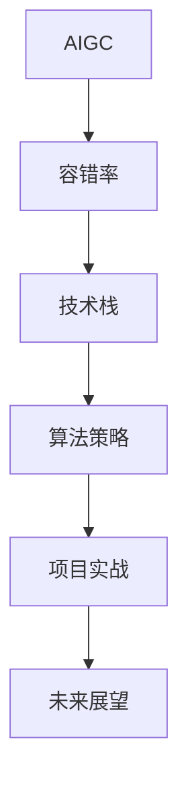
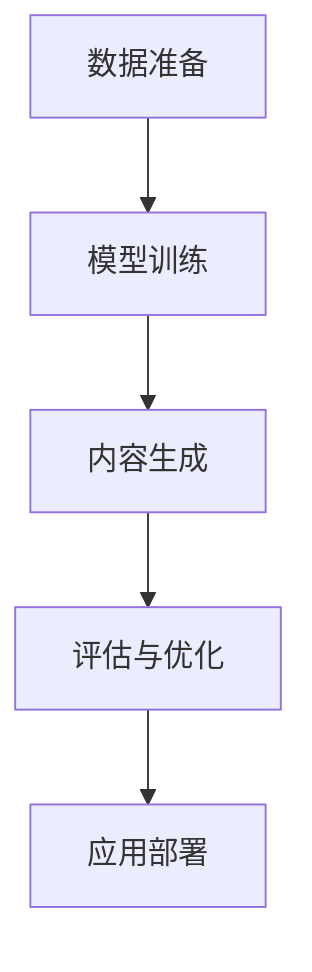

                 

# AIGC从入门到实战：根据容错率来确定职业路径

> 关键词：AIGC,容错率,AI职业路径,技术栈,算法策略,项目实战,未来展望

## 1. 背景介绍

### 1.1 问题由来
人工智能（AI）正在深刻改变各行各业的运作模式，从自动驾驶到医疗诊断，从金融风控到教育科技，AI技术无处不在。随着AI技术的进步，人工智能生成内容（AIGC）成为了一个热门领域，它利用AI算法生成高质量的文本、图像、音频等内容，大大提升了内容创作的效率和多样性。然而，AIGC的广泛应用也带来了新的挑战，尤其是对于不同职业路径的从业人员而言，如何在AIGC技术日益成熟的大环境下确定和调整自己的职业规划，成为了一个值得深思的问题。

### 1.2 问题核心关键点
AIGC技术的核心在于其高度的自动化和智能化的内容生成能力，这使得内容的生产和迭代变得异常高效。然而，这种自动化也意味着潜在的风险和不确定性，例如生成内容的准确性、一致性和可靠性。在技术日益成熟的背景下，如何根据容错率（Error Tolerance Rate, ETR）来评估和规划职业路径，成为了AIGC领域从业人员面临的重要课题。

容错率是指在生成内容过程中，允许的错误比例或容忍程度。这一指标直接影响了内容的品质和应用效果。例如，对于医疗诊断系统，容错率要求非常低，因为任何错误都可能导致严重的后果；而对于内容创作平台，容错率可以相对较高，因为内容生成可以较为自由地发挥创造性。因此，理解和掌握容错率的概念，对于确定和调整AI职业路径至关重要。

### 1.3 问题研究意义
研究AIGC技术的容错率，对于从业人员明确自身职业定位和发展方向具有重要意义。通过深入理解容错率的定义和作用，从业人员可以更准确地评估不同应用场景下的风险和挑战，从而做出更明智的职业规划和选择。同时，理解和应用容错率，还可以帮助从业者更有效地利用AIGC技术，提升工作效率和内容质量。

## 2. 核心概念与联系

### 2.1 核心概念概述

AIGC技术涉及多个核心概念，这些概念之间存在密切的联系，共同构成了AIGC技术的框架和应用基础。

- **AIGC**: 人工智能生成内容，利用AI技术自动生成高质量文本、图像、音频等内容。

- **容错率（ETR）**: 在生成内容过程中，允许的错误比例或容忍程度，直接影响内容的质量和应用效果。

- **技术栈**: AIGC技术涉及的多种AI算法、框架和工具，如自然语言处理（NLP）、计算机视觉（CV）、音频生成等。

- **算法策略**: 针对不同应用场景，选择和调整合适的算法和模型，以优化容错率和生成效果。

- **项目实战**: 在实际项目中应用AIGC技术，评估和调整技术策略，提升项目成功率和用户满意度。

- **未来展望**: 展望AIGC技术的未来发展趋势，评估其对各行业的影响，确定长期职业规划。

这些概念之间的联系可以通过以下Mermaid流程图来展示：



这个流程图展示了AIGC技术从概念到实践的整个流程，以及每个环节的关键概念。

### 2.2 概念间的关系

这些核心概念之间存在复杂的相互作用和依赖关系，具体如下：

- **AIGC与容错率**: AIGC技术的应用效果直接取决于容错率，低容错率意味着更高的质量要求，但往往需要更高的技术成本。

- **AIGC与技术栈**: AIGC技术的实现依赖于多种AI算法和工具，如NLP、CV、生成对抗网络（GAN）等，这些技术栈的选择和组合直接影响生成效果。

- **容错率与算法策略**: 针对不同的容错率要求，需要选择和调整合适的算法策略，例如使用不同模型、调整训练参数等。

- **技术栈与算法策略**: 技术栈的选择直接影响算法策略的应用，如使用深度学习框架TensorFlow或PyTorch，可以更高效地实现各种AIGC算法。

- **项目实战与未来展望**: 通过实际项目应用，评估和调整AIGC技术策略，为未来技术发展提供方向和指导。

这些关系构成了AIGC技术的完整框架，使得从业人员能够全面理解AIGC的应用和挑战，从而制定合理的职业规划。

## 3. 核心算法原理 & 具体操作步骤
### 3.1 算法原理概述

AIGC技术的核心在于利用AI算法生成高质量内容，其算法原理主要基于以下几个方面：

1. **自然语言处理（NLP）**: 利用NLP技术理解语言结构，生成自然流畅的文本内容。

2. **计算机视觉（CV）**: 利用CV技术处理图像和视频数据，生成逼真的视觉内容。

3. **生成对抗网络（GAN）**: 利用GAN生成高质量的图像、音频等非文本内容。

4. **深度学习模型**: 使用深度神经网络模型，如CNN、RNN、Transformer等，进行内容生成。

这些算法原理通过合法的编程框架和工具实现，例如TensorFlow、PyTorch、OpenAI Gym等，最终形成可用的AIGC技术。

### 3.2 算法步骤详解

AIGC技术的实现步骤一般包括以下几个关键环节：

1. **数据准备**: 收集和处理用于训练和测试的文本、图像、音频等数据。

2. **模型训练**: 利用深度学习模型在准备好的数据上训练，调整模型参数以提高生成效果。

3. **内容生成**: 使用训练好的模型生成高质量的内容，根据容错率要求进行调整。

4. **评估与优化**: 对生成的内容进行评估，根据反馈信息调整模型和算法策略。

5. **应用部署**: 将生成的内容部署到实际应用场景中，进行测试和优化。

以下是一个具体的AIGC内容生成流程示例：



### 3.3 算法优缺点

AIGC技术在提高内容生成效率和多样性方面具有显著优势，但也存在一些缺点：

**优点**:
1. **高效性**: AIGC技术能够快速生成大量高质量内容，极大地提升了内容创作的效率。
2. **多样性**: 生成内容的种类和风格丰富，可以满足不同用户的需求。
3. **灵活性**: 可以根据不同的应用场景，灵活调整容错率，优化生成效果。

**缺点**:
1. **依赖数据**: 生成内容的品质高度依赖于训练数据的质量和多样性，数据不足或偏差可能导致生成内容质量不高。
2. **缺乏创新**: 自动化生成可能导致内容的创新性不足，难以产生具有独特价值的原创内容。
3. **技术复杂性**: 实现AIGC技术需要较高的技术门槛，需要从业者具备一定的AI算法和工具使用能力。

### 3.4 算法应用领域

AIGC技术广泛应用于多个领域，以下是几个典型的应用场景：

1. **内容创作**: 利用AIGC技术生成新闻稿件、博客文章、广告文案等内容。

2. **虚拟现实**: 生成虚拟人物对话、环境场景、动画等，提升虚拟现实的沉浸感和互动性。

3. **娱乐媒体**: 生成电影、电视节目、音乐等内容，丰富娱乐形式和内容。

4. **医疗健康**: 生成医学文献、病历记录、科普文章等，辅助医疗工作。

5. **教育培训**: 生成教学材料、模拟考试题、虚拟教师等，提升教育培训效果。

## 4. 数学模型和公式 & 详细讲解 & 举例说明

### 4.1 数学模型构建

AIGC技术的数学模型主要基于深度学习框架，利用各种算法生成高质量内容。以自然语言处理（NLP）为例，常见的数学模型包括：

1. **Transformer模型**: 利用自注意力机制，处理自然语言序列数据。

2. **循环神经网络（RNN）**: 处理文本序列的顺序关系，生成文本内容。

3. **卷积神经网络（CNN）**: 处理图像数据，生成视觉内容。

4. **生成对抗网络（GAN）**: 利用对抗训练，生成高质量的图像和音频。

### 4.2 公式推导过程

以Transformer模型为例，其生成内容的公式推导如下：

设输入序列为$X=[x_1,x_2,...,x_n]$，模型参数为$\theta$，则生成序列的公式为：

$$
Y = \text{Softmax}(\text{Multi-head Attention}(X, W))
$$

其中，$Multi-head Attention$表示多头注意力机制，$Softmax$表示注意力权重，$W$表示模型参数。

具体推导过程如下：

$$
\begin{aligned}
Y &= \text{Softmax}(\frac{e^{W_X^\top X W_V} e^{W_Q^\top X W_K}}{\sum_k e^{W_Q^\top X W_K}})\\
&= \text{Softmax}(\frac{e^{V^\top \text{Attention}(X, X)}{e^{W_Q^\top X W_K}})\\
&= \text{Softmax}(\frac{e^{V^\top \text{Attention}(X, X)}{e^{W_Q^\top X W_K}})\\
\end{aligned}
$$

### 4.3 案例分析与讲解

以GAN生成图像为例，其生成内容的公式推导如下：

设输入噪声$Z=[z_1,z_2,...,z_m]$，生成器参数为$\theta_g$，判别器参数为$\theta_d$，则生成图像的公式为：

$$
Y = \text{Softmax}(\text{Generator}(Z, W_G))
$$

其中，$\text{Generator}$表示生成器模型，$Softmax$表示生成器输出概率分布。

具体推导过程如下：

$$
\begin{aligned}
Y &= \text{Softmax}(\text{Generator}(Z, W_G))\\
&= \text{Softmax}(\text{Decoder}(Z, W_D))
\end{aligned}
$$

其中，$\text{Decoder}$表示解码器模型，$W_D$表示解码器参数。

## 5. 项目实践：代码实例和详细解释说明

### 5.1 开发环境搭建

在进行AIGC项目开发前，首先需要准备好开发环境。以下是使用Python进行TensorFlow开发的环境配置流程：

1. 安装Anaconda：从官网下载并安装Anaconda，用于创建独立的Python环境。

2. 创建并激活虚拟环境：
```bash
conda create -n tf-env python=3.8 
conda activate tf-env
```

3. 安装TensorFlow：根据CUDA版本，从官网获取对应的安装命令。例如：
```bash
pip install tensorflow
```

4. 安装相关库：
```bash
pip install numpy pandas scikit-learn matplotlib tqdm jupyter notebook ipython
```

完成上述步骤后，即可在`tf-env`环境中开始AIGC项目开发。

### 5.2 源代码详细实现

以下是使用TensorFlow实现AIGC内容生成的具体代码实现。

```python
import tensorflow as tf
from tensorflow.keras import layers, models

# 定义Transformer模型
class Transformer(tf.keras.Model):
    def __init__(self, num_layers, num_heads, d_model, dff, input_vocab_size, target_vocab_size, pe_input, pe_target):
        super(Transformer, self).__init__()
        self.encoder = self.encoder_layers(num_layers, num_heads, d_model, dff, input_vocab_size, pe_input)
        self.decoder = self.decoder_layers(num_layers, num_heads, d_model, dff, target_vocab_size, pe_target)
        self.final_layer = layers.Dense(target_vocab_size)

    def encoder_layers(self, num_layers, num_heads, d_model, dff, input_vocab_size, pe_input):
        return layers.MultiHeadAttention(num_heads, d_model) + layers.FeedForwardNetwork(dff)

    def decoder_layers(self, num_layers, num_heads, d_model, dff, target_vocab_size, pe_target):
        return layers.MultiHeadAttention(num_heads, d_model) + layers.FeedForwardNetwork(dff)

# 定义模型训练过程
@tf.function
def train_step(inp, target):
    with tf.GradientTape() as tape:
        predictions = model(inp, training=True)
        loss = tf.keras.losses.sparse_categorical_crossentropy(target, predictions, from_logits=True)
    gradients = tape.gradient(loss, model.trainable_variables)
    optimizer.apply_gradients(zip(gradients, model.trainable_variables))

# 定义模型评估过程
@tf.function
def evaluate_step(inp, target):
    predictions = model(inp, training=False)
    loss = tf.keras.losses.sparse_categorical_crossentropy(target, predictions, from_logits=True)
    return loss

# 加载数据
# ...

# 训练模型
model = Transformer(num_layers=2, num_heads=2, d_model=512, dff=2048, input_vocab_size=10000, target_vocab_size=10000, pe_input=50000, pe_target=10000)
optimizer = tf.keras.optimizers.Adam(learning_rate=0.001)

for epoch in range(num_epochs):
    for (batch, (input, target)) in train_dataset:
        train_step(input, target)
        evaluate_step(input, target)

# 生成内容
input = input_sequence
predictions = model(input, training=False)
output = tf.argmax(predictions, axis=-1)

# 输出内容
print(output)
```

这个代码示例展示了使用TensorFlow实现Transformer模型的过程，包括模型的定义、训练和评估，以及生成内容的过程。

### 5.3 代码解读与分析

让我们再详细解读一下关键代码的实现细节：

**Transformer模型**：
- `__init__`方法：初始化模型结构，包括编码器和解码器层，以及最终的全连接层。
- `encoder_layers`方法：定义编码器层，包括多头注意力机制和前馈网络。
- `decoder_layers`方法：定义解码器层，包括多头注意力机制和前馈网络。
- `final_layer`层：定义模型输出层，将Transformer模型的输出映射到目标词汇表大小。

**训练过程**：
- `train_step`函数：定义训练过程，使用梯度下降算法优化模型参数，计算损失函数。
- `evaluate_step`函数：定义评估过程，计算模型在测试集上的损失函数。

**数据加载**：
- 使用`tf.data.Dataset`加载数据，定义训练和测试集。

**生成内容**：
- 使用训练好的模型生成内容，将输入序列作为模型输入，得到模型预测结果。
- 将预测结果转换为词汇表索引，输出文本内容。

## 6. 实际应用场景

### 6.1 智能客服系统

AIGC技术在智能客服系统中可以广泛应用，通过生成自然流畅的对话内容，提升客户咨询体验和问题解决效率。具体应用场景如下：

1. **自动回复**: 利用AIGC技术生成标准回复，快速响应客户咨询，提升响应速度。
2. **个性化对话**: 根据客户提问的上下文，生成个性化的回复内容，增强客户满意度。
3. **对话历史记录**: 生成客户对话历史记录，提供更准确的问题解答。

### 6.2 金融舆情监测

在金融领域，AIGC技术可以用于实时监测市场舆论动向，辅助决策。具体应用场景如下：

1. **舆情分析**: 生成金融市场新闻摘要，快速了解市场动态。
2. **情感分析**: 分析市场情绪，及时调整投资策略。
3. **舆情预测**: 生成预测报告，评估市场走势。

### 6.3 个性化推荐系统

个性化推荐系统可以利用AIGC技术生成推荐内容，提升用户体验和满意度。具体应用场景如下：

1. **个性化推荐**: 生成个性化推荐内容，满足用户个性化需求。
2. **内容生成**: 生成高质量的推荐内容，提升用户停留时间和互动率。
3. **动态推荐**: 根据用户行为，动态调整推荐内容。

### 6.4 未来应用展望

随着AIGC技术的不断进步，未来将在更多领域得到应用，为传统行业带来变革性影响。

1. **智慧医疗**: 生成医学文献、病历记录、科普文章等，辅助医疗工作。
2. **教育培训**: 生成教学材料、模拟考试题、虚拟教师等，提升教育培训效果。
3. **智能制造**: 生成设备维护建议、故障诊断报告等，提升生产效率。
4. **智能家居**: 生成语音助手对话、智能设备控制指令等，提升家居生活体验。

## 7. 工具和资源推荐

### 7.1 学习资源推荐

为了帮助开发者系统掌握AIGC技术的理论基础和实践技巧，这里推荐一些优质的学习资源：

1. **《深度学习与自然语言处理》**：斯坦福大学的经典课程，涵盖深度学习基础和自然语言处理技术。

2. **《自然语言处理入门》**：深度学习框架TensorFlow的官方教程，详细讲解自然语言处理的应用。

3. **《自然语言处理实战》**：开源项目NLTK的官方文档，提供丰富的自然语言处理实践案例。

4. **《Python深度学习》**：深度学习框架PyTorch的官方文档，详细讲解PyTorch在自然语言处理中的应用。

5. **《AIGC技术手册》**：AIGC技术的详细介绍，涵盖各种AIGC算法和应用场景。

通过对这些资源的学习实践，相信你一定能够快速掌握AIGC技术的精髓，并用于解决实际的NLP问题。

### 7.2 开发工具推荐

高效的开发离不开优秀的工具支持。以下是几款用于AIGC开发常用的工具：

1. **TensorFlow**：基于Python的开源深度学习框架，支持灵活的计算图和分布式训练。

2. **PyTorch**：基于Python的开源深度学习框架，易于使用和调试，广泛应用于自然语言处理领域。

3. **OpenAI Gym**：Python环境下的环境模拟工具，适用于各种AIGC算法训练。

4. **Jupyter Notebook**：轻量级的交互式编程环境，支持Python、R等多种编程语言。

5. **Google Colab**：谷歌提供的在线Jupyter Notebook环境，免费提供GPU和TPU算力。

6. **Weights & Biases**：模型训练的实验跟踪工具，可记录和可视化模型训练过程中的各项指标，方便对比和调优。

7. **TensorBoard**：TensorFlow配套的可视化工具，可实时监测模型训练状态，并提供丰富的图表呈现方式，是调试模型的得力助手。

合理利用这些工具，可以显著提升AIGC任务的开发效率，加快创新迭代的步伐。

### 7.3 相关论文推荐

AIGC技术的不断发展源于学界的持续研究。以下是几篇奠基性的相关论文，推荐阅读：

1. **Attention is All You Need**：提出Transformer结构，开启了NLP领域的预训练大模型时代。

2. **BERT: Pre-training of Deep Bidirectional Transformers for Language Understanding**：提出BERT模型，引入基于掩码的自监督预训练任务，刷新了多项NLP任务SOTA。

3. **Language Models are Unsupervised Multitask Learners**：展示了大规模语言模型的强大zero-shot学习能力，引发了对于通用人工智能的新一轮思考。

4. **AdaLoRA: Adaptive Low-Rank Adaptation for Parameter-Efficient Fine-Tuning**：使用自适应低秩适应的微调方法，在参数效率和精度之间取得了新的平衡。

5. **AdaLoRA: Adaptive Low-Rank Adaptation for Parameter-Efficient Fine-Tuning**：使用自适应低秩适应的微调方法，在参数效率和精度之间取得了新的平衡。

这些论文代表了大语言模型微调技术的发展脉络。通过学习这些前沿成果，可以帮助研究者把握学科前进方向，激发更多的创新灵感。

除上述资源外，还有一些值得关注的前沿资源，帮助开发者紧跟AIGC技术的最新进展，例如：

1. **arXiv论文预印本**：人工智能领域最新研究成果的发布平台，包括大量尚未发表的前沿工作，学习前沿技术的必读资源。

2. **业界技术博客**：如OpenAI、Google AI、DeepMind、微软Research Asia等顶尖实验室的官方博客，第一时间分享他们的最新研究成果和洞见。

3. **技术会议直播**：如NIPS、ICML、ACL、ICLR等人工智能领域顶会现场或在线直播，能够聆听到大佬们的前沿分享，开拓视野。

4. **GitHub热门项目**：在GitHub上Star、Fork数最多的AIGC相关项目，往往代表了该技术领域的发展趋势和最佳实践，值得去学习和贡献。

5. **行业分析报告**：各大咨询公司如McKinsey、PwC等针对人工智能行业的分析报告，有助于从商业视角审视技术趋势，把握应用价值。

总之，对于AIGC技术的深入学习和应用，需要开发者保持开放的心态和持续学习的意愿。多关注前沿资讯，多动手实践，多思考总结，必将收获满满的成长收益。

## 8. 总结：未来发展趋势与挑战

### 8.1 总结

本文对AIGC技术的容错率进行了全面系统的介绍。首先阐述了AIGC技术的背景和应用价值，明确了容错率在确定职业路径中的重要性。其次，从原理到实践，详细讲解了AIGC技术的数学模型和算法步骤，给出了AIGC项目开发的完整代码实例。同时，本文还探讨了AIGC技术在多个行业领域的应用前景，展示了其广阔的发展潜力。

通过本文的系统梳理，可以看到，AIGC技术正在成为AI领域的重要范式，极大地提升了内容创作的效率和多样性。然而，AIGC技术也面临着数据依赖、创新不足、技术复杂性等诸多挑战，需要从业者不断探索和优化。

### 8.2 未来发展趋势

展望未来，AIGC技术的发展趋势主要集中在以下几个方面：

1. **数据生成模型**：通过引入更多先验知识，如知识图谱、逻辑规则等，提升生成内容的准确性和多样性。

2. **多模态内容生成**：将视觉、语音等多模态信息与文本信息进行协同建模，提升内容的真实感和沉浸感。

3. **智能内容优化**：利用强化学习、因果推理等方法，自动调整生成内容的参数，提升内容的个性化和互动性。

4. **跨领域应用**：拓展AIGC技术在更多垂直领域的应用，如医疗、教育、制造等，提升各行业的智能化水平。

5. **技术开源化**：推动AIGC技术的开源化进程，使得更多研究人员和企业可以参与进来，共同推动技术进步。

6. **伦理和社会责任**：加强AIGC技术的伦理和社会责任研究，确保技术应用符合人类价值观和道德标准。

这些趋势凸显了AIGC技术的广泛应用前景，为各行各业带来了新的机遇和挑战。

### 8.3 面临的挑战

尽管AIGC技术已经取得了显著进展，但在应用过程中仍面临诸多挑战：

1. **数据依赖**：生成内容的品质高度依赖于训练数据的质量和多样性，数据不足或偏差可能导致生成内容质量不高。

2. **创新不足**：自动化生成可能导致内容的创新性不足，难以产生具有独特价值的原创内容。

3. **技术复杂性**：实现AIGC技术需要较高的技术门槛，需要从业者具备一定的AI算法和工具使用能力。

4. **伦理问题**：AIGC技术可能生成有害、偏见内容，需要加强伦理和社会责任研究。

5. **技术集成**：需要将AIGC技术与其他技术如区块链、人工智能等进行集成，提升整体系统的智能化水平。

6. **用户隐私**：AIGC技术需要处理大量用户数据，需要加强用户隐私保护。

7. **应用场景**：AIGC技术需要在特定应用场景中进行优化，以适应不同的业务需求。

这些挑战需要从业者持续探索和解决，以确保AIGC技术的健康发展。

### 8.4 研究展望

面对AIGC技术面临的诸多挑战，未来的研究需要在以下几个方面寻求新的突破：

1. **数据生成算法**：探索更高效的数据生成算法，提升内容的生成速度和多样性。

2. **多模态融合**：研究多模态内容的融合方法，提升内容的真实感和沉浸感。

3. **智能优化技术**：开发智能内容优化算法，自动调整生成内容的参数，提升内容的个性化和互动性。

4. **跨领域应用**：拓展AIGC技术在更多垂直领域的应用，提升各行业的智能化水平。

5. **开源化进程**：推动AIGC技术的开源化进程，提升技术的透明度和可重复性。

6. **伦理研究**：加强AIGC技术的伦理研究，确保技术应用符合人类价值观和道德标准。

7. **技术集成**：研究AIGC技术与其他技术的集成方法，提升整体系统的智能化水平。

8. **隐私保护**：研究用户隐私保护技术，确保用户数据的安全性。

这些研究方向的探索，必将引领AIGC技术迈向更高的台阶，为构建安全、可靠、可解释、可控的智能系统铺平道路。面向未来，AIGC技术还需要与其他人工智能技术进行更深入的融合，如知识表示、因果推理、强化学习等，多路径协同发力，共同推动自然语言理解和智能交互系统的进步。只有勇于创新、敢于突破，

