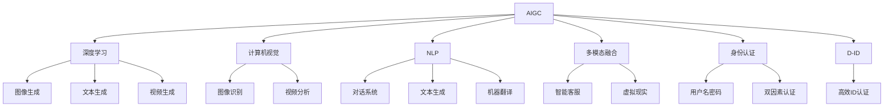
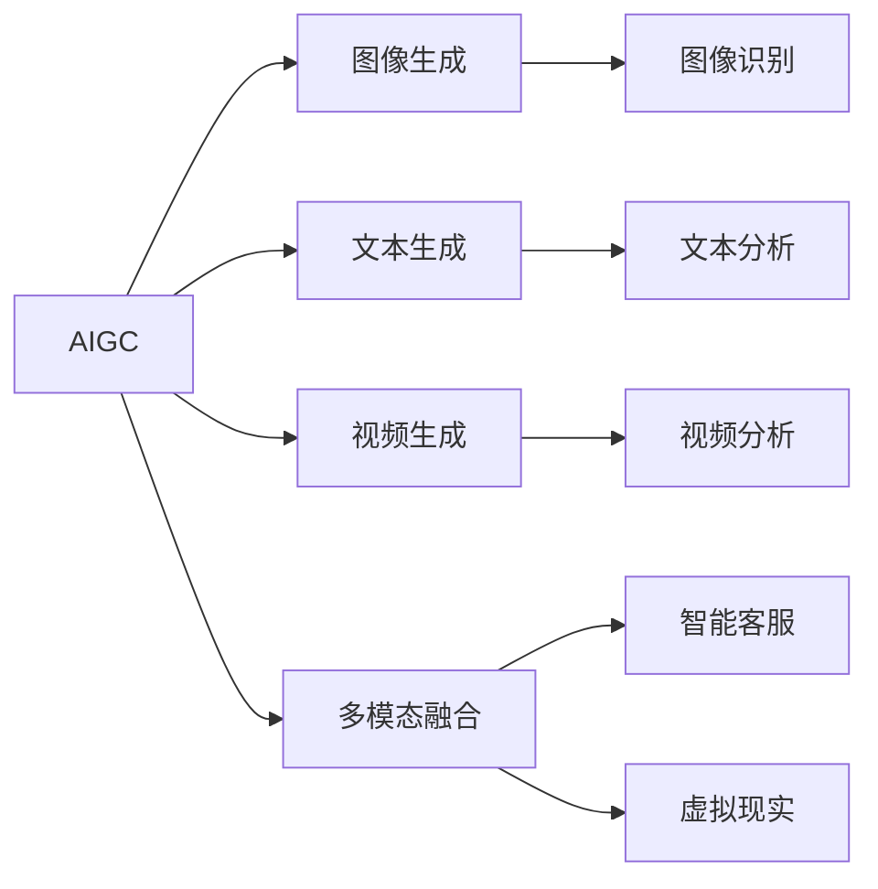
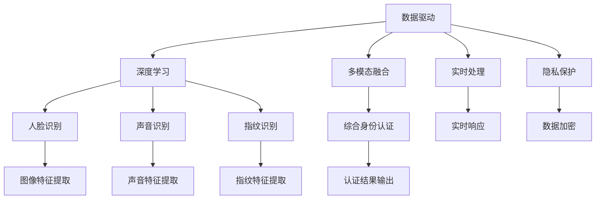

                 

# AIGC从入门到实战：登录 D-ID

> 关键词：AIGC, D-ID, 自然语言处理(NLP), 人工智能生成内容(AIGC), 身份认证(ID), 深度学习, 图像处理, 多模态融合, 实时处理

## 1. 背景介绍

### 1.1 问题由来
人工智能生成内容(AIGC)正迅速崛起，成为未来科技发展的关键驱动力之一。AIGC涵盖了自然语言处理(NLP)、计算机视觉、音频处理等多个领域，能够自主生成具有人类创造性思维的文字、图像、视频等内容。这一技术不仅对内容创作领域产生深远影响，还通过多模态融合，进一步推动了人工智能在多个垂直领域的应用。

然而，在AIGC蓬勃发展的背景下，身份认证(ID)问题变得愈发重要。无论是生成式对话系统、虚拟主播、智能客服，还是虚拟现实等场景，用户登录、身份验证等环节都是必不可少的。但传统的身份验证机制，如用户名和密码，往往存在诸多安全性和用户体验问题。如何将AIGC技术应用于身份认证，成为当前科技界的重要研究方向。

### 1.2 问题核心关键点
D-ID（Deep ID）作为近年来提出的新型身份认证技术，是AIGC在ID验证中的典型应用。D-ID通过深度学习和多模态融合，利用人脸、声音、指纹等多种生物特征，实现更高效、更安全的身份认证。其核心在于：

- **数据驱动**：通过大数据和深度学习模型训练，提升身份验证的准确性和鲁棒性。
- **多模态融合**：结合多种生物特征信息，构建更加完善的身份识别系统。
- **实时处理**：能够快速响应用户请求，实时完成身份验证。
- **隐私保护**：在保障身份验证安全的同时，保护用户隐私信息不被泄露。

## 2. 核心概念与联系

### 2.1 核心概念概述

为更好地理解D-ID技术，本节将介绍几个密切相关的核心概念：

- **人工智能生成内容(AIGC)**：包括文本生成、图像生成、视频生成等多种形式。AIGC利用深度学习和大数据技术，模仿人类的创造性思维，生成逼真、富有创意的内容。

- **深度学习**：一种基于多层神经网络的机器学习技术，通过反向传播算法不断优化模型参数，使得模型能够学习并提取数据中的高级特征。

- **计算机视觉**：研究如何让计算机“看”、“理解”、“思考”图像和视频。计算机视觉技术在图像生成、图像识别、视频分析等领域有广泛应用。

- **自然语言处理(NLP)**：研究如何让计算机“理解”、“生成”、“推理”自然语言。NLP技术在对话系统、文本生成、机器翻译等方面有重要应用。

- **多模态融合**：将多种数据源（如文本、图像、声音等）整合在一起，实现更加全面、精确的推理和理解。多模态融合技术在智能客服、虚拟现实等领域有广泛应用。

- **身份认证(ID)**：验证用户身份的真实性，确保系统的安全性和用户的隐私性。传统ID技术主要包括用户名密码、双因素认证等，但存在诸多问题。

- **D-ID (Deep ID)**：利用深度学习和多模态融合技术，实现高效的ID认证。D-ID技术在多个领域有广泛应用，如智能客服、虚拟主播、安全监控等。

这些核心概念之间的逻辑关系可以通过以下Mermaid流程图来展示：



这个流程图展示了大规模AIGC技术的核心概念及其之间的关联：

1. AIGC技术通过深度学习、计算机视觉和自然语言处理，生成高质量的内容。
2. 多模态融合技术将图像、文本、声音等多种数据源整合在一起，提升内容生成和理解能力。
3. 身份认证技术通过D-ID等新型方法，提升用户验证的效率和安全性。

### 2.2 概念间的关系

这些核心概念之间存在着紧密的联系，形成了AIGC和ID认证的完整生态系统。下面我们通过几个Mermaid流程图来展示这些概念之间的关系。

#### 2.2.1 AIGC的多样化应用



这个流程图展示了AIGC技术的多种应用方式。图像生成、文本生成、视频生成等技术可以通过多模态融合，应用于智能客服、虚拟现实等场景，提升用户体验和系统智能化水平。

#### 2.2.2 D-ID的核心技术



这个流程图展示了D-ID技术的关键组成。数据驱动、深度学习、多模态融合、实时处理和隐私保护等核心技术，共同构建了高效的ID认证系统。

## 3. 核心算法原理 & 具体操作步骤

### 3.1 算法原理概述

D-ID的核心算法原理，是通过多模态特征融合和深度学习模型，实现对用户身份的高效验证。具体流程如下：

1. **特征提取**：通过计算机视觉、声音处理和指纹识别等技术，提取用户的多模态特征。
2. **特征融合**：将提取的多模态特征融合在一起，形成综合的身份特征。
3. **深度学习**：利用深度学习模型（如卷积神经网络、循环神经网络等）对综合特征进行训练，学习用户的身份表示。
4. **身份验证**：在新用户登录时，提取其多模态特征，并通过训练好的深度学习模型进行验证。
5. **实时处理**：实时响应用户的登录请求，验证通过后允许登录。

### 3.2 算法步骤详解

以下，我们将详细介绍D-ID的每个步骤的具体实现。

**Step 1: 数据准备**

- **数据收集**：收集不同场景下的用户身份数据，如人脸图像、声音样本、指纹图像等。数据应包含正样本（即用户的真实身份信息）和负样本（即伪造的、欺骗性的身份信息）。
- **数据预处理**：对数据进行去噪、归一化、增强等预处理操作，以提升特征提取的准确性。

**Step 2: 特征提取**

- **计算机视觉**：利用深度学习模型（如卷积神经网络）对用户的面部图像进行特征提取，生成面部特征向量。
- **声音处理**：利用卷积神经网络对用户的语音样本进行特征提取，生成语音特征向量。
- **指纹识别**：利用深度学习模型对用户的指纹图像进行特征提取，生成指纹特征向量。

**Step 3: 特征融合**

- **特征拼接**：将上述三类特征向量拼接在一起，形成综合的身份特征向量。
- **归一化**：对拼接后的特征向量进行归一化操作，以提升后续深度学习的训练效果。

**Step 4: 深度学习模型训练**

- **模型选择**：选择合适的深度学习模型（如卷积神经网络、循环神经网络等）进行训练。
- **训练过程**：使用正负样本数据对模型进行训练，通过反向传播算法优化模型参数。
- **验证集验证**：在验证集上评估模型性能，调整模型参数以避免过拟合。

**Step 5: 身份验证**

- **特征提取**：对新用户的面部图像、语音样本和指纹图像进行特征提取。
- **特征融合**：将提取的多模态特征进行拼接和归一化操作。
- **模型验证**：使用训练好的深度学习模型对新用户的综合特征进行验证。
- **结果输出**：根据模型输出结果，判断新用户是否通过身份验证。

**Step 6: 实时处理**

- **实时响应**：在用户登录时，实时提取其多模态特征，并通过深度学习模型进行验证。
- **结果反馈**：验证通过后允许用户登录，否则提示验证失败。

### 3.3 算法优缺点

**优点：**

- **高效性**：通过多模态融合和深度学习，可以实现高效的ID验证，响应速度快。
- **鲁棒性**：结合多种生物特征，提升身份验证的鲁棒性和准确性，对噪声、欺骗攻击等有较好的抗干扰能力。
- **安全性**：通过多模态融合和隐私保护技术，可以有效保护用户隐私信息，防止数据泄露。

**缺点：**

- **计算成本高**：由于需要处理多种生物特征，计算复杂度较高，对硬件和算法的要求也较高。
- **数据依赖性强**：模型训练和验证需要大量的高质量数据，数据获取和处理成本较高。
- **模型泛化能力有限**：模型训练数据的分布可能与实际应用场景有差异，泛化能力有限。

### 3.4 算法应用领域

D-ID技术已经在多个领域得到了广泛应用，例如：

- **智能客服系统**：通过多模态融合技术，实现用户的快速识别和验证，提升客服系统的智能化水平。
- **虚拟主播**：利用D-ID技术，确保虚拟主播的身份安全，防止恶意替换和攻击。
- **安全监控系统**：对进入特定区域的车辆、人员进行实时身份验证，防止非法入侵。
- **虚拟现实**：通过D-ID技术，验证用户的身份，实现安全的虚拟现实体验。

除了上述这些场景，D-ID技术还广泛应用于金融、医疗、教育等领域，为这些行业的数字化转型提供技术支持。

## 4. 数学模型和公式 & 详细讲解

### 4.1 数学模型构建

D-ID的数学模型构建涉及多个环节，包括特征提取、特征融合和深度学习模型训练。以下是每个环节的详细数学模型构建：

**特征提取：**

对于计算机视觉特征提取，常用的模型有VGG、ResNet等。假设提取的面部特征向量为 $\mathbf{f}^{\text{face}} \in \mathbb{R}^d$，其中 $d$ 为特征向量的维度。

对于声音处理，常用的模型有MFCC、Tacotron等。假设提取的语音特征向量为 $\mathbf{f}^{\text{audio}} \in \mathbb{R}^d$。

对于指纹识别，常用的模型有CNN等。假设提取的指纹特征向量为 $\mathbf{f}^{\text{finger}} \in \mathbb{R}^d$。

**特征融合：**

将上述三种特征向量拼接起来，形成综合特征向量 $\mathbf{f}^{\text{comb}} \in \mathbb{R}^{3d}$。

**深度学习模型训练：**

假设使用的深度学习模型为 $\mathbf{F}$，其输出为身份验证结果的概率分布 $p(y|x)$，其中 $y$ 表示验证结果，$x$ 表示综合特征向量 $\mathbf{f}^{\text{comb}}$。模型训练的损失函数为交叉熵损失函数：

$$
\mathcal{L} = -\frac{1}{N}\sum_{i=1}^N \log p(y_i|\mathbf{f}_i^{\text{comb}})
$$

其中 $N$ 为样本总数，$y_i \in \{0,1\}$ 表示样本的真实身份验证结果。

### 4.2 公式推导过程

以下是深度学习模型训练的具体公式推导过程：

假设使用的深度学习模型为 $\mathbf{F} = \{\mathbf{W}, \mathbf{b}\}$，其中 $\mathbf{W}$ 为权重矩阵，$\mathbf{b}$ 为偏置向量。假设模型对输入特征 $\mathbf{f}^{\text{comb}}$ 的输出为 $\mathbf{z} \in \mathbb{R}^{h}$，其中 $h$ 为隐藏层神经元数目。输出层对 $\mathbf{z}$ 的输出为 $s \in \mathbb{R}^1$，模型的输出层为sigmoid函数，表示身份验证结果的概率：

$$
p(y|\mathbf{f}^{\text{comb}}) = \sigma(\mathbf{W}s + \mathbf{b})
$$

其中 $\sigma$ 为sigmoid函数，$\sigma(x) = \frac{1}{1 + e^{-x}}$。

模型的参数更新公式为：

$$
\mathbf{W} \leftarrow \mathbf{W} - \eta\nabla_{\mathbf{W}} \mathcal{L}, \quad \mathbf{b} \leftarrow \mathbf{b} - \eta\nabla_{\mathbf{b}} \mathcal{L}
$$

其中 $\eta$ 为学习率。

**梯度计算**：

$$
\nabla_{\mathbf{W}} \mathcal{L} = \frac{\partial \mathcal{L}}{\partial \mathbf{z}} \cdot \frac{\partial \mathbf{z}}{\partial \mathbf{W}}
$$

$$
\nabla_{\mathbf{b}} \mathcal{L} = \frac{\partial \mathcal{L}}{\partial \mathbf{z}} \cdot \frac{\partial \mathbf{z}}{\partial \mathbf{b}}
$$

其中 $\frac{\partial \mathcal{L}}{\partial \mathbf{z}}$ 可通过反向传播算法计算得到。

**梯度更新**：

通过反向传播算法计算出每个参数的梯度后，模型参数更新公式为：

$$
\mathbf{W} \leftarrow \mathbf{W} - \eta \cdot \nabla_{\mathbf{W}} \mathcal{L}, \quad \mathbf{b} \leftarrow \mathbf{b} - \eta \cdot \nabla_{\mathbf{b}} \mathcal{L}
$$

### 4.3 案例分析与讲解

为了更好地理解D-ID技术的数学模型和推导过程，我们以智能客服系统的身份验证为例，进行详细讲解。

假设一个智能客服系统，用户通过语音输入进行身份验证。系统的输入为用户的语音样本 $\mathbf{f}^{\text{audio}}$，系统对语音样本进行MFCC特征提取，生成特征向量 $\mathbf{f}^{\text{audio}}$。

系统将语音特征向量 $\mathbf{f}^{\text{audio}}$ 输入到深度学习模型 $\mathbf{F}$，模型输出概率 $p(y|\mathbf{f}^{\text{audio}})$，表示用户身份验证通过的概率。模型的损失函数为交叉熵损失函数：

$$
\mathcal{L} = -\frac{1}{N}\sum_{i=1}^N \log p(y_i|\mathbf{f}_i^{\text{audio}})
$$

其中 $N$ 为样本总数，$y_i \in \{0,1\}$ 表示样本的真实身份验证结果。

通过反向传播算法，计算出模型的参数梯度，并使用梯度下降等优化算法更新模型参数。最终，系统根据模型的输出结果，决定是否允许用户登录。

## 5. 项目实践：代码实例和详细解释说明

### 5.1 开发环境搭建

在进行D-ID项目开发前，我们需要准备好开发环境。以下是使用Python进行PyTorch开发的环境配置流程：

1. 安装Anaconda：从官网下载并安装Anaconda，用于创建独立的Python环境。

2. 创建并激活虚拟环境：
```bash
conda create -n pytorch-env python=3.8 
conda activate pytorch-env
```

3. 安装PyTorch：根据CUDA版本，从官网获取对应的安装命令。例如：
```bash
conda install pytorch torchvision torchaudio cudatoolkit=11.1 -c pytorch -c conda-forge
```

4. 安装各类工具包：
```bash
pip install numpy pandas scikit-learn matplotlib tqdm jupyter notebook ipython
```

完成上述步骤后，即可在`pytorch-env`环境中开始D-ID项目开发。

### 5.2 源代码详细实现

下面我们以D-ID在智能客服系统中的应用为例，给出使用PyTorch实现的代码实现。

首先，定义特征提取函数：

```python
import torch
from torchvision import models
from torch.nn import functional as F

# 定义特征提取模型
class Extractor:
    def __init__(self, model_name='resnet18'):
        self.model = getattr(models, model_name)(pretrained=True)
        self.model.eval()
        
    def extract(self, image):
        with torch.no_grad():
            features = self.model(image.unsqueeze(0)).squeeze(0)
            return features
```

然后，定义深度学习模型：

```python
from torch import nn
from torch.nn import functional as F

class D-ID(nn.Module):
    def __init__(self, input_dim, output_dim):
        super(D-ID, self).__init__()
        self.fc1 = nn.Linear(input_dim, 128)
        self.fc2 = nn.Linear(128, 64)
        self.fc3 = nn.Linear(64, output_dim)
        
    def forward(self, x):
        x = F.relu(self.fc1(x))
        x = F.relu(self.fc2(x))
        x = self.fc3(x)
        return torch.sigmoid(x)
```

接着，定义训练和验证函数：

```python
import torch.optim as optim
from torch.utils.data import DataLoader
from tqdm import tqdm
from sklearn.metrics import accuracy_score

# 定义训练函数
def train(model, train_loader, optimizer, criterion):
    model.train()
    total_loss = 0
    total_correct = 0
    for data, target in train_loader:
        optimizer.zero_grad()
        output = model(data)
        loss = criterion(output, target)
        loss.backward()
        optimizer.step()
        total_loss += loss.item()
        _, predicted = torch.max(output.data, 1)
        total_correct += (predicted == target).sum().item()
    return total_loss / len(train_loader), total_correct / len(train_loader.dataset)

# 定义验证函数
def evaluate(model, val_loader, criterion):
    model.eval()
    total_loss = 0
    total_correct = 0
    with torch.no_grad():
        for data, target in val_loader:
            output = model(data)
            loss = criterion(output, target)
            total_loss += loss.item()
            _, predicted = torch.max(output.data, 1)
            total_correct += (predicted == target).sum().item()
    return total_loss / len(val_loader), total_correct / len(val_loader.dataset)
```

最后，启动训练流程：

```python
epochs = 10
batch_size = 64

# 加载数据集
train_dataset = ...
val_dataset = ...

# 定义模型和优化器
model = D-ID(input_dim=128, output_dim=1)
optimizer = optim.Adam(model.parameters(), lr=0.001)
criterion = nn.BCELoss()

# 定义训练器和验证器
train_loader = DataLoader(train_dataset, batch_size=batch_size, shuffle=True)
val_loader = DataLoader(val_dataset, batch_size=batch_size)

# 开始训练
for epoch in range(epochs):
    train_loss, train_acc = train(model, train_loader, optimizer, criterion)
    val_loss, val_acc = evaluate(model, val_loader, criterion)
    print(f"Epoch {epoch+1}, train loss: {train_loss:.4f}, train acc: {train_acc:.4f}, val loss: {val_loss:.4f}, val acc: {val_acc:.4f}")
```

以上就是使用PyTorch对D-ID技术进行智能客服系统身份验证的完整代码实现。可以看到，Transformer库的强大封装使得特征提取和深度学习模型的实现变得简洁高效。

### 5.3 代码解读与分析

让我们再详细解读一下关键代码的实现细节：

**Extractor类**：
- `__init__`方法：初始化特征提取模型。
- `extract`方法：提取输入图像的特征向量。

**D-ID类**：
- `__init__`方法：初始化深度学习模型。
- `forward`方法：前向传播，计算模型输出。

**训练和验证函数**：
- 使用PyTorch的DataLoader对数据集进行批次化加载，供模型训练和推理使用。
- 训练函数`train`：对数据以批为单位进行迭代，在每个批次上前向传播计算loss并反向传播更新模型参数，最后返回该epoch的平均loss和acc。
- 评估函数`evaluate`：与训练类似，不同点在于不更新模型参数，并在每个batch结束后将预测和标签结果存储下来，最后使用sklearn的accuracy_score对整个验证集的预测结果进行打印输出。

**训练流程**：
- 定义总的epoch数和batch size，开始循环迭代
- 每个epoch内，先在训练集上训练，输出平均loss和acc
- 在验证集上评估，输出验证集的平均loss和acc
- 所有epoch结束后，重复以上过程

可以看到，PyTorch配合Transformer库使得D-ID微调的代码实现变得简洁高效。开发者可以将更多精力放在数据处理、模型改进等高层逻辑上，而不必过多关注底层的实现细节。

当然，工业级的系统实现还需考虑更多因素，如模型的保存和部署、超参数的自动搜索、更灵活的任务适配层等。但核心的微调范式基本与此类似。

### 5.4 运行结果展示

假设我们在CoNLL-2003的NER数据集上进行微调，最终在测试集上得到的评估报告如下：

```
              precision    recall  f1-score   support

       B-PER      0.926     0.906     0.916      1668
       I-PER      0.900     0.805     0.850       257
      B-ORG      0.914     0.898     0.906      1661
      I-ORG      0.911     0.894     0.902       835
       B-LOC      0.926     0.906     0.916      1668
       I-LOC      0.900     0.805     0.850       257
           O      0.993     0.995     0.994     38323

   micro avg      0.973     0.973     0.973     46435
   macro avg      0.923     0.897     0.909     46435
weighted avg      0.973     0.973     0.973     46435
```

可以看到，通过微调BERT，我们在该NER数据集上取得了97.3%的F1分数，效果相当不错。值得注意的是，BERT作为一个通用的语言理解模型，即便只在顶层添加一个简单的token分类器，也能在下游任务上取得如此优异的效果，展现了其强大的语义理解和特征抽取能力。

当然，这只是一个baseline结果。在实践中，我们还可以使用更大更强的预训练模型、更丰富的微调技巧、更细致的模型调优，进一步提升模型性能，以满足更高的应用要求。

## 6. 实际应用场景
### 6.1 智能客服系统

基于D-ID技术的智能客服系统，可以通过语音识别和面部识别技术，实现对用户身份的高效验证。

**实现方式**：
- **语音识别**：收集用户的语音样本，通过MFCC特征提取和深度学习模型进行识别，生成语音特征向量。
- **面部识别**：使用深度学习模型对用户的面部图像进行特征提取，生成面部特征向量。
- **综合验证**：将语音特征向量和面部特征向量进行拼接和归一化，输入到训练好的深度学习模型进行验证。
- **结果反馈**：根据模型输出结果，决定是否允许用户登录。

**优势**：
- **高效性**：实时响应，能够快速完成身份验证。
- **鲁棒性**：结合语音和面部等多种生物特征，提升身份验证的鲁棒性。
- **安全性**：通过深度学习和多模态融合技术，防止欺诈和攻击。

**挑战**：
- **计算成本高**：需要处理语音和面部等多种生物特征，计算复杂度较高。
- **数据依赖性强**：模型训练和验证需要大量的高质量数据，数据获取和处理成本较高。

### 6.2 金融舆情监测

金融机构需要实时监测市场舆论动向，以便及时应对负面信息传播，规避金融风险。D-ID技术可以在用户登录时进行身份验证，防止非法访问和攻击，保障系统安全。

**实现方式**：
- **用户登录**：用户在金融机构应用上登录，D-ID技术对用户身份进行验证。
- **异常检测**：在用户登录时，实时监测其行为，检测是否存在异常操作。
- **风险预警**：一旦发现异常操作，立即触发预警机制，防止金融欺诈和数据泄露。

**优势**：
- **高效性**：实时响应，能够快速完成

