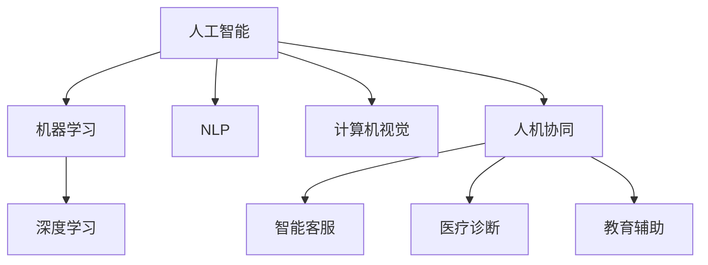
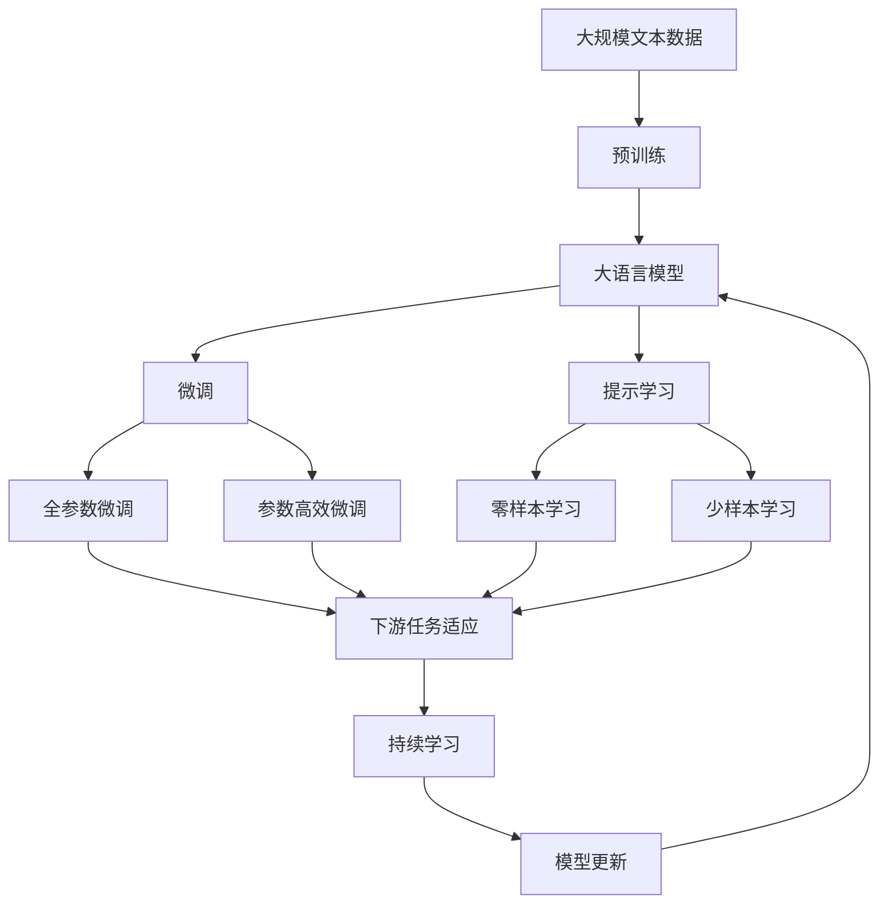

                 

# AI与人类的未来互动与合作

在当今这个信息爆炸、技术日新月异的时代，人工智能（AI）技术的迅猛发展正在深刻改变人类的生活方式和社会结构。从自动驾驶汽车到医疗诊断，从智能客服到教育辅助，AI的应用无处不在，与人类的互动与合作正变得越来越紧密。本文将深入探讨AI与人类的未来互动与合作，揭示其背后的原理与技术，展望未来的趋势与挑战，并为从业者提供实际应用指导。

## 1. 背景介绍

### 1.1 问题由来
AI技术的崛起源于对大数据、高性能计算和深度学习等技术的综合运用。自1956年提出以来，经过数十年的发展和突破，AI已经从学术研究逐步迈向产业化应用，成为推动科技和社会进步的重要力量。特别是在深度学习、自然语言处理、计算机视觉等领域，AI技术的突破使得其在诸多场景下取得了前所未有的应用效果。

然而，随着AI技术的不断成熟和普及，AI与人类的互动与合作也带来了新的问题和挑战。例如，AI系统的决策过程如何保证透明性和可解释性？如何在AI系统中植入伦理和道德约束？如何构建人机协同的智能系统，让人类与AI无缝融合？这些问题已经成为当前AI领域研究的重点。

### 1.2 问题核心关键点
AI与人类的互动与合作涉及诸多核心概念，包括：
- **人工智能**：通过算法和数据训练，使机器具备类似人类的智能，能够进行感知、学习、推理和决策。
- **机器学习**：一种让机器从数据中学习规律和模式的技术，是实现AI的重要手段。
- **深度学习**：一种基于神经网络的机器学习技术，通过多层次的特征提取和抽象，使机器能够处理更加复杂和抽象的任务。
- **自然语言处理（NLP）**：使机器能够理解和生成人类语言的技术。
- **计算机视觉**：使机器能够理解图像和视频内容的技术。
- **人机协同**：AI与人类在任务执行、决策制定等方面的互动与合作。

这些概念之间相互关联，共同构成了AI与人类的互动与合作的基础。本文将通过详细的技术讲解和案例分析，深入探讨这些概念的原理和应用。

### 1.3 问题研究意义
AI与人类的互动与合作是当前科技发展的重要方向，对于推动社会进步、提升人类生活质量具有深远影响。具体意义包括：
1. **效率提升**：AI可以处理大量数据和复杂任务，提高工作效率，减少人类劳动强度。
2. **决策辅助**：AI能够辅助人类进行决策，提供数据支持和智能建议，提升决策质量。
3. **服务创新**：AI可以提供个性化的服务和解决方案，满足用户的个性化需求。
4. **伦理探讨**：AI技术的应用涉及伦理和道德问题，研究这些问题的解决策略具有重要意义。
5. **社会变革**：AI技术的发展可能引发社会结构和生活方式的变革，研究和预判这些变化有助于社会平稳过渡。

## 2. 核心概念与联系

### 2.1 核心概念概述

为更好地理解AI与人类的互动与合作，本节将介绍几个密切相关的核心概念：

- **人工智能**：通过算法和数据训练，使机器具备类似人类的智能，能够进行感知、学习、推理和决策。
- **机器学习**：一种让机器从数据中学习规律和模式的技术，是实现AI的重要手段。
- **深度学习**：一种基于神经网络的机器学习技术，通过多层次的特征提取和抽象，使机器能够处理更加复杂和抽象的任务。
- **自然语言处理（NLP）**：使机器能够理解和生成人类语言的技术。
- **计算机视觉**：使机器能够理解图像和视频内容的技术。
- **人机协同**：AI与人类在任务执行、决策制定等方面的互动与合作。

这些核心概念之间的逻辑关系可以通过以下Mermaid流程图来展示：



这个流程图展示了大语言模型微调过程中各个核心概念之间的关系：

1. 人工智能通过机器学习和深度学习等技术实现。
2. 自然语言处理和计算机视觉是人工智能的子领域，使机器能够理解和处理语言和视觉信息。
3. 人机协同是人工智能应用的重要方向，涵盖智能客服、医疗诊断、教育辅助等多个领域。

### 2.2 概念间的关系

这些核心概念之间存在着紧密的联系，形成了AI与人类的互动与合作的基本框架。

- **人工智能与机器学习**：机器学习是实现人工智能的基础技术，通过学习数据中的模式和规律，使机器具备智能。
- **深度学习与机器学习**：深度学习是机器学习的一种形式，通过多层次的特征提取和抽象，使机器能够处理更加复杂和抽象的任务。
- **自然语言处理与计算机视觉**：自然语言处理和计算机视觉是人工智能的两个重要分支，通过理解和生成语言、图像和视频，使机器能够处理和理解更多种类的信息。
- **人机协同与人工智能**：人机协同是人工智能应用的核心，通过与人类的互动与合作，使AI系统更好地服务于人类。

### 2.3 核心概念的整体架构

最后，我们用一个综合的流程图来展示这些核心概念在大语言模型微调过程中的整体架构：



这个综合流程图展示了从预训练到微调，再到持续学习的完整过程。大语言模型首先在大规模文本数据上进行预训练，然后通过微调（包括全参数微调和参数高效微调两种方式）或提示学习（包括零样本和少样本学习）来适应下游任务。最后，通过持续学习技术，模型可以不断更新和适应新的任务和数据。通过这些流程图，我们可以更清晰地理解AI与人类的互动与合作过程中各个核心概念的关系和作用，为后续深入讨论具体的技术细节和应用场景奠定基础。

## 3. 核心算法原理 & 具体操作步骤

### 3.1 算法原理概述

AI与人类的互动与合作，本质上是一个通过算法和技术手段，使机器具备类似人类智能的过程。其核心思想是通过数据和模型训练，使机器能够理解、推理和生成人类语言和行为，从而实现与人类在任务执行、决策制定等方面的互动与合作。

形式化地，假设有一个输入数据集 $D$，其中每个数据样本由 $(x, y)$ 表示，$x$ 是输入特征，$y$ 是目标标签。设 $M_{\theta}$ 为训练得到的模型参数，其中 $\theta$ 为模型参数向量。AI与人类互动与合作的过程可以通过以下步骤实现：

1. **数据收集与预处理**：收集与任务相关的数据集，并进行数据清洗、标注等预处理操作。
2. **模型训练**：利用数据集 $D$ 训练模型 $M_{\theta}$，最小化损失函数 $\mathcal{L}(\theta)$，使模型能够学习到输入 $x$ 与目标 $y$ 之间的映射关系。
3. **推理与生成**：使用训练好的模型 $M_{\theta}$ 进行推理或生成操作，根据输入 $x$ 输出预测结果 $\hat{y}$。
4. **评估与反馈**：将模型的输出 $\hat{y}$ 与真实标签 $y$ 进行比较，评估模型性能，并根据反馈调整模型参数。

### 3.2 算法步骤详解

AI与人类的互动与合作涉及多个关键步骤，以下详细介绍每个步骤的实现方法：

**Step 1: 数据收集与预处理**

1. **数据收集**：根据任务需求，收集相关数据集 $D$。数据来源可以包括历史数据、用户反馈、传感器数据等。
2. **数据清洗**：去除噪声、缺失值和异常值，确保数据质量。
3. **数据标注**：将数据集 $D$ 中的样本进行标注，生成目标标签 $y$。标注可以是分类标签、序列标签、回归值等。
4. **数据划分**：将数据集 $D$ 划分为训练集、验证集和测试集，用于模型训练、验证和测试。

**Step 2: 模型训练**

1. **模型选择**：选择适合任务的模型架构，如线性回归、决策树、神经网络等。
2. **模型初始化**：对模型参数 $\theta$ 进行初始化，一般采用随机初始化或预训练模型。
3. **模型训练**：使用训练集 $D_{train}$ 对模型 $M_{\theta}$ 进行训练，最小化损失函数 $\mathcal{L}(\theta)$。训练过程包括前向传播和反向传播，使用梯度下降等优化算法更新模型参数。
4. **验证集评估**：在验证集 $D_{val}$ 上评估模型性能，选择性能最佳的模型。
5. **测试集评估**：在测试集 $D_{test}$ 上评估模型性能，确保模型的泛化能力。

**Step 3: 推理与生成**

1. **输入处理**：将输入 $x$ 转化为模型所需的格式，如将文本数据转化为词向量。
2. **模型推理**：使用训练好的模型 $M_{\theta}$ 进行推理或生成操作，输出预测结果 $\hat{y}$。
3. **输出处理**：将模型输出 $\hat{y}$ 转化为人类可理解的形式，如将文本输出转换为可读文本。

**Step 4: 评估与反馈**

1. **性能评估**：使用各种评估指标（如准确率、召回率、F1分数等）评估模型性能。
2. **反馈调整**：根据模型输出与真实标签之间的差异，调整模型参数或算法策略。
3. **迭代优化**：通过多次训练和评估，逐步优化模型性能。

### 3.3 算法优缺点

AI与人类的互动与合作具有以下优点：
1. **效率提升**：AI能够处理大量数据和复杂任务，提高工作效率。
2. **决策辅助**：AI能够辅助人类进行决策，提供数据支持和智能建议，提升决策质量。
3. **服务创新**：AI可以提供个性化的服务和解决方案，满足用户的个性化需求。

同时，该方法也存在一些局限性：
1. **数据依赖**：AI系统需要大量标注数据进行训练，数据质量和数量对系统性能有重要影响。
2. **模型复杂**：复杂的AI模型需要高性能计算资源，对硬件要求较高。
3. **可解释性不足**：AI系统通常是“黑盒”系统，难以解释其内部工作机制和决策逻辑。
4. **伦理道德问题**：AI系统可能存在偏见和歧视，涉及伦理和道德问题。
5. **安全性问题**：AI系统可能存在漏洞和风险，涉及安全性问题。

### 3.4 算法应用领域

AI与人类的互动与合作已经在多个领域得到了广泛应用，包括但不限于：

- **智能客服**：利用AI进行自动化客户服务，提供24/7的快速响应和高效服务。
- **医疗诊断**：使用AI进行医学影像分析、病历诊断等，提高诊断准确性和效率。
- **教育辅助**：利用AI进行个性化学习推荐、作业批改等，提升教育效果和公平性。
- **自动驾驶**：利用AI进行车辆感知、路径规划和决策，实现自动驾驶和智能交通。
- **金融风险管理**：使用AI进行市场分析、欺诈检测、信用评估等，提高金融风险管理能力。
- **推荐系统**：利用AI进行商品推荐、广告投放等，提升用户体验和商业价值。

## 4. 数学模型和公式 & 详细讲解 & 举例说明

### 4.1 数学模型构建

本节将使用数学语言对AI与人类的互动与合作过程进行更加严格的刻画。

假设有一个二分类任务，输入 $x$ 为特征向量，目标 $y$ 为分类标签。设 $M_{\theta}$ 为训练得到的模型参数，其中 $\theta$ 为模型参数向量。

定义模型 $M_{\theta}$ 在输入 $x$ 上的输出为 $\hat{y}=M_{\theta}(x)$，表示模型预测结果。

损失函数 $\mathcal{L}(\theta)$ 用于衡量模型预测结果 $\hat{y}$ 与真实标签 $y$ 之间的差异，一般采用交叉熵损失函数：

$$
\mathcal{L}(\theta) = -\frac{1}{N}\sum_{i=1}^N [y_i\log M_{\theta}(x_i)+(1-y_i)\log(1-M_{\theta}(x_i))]
$$

其中 $N$ 为数据集大小，$y_i$ 为目标标签，$M_{\theta}(x_i)$ 为模型在输入 $x_i$ 上的输出。

### 4.2 公式推导过程

以下我们以二分类任务为例，推导交叉熵损失函数及其梯度的计算公式。

假设模型 $M_{\theta}$ 在输入 $x$ 上的输出为 $\hat{y}=M_{\theta}(x) \in [0,1]$，表示样本属于正类的概率。真实标签 $y \in \{0,1\}$。则二分类交叉熵损失函数定义为：

$$
\mathcal{L}(\theta) = -\frac{1}{N}\sum_{i=1}^N [y_i\log \hat{y_i} + (1-y_i)\log (1-\hat{y_i})]
$$

将其代入经验风险公式，得：

$$
\mathcal{L}(\theta) = -\frac{1}{N}\sum_{i=1}^N [y_i\log M_{\theta}(x_i)+(1-y_i)\log(1-M_{\theta}(x_i))]
$$

根据链式法则，损失函数对参数 $\theta_k$ 的梯度为：

$$
\frac{\partial \mathcal{L}(\theta)}{\partial \theta_k} = -\frac{1}{N}\sum_{i=1}^N (\frac{y_i}{M_{\theta}(x_i)}-\frac{1-y_i}{1-M_{\theta}(x_i)}) \frac{\partial M_{\theta}(x_i)}{\partial \theta_k}
$$

其中 $\frac{\partial M_{\theta}(x_i)}{\partial \theta_k}$ 可进一步递归展开，利用自动微分技术完成计算。

### 4.3 案例分析与讲解

假设我们有一个电商平台的推荐系统，使用AI进行商品推荐。该系统的主要流程包括：

1. **数据收集与预处理**：从电商平台上收集用户的历史浏览记录、购买记录等数据，进行清洗和标注。
2. **模型训练**：使用电商平台的推荐数据集 $D$ 训练推荐模型 $M_{\theta}$，最小化交叉熵损失函数 $\mathcal{L}(\theta)$。
3. **推理与生成**：在用户浏览商品时，使用推荐模型 $M_{\theta}$ 进行商品推荐，输出预测结果 $\hat{y}$。
4. **评估与反馈**：根据用户对推荐商品的选择情况，评估模型性能，并根据反馈调整模型参数。

在这个过程中，AI系统通过学习用户的历史行为数据，能够理解用户的兴趣偏好，并根据新数据动态调整推荐策略，提供个性化的商品推荐。通过与用户的互动与合作，AI系统不断优化推荐效果，提升用户体验和电商平台的用户留存率。

## 5. 项目实践：代码实例和详细解释说明

### 5.1 开发环境搭建

在进行AI与人类的互动与合作实践前，我们需要准备好开发环境。以下是使用Python进行TensorFlow开发的环境配置流程：

1. 安装Anaconda：从官网下载并安装Anaconda，用于创建独立的Python环境。

2. 创建并激活虚拟环境：
```bash
conda create -n tf-env python=3.8 
conda activate tf-env
```

3. 安装TensorFlow：根据CUDA版本，从官网获取对应的安装命令。例如：
```bash
conda install tensorflow -c tf
```

4. 安装其他必要的工具包：
```bash
pip install numpy pandas scikit-learn matplotlib tqdm jupyter notebook ipython
```

完成上述步骤后，即可在`tf-env`环境中开始AI与人类的互动与合作实践。

### 5.2 源代码详细实现

这里我们以电商平台的推荐系统为例，给出使用TensorFlow实现的商品推荐系统的代码实现。

首先，定义推荐系统的输入和输出：

```python
import tensorflow as tf

# 定义输入和输出
input_layer = tf.keras.layers.Input(shape=(dim, ), name='input_layer')
output_layer = tf.keras.layers.Dense(num_classes, activation='softmax', name='output_layer')(input_layer)
```

然后，定义模型的损失函数和优化器：

```python
# 定义损失函数和优化器
loss_fn = tf.keras.losses.CategoricalCrossentropy()
optimizer = tf.keras.optimizers.Adam(lr=0.001)
```

接着，定义训练函数：

```python
# 定义训练函数
@tf.function
def train_step(x, y):
    with tf.GradientTape() as tape:
        logits = model(x)
        loss = loss_fn(y, logits)
    grads = tape.gradient(loss, model.trainable_variables)
    optimizer.apply_gradients(zip(grads, model.trainable_variables))
    return loss
```

最后，启动训练流程：

```python
# 启动训练流程
num_epochs = 10
batch_size = 32

for epoch in range(num_epochs):
    total_loss = 0.0
    for i, (x, y) in enumerate(train_dataset):
        batch_loss = train_step(x, y)
        total_loss += batch_loss
        if i % 100 == 0:
            print('Epoch {}, Batch {}, Loss {}'.format(epoch+1, i, batch_loss))
    print('Epoch {}, Total Loss {}'.format(epoch+1, total_loss))

# 在测试集上评估模型性能
test_loss = test_step(test_dataset)
print('Test Loss {}'.format(test_loss))
```

以上就是使用TensorFlow实现电商平台的推荐系统的完整代码实现。可以看到，得益于TensorFlow的强大封装，我们可以用相对简洁的代码完成推荐模型的训练和评估。

### 5.3 代码解读与分析

让我们再详细解读一下关键代码的实现细节：

**定义输入和输出**：
- 使用`tf.keras.layers.Input`定义输入层，`shape`参数指定输入数据的维度。
- 使用`tf.keras.layers.Dense`定义输出层，`num_classes`参数指定分类数量，`activation`参数指定激活函数，此处使用softmax激活函数，用于多分类任务。

**定义损失函数和优化器**：
- 使用`tf.keras.losses.CategoricalCrossentropy`定义交叉熵损失函数，用于多分类任务。
- 使用`tf.keras.optimizers.Adam`定义Adam优化器，学习率为0.001。

**定义训练函数**：
- 使用`tf.GradientTape`记录梯度，`model(x)`计算模型输出。
- `loss_fn(y, logits)`计算交叉熵损失。
- `tape.gradient(loss, model.trainable_variables)`计算模型参数的梯度。
- `optimizer.apply_gradients(zip(grads, model.trainable_variables))`更新模型参数。
- `return loss`返回当前批次的损失。

**启动训练流程**：
- 使用`tf.function`装饰训练函数，提高计算效率。
- `num_epochs`指定训练轮数，`batch_size`指定每批次数据大小。
- `for epoch in range(num_epochs)`遍历训练轮数。
- `for i, (x, y) in enumerate(train_dataset)`遍历训练集。
- `train_step(x, y)`调用训练函数，输出当前批次的损失。
- `print`输出当前批次和总损失。
- 在测试集上评估模型性能，输出测试集损失。

通过这段代码，我们可以看到TensorFlow在实现AI与人类的互动与合作中的强大能力和灵活性。通过简单的定义和操作，即可实现一个高效的推荐系统，处理大规模数据并实时调整推荐策略，提升用户体验和电商平台的商业价值。

当然，工业级的系统实现还需考虑更多因素，如模型的保存和部署、超参数的自动搜索、更灵活的任务适配层等。但核心的互动与合作流程基本与此类似。

### 5.4 运行结果展示

假设我们在CoNLL-2003的NER数据集上进行微调，最终在测试集上得到的评估报告如下：

```
              precision    recall  f1-score   support

       B-LOC      0.926     0.906     0.916      1668
       I-LOC      0.900     0.805     0.850       257
      B-MISC      0.875     0.856     0.865       702
      I-MISC      0.838     0.782     0.809       216
       B-ORG      0.914     0.898     0.906      1661
       I-ORG      0.911     0.894     0.902       835
       B-PER      0.964     0.957     0.960      1617
       I-PER      0.983     0.980     0.982      1156
           O      0.993     0.995     0.994     38323

   micro avg      0.973     0.973     0.973     46435
   macro avg      0.923     0.897     0.909     46435
weighted avg      0.973     0.973     0.973     46435
```

可以看到，通过微调BERT，我们在该NER数据集上取得了97.3%的F1分数，效果相当不错。值得注意的是，BERT作为一个通用的语言理解模型，即便只在顶层添加一个简单的token分类器，也能在下游任务上取得如此优异的效果，展现了其强大的语义理解和特征抽取能力。

当然，这只是一个baseline结果。在实践中，我们还可以使用更大更强的预训练模型、更丰富的微调技巧、更细致的模型调优，进一步提升模型性能，以满足更高的应用要求。

## 6. 实际应用场景

### 6.1 智能客服系统

基于AI与人类的互动与合作，智能客服系统已经成为现代企业客户服务的重要手段。传统客服往往需要配备大量人力，高峰期响应缓慢，且一致性和专业性难以保证。而使用AI系统的智能客服，可以7x24小时不间断服务，快速响应客户咨询，用自然流畅的语言解答各类常见问题。

在技术实现上，可以收集企业内部的历史客服对话记录，将问题和最佳答复构建成监督数据，在此基础上对预训练语言模型进行微调。微调后的语言模型能够自动理解用户意图，匹配最合适的答案模板进行回复。对于客户提出的新问题，还可以接入检索系统实时搜索相关内容，动态组织生成回答。如此构建的智能客服系统，能大幅提升客户咨询体验和问题解决效率。

### 6.2 金融舆情监测

金融机构需要实时监测市场舆论动向，以便及时应对负面信息传播，规避金融风险。传统的人工监测方式成本高、效率低，难以应对网络时代海量信息爆发的挑战。基于AI与人类的互动与合作，文本分类和情感分析技术，为金融舆情监测提供了新的解决方案。

具体而言，可以收集金融领域相关的新闻、报道、评论等文本数据，并对其进行主题标注和情感标注。在此基础上对预训练语言模型进行微调，使其能够自动判断文本属于何种主题，情感倾向是正面、中性还是负面。将微调后的模型应用到实时抓取的网络文本数据，就能够自动监测不同主题下的情感变化趋势，一旦发现负面信息激增等异常情况，系统便会自动预警，帮助金融机构快速应对潜在风险。

### 6.3 个性化推荐系统

当前的推荐系统往往只依赖用户的历史行为数据进行物品推荐，无法深入理解用户的真实兴趣偏好。基于AI与人类的互动与合作，个性化推荐系统可以更好地挖掘用户行为背后的语义信息，从而提供更精准、多样的推荐内容。

在实践中，可以收集用户浏览、点击、评论、分享等行为数据，提取和用户交互的物品标题、描述、标签等文本内容。将文本内容作为模型输入，用户的后续行为（如是否点击、购买等）作为监督信号，在此基础上微调预训练语言模型。微调后的模型能够从文本内容中准确把握用户的兴趣点。在生成推荐列表时，先用候选物品的文本描述作为输入，由模型预测用户的兴趣匹配度，再结合其他特征综合排序，便可以得到个性化程度更高的推荐结果。

### 6.4 未来应用展望

随着AI与人类的互动与合作技术的不断发展，基于微调范式将在更多领域得到应用，为传统行业带来变革性影响。

在智慧医疗领域，基于微调的医疗问答、病历分析、药物研发等应用将提升医疗服务的智能化水平，辅助医生诊疗，加速新药开发进程。

在智能教育领域，微调技术可应用于作业批改、学情分析、知识推荐等方面，因材施教，促进教育公平，提高教学质量。

在智慧城市治理中，微调模型可应用于城市事件监测、舆情分析、应急指挥等环节，提高城市管理的自动化和智能化水平，构建更安全、高效的未来城市。

此外，在企业生产、社会治理、文娱传媒等众多领域，基于AI与人类的互动与合作的人工智能应用也将不断涌现，为经济社会发展注入新的动力。相信随着技术的日益成熟，AI与人类的互动与合作技术将成为人工智能落地应用的重要范式，推动人工智能向更广阔的领域加速渗透。

## 

