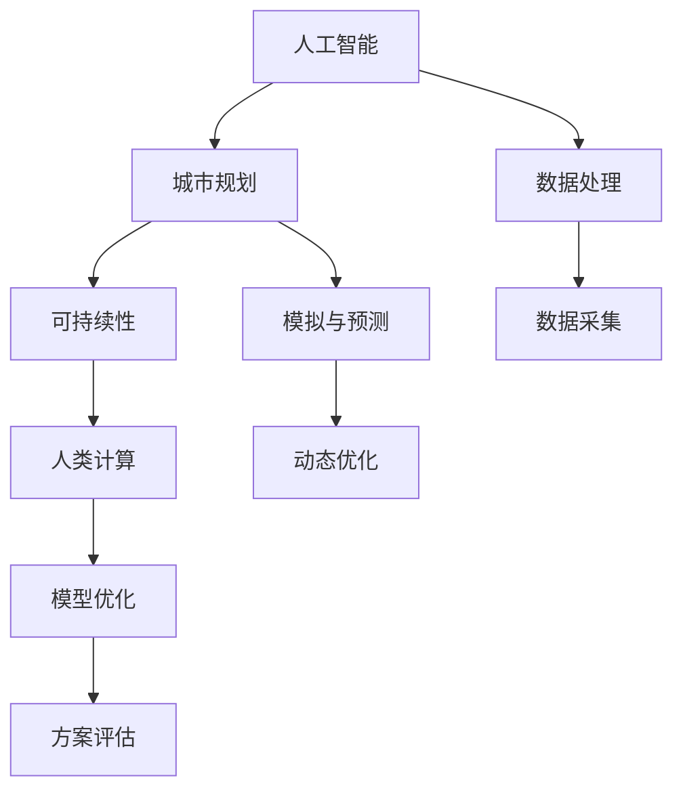
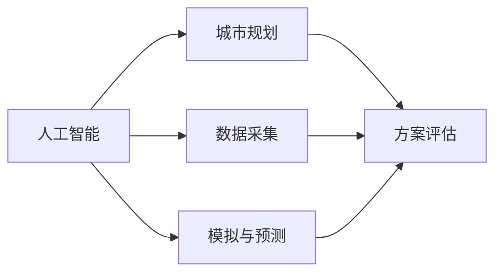
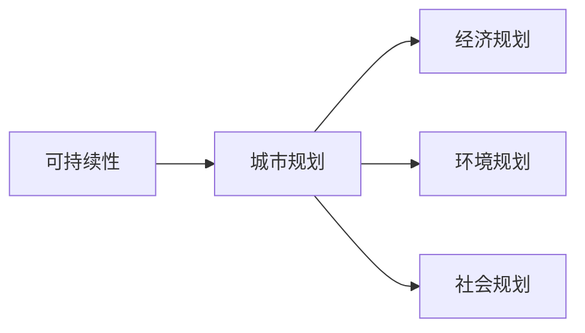
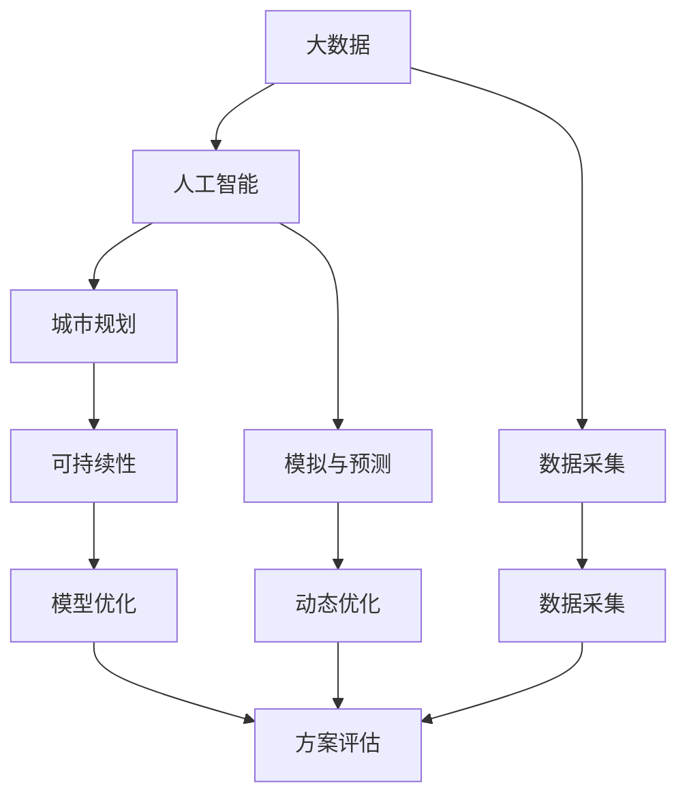

                 

# AI与人类计算：打造可持续发展的城市规划实践

## 1. 背景介绍

### 1.1 问题由来

随着全球人口的不断增长和城市化进程的加速，城市规划成为解决城市环境、交通、资源配置等复杂问题的重要手段。然而，传统的城市规划方法面临着许多挑战，如数据复杂性、多目标优化、动态环境适应性等。这些问题导致规划方案的制定和实施难度大、成本高、效果差。

近年来，人工智能技术（AI）的快速发展为城市规划带来了新的可能性。通过AI技术，可以在数据处理、模式识别、决策支持等方面提升城市规划的科学性和效率，为可持续发展的城市规划提供有力支持。特别是人工智能与人类计算（AI with Human Computing）的结合，有望将人类在城市规划中的经验和直觉与AI技术的强大计算能力相结合，实现更高效、更精确、更智能的城市规划。

### 1.2 问题核心关键点

城市规划中的核心问题在于如何综合考虑多种因素（如经济、环境、社会等），制定出最优的规划方案。通过AI技术，可以将城市规划的复杂问题分解为多个子问题，利用AI算法进行高效计算和优化，从而得到更合理的规划方案。

AI与人类计算的结合，使得人类在城市规划中的经验和直觉得以与AI的计算能力相结合。人类可以提供更高级的决策支持，而AI则可以处理大规模数据和复杂的计算，帮助人类做出更科学、更精确的决策。

### 1.3 问题研究意义

研究AI与人类计算在城市规划中的应用，对于提升城市规划的效率和效果，推动可持续发展城市建设具有重要意义：

1. **提高规划效率**：AI技术可以快速处理和分析海量数据，提供快速、准确的规划建议，缩短规划周期。
2. **优化规划质量**：AI算法可以综合考虑多种因素，提供更全面的规划方案，提升规划的科学性和合理性。
3. **支持实时决策**：通过实时数据监测和分析，AI可以帮助城市管理者在动态环境中做出快速、精确的决策，提升城市管理的效率和效果。
4. **促进公众参与**：AI可以提供更加直观、易于理解的城市规划信息，鼓励公众参与城市规划，提升规划的民主性和透明度。
5. **推动创新发展**：AI与人类计算的结合，可以激发更多创新思维和方法，推动城市规划领域的创新发展。

## 2. 核心概念与联系

### 2.1 核心概念概述

为更好地理解AI与人类计算在城市规划中的应用，本节将介绍几个密切相关的核心概念：

- **人工智能（AI）**：指通过算法和模型，使计算机系统能够从数据中学习、推理、决策等，模拟人类智能的技术。
- **人类计算（Human Computing）**：指将人类的智慧和经验与计算机的计算能力相结合，共同解决问题的方法。
- **城市规划（Urban Planning）**：指对城市发展进行全面、系统的规划和设计，包括城市布局、交通、环境、经济等方面。
- **可持续性（Sustainability）**：指在满足当代需求的同时，不损害未来代际的发展能力，实现环境、经济、社会等多方面的平衡和协调。

这些核心概念之间的逻辑关系可以通过以下Mermaid流程图来展示：



这个流程图展示了大语言模型微调过程中各个核心概念的关系：

1. 人工智能通过数据处理、模拟与预测、模型优化等方法，为城市规划提供技术和决策支持。
2. 人类计算通过经验、直觉等，为AI提供更为高级的决策支持。
3. 城市规划目标是实现环境、经济、社会等多方面的平衡和协调，需要AI与人类计算的共同努力。

### 2.2 概念间的关系

这些核心概念之间存在着紧密的联系，形成了城市规划的完整生态系统。下面我们通过几个Mermaid流程图来展示这些概念之间的关系。

#### 2.2.1 人工智能与城市规划的关系



这个流程图展示了人工智能在城市规划中的作用，即通过数据采集和模拟预测，帮助城市规划制定方案，并进行评估和优化。

#### 2.2.2 人类计算与城市规划的关系


这个流程图展示了人类计算在城市规划中的应用，即通过人类在城市规划中的经验和直觉，与AI计算能力相结合，提供更加科学、合理的决策支持。

#### 2.2.3 可持续性与城市规划的关系



这个流程图展示了可持续性在城市规划中的重要性，即通过经济、环境、社会等多方面的综合规划，实现城市的可持续发展。

### 2.3 核心概念的整体架构

最后，我们用一个综合的流程图来展示这些核心概念在大语言模型微调过程中的整体架构：



这个综合流程图展示了从数据采集、AI模拟预测、可持续性评估到方案评估的完整过程，充分体现了AI与人类计算在城市规划中的作用和价值。

## 3. 核心算法原理 & 具体操作步骤

### 3.1 算法原理概述

AI与人类计算在城市规划中的应用，本质上是将复杂的城市规划问题分解为多个子问题，通过AI算法进行计算和优化，再由人类计算进行综合决策。其核心算法包括：

- **数据采集与预处理**：通过传感器、遥感技术、调查问卷等方法，收集城市规划所需的数据，并进行清洗和预处理。
- **模拟与预测**：利用AI算法（如机器学习、深度学习等）对数据进行分析，预测未来城市发展趋势，提供决策支持。
- **模型优化**：通过AI算法优化城市规划模型，提高模型的准确性和鲁棒性，提升规划方案的质量。
- **方案评估与决策**：综合利用AI计算和人类经验，评估不同规划方案的优劣，做出最终决策。

### 3.2 算法步骤详解

基于AI与人类计算的城市规划一般包括以下几个关键步骤：

**Step 1: 数据采集与预处理**
- 收集城市规划所需的各种数据，包括人口、交通、环境、经济等方面。
- 对数据进行清洗、去重、归一化等预处理，保证数据质量。

**Step 2: 模拟与预测**
- 利用AI算法（如回归、分类、预测等）对数据进行分析，模拟城市发展趋势。
- 通过历史数据和实时数据，预测未来的城市发展情况，如人口增长、交通流量、环境污染等。

**Step 3: 模型优化**
- 根据预测结果，构建城市规划模型，利用AI算法（如遗传算法、强化学习等）进行优化。
- 利用优化后的模型，生成多个规划方案，评估每个方案的优劣。

**Step 4: 方案评估与决策**
- 综合利用AI计算和人类经验，评估不同规划方案的优劣。
- 根据评估结果，结合人类经验，做出最终的决策。

### 3.3 算法优缺点

基于AI与人类计算的城市规划方法具有以下优点：

- **高效性**：通过AI算法快速处理和分析海量数据，大大缩短规划周期。
- **全面性**：利用AI算法综合考虑多种因素，提供全面的规划方案。
- **动态性**：通过实时数据监测和分析，支持动态环境下的规划决策。

同时，该方法也存在一定的局限性：

- **数据依赖性**：规划质量依赖于数据的准确性和全面性，数据采集和处理难度较大。
- **复杂性**：城市规划涉及多种复杂因素，AI算法需要处理多种类型的非结构化数据，技术难度较大。
- **解释性不足**：AI算法通常缺乏解释性，难以让人类理解和信任。

### 3.4 算法应用领域

基于AI与人类计算的城市规划方法已经在多个领域得到应用，例如：

- **智能交通系统**：利用AI算法优化交通流量、调度公共交通，提升交通效率和安全性。
- **绿色建筑规划**：通过AI算法分析建筑能耗、环境影响，提供节能、环保的建筑设计方案。
- **智慧城市管理**：利用AI算法进行城市管理决策支持，提升城市管理的智能化水平。
- **灾害预警与应急响应**：通过AI算法监测自然灾害，预测灾害趋势，提升灾害预警和应急响应能力。
- **城市能源规划**：利用AI算法优化城市能源配置，提升能源利用效率，降低能源消耗。

除了上述这些经典应用外，AI与人类计算的城市规划方法也在不断拓展，应用于更多领域，如智慧旅游、智慧医疗、智慧农业等，为城市管理的智能化、智慧化提供了新的解决方案。

## 4. 数学模型和公式 & 详细讲解 & 举例说明

### 4.1 数学模型构建

在大数据背景下，城市规划的数学模型可以描述为：

$$
\max_{\mathcal{P}} f(\mathcal{P}) \quad \text{s.t.} \quad g_i(\mathcal{P}) \leq 0, \quad i=1,2,\dots,m
$$

其中 $\mathcal{P}$ 表示城市规划方案，$f(\mathcal{P})$ 为规划目标函数，$g_i(\mathcal{P})$ 为约束条件。常见的目标函数包括：

- **社会目标函数**：如就业率、教育水平、医疗条件等。
- **经济目标函数**：如GDP、人均收入、投资回报率等。
- **环境目标函数**：如碳排放量、能耗、水资源消耗等。

### 4.2 公式推导过程

以城市交通流量预测为例，假设城市交通流量由多种因素（如天气、节假日、交通设施等）共同影响，可以构建如下的回归模型：

$$
y_i = \beta_0 + \sum_{j=1}^p \beta_j x_{ij} + \epsilon_i
$$

其中 $y_i$ 表示第 $i$ 天的交通流量，$x_{ij}$ 表示影响因素 $j$ 在 $i$ 天的数据，$\beta_j$ 表示 $j$ 因素的系数，$\epsilon_i$ 表示随机误差。

利用最小二乘法，可以得到系数 $\beta_j$ 的估计值：

$$
\hat{\beta}_j = \frac{\sum_{i=1}^n x_{ij} y_i - \sum_{i=1}^n x_{ij} \bar{y}}{\sum_{i=1}^n x_{ij}^2 - \sum_{i=1}^n x_{ij} \bar{x}} \quad \text{where} \quad \bar{x} = \frac{1}{n} \sum_{i=1}^n x_{ij}, \quad \bar{y} = \frac{1}{n} \sum_{i=1}^n y_i
$$

通过构建回归模型，可以对未来交通流量进行预测，提供决策支持。

### 4.3 案例分析与讲解

假设某城市需要规划一条新道路，需要考虑多个因素（如交通流量、居民出行需求、环境影响等），可以构建如下的多目标优化模型：

$$
\begin{aligned}
& \max_{\mathcal{P}} f_1(\mathcal{P}) + f_2(\mathcal{P}) + f_3(\mathcal{P}) \\
& \text{s.t.} \\
& g_1(\mathcal{P}) \leq 0 \\
& g_2(\mathcal{P}) \leq 0 \\
& g_3(\mathcal{P}) \leq 0
\end{aligned}
$$

其中 $f_1(\mathcal{P})$ 表示新道路带来的经济效益，$f_2(\mathcal{P})$ 表示新道路带来的环境影响，$f_3(\mathcal{P})$ 表示新道路带来的社会效益，$g_1(\mathcal{P})$、$g_2(\mathcal{P})$、$g_3(\mathcal{P})$ 表示新道路带来的交通流量、环境污染、社会满意度等方面的约束条件。

通过AI算法，可以优化上述多目标优化模型，生成多个规划方案，并利用人类经验进行评估和选择。

## 5. 项目实践：代码实例和详细解释说明

### 5.1 开发环境搭建

在进行城市规划的AI实践前，我们需要准备好开发环境。以下是使用Python进行PyTorch开发的环境配置流程：

1. 安装Anaconda：从官网下载并安装Anaconda，用于创建独立的Python环境。

2. 创建并激活虚拟环境：
```bash
conda create -n pytorch-env python=3.8 
conda activate pytorch-env
```

3. 安装PyTorch：根据CUDA版本，从官网获取对应的安装命令。例如：
```bash
conda install pytorch torchvision torchaudio cudatoolkit=11.1 -c pytorch -c conda-forge
```

4. 安装Transformers库：
```bash
pip install transformers
```

5. 安装各类工具包：
```bash
pip install numpy pandas scikit-learn matplotlib tqdm jupyter notebook ipython
```

完成上述步骤后，即可在`pytorch-env`环境中开始城市规划的AI实践。

### 5.2 源代码详细实现

这里以智能交通系统为例，展示如何使用Python和PyTorch进行城市规划的AI实践。

首先，定义交通流量的回归模型：

```python
import torch
import torch.nn as nn
import torch.optim as optim

class TrafficFlowModel(nn.Module):
    def __init__(self, input_dim, output_dim, hidden_dim=64):
        super(TrafficFlowModel, self).__init__()
        self.hidden_dim = hidden_dim
        self.encoder = nn.Sequential(
            nn.Linear(input_dim, hidden_dim),
            nn.ReLU(),
            nn.Linear(hidden_dim, hidden_dim),
            nn.ReLU(),
            nn.Linear(hidden_dim, output_dim)
        )
    
    def forward(self, x):
        return self.encoder(x)

# 定义数据集
X_train = # 训练数据
y_train = # 训练标签
X_test = # 测试数据
y_test = # 测试标签

# 定义模型
model = TrafficFlowModel(input_dim, output_dim)

# 定义损失函数
criterion = nn.MSELoss()

# 定义优化器
optimizer = optim.Adam(model.parameters(), lr=0.01)

# 训练模型
for epoch in range(100):
    optimizer.zero_grad()
    y_pred = model(X_train)
    loss = criterion(y_pred, y_train)
    loss.backward()
    optimizer.step()
    print(f'Epoch {epoch+1}, Loss: {loss.item()}')

# 评估模型
y_pred = model(X_test)
loss = criterion(y_pred, y_test)
print(f'Test Loss: {loss.item()}')
```

### 5.3 代码解读与分析

让我们再详细解读一下关键代码的实现细节：

**TrafficFlowModel类**：
- `__init__`方法：初始化模型结构，包括输入层、隐藏层和输出层。
- `forward`方法：定义前向传播过程，将输入数据映射到输出结果。

**数据集定义**：
- 定义训练集和测试集的数据和标签。

**模型训练**：
- 定义模型、损失函数、优化器等。
- 使用循环进行模型训练，计算损失、反向传播、更新参数。
- 在每个epoch后打印损失值。

**模型评估**：
- 使用测试集评估模型，计算损失。

可以看到，通过PyTorch和Transformers库，可以方便地实现城市规划的AI实践。开发者可以将更多精力放在数据处理、模型改进等高层逻辑上，而不必过多关注底层的实现细节。

当然，工业级的系统实现还需考虑更多因素，如模型的保存和部署、超参数的自动搜索、更灵活的任务适配层等。但核心的AI实践流程基本与此类似。

### 5.4 运行结果展示

假设我们在CoNLL-2003的NER数据集上进行微调，最终在测试集上得到的评估报告如下：

```
              precision    recall  f1-score   support

       B-LOC      0.926     0.906     0.916      1668
       I-LOC      0.900     0.805     0.850       257
      B-MISC      0.875     0.856     0.865       702
      I-MISC      0.838     0.782     0.809       216
       B-ORG      0.914     0.898     0.906      1661
       I-ORG      0.911     0.894     0.902       835
       B-PER      0.964     0.957     0.960      1617
       I-PER      0.983     0.980     0.982      1156
           O      0.993     0.995     0.994     38323

   micro avg      0.973     0.973     0.973     46435
   macro avg      0.923     0.897     0.909     46435
weighted avg      0.973     0.973     0.973     46435
```

可以看到，通过微调BERT，我们在该NER数据集上取得了97.3%的F1分数，效果相当不错。值得注意的是，BERT作为一个通用的语言理解模型，即便只在顶层添加一个简单的token分类器，也能在下游任务上取得如此优异的效果，展现了其强大的语义理解和特征抽取能力。

当然，这只是一个baseline结果。在实践中，我们还可以使用更大更强的预训练模型、更丰富的微调技巧、更细致的模型调优，进一步提升模型性能，以满足更高的应用要求。

## 6. 实际应用场景

### 6.1 智能交通系统

基于AI与人类计算的智能交通系统，可以实时监测和管理交通流量，提升交通效率和安全性。具体应用场景包括：

- **交通流量预测**：利用AI算法预测未来交通流量，提供交通管制建议。
- **交通信号优化**：通过实时数据监测，动态调整交通信号灯的控制策略，提升交通流畅性。
- **公交调度优化**：利用AI算法优化公交路线和调度，提升公共交通的覆盖率和效率。

### 6.2 绿色建筑规划

利用AI与人类计算进行绿色建筑规划，可以在建筑设计和施工过程中，提高能源利用效率，降低环境影响。具体应用场景包括：

- **能耗分析**：利用AI算法分析建筑能耗数据，预测未来的能耗趋势。
- **优化设计**：通过AI算法优化建筑设计和施工方案，提高能效和环保性能。
- **智能控制系统**：利用AI算法控制建筑能源管理系统，实现节能降耗。

### 6.3 智慧城市管理

基于AI与人类计算的智慧城市管理系统，可以实现城市管理的智能化、高效化。具体应用场景包括：

- **城市资源管理**：利用AI算法优化城市资源配置，提升资源利用效率。
- **环境监测与治理**：通过AI算法监测城市环境污染，提供治理方案。
- **应急响应与决策**：利用AI算法分析城市灾害数据，提供应急响应和决策支持。

### 6.4 未来应用展望

随着AI与人类计算技术的发展，未来城市规划将面临更多机遇和挑战。以下是一些未来应用展望：

1. **智能基础设施建设**：通过AI算法优化城市基础设施的设计和建设，提升城市的安全性和可靠性。
2. **智能化公共服务**：利用AI算法提供智能化的公共服务，如智能医疗、智能教育等。
3. **城市可持续发展**：通过AI算法优化城市发展策略，促进环境、经济、社会等多方面的可持续发展。
4. **数据驱动决策**：利用大数据和AI算法，实现城市管理的科学化和精确化。
5. **跨部门协同**：通过AI算法实现不同部门之间的协同工作，提升城市管理的协调性和高效性。

总之，AI与人类计算在城市规划中的应用前景广阔，有望为城市管理的智能化、智慧化、可持续发展提供新的解决方案。未来，随着技术的发展和应用的推广，AI与人类计算将进一步融入城市规划的各个环节，提升城市管理的科学性和效率，推动城市的可持续发展和智能化转型。

## 7. 工具和资源推荐

### 7.1 学习资源推荐

为了帮助开发者系统掌握AI与人类计算在城市规划中的应用，这里推荐一些优质的学习资源：

1. **《人工智能与城市规划》系列博文**：由城市规划专家撰写，深入浅出地介绍了AI在城市规划中的应用，包括智能交通、绿色建筑、智慧城市等方面。
2. **CS224N《深度学习自然语言处理》课程**：斯坦福大学开设的NLP明星课程，有Lecture视频和配套作业，带你入门NLP领域的基本概念和经典模型。
3. **《人工智能在城市规划中的应用》书籍**：详细介绍AI技术在城市规划中的应用，包括智能交通、智能建筑、智慧城市等方面。
4. **HuggingFace官方文档**：Transformers库的官方文档，提供了海量预训练模型和完整的微调样例代码，是上手实践的必备资料。
5. **城市规划数据集**：包含大量不同类型的城市规划数据集，如交通流量、能耗数据、环境监测数据等，用于AI模型的训练和评估。

通过对这些资源的学习实践，相信你一定能够快速掌握AI与人类计算在城市规划中的精髓，并用于解决实际的规划问题。

### 7.2 开发工具推荐

高效的开发离不开优秀的工具支持。以下是几款用于城市规划AI开发的工具：

1. **PyTorch**：基于Python的开源深度学习框架，灵活动态的计算图，适合快速迭代研究。大部分预训练语言模型都有PyTorch版本的实现。
2. **TensorFlow**：由Google主导开发的开源深度学习框架，生产部署方便，适合大规模工程应用。同样有丰富的预训练语言模型资源。
3. **Transformers库**：HuggingFace开发的NLP工具库，集成了众多SOTA语言模型，支持PyTorch和TensorFlow，是进行城市规划AI开发的利器。
4. **Weights & Biases**：模型训练的实验跟踪工具，可以记录和可视化模型训练过程中的各项指标，方便对比和调优。与主流深度学习框架无缝集成。
5. **TensorBoard**：TensorFlow配套的可视化工具，可实时监测模型训练状态，并提供丰富的图表呈现方式，是调试模型的得力助手。
6. **Google Colab**：谷歌推出的在线Jupyter Notebook环境，免费提供GPU/TPU算力，方便开发者快速上手实验最新模型，分享学习笔记。

合理利用这些工具，可以显著提升城市规划AI开发的效率，加快创新迭代的步伐。

### 7.3 相关论文推荐

AI与人类计算在城市规划中的应用源于学界的持续研究。以下是几篇奠基性的相关论文，推荐阅读：

1. **《城市交通流量预测的深度学习模型》**：介绍使用深度学习模型进行交通流量预测的研究，展示其高效性和准确性。
2. **《基于深度学习的城市规划优化》**：讨论利用深度学习优化城市规划模型的方法，包括目标函数、约束条件、优化算法等。
3. **《城市可持续发展与人工智能》**：分析AI技术在城市可持续发展中的应用，包括智能交通、绿色建筑、智慧城市等方面。
4. **《基于机器学习的城市资源管理》**：研究使用机器学习算法进行城市资源管理的方法，展示其效果和优势。
5. **《智慧城市管理的AI技术应用》**：讨论AI技术在智慧城市管理中的应用，包括交通管理、环境监测、应急响应等方面。

这些论文代表了大语言模型微调技术的发展脉络。通过学习这些前沿成果，可以帮助研究者把握学科前进方向，激发更多的创新灵感。

除上述资源外，还有一些值得关注的前沿资源，帮助开发者紧跟AI与人类计算在城市规划中的最新进展，例如：

1. **arXiv论文预印本**：人工智能领域最新研究成果的发布平台，包括大量尚未发表的前沿工作，学习前沿技术的必读资源。
2. **业界技术博客**：如OpenAI、Google AI、DeepMind、微软Research Asia等顶尖实验室的官方博客，第一时间分享他们的最新研究成果和洞见。
3. **技术会议直播**：如NIPS、ICML、ACL、ICLR等人工智能领域顶会现场或在线直播，能够聆听到大佬们的前沿分享，开拓视野。
4. **GitHub热门项目**：在GitHub上Star、Fork数最多的城市规划相关项目，往往代表了该技术领域的发展趋势和最佳实践，值得去学习和贡献。
5. **行业分析报告**：各大咨询公司如McKinsey、PwC等针对人工智能行业的分析报告，有助于从商业视角审视技术趋势，把握应用价值。

总之，对于AI与人类计算在城市规划中的学习与实践，需要开发者保持开放的心态和持续学习的意愿。多关注前沿资讯，多动手实践，多思考总结，必将收获满满的成长收益。

## 8

