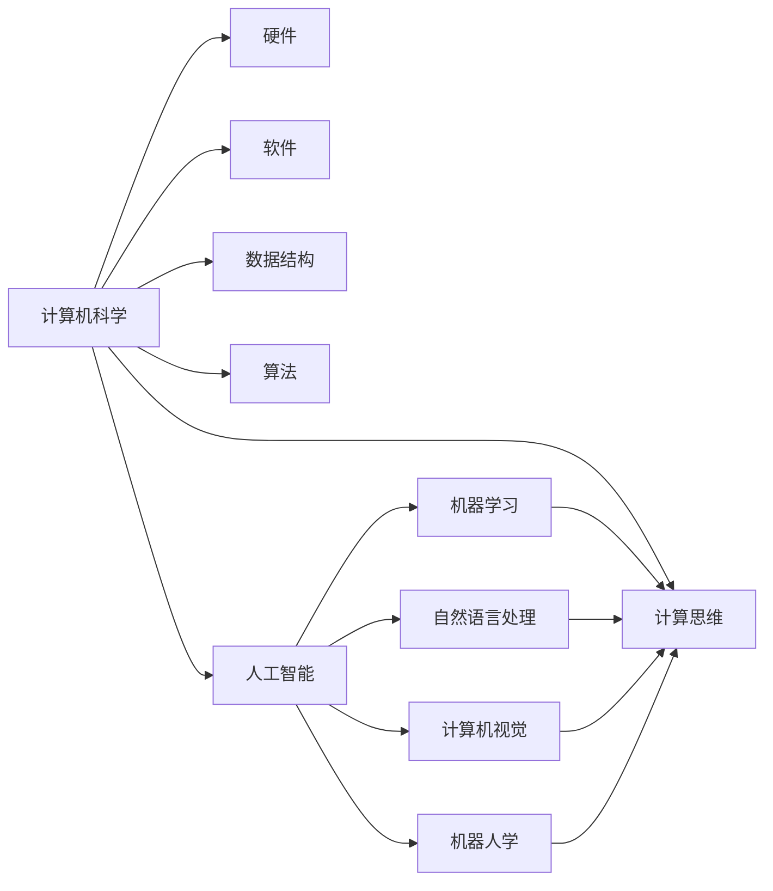

                 

# AI与计算机的历史对比

## 1. 背景介绍

### 1.1 问题由来

人工智能（AI）与计算机科学的发展紧密相连，两者的历史可以追溯到计算机发明之初。计算机的诞生为人工智能的发展提供了必要的硬件基础，而人工智能的进步又推动了计算机科学的前进。因此，深入了解人工智能与计算机的历史对比，对于理解当前的技术趋势和未来的发展方向至关重要。

### 1.2 问题核心关键点

人工智能与计算机的历史对比涉及以下几个核心关键点：
1. 计算机的起源与发展。
2. 人工智能的起源与发展。
3. 两者之间的交叉与影响。
4. 人工智能在计算机中的应用与创新。
5. 未来展望与挑战。

通过探讨这些关键点，可以更好地理解人工智能与计算机科学之间的内在联系和相互影响。

### 1.3 问题研究意义

深入分析人工智能与计算机的历史对比，具有以下研究意义：
1. 帮助我们更全面地理解计算机科学与人工智能的发展历程，把握技术演变的脉络。
2. 揭示两者之间的相互影响和促进作用，为未来的技术发展提供借鉴。
3. 洞察当前技术趋势和未来可能的发展方向，为相关领域的研究和应用提供参考。

## 2. 核心概念与联系

### 2.1 核心概念概述

- **计算机科学**：研究计算机及其相关技术的应用和理论的学科。计算机科学的目的是设计、开发、维护和理解计算系统和软件。
- **人工智能**：模拟、扩展和开发智能系统的科学与工程领域。人工智能旨在创建能够执行人类智能任务的机器。
- **计算思维**：使用计算机科学的概念和方法来解决问题的思维方式。计算思维是人工智能与计算机科学共同的核心。

### 2.2 核心概念间的关系

计算机科学和人工智能之间存在密切的关系，如图：



这个流程图展示了计算机科学与人工智能之间的联系：
1. 计算机科学为人工智能提供了必要的硬件和软件支持。
2. 人工智能在数据结构、算法和计算思维方面依赖于计算机科学的理论和技术。
3. 人工智能通过机器学习、自然语言处理、计算机视觉等具体应用，推动计算机科学的进步。

## 3. 核心算法原理 & 具体操作步骤

### 3.1 算法原理概述

人工智能与计算机科学的核心算法原理包括：
1. **算法与数据结构**：用于设计和实现高效的软件。
2. **机器学习**：通过数据和模型训练，使计算机能够学习并执行智能任务。
3. **自然语言处理**：使计算机能够理解和处理人类语言。
4. **计算机视觉**：使计算机能够识别和理解图像和视频。
5. **机器人学**：研究如何设计和构建智能机器人。

### 3.2 算法步骤详解

以机器学习为例，其基本步骤包括：
1. **数据收集**：获取大量标注数据。
2. **模型训练**：使用数据训练机器学习模型。
3. **模型评估**：评估模型在测试数据上的表现。
4. **模型部署**：将模型应用于实际问题中。

### 3.3 算法优缺点

人工智能与计算机科学的算法具有以下优缺点：
- **优点**：
  - 能够处理大规模数据，进行复杂计算。
  - 可以自动化执行任务，提高效率。
  - 推动了新技术的不断涌现，促进了社会进步。

- **缺点**：
  - 需要大量数据和计算资源。
  - 模型可能存在偏见和错误。
  - 对人类智能的模拟仍存在较大挑战。

### 3.4 算法应用领域

人工智能与计算机科学的应用领域包括：
1. **自动驾驶**：利用计算机视觉和自然语言处理，实现智能驾驶。
2. **医疗诊断**：通过机器学习，辅助医生进行疾病诊断和治疗。
3. **金融分析**：使用机器学习和大数据技术，进行风险评估和预测。
4. **教育**：利用人工智能，进行个性化学习推荐和智能辅导。

## 4. 数学模型和公式 & 详细讲解  
### 4.1 数学模型构建

人工智能与计算机科学中常用的数学模型包括：
1. **线性回归**：用于预测连续数值。
2. **逻辑回归**：用于分类任务。
3. **决策树**：用于分类和回归任务。
4. **支持向量机**：用于分类和回归任务。
5. **神经网络**：用于复杂的数据表示和模式识别。

### 4.2 公式推导过程

以线性回归为例，其基本公式为：
$$
\hat{y} = \theta_0 + \theta_1 x_1 + \theta_2 x_2 + \ldots + \theta_n x_n
$$
其中 $\theta_0$ 为截距，$\theta_1, \theta_2, \ldots, \theta_n$ 为权重系数。

### 4.3 案例分析与讲解

线性回归可以用于预测房价。假设已知一些历史房价数据，可以构建一个线性模型，用于预测新房的房价。

## 5. 项目实践：代码实例和详细解释说明

### 5.1 开发环境搭建

安装Python 3.x、NumPy、SciPy、Pandas等必要的库。使用Jupyter Notebook进行交互式编程。

### 5.2 源代码详细实现

以下是一个简单的线性回归模型示例代码：

```python
import numpy as np
from sklearn.linear_model import LinearRegression
from sklearn.datasets import make_regression
from sklearn.model_selection import train_test_split

# 生成数据
X, y = make_regression(n_samples=100, n_features=2, noise=10, random_state=42)

# 分割数据
X_train, X_test, y_train, y_test = train_test_split(X, y, test_size=0.2, random_state=42)

# 训练模型
model = LinearRegression()
model.fit(X_train, y_train)

# 预测结果
y_pred = model.predict(X_test)

# 评估模型
print("R^2 score: ", model.score(X_test, y_test))
```

### 5.3 代码解读与分析

该代码展示了线性回归模型的基本流程：
1. 生成随机数据集。
2. 分割数据集为训练集和测试集。
3. 训练模型。
4. 使用训练好的模型对测试集进行预测。
5. 评估模型性能。

## 6. 实际应用场景

### 6.1 自动驾驶

自动驾驶依赖于计算机视觉和自然语言处理。通过摄像头和传感器获取实时数据，并使用深度学习模型进行目标检测、路径规划和行为预测，实现智能驾驶。

### 6.2 医疗诊断

人工智能在医疗诊断中的应用包括图像识别、疾病预测和智能辅助。利用机器学习算法对医学影像进行分析和分类，辅助医生进行诊断和治疗。

### 6.3 金融分析

金融分析领域广泛应用机器学习和数据挖掘技术，进行风险评估、市场预测和投资策略优化。

### 6.4 未来应用展望

未来，人工智能与计算机科学的应用将更加广泛和深入。例如，在教育领域，利用智能辅导系统进行个性化学习；在环境保护领域，利用机器学习进行数据分析和预测；在交通管理领域，利用智能交通系统进行实时监控和调度。

## 7. 工具和资源推荐

### 7.1 学习资源推荐

- **Coursera**：提供大量计算机科学和人工智能课程。
- **edX**：提供顶尖大学的人工智能课程。
- **Kaggle**：数据科学和机器学习的竞赛平台。
- **GitHub**：源代码托管和协作平台。

### 7.2 开发工具推荐

- **PyTorch**：用于深度学习和人工智能开发的开源框架。
- **TensorFlow**：Google开发的深度学习框架。
- **Keras**：高层次的神经网络API。

### 7.3 相关论文推荐

- **深度学习**：《Deep Learning》 by Ian Goodfellow, Yoshua Bengio, Aaron Courville。
- **计算机视觉**：《Learning from Data: Pattern Recognition and Machine Learning》 by Christopher M. Bishop。

## 8. 总结：未来发展趋势与挑战

### 8.1 研究成果总结

人工智能与计算机科学在过去几十年里取得了巨大进展，推动了科学和技术的发展。未来，两者将继续相互促进，推动社会的进步。

### 8.2 未来发展趋势

1. **更智能的AI**：未来的AI将更加智能，能够进行更复杂、更精确的计算和推理。
2. **更高效的数据处理**：未来的计算机科学将更加高效，能够处理更大规模、更复杂的数据。
3. **更广泛的应用领域**：AI和计算机科学将应用于更多领域，推动各行业的智能化发展。

### 8.3 面临的挑战

1. **数据隐私和安全**：随着AI和计算机科学的应用普及，数据隐私和安全问题日益凸显。
2. **算法透明性和可解释性**：如何使AI和计算机科学的算法更加透明和可解释，是一个重要的研究方向。
3. **伦理和社会责任**：AI和计算机科学的应用需要考虑伦理和社会责任问题，确保其应用符合人类价值观和社会规范。

### 8.4 研究展望

未来，AI与计算机科学的研究将更加注重伦理和社会责任，致力于解决实际问题和提高人类生活质量。同时，跨学科的合作将更加深入，推动AI和计算机科学的快速发展。

## 9. 附录：常见问题与解答

**Q1：人工智能与计算机科学有什么区别？**

A: 人工智能是模拟、扩展和开发智能系统的科学与工程领域，侧重于智能系统的构建和应用。而计算机科学是研究计算机及其相关技术的应用和理论的学科，侧重于计算机系统设计和软件开发。

**Q2：人工智能对计算机科学有什么影响？**

A: 人工智能的发展推动了计算机科学的进步。例如，深度学习算法的发展，使得计算机视觉和自然语言处理等领域的突破成为可能。

**Q3：未来人工智能和计算机科学将如何发展？**

A: 未来的AI和计算机科学将更加智能化、高效化和广泛应用。同时，也将更加注重伦理和社会责任，推动社会的进步。

**Q4：人工智能和计算机科学的未来应用前景如何？**

A: 人工智能和计算机科学将广泛应用于自动驾驶、医疗诊断、金融分析、教育、环境保护、智能交通等领域，推动社会的进步和各行业的智能化发展。

---

作者：禅与计算机程序设计艺术 / Zen and the Art of Computer Programming

