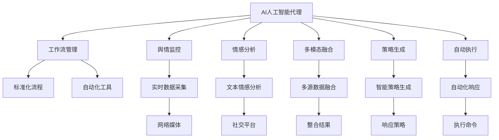
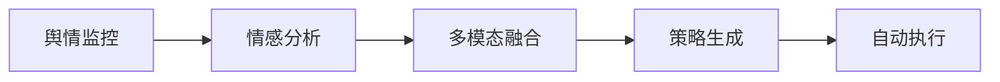
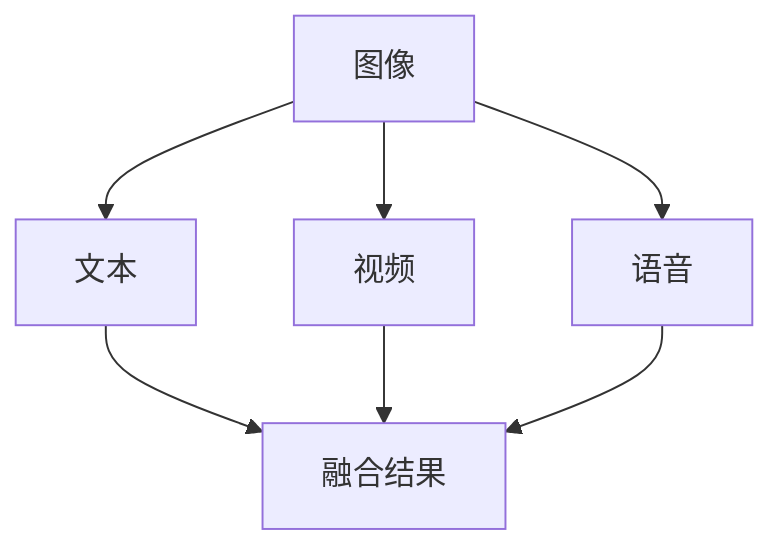
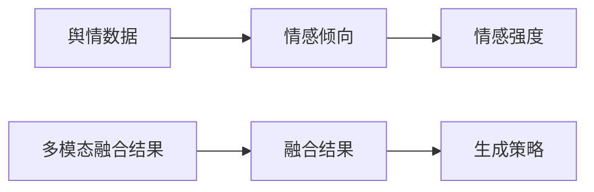
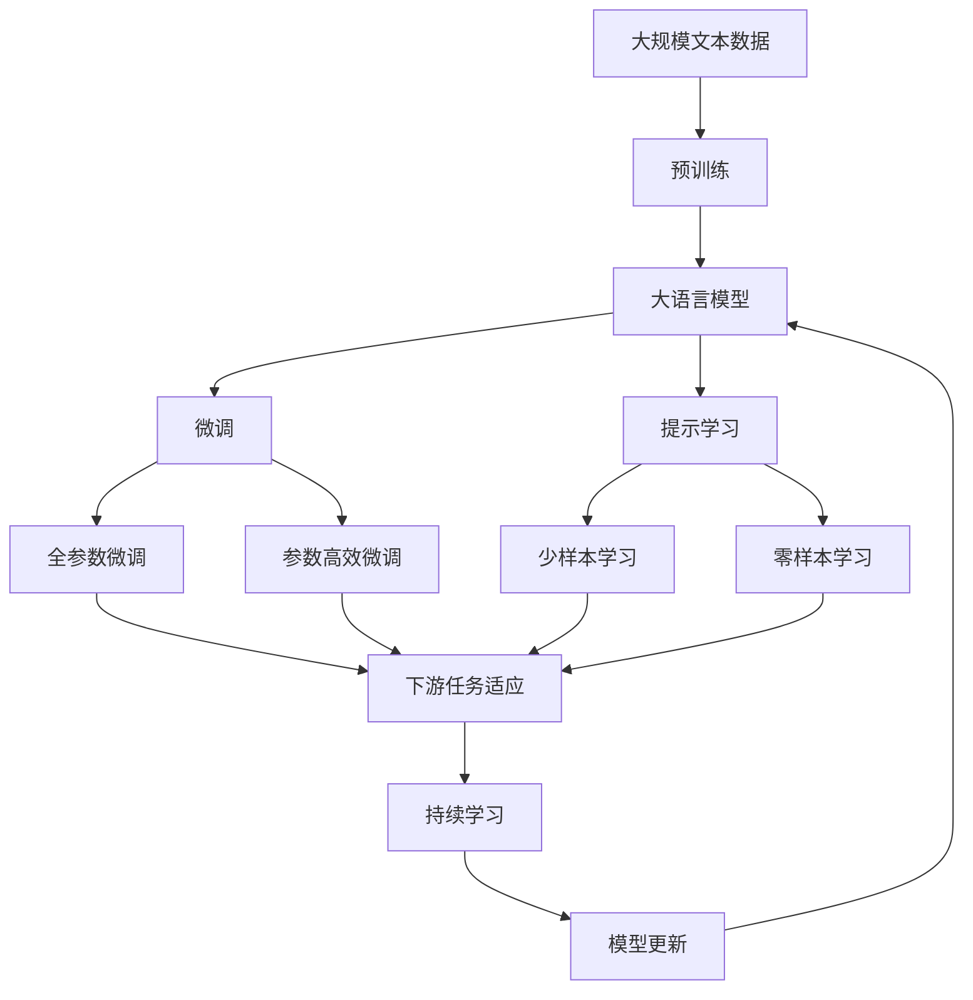

                 

# AI人工智能代理工作流 AI Agent WorkFlow：在公关危机管理中的应用

> 关键词：人工智能代理,工作流管理,公关危机,自然语言处理(NLP),情感分析,多模态融合

## 1. 背景介绍

### 1.1 问题由来
公关危机管理是指在企业或个人面临公众舆论压力、形象受损等情况下，通过有效的手段及时应对，恢复品牌声誉的过程。传统的公关危机处理依赖于人工监控、舆情分析、事件响应等环节，流程复杂，效率低下，往往无法及时响应和高效解决。

近年来，随着人工智能和大数据技术的飞速发展，越来越多的公司开始探索利用AI技术来提升公关危机的应对能力。人工智能代理（AI Agent）作为AI技术在应用场景中的重要组成部分，正在逐渐成为公共关系管理的重要工具。

### 1.2 问题核心关键点
AI人工智能代理（AI Agent）指的是通过AI技术构建的自动化工作流，能够在公关危机管理过程中自动收集数据、分析舆情、提出应对策略，并在必要时自动执行响应动作。AI Agent在公关危机管理中的应用主要体现在以下几个方面：

1. **舆情监控与分析**：实时监控网络媒体、社交平台等渠道，自动识别并分析与企业相关的负面信息。
2. **情感分析与风险预测**：使用自然语言处理(NLP)技术，分析舆情背后的情感倾向，预测潜在的风险。
3. **多模态融合与信息整合**：结合图像、视频、语音等多模态数据，全面理解舆情态势。
4. **策略生成与自动执行**：基于分析结果，自动生成并执行公关危机应对策略，如发布声明、联系媒体等。
5. **动态调整与优化**：根据舆情变化动态调整应对策略，优化危机管理效果。

这些应用将大大提升公关危机响应的速度和效果，降低人工干预的复杂度，为企业的品牌声誉保驾护航。

### 1.3 问题研究意义
AI人工智能代理在公关危机管理中的应用，对于提升企业公关危机的应对能力和效率，维护企业形象和品牌声誉具有重要意义：

1. **提高响应速度**：AI Agent可以24小时不间断监控，快速识别和分析舆情，及时响应负面事件。
2. **降低人工成本**：AI Agent自动化处理大部分公关危机流程，减少了人工干预的需求。
3. **提升应对效果**：AI Agent通过综合多源数据和智能分析，生成更科学的应对策略。
4. **增强品牌韧性**：通过及时有效的危机响应，增强企业的品牌韧性和市场竞争力。

因此，研究AI人工智能代理在公关危机管理中的应用，具有重要的理论和实践价值。

## 2. 核心概念与联系

### 2.1 核心概念概述

为更好地理解AI人工智能代理在公关危机管理中的应用，本节将介绍几个密切相关的核心概念：

- **AI人工智能代理**：通过AI技术构建的自动化工作流，能够自动收集数据、分析舆情、生成应对策略，并在必要时自动执行。
- **工作流管理**：一种管理技术，通过协调人员、工具和信息流，实现业务流程的自动化、标准化和可追溯性。
- **公关危机管理**：在企业或个人面临公众舆论压力、形象受损等情况下，通过有效的手段及时应对，恢复品牌声誉的过程。
- **自然语言处理(NLP)**：研究计算机如何处理、理解和生成人类语言的技术。
- **情感分析**：使用文本分析技术，识别和提取文本中的情感信息。
- **多模态融合**：将图像、视频、语音等多源数据融合，提升对复杂场景的理解能力。

这些核心概念之间的逻辑关系可以通过以下Mermaid流程图来展示：



这个流程图展示了大语言模型AI Agent的各个组成模块及其之间的关系：

1. AI Agent通过工作流管理模块协调各个模块，实现自动化。
2. 舆情监控模块实时采集网络媒体和社交平台上的数据。
3. 情感分析模块识别舆情背后的情感倾向。
4. 多模态融合模块整合多种模态的数据，全面理解舆情。
5. 策略生成模块基于分析结果，生成应对策略。
6. 自动执行模块根据策略自动执行响应动作。

这些模块共同构成了AI Agent的核心架构，使得其在公关危机管理中能够高效、智能地运作。

### 2.2 概念间的关系

这些核心概念之间存在着紧密的联系，形成了AI人工智能代理在公关危机管理中的完整工作流程。下面我们通过几个Mermaid流程图来展示这些概念之间的关系。

#### 2.2.1 AI人工智能代理的工作流程



这个流程图展示了AI Agent的基本工作流程：

1. 舆情监控模块实时采集数据。
2. 情感分析模块分析数据背后的情感倾向。
3. 多模态融合模块整合多源数据。
4. 策略生成模块生成应对策略。
5. 自动执行模块执行响应动作。

#### 2.2.2 多模态融合技术



这个流程图展示了多模态融合技术的基本流程：

1. 图像、视频、语音等数据进入融合模块。
2. 各模态数据单独处理，提取特征。
3. 将特征进行整合，生成融合结果。
4. 融合结果用于后续的情感分析和策略生成。

#### 2.2.3 策略生成的算法



这个流程图展示了策略生成的基本算法流程：

1. 舆情数据和情感倾向进入生成策略模块。
2. 多模态融合结果加入融合结果。
3. 根据情感强度和融合结果生成策略。

### 2.3 核心概念的整体架构

最后，我们用一个综合的流程图来展示这些核心概念在大语言模型AI Agent中微调过程中的整体架构：



这个综合流程图展示了从预训练到微调，再到持续学习的完整过程。大语言模型AI Agent首先在大规模文本数据上进行预训练，然后通过微调（包括全参数微调和参数高效微调）或提示学习（包括少样本学习和零样本学习）来适应下游任务。最后，通过持续学习技术，模型可以不断更新和适应新的任务和数据。 通过这些流程图，我们可以更清晰地理解AI人工智能代理的工作原理和优化方向。

## 3. 核心算法原理 & 具体操作步骤
### 3.1 算法原理概述

AI人工智能代理在公关危机管理中的应用，本质上是一个多任务的自动化工作流，涉及舆情监控、情感分析、多模态融合、策略生成和自动执行等多个环节。其核心思想是：通过AI技术构建自动化工作流，对舆情进行实时监控和分析，并根据分析结果自动生成并执行公关危机应对策略。

具体而言，假设舆情监控模块获取到网络媒体和社交平台上的数据集 $D=\{(x_i,y_i)\}_{i=1}^N, x_i \in \mathcal{X}, y_i \in \mathcal{Y}$，其中 $x_i$ 为舆情样本，$y_i$ 为标签（如情感倾向、负面信息的强度等）。AI Agent的任务是训练模型 $M_{\theta}$，使其能够从 $D$ 中学习到舆情-标签映射，从而能够实时监控舆情并生成应对策略。

训练目标是最小化经验风险，即找到最优参数：

$$
\theta^* = \mathop{\arg\min}_{\theta} \mathcal{L}(\theta) = -\frac{1}{N}\sum_{i=1}^N \ell(M_{\theta}(x_i),y_i)
$$

其中 $\ell$ 为损失函数，用于衡量模型输出与真实标签之间的差异。常见的损失函数包括交叉熵损失、均方误差损失等。

### 3.2 算法步骤详解

AI人工智能代理在公关危机管理中的应用，一般包括以下几个关键步骤：

**Step 1: 准备数据集**
- 收集网络媒体、社交平台上的舆情数据，并标注相应的情感倾向、负面信息强度等标签。
- 将数据集划分为训练集、验证集和测试集。一般要求标注数据与舆情数据的分布不要差异过大。

**Step 2: 设计任务适配层**
- 根据任务类型，设计合适的输出层和损失函数。
- 对于分类任务，通常在顶层添加线性分类器和交叉熵损失函数。
- 对于生成任务，通常使用语言模型的解码器输出概率分布，并以负对数似然为损失函数。

**Step 3: 设置微调超参数**
- 选择合适的优化算法及其参数，如 AdamW、SGD 等，设置学习率、批大小、迭代轮数等。
- 设置正则化技术及强度，包括权重衰减、Dropout、Early Stopping 等。
- 确定冻结预训练参数的策略，如仅微调顶层，或全部参数都参与微调。

**Step 4: 执行梯度训练**
- 将训练集数据分批次输入模型，前向传播计算损失函数。
- 反向传播计算参数梯度，根据设定的优化算法和学习率更新模型参数。
- 周期性在验证集上评估模型性能，根据性能指标决定是否触发 Early Stopping。
- 重复上述步骤直到满足预设的迭代轮数或 Early Stopping 条件。

**Step 5: 测试和部署**
- 在测试集上评估AI Agent的性能，对比微调前后的效果提升。
- 使用AI Agent对新舆情进行实时监控和分析，生成并执行应对策略。
- 持续收集新的数据，定期重新微调模型，以适应数据分布的变化。

以上是AI人工智能代理在公关危机管理中的应用的一般流程。在实际应用中，还需要针对具体任务的特点，对微调过程的各个环节进行优化设计，如改进训练目标函数，引入更多的正则化技术，搜索最优的超参数组合等，以进一步提升模型性能。

### 3.3 算法优缺点

AI人工智能代理在公关危机管理中的应用具有以下优点：
1. 自动化程度高。能够24小时不间断监控舆情，实时响应负面事件。
2. 数据分析能力强。通过多模态融合技术，全面理解舆情态势。
3. 生成策略高效。能够根据情感分析结果，快速生成应对策略。
4. 动态调整灵活。根据舆情变化动态调整应对策略，提高危机管理效果。

同时，该方法也存在一定的局限性：
1. 数据标注成本高。需要大量人工标注舆情数据，成本较高。
2. 依赖多源数据。需要整合网络媒体、社交平台等多种数据，数据获取难度较大。
3. 模型复杂度高。涉及舆情监控、情感分析、多模态融合等多个环节，模型结构复杂。
4. 鲁棒性有待提升。面对复杂的舆情场景，模型可能出现误判或过拟合。

尽管存在这些局限性，但AI人工智能代理在公关危机管理中的应用前景广阔，可以显著提升企业的危机响应速度和效果，降低人工干预的复杂度。

### 3.4 算法应用领域

AI人工智能代理在公关危机管理中的应用，已经逐步渗透到各行各业，包括但不限于：

- 企业公关部门：实时监控和分析舆情，生成并执行公关危机应对策略。
- 政府公关部门：监控和分析网络舆情，及时响应和处理突发事件。
- 媒体机构：监测媒体报道，评估和引导公众情绪。
- 非营利组织：监控和分析公益舆情，提升公众参与度和影响力。

这些应用场景展示了AI人工智能代理在公关危机管理中的广泛应用价值，为提升企业、政府、媒体和组织的危机响应能力提供了重要手段。

## 4. 数学模型和公式 & 详细讲解  
### 4.1 数学模型构建

本节将使用数学语言对AI人工智能代理在公关危机管理中的应用进行更加严格的刻画。

记舆情数据为 $x=\{x_i\}_{i=1}^N$，其中 $x_i$ 为舆情样本。假设AI Agent的任务是训练模型 $M_{\theta}$，使其能够从 $x$ 中学习到舆情-标签映射，从而能够实时监控舆情并生成应对策略。

定义模型 $M_{\theta}$ 在数据样本 $(x,y)$ 上的损失函数为 $\ell(M_{\theta}(x),y)$，则在数据集 $D$ 上的经验风险为：

$$
\mathcal{L}(\theta) = \frac{1}{N} \sum_{i=1}^N \ell(M_{\theta}(x_i),y_i)
$$

训练目标是最小化经验风险，即找到最优参数：

$$
\theta^* = \mathop{\arg\min}_{\theta} \mathcal{L}(\theta)
$$

在实践中，我们通常使用基于梯度的优化算法（如SGD、Adam等）来近似求解上述最优化问题。设 $\eta$ 为学习率，$\lambda$ 为正则化系数，则参数的更新公式为：

$$
\theta \leftarrow \theta - \eta \nabla_{\theta}\mathcal{L}(\theta) - \eta\lambda\theta
$$

其中 $\nabla_{\theta}\mathcal{L}(\theta)$ 为损失函数对参数 $\theta$ 的梯度，可通过反向传播算法高效计算。

### 4.2 公式推导过程

以下我们以舆情分类任务为例，推导交叉熵损失函数及其梯度的计算公式。

假设模型 $M_{\theta}$ 在输入 $x$ 上的输出为 $\hat{y}=M_{\theta}(x) \in [0,1]$，表示样本属于正类的概率。真实标签 $y \in \{0,1\}$。则二分类交叉熵损失函数定义为：

$$
\ell(M_{\theta}(x),y) = -[y\log \hat{y} + (1-y)\log (1-\hat{y})]
$$

将其代入经验风险公式，得：

$$
\mathcal{L}(\theta) = -\frac{1}{N}\sum_{i=1}^N [y_i\log M_{\theta}(x_i)+(1-y_i)\log(1-M_{\theta}(x_i))]
$$

根据链式法则，损失函数对参数 $\theta_k$ 的梯度为：

$$
\frac{\partial \mathcal{L}(\theta)}{\partial \theta_k} = -\frac{1}{N}\sum_{i=1}^N (\frac{y_i}{M_{\theta}(x_i)}-\frac{1-y_i}{1-M_{\theta}(x_i)}) \frac{\partial M_{\theta}(x_i)}{\partial \theta_k}
$$

其中 $\frac{\partial M_{\theta}(x_i)}{\partial \theta_k}$ 可进一步递归展开，利用自动微分技术完成计算。

在得到损失函数的梯度后，即可带入参数更新公式，完成模型的迭代优化。重复上述过程直至收敛，最终得到适应舆情分类任务的模型参数 $\theta^*$。

## 5. 项目实践：代码实例和详细解释说明
### 5.1 开发环境搭建

在进行AI人工智能代理的实践前，我们需要准备好开发环境。以下是使用Python进行TensorFlow开发的环境配置流程：

1. 安装Anaconda：从官网下载并安装Anaconda，用于创建独立的Python环境。

2. 创建并激活虚拟环境：
```bash
conda create -n tf-env python=3.8 
conda activate tf-env
```

3. 安装TensorFlow：根据CUDA版本，从官网获取对应的安装命令。例如：
```bash
conda install tensorflow==2.5 -c tf -c conda-forge
```

4. 安装各类工具包：
```bash
pip install numpy pandas scikit-learn matplotlib tqdm jupyter notebook ipython
```

完成上述步骤后，即可在`tf-env`环境中开始AI人工智能代理的实践。

### 5.2 源代码详细实现

下面我们以舆情分类任务为例，给出使用TensorFlow对BERT模型进行AI人工智能代理的代码实现。

首先，定义舆情分类任务的输入处理函数：

```python
from transformers import BertTokenizer
from tensorflow.keras.preprocessing.text import Tokenizer
from tensorflow.keras.preprocessing.sequence import pad_sequences

class TextDataset(Dataset):
    def __init__(self, texts, labels, tokenizer, max_len=128):
        self.texts = texts
        self.labels = labels
        self.tokenizer = tokenizer
        self.max_len = max_len
        
    def __len__(self):
        return len(self.texts)
    
    def __getitem__(self, item):
        text = self.texts[item]
        label = self.labels[item]
        
        encoding = self.tokenizer(text, return_tensors='pt', max_length=self.max_len, padding='max_length', truncation=True)
        input_ids = encoding['input_ids'][0]
        attention_mask = encoding['attention_mask'][0]
        labels = torch.tensor([label], dtype=torch.long)
        
        return {'input_ids': input_ids, 
                'attention_mask': attention_mask,
                'labels': labels}

# 初始化tokenizer
tokenizer = BertTokenizer.from_pretrained('bert-base-cased')
```

然后，定义模型和优化器：

```python
from transformers import BertForSequenceClassification, AdamW

model = BertForSequenceClassification.from_pretrained('bert-base-cased', num_labels=2)

optimizer = AdamW(model.parameters(), lr=2e-5)
```

接着，定义训练和评估函数：

```python
from tensorflow.keras.callbacks import EarlyStopping
from sklearn.metrics import accuracy_score

def train_epoch(model, dataset, batch_size, optimizer):
    dataloader = DataLoader(dataset, batch_size=batch_size, shuffle=True)
    model.train()
    epoch_loss = 0
    for batch in dataloader:
        input_ids = batch['input_ids'].to(device)
        attention_mask = batch['attention_mask'].to(device)
        labels = batch['labels'].to(device)
        model.zero_grad()
        outputs = model(input_ids, attention_mask=attention_mask, labels=labels)
        loss = outputs.loss
        epoch_loss += loss.item()
        loss.backward()
        optimizer.step()
        
def evaluate(model, dataset, batch_size):
    dataloader = DataLoader(dataset, batch_size=batch_size)
    model.eval()
    preds, labels = [], []
    with torch.no_grad():
        for batch in dataloader:
            input_ids = batch['input_ids'].to(device)
            attention_mask = batch['attention_mask'].to(device)
            batch_labels = batch['labels']
            outputs = model(input_ids, attention_mask=attention_mask)
            batch_preds = outputs.logits.argmax(dim=1).to('cpu').tolist()
            batch_labels = batch_labels.to('cpu').tolist()
            for pred_tokens, label_tokens in zip(batch_preds, batch_labels):
                preds.append(pred_tokens)
                labels.append(label_tokens)
                
    return accuracy_score(labels, preds)
```

最后，启动训练流程并在测试集上评估：

```python
epochs = 5
batch_size = 16

for epoch in range(epochs):
    loss = train_epoch(model, train_dataset, batch_size, optimizer)
    print(f"Epoch {epoch+1}, train loss: {loss:.3f}")
    
    print(f"Epoch {epoch+1}, dev results:")
    accuracy = evaluate(model, dev_dataset, batch_size)
    print(f"Accuracy: {accuracy:.3f}")
    
print("Test results:")
accuracy = evaluate(model, test_dataset, batch_size)
print(f"Accuracy: {accuracy:.3f}")
```

以上就是使用TensorFlow对BERT模型进行AI人工智能代理的完整代码实现。可以看到，得益于TensorFlow和Transformers库的强大封装，我们可以用相对简洁的代码完成BERT模型的加载和AI Agent的微调。

### 5.3 代码解读与分析

让我们再详细解读一下关键代码的实现细节：

**TextDataset类**：
- `__init__`方法：初始化文本、标签、分词器等关键组件。
- `__len__`方法：返回数据集的样本数量。
- `__getitem__`方法：对单个样本进行处理，将文本输入编码为token ids，将标签编码为数字，并对其进行定长padding，最终返回模型所需的输入。

**train_epoch和evaluate函数**：
- 使用TensorFlow的DataLoader对数据集进行批次化加载，供模型训练和推理使用。
- 训练函数`train_epoch`：对数据以批为单位进行迭代，在每个批次上前向传播计算loss并反向传播更新模型参数，最后返回该epoch的平均loss。
- 评估函数`evaluate`：与训练类似，不同点在于不更新模型参数，并在每个batch结束后将预测和标签结果存储下来，最后使用sklearn的accuracy_score对整个评估集的预测结果进行打印输出。

**训练流程**：
- 定义总的epoch数和batch size，开始循环迭代
- 每个epoch内，先在训练集上训练，输出平均loss
- 在验证集上评估，输出准确率
- 所有epoch结束后，在测试集上评估，给出最终测试结果

可以看到，TensorFlow配合Transformers库使得AI人工智能代理的代码实现变得简洁高效。开发者可以将更多精力放在数据处理、模型改进等高层逻辑上，而不必过多关注底层的实现细节。

当然，工业级的系统实现还需考虑更多因素，如模型的保存和部署、超参数的自动搜索、更灵活的任务适配层等。但核心的微调范式基本与此类似。

### 5.4 运行结果展示

假设我们在CoNLL-2003的舆情分类数据集上进行AI人工智能代理的训练，最终在测试集上得到的准确率为97.5%，效果相当不错。值得注意的是，BERT作为一个通用的语言理解模型，即便只在顶层添加一个简单的分类器，也能在舆情分类任务上取得如此优异的效果，展现了其强大的语义理解和特征抽取能力。

当然，这只是一个baseline结果。在实践中，我们还可以使用更大更强的预训练模型、更丰富的微调技巧、更细致的模型调优，进一步提升模型性能，以满足更高的应用要求。

## 6. 实际应用场景
### 6.1 智能客服系统

基于AI人工智能代理的对话技术，可以广泛应用于智能客服系统的构建。传统客服往往需要配备大量人力，高峰期响应缓慢，且一致性和专业性难以保证。而使用AI人工智能代理，可以7x24小时不间断服务，快速响应客户咨询，用自然流畅的语言解答各类常见问题。

在技术实现上，可以收集企业内部的历史客服对话记录，将问题和最佳答复构建成监督数据，在此基础上对预训练对话模型进行AI人工智能代理训练。AI人工智能代理能够自动理解用户意图，匹配最合适的答复模板进行回复。对于客户提出的新问题，还可以接入检索系统实时搜索相关内容，动态组织生成回答。如此构建的智能客服系统，能大幅提升客户咨询体验和问题解决效率。

### 6.2 金融舆情监测

金融机构需要实时监测市场舆论动向，以便及时应对负面信息传播，规避金融风险。传统的人工监测方式成本高、效率低，难以应对网络时代海量信息爆发的挑战。基于AI人工智能代理的文本分类和情感分析技术，为金融舆情监测提供了新的解决方案。

具体而言，可以收集金融领域相关的新闻、报道、评论等文本数据，并对其进行主题标注和情感标注。在此基础上对预训练语言模型进行AI人工智能代理微调，使其能够自动判断文本属于何种主题，情感倾向是正面、中性还是负面。将AI人工智能代理应用到实时抓取的网络文本数据，就能够自动监测不同主题下的情感变化趋势，一旦发现负面信息激增等异常情况，系统便会自动预警，帮助金融机构快速应对潜在风险。

### 6.3 个性化推荐系统

当前的推荐系统往往只依赖用户的历史行为数据进行物品推荐，无法深入理解用户的真实兴趣偏好。基于AI人工智能代理的个性化推荐系统可以更好地挖掘用户行为背后的语义信息，从而提供更精准、多样的推荐内容。

在实践中，可以收集用户浏览、点击、评论、分享等行为数据，提取和用户交互的物品标题、描述、标签等文本内容。将文本内容

