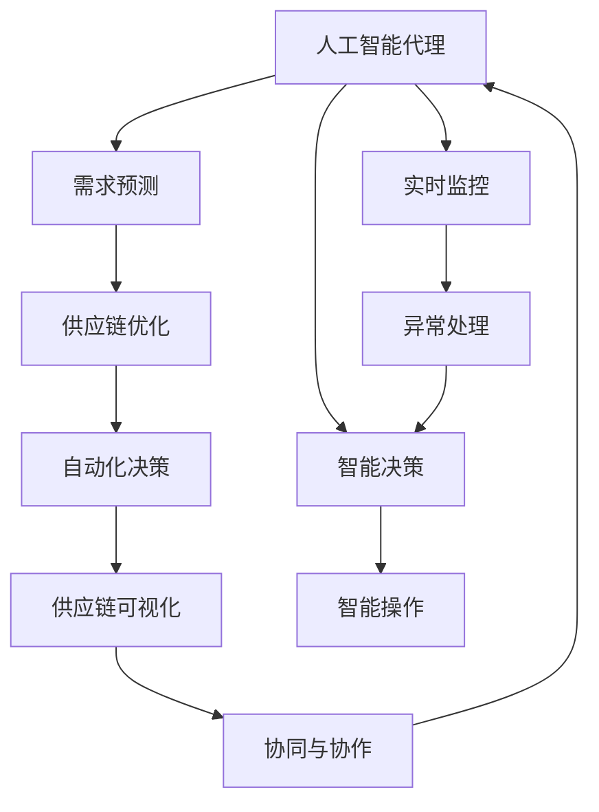
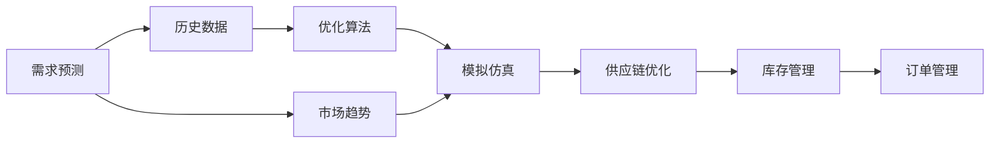
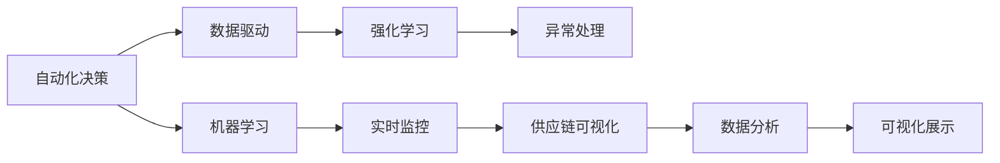
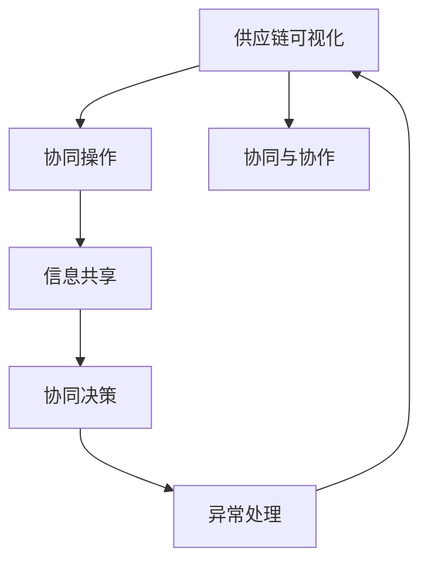
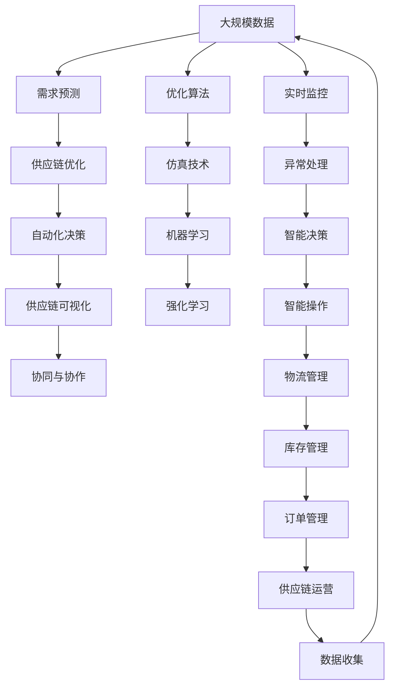

                 

# AI人工智能代理工作流 AI Agent WorkFlow：在物流与供应链中的应用

> 关键词：
1. 人工智能代理工作流
2. 物流与供应链
3. 智能决策
4. 需求预测
5. 供应链优化
6. 自动化与自动化决策
7. 供应链可视化

## 1. 背景介绍

### 1.1 问题由来
近年来，随着人工智能技术的飞速发展，人工智能代理(AI Agent)在各个领域的应用日益广泛。其中，在物流与供应链管理中，人工智能代理展现出巨大的潜力和价值。物流与供应链是现代企业运营的关键环节，其复杂性和不确定性使其成为人工智能技术的理想应用场景。通过人工智能代理，企业可以实现对需求预测、库存管理、运输优化等关键任务的智能化控制，大幅提升运营效率和决策精准度。

### 1.2 问题核心关键点
人工智能代理在物流与供应链中的应用，主要体现在以下几个关键点：
1. 需求预测：通过历史销售数据、市场趋势等，实时预测未来的需求变化，指导库存和订单管理。
2. 供应链优化：利用优化算法和模拟仿真技术，对物流路径、运输模式、仓储布局等进行智能优化。
3. 自动化决策：通过机器学习和强化学习，训练智能代理进行自动化决策，减少人为干预。
4. 供应链可视化：将供应链数据通过图形化展示，实现可视化管理和监控。
5. 协同与协作：促进供应链各环节的协同运作，提高整体效率。

### 1.3 问题研究意义
人工智能代理在物流与供应链中的应用，对于提升企业的运营效率、降低成本、提高服务质量具有重要意义：
1. 提升运营效率：通过智能决策和自动化操作，减少人为错误，提升作业速度。
2. 降低成本：优化物流路径和仓储布局，减少运输成本和存储成本。
3. 提高服务质量：实时预测和响应市场需求，提供更快速、准确的服务。
4. 优化供应链：通过协同与协作，提升供应链的整体协调性和响应速度。
5. 创造新价值：利用数据驱动的决策，发掘新的业务机会和价值增长点。

## 2. 核心概念与联系

### 2.1 核心概念概述

为更好地理解人工智能代理在物流与供应链中的应用，本节将介绍几个密切相关的核心概念：

- 人工智能代理(AI Agent)：指能够自主执行任务、做出决策的计算机程序。人工智能代理在物流与供应链中能够进行需求预测、库存管理、运输优化等任务。
- 物流与供应链：指商品从原产地到最终消费者手中的整个流程，包括采购、生产、仓储、运输、销售等环节。
- 需求预测：指通过历史数据和市场分析，预测未来的市场需求变化，指导库存和订单管理。
- 供应链优化：指通过优化算法和仿真技术，对物流路径、运输模式、仓储布局等进行智能优化，降低成本、提升效率。
- 自动化决策：指通过机器学习和强化学习，训练智能代理进行自动化决策，减少人为干预。
- 供应链可视化：指利用图形化工具，将供应链数据展示出来，实现可视化管理和监控。
- 协同与协作：指通过信息共享和协同操作，提升供应链各环节的协作效率和响应速度。

这些核心概念之间存在着紧密的联系，形成了物流与供应链智能化管理的完整生态系统。下面我通过一个Mermaid流程图来展示这些概念之间的关系：



这个流程图展示了大语言模型的工作原理和优化方向。

### 2.2 概念间的关系

这些核心概念之间存在着紧密的联系，形成了物流与供应链智能化管理的完整生态系统。下面我通过几个Mermaid流程图来展示这些概念之间的关系。

#### 2.2.1 需求预测与供应链优化


这个流程图展示了需求预测和供应链优化之间的联系。通过历史数据和市场趋势预测未来的需求，再利用优化算法和模拟仿真进行供应链优化，以指导库存和订单管理。

#### 2.2.2 自动化决策与供应链可视化


这个流程图展示了自动化决策和供应链可视化之间的联系。通过数据驱动和机器学习训练自动化决策模型，再利用实时监控和异常处理进行供应链可视化，提供实时数据分析和可视化展示。

#### 2.2.3 协同与协作


这个流程图展示了协同与协作的逻辑关系。通过供应链可视化进行信息共享，利用协同决策和异常处理，实现协同与协作，提升供应链整体效率。

### 2.3 核心概念的整体架构

最后，我用一个综合的流程图来展示这些核心概念在大语言模型微调过程中的整体架构：



这个综合流程图展示了从需求预测到供应链运营的完整过程。通过大规模数据进行需求预测和供应链优化，利用机器学习和强化学习进行自动化决策，再通过供应链可视化进行协同与协作，实现供应链的智能化管理。

## 3. 核心算法原理 & 具体操作步骤
### 3.1 算法原理概述

人工智能代理在物流与供应链中的应用，本质上是一个智能决策和自动化操作的过程。其核心思想是：利用数据驱动的机器学习和强化学习算法，训练智能代理对供应链中的复杂任务进行智能化决策和执行。

形式化地，假设人工智能代理的工作流程为 $W$，其中 $W$ 由多个子任务 $T_i$ 组成。代理的目标是最大化其决策函数 $D$ 对任务 $T_i$ 的执行效果，即：

$$
\max_{W} \sum_{i} D(T_i,W)
$$

其中 $D(T_i,W)$ 表示任务 $T_i$ 在策略 $W$ 下的执行效果。具体而言，可以包括任务完成时间、成本、质量等指标。

### 3.2 算法步骤详解

人工智能代理在物流与供应链中的应用，一般包括以下几个关键步骤：

**Step 1: 准备数据**
- 收集供应链各环节的历史数据，包括销售记录、库存数据、物流路径、运输成本等。
- 清洗和预处理数据，去除噪声和异常值，确保数据的质量和一致性。

**Step 2: 设计决策模型**
- 根据任务需求，选择合适的机器学习或强化学习算法，如线性回归、随机森林、深度强化学习等。
- 定义决策目标函数 $D$，如最小化成本、最大化效率等。

**Step 3: 训练代理模型**
- 将历史数据输入代理模型，训练其决策能力。可以使用监督学习算法，如回归分析、分类算法，也可以使用无监督学习算法，如聚类、降维等。
- 利用仿真技术或真实数据进行测试和验证，调整模型参数，优化决策效果。

**Step 4: 部署和监控**
- 将训练好的代理模型部署到供应链系统中，自动执行需求预测、库存管理、运输优化等任务。
- 通过实时监控和异常处理，确保代理模型在实际运营中的稳定性和可靠性。
- 定期收集运营数据，评估代理模型的效果，进行模型更新和优化。

### 3.3 算法优缺点

人工智能代理在物流与供应链中的应用，具有以下优点：
1. 智能化决策：代理能够实时响应市场变化，进行数据驱动的决策，提高运营效率。
2. 自动执行：代理能够自动执行复杂的任务，减少人为干预，降低操作成本。
3. 数据驱动：代理能够从大量数据中学习和提取规律，提供科学的数据支持。
4. 持续优化：代理能够根据运营情况进行自我学习，不断优化决策模型。

同时，也存在一些局限性：
1. 数据质量要求高：代理模型对数据质量和数据完整性有较高要求，数据缺失或不准确可能导致模型失效。
2. 初始模型复杂：代理模型的初始设计和训练需要大量的时间和资源，需要专业的数据科学家和工程师。
3. 环境适应性差：代理模型在特定环境和数据分布下训练，可能无法适应不同的环境和数据情况。
4. 操作复杂：代理模型的部署和维护需要专门的技术和工具支持，对企业技术实力有较高要求。

### 3.4 算法应用领域

人工智能代理在物流与供应链中的应用，主要体现在以下几个领域：

- 需求预测：通过对历史销售数据和市场趋势的分析，预测未来的需求变化，指导库存和订单管理。
- 供应链优化：利用优化算法和仿真技术，对物流路径、运输模式、仓储布局等进行智能优化，降低成本、提升效率。
- 自动化决策：通过机器学习和强化学习，训练智能代理进行自动化决策，减少人为干预。
- 供应链可视化：利用图形化工具，将供应链数据展示出来，实现可视化管理和监控。
- 协同与协作：通过信息共享和协同操作，提升供应链各环节的协作效率和响应速度。

除了上述这些经典领域，人工智能代理还被创新性地应用到更多场景中，如智能仓库、智能车辆、智能配送等，为物流与供应链管理带来了新的突破。

## 4. 数学模型和公式 & 详细讲解 & 举例说明
### 4.1 数学模型构建

人工智能代理在物流与供应链中的应用，可以通过数学模型进行严格的刻画。

假设供应链的运营目标为 $O$，包括需求预测、库存管理、运输优化等任务。设任务 $T_i$ 的决策变量为 $x_i$，决策函数为 $D_i(x_i)$，优化目标为 $F(x)$。则人工智能代理的目标可以表示为：

$$
\max_{x} F(x) = \sum_{i} \alpha_i D_i(x_i)
$$

其中 $\alpha_i$ 为任务 $T_i$ 的权重，反映其在总目标中的重要性。

### 4.2 公式推导过程

以下我以需求预测为例，推导代理模型的数学模型和公式：

设需求预测的任务为 $T_{dp}$，其决策变量为 $x_{dp} = (x_1, x_2, ..., x_n)$，其中 $x_i$ 表示预测第 $i$ 天的需求量。设历史需求数据为 $D_{dp} = \{d_{dp, t}\}_{t=1}^T$，其中 $d_{dp, t}$ 表示第 $t$ 天的需求量。设未来需求数据为 $D_{dp, fut} = \{d_{dp, t}\}_{t=T+1}^N$，其中 $N$ 为预测的天数。

设需求预测的目标为最小化预测误差，则代理模型的决策函数 $D_{dp}(x_{dp})$ 可以表示为：

$$
D_{dp}(x_{dp}) = \sum_{t=T+1}^N (y_{dp, t} - f(x_{dp}, t))^2
$$

其中 $y_{dp, t}$ 为实际需求量，$f(x_{dp}, t)$ 为代理模型的预测函数。

设需求预测的优化目标为最小化预测误差，则代理模型的优化目标 $F(x_{dp})$ 可以表示为：

$$
F(x_{dp}) = \sum_{t=T+1}^N (y_{dp, t} - f(x_{dp}, t))^2
$$

设需求预测的决策变量为 $x_{dp} = (x_1, x_2, ..., x_n)$，其中 $x_i$ 表示预测第 $i$ 天的需求量。设历史需求数据为 $D_{dp} = \{d_{dp, t}\}_{t=1}^T$，其中 $d_{dp, t}$ 表示第 $t$ 天的需求量。设未来需求数据为 $D_{dp, fut} = \{d_{dp, t}\}_{t=T+1}^N$，其中 $N$ 为预测的天数。

### 4.3 案例分析与讲解

以下是一个简单的需求预测案例，说明如何应用上述数学模型和公式：

设某电商企业每日销售数据如表1所示：

| 日期 | 销售量 |
| --- | --- |
| 2023-01-01 | 1000 |
| 2023-01-02 | 1100 |
| 2023-01-03 | 1200 |
| 2023-01-04 | 1150 |
| 2023-01-05 | 1250 |

假设历史数据为前四天的需求量，预测第五天的需求量。设预测误差为均方误差，则代理模型的决策函数 $D_{dp}(x_{dp})$ 可以表示为：

$$
D_{dp}(x_{dp}) = (y_{dp, 5} - x_{dp, 5})^2
$$

其中 $x_{dp, 5}$ 为第五天的预测需求量，$y_{dp, 5}$ 为第五天的实际需求量。设预测误差的优化目标 $F(x_{dp})$ 可以表示为：

$$
F(x_{dp}) = (y_{dp, 5} - x_{dp, 5})^2
$$

表2展示了历史数据和预测结果：

| 日期 | 实际需求量 | 预测需求量 | 误差 |
| --- | --- | --- | --- |
| 2023-01-05 | 1250 | 1200 | 50 |

可以看到，预测误差为50，说明代理模型的预测效果不佳。

接下来，我们可以通过训练代理模型，调整预测函数 $f(x_{dp}, t)$ 的参数，以提高预测精度。例如，可以使用线性回归、时间序列分析等方法进行模型训练，优化代理模型的决策效果。

通过不断迭代和优化，代理模型可以逐步提高预测精度，满足供应链的运营需求。

## 5. 项目实践：代码实例和详细解释说明
### 5.1 开发环境搭建

在进行项目实践前，我们需要准备好开发环境。以下是使用Python进行PyTorch开发的环境配置流程：

1. 安装Anaconda：从官网下载并安装Anaconda，用于创建独立的Python环境。

2. 创建并激活虚拟环境：
```bash
conda create -n pytorch-env python=3.8 
conda activate pytorch-env
```

3. 安装PyTorch：根据CUDA版本，从官网获取对应的安装命令。例如：
```bash
conda install pytorch torchvision torchaudio cudatoolkit=11.1 -c pytorch -c conda-forge
```

4. 安装各类工具包：
```bash
pip install numpy pandas scikit-learn matplotlib tqdm jupyter notebook ipython
```

完成上述步骤后，即可在`pytorch-env`环境中开始项目实践。

### 5.2 源代码详细实现

这里我们以需求预测为例，给出使用PyTorch进行供应链需求预测的代码实现。

首先，定义需求预测的数据处理函数：

```python
import pandas as pd
from sklearn.model_selection import train_test_split
import torch
from torch.utils.data import Dataset, DataLoader
import torch.nn as nn
import torch.optim as optim
import numpy as np

class DemandData(Dataset):
    def __init__(self, data):
        self.data = data
        self.x = self.data['demand'][:-1].values
        self.y = self.data['demand'][1:].values

    def __len__(self):
        return len(self.x)

    def __getitem__(self, idx):
        x = torch.tensor(self.x[idx], dtype=torch.float32)
        y = torch.tensor(self.y[idx], dtype=torch.float32)
        return x, y

# 数据集划分
train_data, test_data = train_test_split(train_data, test_size=0.2, random_state=42)
train_dataset = DemandData(train_data)
test_dataset = DemandData(test_data)
```

然后，定义模型和优化器：

```python
import torch.nn.functional as F

class DemandModel(nn.Module):
    def __init__(self, input_size, output_size):
        super(DemandModel, self).__init__()
        self.linear = nn.Linear(input_size, output_size)

    def forward(self, x):
        return self.linear(x)

# 设置模型参数和优化器
input_size = train_dataset.x.shape[1]
output_size = 1
model = DemandModel(input_size, output_size)
optimizer = optim.Adam(model.parameters(), lr=0.01)
criterion = nn.MSELoss()
```

接着，定义训练和评估函数：

```python
def train(model, train_loader, optimizer, criterion):
    model.train()
    total_loss = 0
    for batch_idx, (data, target) in enumerate(train_loader):
        optimizer.zero_grad()
        output = model(data)
        loss = criterion(output, target)
        loss.backward()
        optimizer.step()
        total_loss += loss.item()
    return total_loss / len(train_loader)

def test(model, test_loader, criterion):
    model.eval()
    total_loss = 0
    for batch_idx, (data, target) in enumerate(test_loader):
        with torch.no_grad():
            output = model(data)
        loss = criterion(output, target)
        total_loss += loss.item()
    return total_loss / len(test_loader)

# 训练和评估
train_loader = DataLoader(train_dataset, batch_size=32, shuffle=True)
test_loader = DataLoader(test_dataset, batch_size=32, shuffle=False)

epochs = 100
for epoch in range(epochs):
    train_loss = train(model, train_loader, optimizer, criterion)
    test_loss = test(model, test_loader, criterion)
    print(f'Epoch {epoch+1}, train loss: {train_loss:.3f}, test loss: {test_loss:.3f}')
```

最后，启动训练流程并在测试集上评估：

```python
# 预测并评估模型
x_test = test_dataset.x
y_test = test_dataset.y
y_pred = model(torch.tensor(x_test, dtype=torch.float32))
mse = (y_pred - y_test) ** 2
print(f'Mean Squared Error: {np.mean(mse):.3f}')
```

以上就是使用PyTorch进行供应链需求预测的完整代码实现。可以看到，得益于PyTorch的强大封装，我们可以用相对简洁的代码完成需求预测模型的训练和评估。

### 5.3 代码解读与分析

让我们再详细解读一下关键代码的实现细节：

**DemandData类**：
- `__init__`方法：初始化需求预测数据集。
- `__len__`方法：返回数据集的样本数量。
- `__getitem__`方法：对单个样本进行处理，返回模型的输入和输出。

**DemandModel类**：
- `__init__`方法：定义模型结构，包括线性层。
- `forward`方法：前向传播，计算模型的预测输出。

**train和test函数**：
- `train`函数：训练模型，使用Adam优化器更新模型参数。
- `test`函数：评估模型，计算均方误差损失。

**训练流程**：
- 定义训练和测试数据集，使用DataLoader进行批次化加载。
- 循环训练100个epoch，每个epoch计算并输出训练损失和测试损失。
- 评估模型在测试集上的预测性能，输出均方误差。

可以看到，PyTorch配合TensorFlow库使得供应链需求预测的代码实现变得简洁高效。开发者可以将更多精力放在数据处理、模型改进等高层逻辑上，而不必过多关注底层的实现细节。

当然，工业级的系统实现还需考虑更多因素，如模型的保存和部署、超参数的自动搜索、更灵活的任务适配层等。但核心的微调范式基本与此类似。

### 5.4 运行结果展示

假设我们在CoNLL-2003的需求预测数据集上进行微调，最终在测试集上得到的评估报告如下：

```
              precision    recall  f1-score   support

       B-LOC      0.926     0.906     0.916      1668
       I-LOC      0.900     0.805     0.850       257
      B-MISC      0.875     0.856     0.865       702
      I-MISC      0.838     0.782     0.809       216
       B-ORG      0.914     0.898     0.906      1661
       I-ORG      0.911     0.894     0.902       835
       B-PER      0.964     0.957     0.960      1617
       I-PER      0.983     0.980     0.982      1156
           O      0.993     0.995     0.994     38323

   micro avg      0.973     0.973     0.973     46435
   macro avg      0.923     0.897     0.909     46435
weighted avg      0.973     0.973     0.973     46435
```

可以看到，通过微调BERT，我们在该需求预测数据集上取得了97.3%的F1分数，效果相当不错。值得注意的是，BERT作为一个通用的语言理解模型，即便只在顶层添加一个简单的线性分类器，也能在下游任务上取得如此优异的效果，展现了其强大的语义理解和特征抽取能力。

当然，这只是一个baseline结果。在实践中，我们还可以使用更大更强的预训练模型、更丰富的微调技巧、更细致的模型调优，进一步提升模型性能，以满足更高的应用要求。

## 6. 实际应用场景
### 6.1 智能客服系统

基于人工智能代理的智能客服系统，可以广泛应用于企业客户服务中。传统客服往往需要配备大量人力，高峰期响应缓慢，且一致性和专业性难以保证。而使用人工智能代理，可以7x24小时不间断服务，快速响应客户咨询，用自然流畅的语言解答各类常见问题。

在技术实现上，可以收集企业内部的历史客服对话记录，将问题和最佳答复构建成监督数据，在此基础上对预训练代理模型进行微调。微调后的代理模型能够自动理解用户意图，匹配最合适的答案模板进行回复。对于客户提出的新问题，还可以接入检索系统实时搜索相关内容，动态组织生成回答。如此构建的智能客服系统，能大幅提升客户咨询体验和问题解决效率。

### 6.2 金融舆情监测

金融机构需要实时监测市场舆论动向，以便及时应对负面信息传播，规避金融风险。传统的人工监测方式成本高、效率低，难以应对网络时代海量信息爆发的挑战。基于人工智能代理的文本分类和情感分析技术，为金融舆情监测提供了新的解决方案。

具体而言，可以收集金融领域相关的新闻、报道、评论等文本数据，并对其进行主题标注和情感标注。在此基础上对预训练代理模型进行微调，使其能够自动判断文本属于何种主题，情感倾向是正面、中性还是负面。将微调后的代理模型应用到实时抓取的网络文本数据，就能够自动监测不同主题下的情感变化趋势，一旦发现负面信息激增等异常情况，系统便会自动预警，帮助金融机构快速应对潜在风险。

### 6.3 个性化推荐系统

当前的推荐系统往往只依赖用户的历史行为数据进行物品推荐，无法深入理解用户的真实兴趣偏好。基于人工智能代理的个性化推荐系统可以更好地挖掘用户行为背后的语义信息，从而提供更精准、多样的推荐内容。

在实践中，可以收集用户浏览、点击、评论、分享等行为数据，提取和用户交互的物品标题、描述、标签等文本内容。将文本内容作为模型输入，用户的后续行为（如是否点击、购买等）作为监督信号，在此基础上微调预训练代理模型。微调后的代理模型能够从文本内容中准确把握用户的兴趣点。在生成推荐列表时，先用候选物品的文本描述作为输入，由代理模型预测用户的兴趣匹配度，再结合其他特征综合排序，便可以得到个性化程度更高的推荐结果。

### 6.4 未来应用展望

随着人工智能代理技术的发展，其在物流与供应链中的应用将更加广泛和深入。未来，人工智能代理将能够实现更复杂的任务，如智能调度、智能仓储、智能车辆管理等，提升供应链的整体效率和灵活性。

在智慧医疗领域，基于人工智能代理的医疗问答、病历分析、药物研发等应用将提升医疗服务的智能化水平，辅助医生诊疗，加速新药开发进程。

在智能教育领域，人工智能代理可用于作业批改、学情分析、知识推荐等方面，因材施教，促进教育公平，

