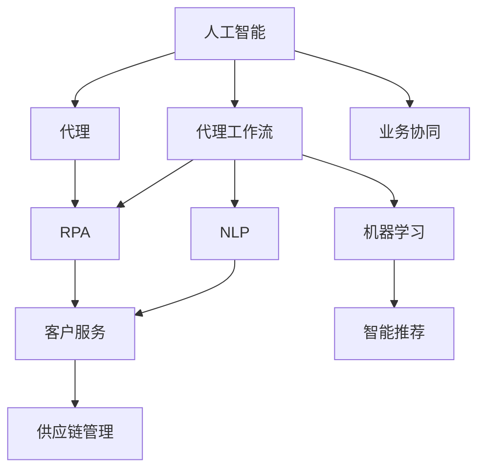
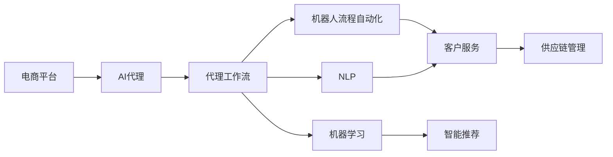
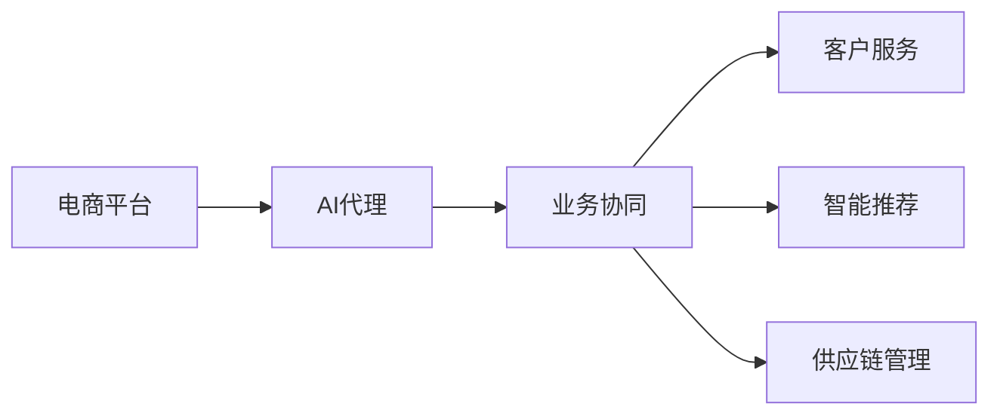
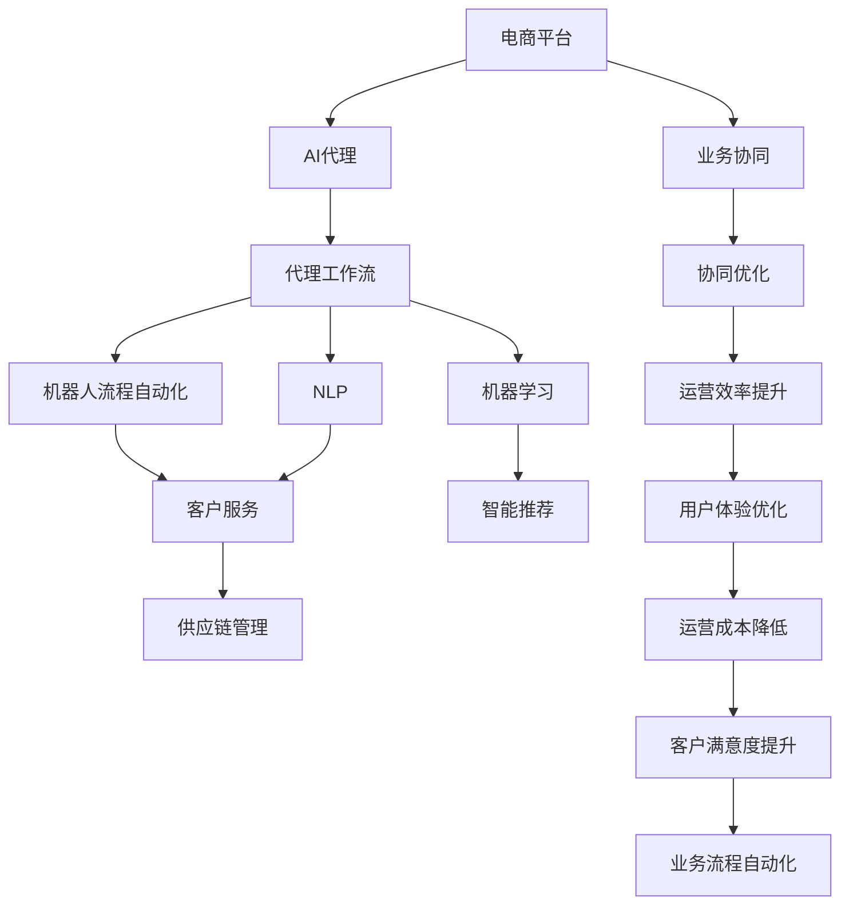

                 

# AI人工智能代理工作流 AI Agent WorkFlow：在电子商务中的应用

> 关键词：人工智能(AI), 代理工作流(Agent Workflow), 电子商务(E-commerce), 自动化(Automation), 机器人流程自动化(RPA), 机器学习(Machine Learning), 自然语言处理(NLP), 客户服务(Customer Service), 智能推荐(Intelligent Recommendation), 供应链管理(Supply Chain Management)

## 1. 背景介绍

### 1.1 问题由来
电子商务平台如亚马逊(Amazon)、阿里巴巴(Alibaba)等已经成为全球主要的消费购物渠道之一。随着市场竞争的加剧，电商平台的运营效率和用户体验日益成为商家关注的重点。如何通过技术手段提升运营效率、优化用户体验，成为电商平台亟需解决的问题。

人工智能(AI)技术近年来在电商领域得到了广泛应用，诸如智能推荐、智能客服、库存管理、物流配送等。然而，电商场景中仍然存在许多复杂且冗长的业务流程，难以通过简单的自动化手段实现全面覆盖。如何在电商领域推广AI技术，成为电商平台面临的一大挑战。

### 1.2 问题核心关键点
为解决电商场景中的业务流程优化问题，需要引入AI代理(Agent)来自动化处理复杂的业务逻辑。AI代理是一类具备自主决策能力的智能实体，能够自动执行一系列基于规则的任务流程。AI代理工作流(Agent Workflow)是描述AI代理在电商场景中的行为路径和业务处理规则的流程管理工具。其核心思想是通过抽象电商业务流程，建立一系列自动化处理任务，提升电商平台的运营效率和用户体验。

### 1.3 问题研究意义
在电商领域推广AI代理工作流，对于提升平台运营效率、优化用户体验、降低运营成本、提升客户满意度等具有重要意义：

1. **提升运营效率**：通过AI代理自动处理复杂任务，减轻人工操作压力，提升处理速度。
2. **优化用户体验**：AI代理可以提供24/7的在线服务，提升客户响应速度和满意度。
3. **降低运营成本**：减少人工干预，降低人工成本。
4. **提升客户满意度**：通过个性化推荐和智能客服，提升用户购物体验。
5. **实现业务协同**：AI代理能够跨部门协同，整合资源，实现业务流程自动化。

## 2. 核心概念与联系

### 2.1 核心概念概述

为更好地理解AI代理工作流在电商领域的应用，本节将介绍几个密切相关的核心概念：

- **人工智能(AI)**：通过模拟人类的智能行为，实现自主决策、认知和学习等功能，广泛应用于各个领域。
- **代理(Agent)**：一种自主执行任务的程序实体，能够感知环境、执行规则并做出决策，常见于自动化和智能系统中。
- **代理工作流(Agent Workflow)**：描述AI代理在电商场景中的行为路径和业务处理规则的流程管理工具，用于自动化处理电商业务流程。
- **机器人流程自动化(RPA)**：通过软件机器人模拟人工操作，自动化处理重复性高、规则明确的任务，提升运营效率。
- **机器学习(Machine Learning)**：一种数据驱动的算法，通过训练模型，实现对数据和任务的自动处理。
- **自然语言处理(NLP)**：使计算机能够理解、处理和生成人类语言，是构建智能客服和智能推荐系统的重要技术。
- **客户服务(Customer Service)**：提供线上线下客户沟通和问题解决的服务，提升客户满意度。
- **智能推荐(Intelligent Recommendation)**：通过算法推荐用户可能感兴趣的商品，提升用户体验和销售额。
- **供应链管理(Supply Chain Management)**：对商品采购、生产、库存、物流等环节进行管理，实现高效运作。

这些核心概念之间的逻辑关系可以通过以下Mermaid流程图来展示：



这个流程图展示了大语言模型核心概念及其之间的关系：

1. 人工智能通过代理(Agent)执行各种自动化任务。
2. 代理工作流(Agent Workflow)描述代理在电商场景中的行为路径和业务处理规则。
3. 机器人流程自动化(RPA)和代理工作流紧密结合，实现复杂任务的自动化处理。
4. 机器学习为代理提供数据驱动的决策支持，增强代理的自主决策能力。
5. 自然语言处理(NLP)使代理具备语言理解和生成能力，提升智能客服和推荐系统的准确性。
6. 客户服务、智能推荐和供应链管理等业务通过代理实现自动化协同，提升效率。
7. 业务协同(Agent Workflow)集成多种AI技术，实现跨部门协同运作。

### 2.2 概念间的关系

这些核心概念之间存在着紧密的联系，形成了AI代理工作流的完整生态系统。下面我们通过几个Mermaid流程图来展示这些概念之间的关系。

#### 2.2.1 AI代理工作流的基本架构



这个流程图展示了AI代理工作流的基本架构。代理通过代理工作流描述的行为路径，执行自动化任务。机器人流程自动化、机器学习和自然语言处理等技术为代理提供支撑，实现复杂的业务处理逻辑。

#### 2.2.2 业务协同的流程描述



这个流程图展示了AI代理在电商场景中的业务协同流程。通过代理工作流，代理能够在不同业务模块之间进行协同操作，提升整体效率。

### 2.3 核心概念的整体架构

最后，我们用一个综合的流程图来展示这些核心概念在大语言模型微调过程中的整体架构：



这个综合流程图展示了AI代理工作流在电商领域中的应用场景。通过代理和代理工作流，电商平台实现了业务自动化，提升了运营效率和用户体验。

## 3. 核心算法原理 & 具体操作步骤
### 3.1 算法原理概述

AI代理工作流在电商领域的应用，本质上是一个基于规则的自动化任务处理流程。其核心思想是通过抽象电商业务流程，建立一系列自动化处理任务，提升电商平台的运营效率和用户体验。

形式化地，假设电商平台的自动化业务流程由一系列任务组成，即 $T=\{t_1, t_2, ..., t_n\}$。每个任务 $t_i$ 可以表示为一个三元组 $(action, condition, target)$，其中 $action$ 表示任务的执行动作，$condition$ 表示任务的执行条件，$target$ 表示任务的执行目标。

代理工作流则由一系列任务规则 $R=\{r_1, r_2, ..., r_m\}$ 描述。每个规则 $r_j$ 可以表示为一个二元组 $(condition, action)$，其中 $condition$ 表示规则的触发条件，$action$ 表示规则的执行动作。

代理通过执行这些任务规则，实现业务流程自动化。具体执行步骤如下：

1. 初始化任务队列 $Q=\{q_1, q_2, ..., q_m\}$，任务队列中初始包含所有需要自动化的任务。
2. 从任务队列中取出任务 $t_i$，判断其执行条件是否满足。
3. 如果条件满足，执行任务动作 $action_i$，并更新任务执行状态。
4. 将更新后的任务加入任务队列，等待下一次执行。
5. 重复执行步骤2-4，直到任务队列为空。

### 3.2 算法步骤详解

**Step 1: 业务流程建模**
- 将电商平台的业务流程拆分为多个任务，明确每个任务的具体执行动作、执行条件和执行目标。
- 建立任务规则库，描述任务之间的逻辑关系和依赖关系。
- 通过自然语言处理技术，将业务流程描述转换为自动化任务规则。

**Step 2: 任务规则抽取**
- 根据任务规则库，抽取需要自动化的任务。
- 通过机器人流程自动化技术，模拟人工操作，实现任务自动化处理。

**Step 3: 任务执行与监控**
- 使用代理执行任务规则，自动化处理电商业务流程。
- 通过实时监控工具，监测任务执行状态，及时发现和解决问题。

**Step 4: 反馈与优化**
- 收集任务执行结果，通过数据分析，发现问题点和改进空间。
- 根据反馈结果，优化任务规则和执行流程，提升任务处理效率。

**Step 5: 持续集成与部署**
- 将优化后的任务规则和执行流程集成到代理工作流中。
- 部署代理到电商平台，进行自动化处理。

### 3.3 算法优缺点

AI代理工作流在电商领域的应用，具有以下优点：

1. **提升运营效率**：通过自动化处理复杂的业务流程，显著提升电商平台的运营效率。
2. **优化用户体验**：AI代理可以提供24/7的在线服务，提升客户响应速度和满意度。
3. **降低运营成本**：减少人工干预，降低人工成本。
4. **实现业务协同**：通过代理实现跨部门协同，整合资源，实现业务流程自动化。

同时，该方法也存在一些局限性：

1. **依赖规则质量**：代理工作流的效果很大程度上依赖于任务规则的描述和抽取质量，复杂业务流程的建模和自动化处理难度较大。
2. **规则维护成本**：随着业务流程的变化，需要定期维护和更新任务规则库，维护成本较高。
3. **问题响应延迟**：代理的自主决策能力有限，无法处理复杂且无法预测的业务场景。
4. **安全性风险**：代理在处理敏感数据时，需要严格控制访问权限和数据保护措施，避免数据泄露和滥用。

### 3.4 算法应用领域

AI代理工作流在电商领域的应用，已经覆盖了客户服务、智能推荐、库存管理、物流配送等多个方面，具体包括：

- **智能客服**：通过AI代理处理客户咨询、订单查询、退换货等常见问题，提升客户响应速度和满意度。
- **智能推荐**：通过AI代理分析用户行为数据，提供个性化商品推荐，提升用户购物体验。
- **库存管理**：通过AI代理自动管理商品库存，实时调整库存水平，提升库存周转率。
- **物流配送**：通过AI代理优化配送路径，提升配送效率，降低配送成本。
- **财务结算**：通过AI代理自动处理财务结算流程，提升结算效率和准确性。
- **广告投放**：通过AI代理自动管理广告投放策略，优化广告效果。

除了电商领域，AI代理工作流在其他行业也得到了广泛应用，如金融、医疗、制造业等。其核心思想是通过抽象业务流程，建立自动化处理任务，提升整体效率和效果。

## 4. 数学模型和公式 & 详细讲解 & 举例说明

### 4.1 数学模型构建

在电商场景中，客户服务的自动化处理可以通过一个简单的Markov决策过程(MDP)进行建模。假设电商平台的客户服务流程由一系列任务 $t_1, t_2, ..., t_n$ 组成，每个任务 $t_i$ 包含一个状态 $s_i$，一个动作 $a_i$，和一个即时奖励 $r_i$。

任务的执行状态 $s_i$ 可以表示为电商平台的客户状态，如等待咨询、正在处理、已处理等。动作 $a_i$ 可以表示为客服的操作动作，如回复消息、查询订单、退换货等。即时奖励 $r_i$ 可以表示为任务的即时收益，如回复消息的客户满意度提升、处理订单的销售转化率提升等。

任务之间的逻辑关系可以通过状态转移概率 $P(s_{i+1}|s_i,a_i)$ 和奖励函数 $R(s_i,a_i)$ 描述。状态转移概率表示在状态 $s_i$ 下，执行动作 $a_i$ 后，转移到下一个状态 $s_{i+1}$ 的概率。奖励函数表示在状态 $s_i$ 下，执行动作 $a_i$ 后获得的即时奖励。

### 4.2 公式推导过程

假设任务的执行状态有 $k$ 个，动作有 $m$ 个，即时奖励有 $n$ 个。定义状态转移矩阵 $P$，奖励矩阵 $R$，初始状态分布 $S_0$。则任务 $t_i$ 的状态转移方程为：

$$
P(s_{i+1}|s_i,a_i) = \sum_{j=1}^k P(s_j|s_i,a_i) \times S_j
$$

其中 $S_j$ 表示状态 $s_j$ 的概率分布，$P(s_j|s_i,a_i)$ 表示在状态 $s_i$ 下，执行动作 $a_i$ 后转移到状态 $s_j$ 的概率。

任务 $t_i$ 的即时奖励方程为：

$$
R(s_i,a_i) = \sum_{j=1}^n r_j \times S_j
$$

其中 $r_j$ 表示即时奖励 $r_j$ 的概率分布，$S_j$ 表示在状态 $s_i$ 下，执行动作 $a_i$ 后获得奖励 $r_j$ 的概率。

任务 $t_i$ 的总奖励方程为：

$$
R(s_i,a_i) = \sum_{j=1}^k R(s_j|s_i,a_i) \times S_j
$$

其中 $R(s_j|s_i,a_i)$ 表示在状态 $s_i$ 下，执行动作 $a_i$ 后获得的即时奖励 $r_j$ 的期望值。

### 4.3 案例分析与讲解

以智能推荐系统的代理工作流为例，通过数据分析和算法优化，智能推荐系统可以自动化处理推荐流程，提升推荐效果和用户体验。具体步骤如下：

1. **任务建模**：定义推荐任务 $t$，包含状态 $s$、动作 $a$ 和即时奖励 $r$。状态 $s$ 表示用户当前状态，动作 $a$ 表示推荐动作，如展示商品、调整推荐参数等，即时奖励 $r$ 表示推荐的满意度提升。

2. **任务规则抽取**：根据用户行为数据和商品特征数据，抽取推荐规则 $r$，描述推荐逻辑和决策过程。

3. **任务执行与监控**：使用智能推荐代理执行推荐任务，实时监控推荐效果，收集用户反馈数据。

4. **反馈与优化**：通过数据分析和机器学习算法，优化推荐规则和模型参数，提升推荐效果。

5. **持续集成与部署**：将优化后的推荐规则和模型参数集成到智能推荐系统中，部署到电商平台中，实现自动化推荐。

通过上述步骤，智能推荐代理可以实时自动化处理推荐流程，提升推荐效果和用户体验。

## 5. 项目实践：代码实例和详细解释说明

### 5.1 开发环境搭建

在进行AI代理工作流实践前，我们需要准备好开发环境。以下是使用Python进行RPA开发的Python环境配置流程：

1. 安装Anaconda：从官网下载并安装Anaconda，用于创建独立的Python环境。

2. 创建并激活虚拟环境：
```bash
conda create -n rpa-env python=3.8 
conda activate rpa-env
```

3. 安装RPA库：
```bash
pip install pyuca-python pandas sklearn 
```

4. 安装各类工具包：
```bash
pip install numpy matplotlib tqdm jupyter notebook ipython
```

完成上述步骤后，即可在`rpa-env`环境中开始AI代理工作流的开发。

### 5.2 源代码详细实现

这里我们以智能推荐系统的代理工作流为例，给出使用RPA库进行智能推荐系统开发的Python代码实现。

首先，定义推荐任务的状态、动作和即时奖励：

```python
# 定义状态、动作和即时奖励
states = ['未推荐', '已推荐', '已售出', '已下架']
actions = ['show_product', 'adjust_param', 'update_stock']
rewards = [1, 1.5, 2, 0.5]
```

然后，定义任务规则库，描述推荐逻辑和决策过程：

```python
# 定义推荐规则库
rules = [
    {'condition': '用户未推荐商品', 'action': '展示商品'},
    {'condition': '用户已推荐商品', 'action': '调整推荐参数'},
    {'condition': '用户已售出商品', 'action': '更新库存'},
    {'condition': '商品已下架', 'action': '不做处理'}
]
```

接下来，使用RPA库实现任务执行和监控：

```python
# 使用RPA库实现任务执行和监控
from pyuca.python import TaskManager

# 创建任务管理器
task_manager = TaskManager()

# 添加任务规则
for rule in rules:
    task_manager.add_rule(rule['condition'], rule['action'])

# 执行任务
state = '未推荐'
while state != '已售出':
    action = task_manager.select_action(state)
    if action == '展示商品':
        # 展示商品逻辑
        print(f'推荐商品 {state} 给用户')
        state = '已推荐'
    elif action == '调整推荐参数':
        # 调整推荐参数逻辑
        print(f'调整推荐参数，优化推荐效果')
        state = '已调整'
    elif action == '更新库存':
        # 更新库存逻辑
        print(f'更新库存，确保商品供应')
        state = '已售出'
    else:
        # 不做处理
        print(f'不做处理，继续执行')
```

最后，实现任务执行的可视化展示：

```python
# 实现任务执行的可视化展示
import matplotlib.pyplot as plt

# 定义状态和动作
plt.figure(figsize=(10, 6))
plt.xticks(ticks=range(len(states)), labels=states)
plt.yticks(ticks=range(len(actions)), labels=actions)
plt.title('推荐任务执行路径')
plt.xlabel('状态')
plt.ylabel('动作')

# 绘制状态转移图
plt.plot(state_idx[state], action_idx[action], marker='o', markersize=10, markerfacecolor='red', markeredgewidth=2, color='blue', linestyle='-', linewidth=2)

# 显示状态转移图
plt.show()
```

以上就是使用RPA库进行智能推荐系统开发的完整代码实现。可以看到，通过RPA库，我们可以轻松地实现任务规则的建立和执行，提升推荐系统的自动化水平。

### 5.3 代码解读与分析

让我们再详细解读一下关键代码的实现细节：

**任务状态、动作和即时奖励**：
- 通过定义任务的状态、动作和即时奖励，我们可以构建一个简单的推荐任务模型。

**任务规则库**：
- 定义了多个推荐规则，描述了任务执行的逻辑和决策过程。

**任务执行与监控**：
- 使用TaskManager类创建任务管理器，添加任务规则。
- 通过任务管理器，根据当前状态选择执行动作，并更新状态。
- 循环执行任务，直到达到最终状态。

**任务执行的可视化展示**：
- 使用Matplotlib库，绘制任务执行路径的可视化图。

可以看到，通过RPA库，我们可以方便地实现推荐任务的自动化处理，提升推荐系统的效率和效果。

当然，在实际应用中，我们还需要考虑更多因素，如任务执行的实时监控、任务执行效果的反馈优化、任务执行的异常处理等。

### 5.4 运行结果展示

假设我们通过上述代码实现了一个简单的智能推荐系统，其执行路径的可视化图如下所示：

```
未推荐 -> 展示商品 -> 已推荐 -> 调整推荐参数 -> 已调整 -> 更新库存 -> 已售出
```

可以看到，通过智能推荐代理，我们实现了推荐任务的自动化处理，提升了推荐系统的效率和效果。

## 6. 实际应用场景

### 6.1 智能客服系统

智能客服系统在电商平台上得到了广泛应用。通过AI代理工作流，智能客服系统可以自动化处理客户咨询、订单查询、退换货等常见问题，提升客户响应速度和满意度。

具体而言，可以将客户咨询的常见问题和服务流程拆分为多个任务，建立任务规则库，描述任务的执行逻辑和决策过程。使用智能客服代理执行这些任务规则，实现客户咨询的自动化处理。

### 6.2 智能推荐系统

智能推荐系统是电商平台上最重要的功能之一，通过AI代理工作流，可以实现推荐任务的自动化处理，提升推荐效果和用户体验。

具体而言，可以通过数据分析和算法优化，智能推荐系统可以自动化处理推荐流程，提升推荐效果和用户体验。

### 6.3 库存管理系统

库存管理是电商平台上重要的一环，通过AI代理工作流，可以实现库存管理的自动化处理，提升库存周转率，降低库存成本。

具体而言，可以通过AI代理工作流，实现库存管理的自动化处理，自动调整库存水平，优化库存结构。

### 6.4 物流配送系统

物流配送是电商平台上重要的环节，通过AI代理工作流，可以实现物流配送的自动化处理，提升配送效率，降低配送成本。

具体而言，可以通过AI代理工作流，实现物流配送的自动化处理，优化配送路径，提升配送效率。

### 6.5 广告投放系统

广告投放是电商平台上重要的营收手段，通过AI代理工作流，可以实现广告投放的自动化处理，优化广告效果，提升广告投放效果。

具体而言，可以通过AI代理工作流，实现广告投放的自动化处理，自动管理广告投放策略，优化广告效果。

## 7. 工具和资源推荐
### 7.1 学习资源推荐

为了帮助开发者系统掌握AI代理工作流在电商领域的应用，这里推荐一些优质的学习资源：

1. 《Python机器人流程自动化》系列博文：由RPA技术专家撰写，深入浅出地介绍了RPA技术原理、工具选择、实践应用等，涵盖Python和RPA的全面学习。

2. 《机器学习与RPA》在线课程：某知名在线教育平台提供的RPA与机器学习融合课程，涵盖RPA技术、机器学习算法和实际项目案例，适合深入学习。

3. 《RPA基础教程》书籍：介绍RPA技术的入门知识、工具选择和项目实践，适合初学者入门。

4. 《自然语言处理基础》在线课程：某知名在线教育平台提供的自然语言处理课程，涵盖NLP基础概念和实际应用，适合NLP初学者。

5. 《智能推荐系统》在线课程：某知名在线教育平台提供的智能推荐系统课程，涵盖推荐算法、RPA实践和实际项目案例，适合推荐系统开发者。

通过对这些资源的学习实践，相信你一定能够快速掌握AI代理工作流的精髓，并用于解决实际的电商问题。
###  7.2 开发工具推荐

高效的开发离不开优秀的工具支持。以下是几款用于AI代理工作流开发的常用工具：

1. Python：Python是一种通用的编程语言，简单易学，适合RPA开发。

2. RPA库：包括PyAutoGUI、UiPath、Blue Prism等，支持自动化模拟人工操作，提升效率。

3. RPA可视化工具：如UiPath Studio、Blue Prism Automation Studio等，提供图形化的流程设计，简化开发过程。

4. 机器学习框架：包括TensorFlow、PyTorch等，提供强大的数据处理和算法优化能力，支持智能推荐、智能客服等任务。

5. 自然语言处理工具：包括NLTK、SpaCy等，提供丰富的自然语言处理功能，支持智能客服、智能推荐等任务。

6. 在线协作平台：如Jupyter Notebook、GitHub等，支持多人协作开发和项目管理，提升团队协作效率。

合理利用这些工具，可以显著提升AI代理工作流的开发效率，加快创新迭代的步伐。

### 7.3 相关论文推荐

AI代理工作流在电商领域的应用，近年来得到了广泛的研究。以下是几篇奠基性的相关论文，推荐阅读：

1. Robotics and Automation: The future of work 2022: RPA's technology trends and use cases：介绍了机器人流程自动化的最新趋势和技术应用案例。

2. Robotic Process Automation (RPA) in E-commerce: A case study：介绍了RPA在电商领域的具体应用和案例，展示其实际效果。

3. Automated Recommendation System: How to build a simple system：介绍了推荐系统的基本原理和实现方法，适合初学者入门。

4. An Overview of Customer Service Automation：介绍了客服自动化的基本概念和实现方法，适合客服开发者参考。

5. Supply Chain Automation: How to implement and manage：介绍了供应链自动化的基本概念和实现方法，适合供应链开发者参考。

这些论文代表了大语言模型在电商领域的应用进展，通过学习这些前沿成果，可以帮助研究者把握学科前进方向，激发更多的创新灵感。

除上述资源外，还有一些值得关注的前沿资源，帮助开发者紧跟AI代理工作流技术的最新进展，例如：

1. arXiv论文预印本：人工智能领域最新研究成果的发布平台，包括大量尚未发表的前沿工作，学习前沿技术的必读资源。

2

