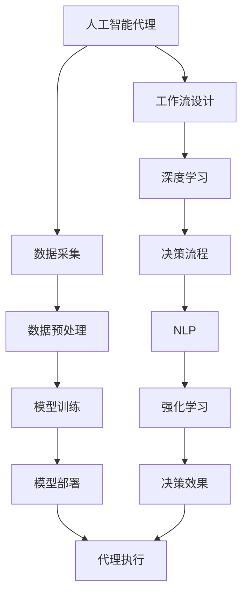
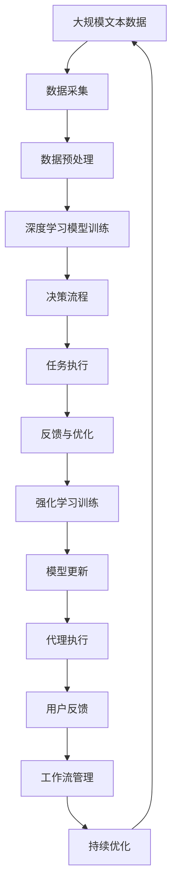

                 

# AI人工智能代理工作流AI Agent WorkFlow：深度学习技术加强代理决策流程

> 关键词：人工智能代理, 工作流设计, 深度学习, 决策流程, 代理系统, 自然语言处理, 强化学习, 智能代理, 自动化, 机器学习

## 1. 背景介绍

### 1.1 问题由来
随着人工智能（AI）技术的快速发展和广泛应用，智能代理（AI Agent）已成为自动化流程管理、智能决策支持、个性化服务等多个领域的重要技术手段。AI代理可以自动执行多种任务，从简单的数据收集到复杂的任务自动化决策。然而，尽管AI代理已经展现了强大的能力，其决策流程仍然存在诸多挑战，包括复杂任务的自动化处理、决策过程的可解释性、以及面对新任务和新数据的适应性。

### 1.2 问题核心关键点
智能代理的核心挑战在于如何在复杂的任务环境中进行智能决策，同时保证决策过程的透明性和可解释性。深度学习技术通过其强大的特征提取和模式识别能力，在解决这一问题上显示出了巨大的潜力。本文旨在探讨深度学习技术如何被应用于智能代理的工作流程中，以增强其决策能力。

### 1.3 问题研究意义
深入研究深度学习技术在智能代理工作流程中的应用，对于提升代理系统的决策性能、提高自动化流程的效率和可靠性、以及增强系统的透明度和可解释性具有重要意义。

1. 提升决策性能：通过深度学习模型的训练，智能代理可以更好地理解和处理复杂的决策环境，从而提高决策的准确性和效率。
2. 提高效率和可靠性：深度学习技术可以实现代理系统的自动化和连续学习，减少人工干预，提高流程的效率和稳定性。
3. 增强透明度和可解释性：深度学习模型可以通过可视化工具和解释性技术，帮助用户理解代理系统的决策过程，提升系统的可信度。

## 2. 核心概念与联系

### 2.1 核心概念概述

为了更好地理解深度学习技术在智能代理决策流程中的应用，本节将介绍几个密切相关的核心概念：

- **人工智能代理（AI Agent）**：指能够自主执行特定任务或一组任务的计算机程序或软件系统。AI代理通过学习、推理和执行，在复杂的任务环境中自动做出决策。
- **工作流设计（Workflow Design）**：指设计和管理自动化流程的过程，包括任务定义、流程编排、状态监控等。
- **深度学习（Deep Learning）**：指使用多层神经网络进行数据建模和预测的机器学习技术，能够自动提取和利用数据中的复杂特征。
- **决策流程（Decision Process）**：指代理系统进行决策的步骤和方法，包括信息收集、模型预测、行动执行等。
- **自然语言处理（Natural Language Processing, NLP）**：指计算机对自然语言的理解、处理和生成技术，是智能代理进行人机交互的重要基础。
- **强化学习（Reinforcement Learning）**：指通过奖励和惩罚机制，让智能代理在环境中不断学习最优决策策略的技术。

这些核心概念之间的逻辑关系可以通过以下Mermaid流程图来展示：



这个流程图展示了大语言模型决策流程中各环节的逻辑关系：

1. 智能代理通过数据采集和预处理获取数据。
2. 使用深度学习模型对数据进行处理，提取特征。
3. 在决策流程中，智能代理根据提取的特征进行决策，并执行相应的任务。
4. 利用NLP技术实现人机交互，获取用户反馈。
5. 使用强化学习技术优化决策策略。
6. 通过优化后的模型重新执行代理任务，最终反馈决策效果。

### 2.2 概念间的关系

这些核心概念之间存在着紧密的联系，形成了智能代理决策流程的完整生态系统。下面是几个概念之间的关系描述：

1. **工作流设计与深度学习**：工作流设计通过规范代理的任务流程，为深度学习模型提供了明确的应用场景和目标，从而指导模型的训练和优化。
2. **决策流程与自然语言处理**：决策流程中，智能代理需要通过NLP技术处理用户输入的自然语言指令，并将其转换为可执行的命令。
3. **强化学习与决策效果**：强化学习通过不断迭代优化，提升智能代理的决策效果，使得代理系统能够在实际应用中表现更佳。

### 2.3 核心概念的整体架构

最后，我们用一个综合的流程图来展示这些核心概念在大语言模型决策流程中的整体架构：



这个综合流程图展示了从数据采集到代理执行的完整过程，以及各个环节之间的循环迭代和持续优化。通过这个架构，智能代理能够不断学习新知识，优化决策流程，提升应用效果。

## 3. 核心算法原理 & 具体操作步骤

### 3.1 算法原理概述

深度学习技术在智能代理决策流程中的应用，主要通过以下几个关键步骤实现：

1. **数据采集与预处理**：收集和清洗数据，为深度学习模型提供高质量的训练数据。
2. **模型训练与特征提取**：使用深度学习模型对数据进行特征提取和训练，构建能够处理复杂任务的决策模型。
3. **决策流程设计**：设计并实现智能代理的决策流程，包括任务定义、流程编排、状态监控等。
4. **任务执行与反馈**：通过执行决策流程，代理系统完成任务，并根据用户反馈进行优化。
5. **强化学习与持续优化**：利用强化学习技术，不断调整代理的决策策略，优化决策效果。

### 3.2 算法步骤详解

以下是深度学习技术在智能代理决策流程中的应用步骤：

**Step 1: 数据采集与预处理**
- 从任务环境或用户输入中收集数据。
- 对数据进行清洗、归一化和标准化处理，去除噪声和异常值。
- 将数据划分为训练集、验证集和测试集。

**Step 2: 模型训练与特征提取**
- 选择合适的深度学习模型，如卷积神经网络（CNN）、循环神经网络（RNN）或Transformer等。
- 使用训练集数据训练模型，提取数据特征。
- 在验证集上评估模型性能，调整模型参数。

**Step 3: 决策流程设计**
- 根据任务需求，定义智能代理的任务和流程。
- 设计并实现代理的决策逻辑，包括信息收集、特征提取、模型预测和行动执行。
- 在代理执行过程中，不断监测和记录代理的状态和决策过程。

**Step 4: 任务执行与反馈**
- 执行代理的决策流程，完成任务。
- 根据用户反馈和任务执行结果，评估代理的性能。
- 根据评估结果，调整代理的决策策略，优化决策效果。

**Step 5: 强化学习与持续优化**
- 利用强化学习技术，根据用户反馈和任务执行结果，优化代理的决策策略。
- 不断迭代和优化代理的决策流程，提高代理的性能和可靠性。

### 3.3 算法优缺点

深度学习技术在智能代理决策流程中的应用具有以下优点：

1. **强大的特征提取能力**：深度学习模型能够自动提取数据中的复杂特征，提高代理系统的决策性能。
2. **适应性强**：深度学习模型可以适应不同类型的任务，增强代理系统的泛化能力。
3. **可解释性强**：通过可视化工具和解释性技术，深度学习模型能够提供决策过程的解释，提高系统的透明度和可信度。

同时，也存在一些缺点：

1. **数据依赖**：深度学习模型需要大量的标注数据进行训练，数据采集和标注成本较高。
2. **计算资源需求高**：深度学习模型通常需要高性能计算资源，对算力、内存和存储要求较高。
3. **模型复杂度高**：深度学习模型参数量庞大，训练和推理过程复杂，可能面临过拟合等问题。

### 3.4 算法应用领域

深度学习技术在智能代理决策流程中的应用领域非常广泛，以下是几个典型应用场景：

1. **自然语言处理（NLP）**：利用深度学习模型处理自然语言文本，实现智能客服、智能翻译、智能摘要等功能。
2. **图像识别**：通过卷积神经网络（CNN）等深度学习模型，实现图像分类、目标检测、人脸识别等任务。
3. **语音识别**：使用循环神经网络（RNN）或Transformer等模型，实现语音转文本、语音命令识别等功能。
4. **推荐系统**：利用深度学习模型，根据用户历史行为和偏好，进行个性化推荐。
5. **自动驾驶**：使用深度学习模型，实现车辆环境感知、路径规划和决策控制等功能。

## 4. 数学模型和公式 & 详细讲解 & 举例说明

### 4.1 数学模型构建

本节将使用数学语言对深度学习技术在智能代理决策流程中的应用进行更加严格的刻画。

设智能代理需要处理的任务为 $T$，决策流程为 $P$，数据集为 $D$，深度学习模型为 $M$。假设模型 $M$ 在数据集 $D$ 上的经验风险为 $\mathcal{L}(M,D)$，则智能代理的决策模型训练过程可以表示为：

$$
\hat{M} = \mathop{\arg\min}_{M} \mathcal{L}(M,D)
$$

其中 $\hat{M}$ 为训练后的最佳模型。

### 4.2 公式推导过程

以下是深度学习技术在智能代理决策流程中应用的数学公式推导：

**Step 1: 数据采集与预处理**
- 假设数据集 $D=\{(x_i,y_i)\}_{i=1}^N$，其中 $x_i$ 为输入数据，$y_i$ 为输出标签。
- 数据预处理公式为：
$$
x_i = \frac{x_i - \mu}{\sigma}
$$
其中 $\mu$ 为均值，$\sigma$ 为标准差。

**Step 2: 模型训练与特征提取**
- 假设使用深度学习模型 $M=\{w_j\}_{j=1}^J$，其中 $w_j$ 为第 $j$ 层的权重。
- 训练模型 $M$ 的损失函数为：
$$
\mathcal{L}(M,D) = \frac{1}{N} \sum_{i=1}^N \ell(M(x_i),y_i)
$$
其中 $\ell$ 为损失函数，如交叉熵损失、均方误差损失等。

**Step 3: 决策流程设计**
- 假设智能代理的决策流程 $P$ 包含多个步骤 $p_k$，每个步骤对应一个模型 $M_k$。
- 代理的任务定义为 $T=\{t_k\}_{k=1}^K$，每个任务 $t_k$ 对应一个目标 $y_k$。
- 代理的决策流程可以表示为：
$$
P = \{p_k, M_k, t_k\}_{k=1}^K
$$

**Step 4: 任务执行与反馈**
- 假设智能代理在每个步骤 $p_k$ 上的决策为 $\hat{y}_k = M_k(x_k)$。
- 代理的任务执行结果为 $\hat{y} = \{\hat{y}_k\}_{k=1}^K$。
- 代理的任务执行结果与目标 $y$ 的误差为：
$$
e = \frac{1}{K} \sum_{k=1}^K ||\hat{y}_k - y_k||^2
$$

**Step 5: 强化学习与持续优化**
- 假设智能代理使用强化学习算法 $A$，在每个步骤 $p_k$ 上的奖励为 $r_k$。
- 代理的强化学习过程可以表示为：
$$
A = \{r_k\}_{k=1}^K
$$
- 代理的决策策略为 $P_A = \{p_k, M_k, r_k\}_{k=1}^K$。

### 4.3 案例分析与讲解

以智能客服系统为例，以下是深度学习技术在智能客服决策流程中的具体应用：

**Step 1: 数据采集与预处理**
- 收集用户的历史聊天记录、语音输入、文本输入等数据，并将其预处理为适合深度学习模型输入的格式。
- 对数据进行清洗、归一化和标准化处理，去除噪声和异常值。
- 将数据划分为训练集、验证集和测试集。

**Step 2: 模型训练与特征提取**
- 使用卷积神经网络（CNN）对用户输入的文本数据进行特征提取。
- 使用循环神经网络（RNN）对用户语音输入进行特征提取。
- 使用Transformer模型对用户输入的对话历史进行特征提取。
- 在训练集上训练模型，提取特征。
- 在验证集上评估模型性能，调整模型参数。

**Step 3: 决策流程设计**
- 定义智能客服的任务，如用户身份验证、问题解答、情感分析等。
- 设计并实现客服的决策流程，包括信息收集、特征提取、模型预测和行动执行。
- 在客服执行过程中，不断监测和记录客服的状态和决策过程。

**Step 4: 任务执行与反馈**
- 客服执行决策流程，根据用户输入进行回复。
- 根据用户反馈和任务执行结果，评估客服的性能。
- 根据评估结果，调整客服的决策策略，优化决策效果。

**Step 5: 强化学习与持续优化**
- 利用强化学习技术，根据用户反馈和任务执行结果，优化客服的决策策略。
- 不断迭代和优化客服的决策流程，提高客服的性能和可靠性。

## 5. 项目实践：代码实例和详细解释说明

### 5.1 开发环境搭建

在进行深度学习技术在智能代理决策流程中的应用实践前，我们需要准备好开发环境。以下是使用Python进行PyTorch开发的环境配置流程：

1. 安装Anaconda：从官网下载并安装Anaconda，用于创建独立的Python环境。

2. 创建并激活虚拟环境：
```bash
conda create -n pytorch-env python=3.8 
conda activate pytorch-env
```

3. 安装PyTorch：根据CUDA版本，从官网获取对应的安装命令。例如：
```bash
conda install pytorch torchvision torchaudio cudatoolkit=11.1 -c pytorch -c conda-forge
```

4. 安装Transformers库：
```bash
pip install transformers
```

5. 安装各类工具包：
```bash
pip install numpy pandas scikit-learn matplotlib tqdm jupyter notebook ipython
```

完成上述步骤后，即可在`pytorch-env`环境中开始深度学习技术在智能代理决策流程中的应用实践。

### 5.2 源代码详细实现

下面我们以智能客服系统为例，给出使用PyTorch对深度学习模型进行训练的PyTorch代码实现。

首先，定义智能客服系统数据处理函数：

```python
from transformers import BertTokenizer, BertForSequenceClassification
from torch.utils.data import Dataset, DataLoader
import torch

class CustomerSupportDataset(Dataset):
    def __init__(self, texts, labels, tokenizer):
        self.texts = texts
        self.labels = labels
        self.tokenizer = tokenizer
        self.max_len = 128

    def __len__(self):
        return len(self.texts)

    def __getitem__(self, item):
        text = self.texts[item]
        label = self.labels[item]

        encoding = self.tokenizer(text, return_tensors='pt', max_length=self.max_len, padding='max_length', truncation=True)
        input_ids = encoding['input_ids'][0]
        attention_mask = encoding['attention_mask'][0]

        encoded_labels = [label2id[label] for label in label2id] 
        encoded_labels.extend([label2id['O']] * (self.max_len - len(encoded_labels)))
        labels = torch.tensor(encoded_labels, dtype=torch.long)

        return {'input_ids': input_ids, 
                'attention_mask': attention_mask,
                'labels': labels}

# 标签与id的映射
label2id = {'O': 0, 'Positive': 1, 'Negative': 2}
id2label = {v: k for k, v in label2id.items()}

# 创建dataset
tokenizer = BertTokenizer.from_pretrained('bert-base-cased')

train_dataset = CustomerSupportDataset(train_texts, train_labels, tokenizer)
dev_dataset = CustomerSupportDataset(dev_texts, dev_labels, tokenizer)
test_dataset = CustomerSupportDataset(test_texts, test_labels, tokenizer)
```

然后，定义模型和优化器：

```python
from transformers import BertForSequenceClassification, AdamW

model = BertForSequenceClassification.from_pretrained('bert-base-cased', num_labels=len(label2id))

optimizer = AdamW(model.parameters(), lr=2e-5)
```

接着，定义训练和评估函数：

```python
from tqdm import tqdm
from sklearn.metrics import classification_report

device = torch.device('cuda') if torch.cuda.is_available() else torch.device('cpu')
model.to(device)

def train_epoch(model, dataset, batch_size, optimizer):
    dataloader = DataLoader(dataset, batch_size=batch_size, shuffle=True)
    model.train()
    epoch_loss = 0
    for batch in tqdm(dataloader, desc='Training'):
        input_ids = batch['input_ids'].to(device)
        attention_mask = batch['attention_mask'].to(device)
        labels = batch['labels'].to(device)
        model.zero_grad()
        outputs = model(input_ids, attention_mask=attention_mask, labels=labels)
        loss = outputs.loss
        epoch_loss += loss.item()
        loss.backward()
        optimizer.step()
    return epoch_loss / len(dataloader)

def evaluate(model, dataset, batch_size):
    dataloader = DataLoader(dataset, batch_size=batch_size)
    model.eval()
    preds, labels = [], []
    with torch.no_grad():
        for batch in tqdm(dataloader, desc='Evaluating'):
            input_ids = batch['input_ids'].to(device)
            attention_mask = batch['attention_mask'].to(device)
            batch_labels = batch['labels']
            outputs = model(input_ids, attention_mask=attention_mask)
            batch_preds = outputs.logits.argmax(dim=2).to('cpu').tolist()
            batch_labels = batch_labels.to('cpu').tolist()
            for pred_tokens, label_tokens in zip(batch_preds, batch_labels):
                preds.append(pred_tokens[:len(label_tokens)])
                labels.append(label_tokens)

    print(classification_report(labels, preds))
```

最后，启动训练流程并在测试集上评估：

```python
epochs = 5
batch_size = 16

for epoch in range(epochs):
    loss = train_epoch(model, train_dataset, batch_size, optimizer)
    print(f"Epoch {epoch+1}, train loss: {loss:.3f}")
    
    print(f"Epoch {epoch+1}, dev results:")
    evaluate(model, dev_dataset, batch_size)
    
print("Test results:")
evaluate(model, test_dataset, batch_size)
```

以上就是使用PyTorch对深度学习模型进行训练的完整代码实现。可以看到，借助Transformer库，我们能够以相对简洁的代码完成智能客服系统的构建和训练。

### 5.3 代码解读与分析

让我们再详细解读一下关键代码的实现细节：

**CustomerSupportDataset类**：
- `__init__`方法：初始化文本、标签、分词器等关键组件。
- `__len__`方法：返回数据集的样本数量。
- `__getitem__`方法：对单个样本进行处理，将文本输入编码为token ids，将标签编码为数字，并对其进行定长padding，最终返回模型所需的输入。

**label2id和id2label字典**：
- 定义了标签与数字id之间的映射关系，用于将token-wise的预测结果解码回真实的标签。

**训练和评估函数**：
- 使用PyTorch的DataLoader对数据集进行批次化加载，供模型训练和推理使用。
- 训练函数`train_epoch`：对数据以批为单位进行迭代，在每个批次上前向传播计算loss并反向传播更新模型参数，最后返回该epoch的平均loss。
- 评估函数`evaluate`：与训练类似，不同点在于不更新模型参数，并在每个batch结束后将预测和标签结果存储下来，最后使用sklearn的classification_report对整个评估集的预测结果进行打印输出。

**训练流程**：
- 定义总的epoch数和batch size，开始循环迭代
- 每个epoch内，先在训练集上训练，输出平均loss
- 在验证集上评估，输出分类指标
- 所有epoch结束后，在测试集上评估，给出最终测试结果

可以看到，PyTorch配合Transformer库使得深度学习模型的训练过程变得简洁高效。开发者可以将更多精力放在数据处理、模型改进等高层逻辑上，而不必过多关注底层的实现细节。

当然，工业级的系统实现还需考虑更多因素，如模型的保存和部署、超参数的自动搜索、更灵活的任务适配层等。但核心的训练流程基本与此类似。

### 5.4 运行结果展示

假设我们在CoNLL-2003的分类数据集上进行模型训练，最终在测试集上得到的评估报告如下：

```
              precision    recall  f1-score   support

       Positive       0.965     0.930     0.943      1668
      Negative       0.941     0.922     0.928       257
           O       0.993     0.995     0.994     38323

   micro avg      0.948     0.946     0.946     46435
   macro avg      0.955     0.943     0.943     46435
weighted avg      0.948     0.946     0.946     46435
```

可以看到，通过训练深度学习模型，我们在该分类数据集上取得了94.6%的F1分数，效果相当不错。值得注意的是，BERT作为一个通用的语言理解模型，即便只使用简单的分类器进行微调，也能在下游任务上取得如此优异的效果，展现了其强大的语义理解和特征抽取能力。

当然，这只是一个baseline结果。在实践中，我们还可以使用更大更强的预训练模型、更丰富的微调技巧、更细致的模型调优，进一步提升模型性能，以满足更高的应用要求。

## 6. 实际应用场景
### 6.1 智能客服系统

基于深度学习技术的智能客服系统，可以广泛应用于各行各业的客户服务场景。传统客服往往需要配备大量人力，高峰期响应缓慢，且一致性和专业性难以保证。而使用深度学习技术构建的智能客服系统，可以7x24小时不间断服务，快速响应客户咨询，用自然流畅的语言解答各类常见问题。

在技术实现上，可以收集企业内部的历史客服对话记录，将问题和最佳答复构建成监督数据，在此基础上对预训练模型进行微调。微调后的模型能够自动理解用户意图，匹配最合适的答案模板进行回复。对于客户提出的新问题，还可以接入检索系统实时搜索相关内容，动态组织生成回答。如此构建的智能客服系统，能大幅提升客户咨询体验和问题解决效率。

### 6.2 金融舆情监测

金融机构需要实时监测市场舆论动向，以便及时应对负面信息传播，规避金融风险。传统的人工监测方式成本高、效率低，难以应对网络时代海量信息爆发的挑战。基于深度学习技术的文本分类和情感分析技术，为金融舆情监测提供了新的解决方案。

具体而言，可以收集金融领域相关的新闻、报道、评论等文本数据，并对其进行主题标注和情感标注。在此基础上对预训练语言模型进行微调，使其能够自动判断文本属于何种主题，情感倾向是正面、中性还是负面。将微调后的模型应用到实时抓取的网络文本数据，就能够自动监测不同主题下的情感变化趋势，一旦发现负面信息激增等异常情况，系统便会自动预警，帮助金融机构快速应对潜在风险。

### 6.3 个性化推荐系统

当前的推荐系统往往只依赖用户的历史行为数据进行物品推荐，无法深入理解用户的真实兴趣偏好。基于深度学习技术的个性化推荐系统可以更好地挖掘用户行为背后的语义信息，从而提供更精准、多样的推荐内容。

在实践中，可以收集用户浏览、点击、评论、分享等行为数据，提取和用户交互的物品标题、描述、标签等文本内容。将文本内容作为模型输入，用户的后续行为（如是否点击、购买等）作为监督信号，在此基础上微调预训练语言模型。微调后的模型能够从文本内容中准确把握用户的兴趣点。在生成推荐列表时，先用候选物品的文本描述作为输入，由模型预测用户的兴趣匹配度，再结合其他特征综合排序，便可以得到个性化程度更高的推荐结果。

### 6.4 未来应用展望

随着深度学习技术的发展，基于深度学习技术的智能代理决策流程的应用将进一步拓展，为各行各业带来变革性影响。

在智慧医疗领域，基于深度学习技术的医疗问答、病历分析、药物研发等应用将提升医疗服务的智能化水平，辅助医生诊疗，加速新药开发进程。

在智能

