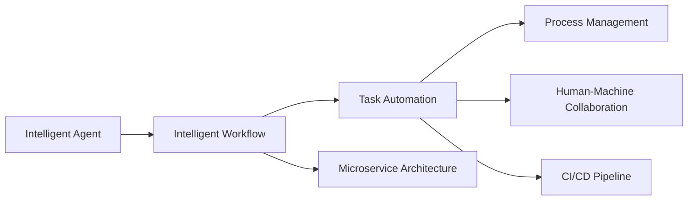
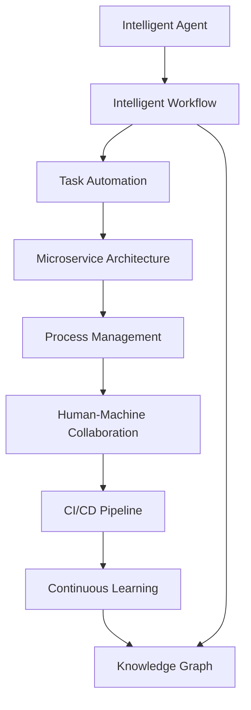

                 

# AI人工智能代理工作流AI Agent WorkFlow：设计智能任务处理流程

> 关键词：人工智能代理(AI Agent), 智能工作流, 任务自动化, 微服务架构, 流程管理, 人机协作, 持续集成(CI), 持续交付(CD)

## 1. 背景介绍

### 1.1 问题由来
随着信息技术的发展和自动化水平的提升，各行各业逐渐开始利用人工智能技术优化其工作流程。例如，金融行业通过智能投顾优化投资决策流程，制造业借助机器人自动化生产线，企业用聊天机器人提升客户服务效率。然而，复杂的业务流程和异构数据源使得这些人工智能应用难以全面协同，导致功能割裂、信息孤岛和运营效率低下等问题。

在这样的背景下，智能代理(AI Agent)应运而生，通过整合各种人工智能技术，能够有效协调、优化业务流程，使得各个环节无缝衔接，形成闭环智能化系统，从而大幅提升业务效率和用户满意度。

### 1.2 问题核心关键点
智能代理核心概念在于它是一个集成多个智能组件的体系架构，能够实现自主化的任务处理、人机协作和持续优化。这些组件包括：

- **智能决策引擎**：利用机器学习、自然语言处理等技术，自动分析和决策任务执行路径。
- **工作流引擎**：实现任务流程的自动化编排、调度和监控。
- **知识图谱**：整合多源数据，形成知识库，支持任务推理和逻辑分析。
- **接口与集成**：通过标准化的API和协议，实现与企业已有系统集成，支撑任务自动化执行。
- **用户界面(UI)**：提供友好的操作界面，方便用户操作和管理。

这些核心组件相互作用，构建起完整的智能代理工作流，帮助企业实现业务流程的全生命周期管理和智能化。

### 1.3 问题研究意义
智能代理及其工作流的研发与应用，对于企业信息化转型、数字化运营、提升客户体验具有重要意义：

1. **提升运营效率**：自动化执行任务流程，缩短处理时间，降低人力成本。
2. **增强业务洞察**：通过智能决策引擎，提供精准的数据分析与决策支持。
3. **优化资源配置**：合理调配资源，最大化资源利用效率。
4. **提高客户满意度**：智能客服、财务处理等自动化应用，提升客户服务质量和满意度。
5. **加速创新迭代**：持续学习和适应，快速响应市场变化，提升企业竞争力。

## 2. 核心概念与联系

### 2.1 核心概念概述

为了更好地理解智能代理工作流的构建，本节将介绍几个关键概念：

- **智能代理(AI Agent)**：指利用人工智能技术，自主执行复杂任务的智能软件实体。它能够理解自然语言指令，具备决策、规划和执行功能。

- **智能工作流**：指一个能够自动调度、协调、监控任务流程的集成架构，包含数据流、控制流和工作流引擎等元素。

- **任务自动化**：指通过智能代理实现对具体任务的自动化执行，通过定义清晰的规则和流程，实现任务处理的标准化和自动化。

- **微服务架构**：一种灵活的架构模式，将大型应用拆分为多个小型、可独立部署的服务，每个服务负责单一功能，便于协同和扩展。

- **流程管理**：通过系统工具对任务流程进行规划、执行、监控和优化，支持流程的定义、调度、审计等功能。

- **人机协作**：指智能代理与人类用户之间的交互协同，通过自然语言理解、对话生成等技术，增强系统易用性和用户体验。

- **持续集成(CI)与持续交付(CD)**：通过自动化测试、部署和监控，实现快速迭代、高效交付和持续优化，提升系统稳定性和用户体验。

这些核心概念通过合理的组合，形成智能代理及其工作流的完整架构，使智能代理能够在实际业务场景中发挥作用。

### 2.2 概念间的关系

这些核心概念之间的联系可以通过以下Mermaid流程图来展示：



这个流程图展示了几大核心概念之间的联系：

1. 智能代理利用智能工作流自动化执行任务，通过微服务架构实现灵活部署和扩展。
2. 任务自动化通过定义规则和流程，确保任务执行的标准化和自动化。
3. 流程管理对任务流程进行全面的规划、监控和优化，支持自动化流程的部署和执行。
4. 人机协作通过自然语言理解和对话生成，增强系统与用户的交互体验。
5. 持续集成和持续交付通过自动化测试和部署，提升系统的稳定性和交付效率。

这些概念共同构成了智能代理工作流的基本框架，为构建智能系统的基础组件提供参考。

### 2.3 核心概念的整体架构

最后，我们用一个综合的流程图来展示这些核心概念在大规模智能代理工作流中的应用：



这个综合流程图展示了从智能代理设计到任务执行的全过程：

1. 智能代理在智能工作流的调度下，自动执行任务。
2. 任务自动化通过微服务架构，实现灵活的任务执行和扩展。
3. 流程管理对整个工作流进行全面监控和优化。
4. 人机协作通过自然语言理解和对话生成，提供友好的用户交互体验。
5. 持续集成和持续交付通过自动化测试和部署，提升系统稳定性和交付效率。
6. 持续学习通过反馈机制，不断优化智能代理的执行策略。
7. 知识图谱整合多源数据，提供丰富的知识库支持。

通过这些组件的有机结合，智能代理工作流能够高效、准确地处理复杂任务，提升企业的运营效率和用户体验。

## 3. 核心算法原理 & 具体操作步骤
### 3.1 算法原理概述

智能代理工作流的核心算法原理主要涉及以下几个方面：

- **自然语言处理(NLP)**：通过语义分析、实体识别等技术，理解用户指令，提取任务信息。
- **机器学习与推理**：利用分类、回归等机器学习算法，分析任务执行路径，优化决策过程。
- **数据管理与融合**：通过数据清洗、标准化和集成技术，形成统一的、高质量的数据源。
- **流程编排与监控**：通过工作流引擎，自动编排任务流程，实时监控执行状态。
- **人机交互与协作**：通过对话生成、自然语言理解等技术，实现与用户的自然交互。

这些算法原理通过合理的组合，使得智能代理能够在实际应用中发挥作用，实现任务的自动化处理和优化。

### 3.2 算法步骤详解

基于上述核心算法原理，智能代理工作流的构建一般包括以下几个关键步骤：

**Step 1: 需求分析与设计**

- 收集业务需求，定义智能代理的功能和目标。
- 设计智能代理的结构和组件，包括决策引擎、工作流引擎、知识图谱等。
- 确定与现有系统的集成方式，包括API接口、数据源集成等。

**Step 2: 数据收集与预处理**

- 收集相关数据，包括业务数据、用户数据、市场数据等。
- 进行数据清洗、标准化、去重等预处理操作，确保数据质量。
- 构建知识图谱，整合多源数据，形成统一的知识库。

**Step 3: 模型训练与优化**

- 利用机器学习算法，训练智能代理的决策模型。
- 对模型进行优化，如模型压缩、特征工程等，提高模型效率和精度。
- 进行模型评估，确保模型在新数据上的泛化能力。

**Step 4: 工作流设计与实现**

- 设计任务流程，确定各个组件之间的协同关系。
- 实现工作流引擎，支持任务调度、监控和异常处理。
- 实现任务自动化，定义规则和流程，实现任务的标准化和自动化。

**Step 5: 人机交互与测试**

- 实现人机交互界面，支持自然语言指令输入和结果输出。
- 进行系统测试，包括单元测试、集成测试、性能测试等，确保系统稳定性和可靠性。
- 收集用户反馈，进行系统优化和改进。

**Step 6: 部署与运维**

- 将智能代理系统部署到生产环境。
- 持续监控系统性能和异常，进行故障排查和修复。
- 定期进行系统更新和升级，确保系统的稳定性和安全性。

### 3.3 算法优缺点

智能代理工作流具有以下优点：

- **自动化程度高**：通过智能代理，能够自动化执行复杂的任务流程，提升效率和准确性。
- **灵活可扩展**：通过微服务架构，支持模块化和灵活的扩展，满足不断变化的业务需求。
- **协同高效**：通过工作流引擎，实现组件间的协同和调度，提升系统整体效率。
- **用户友好**：通过自然语言理解和对话生成技术，提供友好的用户交互体验，增强系统易用性。

然而，智能代理工作流也存在一些缺点：

- **依赖于高质量数据**：数据质量直接影响智能代理的决策效果，需要高质量的数据源和预处理流程。
- **复杂度较高**：构建和维护智能代理工作流需要较高的技术水平和专业知识。
- **安全性和隐私风险**：处理大量敏感数据时，需要考虑数据安全和隐私保护问题。
- **持续优化需求**：需要持续收集用户反馈和业务数据，进行模型优化和流程改进。

### 3.4 算法应用领域

智能代理工作流已经在多个领域得到了广泛应用，包括但不限于：

- **金融行业**：智能投顾、风险评估、客户服务等。
- **制造业**：智能生产线、设备维护、质量控制等。
- **医疗健康**：智能诊断、健康监测、药物推荐等。
- **零售行业**：智能推荐、库存管理、客户服务自动化等。
- **教育领域**：智能辅导、作业批改、课程推荐等。

## 4. 数学模型和公式 & 详细讲解 & 举例说明

### 4.1 数学模型构建

智能代理工作流涉及多个子模型，例如：

- **自然语言处理模型**：用于理解用户指令和生成响应。
- **决策模型**：用于分析和决策任务执行路径。
- **流程管理模型**：用于规划和监控任务流程。
- **知识图谱模型**：用于整合和推理多源数据。

这些模型通过合理设计，构成智能代理工作流的整体架构，确保系统的高效运行和优化能力。

### 4.2 公式推导过程

以自然语言处理模型为例，下面详细介绍其中的数学模型和公式推导：

自然语言处理模型的目标是将自然语言文本转换为计算机可处理的向量表示，常用的模型包括Word2Vec、BERT等。

以BERT模型为例，其输入为自然语言文本 $x$，输出为向量表示 $z$。BERT模型的输入层包含嵌入层、池化层和全连接层，具体计算过程如下：

$$
z = \text{BERT}(x) = f(\text{Embedding}(x), \text{Pooling}(\text{Embedding}(x)), \text{FC}(\text{Pooling}(\text{Embedding}(x))))
$$

其中，Embedding层将文本转换为向量表示，Pooling层对向量进行池化，FC层进行最后的全连接处理。

### 4.3 案例分析与讲解

以智能客服为例，展示智能代理工作流在实际应用中的实现：

1. **需求分析与设计**：收集用户咨询数据，定义智能客服的功能和目标，设计智能客服的架构和组件。

2. **数据收集与预处理**：收集历史咨询记录、用户行为数据等，进行数据清洗和标准化，构建知识图谱。

3. **模型训练与优化**：利用机器学习算法训练分类模型，优化模型参数，提高分类精度。

4. **工作流设计与实现**：设计咨询流程，实现对话生成和自然语言理解，实现任务自动化。

5. **人机交互与测试**：实现用户界面，进行系统测试，收集用户反馈。

6. **部署与运维**：将智能客服系统部署到生产环境，进行持续监控和优化。

通过以上步骤，智能客服系统能够自动处理用户咨询，提高客户服务效率和满意度。

## 5. 项目实践：代码实例和详细解释说明

### 5.1 开发环境搭建

在进行智能代理工作流实践前，需要先搭建好开发环境。以下是使用Python和Flask构建智能客服系统的环境配置流程：

1. 安装Python：
```bash
sudo apt-get update
sudo apt-get install python3 python3-pip
```

2. 安装Flask：
```bash
pip install Flask
```

3. 安装BERT模型：
```bash
pip install transformers
```

4. 安装其他必要的库：
```bash
pip install pandas numpy torch sklearn joblib
```

完成上述步骤后，即可在Python环境中开始智能客服系统的开发。

### 5.2 源代码详细实现

以下是一个简单的智能客服系统的Python代码实现：

```python
from flask import Flask, request, jsonify
import torch
from transformers import BertTokenizer, BertForSequenceClassification
import pandas as pd
import numpy as np

app = Flask(__name__)

# 加载BERT模型和分词器
tokenizer = BertTokenizer.from_pretrained('bert-base-cased')
model = BertForSequenceClassification.from_pretrained('bert-base-cased', num_labels=3)

# 定义处理咨询请求的函数
@app.route('/consult', methods=['POST'])
def handle_consult():
    consult_text = request.json['text']
    
    # 将咨询文本转换为向量表示
    inputs = tokenizer.encode(consult_text, add_special_tokens=True, max_length=256, return_tensors='pt')
    outputs = model(inputs)
    labels = torch.argmax(outputs, dim=1).tolist()
    
    # 将标签转换为自然语言
    label_map = {0: 'helpdesk', 1: 'support', 2: 'error'}
    consult_label = [label_map[label] for label in labels]
    
    # 返回咨询标签
    return jsonify({'label': consult_label[0]})

if __name__ == '__main__':
    app.run(debug=True)
```

该代码实现了一个简单的智能客服系统，通过API接收用户咨询文本，使用BERT模型进行分类，并返回预测的咨询标签。

### 5.3 代码解读与分析

让我们再详细解读一下关键代码的实现细节：

**Flask框架**：
- 使用Flask框架搭建Web服务，通过API接收和响应用户请求。
- 实现一个处理咨询请求的函数，通过API接收用户文本。
- 利用BERT模型对文本进行分类，输出预测标签。
- 将标签转换为自然语言，返回给用户。

**BERT模型**：
- 使用PyTorch和Hugging Face的Transformers库，加载预训练的BERT模型。
- 通过分词器将用户文本转换为向量表示。
- 利用模型对向量进行分类，输出预测标签。
- 将标签转换为自然语言，返回给用户。

**代码解读**：
- 使用Flask搭建Web服务，实现处理咨询请求的函数。
- 通过API接收用户文本，使用BERT模型进行分类，并返回预测标签。
- 将标签转换为自然语言，返回给用户。

### 5.4 运行结果展示

假设我们在测试环境下运行上述代码，可以期望得到如下结果：

```json
{
  "label": "helpdesk"
}
```

这表明智能客服系统能够正确处理用户咨询，并返回预测的咨询标签。在实际应用中，我们还可以进一步扩展系统功能，增加用户界面、集成数据源等，以实现更加智能和全面的客户服务系统。

## 6. 实际应用场景

### 6.1 智能客服系统

智能客服系统在金融、零售、医疗等多个行业得到了广泛应用，帮助企业提升客户服务效率和用户满意度。

**金融行业**：通过智能客服系统，金融企业能够自动处理用户咨询，提供投资建议、风险评估等服务，提升客户体验。

**零售行业**：智能客服系统能够提供个性化推荐、库存查询、订单处理等服务，提高销售效率和客户满意度。

**医疗行业**：智能客服系统能够提供健康咨询、诊疗建议、药品推荐等服务，改善患者体验。

**教育行业**：智能客服系统能够提供课程推荐、作业批改、在线答疑等服务，提升教学效果和学生满意度。

### 6.2 供应链管理

智能代理工作流在供应链管理中也有广泛应用，帮助企业优化生产计划、库存管理、物流调度等环节。

**生产计划优化**：通过智能代理系统，企业能够实时监控生产数据，自动调整生产计划，优化资源利用率。

**库存管理**：智能代理系统能够预测库存需求，自动调整订单和库存量，减少库存成本和缺货风险。

**物流调度**：智能代理系统能够优化物流路径和运输方式，提升物流效率和降低成本。

### 6.3 智能制造

智能代理工作流在智能制造领域也有广泛应用，帮助企业实现自动化生产、质量控制、设备维护等。

**自动化生产**：通过智能代理系统，企业能够自动控制生产设备，实现无人化生产，提高生产效率和产品质量。

**质量控制**：智能代理系统能够实时监控生产数据，自动检测产品缺陷，提升产品质量和客户满意度。

**设备维护**：智能代理系统能够预测设备故障，自动生成维护计划，减少停机时间和维护成本。

## 7. 工具和资源推荐

### 7.1 学习资源推荐

为了帮助开发者系统掌握智能代理工作流的理论基础和实践技巧，这里推荐一些优质的学习资源：

1. **自然语言处理**：
   - 《自然语言处理综论》：介绍自然语言处理的基本概念、技术和应用。
   - 《深度学习与自然语言处理》：介绍深度学习在自然语言处理中的应用。

2. **机器学习**：
   - 《机器学习实战》：介绍机器学习的基本算法和应用。
   - 《Python机器学习》：介绍机器学习在Python中的实现。

3. **持续集成与持续交付**：
   - 《持续集成：软件开发的最佳实践》：介绍持续集成和持续交付的基本原理和实现方法。
   - 《持续交付实践》：介绍持续交付在软件开发中的应用。

4. **微服务架构**：
   - 《微服务架构：构建可扩展的应用系统》：介绍微服务架构的基本概念、技术和应用。
   - 《微服务模式》：介绍微服务模式的实现和最佳实践。

### 7.2 开发工具推荐

高效的工具能够提升开发效率和质量，以下是几款常用的开发工具：

1. **Jupyter Notebook**：交互式的Python开发环境，支持代码运行、数据可视化等功能。
2. **Git**：版本控制系统，支持代码管理和协作。
3. **Docker**：容器化技术，支持应用打包和部署。
4. **Kubernetes**：容器编排系统，支持应用自动扩展和运维。
5. **OpenAI GPT**：先进的自然语言生成模型，支持文本生成、对话生成等功能。

### 7.3 相关论文推荐

智能代理工作流的研究涉及多个学科领域，以下是几篇奠基性的相关论文，推荐阅读：

1. **Jacques et al. "Autonomous Agents in Multi-Agent Systems"**：介绍自主代理的基本概念和实现方法。
2. **Morris et al. "Process Mining: Foundations and Applications"**：介绍流程挖掘的基本原理和应用。
3. **Yan et al. "A Survey on Recent Advances in Agent Systems"**：综述智能代理系统的最新进展和应用。
4. **De Meyer et al. "Proceedings of the IEEE"**：综述智能代理系统的最新研究和发展。

这些论文代表了大规模智能代理工作流的发展脉络，通过学习这些前沿成果，可以帮助研究者把握学科前进方向，激发更多的创新灵感。

除上述资源外，还有一些值得关注的前沿资源，帮助开发者紧跟智能代理工作流技术的最新进展，例如：

1. **arXiv论文预印本**：人工智能领域最新研究成果的发布平台，包括大量尚未发表的前沿工作，学习前沿技术的必读资源。
2. **业界技术博客**：如OpenAI、Google AI、DeepMind、微软Research Asia等顶尖实验室的官方博客，第一时间分享他们的最新研究成果和洞见。
3. **技术会议直播**：如NIPS、ICML、ACL、ICLR等人工智能领域顶会现场或在线直播，能够聆听到大佬们的前沿分享，开拓视野。
4. **GitHub热门项目**：在GitHub上Star、Fork数最多的智能代理系统项目，往往代表了该技术领域的发展趋势和最佳实践，值得去学习和贡献。
5. **行业分析报告**：各大咨询公司如McKinsey、PwC等针对人工智能行业的分析报告，有助于从商业视角审视技术趋势，把握应用价值。

总之，对于智能代理工作流技术的学习和实践，需要开发者保持开放的心态和持续学习的意愿。多关注前沿资讯，多动手实践，多思考总结，必将收获满满的成长收益。

## 8. 总结：未来发展趋势与挑战

### 8.1 研究成果总结

本文对智能代理工作流的构建进行了全面系统的介绍，从核心概念到具体实现，详细讲解了构建智能代理工作流的各个环节。通过实例展示，介绍了智能代理工作流在实际应用中的实现和优化。

通过本文的系统梳理，可以看到，智能代理工作流在企业信息化和数字化转型中扮演着重要角色，通过整合多种人工智能技术，实现任务的自动化处理和优化，提升了企业的运营效率和用户体验。

### 8.2 未来发展趋势

展望未来，智能代理工作流将呈现以下几个发展趋势：

1. **智能化程度提升**：智能代理将具备更强的自然语言理解、对话生成和推理能力，能够更准确地理解用户需求和执行任务。
2. **多模态融合**：智能代理将融合视觉、语音、文字等多种模态，提供更全面的交互体验和决策支持。
3. **自适应学习**：智能代理将具备自适应学习能力，能够根据用户行为和环境变化进行动态优化和调整。
4. **联邦学习**：通过联邦学习技术，智能代理能够在不共享数据的情况下，进行分布式训练和知识共享。
5. **边缘计算**：智能代理将部署在边缘计算设备上，实现低延迟、高可靠性的交互和决策。

### 8.3 面临的挑战

尽管智能代理工作流在应用中取得了显著效果，但在走向更广泛应用的过程中，仍面临以下挑战：

1. **数据隐私和安全**：智能代理处理大量用户数据，如何保护数据隐私和安全，是亟需解决的问题。
2. **系统可扩展性**：智能代理系统需要支持大规模的并发请求，如何实现系统的可扩展性和高性能，是技术瓶颈之一。
3. **复杂任务处理**：智能代理需要处理更复杂、更精细的任务，如多轮对话、实体识别、情感分析等，现有技术尚需进一步突破。
4. **跨领域应用**：不同行业领域的业务需求差异较大，如何将智能代理应用于更多行业领域，仍需探索和实践。
5. **持续优化**：智能代理需要不断优化和迭代，如何高效地进行持续优化和模型更新，仍需进一步探索。

### 8.4 研究展望

面对智能代理工作流面临的挑战，未来的研究需要在以下几个方面寻求新的突破：

1. **数据隐私保护**：开发数据隐私保护技术，确保用户数据的安全性和匿名性。
2. **系统可扩展性**：采用分布式计算和边缘计算技术，提升系统的可扩展性和高性能。
3. **复杂任务处理**：深入研究多轮对话、实体识别、情感分析等复杂任务的处理方法，提升智能代理的决策能力。
4. **跨领域应用**：开发通用的智能代理框架，支持跨领域的任务自动化处理。
5. **持续优化**：采用自适应学习和联邦学习技术，实现智能代理的持续优化和知识共享。

这些研究方向将引领智能代理工作流技术的发展，推动其在更多行业领域的应用和普及。相信随着技术的不断进步和创新，智能代理工作流必将在构建智能系统的过程中发挥更大的作用，提升企业的运营效率和用户体验。

## 9. 附录：常见问题与解答

**Q1: 智能代理与传统自动化流程的区别是什么？**

A: 智能代理与传统自动化流程的主要区别在于智能代理能够理解自然语言指令，具备自主决策和执行能力。它能通过自然语言理解技术，自动分析任务需求，执行复杂的多步骤任务。而传统自动化流程则需要人工编写详细的执行步骤和规则，依赖固定的输入输出，缺乏灵活性和智能性。

**Q2: 如何选择合适的智能代理架构？**

A: 选择合适的智能代理架构需要考虑多个因素，包括任务复杂度、数据量、系统可靠性等。常见的架构包括集中式、分布式、微服务等。集中式架构适用于任务相对简单、数据量较小的情况；分布式架构适用于任务复杂、数据量大的情况；微服务架构适用于需要灵活扩展和模块化开发的情况。

**Q3: 如何提高智能代理的鲁棒性？**

A: 提高智能代理的鲁棒性需要从数据、算法和系统三个方面入手。数据方面，需要清洗和标准化数据，确保数据质量；算法方面，需要采用鲁棒性较强的机器学习算法和模型；系统方面，需要设计容错机制和异常处理流程，确保系统稳定性和可靠性。

**Q4:

